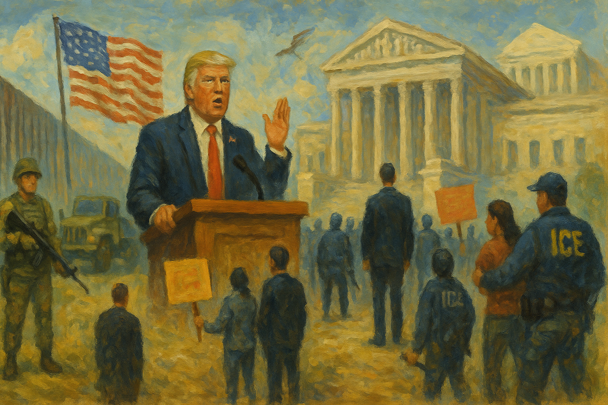

<!-- Generated by build_publish_week_v1 (appendix post) -->
<!-- Header image: image_wide_week1_appendix.png -->

# Week 1 Appendix: Emergencies as Operating System

*In Trump’s first week back in office, overlapping emergencies, purges, and decrees turn the presidency into a central engine of unilateral rule.*

This week represents an extraordinary shock to American democratic structure, driven by a dense cluster of Trump executive orders, personnel purges, and symbolic moves that together approximate a constitutional hard‑break. The most intense pressures fall on executive constraint, equal citizenship, rule of law, and the nonpartisan civil service. Trump declares overlapping national emergencies, militarizes the border, and openly defies statute and Supreme Court rulings (TikTok delay), while re‑imposing Schedule F and firing inspectors general and senior career officials, effectively subordinating the bureaucracy to personal loyalty. Simultaneously, he attempts to rewrite the Fourteenth Amendment by decree, stratifying citizenship by parentage, and launches a sweeping anti‑immigrant regime: CBP One is shut down, asylum and refugee programs suspended, expedited removals expanded, and sanctuary jurisdictions threatened with prosecution. Mass pardons for January 6 and FACE Act offenders, plus a pause on Foreign Corrupt Practices Act enforcement, signal that violence and corruption in service of the regime will be protected. Parallel moves dismantle DEI, revoke long‑standing anti‑discrimination orders, and weaponize abortion and gender policy, while fossil‑fuel and crypto orders entrench crony capitalism. Courts, states, civil society, and some Republicans do push back—blocking birthright changes, suing DOGE and Schedule F, and organizing opposition—but they are reacting to a coordinated, high‑velocity consolidation of presidential power.

Power and Authority

1. President Joe Biden commuted Leonard Peltier’s life sentence to home confinement (2025-01-20): The commutation for Indigenous activist Leonard Peltier addressed long‑criticized prosecutorial misconduct and raised expectations that executive clemency can be used to correct historic injustices in politically sensitive cases.

2. President Joe Biden issued protective pardons and commutations for family members and Trump critics (2025-01-20): Biden’s end‑of‑term pardons for relatives, January 6 investigators, and officials like Milley and Fauci used clemency power pre‑emptively to shield perceived political targets from anticipated prosecutions by the incoming administration.

3. President Joe Biden and Vice President Kamala Harris publicly declared the Equal Rights Amendment to be law despite lack of ratification (2025-01-20): The administration’s inaccurate claim that the Equal Rights Amendment was already law blurred constitutional procedure and highlighted how symbolic assertions by top officials can misstate the status of formal rights protections.

4. President Donald Trump was inaugurated for a second term and delivered a populist inaugural address (2025-01-20): Trump’s second inauguration, framed as a “liberation day” and laced with false claims about elections and government weaponization, set a confrontational tone for executive‑legislative relations and public trust in institutions.

5. President Donald Trump declared a national emergency at the US‑Mexico border and ordered military involvement (2025-01-20): Trump’s border emergency declarations enabled troop deployments and wall construction while bypassing Congress, normalizing emergency rule for routine policy disputes and expanding presidential control over immigration enforcement.

6. President Donald Trump issued an order redefining and restricting birthright citizenship (2025-01-20): Trump’s executive order to deny automatic citizenship to many US‑born children directly challenged the Fourteenth Amendment, testing whether a president can unilaterally narrow constitutional membership in the political community.

7. President Donald Trump issued sweeping pardons and commutations for January 6 defendants and related offenders (2025-01-20): By pardoning or commuting sentences for more than 1,500 January 6 participants and ordering pending cases dropped, Trump used clemency to erase accountability for an attack on the transfer of power and to reward loyal offenders.

8. President Donald Trump ordered investigations into alleged weaponization and censorship by the prior administration (2025-01-20): Trump’s directives for DOJ and intelligence leaders to probe supposed censorship and political targeting under Biden repurposed investigative powers toward retribution, risking politicization of law enforcement against former officials and critics.

9. President Donald Trump reinstated and expanded Schedule F to reclassify policy‑influencing civil servants (2025-01-20): Recreating Schedule F and removing protections for thousands of career officials allowed Trump to purge perceived disloyal staff and replace expertise with political loyalists, weakening bureaucratic independence from presidential will.

10. President Donald Trump terminated federal diversity, equity and inclusion programs and offices (2025-01-20): Trump’s orders abolishing DEI structures across the federal government reversed long‑standing anti‑discrimination efforts and signaled that equity work by civil servants could trigger discipline, reshaping who feels protected in public employment.

11. President Donald Trump issued an order redefining gender in federal policy as strictly male or female from conception (2025-01-20): By mandating binary, conception‑based sex definitions in federal law, Trump’s gender ideology order curtailed recognition of transgender and non‑binary people and embedded fetal personhood language with potential implications for abortion law.

12. President Donald Trump declared a national energy emergency to accelerate fossil fuel development (2025-01-20): The energy emergency declaration empowered agencies to fast‑track drilling, pipelines and export approvals, using crisis framing to override environmental safeguards and entrench executive discretion over long‑term energy choices.

13. President Donald Trump withdrew the United States from the Paris climate agreement (2025-01-20): Trump’s renewed withdrawal from the Paris accord removed federal commitment to multilateral climate targets, weakening international coordination and signaling that major climate policy can be reversed by unilateral executive action.

14. President Donald Trump ordered US withdrawal from the World Health Organization (2025-01-20): By initiating US exit from the WHO and halting contributions, Trump used executive authority to pull the country out of a key global health body, reducing multilateral oversight over US health policy and pandemic cooperation.

15. President Donald Trump directed DOJ not to enforce the statutory TikTok ban for a fixed period (2025-01-20): Trump’s order pausing enforcement of a congressionally mandated TikTok divest‑or‑ban law, despite a Supreme Court ruling, asserted presidential discretion over statutory execution and raised questions about selective obedience to judicial decisions.

16. President Donald Trump signed an order restoring the federal death penalty and urging reversal of limiting precedents (2025-01-20): Restoring federal executions and instructing DOJ to seek reversal of Supreme Court limits on capital punishment expanded executive influence over life‑and‑death criminal sanctions and signaled a more punitive federal justice posture.

17. President Donald Trump revoked security clearances of dozens of former intelligence officials and John Bolton (2025-01-20): Targeting former officials for clearance revocation over alleged 2020 election interference used classification authority to punish critics and could chill future intelligence professionals from publicly challenging presidential narratives.

18. President Donald Trump issued an order ending US participation in international environmental and climate finance agreements (2025-01-20): By revoking US climate finance commitments and prioritizing domestic fossil interests in environmental treaties, Trump centralized foreign‑economic climate decisions in the presidency and weakened external checks on US emissions policy.

19. President Donald Trump suspended the US Refugee Admissions Program and halted most refugee resettlement (2025-01-20): Suspending refugee admissions by executive order allowed Trump to unilaterally override congressionally supported humanitarian programs, concentrating control over who may seek refuge in the US in the White House.

20. President Donald Trump ordered construction of additional border wall segments (2025-01-20): Resuming border wall construction by executive order reallocated federal resources toward a contested security project without new legislation, reinforcing presidential control over physical border policy and land use.

21. President Donald Trump created the Department of Government Efficiency under White House control (2025-01-20): Establishing DOGE inside the Executive Office centralized cross‑agency technology and process reforms under presidential aides and outside normal agency chains, increasing direct White House leverage over day‑to‑day administration.

22. President Donald Trump issued an order making independent regulatory agencies answerable to the White House (2025-01-20): Requiring independent regulators to submit priorities and budgets for presidential approval eroded their statutory autonomy and concentrated rule‑writing power in the executive, weakening checks designed by Congress.

23. President Donald Trump ordered a government‑wide review to rescind regulations and advisory bodies deemed inconsistent with his agenda (2025-01-20): The directive for agencies to work with DOGE to cull regulations and advisory committees gave the president broad influence over which expert inputs and safeguards remain in place, shifting rulemaking toward political loyalty.

24. President Donald Trump fired Coast Guard Commandant Linda Fagan and other senior security officials (2025-01-21): Removing the Coast Guard’s first female commandant and other leaders over perceived DEI emphasis and immigration priorities signaled that top security posts depend on ideological alignment with the president, not professional norms.

25. President Donald Trump removed and reassigned senior Justice Department national security and criminal division officials (2025-01-21): Trump’s reshuffling of top DOJ career leaders in sensitive divisions weakened internal continuity and signaled that prosecutorial leadership would be judged by political loyalty, not independence.

26. President Donald Trump sidelined about 160 National Security Council career staff (2025-01-22): Marginalizing large numbers of NSC professionals reduced expert input into foreign and security decisions and concentrated sensitive policy advice among a smaller, more politically aligned circle.

27. President Donald Trump fired inspectors general at at least 12 major federal agencies (2025-01-24): The mass removal of agency inspectors general, reportedly without the statutory 30‑day notice to Congress, stripped internal watchdogs across government and sharply reduced institutional capacity to investigate executive misconduct.

28. President Donald Trump threatened to prosecute former President Joe Biden (2025-01-22): Publicly suggesting that his predecessor could face prosecution, Trump used the prospect of criminal law against a rival, reinforcing fears that prosecutorial power may be wielded as a political weapon.

29. President Donald Trump announced intent to abolish or radically shrink FEMA and condition disaster aid on politics (2025-01-22): By floating abolition of FEMA and tying relief funds to political considerations, Trump signaled willingness to use disaster response as leverage over states, undermining neutral federal support in emergencies.

30. President Donald Trump signed orders enforcing the Hyde Amendment and reinstating the global gag rule on abortion funding (2025-01-24): Trump’s abortion‑related orders barred federal and many foreign aid funds from supporting abortion services or advocacy, using executive power to narrow reproductive access domestically and abroad without new legislation.

31. President Donald Trump froze disbursement of Inflation Reduction Act and Bipartisan Infrastructure Act funds (2025-01-23): Suspending already‑authorized infrastructure and clean‑energy spending allowed Trump to unilally stall congressionally approved investments, shifting budgetary power from the legislature to the executive.

32. President Donald Trump directed the Department of Defense to deploy 1,500 active‑duty troops to the southern border (2025-01-23): Ordering thousands of active‑duty troops to support immigration enforcement at the border blurred lines between military and civilian roles and expanded presidential use of the armed forces in domestic policy.

33. President Donald Trump issued a memorandum to reroute California water supplies under the banner of “Putting People over Fish” (2025-01-23): Trump’s California water directive sought to override state and environmental constraints on delta flows, asserting federal control over contested resources and prioritizing favored economic interests over negotiated ecological protections.

34. President Donald Trump threatened to condition California wildfire aid on voter ID laws and water policy changes (2025-01-24): By tying disaster relief to adoption of voter ID and water policy concessions, Trump used federal emergency support as leverage to influence state election rules and environmental governance.

35. President Donald Trump signed an order establishing a FEMA Review Council to reassess the agency (2025-01-24): Creating a FEMA Review Council to examine the agency’s impartiality and structure opened the door to restructuring or downsizing national disaster management under close presidential direction.

36. President Donald Trump issued a series of rapid executive orders across immigration, climate, health, and digital policy (2025-01-23): The sheer volume and breadth of Trump’s first‑week orders—from asylum suspensions to WHO exit and digital‑asset policy—created deliberate policy whiplash that strained oversight capacity and consolidated agenda‑setting in the presidency.

Institutions and Governance

1. US Senate and House of Representatives passed the Laken Riley Act mandating detention of certain undocumented immigrants (2025-01-22): The Laken Riley Act, soon to reach Trump’s desk, expanded mandatory detention and empowered state attorneys general to sue the federal government, shifting immigration discretion away from agencies and raising due‑process concerns.

2. US Senate confirmed Marco Rubio as Secretary of State (2025-01-20): Rubio’s near‑unanimous confirmation as Secretary of State quickly filled a key foreign‑policy post, signaling Senate willingness to endorse Trump’s “America First” diplomatic agenda despite broader institutional tensions.

3. US Senate advanced Pete Hegseth’s nomination for Secretary of Defense despite serious allegations (2025-01-24): The Senate’s movement toward confirming Pete Hegseth, amid affidavits and reports of aggression, extremism, and mismanagement, highlighted how partisan loyalty can outweigh vetting norms for control of the Pentagon.

4. House Republican leadership created a new select subcommittee to re‑investigate January 6 (2025-01-22): Forming a new January 6 panel under GOP control, shortly after mass pardons, positioned Congress to challenge prior factual findings and potentially recast an attack on certification as victimization of Trump supporters.

5. Mississippi State Representative Justin Keen introduced a bill to create an Illegal Alien Certified Bounty Hunter Program (2025-01-23): The proposed Mississippi bounty‑hunter scheme would pay civilians per deportation, formalizing vigilante‑style enforcement and raising risks of abuse and racial profiling under color of state law.

6. Representative Andy Ogles introduced a constitutional amendment to allow a third presidential term for Donald Trump (2025-01-23): Ogles’s resolution to relax the 22nd Amendment specifically for Trump signaled an organized effort inside Congress to weaken presidential term limits and personalize constitutional rules around one leader.

7. House DOGE committee chaired by Marjorie Taylor Greene began work with a mandate seen as targeting federal agencies and safety nets (2025-01-21): The new House DOGE committee, criticized for excluding Republican women and aiming to dismantle agencies and social programs, illustrated how oversight structures can be designed to advance ideological downsizing rather than neutral review.

8. National Treasury Employees Union sued the Trump administration over the Schedule F reclassification order (2025-01-21): The NTEU lawsuit argued that reclassifying thousands of civil servants as at‑will political appointees violated due‑process protections, using the courts to contest executive attempts to politicize the federal workforce.

9. National Security Counselors and other plaintiffs filed lawsuits challenging the legality and transparency of the DOGE program (2025-01-20): Litigation claiming DOGE functions as an unregulated federal advisory committee sought to force balanced representation, record‑keeping, and public access, testing whether new White House‑centric structures must obey transparency law.

10. California and a coalition of states and cities sued to block Trump’s birthright citizenship order as unconstitutional (2025-01-23): State and local governments challenged Trump’s attempt to narrow birthright citizenship, asserting that only Congress and the Constitution can define national membership and that the order would harm residents and state systems.

11. Federal district courts issued temporary restraining orders blocking Trump’s birthright citizenship order (2025-01-23): Federal judges in Washington and Washington State halted implementation of Trump’s citizenship order, calling it blatantly unconstitutional and underscoring the judiciary’s role as a check on unilateral constitutional reinterpretation.

12. Federal Election Commission scheduled a closed Sunshine Act meeting on enforcement and compliance matters (2025-01-23): The FEC’s closed meeting to discuss enforcement, personnel, and litigation highlighted ongoing but opaque oversight of campaign‑finance compliance at a moment of heightened concern about money and influence in elections.

13. Ohio legislature enacted a law allowing high fees for access to police body‑camera and video records (2025-01-24): Ohio’s new law permitting departments to charge up to $750 for body‑cam footage erected financial barriers to obtaining police records, weakening practical transparency and public oversight of law enforcement.

14. US Election Assistance Commission corrected a notice regarding the National Mail Voter Registration Form (2025-01-22): The EAC’s correction to its Federal Register notice on the national registration form clarified its information‑collection process, supporting procedural accuracy in federal guidance on voter registration.

15. Federal courts and Purdue Pharma oversaw a $7.4 billion settlement restructuring Purdue Pharma over the opioid crisis (2025-01-23): The Purdue–Sackler settlement, requiring family members to relinquish control and fund remediation, illustrated how mass‑tort litigation can impose accountability on powerful firms for public‑health harms, albeit via negotiated compromise.

16. Federal district court barred Stewart Rhodes and other Oath Keepers from entering Washington DC without permission (2025-01-24): Release conditions restricting Rhodes and other January 6 defendants from entering the capital without court approval aimed to protect Congress and the city while balancing post‑conviction liberty interests.

17. Federal agencies including EPA, FCC, OSHA, FDA and DEA issued multiple routine regulatory approvals, corrections, and information‑collection notices (2025-01-21): A series of Federal Register actions on air quality plans, disaster reporting, product safety labs, and controlled‑substance manufacturing showed core regulatory machinery continuing to function despite broader political upheaval.

Economic Structure

1. President Donald Trump launched personal cryptocurrencies and promoted them while in office (2025-01-20): Trump’s launch and promotion of TRUMP and MELANIA coins, largely controlled by entities he owns, created a direct, opaque channel for speculative payments to the sitting president, blurring public office and private enrichment.

2. Major crypto exchanges Coinbase, Kraken and Robinhood listed and promoted the $TRUMP coin while under SEC scrutiny (2025-01-21): By aggressively marketing $TRUMP amid ongoing enforcement risks, large exchanges appeared to bet on regulatory leniency from the Trump administration, illustrating how firms may seek favorable treatment by amplifying presidential financial products.

3. President Donald Trump ordered creation of a sovereign wealth fund and a strategic bitcoin reserve (2025-01-20): New vehicles for national investment and bitcoin accumulation, funded partly through forfeitures, concentrated large pools of public capital under executive influence with limited detail on governance or safeguards against political use.

4. President Donald Trump issued orders reshaping trade policy through reciprocal tariffs and de minimis changes (2025-01-20): Trump’s tariff orders, including broad reciprocal duties and closing the de minimis loophole on Chinese imports, reoriented trade rules by executive fiat, with major implications for prices, supply chains, and foreign relations.

5. President Donald Trump suspended disbursement of major infrastructure and clean‑energy funds (2025-01-23): Freezing Inflation Reduction Act and Bipartisan Infrastructure Act spending allowed the White House to stall or redirect large, congressionally approved investments, injecting political discretion into long‑term economic development programs.

6. House Republicans proposed $2–3 trillion in spending cuts to finance new tax reductions (2025-01-23): The proposed reconciliation package of deep cuts, potentially affecting Social Security and Medicare, would shift fiscal burdens away from high‑income taxpayers and toward social programs, reshaping the social contract.

7. President Donald Trump publicly pressured the Federal Reserve Chair to lower interest rates (2025-01-22): Trump’s demands that the Fed cut rates, despite inflation risks, challenged central‑bank independence and suggested monetary policy should respond to presidential preferences rather than technocratic judgment.

8. Jared Kushner and Affinity Partners secured a $2 billion investment from Saudi Arabia’s sovereign wealth fund (2025-01-22): Saudi backing for Kushner’s fund, despite internal objections, raised concerns that foreign governments were rewarding a former senior White House adviser, potentially buying influence with the president’s inner circle.

9. Jared Kushner and the Trump Organization partnered on Trump Tower Belgrade and other foreign real‑estate deals (2025-01-22): New Trump‑branded developments on government‑linked land abroad, including in Serbia and Gulf states, created avenues for foreign governments to enrich the president’s business while his administration sets foreign policy.

10. The Trump Organization expanded merchandise sales tied to Trump’s return to the White House (2025-01-24): A surge of new products on Trump’s online store monetized his presidency directly, reinforcing concerns that official status is being used to drive private revenue streams for the president’s family business.

11. Elon Musk and SpaceX/Starlink offered “free” wildfire internet and donated Starlink kits with opaque terms and distribution (2025-01-20): Starlink’s wildfire offer required costly hardware and auto‑renewing subscriptions, and the unclear distribution of donated kits highlighted how high‑profile corporate relief can mask limited, poorly documented public benefit.

12. California state government implemented a $20 minimum wage for fast‑food workers (2025-01-22): California’s new sectoral minimum wage raised pay for low‑wage workers in a major industry, demonstrating how state‑level policy can counteract national trends toward weakened labor protections and inequality.

13. Indiana General Assembly introduced a bill to revoke tax‑exempt status for non‑profit hospitals overcharging patients (2025-01-22): The Indiana proposal to strip tax breaks from hospitals charging more than 200% of Medicare rates sought to tie non‑profit privileges to affordability, using tax law to discipline powerful health providers.

14. House Budget Director Ross Vought and allies moved to challenge the constitutionality of the Impoundment Control Act (2025-01-23): Questioning the Impoundment Control Act aimed to restore presidential power to withhold congressionally appropriated funds, shifting budgetary control from the legislature toward the executive branch.

15. North Carolina Republican leadership advanced budget priorities expected to favor the wealthy over struggling residents (2025-01-23): Analyses of NC Republicans’ budget plans suggested tax and spending choices that would deepen inequality, illustrating how state fiscal policy can entrench economic divides within a federal system.

16. US Congress and executive agencies continued implementing CHIPS Act, Inflation Reduction Act, and solar manufacturing incentives (2025-01-24): Ongoing reshoring of semiconductor, battery, and solar manufacturing under recent laws strengthened domestic industrial capacity and reduced dependence on foreign supply chains, bolstering economic resilience and strategic autonomy.

Civil Rights and Dissent

1. President Donald Trump ended use of the CBP One app and canceled tens of thousands of asylum appointments (2025-01-20): Shutting down CBP One and voiding scheduled border appointments abruptly cut off a key lawful pathway for asylum seekers, stranding many in dangerous conditions and undermining predictable access to protection.

2. President Donald Trump suspended asylum processing and refugee resettlement at the southern border (2025-01-22): Orders halting asylum claims and refugee resettlement, framed as responding to an “invasion,” sharply curtailed protections for people fleeing persecution and tested statutory and treaty obligations toward refugees.

3. Department of Homeland Security under President Donald Trump reinstated the Migrant Protection Protocols requiring asylum seekers to remain in Mexico (2025-01-21): Reviving “Remain in Mexico” forced many asylum seekers to wait in unsafe border cities with limited legal access, weakening practical ability to pursue claims despite formal rights on paper.

4. Department of Homeland Security under President Donald Trump expanded expedited removal and detention authority nationwide (2025-01-22): Nationwide expedited removal and directives to detain migrants without release increased the risk of deportations without full hearings, eroding due‑process protections for non‑citizens inside the US.

5. Department of Homeland Security under President Donald Trump authorized ICE arrests in and around churches, schools and other sensitive locations (2025-01-22): Ending long‑standing limits on enforcement in sensitive spaces exposed worshippers, students, and patients to immigration raids, heightening fear in immigrant communities and discouraging use of essential services.

6. US Department of Justice under President Donald Trump directed prosecutors to target sanctuary officials and oppose sanctuary city laws (2025-01-22): DOJ guidance to investigate and potentially charge state and local officials for “harboring” undocumented immigrants escalated conflict with sanctuary jurisdictions and threatened criminalization of local policy choices.

7. President Donald Trump announced plans for the largest mass deportation program in US history (2025-01-21): Trump’s pledge to deport millions of undocumented people, including long‑term residents, signaled a shift toward large‑scale, militarized removals that could separate families and chill immigrant communities’ participation in civic life.

8. President Donald Trump revoked protections and pathways for certain nationalities with US sponsors (2025-01-21): Ending parole programs for Cubans, Haitians, Nicaraguans and Venezuelans with sponsors closed legal avenues that had allowed them to live and work temporarily while seeking permanent status, increasing precarity for these groups.

9. President Donald Trump issued orders to intensify immigration enforcement and create Homeland Security task forces in all states (2025-01-20): New task forces and directives to prioritize immigration prosecutions expanded federal enforcement presence nationwide, increasing surveillance and legal exposure for undocumented residents and mixed‑status families.

10. President Donald Trump revoked Biden‑era protections for LGBTQ+ people and targeted gender‑affirming care (2025-01-20): Orders rescinding protections against LGBTQ+ discrimination and restricting gender‑affirming care for minors rolled back civil rights gains and signaled that access to health and recognition would depend on conformity to narrow gender norms.

11. President Donald Trump revoked Executive Order 11246 and related anti‑discrimination rules for federal contractors (2025-01-23): Repealing long‑standing requirements that federal contractors avoid discrimination in hiring weakened a major lever for enforcing equal opportunity in large swaths of the labor market tied to public funds.

12. President Donald Trump banned transgender athletes from women’s sports and narrowed Title IX interpretations (2025-01-20): Trump’s sports order directed agencies to treat trans girls and women as ineligible for female categories, using federal civil‑rights law to exclude a group from educational and athletic opportunities.

13. President Donald Trump ordered English‑only policies for federal language access and certain jobs (2025-01-20): Making English the official language and requiring truck drivers to speak English reduced language accommodations in public services and employment, disproportionately burdening linguistic minorities.

14. President Donald Trump issued orders to end alleged anti‑Christian bias and elevate Christian claims in federal policy (2025-01-20): Creating a taskforce to combat supposed anti‑Christian bias and reorienting civil‑rights enforcement toward protecting Christians risked privileging one faith in government decisions and weakening protections for religious minorities.

15. President Donald Trump pardoned anti‑abortion activists convicted under the FACE Act (2025-01-22): Clemency for activists convicted of obstructing clinic access signaled tolerance for coercive tactics around reproductive health facilities and may embolden future efforts to intimidate patients and providers.

16. US Department of Justice under President Donald Trump froze all civil rights division cases and barred new filings (2025-01-23): Halting DOJ civil‑rights litigation paused federal enforcement against discrimination in voting, policing, housing, and education, leaving vulnerable groups more dependent on uneven state protections.

17. US Department of Justice under President Donald Trump issued a memo halting new police reform consent decrees (2025-01-22): Stopping agreements to remedy patterns of police misconduct weakened a key federal tool for enforcing constitutional policing, especially in jurisdictions resistant to local reform.

18. Trump administration immigration authorities conducted aggressive ICE raids causing fear and disruption in communities (2025-01-21): New ICE operations, including raids in Newark and elsewhere, led to racial profiling concerns and depressed work and school attendance, illustrating how enforcement tactics can chill everyday civic participation.

19. Trump administration escalated deportation rhetoric and plans against undocumented people (2025-01-20): Announcements of intensified deportations heightened fear among undocumented residents and mixed‑status families, affecting their willingness to access services, report crimes, or engage with government.

20. Right Rev Mariann Edgar Budde and President Donald Trump clashed publicly over a sermon urging mercy for immigrants and LGBTQ+ people (2025-01-22): Trump’s denunciation of Bishop Budde as a “radical left hater” after her call for compassion toward marginalized groups illustrated how religious advocacy for inclusion can be framed as partisan opposition.

21. Pro‑democracy civil society organizations organized legal challenges and opposition to Trump’s executive orders (2025-01-23): Networks of advocacy groups rapidly mobilized litigation and public campaigns against new executive orders, demonstrating civil society’s role as a counterweight when formal checks are strained.

22. Teamsters union authorized a strike against Costco over pay, leave and surveillance issues (2025-01-20): The Teamsters’ strike authorization for 18,000 Costco workers underscored ongoing labor organizing to secure fair compensation and protections, even as federal policy trends weakened worker safeguards.

23. National Labor Relations Board approved a union election at an Amazon warehouse in North Carolina (2025-01-23): Authorizing a union vote for 4,300 Amazon workers advanced collective‑bargaining rights at a major employer, testing whether federal labor institutions can still facilitate worker organization in concentrated corporate settings.

24. NC GOP and election challengers moved to overturn the election of North Carolina Supreme Court Justice Alison Riggs (2025-01-23): Efforts to undo Justice Riggs’s election raised alarms that partisan actors may normalize post‑hoc challenges to judicial races, undermining confidence that certified results will be respected.

Information, Memory and Manipulation

1. President Donald Trump ordered the dismantling of the federal police misconduct database (2025-01-20): Eliminating the national database of police misconduct removed a key transparency tool for tracking abusive officers, making it harder for the public and policymakers to monitor patterns of excessive force and discrimination.

2. President Donald Trump ordered the renaming of the Gulf of Mexico and Denali and reshaped geographic naming bodies (2025-01-20): Renaming the Gulf of Mexico as the Gulf of America and Denali as Mount McKinley, and directing changes to the Board on Geographic Names, used executive power to imprint nationalist symbolism on maps and public memory.

3. President Donald Trump withdrew the US from WHO, UNRWA, and the UN Human Rights Council and paused most foreign aid (2025-01-20): Exiting key UN bodies and freezing development assistance reduced US participation in multilateral human‑rights and health regimes, weakening international channels that document abuses and coordinate responses.

4. President Donald Trump ordered declassification and release of JFK, RFK and MLK assassination records (2025-01-23): Mandating release of long‑sealed assassination files responded to public demands for transparency and could reduce space for conspiracy narratives, while also giving the executive control over the timing and framing of sensitive history.

5. President Donald Trump repeatedly claimed the 2020 election was rigged and misrepresented Biden’s clemency actions (2025-01-20): Trump’s renewed falsehoods about a stolen 2020 election and Biden “pardoning murderers” further eroded trust in electoral and justice institutions, embedding disinformation at the center of presidential communication.

6. President Donald Trump made false claims about California’s wildfire water management and China’s role in the Panama Canal (2025-01-20): Inaccurate statements about California withholding water for fires and China operating the Panama Canal misled the public about state competence and foreign control, potentially justifying policy shifts on distorted premises.

7. Trump administration health agencies imposed a communications blackout and halted reports and meetings at HHS, CDC and FDA (2025-01-23): Pausing external communications, scientific meetings, and new reports at major health agencies restricted public access to health data and expert guidance, enabling greater political control over what information is released.

8. Trump administration froze DOJ civil rights cases and paused civil‑rights enforcement activity (2025-01-23): Freezing civil‑rights litigation not only halted active cases but also suppressed the production of official findings and records about discrimination, narrowing the documentary trail available to future investigators and the public.

9. Federal Communications Commission under Chair Brendan Carr reinstated Trump campaign complaints against major TV networks and entertained calls to revoke MSNBC’s license (2025-01-22): Reopening partisan complaints and amplifying threats to strip a network’s license signaled potential regulatory pressure on critical broadcasters, risking chilled coverage of the administration.

10. President Donald Trump signed an order on “Restoring Freedom of Speech and Ending Federal Censorship” (2025-01-20): While framed as protecting speech, Trump’s order to investigate past government interactions with platforms could be used selectively to intimidate agencies and partners that moderated disinformation unfavorable to him.

11. President Donald Trump established a President’s Council of Advisors on Science and Technology and a digital‑finance working group (2025-01-23): New advisory bodies on science, AI and digital assets centralized expert input under presidentially chosen members, raising questions about whether scientific and financial advice will be filtered through ideological and industry lenses.

12. Ohio legislature allowed high fees for access to police body‑camera footage and other videos (2025-01-24): Ohio’s new fee structure for body‑cam records effectively priced many journalists and citizens out of obtaining critical evidence of police conduct, weakening transparency through economic barriers rather than outright denial.

13. Colorado Bureau of Investigation saw a crime lab analyst charged with falsifying DNA reports in sexual assault cases (2025-01-24): Charges that a state analyst altered DNA values in dozens of cases exposed vulnerabilities in forensic integrity, undermining confidence that scientific evidence in prosecutions accurately reflects underlying facts.

14. President Donald Trump used renaming orders and DEI rollbacks to reshape official narratives about race and gender (2025-01-23): Symbolic acts like renaming landmarks and erasing equity directives from federal websites worked alongside policy changes to recast US history and law in ways that downplay past discrimination and current diversity.

15. Popular Info and watchdog groups documented opaque or misleading aspects of Musk’s disaster relief and Trump‑linked business ethics (2025-01-22): Investigations into Starlink wildfire offers, undisclosed hardware costs, and the Trump Organization’s relaxed ethics statement provided independent scrutiny of elite narratives, partially offsetting official opacity.

