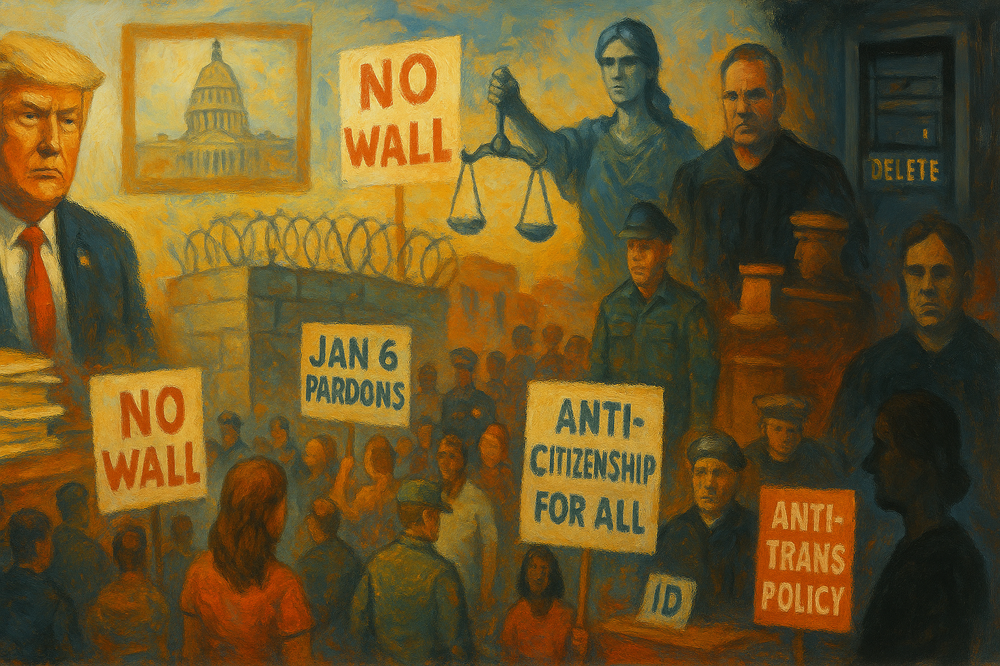

<!-- Generated by build_publish_week_v1 (appendix post) -->
<!-- Header image: image_wide_week1_appendix.png -->

# Week 1 Appendix: The First Week's Flood of Power

*A single inaugural week saturates courts, agencies, and Congress with unilateral action faster than any institution can respond.*

This inaugural week concentrates an extraordinary volume of executive action in a single presidential term's opening days, establishing patterns that recur throughout subsequent weeks. Trump signed dozens of executive orders spanning immigration, gender policy, civil service, energy, and foreign policy, while issuing sweeping pardons for January 6 defendants including those convicted of assault and seditious conspiracy. The week reveals a coordinated strategy: attacking birthright citizenship (a constitutional guarantee), reinstating Schedule F to politicize the civil service, firing inspectors general without required congressional notice, suspending refugee and asylum systems, and declaring national emergencies to justify military deployment and bypass normal legislative processes. Simultaneously, DOJ investigations were launched against political opponents and the 'weaponization' of prior enforcement, inverting accountability. Courts moved quickly to block the birthright citizenship order as 'blatantly unconstitutional,' providing an early institutional check, but the sheer breadth and speed of executive action signals intent to overwhelm oversight capacity from day one.

Power and Authority

1. Trump signed a wave of executive orders on inauguration day covering DEI, hiring, immigration, energy, and citizenship (2025-01-20): The president signed dozens of executive orders in a single day, using unilateral action to reshape federal policy across many domains before Congress or courts could respond.

2. Trump declared national emergencies at the southern border and over energy, invoking military and emergency authorities (2025-01-20): Two simultaneous national emergency declarations unlocked military deployment, waived regulations, and requested advice on invoking the Insurrection Act, expanding executive power beyond routine governance.

3. Trump issued pardons and sentence commutations to roughly 1,500 people charged in the January 6 Capitol attack (2025-01-20): A mass clemency action shielded participants in an attack on Congress, including violent offenders and seditious conspiracy convicts, from legal accountability and undermined deterrence against political violence.

4. Trump revoked security clearances of about 50 former intelligence officials and John Bolton over a 2020 election-related letter (2025-01-20): The order stripped clearances from perceived political opponents based on past political speech, using national-security tools to punish critics rather than address security risks.

5. Trump signed executive orders directing DOJ and intelligence agencies to investigate the prior administration for alleged 'weaponization' of government (2025-01-20): Orders framed as ending political weaponization instead directed federal law enforcement to review and potentially prosecute prior officials, raising concerns about retaliatory use of investigative power.

6. Trump delayed enforcement of the federal law banning TikTok despite a Supreme Court ruling upholding it (2025-01-20): The president ordered the Justice Department not to enforce a congressionally passed statute for 75 days, asserting executive discretion to override a validly enacted law and Supreme Court decision.

7. Trump ordered military personnel deployed to the southern border, including active-duty troops and Marines (2025-01-22): Deployment of active-duty forces domestically for border enforcement, despite crossings at multi-year lows, signals militarization of immigration policy and use of the armed forces in a civilian enforcement role.

8. Trump purged at least 12 inspectors general across major federal agencies without the statutorily required 30-day notice to Congress (2025-01-24): Removing independent internal watchdogs en masse, without legally mandated notice, weakens oversight capacity across the federal government at the outset of the administration.

9. Trump threatened to withhold California wildfire disaster aid unless the state adopted mandatory voter ID requirements and changed water policy (2025-01-23): Conditioning federal disaster relief on unrelated political demands, including changes to state election law, represents a coercive use of federal power against a disfavored state.

10. Trump reinstated Schedule F, reclassifying tens of thousands of career civil servants as at-will political appointees (2025-01-20): Stripping job protections from career federal employees enables political purges of the civil service, undermining institutional independence and expertise built to survive changes in administration.

11. Trump issued a memorandum on DOGE-related federal agency access and established the Department of Government Efficiency with broad IT and data authority (2025-01-20): Creation of a new entity with sweeping access to federal agency records and systems, staffed partly through private business connections, concentrates unaccountable authority within the executive office.

12. Trump designated international cartels and Ansar Allah (the Houthis) as Foreign Terrorist Organizations (2025-01-20): Expanding terrorism designations to criminal organizations and foreign militias broadens executive authority to invoke wartime-style powers, including potential Alien Enemies Act use against migrants.

13. Trump issued a memorandum directing OMB to review a challenge to the Impoundment Control Act of 1974 (2025-01-23) *[single source]*: Challenging a law that prevents the president from unilaterally withholding congressionally appropriated funds would shift budgetary power from Congress to the executive branch.

14. Rep. Andy Ogles introduced a resolution to amend the 22nd Amendment to allow a president to serve a third term (2025-01-23) *[single source]*: A congressional proposal to remove the constitutional two-term limit on the presidency raises fundamental questions about permanence of executive power and adherence to constitutional constraints.

Institutions and Governance

1. Federal district judge John Coughenour issued a temporary restraining order blocking the executive order attempting to end birthright citizenship, calling it blatantly unconstitutional (2025-01-23): A federal court quickly halted an executive attempt to override the 14th Amendment, providing an early institutional check on presidential overreach into constitutional law.

2. California and a coalition of states filed lawsuits challenging the executive order restricting birthright citizenship (2025-01-21): State attorneys general activated federalism as a check on federal overreach, arguing the order unconstitutionally reinterprets the 14th Amendment.

3. House Republicans formed a new select subcommittee to reinvestigate January 6, challenging the findings of the prior bipartisan investigation (2025-01-22) *[single source]*: A new congressional panel aimed at undercutting a prior committee's conclusions raises concerns about using legislative oversight to rewrite an accepted historical and legal record rather than pursue accountability.

4. National Security Counselors filed a lawsuit alleging the Department of Government Efficiency violates federal transparency and advisory-committee rules (2025-01-20): A public-interest law firm's suit tests whether a newly created executive body with sweeping government access must meet legal transparency requirements applicable to federal advisory committees.

5. National Treasury Employees Union sued the Trump administration over the executive order reinstating Schedule F (2025-01-21): A federal employee union challenged an order that strips due-process protections from career civil servants, arguing it wrongly reclassifies them as at-will political appointees.

6. Trump signed an order restricting federal funding for elective abortion services under the Hyde Amendment (2025-01-24): The order reversed prior administration policy on abortion funding, reasserting executive control over federal agency guidance on a contested area of law.

7. Trump established the President's Council of Advisors on Science and Technology, revoking the prior council (2025-01-23): Restructuring a key science-advisory body with new co-chairs and a merit-focused framing may reshape how scientific expertise is incorporated into federal policymaking.

8. Trump established a Federal Emergency Management Agency Review Council to evaluate FEMA's structure and disaster-response capacity (2025-01-24): A new review body tasked with recommending changes to FEMA, paired with the president's stated openness to abolishing the agency, could shift disaster response responsibility away from the federal government.

9. White House reorganized the National Security Council structure and designated dozens of acting cabinet and sub-cabinet officials via executive memoranda (2025-01-20): Centralizing NSC decision-making and installing unconfirmed acting officials across major departments concentrates authority in the executive office ahead of Senate confirmation of permanent appointees.

10. US Senate confirmed Marco Rubio as Secretary of State and Pete Hegseth as Secretary of Defense despite controversy over Hegseth's conduct (2025-01-20): Senate confirmation of cabinet nominees, including a contested defense secretary confirmed only by a tie-breaking vote, tested the chamber's advice-and-consent role amid allegations of misconduct.

11. National Archivist Colleen Shogan refused to certify the Equal Rights Amendment as part of the Constitution despite executive declarations calling it ratified (2025-01-20): An independent official's refusal to bypass required constitutional-amendment procedures underscored institutional limits on executive claims about constitutional law.

12. Purdue Pharma and the Sackler family reached a $7.4 billion settlement over opioid-crisis lawsuits, pending court approval (2025-01-23): A large settlement addressing corporate and family accountability for the opioid epidemic will restructure the company and direct funds to affected communities, pending judicial review.

Economic Structure

1. Trump declared a national energy emergency directing agencies to expedite fossil fuel production and infrastructure permitting (2025-01-20): Emergency energy powers were invoked to bypass standard environmental review and expand fossil fuel production, prioritizing industry interests over established regulatory process.

2. Trump withdrew the United States from the Paris climate agreement and rescinded electric-vehicle and offshore-wind policies (2025-01-20): Withdrawal from the international climate accord and rollback of clean-energy targets shifts economic policy toward fossil fuel industries and away from climate commitments.

3. Trump signed a memorandum directing the America First Trade Policy review, examining tariffs, trade deficits, and existing agreements (2025-01-20): A broad review of tariff and trade policy, including agreements with China and the USMCA, signals coming shifts in economic relationships with allies and trading partners.

4. Trump launched personal cryptocurrency tokens TRUMP and MELANIA shortly before and after taking office (2025-01-20): A sitting president's launch of personal cryptocurrency ventures, promoted by exchanges under federal investigation, raises serious conflict-of-interest and emoluments concerns.

5. Trump signed an executive order revoking prior consumer-protection rules on cryptocurrency and establishing a working group on digital asset markets (2025-01-23): Repealing financial consumer protections for the crypto industry, while the president personally profits from crypto ventures, blends regulatory policy with private financial interest.

6. Executive Office of the President issued a memorandum freezing federal civilian hiring across most agencies (2025-01-20): A government-wide hiring freeze constrains federal agency operations and service delivery, with exceptions carved out for immigration enforcement and national security roles.

7. Executive Office of the President ordered a regulatory freeze pending review, halting new federal rules and delaying pending ones (2025-01-20): Suspending the ordinary rulemaking process government-wide concentrates review authority in newly appointed officials, delaying implementation of previously finalized regulations.

8. Jared Kushner secured a $2 billion investment from Saudi Arabia's sovereign wealth fund for his private equity firm despite internal objections (2025-01-22): A large foreign sovereign investment in a fund led by a former and possibly future presidential adviser raises questions about foreign influence and conflicts of interest tied to the administration.

9. Boeing donated $1 million to Trump's inauguration and hired the Attorney General's former law firm as its representative (2025-01-20): A corporation facing federal prosecution donated to the president's inauguration while retaining the new Attorney General's former firm, raising concerns about influence over Justice Department decisions.

10. US Senate and House passed the Laken Riley Act mandating detention of undocumented immigrants charged with theft-related crimes (2025-01-20) *[single source]*: Congress passed legislation expanding mandatory immigration detention, raising due-process concerns while marking the president's first legislative win.

11. Trump administration froze disbursement of Inflation Reduction Act energy-assistance funds, raising utility surcharges for low-income households (2025-01-20) *[single source]*: A funding freeze tied to broader energy-policy executive orders resulted in immediate cost increases for low-income utility customers, showing tangible economic harm from the freeze.

12. Trump administration ended the pause on liquefied natural gas export applications, prioritizing exports over domestic price stability (2025-01-20): Reversing a pause on gas exports without weighing domestic affordability contributed to higher household natural-gas costs later in the year, prioritizing industry revenue over consumer protection.

13. National Labor Relations Board approved a union election for 4,300 Amazon warehouse workers in North Carolina (2025-01-23) *[single source]*: Federal approval of a union election at a major non-union employer represents continued labor organizing activity and a test of workers' collective-bargaining rights.

14. Teamsters union authorized a strike against Costco ahead of contract expiration for 18,000 workers (2025-01-20) *[single source]*: A strike authorization vote by a major union signals ongoing labor tension over wages and benefits at a large national retailer.

15. Trump signed an executive order directing agencies to deliver emergency price relief by cutting regulations on housing, healthcare, and energy costs (2025-01-20): A broad directive to reduce regulatory costs across multiple sectors asserts executive authority over agency rulemaking with unclear specific implementation details.

Civil Rights and Dissent

1. Trump signed an executive order attempting to end birthright citizenship for children of undocumented or temporary-visa parents (2025-01-20): An attempt to override the 14th Amendment's citizenship guarantee by executive order struck directly at a constitutional right and immediately drew legal challenges from states and civil rights groups.

2. Trump signed Executive Order 14168 recognizing only two biological sexes and eliminating federal recognition of transgender identity (2025-01-20): The order stripped federal recognition of gender identity, restricting passport documents, prison placement, and shelter access for transgender people while rescinding prior civil-rights guidance.

3. Trump signed Executive Order 14183 banning most transgender people from military service and beginning discharges of those serving (2025-01-20): Excluding transgender service members and issuing punitive discharge codes restricts employment and veteran benefits for a category of current and former military personnel.

4. Trump administration cut funding for the dedicated LGBTQ youth line on the national suicide hotline (2025-01-20): Eliminating specialized crisis support for LGBTQ youth removed a targeted mental-health resource during a period of heightened anti-trans policy activity, directly affecting a vulnerable population.

5. Trump administration threatened federal funding cuts to hospitals providing gender-affirming care to transgender youth (2025-01-20): A funding threat led hospitals nationwide to pause gender-affirming care for minors, restricting access to medical treatment based on political pressure rather than clinical guidelines.

6. Trump administration issued guidance pressuring shelters to deny housing services to transgender women based on sex assigned at birth (2025-01-20) *[single source]*: Federal guidance conditioning shelter funding on excluding transgender women increased their risk of homelessness and violence, restricting access to safe housing.

7. Trump administration mandated placement of transgender detainees in immigration custody based on sex assigned at birth (2025-01-20) *[single source]*: The policy increased risk of abuse for transgender detainees in federal custody and was later accompanied by ICE ceasing to report data on this population, reducing accountability.

8. Trump administration cancelled the CBP One asylum-appointment app, ending a legal pathway for roughly 30,000 scheduled migrants (2025-01-20): Eliminating the primary legal mechanism for scheduling asylum appointments abruptly closed off a lawful entry pathway, leaving migrants stranded without recourse or notice.

9. Trump suspended the U.S. asylum system and refugee admissions program at the southern border (2025-01-20): Suspending statutory asylum and refugee protections eliminated legal pathways for people fleeing persecution, a significant restriction on humanitarian protections established under U.S. and international law.

10. Trump administration rescinded 'sensitive areas' guidance, allowing immigration arrests at schools, churches, and hospitals (2025-01-21): Removing longstanding restrictions on immigration enforcement in sensitive locations exposed families to arrest while seeking education, healthcare, or worship, increasing fear in immigrant communities.

11. Trump administration expanded expedited removal authority nationwide, allowing deportation without a court hearing (2025-01-21): Broadening a policy that bypasses immigration court review nationwide removes due-process protections for people who cannot immediately prove lawful presence, including some legally admitted individuals.

12. Trump administration reinstated the Migrant Protection Protocols, requiring asylum seekers to wait in Mexico during case processing (2025-01-21) *[single source]*: Reviving the 'Remain in Mexico' policy exposes asylum seekers to dangerous border conditions while their claims are adjudicated, restricting safe access to the U.S. legal process.

13. Trump administration increased ICE detention quotas, arrest targets, and detention budget, resulting in dozens of custody deaths (2025-01-20) *[single source]*: A dramatic ramp-up of detention capacity and enforcement quotas, coupled with reported deaths and poor conditions in custody, raises due-process and humane-treatment concerns for detained immigrants.

14. Trump reinstated the Mexico City policy, cutting U.S. funding to international organizations that provide or discuss abortion (2025-01-24): Reviving the 'global gag rule' restricts reproductive healthcare funding for international aid organizations, with anticipated effects on maternal health and family-planning access worldwide.

15. Trump issued an executive order using fetal-personhood language within the gender-definition order (2025-01-20): Incorporating fetal-personhood concepts into federal policy raises concerns about future efforts to restrict abortion access and reproductive rights nationwide.

16. Trump pardoned nearly two dozen anti-abortion activists convicted under the Freedom of Access to Clinic Entrances Act (2025-01-22): Pardoning individuals convicted of obstructing reproductive-health clinics undermines a federal law designed to protect clinic staff and patients from harassment and violence.

17. Trump signed executive orders ending federal diversity, equity, and inclusion programs and directing investigations of private-sector DEI practices (2025-01-21): Terminating federal DEI initiatives and threatening enforcement action against private employers, universities, and nonprofits reshapes civil-rights policy and restricts consideration of race and gender in hiring.

18. Trump repealed Executive Order 11246, ending a 1965 anti-discrimination requirement for federal contractors (2025-01-23): Rescinding a decades-old nondiscrimination requirement for government contractors removes a mechanism that tracked workforce diversity data and could reduce protections against employment discrimination.

19. Trump signed a proclamation designating a border 'invasion' and suspending entry and asylum access for affected migrants (2025-01-20): Declaring an 'invasion' under a rarely used constitutional provision to suspend statutory asylum access raises due-process concerns and tests the limits of unilateral executive authority over immigration law.

20. Trump issued a directive combating alleged 'anti-Christian bias' across federal agencies (2025-01-23): Directing the Attorney General to prosecute alleged anti-Christian violence within government institutions raises church-state separation concerns and could privilege one religious group in federal enforcement priorities.

21. State Department banned display of non-U.S. flags, including pride and Black Lives Matter flags, at consular posts (2025-01-23): A 'one flag policy' at diplomatic facilities removes prior symbolic representation of diversity initiatives at U.S. embassies worldwide.

22. Ohio legislature enacted a law allowing police departments to charge up to $750 for body-camera footage (2025-01-24) *[single source]*: Financial barriers to accessing police body-camera footage restrict public and press ability to review law-enforcement conduct, reducing transparency and accountability.

23. Democratic National Committee intervened in a Republican-led lawsuit seeking to discard thousands of North Carolina ballots (2025-01-21) *[single source]*: Legal intervention to protect ballots cast by eligible voters despite minor registration issues defends electoral integrity against an effort to overturn a certified state supreme court race.

24. Republican National Committee, North Carolina GOP, and Wake County Republican Party joined a lawsuit challenging 60,000 ballots from the 2024 North Carolina Supreme Court race (2025-01-21): A coordinated legal effort by national and state Republican parties to discard tens of thousands of ballots based on registration-form technicalities threatens to overturn a certified election result.

25. Trump revoked Biden-era police reform executive orders and dismantled the federal database tracking police misconduct (2025-01-20): Eliminating limited federal police accountability measures reverses reforms enacted after the George Floyd protests, reducing transparency into patterns of officer misconduct nationwide.

Information, Memory and Manipulation

1. Trump signed an executive order removing 'gender ideology guidance' and deleting LGBTQ health data and terminology from federal websites (2025-01-20): Systematic removal of public health data and terminology related to transgender Americans erased information used by hospitals, schools, and researchers, reducing public access to evidence-based resources.

2. Trump administration directed removal of hundreds of LGBTQ- and race-related books from federal military-base school libraries (2025-01-20): Removing books on identity and history from schools serving military families restricts access to information until a federal judge ordered the materials restored.

3. Trump administration ordered a communications blackout across federal health agencies including the CDC, FDA, and NIH (2025-01-21): Halting health advisories, scientific reports, and public communications from major health agencies restricts the public's access to timely, evidence-based health information.

4. Federal Communications Commission reinstated Trump campaign complaints against ABC, NBC, and CBS alleging election bias (2025-01-22) *[single source]*: A federal regulator's revival of complaints against major broadcasters over election coverage raises concerns about using regulatory authority to pressure critical media outlets.

5. Trump publicly called for MSNBC to lose its broadcasting license (2025-01-22): A presidential call to revoke a news outlet's broadcast license over unfavorable coverage threatens press freedom and signals willingness to use state power against critical media.

6. Federal Communications Commission reopened an investigation into CBS's editing of a Kamala Harris interview, tied to a pending corporate merger (2025-01-22) *[single source]*: Reopening a network-editing investigation while a media company sought merger approval created leverage later used to extract concessions, raising concerns about regulatory power being used against independent journalism.

7. Trump signed an executive order to rename Mount McKinley (Denali) and the Gulf of Mexico as the 'Gulf of America' (2025-01-20): Unilateral renaming of long-established geographic features via executive order reshapes national symbolism and historical memory outside normal deliberative processes.

8. Trump signed an executive order declassifying records related to the assassinations of JFK, RFK, and Martin Luther King Jr. (2025-01-23): Directing the release of long-withheld assassination records could increase public access to historical information, though the timeline and scope of actual disclosure remain uncertain.

9. ICE updated old press releases to make them appear new, creating an impression of ongoing mass deportation activity (2025-01-24) *[single source]*: Manipulating publication dates on official communications to inflate the appearance of enforcement activity misleads the public about the scale and timing of government action.

10. Trump made multiple factually disputed claims in his inaugural address regarding immigration, crime, and the prior administration (2025-01-20): A pattern of contested factual claims made immediately upon taking office set an early tone for public communication that departed from verified information.

