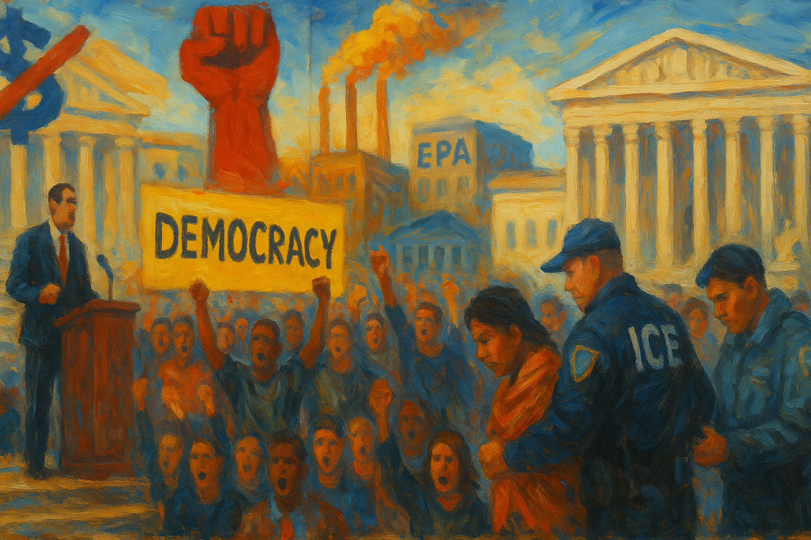

<!-- Generated by build_publish_week_v1 (appendix post) -->
<!-- Header image: image_wide_week11_appendix.png -->

# Week 11 Appendix: Chaos as Methodical Governance

*Emergency economics, bureaucratic purges, and weaponized federal leverage advanced together, deepening structural erosion even as the Democracy Clock barely moved.*

This was a structurally heavy week for democratic erosion, with simultaneous blows to institutional checks, civil rights, and the information environment. The most acute pressures came from the normalization of emergency economic powers and sweeping tariffs, used to bypass Congress and rewire trade policy in ways that reward donors and punish disfavored regions. Parallel mass layoffs and politicization at HHS, EPA, USAID, and across the civil service hollowed out core state capacity, especially in public health and environmental protection. Federal power was overtly weaponized against universities, blue jurisdictions, and even a single state (Maine), while immigration tools were repurposed to target activists and vulnerable migrants using arbitrary criteria. Courts were a mixed arena: some federal judges and state AG coalitions checked deportations and election overreach, but other courts and the Supreme Court advanced partisan or anti-DEI outcomes and tolerated executive funding freezes. Media and academic freedom came under coordinated pressure via FCC investigations, access bans, Smithsonian interference, and funding threats to Columbia and Harvard. Against this backdrop, large-scale protests, Cory Booker’s marathon speech, and electoral pushback in Wisconsin signaled significant, but still outmatched, democratic resistance.

Power and Authority

1. Trump administration canceled $400 million in federal funding to Columbia University to pressure changes in campus policies (2025-03-29): By pulling major research funding to force Columbia to change how it handles pro-Palestinian activity, the administration used federal financial power to shape academic speech and institutional autonomy.

2. Columbia University adopted new restrictions on pro-Palestinian activity and ceded control over a department under federal pressure (2025-03-29): Columbia’s decision to tighten protest rules and accept external control of a department in hopes of regaining federal funds showed how executive pressure can chill campus dissent and reshape governance.

3. Trump administration implemented budget cuts that weakened Native American institutions and tribal funding (2025-03-29): Cuts to tribal funds and Native-serving institutions, including Haskell Indian Nations University, reduced support for Indigenous education and cultural programs, weakening already marginalized communities’ access to public goods.

4. Trump administration issued an executive order directing the Smithsonian to remove exhibits deemed “improper, divisive or anti-American” (2025-03-29): Ordering the Smithsonian to purge exhibits on race and power placed federal ideology over curatorial judgment, letting the executive branch rewrite public history and constrain discussion of racism.

5. Trump administration moved to gut the Department of Homeland Security’s civil rights division (2025-03-29): Weakening DHS’s civil rights office reduced oversight of immigration enforcement and detention, making it harder to check abuses against migrants and other vulnerable groups.

6. President Trump granted clemency to Ozy Media co-founder Carlos Watson and erased related financial penalties (2025-03-29): Overriding a fraud conviction and large restitution order for a media executive underscored how presidential clemency can insulate well-connected offenders from judicial accountability.

7. State Department announced the shutdown of USAID and transfer of its functions into the department (2025-03-29): Eliminating a congressionally created aid agency and folding its work into the State Department concentrated foreign assistance power in the executive, raising separation-of-powers concerns.

8. President Trump issued an executive order ending affirmative action in admissions at the US Naval Academy (2025-03-29): Ending race-conscious admissions at a key military academy reduced tools to maintain a diverse officer corps, affecting representation in a core state institution.

9. President Trump signed an executive order expanding federal control over Washington DC policing, immigration arrests, and gun permits (2025-03-30): Using an order to intensify policing and immigration enforcement in DC while loosening concealed-carry rules let the federal executive override local preferences in a heavily Democratic jurisdiction.

10. President Trump warned automakers not to raise prices in response to new auto tariffs (2025-03-30): Directly pressuring private firms on pricing signaled a willingness to use presidential influence to manage markets informally, blurring lines between state authority and private decision-making.

11. President Trump publicly explored “methods” to obtain an unconstitutional third presidential term (2025-03-31): Floating ways around the two-term limit, including a vice-presidential route, normalized discussion of extending personal rule beyond constitutional constraints.

12. President Trump froze funding under the Inflation Reduction Act and halted approvals of wind and solar projects on federal lands and waters (2025-03-31): Blocking congressionally authorized clean-energy spending and permits let the executive unilaterally stall a major legislative program, weakening climate policy and economic planning.

13. President Trump issued an executive order establishing the United States Investment Accelerator to fast-track billion-dollar projects (2025-03-31): Creating a Commerce-based accelerator to streamline approvals for very large investments centralized discretion over mega-projects, potentially privileging well-connected firms in regulatory processes.

14. President Trump issued an executive order directing aggressive enforcement against unfair practices in the live entertainment ticket market (2025-03-31): Ordering DOJ and FTC to crack down on ticketing abuses used executive power to reshape a concentrated market, with implications for consumer protection and corporate regulation.

15. President Trump declared a national emergency to justify sweeping reciprocal tariffs on imports (2025-04-02): Invoking emergency powers to impose broad tariffs shifted core trade and tax-like decisions from Congress to the presidency, normalizing emergency governance in economic policy.

16. President Trump issued an executive order eliminating de minimis duty-free treatment for certain low-value imports from China and Hong Kong tied to synthetic opioids (2025-04-02): Targeting low-value imports from China and Hong Kong under an opioid rationale expanded the use of trade tools as security instruments, tightening executive control over specific supply chains.

17. President Trump announced sweeping new tariffs on nearly all imports, framed as “Liberation Day” economic policy (2025-04-02): Announcing blanket and country-specific tariffs as a national renewal project concentrated economic power in the presidency and risked destabilizing global trade and domestic prices.

18. President Trump reached coercive settlements with major law firms to avert punitive executive orders targeting them (2025-04-02): Conditioning avoidance of hostile executive orders on law firms’ pro bono commitments blurred the line between regulation and retaliation, pressuring legal actors who represent political opponents.

19. President Trump announced a 10% universal tariff package that exempted many fossil fuel products important to major donors (2025-04-03): Designing tariffs to spare key fossil fuel imports after large industry donations showed how economic emergency tools can be tailored to protect benefactors while shifting costs to the public.

20. President Trump extended the enforcement delay of the TikTok ban under the Protecting Americans from Foreign Adversary Controlled Applications Act (2025-04-04): Postponing enforcement of a high-profile app ban underscored executive control over when and how national-security-based tech restrictions actually bite, affecting platforms and users’ speech environment.

Institutions and Governance

1. Florida legislature enacted a “countries of concern” law leading to the firing of a Chinese professor at New College of Florida (2025-03-29): Using nationality-based hiring restrictions in public universities tied academic employment to geopolitical categories, undermining institutional autonomy and equal access to public jobs.

2. Wisconsin Attorney General Josh Kaul sued Elon Musk and his PAC over a million-dollar voter giveaway program (2025-03-29): Challenging cash giveaways linked to voting tested state campaign and bribery laws against a billionaire’s attempt to shape a pivotal judicial election.

3. Delaware Attorney General Kathy Jennings and 20 other state AGs formed a coalition urging law firms to resist Trump administration intimidation (2025-03-29): State attorneys general organized to defend law firms and judges from executive pressure, seeking to preserve independent legal representation and judicial integrity.

4. Congressional Republicans cut Washington DC’s budget by $1 billion in a federal spending bill (2025-03-30): Slashing DC’s budget through federal appropriations let Congress override local fiscal choices in a Democratic city, constraining its capacity to provide core services.

5. President Trump filed a $10 billion defamation lawsuit against CBS News over an edited interview (2025-03-30): A massive defamation suit by the president against a major network risked chilling critical coverage by turning civil courts into tools against disfavored media.

6. Oregon legislature recriminalized low-level drug possession, reversing prior decriminalization (2025-03-31): Restoring criminal penalties for minor drug possession shifted policy back toward incarceration, straining courts and public defenders and affecting health-oriented justice reforms.

7. Representative Victoria Spartz told constituents they were not entitled to due process when raising rule concerns (2025-03-31): A sitting member’s denial of constituents’ due process rights signaled disregard for basic legal protections that underpin fair governance.

8. House Republican leadership halted voting after a rule defeat tied to blocking proxy voting for new parents (2025-04-01): Internal GOP conflict over allowing proxy votes for new parents paralyzed House business, showing how procedural fights can stall substantive lawmaking and representation.

9. Senate Democrats warned Majority Leader John Thune against using accounting gimmicks to hide the deficit impact of Trump’s tax cuts (2025-03-31): Opposing creative scoring of a $4 trillion tax package defended transparent budgeting, which is essential for democratic oversight of fiscal choices.

10. Senator Cory Booker delivered a record-breaking 25-hour Senate speech condemning Trump administration policies (2025-04-01): Booker’s marathon address used Senate floor procedures to spotlight perceived democratic harms and rally opposition within institutional channels.

11. Senate of the United States passed a bipartisan resolution to block President Trump’s tariffs on Canadian products (2025-04-02): The Senate’s vote to rescind Canada tariffs, though likely stalled in the House, asserted congressional authority over trade and challenged emergency-based tariff powers.

12. Senators Chuck Grassley and Maria Cantwell and co-sponsors introduced the bipartisan Trade Review Act to reclaim congressional oversight of tariffs (2025-04-03): Requiring notice, impact analysis, and congressional approval for new tariffs aimed to restore legislative checks on unilateral trade actions by the president.

13. Congress of the United States failed to revoke President Trump’s authority to impose new tariffs despite economic concerns (2025-04-03): Legislative inaction on canceling broad tariff powers signaled tacit support or acquiescence to an executive-driven trade regime with major economic consequences.

14. House Republicans displayed “Wanted” posters of federal judges who ruled against the Trump administration (2025-03-31): Targeting judges with hostile posters outside congressional offices risked intimidating the judiciary and undermining perceptions of impartial courts.

15. Secretary of Defense Pete Hegseth hired his brother as a senior Pentagon advisor despite anti-nepotism law (2025-03-29): Bringing a close relative into a senior defense role raised nepotism concerns and suggested personal loyalty may trump merit in sensitive security posts.

16. Senate of the United States confirmed Dr. Mehmet Oz as administrator of the Centers for Medicare and Medicaid Services (2025-04-03): Confirming a figure criticized for health misinformation to run Medicare and Medicaid risked politicizing a key technocratic agency and eroding trust in its guidance.

17. President Trump fired General Timothy Haugh as head of US Cyber Command and director of the NSA (2025-04-04): Removing the top cyber and signals intelligence official, reportedly at a far-right activist’s urging, deepened concerns that national security leadership is being reshaped around personal loyalty.

Economic Structure

1. Health and Human Services Secretary Robert F. Kennedy Jr. announced and began mass layoffs and restructuring at HHS affecting tens of thousands of workers (2025-03-29): Cutting roughly a quarter of HHS’s workforce and stripping bargaining rights weakened federal public health capacity and labor protections, while opening space for privatization.

2. Dr. Peter Marks resigned as FDA’s top vaccine official in protest of RFK Jr.’s misinformation and pressure (2025-03-29): The departure of a key vaccine regulator over political interference signaled erosion of scientific independence in drug oversight, with implications for health markets and trust.

3. Trump administration and EPA leadership planned elimination of over 1,100 scientists and terminated $14 billion in climate grants at EPA (2025-03-31): Large cuts to EPA research staff and climate grants weakened environmental regulation and data, shifting agency priorities away from public protection toward deregulation.

4. EPA froze or stayed multiple environmental rules and emission standards pending reconsideration (2025-03-31): Pausing hazardous air pollutant standards and TCE provisions delayed enforcement of health protections, easing compliance burdens on industry at potential cost to communities.

5. Trump administration froze billions in Biden-era agricultural and clean-energy funding, then selectively revived a small conservation grant (2025-04-01): Halting large tranches of previously approved farm and climate funds while reviving a small grant under pressure created uncertainty for producers and signaled politicized control over public investment.

6. Trump administration canceled $1 billion in local food purchase funding for food banks and schools (2025-04-01): Ending a major local food program cut support for small farms and low-income consumers, weakening food security and rural economic stability.

7. Trump administration withdrew and reviewed massive federal grants and contracts for Columbia and Harvard over campus antisemitism claims (2025-04-01): Tying billions in research and institutional funding to political judgments about campus climate leveraged federal money to influence elite universities’ internal policies.

8. Elon Musk contributed over $20 million and held rallies with cash giveaways to influence the Wisconsin Supreme Court election (2025-03-30): Massive spending and direct payments around a state judicial race illustrated how concentrated wealth can shape courts that decide voting rules and maps.

9. President Trump announced and implemented broad new tariffs on imported cars, parts, and most other goods (2025-03-30): Imposing large, non-reciprocal tariffs on autos and other imports restructured trade flows, raised costs for consumers and firms, and shifted economic risk onto workers and small businesses.

10. Cleveland-Cliffs announced layoffs of more than 600 steelworkers due to auto-industry tariffs (2025-03-30): Tariff-driven supply chain disruptions led a major steel producer to idle operations and cut jobs, showing how trade shocks can quickly harm industrial workers.

11. Trump administration implemented tariff policies that increased uncertainty and costs in the oil and energy sector (2025-03-30): Higher equipment costs and policy volatility in energy markets complicated investment decisions, with potential knock-on effects for prices and energy security.

12. Stock markets and investors reacted to tariff announcements with sharp declines in major indices (2025-04-02): Steep drops in the Dow and NASDAQ following tariff news reflected investor fears that protectionist policy could trigger recession and erode household wealth.

13. Treasury Secretary Bessent and allied commentators publicly defended high tariffs as compatible with the American dream despite higher consumer costs (2025-04-03): Framing tariffs as a path to reindustrialization while downplaying price impacts justified policies that shift burdens from capital to consumers and workers.

14. Federal Reserve Chair Jerome Powell declined to immediately adjust interest rates amid tariff-driven volatility (2025-04-03): The Fed’s decision to hold rates despite political pressure underscored the importance of central bank independence for stabilizing an economy shaken by executive trade moves.

15. Trump administration canceled Social Security contracts in Maine and froze federal education funds after disputes with the governor (2025-04-04): Using Social Security and education funding as leverage against a state government weaponized federal economic tools to punish political noncompliance.

16. Trump administration cut federal grants for arts and humanities institutions nationwide (2025-04-04): Reducing support for museums, archives, and cultural projects weakened public access to shared cultural goods and independent historical work.

17. Social Security Administration and DOGE reversed planned field office closures and scaled back phone-service cuts after public outcry (2025-03-31): Walking back service reductions under pressure showed both the vulnerability of core benefits infrastructure to opaque efficiency drives and the potential of civic scrutiny to protect access.

18. Social Security Administration adopted policy changes likely to sharply increase in-person field office demand (2025-03-31): New ID and in-person requirements for benefits and noncitizen Social Security numbers risked overwhelming SSA capacity, effectively raising barriers to accessing earned benefits.

19. National Institutes of Health leadership resumed grant funding after acknowledging federal court injunctions (2025-04-03): Restarting previously blocked research grants restored funding flows and signaled belated compliance with judicial limits on executive attempts to choke off science funding.

20. Census Bureau and other federal agencies issued multiple notices on business, health, and acquisition surveys and information collections (2025-03-31): Continuing routine economic and health data collections and procurement oversight maintained the statistical and regulatory backbone needed for informed policy and fair contracting.

21. EPA and FCC approved or advanced several environmental and communications rules and plans (2025-04-01): Approving state air plans, pesticide data reforms, and FM allotment changes showed ongoing regulatory work that can either mitigate or entrench environmental and media inequalities depending on implementation.

22. Trump administration announced high tariffs that triggered major stock market losses and global retaliation (2025-04-03): Tariffs that prompted sharp market declines and foreign countermeasures risked broader economic instability, with ordinary households bearing much of the adjustment cost.

Civil Rights and Dissent

1. US district court ruled that Tufts student Rümeysa Öztürk could not be deported without a court order (2025-03-29): Blocking the immediate removal of a student accused of supporting Hamas without evidence affirmed judicial oversight of immigration enforcement and protected speech-related rights.

2. Wisconsin appellate court declined to immediately halt Elon Musk’s voter giveaway program on procedural grounds (2025-03-29): Refusing emergency relief left a controversial cash-for-voters scheme in place during a key judicial race, complicating efforts to police undue financial influence on turnout.

3. ACLU of Louisiana filed a complaint alleging serious rights violations at the South Louisiana ICE processing center (2025-03-29): Documenting inadequate medical care and neglect in ICE detention highlighted systemic abuses against migrants and the need for robust civil-rights enforcement.

4. Trump administration pursued deportation of Mahmoud Khalil, a former Columbia student and pro-Palestinian activist, under rarely used immigration provisions (2025-03-29): Using obscure executive tools to target a named activist for removal raised concerns that immigration law is being weaponized against political expression.

5. Trump administration revoked residency statuses of international students, often from Muslim-majority countries, without clear notice (2025-03-29): Secretly stripping student residency, concentrated on Middle Eastern and Muslim-majority nationals, undermined due process and signaled ideological and origin-based stratification of legal status.

6. International protesters organized “Tesla Takedown” demonstrations in 253 cities against Elon Musk’s influence (2025-03-29): Large coordinated protests against a powerful corporate figure reflected transnational civil society resistance to perceived corporate capture of politics and labor.

7. US district judge ordered participants in the leaked Signal chat about Yemen strikes to preserve all messages (2025-03-30): Requiring preservation of leaked national-security chat records protected potential evidence for accountability in a sensitive military decision-making episode.

8. FBI reallocated counterterrorism resources away from far-right domestic threats toward gangs, border taskforces, and leftwing groups (2025-03-30): Shifting focus from the leading source of domestic terrorism to other targets, including leftwing groups and Tesla vandalism, risked leaving communities exposed to extremist violence.

9. Trump administration deported migrants to El Salvador under controversial legal authority distinct from the Alien Enemies Act (2025-03-30): Using novel legal justifications to send migrants to a harsh Salvadoran prison system raised serious due process and human rights concerns.

10. Oregon and federal authorities conducted mass arrests for low-level drug possession after recriminalization (2025-03-31): Thousands of arrests under Oregon’s new drug law increased incarceration and strained legal aid, disproportionately affecting poor and vulnerable residents.

11. Federal court issued a temporary restraining order halting deportations of Venezuelans labeled gang members via a tattoo-based point system (2025-04-01): Blocking removals based on arbitrary indicators like tattoos and clothing reaffirmed that immigration enforcement must respect legal standards and evidence.

12. Federal judge temporarily blocked cuts to legal services for unaccompanied children in immigration court (2025-04-01): Preserving funding for lawyers for unaccompanied minors protected basic procedural rights for some of the most vulnerable people in the immigration system.

13. ICE and Trump administration wrongfully deported Kilmar Armando Abrego Garcia, a Maryland resident with protected status, to El Salvador (2025-04-01): Deporting a legally protected resident to a Salvadoran prison and then claiming courts lacked power to fix it exposed how administrative errors can become irreversible rights violations.

14. US immigration authorities deported Venezuelan Andry José Hernández Romero to a Salvadoran maximum-security prison based on tattoos (2025-04-01): Treating common religious tattoos as gang evidence to deport a gay Venezuelan asylum seeker highlighted how superficial criteria can endanger persecuted minorities.

15. Trump administration and ICE used an internal “Alien Enemies Act Validation Guide” and tattoo-based criteria to deport Venezuelans to El Salvador (2025-04-01): A subjective point system that equated popular symbols with gang membership enabled mass deportations without individualized proof, undermining due process.

16. Federal judge ordered the Trump administration to return wrongfully deported Maryland father Kilmar Abrego Garcia by a set deadline (2025-04-04): Compelling the government to retrieve a deported resident underscored judicial willingness to enforce rights even after removal has occurred.

17. Trump administration cut jobs and programs at CDC and imposed a hiring freeze at FEMA amid health and weather crises (2025-04-04): Reducing capacity at key emergency and disease-response agencies during outbreaks and disasters weakened the state’s ability to protect life and safety.

18. Trump administration implemented a hiring freeze and layoffs that stripped collective bargaining rights from HHS workers (2025-04-01): Removing union protections and jobs in a major federal workforce reduced workers’ voice in public-sector governance and made them more vulnerable to politicized management.

19. House Republicans and security services erected fencing around the White House ahead of large planned protests (2025-04-03): Preemptive fortification of the White House before nationwide demonstrations illustrated how security measures can distance executive power from visible public dissent.

20. Protest organizers and participants planned 1,100 “HandsOff!” protests across all 50 states against Trump policies (2025-04-03): Coordinated nationwide demonstrations signaled broad civic mobilization against perceived democratic backsliding and economic harm.

21. Tift County district attorney dropped charges against Selena Maria Chandler-Scott after a miscarriage in Georgia (2025-04-04): Ending prosecution of a woman for alleged concealment after a non-viable pregnancy eased one high-profile instance of criminalizing pregnancy, but highlighted ongoing risks to reproductive autonomy.

Information, Memory and Manipulation

1. Trump administration officials participated in a leaked Signal group chat revealing details of an impending Yemen strike, with no punishment announced (2025-03-29): Senior officials’ casual discussion of sensitive military plans on Signal, followed by efforts to downplay the breach, exposed double standards in handling classified information and accountability.

2. FCC under Chair Brendan Carr opened investigations into NBC News, NPR, and PBS (2025-03-30): Regulatory probes into critical broadcasters risked chilling independent journalism by signaling that unfavorable coverage could trigger government scrutiny.

3. President Trump barred AP journalists from the Oval Office and excluded Reuters and HuffPost reporters from key events (2025-03-30): Selective bans on major outlets for not adopting preferred language or for critical coverage restricted press access and skewed the information reaching the public.

4. House foreign relations subcommittee Republicans held a hearing on a supposed “censorship industrial complex” under Biden (2025-04-01): Framing prior content-moderation efforts as a vast censorship scheme while ignoring current speech restrictions served to redirect attention from present-day threats to free expression.

5. Trump National Security Council staff used Signal and personal Gmail accounts for sensitive government business, sidestepping records laws (2025-04-01): Conducting official work on encrypted apps and private email undermined statutory record-keeping, making it harder for the public and investigators to reconstruct key decisions.

6. Department of Health and Human Services fired thousands of employees including FOIA staff handling public records requests (2025-04-01): Eliminating FOIA personnel at a major agency reduced the public’s ability to obtain information about health policy and internal decision-making.

7. Social Security Administration and DOGE removed online notices of planned field office closures after reversing course (2025-03-31): Scrubbing prior closure announcements from official sites obscured the policy trail, complicating public understanding of how and why service decisions were made.

8. Secretary of Homeland Security Kristi Noem filmed a political video inside a Salvadoran prison holding deported Venezuelans (2025-04-01): Using incarcerated migrants as a backdrop for deterrence messaging turned detention into propaganda, shaping public perceptions of immigration through fear.

9. Trump administration released a formula for claimed foreign tariff rates after earlier misrepresentations (2025-04-03): Publishing a contrived tariff-rate formula after using inflated numbers to justify new duties highlighted how economic data can be massaged to sell controversial policies.

10. Federal Communications Commission deleted a restricted Media Bureau item from its March 27 open meeting agenda (2025-04-03): Quietly removing a media-related adjudicatory item from a public meeting agenda limited visibility into regulatory decisions that can shape the media landscape.

11. Trump administration used Smithsonian and university funding leverage to reshape narratives on race, antisemitism, and protest (2025-03-29): Conditioning cultural and academic funding on removal of “improper ideology” and specific campus responses allowed the executive to curate public memory and acceptable discourse.

12. Judge Meredith Grabill removed clergy abuse survivors from a bankruptcy committee and sealed a DOJ report after a confidentiality dispute (2025-04-02): Sanctioning survivors’ counsel and sealing investigative findings limited transparency around institutional abuse and may deter future whistleblowing.

13. US border officials searched travelers’ devices and denied entry based on messages critical of Donald Trump (2025-04-02): Using device content and political speech as grounds to refuse entry blurred the line between security screening and ideological vetting at the border.

14. Trump administration and allied actors advanced narratives about noncitizen voting and third-term possibilities while reshaping election rules (2025-04-04): Claims of widespread noncitizen voting and talk of circumventing term limits framed restrictive election changes as integrity measures, muddying public understanding of democratic norms.

