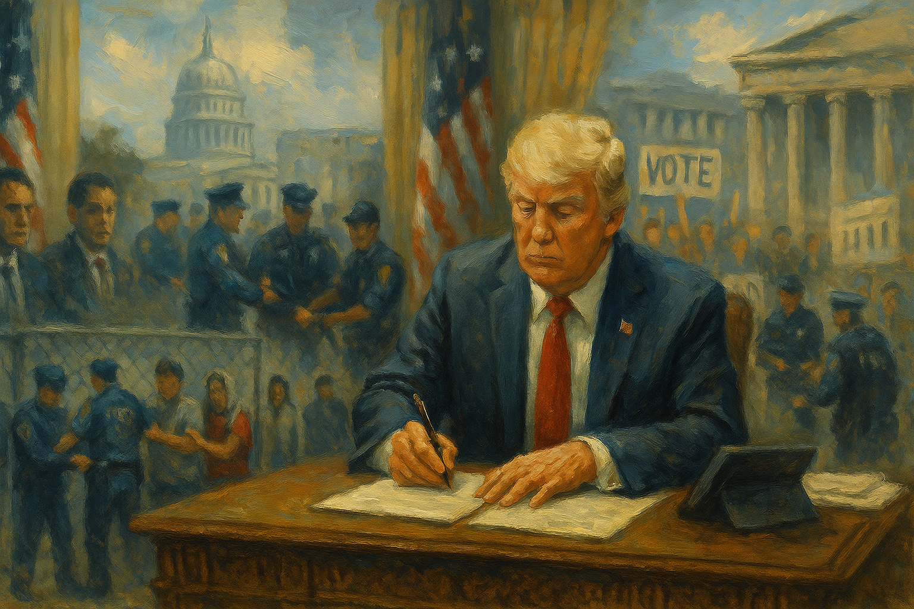

<!-- Generated by build_publish_week_v1 (appendix post) -->
<!-- Header image: image_wide_week12_appendix.png -->

# Week 12 Appendix: Emergency Powers as Routine Governance

*Tariffs, deportations, and funding threats fused into a single method of rule, tightening executive control while leaving formal institutions visibly intact.*

This week shows an aggressive consolidation of executive power, with Trump using emergency tariff authorities, immigration law, and executive orders to bypass Congress and punish perceived enemies. The tariff shock and chaotic partial pause exemplify governance by economic brinkmanship, offloading risk onto the public while insiders maneuver around the volatility. Immigration policy hardens into a mass-deportation regime: TPS holders, asylum seekers, students, and even legal residents are detained or expelled under dubious legal theories, while the IRS and Palantir data are repurposed to feed enforcement. Simultaneously, universities, law firms, NGOs, and cultural institutions are brought to heel through funding freezes, consent decrees, and retaliatory orders, eroding independent centers of knowledge and legal defense. Voting rights come under direct attack via the SAVE Act and targeted challenges to military and overseas ballots. There is some institutional resistance—federal judges protect AP access, block certain immigration terminations, and order Abrego Garcia’s return; Congress introduces bills to claw back tariff power; mass protests and civic mobilization continue—but the net structural pressure is strongly toward normalized emergency rule, weaponized law, and a stratified citizenship regime.

Power and Authority

1. Trump administration threatened and then withdrew $400 million in federal funding from Columbia University over protest policies (2025-04-05): The administration used federal grants as leverage to force Columbia to change protest and security policies, pressuring academic governance and signaling that access to public funds depends on political alignment with the executive.

2. President Trump created a White House faith office and a Task Force to Eradicate Anti-Christian Bias led by Paula White (2025-04-05): Establishing a faith office and anti–Christian bias task force inside the White House embedded a particular religious agenda in executive policymaking, blurring church–state separation and privileging one faith in federal priorities.

3. White House publicly attacked a federal judge who ordered return of a wrongfully deported resident (2025-04-05): By denouncing Judge Paula Xinis as a “Marxist judge” after she ordered Kilmar Abrego Garcia returned, senior aides signaled contempt for judicial authority and tried to delegitimize court oversight of executive deportation powers.

4. President Trump announced unexpectedly high global tariffs framed as “Liberation Day” (2025-04-06): Trump’s unilateral imposition of sweeping tariffs on many countries concentrated macroeconomic decision-making in the presidency, using emergency trade powers with limited congressional input and triggering major market disruption.

5. President Trump used the International Emergency Economic Powers Act to justify unilateral tariffs (2025-04-07): Invoking IEEPA to impose tariffs shifted trade policy from Congress to the White House under a standing “emergency,” normalizing emergency economic governance and inviting legal challenges over separation of powers.

6. President Trump announced and then threatened escalating tariffs on China in response to retaliation (2025-04-08): Trump’s repeated threats to raise already high tariffs on China, tied to short deadlines and social media statements, used trade sanctions as a personal bargaining tool, heightening economic uncertainty and executive leverage.

7. President Trump issued executive orders massively increasing tariffs on Chinese imports and restructuring reciprocal tariff rates (2025-04-08): Executive orders raising effective tariffs on China into triple digits and resetting reciprocal rates entrenched one-person control over trade architecture, sidelining normal legislative processes for setting tax-like measures.

8. President Trump signed multiple executive orders to promote coal and override state and federal climate policies (2025-04-08): Orders reclassifying coal, lifting leasing limits, and directing DOJ to attack state climate laws centralized energy policy in the presidency and weakened state and scientific checks on fossil-fuel interests.

9. President Trump disbanded the DOJ National Cryptocurrency Enforcement Team and curtailed regulatory litigation on digital assets (2025-04-08): Shutting down DOJ’s crypto enforcement unit and renouncing regulatory cases shifted federal power away from policing complex financial frauds, favoring industry interests and narrowing legal tools against emerging economic abuses.

10. President Trump publicly framed his global tariff war as a historic corrective and path to ending income taxes (2025-04-08): By justifying sweeping tariffs with a selective reading of history and linking them to abolishing income taxes, Trump used populist economic narratives to legitimize concentrating fiscal power in the executive.

11. President Trump and Defense Secretary Pete Hegseth proposed a record $1 trillion defense budget (2025-04-08): The proposed jump in Pentagon spending, amid cuts to civilian agencies, shifted federal priorities toward military power over domestic services, reinforcing an imbalance between security institutions and social programs.

12. President Trump ordered the IRS to share undocumented taxpayers’ data with DHS for immigration enforcement (2025-04-08): Directing tax authorities to provide confidential filings to DHS repurposed a revenue agency into an immigration-enforcement tool, undermining taxpayer privacy and deterring compliance among vulnerable groups.

13. President Trump signed executive orders to strengthen electric grid reliability while favoring all existing generation sources (2025-04-08): The grid security order centralized emergency authority in the Energy Department to keep all generation online, potentially privileging politically favored fuels while reducing environmental and state-level constraints.

14. President Trump directed DOJ to challenge state and local energy and climate regulations deemed burdensome (2025-04-08): Ordering federal lawyers to attack state climate and energy rules used national power to discipline disfavored jurisdictions, weakening federalism and insulating fossil-fuel interests from subnational accountability.

15. President Trump issued executive orders to investigate former officials Miles Taylor and Chris Krebs and target Susman Godfrey law firm (2025-04-09): Using executive orders to strip clearances and trigger investigations of critics and a firm that litigated against his allies turned state power into a weapon against perceived enemies in the legal and security communities.

16. President Trump signed a memorandum authorizing a military buffer zone along the southern border (2025-04-11): Authorizing active-duty soldiers to detain migrants on public lands militarized border enforcement and blurred lines between civilian policing and military roles in domestic space.

17. President Trump signed a memo allowing the military to take over public lands along the southern border (2025-04-10): Empowering the military to control public lands for border operations expanded security forces’ footprint over civilian territory, raising concerns about environmental stewardship and civil oversight.

18. President Trump announced a large military parade in Washington, DC tied to his birthday (2025-04-06): Planning a capital-city military parade centered on the president used armed forces for personal political spectacle, reinforcing leader-focused symbolism rather than neutral national commemoration.

19. President Trump signed executive orders to modernize defense acquisitions and reform foreign defense sales (2025-04-09): Rewriting acquisition and foreign sales rules from the Oval Office concentrated discretion over major defense contracts and arms exports in the executive, with implications for oversight and foreign policy leverage.

20. President Trump issued a zero-based regulatory budgeting order for energy-related agencies (2025-04-09): Forcing EPA and DOE to sunset energy regulations unless reapproved gave the White House a recurring veto over environmental rules, favoring deregulation and weakening long-term policy stability.

21. President Trump signed an executive order to reduce anti-competitive regulatory barriers (2025-04-09): Directing agencies to purge rules labeled anti-competitive expanded presidential influence over the regulatory state, potentially enabling selective deregulation aligned with favored industries.

22. President Trump signed an executive order to restore America’s maritime dominance through federal funding and trade measures (2025-04-09): The maritime dominance order tied industrial policy, trade retaliation, and federal subsidies to presidential priorities, deepening executive control over a strategic sector with limited legislative design.

23. President Trump signed executive orders targeting multiple law firms over diversity and political work (2025-04-11): Orders revoking access and clearances for lawyers at firms tied to political rivals used presidential power to coerce private legal practices, undermining independent representation in cases involving the federal government.

24. President Trump signed executive orders targeting political opponents during an Oval Office event with state officials (2025-04-09): Using a high-profile Oval Office event to sign orders aimed at political adversaries normalized the use of presidential ceremonies to legitimize punitive actions against domestic opponents.

25. President Trump publicly renewed baseless claims that the 2020 election was rigged and demanded restrictive voting rules (2025-04-08): Reasserting false fraud narratives while calling for paper-only, same-day voting and citizenship proof sought to justify tighter federal and state control over ballot access on spurious grounds.

26. President Trump signed executive orders deregulating showerhead water pressure standards (2025-04-09): Rolling back water-efficiency rules by executive order, and bypassing normal notice-and-comment, highlighted how consumer and environmental standards could be unilaterally weakened by presidential fiat.

27. President Trump terminated funding for the US Global Change Research Program and the national climate assessment contract (2025-04-09): Cutting off funding for the federal climate assessment infrastructure curtailed coordinated climate research, reducing evidence available to policymakers and the public about long-term risks.

28. President Trump ordered DOJ to halt enforcement of state climate superfund laws in New York and Vermont (2025-04-09): Directing federal lawyers not to support state efforts to recover climate damages from fossil-fuel companies used national power to shield an industry from subnational accountability.

29. President Trump ordered DOJ to investigate former officials and strip their security clearances for alleged disloyalty (2025-04-09): Targeting Miles Taylor and Chris Krebs for investigation and clearance revocation signaled that dissenting national-security officials could face punitive use of investigative powers after leaving office.

30. President Trump announced a 90-day pause on some tariffs while keeping high duties on China (2025-04-10): Temporarily pausing parts of his tariff plan after market turmoil, while maintaining extreme China rates, underscored how abrupt presidential moves could destabilize the economy and then be used as bargaining chips.

31. President Trump used an executive order to sanction the International Criminal Court and bar US support (2025-04-11): Sanctioning the ICC and prohibiting US persons from assisting it extended executive control over international justice cooperation, limiting accountability avenues for alleged war crimes.

32. President Trump fired NSA Director General Timothy Haugh and other national security officials following political pressure (2025-04-07): Removing the NSA director amid cyber threats, reportedly at the urging of partisan media figures, politicized top intelligence leadership and risked weakening professional security decision-making.

33. President Trump signed a memorandum directing creation of a military mission along the southern border (2025-04-11): Ordering multiple departments to deploy active-duty troops to detain migrants at the border expanded military involvement in domestic enforcement, challenging norms that separate armed forces from routine policing.

Institutions and Governance

1. Federal judge Paula Xinis ordered the government to return wrongfully deported legal resident Kilmar Abrego Garcia (2025-04-05): The order declared Abrego Garcia’s deportation unlawful and required his return, asserting judicial authority to remedy executive overreach in immigration enforcement.

2. Department of Justice placed immigration lawyer Erez Reuveni on indefinite leave after he admitted a wrongful deportation (2025-04-05): Suspending a career lawyer for candidly acknowledging an illegal deportation signaled that internal honesty about government misconduct could be punished, discouraging professional integrity within DOJ.

3. Federal judge temporarily halted termination of Temporary Protected Status for Venezuelans (2025-04-05): By pausing the administration’s attempt to end TPS for 350,000 Venezuelans, the court protected existing legal status and underscored judicial checks on abrupt policy reversals affecting large populations.

4. International student filed a lawsuit challenging visa revocation allegedly used to coerce self-deportation (2025-04-05): The suit contests immigration practices that revoke student status without violations, testing whether courts will curb executive tools that pressure lawful residents to leave.

5. Senators Chuck Grassley and Maria Cantwell introduced bipartisan legislation to limit presidential tariff powers (2025-04-07): Requiring congressional approval for new tariffs within 60 days aimed to reassert legislative control over trade policy and check unilateral economic actions by the president.

6. House Republicans advanced a bill to ban nationwide injunctions by federal judges (2025-04-07): Curtailing judges’ ability to issue nationwide injunctions would weaken a key tool for checking unlawful federal policies, shifting power away from the judiciary toward the executive.

7. House Judiciary subcommittee held a hearing on alleged judicial overreach targeting rulings against Trump policies (2025-04-07): Framing adverse decisions as overreach and exploring ways to curb such judges politicized judicial review and signaled congressional support for narrowing court checks on executive actions.

8. Senate Judiciary Committee held a hearing on banning universal injunctions and considered related legislation (2025-04-07): Senate consideration of ending universal injunctions reflected bipartisan pressure on courts’ ability to block federal policies nationwide, with implications for rapid relief in constitutional cases.

9. US Senate passed a bipartisan amendment to reverse Trump’s tariffs on Canadian imports (2025-04-07): The vote to roll back 25% tariffs on Canada showed Congress attempting to mitigate economic harm and reclaim some authority over trade decisions from the executive branch.

10. New Civil Liberties Alliance filed a lawsuit challenging Trump’s use of IEEPA to impose tariffs on China (2025-04-07): The suit argues that emergency economic powers do not authorize tariffs, asking courts to reassert Congress’s constitutional role over taxation and trade.

11. US Supreme Court vacated a classwide injunction blocking deportations under the Alien Enemies Act (2025-04-07): By requiring individual habeas challenges in Texas rather than a DC class action, the Court made it procedurally harder for Venezuelan migrants to contest deportations under an 18th-century statute.

12. US Supreme Court granted an administrative stay blocking rehiring of thousands of fired federal probationary workers (2025-04-08): Staying lower-court orders that required rehiring about 16,000 dismissed civil servants allowed the administration’s mass firings to stand during litigation, weakening protections for politically vulnerable staff.

13. US Supreme Court ordered the government to facilitate Kilmar Abrego Garcia’s return to the United States (2025-04-10): The unanimous order requiring steps to undo a wrongful deportation affirmed judicial power to remedy executive violations, though subsequent noncompliance raised questions about enforceability.

14. US District Judge Trevor McFadden ordered the White House to restore Associated Press access to presidential events (2025-04-08): The ruling held that banning AP over its refusal to adopt “Gulf of America” violated the First Amendment, reinforcing that viewpoint-based press exclusions are unconstitutional.

15. North Carolina Supreme Court temporarily stayed a lower-court order requiring verification of 60,000 ballots (2025-04-08): The stay paused a recount and ID verification scheme that could have disenfranchised tens of thousands of voters in a state supreme court race, preserving ballots while legal challenges proceed.

16. North Carolina Court of Appeals ordered recount and identity verification for 60,000 ballots in a state supreme court election (2025-04-08): Requiring targeted voters to prove eligibility post-election, on pain of having ballots discarded, introduced a retroactive hurdle that could alter the outcome of a close judicial race.

17. US Supreme Court blocked a California ruling that mandated rehiring of 16,000 fired federal workers (2025-04-08): By focusing on plaintiffs’ standing and granting a stay, the Court allowed the administration’s large-scale civil service purge to continue, limiting judicial protection for probationary employees.

18. US Court of Appeals for the DC Circuit reinstated two independent agency board members fired by the Trump administration (2025-04-07): Reinstating Cathy Harris and Gwynne Wilcox to MSPB and NLRB reaffirmed limits on presidential removal of independent agency officials, though the administration signaled plans to appeal.

19. Federal courts issued injunctions and mandates blocking most of Trump’s orders targeting specific law firms (2025-04-07): Courts sided with firms like Perkins Coie, Jenner & Block, and WilmerHale against executive orders punishing them for representing political rivals, defending legal independence from retaliatory regulation.

20. American Library Association and cultural workers’ union sued to block cuts to the Institute for Museum and Library Services (2025-04-08): The lawsuit seeks to preserve federal support for libraries and museums, arguing that funding cuts threaten public access to cultural and educational resources and exceed lawful executive discretion.

21. Federal judge blocked termination of a humanitarian parole program for over 500,000 migrants (2025-04-10): Stopping the administration from ending a program for Cubans, Haitians, Nicaraguans, and Venezuelans preserved temporary legal status for hundreds of thousands and checked abrupt policy reversal.

22. Federal judge rejected Trump’s motion to dismiss a defamation suit by the Exonerated Five (2025-04-10): Allowing the case to proceed signaled that even a president can face civil accountability for harmful public statements, reinforcing that high office does not confer blanket immunity.

23. US Senate summoned Health Secretary Robert F. Kennedy Jr. to testify on a measles outbreak (2025-04-08): Calling a vaccine-skeptical health secretary to account for a deadly measles outbreak exercised legislative oversight over public health policy and the performance of a controversial appointee.

24. US House Rules Committee approved a rule blocking a floor vote to overturn Trump’s tariff emergency (2025-04-09): Embedding a procedural barrier in budget legislation prevented the House from voting on a resolution disapproving the tariff emergency, weakening Congress’s ability to check executive economic decrees.

25. National Review editors publicly urged Congress to reclaim economic powers ceded to the president (2025-04-09): A conservative outlet’s call for legislative reassertion over tariffs highlighted cross-ideological concern that concentrated presidential control over economic policy undermines constitutional balance.

26. Senator Rand Paul spoke against governing under emergency rule regardless of party (2025-04-09): Paul’s floor speech criticized reliance on emergency declarations, emphasizing the need for regular legislative processes and warning against normalized exceptional powers.

27. US House of Representatives passed the No Rogue Rulings Act to limit lower courts’ ability to affect national policy (2025-04-09): Restricting nationwide impact of lower-court orders would reduce the judiciary’s capacity to quickly halt unlawful federal actions, shifting power toward the executive and higher courts.

28. Senator Jeanne Shaheen introduced a bill to bar contracts to companies owned by special government employees like Elon Musk (2025-04-09): The proposal sought to close a conflict-of-interest gap by preventing special government employees from steering federal contracts to their own firms, reinforcing ethical boundaries in procurement.

29. US House Education and Workforce Committee dropped its investigation into Northwestern law school clinics after a lawsuit (2025-04-11): Ending the probe following professors’ First Amendment challenge marked a retreat from congressional scrutiny that threatened academic freedom and the independence of clinical legal work.

30. Atlanta Community Press Collective and Lucy Parsons Labs pursued an open-records lawsuit to subject the Atlanta Police Foundation to transparency laws (2025-04-11): The case tests whether a powerful private police foundation must disclose records like a public agency, potentially expanding oversight of quasi-public entities funding law enforcement projects.

31. North Carolina Supreme Court ordered overseas and military voters to prove eligibility within 30 days or lose their votes (2025-04-11): Imposing new documentation requirements after ballots were cast risked disenfranchising lawful overseas and military voters in a close judicial race, raising rule-of-law and fairness concerns.

32. US District Court in Maine heard a challenge to Trump’s sanctions order against the International Criminal Court (2025-04-11): Human rights advocates argued that sanctions blocking them from assisting the ICC violate their First Amendment rights, asking courts to limit executive power over international justice cooperation.

33. US Senate confirmed John Dan Caine as chairman of the Joint Chiefs of Staff after waiving usual qualifications (2025-04-11): Confirming a less-qualified retired officer under a presidential waiver raised concerns that top military leadership is being selected for loyalty rather than professional criteria.

34. Federal Election Commission designated several senior posts as policy-making or confidential under an executive order (2025-04-10): Labeling key FEC roles as policy-determining clarified which positions are insulated from routine turnover, but also highlighted how executive directives shape the stability of election oversight staff.

35. Election Assistance Commission renewed charters for its advisory committees on voting systems and best practices (2025-04-11): Extending advisory bodies that guide election administration maintained institutional mechanisms for expert input into voting technology and procedures.

36. House of Representatives passed a Republican budget framework enabling large tax cuts and spending reductions (2025-04-10): The budget resolution paved the way to enact Trump’s tax and immigration agenda via reconciliation, bypassing the Senate filibuster and reshaping fiscal priorities with limited bipartisan deliberation.

37. Senator Cory Booker delivered a 25-hour Senate speech urging defense of democracy (2025-04-06): Booker’s record-setting speech used Senate floor time to spotlight democratic erosion and mobilize public engagement, illustrating how legislative procedure can be used for pro-democracy signaling.

38. National Archives and Records Administration and GSA sought public comment on multiple information-collection and service-delivery initiatives (2025-04-09): Routine PRA notices on records access, surplus property, and customer experience reflected ongoing administrative processes that support transparency and service quality despite broader political pressures.

Economic Structure

1. Rep. Marjorie Taylor Greene executed large Treasury bill trades shortly before Trump’s tariff announcement (2025-04-05): Greene’s well-timed shift into Treasuries ahead of market-moving tariffs raised concerns about potential misuse of nonpublic information by a lawmaker during a major economic policy change.

2. Federal Reserve Chair Jerome Powell warned that Trump’s tariffs were likely to raise inflation and cost jobs (2025-04-05): Powell’s assessment highlighted that unilateral tariff hikes could erode employment and price stability, underscoring the macroeconomic risks of executive-driven trade shocks.

3. US stock markets experienced severe declines following tariff announcements (2025-04-05): Sharp multi-day drops in major indices reflected investor alarm at sudden tariff hikes, illustrating how concentrated executive trade decisions can rapidly destroy household and institutional wealth.

4. Social Security Administration leadership implemented personnel cuts that employees described as putting the agency in a “death spiral” (2025-04-05): Staff reductions at SSA threatened timely delivery of core benefits, weakening a foundational social insurance program that underpins economic security for millions.

5. Elon Musk and the Department of Government Efficiency restructured federal agencies and expanded Musk-linked contracts (2025-04-05): DOGE-driven cuts and placement of Musk allies in key posts, alongside major contracts for his firms, deepened corporate influence over public functions and blurred lines between governance and private business.

6. President Trump moved the federal student loan program from the Education Department to the Small Business Administration (2025-04-06): Transferring student loans to an under-resourced SBA reframed higher education finance as a business function, risking service failures for borrowers and weakening the Education Department’s role.

7. Goldman Sachs and other financial institutions raised recession probabilities and warned of tariff-driven economic risks (2025-04-06): Analysts’ increased recession odds and concern over inflation signaled that the tariff regime could trigger broad economic downturn, with disproportionate impact on workers and smaller firms.

8. Wall Street traders reacted with extreme volatility to rumors and denials about tariff pauses (2025-04-06): Markets swung wildly on unverified reports of tariff delays, then fell when rumors were denied, showing how opaque, personalized trade policymaking undermines economic predictability.

9. Environmental Protection Agency issued several technical rules on air monitoring, pesticide tolerances, and stormwater permits (2025-04-07): EPA’s designations of monitoring methods, pesticide tolerances, and NPDES permit coverage maintained regulatory frameworks for environmental and public health protection despite broader deregulatory pressures.

10. Federal Communications Commission sought public comment on multiple information-collection requirements and amended broadcast allotments (2025-04-07): FCC notices on telecom data collections and spectrum allocations for radio, TV, and uncrewed aircraft systems shaped infrastructure investment and compliance burdens in communications markets.

11. Food and Drug Administration updated drug approvals, susceptibility standards, and comment periods on food and veterinary issues (2025-04-09): FDA’s technical determinations on drug withdrawals, antimicrobial criteria, poppy seed risks, and data standards affected pharmaceutical markets and food safety oversight.

12. General Services Administration and other procurement agencies issued notices on acquisition regulations, change-order accounting, and extraordinary contractual actions (2025-04-11): These procurement notices governed how contractors report changes and seek relief, influencing transparency and risk allocation in federal contracting.

13. Food and Drug Administration corrected and clarified drug approval status for several products (2025-04-09): Clarifying that certain discontinued drugs were not withdrawn for safety reasons preserved pathways for generic competition and ensured regulatory accuracy in the Orange Book.

14. Food and Drug Administration withdrew approval of 18 new drug applications at applicants’ request (2025-04-09): Removing unused NDAs from the market clarified which products remain legally marketable, affecting competition and inventory decisions in the pharmaceutical sector.

15. Department of Health and Human Services reported a second measles death in Texas amid a large outbreak (2025-04-05): The expanding measles outbreak, with hundreds infected, underscored the economic and social costs of weakened vaccination norms and public health infrastructure.

16. President Trump and trade advisers compiled and maintained a list of new tariff rates for about 90 countries (2025-04-09): Publishing a sweeping tariff schedule for dozens of countries institutionalized a complex, unilateral trade regime that is difficult to negotiate away and burdens global commerce.

17. White House signaled no change in overall tariff policy despite market turmoil (2025-04-09): Insisting that tariffs were not a negotiating tactic but a permanent response to trade deficits entrenched protectionist policy, prolonging uncertainty for businesses and consumers.

18. President Trump maintained a 10% blanket tariff on all imports alongside higher country-specific duties (2025-04-09): Keeping a universal import surcharge raised baseline prices for consumers and firms, effectively functioning as a broad consumption tax set by executive action.

19. President Trump announced a 90-day pause on many tariffs while keeping elevated rates on China (2025-04-09): The partial pause after a market crash illustrated how abrupt tariff policy shifts can be used to manage political fallout while leaving structural trade disruptions in place.

20. White House refused to release a list of 75 countries allegedly seeking trade deals (2025-04-09): Withholding the list of supposed trade suitors limited public scrutiny of the administration’s trade narrative and made it harder to assess the credibility of claimed economic support.

21. President Trump hosted a $1 million-per-person fundraiser for MAGA Inc. amid economic turmoil (2025-04-05): Holding an ultra-high-dollar fundraiser at his own property while markets reeled from his tariffs highlighted how economic crisis can coincide with intensified elite fundraising and potential conflicts of interest.

22. President Trump and Saudi sovereign wealth officials hosted Saudi fund leadership at Trump properties for a $1 million-a-head dinner (2025-04-05): The event underscored potential emoluments and foreign influence concerns, as foreign sovereign wealth representatives paid large sums at venues owned by the sitting president.

23. Food and Drug Administration and other health agencies faced budget cuts raising concerns about food and drug safety (2025-04-07): Reductions at FDA and related agencies risked weakening oversight of food contamination and pharmaceuticals, shifting health risks onto the public to achieve budgetary or ideological goals.

24. China, European Union, Canada, and other partners imposed retaliatory tariffs on US goods in response to Trump’s measures (2025-04-06): Counter-tariffs from major trading partners escalated the trade war, threatening export markets for US producers and deepening global economic instability.

25. China blocked the sale of TikTok’s US operations while tariffs remain in effect (2025-04-07): Beijing’s move tied corporate transactions to the tariff dispute, illustrating how economic conflict can spill into control over major digital platforms and investment flows.

26. Avelo Airlines signed a contract to operate deportation flights for ICE (2025-04-08): By dedicating aircraft to deportation charters, Avelo deepened private-sector involvement in coercive state functions, raising questions about profit incentives in removal operations.

27. Trump administration froze over $1.7 billion in federal funding to Cornell and Northwestern universities (2025-04-09): Suspending large research and grant streams over alleged antisemitism used economic pressure to influence campus policies and chilled academic independence.

28. Trump administration canceled or paused hundreds of millions in grants and loans to multiple universities over ideological disputes (2025-04-10): Defunding Columbia, Harvard, Princeton, and the University of Pennsylvania over protest and transgender policies weaponized federal spending to enforce cultural and political conformity in higher education.

29. Tesla halted orders for certain models in China due to reciprocal tariffs (2025-04-10): Tesla’s withdrawal from parts of the Chinese market showed how tariff escalation can directly constrain US firms’ global operations and investment decisions.

30. Social Security Administration reversed a plan to end phone service for new benefit claims after public backlash (2025-04-10): Canceling a policy that would have forced tens of thousands of elderly and disabled claimants into field offices preserved remote access to benefits and showed that public pressure can still correct harmful administrative changes.

31. Trump administration cut $1.5 million in corrections funding to Maine over housing a trans woman in a women’s prison (2025-04-08): Withholding substance-use and family-program funds to punish a state’s transgender housing decision used fiscal tools to enforce ideological positions on gender in corrections policy.

32. Trump administration imposed a combined 145% tariff on Chinese imports, heavily impacting consumer electronics (2025-04-11): The extreme tariff rate on Chinese goods, including iPhones, dramatically raised expected consumer prices and exemplified how trade policy can function as a regressive tax set by executive decree.

33. Trump administration implemented deep cuts to federal scientific grant-making and staff in targeted fields (2025-04-11): Reducing capacity to administer grants in areas like AIDS, trans issues, and climate weakened US scientific infrastructure and skewed research priorities away from politically disfavored topics.

34. Trump administration increased tariffs on China again despite pausing some other tariffs (2025-04-11): Persistently raising China-specific tariffs while markets struggled signaled a willingness to accept long-term economic harm in pursuit of a confrontational trade strategy.

35. Department of Justice opened an antitrust investigation into alleged egg price-fixing by major producers (2025-04-09): Probing whether egg companies exploited a bird flu crisis to inflate prices addressed potential collusion affecting a staple food, testing whether antitrust tools will be used to protect consumers.

36. Lawmakers and regulators raised concerns and sought investigations into possible insider trading around tariff policy shifts (2025-04-09): Suspicious trading spikes before tariff announcements prompted calls for probes, highlighting fears that privileged actors may be profiting from advance knowledge of volatile economic decisions.

37. House of Representatives approved a budget framework projected to add $5.8 trillion to the national debt (2025-04-09): The plan to pair large tax cuts with limited offsetting cuts increased long-term borrowing, potentially constraining future social spending and amplifying fiscal vulnerability.

38. Trump administration insisted that Apple move iPhone production to the United States despite feasibility concerns (2025-04-09): Pressuring a major firm to reshore complex manufacturing under a punitive tariff regime illustrated how executive rhetoric and policy can attempt to reshape global supply chains, regardless of capacity.

Civil Rights and Dissent

1. Immigration and Customs Enforcement detained a British tourist for 19 days despite her attempt to leave the US (2025-04-05): Holding a departing tourist in immigration detention highlighted how aggressive enforcement can ensnare nonthreatening visitors, raising concerns about proportionality and due process.

2. Federal immigration agents arrested and sought to deport graduate students involved in pro-Palestinian protests (2025-04-05): Targeting student protesters through immigration enforcement blurred the line between security policy and suppression of campus dissent, especially for noncitizen activists.

3. Trump administration arrested Venezuelan TPS holders despite legal protections against such detentions (2025-04-05): Detaining people with Temporary Protected Status in apparent violation of statutory safeguards undermined trust in legal protections and heightened fear among lawfully present migrants.

4. Trump administration sought to deport Columbia activist Mahmoud Khalil, a green-card holder, as a foreign policy threat (2025-04-05): Using a rarely invoked foreign-policy deportation provision against a campus activist suggested that political speech could be treated as a national security risk for noncitizens.

5. Secretary of State Marco Rubio revoked about 300 student visas for individuals deemed foreign policy threats (2025-04-05): Mass visa revocations targeting alleged Hamas supporters on campuses threatened academic freedom and signaled that political associations could cost international students their legal status.

6. AFL-CIO President Liz Shuler reported that Trump effectively nullified collective bargaining agreements for 700,000 union workers (2025-04-05): The claimed nullification of large-scale union contracts represented a major rollback of organized labor’s bargaining power, weakening workers’ collective voice in both public and private sectors.

7. Department of Homeland Security subjected FEMA head Cameron Hamilton to a lie detector test over leak suspicions (2025-04-05): Polygraphing a senior official to hunt for leaks reflected a climate of internal surveillance that can chill whistleblowing and honest communication within the civil service.

8. Immigration and Customs Enforcement arrested a compliant Nicaraguan asylum seeker during routine check-ins (2025-04-06): Detaining Alberto Lovo Rojas despite his adherence to ICE requirements showed how policy shifts can turn cooperative asylum seekers into sudden deportation targets.

9. Customs and Border Protection failed to conduct required welfare checks on a detained Chinese woman who died by suicide (2025-04-06): The death in custody, amid unverified welfare logs and delayed public disclosure, raised serious concerns about detainee safety, oversight, and transparency in border facilities.

10. Trump administration expanded ICE’s mandate to prioritize arrest of all undocumented immigrants, including those regularly checking in (2025-04-06): Broadening enforcement to target previously low-priority individuals increased fear in immigrant communities and weakened incentives for cooperation with authorities.

11. Federal agents detained a lawyer representing a pro-Palestinian demonstrator and sought access to his phone (2025-04-06): Stopping and questioning a defense attorney about his clients threatened attorney–client confidentiality and could deter legal representation in politically sensitive cases.

12. ICE and DHS released a detained immigrant family after large protests outside a senior official’s home (2025-04-07): The family’s release following public demonstrations showed that organized protest can still influence individual enforcement decisions within a harsh deportation regime.

13. Department of Homeland Security deported Venezuelans to El Salvador, most without criminal convictions (2025-04-07): Sending largely non-criminal Venezuelans to detention in El Salvador under gang allegations highlighted how broad security labels can justify severe deprivations of liberty.

14. Department of Homeland Security revoked legal status of migrants who entered via the CBP One app and ordered them to leave (2025-04-07): Canceling status for over 900,000 people who followed prior legal pathways undermined trust in government programs and exposed them to sudden deportation risk.

15. Department of Homeland Security announced plans to build up to $45 billion in new privately run immigrant detention facilities (2025-04-08): Massive investment in lower-standard private detention expanded the infrastructure for long-term confinement of migrants, deepening reliance on profit-driven incarceration.

16. Acting IRS Commissioner Melanie Krause resigned over the IRS–DHS data-sharing agreement on undocumented taxpayers (2025-04-08): Her resignation signaled internal alarm that using tax data for deportations violated legal norms and could deter immigrants from filing returns, weakening both rights and revenue.

17. Trump administration expanded its crackdown on international students flagged in criminal records checks, even without charges (2025-04-08): Targeting students based on database flags rather than convictions risked guilt by association and threatened educational continuity for noncitizens.

18. Medicaid recipients and advocates marched on Capitol Hill to oppose proposed cuts to Medicaid and SNAP (2025-04-08): Low-income beneficiaries organized to defend safety-net programs, using protest and direct lobbying to resist budget plans that could reduce access to health care and food assistance.

19. Trump administration cut corrections funding to Maine because a trans woman was housed in a women’s prison (2025-04-08): Withholding funds for substance-use and family programs to punish a transgender housing decision used fiscal leverage to pressure states on carceral policy and LGBTQ rights.

20. US Attorney General Pam Bondi limited enforcement of the Foreign Agents Registration Act for criminal violations (2025-04-11): Scaling back FARA prosecutions reduced tools to police covert foreign influence, even as foreign actors sought to shape US policy, weakening protections for democratic self-determination.

21. Immigration and Customs Enforcement sent erroneous deportation notices to US citizens and lawful residents (2025-04-11): Mistakenly ordering citizens and green-card holders to leave the country within seven days exposed serious flaws in enforcement databases and threatened basic security of legal status.

22. Immigration and Customs Enforcement and DOGE staff used Palantir and other databases to identify immigrants for deportation based on detailed personal data (2025-04-11): Mining government and commercial data for physical and financial traits to target deportations expanded surveillance of migrants and raised risks of discriminatory profiling.

23. Trump administration pressured immigrants with temporary legal status to self-deport by canceling Social Security numbers (2025-04-10): Revoking SSNs to block work and benefits for legally present migrants weaponized economic precarity to force departures without formal removal proceedings.

24. US Citizenship and Immigration Services began surveilling visa holders’ social media for alleged antisemitism (2025-04-09): Monitoring online speech for ideological content as part of immigration vetting risked punishing lawful residents for protected expression and chilling political discourse.

25. Los Angeles police shot Jillian Lauren during a search and later charged her with attempted murder (2025-04-10): The shooting and serious charge against a resident uninvolved in the original crime search raised questions about police use of force and prosecutorial discretion in civilian encounters.

26. Los Angeles County District Attorney charged a youth soccer coach with murder and sexual offenses against minors (2025-04-09): Prosecuting serious abuse allegations against a coach underscored the justice system’s role in protecting children, including those from immigrant families, from exploitation.

27. South Carolina authorities and defense lawyers contested an execution by firing squad before the US Supreme Court (2025-04-10): The petition challenging firing-squad execution procedures and ineffective counsel highlighted ongoing constitutional debates over capital punishment and fair sentencing.

28. US Supreme Court and lower courts handled multiple emergency orders and appeals in the Abrego Garcia deportation case (2025-04-10): The back-and-forth over Abrego Garcia’s wrongful deportation exposed tensions between judicial orders and executive compliance, with direct consequences for an individual’s liberty and family.

29. Trump administration deported Venezuelan migrants to El Salvador based on tattoos misidentified as gang symbols (2025-04-11): Relying on flawed tattoo evidence to label migrants as gang members and deport them to third countries showed how thin or erroneous indicators can drive life-altering security decisions.

30. US border officials detained and deported an Australian worker with a valid visa after accusing him of drug activity (2025-04-11): Invalidating a visa and imposing a five-year ban without clear due process highlighted the discretionary power of border agents and the vulnerability of lawful foreign workers.

31. Immigration agents attempted to enter Los Angeles elementary schools to locate young students (2025-04-11): Efforts to access elementary schools for immigration enforcement, rebuffed by administrators, challenged norms that schools are safe spaces and heightened fear among immigrant families.

32. Immigration and Customs Enforcement detained Tufts student Rümeysa Öztürk and allegedly denied adequate medical care (2025-04-11): Reports of repeated asthma attacks, unsanitary conditions, and forced removal of her hijab in detention highlighted human rights and religious-freedom concerns in immigration custody.

33. US Space Force and Defense Secretary Pete Hegseth fired a Space Force base commander in Greenland for distancing the unit from political comments (2025-04-10): Removing Colonel Susannah Meyers for trying to keep the base apolitical signaled that military leaders could be punished for resisting politicization, threatening norms of nonpartisan service.

34. US Diplomatic Security Service saw a supervisor arrested in Brussels after an altercation with hotel staff and police (2025-04-07): The incident raised questions about conduct standards for US security personnel abroad and potential diplomatic fallout from misbehavior by armed federal agents.

35. Health and Human Services Secretary Robert F. Kennedy Jr. publicly endorsed MMR vaccination amid a deadly measles outbreak (2025-04-07): Kennedy’s reversal toward supporting vaccination, after prior skepticism, acknowledged the importance of evidence-based public health measures for protecting vulnerable communities.

Information, Memory and Manipulation

1. Trump administration restricted Associated Press access after it refused to use “Gulf of America” (2025-04-05): Punishing AP for not adopting an official renaming attempted to coerce media outlets into echoing executive narratives, undermining independent editorial judgment.

2. President Trump shared a video falsely claiming Warren Buffett backed his plan to crash markets for profit (2025-04-05): Amplifying fabricated endorsements and motives for his economic policy spread disinformation about market strategy, eroding trust in official economic communications.

3. National Park Service removed Harriet Tubman’s image and quote from an Underground Railroad webpage and reframed content (2025-04-07): Rewriting the page to emphasize “Black/White cooperation” and omit slavery references aligned with a broader anti-DEI push, reshaping public memory of resistance to slavery.

4. Trump administration ordered the Pentagon to scrub diversity, equity, and inclusion content from public platforms (2025-04-07): Deleting references to racism, ethnicity, and LGBTQ topics from Defense websites removed information about marginalized groups’ service and experiences from official narratives.

5. Trump administration intensified pressure on pro-Palestinian student journalists, leading to takedowns and resignations (2025-04-07): Government actions and arrests created a climate where student outlets self-censored coverage of Israel–Palestine, narrowing the range of viewpoints in campus media.

6. Major US corporations remained publicly silent on Trump’s tariffs due to fear of retaliation (2025-04-07): Corporate leaders’ reluctance to criticize economically harmful tariffs suggested that fear of executive punishment can mute influential voices that might otherwise inform public debate.

7. National Park Service restored Harriet Tubman content to its Underground Railroad webpage after criticism (2025-04-07): Reinstating Tubman’s image and quote partially reversed an earlier historical sanitization, showing that public and internal pushback can sometimes correct politicized edits to official history.

8. Internal Revenue Service and DHS agreed to share sensitive taxpayer data on undocumented immigrants for enforcement (2025-04-08): Using confidential tax records to aid deportations blurred the line between revenue collection and policing, undermining privacy norms that support honest reporting.

9. US State Department under Secretary Marco Rubio ordered staff to report instances of “anti-Christian bias” from the prior administration (2025-04-11): Directing diplomats to compile grievances about alleged anti-Christian discrimination repurposed bureaucratic reporting to support a favored religious narrative in government policy.

10. Trump administration and Mississippi Library Commission deleted race relations and gender studies databases from a statewide library system (2025-04-11): Removing these databases from publicly funded institutions limited access to scholarship on race and gender, aligning information policy with anti-DEI legislative agendas.

11. US Attorney General Pam Bondi and DOJ reduced enforcement of foreign influence disclosure laws despite evidence of increased activity (2025-04-11): Scaling back FARA prosecutions while foreign sovereign funds sought influence made it harder for the public to see who is lobbying for overseas interests in US politics.

12. White House declined to release the list of countries allegedly seeking trade deals with the US (2025-04-09): Refusing to substantiate claims about widespread interest in new trade agreements limited independent verification of the administration’s economic narrative.

13. Department of Government Efficiency and ICE used government databases and algorithms to identify immigrants for deportation (2025-04-11): Leveraging large-scale data analytics to filter people by traits for removal expanded algorithmic governance over individuals’ fates with limited transparency or recourse.

14. Department of Homeland Security used a British man’s tattoo photo in materials to identify alleged Venezuelan gang members (2025-04-11): Misusing an unrelated tattoo image as a gang marker in deportation guidance showed how sloppy intelligence can feed into life-altering enforcement decisions.

15. Pro-Israel group StopAntisemitism asked DOJ to investigate children’s entertainer Ms Rachel as a possible foreign agent (2025-04-09): Seeking a FARA probe over social media posts sympathetic to Gaza children raised the prospect of using foreign-agent laws to intimidate domestic speech on controversial issues.

16. Conservative influencer Matthew Wallace was sued for defamation by a trans woman falsely accused of piloting a crashed helicopter (2025-04-09): The lawsuit over viral false claims highlighted how online misinformation can endanger individuals and how civil courts may be used to seek accountability for such harms.

17. Trump administration ended funding for the US Global Change Research Program’s national climate assessment work (2025-04-09): Defunding the climate assessment infrastructure reduced authoritative public information about climate risks, making it harder for citizens and policymakers to base decisions on comprehensive science.

18. National Park Service and Smithsonian Institution were targeted by executive orders to remove “improper” or “anti-American” content (2025-04-07): Mandating removal of content labeled divisive from museums and research entities sought to align national cultural narratives with the administration’s ideological preferences.

19. Mississippi Library Commission deleted race and gender databases from the Magnolia system to comply with state laws (2025-04-11): Eliminating these resources from public libraries and schools narrowed access to scholarship on inequality and identity, embedding ideological constraints into information infrastructure.

20. Trump administration used emergency tariff announcements and reversals that fueled market rumors and confusion (2025-04-10): The rapid sequence of tariff threats, partial pauses, and unclear negotiations created information chaos that obscured accountability for economic damage and invited speculation about insider advantage.

21. Trump administration and universities used funding freezes and consent-decree threats to pressure campuses over protest narratives (2025-04-10): Tying billions in research and grant funding to how universities characterize and police antisemitism and protests incentivized institutions to align public messaging with federal preferences.

22. National Review, media, and polling organizations reported on public disapproval and elite concern over tariff chaos (2025-04-09): Coverage of falling approval ratings and conservative criticism of tariff governance provided counter-narratives to official claims, though their impact was constrained by executive control over policy.

