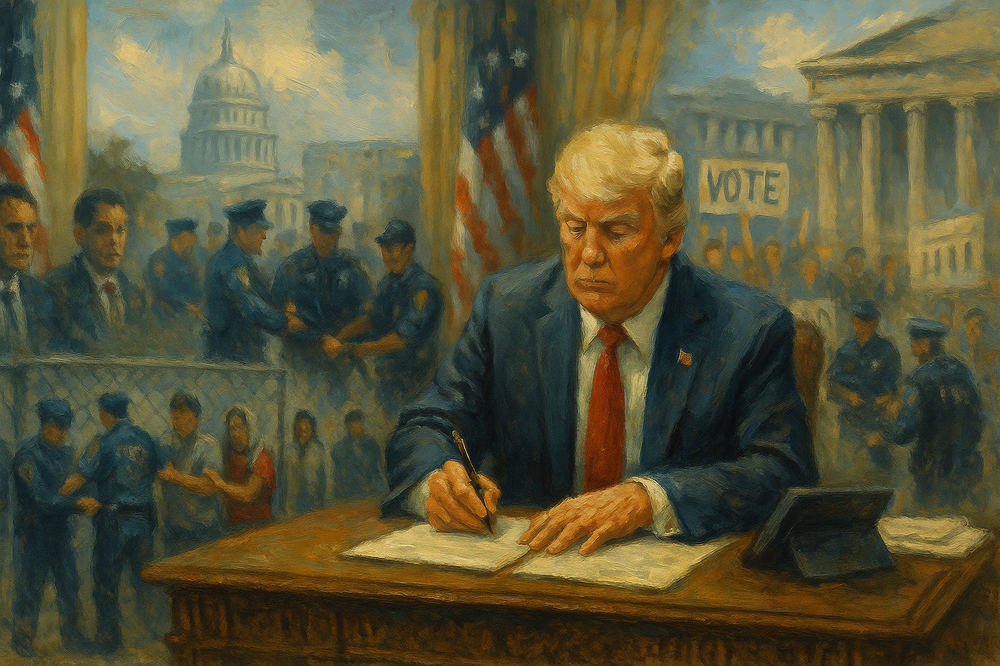

<!-- Generated by build_publish_week_v1 (appendix post) -->
<!-- Header image: image_wide_week12_appendix.png -->

# Week 12 Appendix: Erosion and Resistance Reach Equilibrium

*Tariffs, deportations, and law-firm coercion pushed state power outward while courts, universities, and millions of protesters pushed back just as hard.*

This week was defined by an aggressive, multi-front expansion of executive coercion against independent institutions, combined with a severe economic self-inflicted wound from erratic tariff policy. The administration escalated its campaign against law firms (Susman Godfrey, Perkins Coie, Jenner & Block, WilmerHale) and universities (Harvard, Columbia, Cornell, Northwestern, Penn), using funding freezes and executive orders to compel ideological compliance, while several major firms capitulated with hundreds of millions in pro bono commitments. The Abrego Garcia case became a flashpoint testing whether the administration would comply with a unanimous Supreme Court order, with DOJ lawyers openly stonewalling federal judges. Simultaneously, Trump's volatile tariff rollout — spiking to 145% on China, pausing others, then reversing — triggered historic market turmoil, prompted insider-trading allegations, and drew bipartisan congressional pushback. Mass "Hands Off" protests (over 1,400 rallies, millions of participants) signaled sustained civil-society mobilization. Immigration enforcement expanded into schools, targeted US citizens erroneously, and deployed the Alien Enemies Act with reduced due process, even as courts intermittently pushed back.

Power and Authority

1. DOGE (Elon Musk) reduced federal workforce and gutted USAID through rapid agency restructuring (2025-04-05) *[single source]*: Musk's DOGE continued mass firings across federal agencies and dismantling of USAID, reducing government capacity while placing allies in key posts.

2. Trump issued executive orders targeting law firms tied to political opponents, including Susman Godfrey and others linked to Dominion litigation and Russia probe (2025-04-09): Multiple executive orders stripped security clearances and building access from law firms that opposed Trump or represented his adversaries, using state power to punish legal representation.

3. Trump signed presidential memoranda revoking security clearances and ordering DOJ investigations of former officials Chris Krebs and Miles Taylor for past criticism and election-security work (2025-04-09): The president directed federal investigations of two former officials solely for prior dissent and truthful statements about the 2020 election, using law enforcement to punish critics.

4. DOJ (Todd Blanche, AG Pam Bondi) placed DOJ attorney Erez Reuveni on indefinite leave for truthfully conceding a wrongful deportation in court (2025-04-05): DOJ punished a career attorney for honesty about an unlawful deportation, signaling that political loyalty outweighs candor before courts.

5. Trump signed memorandum creating a military buffer zone at the southern border and directed review of invoking the Insurrection Act (2025-04-11): A new military mission along the border authorizes active-duty troops to detain migrants and considers invoking the 1807 Insurrection Act, expanding military involvement in domestic law enforcement.

6. Pete Hegseth fired a Space Force base commander in Greenland for distancing the base from JD Vance's political comments (2025-04-11) *[single source]*: A military commander was removed for maintaining political neutrality, signaling loyalty-based enforcement within the armed forces.

7. Trump hosted Saudi officials and foreign dignitaries at his resorts while endorsing the Saudi-backed LIV Golf takeover of the PGA Tour (2025-04-06): The president mixed personal financial interests with public office by profiting from foreign-linked events and endorsing a Saudi acquisition of a major American institution.

8. Trump administration cancelled collective bargaining agreements for 700,000 federal union workers (2025-04-06): A unilateral order stripped bargaining rights from hundreds of thousands of federal workers, a major rollback of labor protections described as a test case for wider rollback.

9. Trump announced a $1 trillion Pentagon budget proposal, reversing prior calls to reduce military spending (2025-04-07) *[single source]*: A record military budget proposal, following months of proposed cuts to social programs, signals a reordering of federal spending priorities toward defense.

10. Attorney General Pam Bondi cut $1.5 million in Maine corrections funding after the state housed a transgender woman in a women's facility (2025-04-08) *[single source]*: Federal funding was withdrawn from a state agency in retaliation for a policy disagreement over transgender inmate housing, punishing vulnerable populations to enforce ideological compliance.

Institutions and Governance

1. DC Court of Appeals ordered reinstatement of two independent agency board members fired by Trump (2025-04-08): A federal appeals court restored Trump's fired heads of the Merit Systems Protection Board and NLRB, temporarily checking executive removal power over independent agencies.

2. US District Judge Paula Xinis ordered the government to return wrongfully deported Kilmar Abrego Garcia and later demanded daily compliance updates after officials failed to comply (2025-04-07): A federal judge found the government's deportation of a legally protected resident 'wholly lawless' and repeatedly compelled compliance as DOJ officials stonewalled the court.

3. Supreme Court issued a unanimous 9-0 ruling requiring the government to facilitate Abrego Garcia's return (2025-04-10): The Supreme Court unanimously ordered the administration to facilitate return of a wrongfully deported man, but ambiguous language allowed continued executive delay.

4. Supreme Court ruled 5-4 to allow deportations under the 1798 Alien Enemies Act with limited due process protections (2025-04-07): The Court permitted use of an 18th-century wartime statute for mass deportation of alleged gang members while requiring notice and habeas review in the proper venue.

5. DOJ (Attorney General Pam Bondi) attempted to remove Judge Beryl Howell from a case after she ruled against the administration (2025-04-07) *[single source]*: DOJ sought to disqualify a judge for bias after an adverse ruling, prompting the judge to accuse the department of undermining judicial integrity.

6. Trump called for the impeachment and disbarment of Judge James Boasberg after an adverse deportation ruling (2025-04-07): The president publicly attacked a sitting federal judge over an unfavorable ruling, prompting Chief Justice Roberts to rebuke the calls as improper.

7. House Rules Committee blocked an expedited vote on a resolution to disapprove Trump's tariff emergency declaration (2025-04-09) *[single source]*: Republican leaders used procedural rules to shield members from voting on the president's tariff emergency powers, insulating the executive from congressional check.

8. House of Representatives passed the 'No Rogue Rulings Act' limiting lower-court judges' power to issue nationwide injunctions (2025-04-09) *[single source]*: The House passed legislation curbing federal judges' authority to block executive policies nationwide, narrowing a key judicial check on presidential power.

9. Trump administration froze federal funding to Cornell ($1 billion), Northwestern ($790 million), Harvard ($2.2 billion), Princeton, and the University of Pennsylvania over ideological disputes (2025-04-08): The administration withheld billions in federal research funding from multiple universities over antisemitism allegations, DEI policies, and transgender athlete inclusion, using money as leverage over academic institutions.

10. Harvard University rejected Trump administration demands for control over admissions, hiring, and academic programs (2025-04-11): Harvard refused federal demands to cede governance control in exchange for restored funding, an act of institutional resistance to executive coercion.

11. Law firms (Willkie Farr, Milbank, Skadden Arps) struck deals with the Trump administration providing over $240 million combined in pro bono work to avoid punitive executive orders (2025-04-07): Major law firms capitulated to executive pressure by committing hundreds of millions in pro bono services aligned with administration priorities, eroding legal-profession independence.

12. Trump announced five additional law firms (Kirkland & Ellis, Latham & Watkins, and others) agreed to $600 million in pro bono work to avoid punitive orders (2025-04-11): The president secured further capitulation from major law firms, bringing total coerced pro bono commitments to nearly $1 billion, deepening the erosion of an independent legal profession.

13. Federal judges (multiple courts) issued numerous rulings on preliminary injunctions, temporary restraining orders, and case management across dozens of lawsuits challenging administration actions (2025-04-06): Federal courts continued to actively adjudicate a large volume of litigation testing the legality of executive orders on immigration, funding freezes, firings, and agency actions.

14. Judge Trevor McFadden ordered the White House to restore Associated Press access after it was barred over editorial word choice (2025-04-08): A federal judge ruled that punishing a news organization's access for its editorial independence violates the First Amendment, checking White House retaliation against the press.

15. North Carolina Court of Appeals and Supreme Court ordered notification and eligibility-proof requirements for tens of thousands of voters, threatening to overturn a certified state Supreme Court election (2025-04-10): State courts retroactively imposed new eligibility rules on already-cast ballots in a race won by a sitting justice, risking disenfranchisement and reversal of a certified election.

16. Senate confirmed John Dan Caine as chairman of the Joint Chiefs of Staff despite his not meeting statutory service requirements (2025-04-11) *[single source]*: The Senate confirmed a Trump-favored officer to the military's top position after the president waived legally required qualifications, raising concerns about politicization of military leadership.

17. American Bar Association issued a statement condemning the administration's pattern of targeting judges and lawyers (2025-04-10): The ABA formally rejected efforts to intimidate judges and attorneys, describing a 'clear and disconcerting pattern' of executive retaliation against the legal system.

18. House education committee withdrew an investigation into Northwestern University law clinics after professors sued alleging free-speech violations (2025-04-11) *[single source]*: Congressional investigators dropped a probe into faculty legal clinics following a lawsuit, a partial check on legislative overreach targeting academic speech.

19. Elon Musk's DOGE demanded to embed staff within the independent Vera Institute of Justice, threatening noncompliance under executive order (2025-04-11): DOGE attempted to insert government personnel into an independent nonprofit criminal-justice organization, asserting authority over civil society it does not fund.

Economic Structure

1. Trump imposed a 10% universal tariff and escalating reciprocal tariffs on dozens of countries, later raising China tariffs to 145% (2025-04-05): Sweeping unilateral tariffs triggered the largest stock market decline since the pandemic, erasing trillions in wealth and raising recession fears, using emergency powers to reorder global trade without congressional approval.

2. Trump announced a 90-day pause on most reciprocal tariffs while raising China tariffs further, reversing course hours after implementation (2025-04-09): The president abruptly reversed tariff policy amid market turmoil, fueling congressional insider-trading concerns and demonstrating volatile, unilateral economic decision-making.

3. China imposed retaliatory tariffs on US goods rising to 125%, and Xi Jinping invited the EU to jointly resist US 'bullying' (2025-04-11): China escalated its trade retaliation and sought to build an international coalition against US tariff policy, reshaping global alliances amid the trade conflict.

4. New Civil Liberties Alliance filed lawsuit challenging Trump's use of emergency powers to impose tariffs without congressional authorization (2025-04-07) *[single source]*: A conservative legal group sued to challenge the constitutional basis for unilateral tariff authority, testing separation-of-powers limits on executive trade policy.

5. Congressional Republicans introduced bills in the House and Senate to revoke the president's unilateral tariff authority, though leadership signaled it would block votes (2025-04-07): Bipartisan legislation sought to restore congressional constitutional authority over tariffs, but party leadership resisted allowing a floor vote.

6. Trump signed executive orders reviving the coal industry, exempting coal plants from mercury emissions standards, and using emergency authority to prevent power-plant retirements (2025-04-08): Multiple executive orders rolled back environmental regulation of coal and fossil fuels, prioritizing energy production over climate and public health protections.

7. Trump signed executive order requiring automatic one-year sunset provisions on energy-sector regulations across EPA, DOE, and other agencies (2025-04-09): A sweeping deregulatory order forces automatic expiration of environmental and energy rules unless agencies affirmatively renew them, shifting the burden of proof away from regulators.

8. Trump issued executive order directing the Attorney General to identify and halt enforcement of state climate laws in New York, Vermont, and California (2025-04-08): The federal government moved to preempt state climate liability laws, undermining state authority to hold fossil-fuel companies accountable for climate damages.

9. NASA/White House terminated the contract supporting the federally mandated National Climate Assessment (2025-04-09) *[single source]*: The administration eliminated funding for the government's principal climate-impact assessment tool, degrading independent scientific infrastructure ahead of the 2027 report.

10. DOJ disbanded the National Cryptocurrency Enforcement Team and narrowed crypto-related prosecutions (2025-04-07): The Justice Department eliminated its specialized crypto-fraud enforcement unit, reducing law-enforcement capacity to investigate financial crime in the sector.

11. DOJ (Assistant AG Harmeet Dhillon) terminated an environmental justice settlement protecting Lowndes County, Alabama residents from raw sewage exposure (2025-04-11): The administration ended a civil-rights settlement addressing sewage contamination in a majority-Black county, removing federal oversight of a documented public-health hazard.

12. Trump proposed cutting the State Department and USAID budget by 48%, eliminating most NATO and UN funding support (2025-04-10): An internal budget memo proposed slashing diplomatic and foreign-aid spending nearly in half, threatening America's alliance commitments and global influence.

13. Social Security Administration abandoned a plan to restrict phone-based benefit claims after public backlash, following earlier proposal that would have burdened elderly and disabled claimants (2025-04-08): The SSA reversed a policy that would have forced tens of thousands of vulnerable claimants into in-person visits weekly, following investigative reporting and advocacy pressure.

Civil Rights and Dissent

1. ICE and DHS unlawfully arrested and detained Venezuelan Temporary Protected Status holders despite legal protections (2025-04-05) *[single source]*: Federal immigration authorities detained legally present Venezuelans in violation of statutory TPS protections across multiple states, in what attorneys described as preparation for mass deportation.

2. State Department (Marco Rubio) revoked approximately 300 student visas for pro-Palestinian activism and blanket-revoked all South Sudanese visas (2025-04-05): The administration used visa revocation as a tool to punish political speech and impose collective immigration consequences based on nationality.

3. 50501 Movement, Indivisible, and civil society coalitions organized nationwide 'Hands Off' protests drawing millions across more than 1,300 cities (2025-04-05) *[single source]*: Coordinated peaceful protests across all 50 states mobilized millions against administration policies, representing sustained large-scale civic mobilization.

4. Skadden alumni and associate Thomas Sipp publicly condemned and resigned over the firm's settlement with the Trump administration (2025-04-05): More than 80 former Skadden employees and a current associate protested the firm's capitulation to executive pressure, framing it as a betrayal of constitutional principle.

5. Immigration judge Jamee Comans ruled Palestinian activist Mahmoud Khalil deportable based solely on a State Department memo about his political views (2025-04-11) *[single source]*: A judge accepted that a lawful permanent resident may be deported for speech deemed adverse to foreign policy, without evidence of any crime, raising First Amendment and due-process concerns.

6. DHS/ICE deported hundreds of Venezuelans to a Salvadoran prison based on tattoo identification, with 75% found to have no criminal record (2025-04-06): An investigation found most deportees sent to a foreign megaprison lacked criminal records, exposing mass deportation based on unreliable evidence and minimal due process.

7. Border Patrol wrongfully detained US citizen Jose Hermosillo for nearly 10 days based on falsified records (2025-04-08) *[single source]*: A US citizen was held for over a week after agents falsified his statements in an official transcript, exposing deep flaws in due-process safeguards during immigration enforcement.

8. DHS attempted to enter two Los Angeles elementary schools seeking undocumented students, but was turned away by administrators (2025-04-11) *[single source]*: Immigration agents sought access to a sanctuary school district for the first time since sensitive-locations protections were rescinded, testing local resistance to federal enforcement.

9. DHS sent a US-born citizen and immigration attorney a notice demanding she leave the country (2025-04-11) *[single source]*: A citizen attorney received an erroneous deportation threat from federal authorities, illustrating the risks of automated, error-prone enforcement systems.

10. Medicaid recipients and advocacy organizations marched on Capitol Hill from 28 states to protest proposed Medicaid and SNAP cuts (2025-04-08): Vulnerable Americans organized direct advocacy against proposed safety-net cuts, exercising the right to petition Congress on healthcare policy.

11. US House of Representatives passed the SAVE Act requiring documentary proof of citizenship to register to vote (2025-04-10) *[single source]*: The House passed legislation requiring passports or birth certificates for voter registration, which critics warn could disenfranchise millions of eligible citizens.

12. Georgetown scholar Badar Khan Suri's detention conditions ICE held a detained scholar in a cell without a bed for 21 hours a day and denied food during Ramadan (2025-04-08) *[single source]*: A detained academic reported harsh, potentially unconstitutional detention conditions including religious-accommodation denial during a religious fasting period.

13. Avelo Airlines boycott petitioners organized a petition with 4,200 signatures against an airline's agreement to operate ICE deportation flights (2025-04-08) *[single source]*: Community advocates organized a consumer boycott campaign against a commercial airline's participation in deportation operations.

14. Trump administration issued a memorandum threatening to withdraw all federal education funding from Maine over transgender athletes in girls' sports (2025-04-11): The administration escalated a funding threat against a state that refused to violate its own anti-discrimination law, using federal money to coerce compliance on transgender rights.

Information, Memory and Manipulation

1. Trump administration restricted Associated Press access to White House events over its refusal to adopt the 'Gulf of America' name (2025-04-05): The administration punished a major news organization's editorial independence by barring access, later ruled unconstitutional by a federal judge.

2. National Park Service and Defense Department removed and then partially restored content on Harriet Tubman, Black Revolutionary War soldiers, and transgender history from federal websites (2025-04-07): Federal agencies deleted historical content about marginalized groups from public educational resources as part of an anti-DEI directive, later reversing some deletions after backlash.

3. Student journalists at Columbia, Stanford, Purdue, and University of Virginia removed bylines, unpublished articles, and resigned from campus newsrooms out of fear of federal retaliation (2025-04-07) *[single source]*: A coordinated wave of self-censorship swept student journalism nationwide as writers feared visa and safety consequences for covering pro-Palestinian activism and immigration enforcement.

4. Mississippi library commission ordered permanent deletion of race relations and gender studies research databases from statewide library systems (2025-04-11) *[single source]*: A state agency eliminated shared educational research resources on race and gender following federal defunding and anti-DEI compliance pressure, restricting public access to knowledge.

5. White House published multiple promotional fact sheets and releases framing tariffs, deregulation, and immigration enforcement in favorable terms, including disputed economic claims (2025-04-06): The administration issued a high volume of promotional communications defending controversial policies, at times contradicted by independent reporting or subsequently retracted.

6. White House social media account deleted a prior post citing an op-ed stating tariffs were non-negotiable after policy shifted (2025-04-08): Official White House communications erased a public record of prior tariff messaging to avoid contradiction with a subsequent policy reversal.

7. CNBC and unnamed sources spread a false rumor of a 90-day tariff pause that caused a market rally before being denied by the White House (2025-04-07): Misinformation about tariff policy caused significant market swings, illustrating the fragility of financial markets to unverified administration signals.

8. RFK Jr. (HHS Secretary) made unsubstantiated claims about autism causation and hired a discredited researcher to investigate vaccine links, while promoting unproven measles treatments (2025-04-06): The health secretary advanced scientifically unsupported claims about autism and vaccines during an active measles outbreak, undermining evidence-based public health messaging.

9. Trump removed content examining Benjamin Franklin's relationship with slavery from a federal historical webpage (2025-04-07) *[single source]*: A federal agency took offline historical documentation of a founding figure's connection to slavery, part of a broader pattern of removing inconvenient historical content.

10. DOGE and IRS engineers conducted a multi-day 'hackathon' with Palantir to build a system granting access to all IRS taxpayer records for cross-referencing with immigration data (2025-04-11) *[single source]*: A rapid technical effort to fuse taxpayer and immigration enforcement data raises significant privacy and surveillance concerns, expanding executive data access beyond established legal boundaries.

11. Trump administration directed State Department staff to report colleagues for alleged 'anti-Christian bias' during the prior administration (2025-04-11): A federal agency established an internal reporting mechanism targeting employees based on perceived religious viewpoint, creating institutional pressure around religious conformity.

