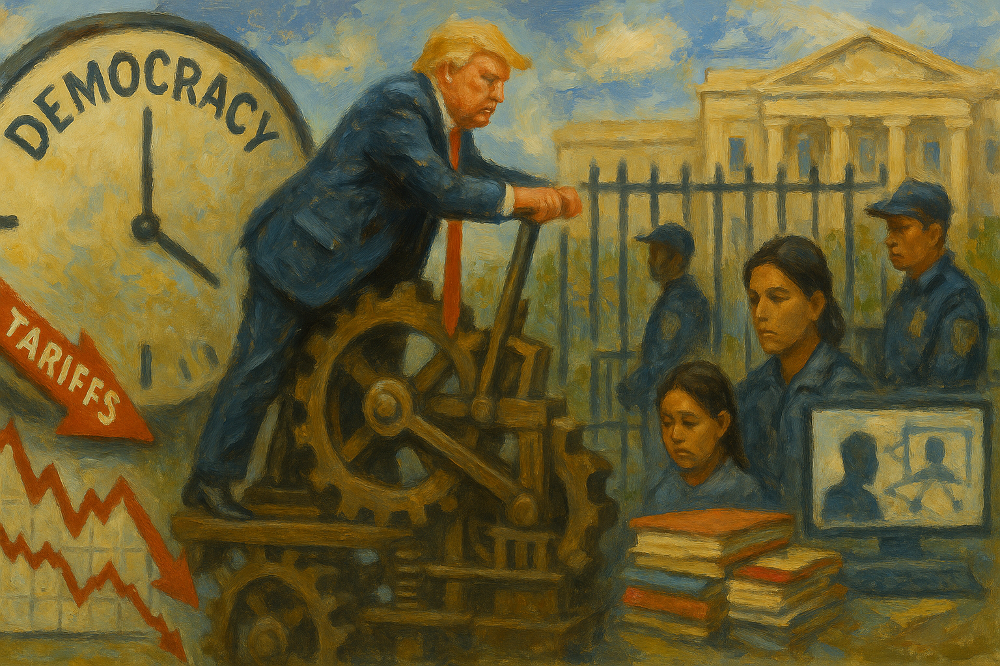

<!-- Generated by build_publish_week_v1 -->
<!-- Header image: image_wide_week12.png -->

# Week 12: Erosion and Resistance Reach Equilibrium

*Tariffs, deportations, and law-firm coercion pushed state power outward while courts, universities, and millions of protesters pushed back just as hard.*

Week 12 opened with the country still counting the cost of a trade war declared by memorandum and reversed by tweet. But the more durable story of this period wasn't the market's vertigo. It was the steady, almost administrative confidence with which state power reached into law firms, universities, courtrooms, and the deportation system. Each was tested to see how much resistance it could still offer. The Democracy Clock, which tracks the distance between formal democracy and its practice, barely moved this week. That stillness is itself part of the record.

At the close of Week 11, the clock read 7:33 p.m. It ends Week 12 at the same time, a net shift of six-hundredths of a minute. The number looks like inaction. It's better read as balance. Pressure against firms, universities, and dissenters kept building. Courts, professional bodies, and ordinary citizens pushed back just as hard. Where earlier weeks showed acceleration, this week showed something more unsettling: erosion and resistance in near equilibrium, each absorbing the other's force.

The week's most visible drama began with tariffs. Acting under emergency authority, the president imposed a universal ten percent tariff and a cascade of country-specific levies, driving duties on Chinese goods as high as 145 percent. Markets absorbed the shock badly. Trillions in value vanished within days, and recession warnings multiplied. Then, just as abruptly, the policy reversed. A ninety-day pause arrived after a false rumor of exactly that pause had already moved markets on its own. Unverified signals from an erratic White House could now substitute for policy itself.

The reversal didn't calm the underlying problem. China raised retaliatory tariffs to 125 percent and moved to court European allies against what it called American bullying. Congressional Republicans introduced bills to reclaim tariff authority, a rare bipartisan impulse toward restraint. Leadership blocked the vote. The House Rules Committee made sure no member would go on record. A conservative legal group sued separately, arguing the emergency framework itself was unconstitutional. Courts had not ruled by week's end. The tariff episode revealed executive economic power exercised with almost no institutional friction, and legislative power declining to supply any.

A second story tested whether court orders carry force at all. Kilmar Abrego Garcia, a man deported in violation of his legal protections, became the week's sharpest constitutional flashpoint. A district judge called the deportation "wholly lawless" and ordered his return. The government slow-walked compliance. The Supreme Court then ruled, unanimously, that the administration must facilitate his return. The order's language left room for delay, and delay is what followed. Nine justices agreeing on a point of law proved necessary but not sufficient to move an executive branch determined not to comply quickly.

Inside the same case, a Justice Department attorney named Erez Reuveni was placed on indefinite leave for telling a federal court the truth: the deportation had been unlawful. He wasn't punished for error. He was punished for candor. The attorney general's public warning that lawyers must "zealously advocate" regardless of the facts sent an unambiguous signal through the department. Honesty before a court had become a liability. It was a small personnel action with a large institutional meaning, sitting uneasily beside the Supreme Court's unanimous rebuke of the deportation itself.

The deportation machinery kept operating at scale beyond any single case. Courts allowed continued use of the 1798 Alien Enemies Act, provided deportees received notice and habeas review. Hundreds of Venezuelans were removed to a Salvadoran prison on the strength of tattoo identification alone. A later accounting found three-quarters of them had no criminal record. Temporary Protected Status holders were detained despite explicit legal protections. A U.S. citizen was held for ten days after agents falsified his own statements in an official transcript. Blanket visa revocations hit an entire nationality, South Sudanese nationals, alongside roughly three hundred students targeted for pro-Palestinian speech. Citizenship, in practice, was becoming a matter of paperwork and discretion rather than settled status.

Judicial independence itself came under direct assault. After adverse rulings, the Justice Department moved to disqualify one judge for bias, and the president publicly called for another's impeachment and disbarment. Chief Justice Roberts issued a rare rebuke of the attack. The American Bar Association went further, formally condemning what it called a "clear and disconcerting pattern" of intimidation against judges and lawyers. The House, meanwhile, passed the No Rogue Rulings Act, aimed at narrowing lower courts' power to issue nationwide injunctions. Rhetorical attacks on the bench were now paired with legislative efforts to shrink its reach.

The legal profession itself became a battleground. Executive orders stripped security clearances and building access from firms that had represented the president's adversaries, Susman Godfrey chief among them. Facing the same threat, other major firms chose to give in rather than fight. Ten firms committed close to a billion dollars in pro bono work aligned with administration priorities. It was an extraordinary transfer of legal capacity, secured not through negotiation but through fear of the next executive order. Not everyone complied quietly. More than eighty former Skadden employees, along with a sitting associate who resigned in protest, condemned the firm's settlement as a betrayal of principle. The profession split visibly between accommodation and resistance, and the split mattered as much as the pressure that caused it.

Universities faced a parallel campaign, waged through funding rather than orders. Cornell lost a billion dollars in federal support, Northwestern seven hundred and ninety million, and Harvard faced a freeze on $2.2 billion. All three disputes traced back to antisemitism policy, diversity programs, and transgender athlete inclusion. Most institutions absorbed the pressure without public defiance. Harvard did not. It rejected federal demands for control over admissions, hiring, and academic programs, choosing to lose the money rather than the institution's independence. That refusal stood out precisely because it was the exception, a marker of what resistance still looked like when an institution had the standing to attempt it.

Dissent within the government's own ranks drew similar punishment. Chris Krebs and Miles Taylor, both former officials who had criticized the administration, were named in a presidential memorandum directing federal investigation. Their past statements were recast as near-treasonous. A Space Force base commander in Greenland was fired for maintaining political neutrality after a vice-presidential visit. These were small personnel actions, individually unremarkable. Together they described a governing culture in which loyalty was becoming the primary qualification for continued service, ahead of competence or candor.

Energy and environmental policy moved through a wave of executive orders that bypassed the ordinary rulemaking process entirely. Coal plants won exemption from mercury emissions standards. A new order imposed automatic one-year sunset provisions on energy regulations across multiple agencies. The burden now fell on regulators to justify keeping rules, rather than on industry to justify weakening them. Another order directed the Justice Department to preempt state climate liability laws in New York, Vermont, and California. NASA terminated the contract supporting the National Climate Assessment, weakening the government's core climate-data infrastructure ahead of its 2027 report. None of this required congressional debate. All of it reduced the state's capacity to measure or regulate the risks it was choosing to ignore.

Labor took its own hit. A unilateral order canceled collective bargaining agreements covering seven hundred thousand federal workers, a rollback the AFL-CIO called a test case for wider private-sector erosion. Civil service politicization continued elsewhere too. DOGE-driven firings and agency restructuring proceeded at pace, with Musk allies embedded across departments and Social Security staff describing their agency's condition as a "death spiral."

Not every thread this week ran toward consolidation. Millions marched peacefully across more than thirteen hundred cities in coordinated "Hands Off" demonstrations, exercising protest rights without significant interference. The D.C. Circuit reinstated agency board members Trump had fired. A federal judge ordered the Associated Press's White House access restored after it was cut over a naming dispute, ruling the retaliation unconstitutional. The Social Security Administration reversed a plan to force vulnerable claimants into weekly in-person visits, after public backlash and investigative reporting made the policy politically untenable. These were not minor victories. They showed that institutional and civic resistance still had traction, even under sustained pressure.

The week's information environment showed a quieter kind of damage. Federal websites briefly stripped, then partially restored, content on Harriet Tubman and Black Revolutionary War soldiers. Mississippi's library commission deleted statewide research databases on race relations and gender studies. Student journalists at Columbia, Stanford, and other campuses pulled bylines and resigned from their own newsrooms, afraid that covering immigration enforcement or campus activism might cost them their visas. None of this was ordered from the top in a single document. It grew instead from a climate where caution had become the safer choice for people with the least power to absorb a mistake.

Taken as a whole, Week 12 offers a portrait of a governing method reaching a kind of maturity. The tools were mostly familiar from earlier weeks: emergency powers, funding threats, personnel retaliation, deregulation by memorandum. What distinguished this period was the scale at which they were deployed simultaneously, and the scale of the pushback they drew in turn. A unanimous Supreme Court ruling, a university's public refusal, a bar association's condemnation, and millions of marchers in the street did not reverse the week's direction. They held a line against it.

The tariff-authority lawsuit filed by the New Civil Liberties Alliance remained unresolved at week's end. So did the question of whether the administration would fully comply with the Supreme Court's order in the Abrego Garcia case. Both will determine, in the weeks ahead, whether this week's resistance was a genuine check or only a delay.

What the record shows, more than any single order or ruling, is a system absorbing pressure from multiple directions at once without yet breaking. Coercion met resistance in courtroom after courtroom, campus after campus, law firm after law firm. Some institutions bent. Others did not. The clock's stillness this week does not mean nothing happened. It means that what happened on one side was matched, almost exactly, by what happened on the other, leaving the underlying contest for power exactly where it stood seven days before.

<!-- Synopses for cross-posting -->
Long Synopsis: Week 12 opened with a self-inflicted trade shock: sweeping tariffs imposed by emergency memo, reversed within days after markets lost trillions. That volatility framed a deeper story. The administration punished a DOJ attorney for telling a court the truth, slow-walked a unanimous Supreme Court order to return a wrongfully deported man, stripped law firms of security clearances for representing adversaries, and froze billions in university funding to compel ideological compliance. Judges faced impeachment calls and disqualification attempts. Yet resistance matched the pressure: Harvard refused federal control, the American Bar Association condemned intimidation, courts reinstated fired officials and restored press access, and millions marched peacefully across thirteen hundred cities. The Democracy Clock moved only six-hundredths of a minute, a stillness reflecting near-equal force pushing in opposite directions rather than an absence of consequence.
Short Synopsis: Tariffs, deportations, and law-firm coercion escalated in tandem with a unanimous Supreme Court rebuke, mass protests, and Harvard's public refusal to capitulate. The week's near-zero clock movement reflects erosion and resistance in rare, uneasy balance rather than genuine calm.

