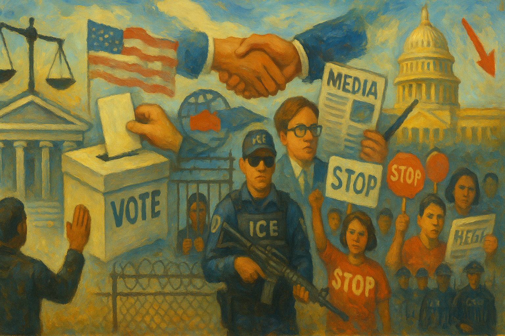

<!-- Generated by build_publish_week_v1 (appendix post) -->
<!-- Header image: image_wide_week13_appendix.png -->

# Week 13 Appendix: Defiance, Contempt, and a Governor's Home in Flames

*A week of extremes nearly canceled out on the clock, but courts, universities, and citizens absorbed the deepest tests yet of constitutional limits.*

This week centered on a direct constitutional confrontation between the executive branch and the judiciary over the Abrego Garcia case, with the administration publicly signaling defiance of a unanimous Supreme Court order while officials made demonstrably false statements about the ruling itself. Simultaneously, Trump escalated threats against Harvard (funding freezes, tax-exempt status threats), against the Federal Reserve chair, and against media companies (CBS license threats, FCC pressure on Comcast), while floating the extraordinary proposal of deporting U.S. citizens to a foreign mega-prison. Courts pushed back forcefully—the Fourth Circuit's rebuke, contempt findings by Judge Boasberg, and multiple injunctions—demonstrating continued judicial resistance, though compliance from the executive remained doubtful. Economic volatility from tariff policy, a firebombing attack on a governor's residence, and expanding state-level voter suppression efforts rounded out a week revealing accelerating strain on multiple democratic guardrails simultaneously.

Power and Authority

1. Trump authorized military control of federal border land, giving the Department of Defense authority over detention pending transfer to immigration agents (2025-04-12): Placing border land under military jurisdiction blurs the line between military and civilian law enforcement and expands executive power over immigration without congressional approval.

2. Trump administration claimed the president's foreign affairs power shields it from court orders requiring the return of a wrongly deported man (2025-04-13): Invoking foreign affairs deference to escape judicial oversight tests whether courts can enforce constitutional limits on the executive.

3. Trump used Michigan Governor Whitmer as an unwitting prop during an announcement of politically motivated DOJ investigations (2025-04-13): Using a state governor as a backdrop for announcing investigations into political opponents signals politicization of federal law enforcement power.

4. Trump and Bukele met at the White House and publicly signaled they would not comply with the Supreme Court's order to return Kilmar Abrego Garcia (2025-04-14): A president publicly announcing intent to ignore a unanimous Supreme Court ruling represents a direct challenge to judicial authority and separation of powers.

5. Trump proposed deporting U.S. citizens convicted of crimes to prisons in El Salvador (2025-04-14): Floating deportation of citizens without legal authority threatens constitutional citizenship protections and due process.

6. Trump told El Salvador's president he wants to build more prisons to hold American citizens sent from the United States (2025-04-14): A sitting president discussing outsourcing incarceration of citizens to a foreign strongman's prisons represents an extraordinary threat to constitutional protections.

7. Erik Prince pitched a plan to expand renditions to El Salvador to 100,000 prisoners, proposing to make part of CECOT American territory to evade legal challenges (2025-04-14) *[single source]*: A private contractor's plan to create an offshore prison zone designed to escape constitutional review shows how executive power could be laundered through private actors.

8. Stephen Miller announced the administration will continue sending people, including citizens, to El Salvador prisons (2025-04-14): A senior White House official's public commitment to continued outsourced detention signals institutional intent to normalize extralegal deportation.

9. Trump administration filed a court declaration containing Stephen Miller's false statements misrepresenting the Supreme Court's ruling (2025-04-14): Submitting false claims about a Supreme Court decision to a federal court undermines judicial integrity and the rule of law.

10. Attorney General Bondi refused to commit to returning a mistakenly deported U.S. citizen, saying it was up to El Salvador (2025-04-14): The nation's top law enforcement official shifting responsibility to a foreign government for compliance with a Supreme Court order signals executive defiance of judicial authority.

11. Karoline Leavitt said deporting U.S. citizens is a legal question the president is looking into (2025-04-15): A White House spokesperson treating the deportation of citizens as an open legal question normalizes a serious threat to constitutional citizenship rights.

12. Trump reiterated he would love to send U.S. citizens to El Salvador's mega-prison (2025-04-15): Repeated presidential statements about deporting citizens abroad without due process normalize a direct threat to constitutional protections.

13. Trump administration reversed prior statements of compliance and declared it does not have power to return a wrongly deported resident despite the Supreme Court order (2025-04-15): Publicly retracting a commitment to comply with a Supreme Court ruling escalates the confrontation between the executive and the judiciary.

14. Trump signaled intent to circumvent constitutional due process by discussing sending people to foreign camps while defying a Supreme Court order (2025-04-15): Coordinating with a foreign leader on extralegal detention while ignoring the nation's highest court represents a serious escalation against constitutional government.

15. Trump publicly pressured Federal Reserve Chair Jerome Powell to cut interest rates and called for his termination (2025-04-17): Presidential attacks on an independent central bank chair threaten the separation of monetary policy from political control.

16. Trump instructed advisors to study whether he can legally fire Federal Reserve Chair Powell over interest rate policy (2025-04-18): Exploring the legal authority to remove the central bank chair for policy disagreement threatens an institution designed to be independent of political pressure.

17. Trump issued an executive order requiring documentary proof of citizenship to vote (2025-04-18): A presidential order restricting voting eligibility, based on unsubstantiated fraud claims, threatens access to the ballot for eligible citizens.

Institutions and Governance

1. Judge Paula Xinis scheduled and held hearings pressing the administration on compliance with the order to facilitate Kilmar Abrego Garcia's return (2025-04-14): Continued judicial scheduling and questioning demonstrates the court system's effort to enforce its rulings against apparent executive stonewalling.

2. Harvard University rejected the Trump administration's demands to control university governance in exchange for continued federal funding (2025-04-14): A major university's refusal to cede governance control to the federal government defends institutional independence against executive coercion.

3. Senator Chris Van Hollen requested a meeting with El Salvador's president and later traveled there to check on a detained constituent (2025-04-14): A senator's direct intervention to check on a constituent held abroad exercises congressional oversight of executive foreign-affairs conduct.

4. Former Jan. 6 prosecutors called for an investigation into interim U.S. Attorney Ed Martin over politically targeted probes and conflicts of interest (2025-04-14): Prosecutors calling out potential selective prosecution addresses concerns about weaponized law enforcement against political opponents.

5. Rep. Gerald Connolly requested inspector general investigations into DOGE's exfiltration of data and possible cover-ups, and demanded SSA reverse a policy freeze (2025-04-15): Congressional oversight requests targeting DOGE's data practices seek accountability for potential privacy and legal violations in federal data systems.

6. Judge Paula Xinis rebuked the Trump administration for doing nothing to secure a wrongly deported man's release and ordered fact-finding on compliance (2025-04-15): A federal judge's sharp rebuke and formal fact-finding order push back against apparent executive noncompliance with a Supreme Court mandate.

7. Judge Indira Talwani issued a temporary injunction blocking termination of legal status for roughly 500,000 migrants (2025-04-15) *[single source]*: Judicial intervention halted an abrupt executive attempt to revoke legal status granted to hundreds of thousands of migrants without due process.

8. American Association of University Professors filed a lawsuit challenging the administration's freeze of federal funds to Harvard for lack of due process (2025-04-15): Litigation against the funding freeze tests whether the executive can bypass statutory procedures to punish an institution for noncompliance.

9. Solidarity Center and other labor groups filed a lawsuit to stop the Labor Department's termination of congressionally authorized child-labor programs abroad (2025-04-15) *[single source]*: The lawsuit asserts that only Congress, not the executive, can cancel appropriated program funds, testing separation of powers over the budget.

10. NAACP sued the Trump administration over anti-DEI policies in schools, alleging Civil Rights Act violations (2025-04-15): The lawsuit challenges executive elimination of diversity programs as a violation of federal civil rights law.

11. Protect Democracy Project sued the Office of Management and Budget over removal of a public database showing federal spending disbursements (2025-04-15) *[single source]*: The lawsuit challenges elimination of a transparency tool required by law to track how appropriated funds are spent.

12. DOGE accessed National Labor Relations Board secure data with behavior resembling criminal hacking, including a login attempt from a Russian IP address (2025-04-15): Unauthorized access and deletion of audit trails at a federal agency raises serious cybersecurity and misuse-of-power concerns.

13. Judge James Boasberg found probable cause to hold Trump administration officials in criminal contempt for defying an order blocking deportations under the Alien Enemies Act (2025-04-16): A federal judge's contempt finding against executive officials represents a serious judicial escalation in response to apparent willful defiance of court orders.

14. IRS planned to revoke Harvard University's tax-exempt status after Trump publicly demanded it (2025-04-16) *[single source]*: Using tax authority to retaliate against an institution for defying a presidential demand, in apparent violation of laws barring presidential direction of IRS actions, threatens institutional independence.

15. House Republican delegation led by Jason Smith toured the CECOT prison in El Salvador and posed for photographs with caged detainees (2025-04-15): A staged congressional photo-op at a foreign prison holding people removed without full due process uses imprisoned individuals for domestic political messaging.

16. U.S. Court of Appeals for the Fourth Circuit unanimously rejected the administration's appeal, warning that the government cannot detain residents in foreign prisons without due process (2025-04-17): A conservative-majority appellate panel's forceful rebuke reinforces judicial limits on executive detention power and defends constitutional due process.

17. Center for Biological Diversity sued the Trump administration over its executive order rolling back environmental regulations for fuel producers (2025-04-17): The lawsuit challenges systematic dismantling of environmental protections and seeks disclosure of agency plans developed under the order.

18. California filed a federal lawsuit challenging Trump's tariff authority as exceeding constitutional and statutory limits (2025-04-16): A state's lawsuit asserts that only Congress, not the president, has the constitutional power to impose tariffs, directly testing separation of powers.

19. Twelve students represented by the ACLU sued Defense Secretary Hegseth over book bans targeting race and gender topics in Pentagon schools (2025-04-16): The lawsuit challenges censorship of educational content in schools serving 67,000 military-connected children as a First Amendment violation.

20. Department of Justice sued Maine's Department of Education over its policy allowing transgender athletes in girls' sports, after threatening to cut education funding (2025-04-16): Federal litigation combined with funding threats against a state over a contested policy tests the limits of executive coercion over states.

21. Judge Amy Berman Jackson blocked the Trump administration's mass termination of about 1,500 Consumer Financial Protection Bureau employees (2025-04-18) *[single source]*: Judicial intervention halted an attempt to gut a major consumer protection agency's workforce, testing executive authority over independent agencies.

22. Harmeet Dhillon issued new mission statements redirecting the DOJ Civil Rights Division away from protecting marginalized groups toward targeting them (2025-04-18): Redirecting a division created to protect voting, housing, and education rights toward opposite priorities undermines the department's core civil rights mission.

23. FBI arrested Wisconsin Judge Hannah Dugan on obstruction allegations related to her conduct during immigration enforcement in her courtroom (2025-04-18): The arrest of a sitting judge by federal law enforcement over courtroom conduct raises fundamental concerns about judicial independence and executive-judicial confrontation.

24. Trump administration issued a rule creating a new at-will 'Schedule Policy/Career' employee category stripping civil service protections from roughly 50,000 federal workers (2025-04-18): Removing statutory protections from a large segment of the federal workforce concentrates executive power to remove career employees without procedural safeguards.

25. Federal judge Brian Murphy barred the administration from rapidly deporting migrants to third countries without due process hearings (2025-04-18): The ruling blocks a policy designed to bypass asylum and due process protections for vulnerable migrants facing removal to unfamiliar countries.

26. Trump removed Gary Shapley as acting IRS commissioner days after his appointment following a complaint from Treasury Secretary Bessent (2025-04-18): Rapid removal of a tax agency head reflects internal power struggles and instability in an agency meant to operate independently of political control.

27. Secretary of Defense Pete Hegseth fired three senior Pentagon staffers amid a leak investigation later linked to disputed claims of illegal surveillance (2025-04-18): Firing officials based on an investigation allegedly relying on unconstitutional surveillance raises rule-of-law concerns about internal Pentagon discipline.

28. Secretary of State Marco Rubio fired USAID official Peter Marocco, who had been unilaterally dismantling the agency (2025-04-18) *[single source]*: The firing reflects internal administration conflict over the pace and legality of dismantling a federal foreign aid agency.

29. North Carolina Board of Elections ordered restoration of ballots wrongly invalidated based on flawed residency data after investigative reporting (2025-04-16) *[single source]*: Correcting a flawed ballot-invalidation process restores votes to eligible citizens and protects the legitimacy of a contested statewide election.

30. Jefferson Griffin challenged election results using flawed voter residency data targeting Democratic counties after losing a state supreme court race (2025-04-15): A losing candidate's attempt to invalidate votes using inaccurate data threatens the certified outcome of a state judicial election.

31. North Carolina Supreme Court invalidated roughly 260 ballots based on residency claims later shown to be inaccurate and imposed a retroactive ID requirement on military ballots (2025-04-15) *[single source]*: Discarding ballots without prior notice or opportunity to prove eligibility, including from military voters, undermines confidence in election administration.

32. U.S. House of Representatives approved the SAVE Act requiring proof of citizenship to register to vote and limiting mail and online registration (2025-04-18) *[single source]*: Federal legislation imposing new documentary barriers to voter registration risks disenfranchising eligible citizens based on unsubstantiated fraud claims.

33. Barbara Lee was elected Oakland mayor via ranked-choice voting (2025-04-15): A closely contested mayoral election resolved through ranked-choice voting determines local leadership on public safety and fiscal crises.

34. Federal Reserve Chair Jerome Powell publicly rejected pressure to cut interest rates, asserting the Fed's legal independence from political influence (2025-04-17): A central bank chair's public assertion of independence in the face of presidential pressure defends institutional insulation from political control.

Economic Structure

1. Trump paused most tariffs for 90 days while maintaining a 145 percent tariff on Chinese imports amid a near-collapse of the government debt market (2025-04-12): Abrupt tariff reversal following market turmoil demonstrates instability in economic governance with direct consequences for consumers and global trade.

2. international investors sold large volumes of U.S. Treasury bonds and other assets, triggering unusual capital flight from American markets (2025-04-12) *[single source]*: Foreign capital flight from U.S. assets signals eroding investor confidence in economic governance, a pattern historically associated with unstable economies.

3. Trump signed an executive order ending the duty-free exemption for low-value imports from China and Hong Kong (2025-04-13): Eliminating a tariff exemption unilaterally reshapes trade policy affecting consumer prices and retail competition.

4. Commerce Secretary Howard Lutnick announced that electronics tariff exemptions were temporary and would be reimposed within a month (2025-04-13): Contradictory tariff announcements create market uncertainty and demonstrate incoherent coordination in major economic policy.

5. HHS cut billions of dollars in funding to state health agencies, including funds for childhood immunization programs (2025-04-13): Slashing funding for state immunization infrastructure undermines public health protection for children during a measles outbreak.

6. Trump administration froze $2.2 billion in federal grants and a $60 million contract to Harvard University hours after it rejected federal demands (2025-04-14): Swift retaliatory funding cuts demonstrate use of federal financial power to coerce compliance with demands that exceed lawful executive authority.

7. Boris Epshteyn reportedly pressured law firms targeted by executive orders to make concessions or payments (2025-04-14) *[single source]*: A president's personal attorney using executive orders as leverage over targeted law firms raises concerns about extortion and abuse of power for personal gain.

8. Education Department froze $2.3 billion in federal funds to Harvard after the university rejected demands to restrict speech and diversity programs (2025-04-15): Withholding education funding to compel policy changes at a private university tests constitutional limits on the government's use of financial leverage.

9. Commerce Department imposed a 21 percent tariff on Mexican tomatoes, affecting a staple food for American consumers (2025-04-15) *[single source]*: A tariff on a widely consumed food item increases costs directly for American households.

10. Trump announced plans for government payments to farmers hurt by retaliatory tariffs (2025-04-15): Using federal funds to offset self-inflicted tariff damage shows the fiscal cost of an unstable trade policy.

11. Trump Media and Technology Group launched investment accounts explicitly designed to profit from Trump's own tariff and trade policies (2025-04-15): A company majority-owned by the sitting president creating investment products tied to his own policy decisions represents a direct conflict of interest.

12. DoorDash donated $125,000 to the Republican Attorneys General Association, which litigates to restrict abortion access (2025-04-16) *[single source]*: Corporate funding of an organization actively working to restrict reproductive rights contradicts the company's public commitments to support affected employees.

13. Stock market declined sharply as manufacturing orders plunged to their lowest level since April 2020 (2025-04-16): A sharp economic downturn linked to tariff policy indicates real damage to the manufacturing sector the administration claimed to be protecting.

14. Trump signed executive orders reforming federal procurement to prioritize commercial off-the-shelf solutions over custom government contracts (2025-04-15): Restructuring how the government spends nearly a trillion dollars annually affects transparency, competition, and accountability in federal contracting.

15. Trump signed an executive order directing changes to Medicare drug price negotiation programs and accelerated generic drug approvals (2025-04-15): Reworking Medicare drug pricing policy through executive order affects healthcare costs for seniors and potentially alters congressionally enacted law.

16. Trump signed a proclamation opening the Pacific Remote Islands Marine National Monument to commercial fishing (2025-04-17): Reversing a 16-year conservation designation opens a protected marine ecosystem to commercial extraction, reducing environmental protections.

17. Trump signed an executive order directing deregulation of commercial fishing and review of marine monuments for commercial fishing access (2025-04-17): Directing agencies to reduce environmental regulations for a major industry weakens oversight of ocean resource conservation.

18. China diverted purchases of oil, soybeans, aircraft, and beef away from U.S. suppliers to other countries in response to tariffs (2025-04-17): Systematic Chinese trade diversion demonstrates the economic cost of tariff escalation and reveals asymmetric vulnerability in U.S. export markets.

19. Secretary of State Marco Rubio announced cancellation of 139 State Department grants worth $214 million (2025-04-15): Cutting international grant funding reduces the State Department's capacity to support diplomatic and development programs abroad.

20. White House extended a freeze on federal civilian hiring through July 15, 2025 (2025-04-17): Extending the hiring freeze constrains the executive branch's staffing capacity, affecting government service delivery and workforce independence.

Civil Rights and Dissent

1. ACLU filed a third lawsuit to block the Trump administration from deporting Venezuelans under the Alien Enemies Act (2025-04-12) *[single source]*: Continued litigation against use of an 18th-century wartime statute for peacetime deportation challenges bypassing of immigration due process.

2. Cody Balmer firebombed Pennsylvania Governor Josh Shapiro's residence while the governor's family was inside (2025-04-13): A violent attack on a sitting governor's home represents a direct threat to elected officials' safety and raises concerns about political violence.

3. Bernie Sanders and AOC held large rallies in Los Angeles and Idaho drawing tens of thousands of attendees opposing the administration (2025-04-13) *[single source]*: Mass rallies in both liberal and conservative states demonstrate sustained grassroots mobilization against administration policies.

4. DOGE staff physically dragged a Social Security Administration executive from his office after he objected to a policy affecting immigrants (2025-04-13) *[single source]*: Physical removal of a federal employee for objecting to policy demonstrates coercion and intimidation of civil servants who raise concerns internally.

5. ICE detained Mohsen Mahdawi, a Palestinian green-card holder and Columbia student, during a naturalization interview after his pro-Palestinian activism (2025-04-14): Detaining a lawful resident during a citizenship interview for protected political speech raises serious First Amendment and due process concerns.

6. Federal judge in Vermont temporarily blocked Mohsen Mahdawi's deportation while his case proceeded (2025-04-14): Judicial intervention protected an individual detained for protest activity from removal while constitutional claims were litigated.

7. Cardinal Robert Prevost reposted a bishop's public criticism of Trump and Bukele for mocking the deportation of a U.S. resident (2025-04-14) *[single source]*: A senior Catholic leader amplifying criticism of deportation practices represents institutional religious opposition to the administration's immigration policy.

8. Sean McGarvey publicly demanded the return of a union apprentice rendered to a foreign prison (2025-04-14) *[single source]*: Organized labor's public call for a member's release from foreign detention demonstrates civil society mobilization against government overreach.

9. Trump dismissed the firebombing attack on Governor Shapiro's residence as unimportant, calling the attacker a 'whack job' (2025-04-14) *[single source]*: Minimizing an attack on a state governor fails to condemn political violence and may normalize threats against elected officials.

10. US Naval Academy removed roughly 400 books covering slavery, civil rights, and the Holocaust while keeping Mein Kampf and racist pseudoscience (2025-04-13) *[single source]*: Selectively removing books on discrimination and genocide while retaining Nazi propaganda represents censorship of historical education.

11. ICE detained a U.S.-born citizen for 48 hours despite an authenticated birth certificate, based on a federal detainer request (2025-04-17) *[single source]*: Continued detention of a documented citizen after a judge confirmed his citizenship demonstrates potential abuse of immigration enforcement authority.

12. Department of Homeland Security revoked a BYU PhD student's visa without notice based on dismissed minor citations, allegedly using automated screening (2025-04-17) *[single source]*: Automated visa revocation without human review based on trivial or dismissed offenses represents arbitrary enforcement affecting legal residents.

13. Immigration judge denied bond to Turkish PhD student Rümeysa Öztürk, detained over a campus op-ed about Gaza (2025-04-16): Denying release to a student detained for protected speech about a political issue signals retaliation against dissent through immigration enforcement.

14. Trump administration deported roughly 90 percent of recent deportees despite no criminal record, including a student deported for an op-ed critical of a university's Gaza stance (2025-04-15) *[single source]*: Mass deportation of people without criminal charges, including for protected speech, represents arbitrary enforcement and abandonment of due process.

15. Acworth Police Department used a stun gun on protesters and arrested three attendees at Rep. Marjorie Taylor Greene's town hall (2025-04-16) *[single source]*: Use of force against protesters exercising free speech at a public official's town hall raises concerns about suppression of dissent.

16. Trump stated he wants to deport 'homegrown criminals' including those who commit violent acts, using it as justification to expand deportation authority (2025-04-14): Expanding deportation rhetoric to include native-born people signals a threat to birthright citizenship and constitutional protections.

17. Alabama, Arkansas, Louisiana, New Hampshire, Pennsylvania, South Dakota, and California legislatures or officials advanced coordinated bills restricting voting access, ballot initiatives, and disenfranchising voters with criminal records (2025-04-18) *[single source]*: Coordinated multi-state restrictions on voting and direct democracy mechanisms disproportionately burden eligible voters and concentrate political power.

18. Phoenix Ikner committed a mass shooting at Florida State University, killing at least two people (2025-04-17) *[single source]*: A campus mass shooting raises ongoing public safety concerns and highlights gun violence affecting educational institutions.

19. Trump declined to propose any policy response to a mass shooting, saying guns do not do the shooting (2025-04-17): The president's deflection from a mass shooting avoids addressing recurring gun violence affecting public safety.

Information, Memory and Manipulation

1. CDC shelved a flu shot advertising campaign amid broader efforts to reduce vaccination support (2025-04-13) *[single source]*: Suppressing public health advertising reduces citizen access to disease prevention information during a measles outbreak.

2. NIH and CDC halted funding for vaccine hesitancy research and pandemic prevention programs (2025-04-13) *[single source]*: Cutting research into vaccine hesitancy undermines the government's evidence base for responding to disease outbreaks and future pandemics.

3. White House published a release attacking NPR and PBS as spreading 'radical, woke propaganda' (2025-04-14): Government use of an official platform to delegitimize public broadcasters signals intent to defund and discredit independent media.

4. Trump called for CBS to lose its broadcasting license over 60 Minutes segments he disliked (2025-04-13): A presidential demand to revoke a broadcaster's license for critical coverage represents a direct attack on press freedom.

5. Trump White House blocked Associated Press journalists from the Oval Office despite a court order requiring their access (2025-04-14): Defying a court order restoring press access constitutes contempt of court and continued suppression of independent journalism.

6. Stephen Miller falsely claimed returning a wrongly deported man would constitute 'kidnapping' despite the administration's own court admissions (2025-04-14): A senior official's statement contradicting the administration's own legal filings spreads disinformation to justify noncompliance with court orders.

7. Ed Martin sent a letter to a medical journal questioning its partisanship and handling of 'misinformation' (2025-04-14): A federal prosecutor questioning a medical journal's editorial independence suggests government pressure on scientific publishing.

8. White House (Stephen Miller) encouraged Republican lawmakers to falsely portray a detained constituent as a dangerous criminal without evidence (2025-04-16): Coordinating a false propaganda narrative about a detainee to shape public opinion misleads the public on immigration policy.

9. Trump administration closed the State Department's office that monitored foreign disinformation campaigns (2025-04-16): Eliminating the government's primary capacity to counter foreign disinformation weakens national resilience against adversarial information warfare.

10. Trump made false public claims that tariffs were generating $2 billion per day when actual figures were roughly $250 million (2025-04-16): Overstating tariff revenue by roughly eightfold undermines factual public understanding of major economic policy outcomes.

11. FCC Chair Brendan Carr threatened regulatory action against Comcast over MSNBC and CNN coverage of a deportation case (2025-04-17): A federal regulator threatening a media company over editorial content represents government pressure to shape news coverage.

12. Trump administration replaced the Covid.gov public health website with content promoting the 'lab leak' theory and criticizing officials (2025-04-18): Converting a neutral public health information resource into partisan messaging undermines citizen access to factual health information.

13. White House published a self-promotional 'Week 13 Wins' release aggregating claimed achievements without independent verification (2025-04-18): Using an official government channel to promote unverified claims of success shapes public perception through curated narrative rather than independent scrutiny.

14. FBI Director Kash Patel posted a photograph of an arrested sitting judge in handcuffs on social media with a political caption (2025-04-18) *[single source]*: A senior law enforcement official publicizing a judge's arrest photo signals use of social media to shape political narrative around judicial confrontation.

15. Lamar consolidated independent school district removed educational content about Virginia from an elementary research database over a historical state seal depiction (2025-04-18) *[single source]*: Removing factual educational content about a U.S. state narrows the information available to young students in public schools.

16. DOGE removed federal identification numbers from its website's source code, obstructing verification of its claimed cost savings (2025-04-15): Deliberately obscuring identifying data prevents independent fact-checkers from verifying government claims about spending cuts.

17. FDA canceled an open advisory meeting on flu vaccines and later held it behind closed doors (2025-04-13): Closing a public vaccine advisory meeting removes scientific and public input from health policy decisions.

