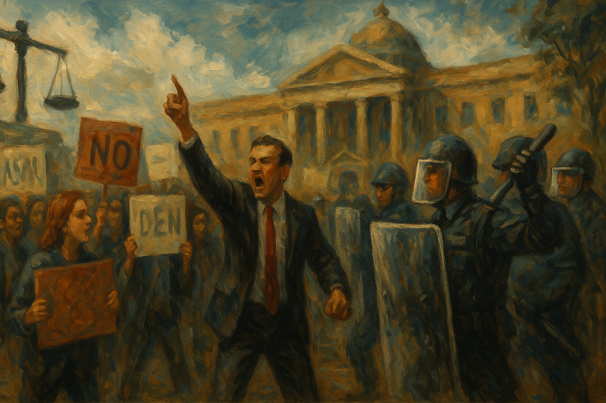

<!-- Generated by build_publish_week_v1 (appendix post) -->
<!-- Header image: image_wide_week14_appendix.png -->

# Week 14 Appendix: Universities and Borders as Levers

*A near-still Democracy Clock masks a week in which the White House tightened control over courts, campuses, and civil rights while testing the limits of law.*

This was a structurally heavy week of democratic backsliding, centered on aggressive executive overreach, weaponization of law, and systematic attacks on pluralistic institutions. The administration escalated its campaign against universities through massive funding freezes, coercive conditions on academic governance, and new accreditation and DEI–rollback orders, pushing Trait 44 (universities pressured to suppress dissent) into crisis territory. Immigration enforcement and detention policy hardened further: closure of key oversight offices, wrongful detentions of citizens, politicized targeting of student activists, and contempt findings over deportations collectively deepened Traits 4, 9, 47, and 1. Civil-rights enforcement was structurally rewritten via the disparate-impact order and disability/Medicaid cuts, entrenching stratified citizenship and inequality. Inside the state, Interior and State Department restructurings, DOGE’s opaque data practices, and Musk/Hegseth’s behavior signaled accelerating capture and politicization of the civil service and security apparatus. Yet courts and civil society mounted notable resistance: multiple federal rulings blocked sanctuary-city defunding, voter-document mandates, and deportations; Harvard and state AGs sued; and nationwide protests and university presidents’ statements showed organized pushback. Overall, the week’s net pressure strongly favored authoritarian consolidation despite pockets of institutional resilience.

Power and Authority

1. The Trump administration cut and froze over $2 billion in federal grants and contracts to Harvard University and threatened its tax-exempt status (2025-04-20): By conditioning core research and institutional funding on ideological concessions and governance changes, the administration used fiscal power to coerce a private university, pressuring academic freedom and institutional autonomy.

2. The Trump administration expanded coal mining for data center energy while cutting miner health and safety agencies and delaying a silica dust rule (2025-04-19): Executive promotion of coal extraction alongside weakened safety enforcement shifted risks onto workers and communities, prioritizing industrial output over regulatory protections and long-term public health.

3. The Trump administration pursued a campaign to restructure the Justice Department and FBI by removing career prosecutors and watchdogs (2025-04-19): Targeting independent law enforcement and oversight personnel for removal weakened institutional checks on executive power and increased vulnerability to politicized justice.

4. President Trump considered firing Federal Reserve Chair Jerome Powell over interest rate policy (2025-04-19): Threatening to remove the central bank chair for policy disagreements challenged Federal Reserve independence, risking politicization of monetary policy and economic management.

5. President Trump indicated he would ignore the Supreme Court’s order to facilitate Kilmar Ábrego García’s return from El Salvador (2025-04-21): Openly rejecting a Supreme Court mandate on a wrongful deportation case signaled disregard for judicial authority and separation of powers in immigration enforcement.

6. U.S. Transportation Secretary Sean Duffy threatened New York with loss of federal transportation funding unless it halted Manhattan congestion pricing (2025-04-21): Using federal funding leverage to coerce a state’s transportation policy tested federalism norms and enabled selective punishment of disfavored jurisdictions.

7. Secretary of Defense Pete Hegseth and DHS Secretary Kristi Noem prepared a report to President Trump on whether to invoke the Insurrection Act at the southern border and reportedly declined to recommend it (2025-04-21): Considering but stepping back from using military force for domestic border enforcement highlighted the availability of extraordinary powers and the importance of internal restraint.

8. Secretary of the Interior Doug Burgum signed an order consolidating control of Interior’s personnel and budget under a politically connected assistant secretary (2025-04-18): Centralizing Interior’s administrative authority in a political operative with energy ties reduced internal checks over public lands and resource policy and raised appointments-clause concerns.

9. The White House celebrated Earth Day by promoting expanded extraction of oil, gas, and minerals from federal lands and waters (2025-04-22): Framing aggressive extraction on public lands as stewardship signaled executive prioritization of resource exploitation over environmental safeguards and long-term public interests.

10. President Trump issued a memorandum directing the attorney general to investigate alleged foreign and straw donations through ActBlue (2025-04-24): Ordering a high-profile probe of a major opposition fundraising platform risked weaponizing federal law enforcement against political rivals under disputed factual claims.

11. President Trump issued an executive order eliminating disparate-impact liability from federal civil rights enforcement (2025-04-23): Rolling back disparate-impact standards weakened tools to challenge systemic discrimination, narrowing civil rights protections for minorities and women across sectors.

12. President Trump issued an executive order strengthening probationary periods and easing removal of federal employees (2025-04-24): Making it easier to dismiss probationary civil servants increased executive leverage over the bureaucracy and risked politicizing hiring and retention decisions.

13. President Trump issued an executive order to unleash offshore critical minerals and resources by expediting seabed permitting (2025-04-24): Fast-tracking offshore mineral extraction under national security framing expanded executive discretion over environmental and industrial policy with limited public process.

14. President Trump issued an executive order to advance AI education for American youth (2025-04-23): Creating a White House AI education task force centralized agenda-setting over emerging technology curricula, shaping future workforce skills and public understanding of AI.

15. President Trump issued an executive order to align federal workforce programs with reindustrialization and skilled trades (2025-04-23): Directing agencies to reorient workforce programs toward targeted industrial goals concentrated federal influence over training priorities and labor-market interventions.

16. President Trump issued an executive order reforming higher education accreditation and targeting DEI-based standards (2025-04-23): Recasting accreditation oversight to police diversity and equity criteria allowed the executive to pressure universities’ internal policies through control of eligibility for federal aid.

17. President Trump issued an executive order on school discipline to roll back equity-focused policies (2025-04-23): Reframing discipline guidance against “equity ideology” risked weakening protections against discriminatory discipline practices, especially for students of color.

18. President Trump issued an executive order increasing enforcement of foreign funding disclosure at universities (2025-04-23): Mandating stricter disclosure of foreign gifts and contracts expanded federal leverage over universities’ international ties under a national security rationale.

19. President Trump issued an executive order establishing a White House initiative on HBCUs and a presidential advisory board (2025-04-23): Centralizing HBCU policy in a White House initiative created new channels for support but also for political influence over historically Black institutions’ priorities.

20. Secretary of Veterans Affairs Doug Collins ordered staff to report perceived anti-Christian bias through a new taskforce mechanism (2025-04-22): Directing federal employees to flag “anti-Christian bias” institutionalized preferential attention to one faith identity, risking uneven treatment of religious expression and workplace rights.

21. Secretary of Health and Human Services Robert F. Kennedy Jr. proposed large cuts to disability-related education, research, and support services (2025-04-24): Planned reductions in disability services would shrink federal support for a vulnerable population, deepening inequality in access to care and inclusion.

22. Secretary of Health and Human Services Robert F. Kennedy Jr. halted key autism research tied to DEIA programs (2025-04-24): Stopping autism projects associated with diversity and accessibility initiatives curtailed scientific inquiry into disability and equity, narrowing evidence for inclusive policy.

23. The Trump administration terminated a civil rights settlement requiring Alabama to address sewage pollution in majority-Black Lowndes County (2025-04-24): Canceling an environmental justice agreement left Black residents without promised sanitation remedies, weakening civil-rights enforcement against discriminatory infrastructure neglect.

24. The Trump administration announced plans to fast-track fossil fuel and mining permits under an asserted energy emergency (2025-04-24): Drastically shortening permit timelines under an emergency declaration sidelined environmental review and public input, normalizing emergency powers for routine resource policy.

25. The Trump administration closed two federal oversight offices for healthcare and conditions in immigration detention (2025-04-25): Eliminating CRCL and the detention ombudsman removed key internal checks on ICE facilities, reducing accountability for abuses against detainees, especially disabled people.

26. Elon Musk and the Department of Government Efficiency asserted aggressive control over federal employees through weekly reporting demands and public clashes with Cabinet officials (2025-04-25): Allowing a politically connected billionaire to direct civil servants outside normal chains of command blurred lines between public authority and private influence over the state.

27. The Trump administration reversed a policy that had revoked student visas over minor legal infractions after extensive litigation (2025-04-24): Rolling back a harsh visa revocation rule under court pressure partially restored protections for international students, illustrating how legal challenges can constrain executive overreach.

28. The Trump administration ended pandemic-related school relief funding to help offset costs of extending 2017 tax cuts (2025-04-22): Abruptly cutting nearly $3 billion in school relief to finance tax policy favored capital shifted fiscal burdens onto public education and low-income communities.

29. The Trump administration canceled access to COVID relief funds for schools, prompting a multistate lawsuit (2025-04-22): Withdrawing previously available federal education funds without clear legal basis triggered state litigation and highlighted executive control over critical social spending.

30. Secretary of State Marco Rubio announced a sweeping reorganization of the State Department cutting staff and democracy-related offices (2025-04-22): Planned reductions in bureaus focused on democracy, human rights, and global issues signaled a shift away from traditional diplomatic missions toward a leaner, more centralized foreign policy apparatus.

31. Secretary of State Marco Rubio withdrew from scheduled London peace talks after presenting a Ukraine peace plan as a final offer (2025-04-24): Treating a controversial Ukraine settlement as non-negotiable and exiting talks reduced diplomatic flexibility and aligned U.S. posture more closely with Russian territorial claims.

32. President Trump publicly pressured Ukraine’s president to accept a peace plan recognizing Russian claims over occupied territories (2025-04-24): Urging acceptance of a settlement favoring Russian annexations undermined support for Ukraine’s sovereignty and signaled tolerance for authoritarian aggression abroad.

33. President Trump requested that the Supreme Court reinstate a ban on transgender individuals serving in the military (2025-04-24): Seeking to revive a categorical ban on trans service members used military policy to restrict rights based on gender identity, challenging equal protection norms.

34. President Trump misrepresented the status of tariff negotiations with China despite denials from Chinese officials (2025-04-25): Claiming nonexistent trade talks with China from the presidential podium blurred the line between official diplomacy and political narrative, complicating public understanding of foreign policy.

Institutions and Governance

1. The U.S. Supreme Court temporarily halted deportations of Venezuelan detainees under the Alien Enemies Act (2025-04-20): Emergency orders blocking removals from Texas detention centers reinforced judicial oversight of executive immigration actions and protected detainees’ access to legal process.

2. The U.S. Supreme Court unanimously upheld a lower court order requiring the government to facilitate Kilmar Ábrego García’s return (2025-04-10): Affirming a mandate to remedy a wrongful deportation underscored the Court’s role in enforcing due process against executive resistance.

3. U.S. District Judge Paula Xinis ordered the Trump administration to facilitate García’s return and provide daily compliance updates (2025-04-23): Requiring detailed reporting on efforts to undo a wrongful deportation strengthened judicial tools for monitoring executive compliance with rights-protective orders.

4. U.S. District Judge James Boasberg found probable cause to hold the Trump administration in contempt for defying deportation orders (2025-04-23): A contempt finding against the executive branch for ignoring court directives highlighted escalating institutional conflict over adherence to the rule of law.

5. The U.S. Supreme Court heard arguments on the constitutionality of the Preventive Services Taskforce under the ACA (2025-04-21): Reviewing the structure of a body that mandates no-cost preventive care put judicial doctrine at the center of access to key health services.

6. U.S. District Judge William Orrick blocked the Trump administration from withholding federal funds from sanctuary jurisdictions (2025-04-24): Enjoining funding threats against sanctuary cities reaffirmed limits on executive power to coerce local immigration policy through budgetary punishment.

7. U.S. District Judge Colleen Kollar-Kotelly blocked an executive order adding proof-of-citizenship requirements to the federal voter registration form (2025-04-24): Striking down a presidential attempt to change federal registration rules protected congressional authority over elections and prevented a measure likely to disenfranchise many voters.

8. A federal judge ordered the Trump administration to restore Voice of America and other congressionally funded news services (2025-04-21): Reinstating shuttered international broadcasters upheld Congress’s power of the purse and limited unilateral executive dismantling of statutory media institutions.

9. Harvard University filed a federal lawsuit challenging the administration’s funding freeze and control demands (2025-04-22): By suing over conditions tying grants to governance and content changes, Harvard sought judicial protection for academic freedom and institutional independence from executive coercion.

10. Sixteen state attorneys general and Governor Josh Shapiro sued the Trump administration over termination of school relief funds (2025-04-10): The multistate suit contested abrupt withdrawal of education funds as unlawful, using the courts to check executive budget maneuvers affecting public schools.

11. The Pentagon inspector general opened an investigation into Defense Secretary Pete Hegseth’s use of Signal for sharing operational details (2025-04-22): Launching an internal probe into potential mishandling of military information tested whether watchdogs can hold senior defense officials accountable despite political backing.

12. A federal immigration judge ruled Mahmoud Khalil eligible for deportation based partly on his political views (2025-04-23): Treating a lawful resident activist as deportable for beliefs deemed contrary to U.S. foreign policy blurred lines between security adjudication and punishment of dissent.

13. A federal judge scheduled former congressman George Santos’s sentencing hearing on fraud charges (2025-04-22): Proceeding toward sentencing in a high-profile corruption case signaled that at least some political financial misconduct faces formal judicial consequences.

14. A federal court in New York sentenced former representative George Santos to over seven years in prison for donor fraud and identity theft (2025-04-25): Imposing a substantial custodial sentence on a former member of Congress demonstrated meaningful accountability for egregious campaign-related fraud.

15. A federal jury in New York found the New York Times not liable in Sarah Palin’s defamation retrial (2025-04-22): Reaffirming the high ‘actual malice’ standard preserved strong First Amendment protections for media commentary on public figures.

16. The U.S. Justice Department secured a $350 million settlement from Walgreens over unlawful opioid prescriptions (2025-04-22): Resolving extensive opioid dispensing violations through a large civil settlement rather than criminal convictions illustrated how major corporate harms are often addressed via negotiated payments.

17. Attorney General Pam Bondi’s Justice Department pursued the death penalty against Luigi Mangione in a high-profile murder case (2025-04-25): Aggressively seeking capital punishment under a presidential crime agenda raised concerns about politicization of prosecutorial discretion and fair-trial safeguards.

18. The Federal Election Commission scheduled closed Sunshine Act meetings to discuss compliance, investigations, and civil actions (2025-04-24): Holding nonpublic sessions on sensitive enforcement matters reflected the tension between transparency and confidentiality in election oversight.

19. The Federal Election Commission scheduled an open Sunshine Act meeting to consider advisory opinions and internal directives (2025-04-25): Planning a public meeting on advisory opinions and guidance maintained some transparency around how federal campaign rules are interpreted and applied.

20. Representative Gerald Connolly requested investigations into DOGE’s cross-agency data practices and potential Privacy Act violations (2025-04-22): Calling for oversight of opaque data exfiltration by a new federal entity sought to enforce legal limits on government use of personal information.

21. Senator Chris Van Hollen publicly defended due process in the García case after visiting El Salvador (2025-04-21): Using media appearances to highlight wrongful deportation and executive admissions of error exemplified legislative advocacy for rule-of-law constraints on immigration policy.

22. House Democrats traveled to El Salvador to advocate for Kilmar Ábrego García’s release and challenge U.S. noncompliance (2025-04-21): The delegation’s diplomacy underscored congressional efforts to counter executive defiance of court orders and defend due process for deportees.

23. House Republicans advanced plans to reduce the federal share of Medicaid expansion funding (2025-04-21): Proposed Medicaid cuts would shift healthcare costs to states and low-income residents, reshaping the social safety net through legislative budget choices.

24. The Republican-controlled Congress proposed slashing Medicaid by nearly one-third over a decade (2025-04-24): Deep long-term Medicaid reductions threatened access to care for millions of disabled and poor Americans, entrenching structural inequality through federal law.

25. Secretary of State Marco Rubio fired USAID official Peter Marocco involved in dismantling the agency (2025-04-18): Removing a key figure in USAID restructuring reflected internal power struggles over the direction and capacity of U.S. development policy.

26. The Department of Government Efficiency claimed $160 billion in spending cuts on its website despite only $12.6 billion being verifiable (2025-04-24): Inflating reported savings without documentation undermined fiscal transparency and distorted public understanding of federal budget performance.

27. The Department of Government Efficiency was implicated in accessing and deleting monitoring logs on secure NLRB data systems (2025-04-22): Alleged tampering with NLRB systems and deletion of audit trails raised alarms about internal sabotage of labor oversight and record integrity.

28. The Trump administration announced plans to replace the SmartPay government expense system with a contract for Ramp, a politically connected firm (2025-04-22): Shifting a core payment system to a company linked to top political allies blurred boundaries between public procurement and private patronage.

29. The National Institutes of Health began collecting private medical records from multiple databases for an autism study ordered by HHS leadership (2025-04-25): Centralizing sensitive health data for a large autism registry without clear consent safeguards raised governance questions about privacy oversight in federal research.

Economic Structure

1. The Environmental Protection Agency reopened the comment period for the 2026 industrial stormwater NPDES general permit (2025-04-21): Extending public comment on a nationwide stormwater permit maintained opportunities for industry and communities to influence environmental compliance rules.

2. The Environmental Protection Agency updated the Federal Agency Hazardous Waste Compliance Docket with new facilities (2025-04-21): Adding federal sites to the hazardous waste docket improved transparency about government pollution liabilities and regulatory oversight obligations.

3. The Federal Communications Commission sought comments on proposed changes to radio station community-of-license assignments (2025-04-21): Reviewing license community changes affected local media markets and residents’ access to broadcast information and services.

4. The Federal Communications Commission invited comment on information collection for robocall mitigation and TRACED Act compliance (2025-04-21): Evaluating data requirements for robocall controls shaped regulatory burdens on carriers and protections for consumers from abusive calling practices.

5. The Food and Drug Administration rescheduled and amended procedures for an advisory meeting on extended-release opioid safety (2025-04-21): Adjusting timelines and comment procedures for opioid oversight meetings influenced how expert input informs regulation of high-risk pain medications.

6. The Food and Drug Administration approved AMVUTTRA and TREMFYA using rare pediatric disease priority review vouchers (2025-04-21): Using priority review vouchers to expedite pediatric treatments illustrated how regulatory incentives steer pharmaceutical innovation and market entry.

7. The Food and Drug Administration corrected guidance on lead levels in baby food and confirmed MOBIC tablets were not withdrawn for safety reasons (2025-04-21): Clarifying regulatory records on food safety and drug status supported accurate industry compliance and consumer protection.

8. The Transportation Security Administration proposed revisions and extensions to multiple information collections on surface transportation security, screening partnerships, visitor vetting, training, airport security, speaker requests, and LEOSA credentials (2025-04-23): Updating data requirements for transportation security programs affected how public and private operators comply with federal safety standards and oversight.

9. The Food and Drug Administration continued a voluntary quality management maturity assessment program for drug manufacturers (2025-04-23): Encouraging firms to participate in quality maturity assessments aimed to raise manufacturing standards and reduce supply disruptions for medicines.

10. The Food and Drug Administration approved EYLEA HD under a material threat medical countermeasure voucher and issued a voucher for EBANGA (2025-04-23): Deploying countermeasure vouchers incentivized development of drugs for serious threats like Ebola, shaping preparedness markets and public health resilience.

11. The Food and Drug Administration opened a docket on using HL7 FHIR standards for real-world clinical study data submissions (2025-04-23): Exploring standardized health data formats could modernize regulatory science and affect how patient data informs drug approvals.

12. The Environmental Protection Agency approved Connecticut’s SIP revisions for 2015 ozone standards and finalized CSAPR allowance allocations (2025-04-22): Implementing air quality plans and cross-state pollution allowances shaped industrial emissions constraints and interstate environmental equity.

13. The Environmental Protection Agency revised the format of Wisconsin’s SIP materials and published notices of environmental impact statements (2025-04-22): Improving SIP documentation and publicizing EIS availability supported clearer regulatory baselines and public participation in major federal projects.

14. The General Services Administration sought OMB approval to extend information collection for surplus property transfer forms (2025-04-22): Maintaining documentation for surplus property transfers affected how public assets are redistributed to state agencies and nonprofits.

15. The Federal Communications Commission revised its schedule of application fees with a CPI-based increase and sought comments on Section 214 and emergency antenna information collections (2025-04-25): Adjusting fees and paperwork for telecom authorizations influenced market entry costs and regulatory oversight of critical communications infrastructure.

16. The Occupational Safety and Health Administration corrected a control number and processed multiple NRTL recognition and expansion applications (2025-04-25): Updating testing-lab recognitions and paperwork identifiers affected product safety certification capacity and international conformity assessment.

17. The Drug Enforcement Administration announced applications for importing and manufacturing controlled substances by Royal Emerald Pharmaceuticals and SpecGx LLC (2025-04-25): Considering new controlled-substance import and manufacturing registrations shaped legal supply chains for cannabis derivatives and potent drugs like fentanyl.

18. The Occupational Safety and Health Administration announced DEKRA, CSA, Intertek, TUV Rheinland, and UL applications to expand NRTL recognition, including overseas sites (2025-04-25): Expanding recognized testing labs, including in Asia, affected global product safety oversight and the role of foreign facilities in U.S. compliance regimes.

19. The Occupational Safety and Health Administration processed DEKRA’s NRTL expansion application including Shanghai sites (2025-04-25): Allowing a U.S.-recognized lab to operate test sites in China further integrated international facilities into domestic safety certification systems.

20. The Occupational Safety and Health Administration corrected the OMB control number for the lead in construction standard information collection (2025-04-24): Fixing paperwork identifiers ensured accurate tracking of compliance burdens for lead safety rules affecting construction workers.

21. The Food and Drug Administration continued a voluntary QMM program and opened a docket on HL7 FHIR for real-world data (2025-04-23): These initiatives aimed to modernize pharmaceutical quality oversight and data interoperability, influencing regulatory efficiency and innovation incentives.

22. Cleveland Cliffs, GM, Volvo, and Howmet Aerospace announced layoffs and potential production halts citing Trump-era tariffs and uncertainty (2025-04-22): Manufacturing job cuts and threatened shutdowns linked to tariff policy showed how trade decisions can erode industrial employment and worker security.

23. Ford Motor Company halted sales of some American-made cars to China due to tariff-related disruptions (2025-04-22): Suspending exports to China highlighted how tariff escalations can reshape trade flows and widen bilateral trade imbalances.

24. The Philadelphia Federal Reserve reported sharp pessimism in its manufacturing survey amid tariff impacts (2025-04-22): Surveyed gloom among manufacturers reflected broader economic uncertainty and reduced investment appetite under protectionist trade policies.

25. Twelve U.S. states filed lawsuits challenging the Trump administration’s tariff policies (2025-04-23): State litigation over tariffs underscored tensions between federal trade strategies and their inflationary, growth, and distributional effects on local economies.

26. Chinese importers canceled over 12,000 metric tons of U.S. pork purchases amid tariff disputes (2025-04-24): Retaliatory cancellations hurt American farmers and illustrated how geopolitical frictions can be targeted at politically salient industries.

27. Treasury Secretary Scott Bessent and former President Trump announced an expected trade deal with South Korea despite an existing FTA (2025-04-24): Promoting a largely symbolic trade agreement suggested use of trade policy announcements for political messaging more than substantive economic change.

28. China’s Commerce Ministry warned countries against trade deals with the U.S. that disadvantage China and promised reciprocal countermeasures (2025-04-20): Beijing’s warning highlighted the risk that U.S. trade pressure could trigger broader retaliatory dynamics affecting global supply chains.

29. The UK and U.S. governments negotiated a draft trade agreement trading tariff relief for changes to the UK digital services tax (2025-04-22): The draft deal linked sectoral tariffs to digital tax policy, illustrating how trade negotiations can reshape national tax bases and industrial advantages.

Civil Rights and Dissent

1. U.S. Immigration and Customs Enforcement and DHS detained Indonesian student Aditya Wahyu Harsono after a secret visa revocation and appealed his bond (2025-04-19): Revoking a valid student visa retroactively and keeping a noncitizen parent in custody highlighted opaque enforcement practices that destabilize families and chill lawful presence.

2. Border Patrol, ICE, and CBP officers wrongfully detained multiple U.S. citizens as suspected noncitizens in immigration sweeps and border checks (2025-04-21): Arresting and holding citizens like Jose Hermosillo, Julio Noriega, and Bachir Atallah exposed systemic due process failures and profiling risks in immigration enforcement.

3. Florida’s governor and law enforcement agencies directed participation in ICE’s 287(g) program and enrolled university police in immigration enforcement partnerships (2025-04-21): Embedding campus and local police in federal immigration programs increased deportation risks for international students and blurred lines between education and enforcement.

4. ICE and an immigration judge kept Palestinian activist Mahmoud Khalil detained, denied his request to attend his child’s birth, and found him deportable (2025-04-22): Treating a lawful resident activist as a foreign policy threat and denying family contact underscored how immigration tools can be used to punish political expression.

5. ICE and DHS detained Tufts student Rümeysa Öztürk in harsh conditions without criminal charges (2025-04-25): Holding a graduate student in punitive conditions despite no charges suggested use of immigration detention to intimidate campus activists and suppress dissent.

6. Democratic lawmakers visited ICE detention centers in Louisiana and condemned detentions of Khalil and Öztürk as violations of constitutional rights (2025-04-23): Congressional visits framed the detentions as punishment for protected speech, spotlighting civil liberties concerns in immigration enforcement.

7. Democratic lawmakers from Massachusetts demanded the release of Tufts student Rümeysa Öztürk and investigation of detention conditions (2025-04-25): Their advocacy emphasized that immigration detention should not be used as a tool of political repression and must meet basic human rights standards.

8. The Trump administration closed CRCL and the Immigration Detention Ombudsman offices overseeing detention conditions (2025-04-25): Eliminating internal civil-rights and ombuds oversight left detainees with fewer avenues to challenge abuse, weakening protections for bodily security and due process.

9. The Trump administration sought Supreme Court reinstatement of a ban on transgender military service (2025-04-24): Attempting to exclude transgender people from the armed forces used state power to restrict equal participation in a key public institution based on identity.

10. The Trump administration and DOJ dismissed an Alabama sewage settlement as illegal DEI and ended enforcement in a majority-Black county (2025-04-24): Abandoning a civil-rights-based environmental remedy disproportionately harmed Black residents, signaling retreat from using law to address structural racism.

11. The Trump administration and HHS planned large-scale monitoring of autistic individuals’ health records for a national registry (2025-04-24): Creating a centralized autism registry from private records without clear consent safeguards raised fears of surveillance and stigmatization of disabled people.

12. The Trump administration and Congress advanced deep Medicaid cuts and disability service reductions affecting millions (2025-04-24): Shrinking healthcare and support for disabled and poor residents restructured social rights, making access to basic services more contingent on wealth and status.

13. The Equal Employment Opportunity Commission texted Barnard College employees a survey about Jewish or Israeli identity and harassment experiences (2025-04-24): Direct outreach to employees about religious identity in an active investigation raised privacy concerns even as it sought to probe potential antisemitic discrimination.

14. The U.S. Supreme Court temporarily blocked deportations from a Texas detention center due to inadequate notices and appeal information (2025-04-23): Intervening over English-only notices and lack of challenge instructions protected detainees’ minimal due process rights in expedited deportation proceedings.

15. U.S. District Judge William Orrick enjoined enforcement of funding penalties against sanctuary jurisdictions (2025-04-24): The injunction shielded localities that limit cooperation with ICE from federal financial retaliation, preserving some space for local immigrant-protective policies.

16. U.S. District Judge Colleen Kollar-Kotelly blocked a proof-of-citizenship requirement for federal voter registration forms (2025-04-23): Preventing new documentation hurdles protected many eligible voters—especially naturalized citizens and low-income residents—from disenfranchisement.

17. The state of Colorado implemented a law guaranteeing in-person voting access for eligible people held in jails and detention centers (2025-04-25): Mandating in-jail voting hours significantly expanded ballot access for pretrial detainees and others not disenfranchised by felony convictions.

18. The Trump administration’s antisemitism taskforce and universities conditioned restoration of federal funds on campus policy changes like mask bans and expanded arrest powers (2025-04-20): Tying university funding to restrictive protest and security rules pressured institutions to curb expressive activity to avoid financial penalties.

19. The Trump administration threatened and in some cases withheld funds from multiple universities over governance and protest issues (2025-04-22): Using federal grants as leverage to demand structural and disciplinary changes at universities risked chilling campus dissent and academic self-governance.

20. Over 150 U.S. college and university presidents signed a statement denouncing federal overreach and political interference in higher education (2025-04-22): The joint letter represented a coordinated defense of academic freedom and institutional autonomy against escalating governmental pressure.

21. Nationwide protesters organized by the 50501 movement held over 700 demonstrations opposing Trump administration policies (2025-04-19): Large, geographically broad protests signaled widespread civic mobilization against perceived executive overreach and threats to constitutional norms.

22. The Trump administration and HHS banned autism-related research and services tied to DEIA initiatives (2025-04-24): Curtailing research and services framed as DEIA limited institutional attention to inequities affecting autistic and disabled people, narrowing the knowledge base for inclusive policy.

23. The FDA and RFK Jr.’s HHS leadership suspended federal quality control programs for dairy and food testing after staff cuts (2025-04-21): Weakening food safety surveillance increased health risks, particularly for consumers with fewer resources to manage contamination hazards.

24. Milwaukee County Circuit Judge Hannah Dugan and federal law enforcement saw the judge arrested by the FBI for allegedly obstructing an ICE arrest (2025-04-24): Charging a local judge over actions affecting an immigration arrest raised concerns about federal retaliation against judicial actors perceived as sympathetic to migrants.

25. An arsonist targeting Governor Josh Shapiro’s residence carried out a firebomb attack on the Pennsylvania governor’s home during Passover (2025-04-13): The politically charged arson attack on a sitting governor’s home underscored rising risks of violence against elected officials and minority communities.

26. The Trump administration and DOJ terminated a civil-rights-based sewage settlement in Lowndes County, Alabama (2025-04-24): Abandoning enforcement left Black residents exposed to raw sewage and potential prosecution for noncompliance, deepening environmental and racial injustice.

Information, Memory and Manipulation

1. Secretary of Defense Pete Hegseth shared sensitive details of U.S. strikes in Yemen in private Signal chats including family and associates (2025-04-21): Discussing operational plans on unsecured channels with non-cleared participants jeopardized military secrecy and raised questions about elite impunity for security breaches.

2. Secretary of Defense Pete Hegseth had an unsecured internet line installed in his Pentagon office to access Signal and blocked websites (2025-04-25): Bypassing Pentagon network protections to use personal communications tools created exploitable vulnerabilities at the heart of U.S. defense operations.

3. Secretary of Defense Pete Hegseth threatened criminal prosecutions of former DoD employees accused of leaking information (2025-04-21): Publicly warning leakers of prosecution amid his own security controversies signaled a climate where exposing misconduct risks retaliation rather than protection.

4. President Trump and the White House denied reports of searching for a new defense secretary and labeled NPR coverage as fake news (2025-04-20): Dismissing mainstream reporting as fabricated contributed to public confusion about defense leadership and eroded trust in independent journalism.

5. President Trump attacked judges on social media after adverse Supreme Court immigration orders (2025-04-21): Personalized attacks on the judiciary sought to delegitimize legal constraints and frame court decisions as partisan obstruction.

6. The Trump campaign used DOGE’s claimed budget cuts to suggest Americans might receive $5,000 rebate checks in fundraising emails (2025-04-24): Promising implausible rebate checks based on unsubstantiated savings figures exploited fiscal misinformation to solicit political donations.

7. The Department of Government Efficiency inflated its reported spending cuts online without adding new documented reductions (2025-04-20): Quietly increasing claimed savings totals without evidence turned an official data portal into a vehicle for misleading narratives about government efficiency.

8. The Department of Government Efficiency was reported to have exfiltrated and obscured personal data from other agencies, including the NLRB (2025-04-22): Cross-agency data grabs and deletion of monitoring logs suggested emerging use of state IT access for opaque surveillance and record manipulation.

9. The Trump administration shut down Voice of America and related news services until ordered by a court to restore them (2025-04-21): Attempting to disband congressionally mandated broadcasters showed willingness to defund independent public media in favor of more controllable information channels.

10. President Trump called on Rupert Murdoch to fire Fox News’s pollster after an unfavorable approval rating (2025-04-23): Pressuring a media owner to remove a pollster over results he disliked exemplified efforts to shape coverage and undermine independent polling.

11. The Trump administration framed ActBlue as a conduit for foreign and straw donations in a presidential memorandum (2025-04-24): Casting a major opposition fundraising platform as inherently suspect without public evidence contributed to a narrative that delegitimizes political rivals as corrupt.

12. President Trump misstated the existence of ongoing tariff negotiations with China contrary to Chinese officials’ statements (2025-04-25): Publicly asserting nonexistent talks blurred factual baselines in foreign economic policy, complicating accountability for trade outcomes.

13. The National Institutes of Health and HHS aggregated private medical records into an autism study database under RFK Jr.’s direction (2025-04-25): Building a large health-data repository without transparent governance raised fears that sensitive information could be repurposed beyond research aims.

14. The Trump administration and HHS banned DEIA-linked autism research and recast civil-rights settlements as illegal DEI initiatives (2025-04-24): Labeling equity-focused work as unlawful DEI sought to delegitimize and curtail lines of inquiry that document structural injustice and marginalized experiences.

15. The Federal Communications Commission sought comments on information collection for the Wireless E911 Coordination Initiative (2025-04-22): Maintaining accurate data on emergency call centers supported reliable public safety communications and crisis response.

16. The Federal Communications Commission invited comments on information collections for Section 214 transfers and emergency antennas (2025-04-25): These notices shaped how much information carriers and broadcasters must provide when altering critical infrastructure, affecting transparency in network changes.

17. The Trump administration and DOGE used overlapping crises and opaque data claims around tariffs, budget cuts, and university funding to advance contested policies (2025-04-24): Simultaneous controversies over trade, spending, and higher education created an information environment where scrutiny of any single issue was harder to sustain.

