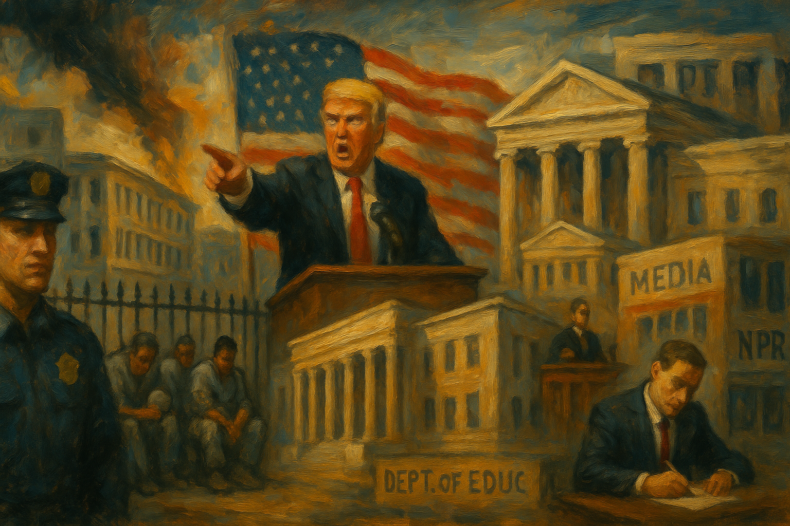

<!-- Generated by build_publish_week_v1 (appendix post) -->
<!-- Header image: image_wide_week15_appendix.png -->

# Week 15 Appendix: Widening the Base of Erosion

*A week of small, repeated acts across immigration, courts, media, and universities revealed a government rewarding loyalty and narrowing accountability.*

This was a high-pressure week defined by the fusion of retaliation, patronage, and institutional hollowing. The strongest signals came from the executive and justice system: the administration escalated politically targeted investigations, weakened anti-corruption and civil-rights enforcement, attacked public media, and continued converting the civil service into a loyalty-based apparatus. Immigration remained a central vehicle for democratic erosion, with due-process-hostile rhetoric, family-separating deportations, militarized border enforcement, and efforts to punish sanctuary jurisdictions. Universities and public education were another major front, as funding threats, investigations, suspensions, and curriculum manipulation converged into a broader campaign against dissent, DEI, and factual civic memory. At the same time, elite access and monetization of office became unusually explicit through the $TRUMP coin access scheme and the “Executive Branch” club. Courts provided some meaningful resistance—blocking deportations, restoring funds, and striking down retaliatory executive actions—but those judicial checks were themselves met with open intimidation and appeals. Structurally, the week shows a regime style that is not merely ideological but operationally authoritarian: punish critics, reward loyalists, centralize discretion, and degrade neutral institutions.

Power and Authority

1. President Trump complained that courts were blocking fast deportations and dismissed due process as impractical (2025-04-26) *[single source]*: The statement challenged judicial limits on executive power and framed basic legal process as an obstacle to state coercion.

2. The FBI arrested Milwaukee County Judge Hannah Dugan on obstruction charges tied to an immigration case (2025-04-26) *[single source]*: The arrest of a sitting judge intensified concerns that federal enforcement power was being used in ways that could chill judicial independence.

3. President Trump issued executive actions targeting campus diversity programs and higher-education accreditation (2025-04-27) *[single source]*: The orders used presidential power to pressure universities and narrow institutional autonomy over academic governance and inclusion policies.

4. President Trump ordered a Justice Department investigation into ActBlue (2025-04-27): Directing federal investigators toward the main Democratic fundraising platform raised concerns about retaliatory use of law enforcement against political opponents.

5. President Trump signed an executive order requiring English proficiency for commercial truck drivers (2025-04-28): The order used federal executive power to impose a language rule with direct effects on immigrant workers’ access to employment.

6. President Trump signed an executive order targeting sanctuary jurisdictions for possible funding cuts (2025-04-28): The order threatened local governments with federal punishment for resisting immigration enforcement, expanding coercive leverage over states and cities.

7. President Trump signed an executive order expanding federal support and protections for police (2025-04-28): The order strengthened executive backing for law enforcement while weakening accountability tools that constrain police power.

8. The Trump administration stopped federal investigations and lawsuits against 89 corporations (2025-04-28) *[single source]*: Ending enforcement actions against many corporations weakened accountability and suggested selective relief for powerful private actors.

9. President Trump offered dinners and White House access to top holders of his $TRUMP token (2025-04-28) *[single source]*: Tying presidential access to ownership of a personal crypto asset blurred the line between public office and private financial gain.

10. Defense Secretary Pete Hegseth ended the Pentagon’s Women, Peace and Security program (2025-04-29): The decision used executive control over defense policy to reverse an established program affecting gender inclusion in national security planning.

11. President Trump called Jeff Bezos and said Amazon quickly dropped a plan to show tariff costs (2025-04-28): The episode showed direct presidential pressure on a major company’s public-facing business decision, raising concerns about informal coercive power.

12. The Trump administration restructured the Peace Corps after a DOGE review and offered staff deferred resignations (2025-04-29): The move extended executive control over an independent service agency and reduced its internal capacity through politically driven restructuring.

13. The Trump administration dismissed nearly 400 contributors to the National Climate Assessment (2025-04-29): Removing scientists from a congressionally mandated assessment used executive power to weaken an official basis for public policy and preparedness.

14. The Trump administration announced an investigation into Harvard and the Harvard Law Review over alleged race-based discrimination (2025-04-29): The investigation used federal executive authority to pressure a university and its affiliated publication over diversity-related practices.

15. President Trump issued an order changing how overlapping tariffs applied to imported goods (2025-04-29): The order adjusted trade penalties through unilateral executive action, underscoring presidential control over major economic policy tools.

16. The Trump administration delayed approval of a new Novavax Covid-19 vaccine and announced new vaccine testing and surveillance changes (2025-04-30): Political intervention in vaccine approval and testing rules raised concerns about executive influence over scientific and public-health decisions.

17. President Trump held a cabinet meeting that featured praise for his presidency and repeated false claims about migrant children (2025-04-30) *[single source]*: The meeting used the authority and visibility of the executive branch to amplify loyalty displays and misleading official narratives.

18. President Trump defended using the Alien Enemies Act to expel alleged foreign terrorists (2025-04-30): Invoking wartime authority for immigration enforcement expanded executive claims to extraordinary coercive power over noncitizens.

19. The Trump administration cut climate-science agencies and rolled back environmental rules while boosting fossil-fuel extraction (2025-05-01) *[single source]*: The actions concentrated executive control over environmental policy while weakening scientific capacity, public safeguards, and long-term accountability.

20. President Trump created a Religious Liberty Commission (2025-05-01): The order established a new White House-aligned body to shape religion policy, increasing executive influence over church-state questions.

21. President Trump blamed Biden for the economic downturn and claimed the economy would soon boom (2025-05-01): Using the presidency to deny responsibility for current conditions tested norms of executive accountability and truthful public communication.

22. President Trump ended federal diversity programs, moved to dismantle the Education Department, and reclassified civil-service roles as political appointments (2025-05-02): These actions expanded presidential control over the bureaucracy and weakened institutional independence across education and the civil service.

23. President Trump issued an executive order directing the Justice Department to investigate ActBlue (2025-05-02) *[single source]*: The order reinforced concerns that presidential power was being used to trigger investigations of opposition-linked institutions.

24. President Trump used pardon power in ways that erased more than $1 billion in debts and penalties (2025-05-02) *[single source]*: The pardons weakened accountability for white-collar crime by wiping out major financial consequences through unilateral executive clemency.

25. The Trump administration used DOGE personnel and AI tools to rewrite regulations and cut federal staffing (2025-05-02): Placing inexperienced political operatives and automation inside agencies expanded executive control while weakening professional administrative safeguards.

26. President Trump fired National Security Adviser Mike Waltz and shifted Marco Rubio into the role (2025-05-02): The abrupt reshuffle highlighted concentrated presidential control over national-security leadership and instability in top executive staffing.

Institutions and Governance

1. Republicans in Congress passed a budget framework for Trump’s proposed bill (2025-04-26): The framework set up major fiscal changes through party-line procedure, shaping how Congress would allocate power over taxes and social spending.

2. House Republicans proposed $68.8 billion in new border-security spending (2025-04-26) *[single source]*: The proposal showed Congress channeling large new resources toward enforcement infrastructure, affecting institutional priorities and oversight choices.

3. Plaintiffs in Las Americas Immigrant Advocacy Center v. Noem amended their complaint to proceed as a class action over Guantánamo detention (2025-04-26): The filing reshaped a major court challenge to detention policy and preserved judicial review of detainees’ speech and due-process claims.

4. Defendants in U.S. Institute of Peace v. Jackson filed a reply defending the president’s authority to remove the USIP board (2025-04-26): The filing advanced a legal theory of broad presidential removal power over an institution designed to operate with independence.

5. Congress returned to session amid internal Republican budget disputes (2025-04-27) *[single source]*: The reopening of Congress highlighted how budget procedure and party conflict were shaping legislative capacity and accountability.

6. Representative Clay Higgins called for more judges to be arrested (2025-04-27) *[single source]*: A member of Congress publicly endorsed punitive action against judges, testing norms that protect judicial independence from political intimidation.

7. The Senate Permanent Subcommittee on Investigations reported that Elon Musk could avoid more than $2 billion in liabilities through federal influence (2025-04-27): The report raised oversight concerns about private influence over government decisions and the integrity of institutional safeguards.

8. Harvard University sued the Trump administration over threats to cut federal funding (2025-04-27): The lawsuit asked courts to police federal overreach into university governance and defend institutional autonomy against coercive funding threats.

9. Plaintiffs in American Association of Colleges for Teacher Education v. Carter moved to dissolve a preliminary injunction while the case was on appeal (2025-04-27): The filing changed the posture of a live institutional challenge over federal education-related action and appellate review.

10. Protect Democracy moved to force OMB to publicly post apportionments (2025-04-27): The case sought judicial enforcement of transparency around executive budget control, a key institutional check on spending power.

11. Judge Bates questioned the Justice Department’s arguments in the Jenner & Block retaliation case (2025-04-27) *[single source]*: The hearing tested limits on presidential retaliation against law firms and the courts’ role in preserving legal independence.

12. Gerry Connolly announced he would step down as top Democrat on the House Oversight Committee (2025-04-28): The leadership change affected the direction of a key congressional oversight body responsible for checking executive conduct.

13. Senators Adam Schiff and Elizabeth Warren requested an ethics inquiry into Trump’s $TRUMP token contest (2025-04-28): The request sought formal oversight of possible conflicts between presidential access, private profit, and federal ethics rules.

14. Representative Shri Thanedar filed articles of impeachment against President Trump (2025-04-28) *[single source]*: The filing used a constitutional accountability mechanism to challenge alleged executive abuses and defiance of legal limits.

15. Defendants in State of New York v. Trump appealed an order enforcing a preliminary injunction (2025-04-28): The appeal continued a court fight over executive compliance with judicial limits, a core institutional balance issue.

16. Plaintiffs in Susan Webber v. Department of Homeland Security appealed the transfer of their case to the Court of International Trade (2025-04-28): The appeal contested forum control in litigation over administration action, affecting where institutional review would occur.

17. State attorneys general filed amicus briefs in multiple cases challenging Trump administration actions (2025-04-28): The briefs showed states using courts as an institutional counterweight in disputes over federal power.

18. Judge Bryan partly granted a temporary restraining order blocking the removal of Günaydin from Minnesota (2025-04-28): The order preserved judicial control over a removal dispute and limited executive action while the case proceeded.

19. Defendants in several active cases filed motions to dismiss or replies contesting jurisdiction and standing (2025-04-28): The filings showed the administration using procedural defenses to narrow or delay judicial review across multiple institutional disputes.

20. Plaintiffs in American Library Association v. Sonderling pressed for emergency relief over administration action affecting libraries (2025-04-28): The case sought court protection for an institution tied to public access, records, and cultural governance.

21. The D.C. Circuit reinstated part of an injunction in National Treasury Employees Union v. Vought (2025-04-28): The ruling strengthened judicial protection for federal workers and limited executive efforts to alter agency operations unilaterally.

22. OCA–Asian Pacific American Advocates opposed the government’s motion to stay proceedings (2025-04-28): The filing resisted delay in a case challenging administration action, preserving the pace of institutional review.

23. A federal judge ordered the restoration of appropriated funds to Radio Free Europe/Radio Liberty (2025-04-28): The ruling reaffirmed Congress’s power of the purse and rejected executive refusal to release appropriated money.

24. A federal appeals court restored an injunction against mass firings at the CFPB (2025-04-28) *[single source]*: The decision protected a regulatory agency’s staffing and independence against executive attempts to hollow it out.

25. Justice Action Center and Innovation Law Lab sued over immigration enforcement in schools and houses of worship (2025-04-28) *[single source]*: The lawsuit asked courts to review whether executive enforcement policy had crossed institutional and constitutional boundaries.

26. Labor unions, nonprofits, and local governments sued over the administration’s federal workforce downsizing (2025-04-28) *[single source]*: The case challenged whether the executive branch could restructure the federal workforce without congressional approval.

27. The Supreme Court issued routine orders on petitions, fee status, and a request for the solicitor general’s views (2025-04-28): The orders reflected ordinary court gatekeeping and case-selection functions within the federal judicial system.

28. The House and Senate advanced anti-trans and anti-immigrant bills in North Carolina and prepared a vote on an anti-DEI bill (2025-04-28) *[single source]*: These state legislative moves showed institutions using formal lawmaking power to reshape rights and public policy.

29. The Federal Election Commission lost its quorum after a second commissioner resigned (2025-04-29): Without a quorum, the agency could not take key enforcement actions, weakening campaign-finance oversight.

30. House Republicans blocked an effort to investigate Pete Hegseth’s use of Signal by changing floor rules (2025-04-29): The maneuver reduced Congress’s ability to compel information from the executive branch and weakened oversight capacity.

31. Perkins Coie amended filings and later won summary judgment against a retaliatory executive order (2025-04-29): The case became a major judicial check on presidential retaliation against a law firm and on executive interference with legal representation.

32. Plaintiffs and defendants in multiple education, labor, immigration, and funding cases filed replies, motions, injunction requests, and appeals across active challenges to administration actions (2025-04-29): The volume of filings showed courts serving as a central arena for institutional resistance and procedural contest over executive power.

33. A federal court granted class certification and a preliminary injunction in United Farm Workers v. Noem (2025-04-29): The order imposed judicial limits on Border Patrol stops and arrests, reinforcing institutional checks on enforcement practices.

34. The Supreme Court released its opinion in Advocate Christ Medical Center v. Kennedy (2025-04-29): The opinion added binding national precedent, illustrating the Court’s continuing role in shaping federal law.

35. Senate Democrats planned marathon floor speeches against Trump’s first 100 days (2025-04-29): The move used formal Senate procedure to frame opposition and public accountability within the legislative branch.

36. The Trump administration sued Michigan and Hawaii to block planned climate litigation against oil companies (2025-04-29): The lawsuits used federal courts to preempt state legal strategies, intensifying conflict over state and federal institutional authority.

37. A federal judge ordered the release of Mohsen Mahdawi from immigration detention (2025-04-30): The ruling checked executive detention power and emphasized the courts’ role in protecting speech and due process.

38. The Supreme Court temporarily blocked the deportation of Javier Salazar (2025-04-30) *[single source]*: The emergency order preserved judicial review and prevented immediate executive removal before legal claims could be heard.

39. President Trump attacked judges at a rally for blocking his policies (2025-04-30): The remarks pressured the judiciary from the presidency and tested norms of respect for an independent court system.

40. Democratic state attorneys general continued preparing and pursuing legal challenges to Trump administration actions (2025-04-30) *[single source]*: The coordinated litigation showed states using institutional legal tools to constrain executive overreach.

41. Plaintiffs and defendants in multiple active cases filed appeals, answers, stays, oppositions, and summary-judgment papers across ongoing challenges (2025-04-30): The filings reflected sustained judicial contest over executive action in labor, records access, immigration, and agency governance.

42. A federal court blocked DHS from transferring migrants to other agencies to avoid due-process protections (2025-04-30) *[single source]*: The ruling limited executive attempts to shift detainees between institutions in ways that could evade legal safeguards.

43. A federal appeals court upheld an injunction blocking DOGE access to sensitive Social Security records (2025-04-29) *[single source]*: The decision preserved institutional privacy safeguards and limited executive access to protected government data.

44. The Supreme Court released its opinion in Feliciano v. Department of Transportation (2025-04-30): The opinion added another binding national ruling, reinforcing the Court’s central role in federal governance.

45. President Trump signed five measures into law during his first 100 days (2025-04-30) *[single source]*: The limited legislative output highlighted how little of the administration’s agenda had moved through ordinary lawmaking channels.

46. Senator Rand Paul co-sponsored a measure to end Trump’s tariffs (2025-04-30) *[single source]*: The effort represented a legislative attempt to reclaim authority over trade policy from the executive branch.

47. The Trump administration appealed or sought stays in cases over TPS, media funding, and other injunctions (2025-05-01): The appeals strategy showed the executive branch using higher courts to narrow or delay institutional checks on its actions.

48. Judge Rodriguez certified a class and permanently enjoined use of the Alien Enemies Act against covered Venezuelans in south Texas (2025-05-01): The ruling sharply limited executive use of an old wartime statute and reaffirmed the judiciary’s role in statutory interpretation.

49. Plaintiffs and defendants in numerous active cases filed amended complaints, motions to dismiss, injunction papers, and procedural updates across ongoing litigation (2025-05-01): The filings showed broad institutional conflict over executive action in immigration, labor, education, records, and agency funding.

50. Justice Ketanji Brown Jackson rebuked attacks on judges as threats to democracy and the rule of law (2025-05-01) *[single source]*: A sitting justice publicly defended judicial independence against executive intimidation, underscoring strain on institutional norms.

51. The Supreme Court denied multiple stay and certiorari requests in Jeffrey Hutchinson’s execution cases (2025-05-01): The denials reflected the Court’s final gatekeeping role in capital cases and the administration of justice.

52. Senators Chuck Schumer, Chris Van Hollen, Tim Kaine, and Alex Padilla demanded a report on wrongful deportations to El Salvador (2025-05-01): The demand used legislative oversight tools to seek accountability for executive immigration actions that may have violated court orders.

53. House and Senate Republicans blocked efforts to challenge Trump’s tariff emergency and tariff policy (2025-05-01) *[single source]*: The moves showed Congress declining to assert its own trade authority, leaving executive power over tariffs largely unchecked.

54. The Oklahoma legislature failed to vote on a resolution to block a controversial social studies curriculum (2025-05-01) *[single source]*: The inaction allowed disputed curriculum changes to proceed, showing weak legislative oversight of state education governance.

55. The Trump administration asked the Supreme Court to let it revoke TPS for more than 300,000 Venezuelans (2025-05-01): The request sought high-court backing for a major executive immigration change with broad consequences for legal status and institutional review.

56. The Trump administration and Maine settled a dispute over frozen child-nutrition funds and dropped the lawsuit (2025-05-02): The settlement restored funds and required legal process, reinforcing limits on executive leverage over state-administered programs.

57. Puerto Rico dropped its climate lawsuit against major oil companies (2025-05-02) *[single source]*: The dismissal showed how federal pressure could shape whether states and territories use courts to pursue accountability claims.

58. Plaintiffs and defendants in multiple active cases filed complaints, amendments, injunction papers, dismissals, and summary-judgment motions across ongoing litigation (2025-05-02): The filings reflected continued judicial contest over administration actions affecting labor, immigration, funding, and agency authority.

Economic Structure

1. The Trump administration drove tourism losses through deportation and tariff policies (2025-04-26) *[single source]*: The policy mix reduced international travel and spending, showing how executive choices can impose broad economic costs on local industries.

2. The Trump administration imposed tariffs that raised prices and drew criticism for burdening poorer households (2025-04-26) *[single source]*: The tariffs shifted costs onto consumers and exposed how trade policy can redistribute economic pain downward.

3. DOGE and the Trump administration cut staff, science funding, and infrastructure disbursements across federal programs (2025-04-27) *[single source]*: The cuts weakened state capacity to deliver public goods, finance projects, and support research-driven economic development.

4. Education Secretary Linda McMahon said the administration would not pursue student loan relief (2025-04-27) *[single source]*: The decision signaled a narrower federal role in easing household debt burdens through executive policy.

5. Agriculture Secretary Brooke Rollins said the administration was prepared to seek a farmer bailout because of tariff damage (2025-04-27) *[single source]*: The statement showed tariffs creating economic harm severe enough to prompt possible public rescue of affected industries.

6. The Trump administration fast-tracked oil and gas permits and halted renewable-energy permitting in Texas (2025-04-27) *[single source]*: The contrasting permit choices used regulatory power to favor one energy sector over another and reshape investment patterns.

7. The Trump administration withdrew the USDA salmonella safety rule for poultry (2025-04-28): Removing the rule reduced regulatory burdens on industry while weakening a public-health safeguard tied to food production.

8. Amazon denied it would show tariff amounts on products after White House pressure (2025-04-28): The episode showed political pressure shaping how a major retailer disclosed price effects from government policy.

9. UPS announced major layoffs and facility closures (2025-04-28) *[single source]*: The cuts showed how trade disruption and slowing shipping demand were translating into job losses and reduced logistics capacity.

10. Donald Trump Jr. and allies opened the Executive Branch club to sell high-priced access to administration insiders (2025-04-28) *[single source]*: The club turned proximity to governing officials into a market good, blurring the line between public decision-making and private wealth.

11. The DEA, EPA, FCC, TSA, and FDA issued a large set of routine notices on registrations, permits, collections, and program administration (2025-04-28): These notices reflected ordinary regulatory governance over drugs, environment, communications, transport, and food systems.

12. The Trump administration pursued broad tariff policies that contributed to economic contraction and rising unemployment pressure (2025-04-30) *[single source]*: The policies were linked to weaker growth, higher costs, and labor-market strain, showing the economy-wide reach of executive trade decisions.

13. The Trump administration proposed or defended low-wage and work-requirement policies without raising the federal minimum wage (2025-04-30) *[single source]*: The stance favored conditional aid and low labor standards, affecting the economic security of poor and low-wage workers.

14. The Trump administration used tariffs and trade restrictions to reshape imports, autos, steel, aluminum, and low-value shipments (2025-05-01) *[single source]*: The actions concentrated trade policymaking in the executive branch and altered costs, supply chains, and industrial incentives across sectors.

15. The Trump administration created or promoted new federal economic vehicles including a bitcoin reserve and a proposed sovereign wealth fund (2025-05-01) *[single source]*: These moves signaled a willingness to use executive power to redirect national economic strategy through novel financial instruments.

16. The Trump administration issued executive actions on prescription drugs, hospital price transparency, IVF access, and student-loan forgiveness limits (2025-05-01) *[single source]*: The actions showed the executive branch using administrative tools to reshape household-facing health and education costs.

17. The Trump administration froze or redirected public spending through DOGE expansion, FEMA review, and payment-system changes (2025-05-01): These steps increased executive influence over contracts, grants, and disbursements that structure public economic life.

18. The Trump administration closed environmental-justice offices and halted related grants (2025-05-01) *[single source]*: Ending targeted grants shifted public resources away from communities facing concentrated pollution and weakened distributive equity in environmental policy.

19. The Trump administration paused Foreign Corrupt Practices Act prosecutions and closed the Justice Department’s cryptocurrency unit (2025-05-02) *[single source]*: The enforcement pullback reduced legal risk for corporate and financial misconduct, weakening anti-corruption market rules.

20. The Trump administration moved to revoke Harvard’s tax-exempt status (2025-05-02): Threatening a university’s tax status used fiscal power to pressure an independent institution and its financial base.

21. Elon Musk and DOGE announced spending cuts whose projected savings were sharply reduced (2025-05-02): The gap between promised and projected savings raised accountability questions about executive claims of fiscal efficiency.

Civil Rights and Dissent

1. ICE deported mothers and U.S. citizen children to Honduras and separated families with little access to lawyers (2025-04-26): The deportations tested due process, family integrity, and the rights of citizen children caught in immigration enforcement.

2. Universities and the Trump administration disciplined or pressured student protesters over pro-Palestinian activism (2025-04-26) *[single source]*: The combined federal and campus response narrowed space for protest and speech in higher education.

3. The Kennedy Center board under the Trump administration canceled planned LGBTQ Pride events (2025-04-26): The cancellation reduced public visibility for a marginalized group and signaled official hostility toward LGBTQ expression.

4. The FBI and local authorities raided the homes of pro-Palestinian students in Michigan (2025-04-27) *[single source]*: The raids raised concerns that criminal process was being used in ways that could intimidate political activism.

5. Federal agents raided a Colorado Springs nightclub and detained more than 100 undocumented immigrants (2025-04-27): The large-scale operation showed the breadth of immigration enforcement power and its impact on bodily security for noncitizens.

6. Yale University revoked recognition of a student group after a protest against an Israeli minister (2025-04-27) *[single source]*: The decision penalized campus organizing and narrowed institutional protection for student protest activity.

7. ICE targeted unaccompanied immigrant children and their sponsors for enforcement actions (2025-04-28) *[single source]*: The operations expanded immigration enforcement into child welfare and family networks, raising fears of backdoor family separation.

8. Immigration officials detained Irish green-card holder Cliona Ward over an old criminal record (2025-04-28) *[single source]*: The detention showed how aggressive immigration enforcement could reach lawful permanent residents and unsettle due-process expectations.

9. DOJ appointees removed senior managers from the voting section and told lawyers to dismiss active cases (2025-04-28) *[single source]*: The changes weakened federal enforcement of voting-rights protections and reduced institutional support for equal political participation.

10. The Department of Education’s Office for Civil Rights accused the University of Pennsylvania of Title IX violations over trans athletes (2025-04-28): The threat of enforcement used federal civil-rights machinery in a way that could narrow protections for transgender people.

11. Hakeem Jeffries and Cory Booker held a 12-hour Capitol sit-in against the Republican funding plan (2025-04-28) *[single source]*: The protest used public dissent inside a governing institution to oppose cuts affecting vulnerable groups and public services.

12. Bishop William J. Barber II was arrested during a Capitol protest against the proposed federal budget (2025-04-28) *[single source]*: The arrest highlighted the risks faced by demonstrators using civil disobedience to contest federal policy choices.

13. Organizers across the United States planned May Day protests for social justice and economic equality (2025-04-28): The planned demonstrations showed civil society mobilizing to contest policy and demand accountability through public assembly.

14. The Trump administration implemented or promoted policies affecting diversity programs, transgender rights, and immigration restrictions (2025-04-29) *[single source]*: The policy mix targeted multiple marginalized groups at once, reshaping the rights landscape through executive action.

15. Federal authorities disappeared Venezuelan detainees into custody and deported many to El Salvador (2025-04-29): The lack of notice and contact raised severe concerns about due process, detention transparency, and bodily security.

16. Chris Krebs had his Global Entry membership revoked after earlier executive targeting (2025-04-29) *[single source]*: The revocation suggested the use of administrative power in ways that could punish a prominent critic of the administration.

17. The FBI reassigned agents who had kneeled with Black Lives Matter protesters in 2020 (2025-04-29): The reassignments signaled institutional punishment tied to symbolic support for protest, with implications for dissent inside law enforcement.

18. The U.S. Postal Inspection Service began helping ICE locate suspected undocumented immigrants using mail data (2025-04-29): Using postal surveillance tools for immigration enforcement expanded state monitoring in ways that threaten privacy and immigrant security.

19. Governor J.B. Pritzker called for mass protests and mobilization against Republican policies (2025-04-29): The speech encouraged public dissent as a democratic response to perceived threats to rights and constitutional norms.

20. The Justice Department charged migrants with entering a new military buffer zone at the southern border (2025-04-30): The prosecutions deepened the militarization of immigration enforcement and raised concerns about military involvement in civilian policing.

21. President Trump hosted a National Prayer Day event centered on religion in public life (2025-04-30) *[single source]*: The event used presidential symbolism to elevate a favored religious identity in ways that can unsettle church-state neutrality.

22. President Trump ended federal DEI initiatives and continued anti-trans executive actions (2025-04-30) *[single source]*: The actions reduced federal support for inclusion and narrowed protections for transgender people and other targeted groups.

23. The Department of Justice Civil Rights Division lost most of its lawyers through departures and reassignments (2025-05-01) *[single source]*: The staffing collapse weakened federal capacity to protect voting, housing, education, and other civil rights through enforcement.

24. The Department of Homeland Security used domestic-abuse allegations to justify refusing to return Kilmar Ábrego García (2025-05-01): The stance showed the executive branch defending a contested deportation despite court orders, with implications for due process and family rights.

25. Swarthmore College suspended nine students involved in a pro-Palestinian encampment (2025-05-02): The suspensions imposed severe penalties on student protest and raised concerns about due process in campus discipline.

26. ICE agents raided the home of a U.S. citizen family in Oklahoma City by mistake and took belongings (2025-05-02): The mistaken raid showed how aggressive immigration enforcement can harm citizens and undermine trust in basic civil protections.

Information, Memory and Manipulation

1. The Trump administration barred the Associated Press from Oval Office and pool access (2025-04-26): Restricting a major wire service’s access limited independent reporting on the presidency and tested norms of press openness.

2. The White House Correspondents’ Association withdrew a comedian’s invitation amid tensions around Trump and the press (2025-04-26) *[single source]*: The move reflected pressure and fragmentation inside the press corps during a period of heightened executive hostility toward media.

3. Attorney General Pam Bondi rescinded Justice Department protections that had limited subpoenas of journalists (2025-04-26) *[single source]*: The policy change increased the state’s power to compel reporters and threatened source confidentiality essential to watchdog journalism.

4. President Trump and White House officials attacked journalists and media outlets in public statements and social media posts (2025-04-26) *[single source]*: Official verbal attacks on reporters and outlets can chill scrutiny and erode public trust in independent news.

5. The Trump administration used legal threats and funding pressure against major media organizations including ABC, CBS, NPR, and PBS (2025-04-27) *[single source]*: The actions used state and legal leverage to weaken independent media institutions and narrow the information sphere.

6. The White House held alternative press briefings for right-wing influencers and new media allies (2025-04-28) *[single source]*: The briefings elevated loyal media channels over adversarial reporting and helped build a state-favored information ecosystem.

7. The Trump administration granted classified-network access to DOGE personnel and used nondisclosure agreements in FAA work (2025-04-28): The secrecy measures reduced transparency around sensitive state functions and complicated public oversight of private actors inside government.

8. The White House launched White House Wire to publish only favorable Trump coverage on official servers (2025-05-01) *[single source]*: Using government infrastructure to amplify curated positive coverage blurred the line between public information and official propaganda.

9. President Trump and allies repeated false or misleading claims about the economy, deportation evidence, and migrant children (2025-05-01): False claims from top officials distorted public understanding of policy and weakened norms of truthful democratic communication.

10. President Trump ordered an end to federal funding for NPR and PBS (2025-05-01): Cutting support for public broadcasters threatened independent public-interest journalism and narrowed noncommercial news capacity.

11. The Trump administration and appellate courts continued withholding or contesting funds for Radio Free Europe/Radio Liberty, Radio Free Asia, and Middle East Broadcasting Networks (2025-05-01): The funding fight put pressure on international public-interest broadcasters that provide independent news in contested information environments.

12. Oklahoma education officials and allied curriculum writers advanced social studies standards that included debunked 2020 election claims and stronger Christian framing (2025-05-01) *[single source]*: Embedding false election narratives and sectarian emphasis in state curriculum used public education to shape memory and civic understanding.

13. President Trump ordered the release of classified files on the Kennedy and King assassinations (2025-05-01) *[single source]*: The order affected public access to historical records and the executive branch’s control over politically sensitive archives.

14. The Trump administration fired Biden appointees from the board of the U.S. Holocaust Memorial Museum (2025-04-29): Removing board members from a major historical institution raised concerns about political control over public memory and civic education.

15. Top Trump officials used a less-secure archived messaging app for sensitive communications (2025-05-02) *[single source]*: Using a weaker communications platform for official business raised risks for records integrity, security, and public accountability.

16. The FCC opened a routine comment process on children’s programming information collection (2025-04-29): The notice reflected ordinary media-regulatory administration affecting how educational programming information is disclosed to the public.

17. The FCC under new leadership investigated NPR and PBS while the administration pursued defunding (2025-05-02): Regulatory scrutiny of public broadcasters alongside funding threats increased pressure on independent public media institutions.

