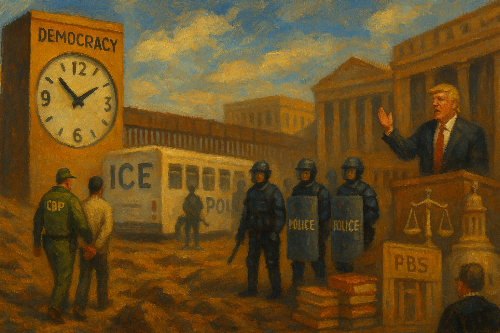

<!-- Generated by build_publish_week_v1 -->
<!-- Header image: image_wide_week16.png -->

# Week 16: Stratified Rights as Routine Governance

*With the clock frozen at 7:59 p.m., immigration, media, and the civil service are quietly retooled to sort who is protected, heard, and expendable.*

> The law, in its majestic equality, forbids the rich as well as the poor to sleep under bridges. — Anatole France
> The most common way people give up their power is by thinking they do not have any. — Attributed to Alice Walker
> Democracy does not guarantee equality of conditions, it only guarantees equality of opportunity. — Alexis de Tocqueville

The sixteenth week of Trump’s second term did not hinge on a single order or spectacle. It unfolded instead as a week in which existing tools were used more confidently, and in more places, to sort people, institutions, and information into favored and disfavored classes. Immigration law, civil service rules, media regulation, and public funding all remained on the books. What changed was how they were applied, and to whom. The pattern that emerged was one of stratification: of rights, of access, of voice.

At the close of the previous period, the Democracy Clock stood at 7:59 p.m. By the end of this week, it remained at 7:59 p.m., a net change of zero minutes. The stillness in the measure did not reflect a pause in activity. It reflected a balance between deepening erosion and scattered resistance. Executive power pressed harder on immigration, media, and the civil service. Courts, state governments, and professional groups pushed back in specific cases. The week did not move the hands further toward democratic midnight, but it thickened the terrain on which future movement will occur.

Immigration was the clearest arena where emergency logic hardened into routine. The administration used the Alien Enemies Act and broad foreign-affairs authority to deport Venezuelans on the basis of disputed intelligence about gang ties, including people who had been legally present and compliant with existing rules. Deportation flights were justified as matters of national security rather than ordinary enforcement. In parallel, emergency-style deportations to El Salvador swept up migrants who had played by the rules, signaling that formal status no longer guaranteed predictable treatment. The message was simple. Status could be revoked at will.

Detention policy shifted in the same direction. A new rule required headquarters approval for any release from ICE custody, effectively freezing releases nationwide. Overcrowding followed, not as an accident but as a foreseeable result of making detention the default condition. Local discretion—once a modest check on central policy—was stripped away. The same headquarters that controlled releases also pursued a budget that would increase ICE’s detention funding by more than threefold and its removals budget by fivefold, positioning it as the best-funded law enforcement body in the federal system. Scale became its own argument.

Coercion did not always take the form of bars and handcuffs. The administration offered undocumented immigrants $1,000 and airfare if they agreed to self-deport, presenting the payment as a humane option while downplaying the long reentry bans that would follow. The program relied on unequal access to legal information: those most likely to accept were those least able to secure counsel. At the same time, thousands of agents from other federal bodies—DEA, FBI, IRS, and more—were deputized to assist ICE, blurring the line between specialized missions and immigration control. The result was a migration regime that looked less like ordinary law enforcement and more like a standing emergency. It was built to last.

Individual cases showed both the reach of this system and its occasional limits. An Irish green card holder, Cliona Ward, was detained for seventeen days over decades-old convictions until a state court vacated them, illustrating how rigid enforcement could upend settled lives and require diplomatic intervention. A Turkish student, Rümeysa Öztürk, was detained after writing a critical op-ed; federal courts ordered her transfer and then release, affirming that immigration powers could not be used as punishment for protected speech. These rulings mattered, but they were exceptions carved out against a broad current. The current itself kept running.

The administration’s own rhetoric edged toward more explicit suspension of legal safeguards. Stephen Miller, speaking for the White House, said the team was considering suspending the writ of habeas corpus to limit court challenges to detention. The idea did not become law, but its public airing marked a willingness to treat one of the oldest protections against arbitrary imprisonment as negotiable. In the same week, an executive order created a large National Center for Warrior Independence to house homeless veterans, funded in part by redirecting resources from services for undocumented immigrants. Support for one vulnerable group was tied to the exclusion of another, making status and origin the hinge for redistributive choices. Who belonged determined who would be helped.

The same week saw senior officials question the universality of due process itself. President Trump publicly mused about whether everyone in the United States was entitled to due process, casting doubt on a core constitutional guarantee. Before a House appropriations subcommittee, Homeland Security Secretary Kristi Noem refused to affirm that the Constitution’s protections applied to all persons, not just citizens. These were not slips of language. They were statements under questioning, in settings where the meaning of law is supposed to be clarified, not blurred. The doubt was deliberate.

This mindset was visible in how law was applied to friends and foes. The president pardoned Enrique Tarrio, the Proud Boys leader convicted of seditious conspiracy for his role in January 6, and his administration reached a settlement in principle with Ashli Babbitt’s family. Both actions signaled leniency toward those involved in an attack on Congress. At the same time, Trump’s border czar threatened Wisconsin’s governor with arrest for advising state workers to seek legal counsel before responding to ICE requests, and federal agents arrested Newark’s mayor while he protested outside an ICE detention center, asserting local jurisdiction. Protest and legal guidance by officials were treated as suspect; violence aligned with the president’s movement was forgiven or compensated. Loyalty, not law, set the line.

Courts provided partial counterweights. In the Öztürk case, judges insisted that immigration detention could not be used to retaliate against speech. In a separate matter, a federal judge ordered prosecutors and senior officials to avoid prejudicial public comments in a high-profile murder case, protecting the defendant’s right to a fair trial from politicized rhetoric. Yet other signals pointed the other way. Federal judges criticized Department of Justice lawyers for poor performance in defending administration policies, raising questions about whether the department was willing or able to subject executive actions to real scrutiny. And while the president signed an order directing agencies to reduce criminal regulatory offenses—framed as relief from overcriminalization—this easing of liability came as the same administration floated suspending habeas corpus and intensified enforcement against migrants and protesters. Decriminalization was selective.

The boundary-testing extended into civil rights protections. The General Services Administration rescinded federal workplace nondiscrimination guidance on gender identity, rolling back protections for LGBTQ+ employees and narrowing official definitions of sex. This change did not arrive with fanfare, but it altered the baseline for how federal workers could expect to be treated. Taken together with the selective pardons, threats, and arrests, the week’s actions suggested a legal order in which the force of law depended increasingly on alignment with the regime. Protection itself became conditional.

Beneath these headline moves, the machinery of government itself was being reshaped. The Department of Government Efficiency (DOGE) oversaw a mass firing of tens of thousands of probationary federal workers in a Valentine’s Day purge. An executive order expanded discretion to fire probationary employees, weakening job protections and making it easier to remove staff who might resist political directives. The Supreme Court’s intervention in litigation over reinstatement complicated efforts to bring purged workers back, while lower courts largely blocked the most sweeping aspects of the purge. The Office of Special Counsel, after a leadership change, dropped its inquiry into the legality of the mass firings, signaling that an internal watchdog would not press the issue. Oversight bent, then stepped aside.

The purge was not confined to one agency. The Labor Department saw a 20 percent staff exodus and large cuts to international labor grants, weakening enforcement of labor standards and research. The administration announced plans to cut thousands of jobs at the CIA and other intelligence agencies, eliminating diversity programs and analytic capacity in national security institutions. A federal hiring freeze, including for air traffic controllers, came despite known shortages; Newark’s airport experienced severe delays and safety concerns as understaffing persisted. An independent review of air traffic control oversight, launched after a deadly collision, was halted by the administration, curtailing outside evaluation of systemic risks. Safety became another area where scrutiny thinned.

Regulatory and expert bodies were hollowed out in parallel. The Environmental Protection Agency’s staffing was cut, and its Office of Research and Development was dissolved, undermining independent environmental science and shifting the agency toward political control. The Consumer Product Safety Commission began to be dismantled, reducing oversight of product safety and shifting risk to consumers. NASA faced a proposed 25 percent budget cut even as Mars initiatives were protected, threatening broad scientific programs while favoring high-profile projects. USAID staff and grants were slashed through DOGE-driven cuts, causing food and medicine to expire and health programs to lapse abroad, weakening U.S. support for global public goods and democratic resilience. Expertise was treated as expendable.

Information and oversight channels were also reconfigured. The FBI director delayed submission of the bureau’s budget to Congress past the legal deadline and was reported to be disengaged from duties, impeding legislative oversight of a powerful law enforcement agency. DOGE consolidated personal data on millions of people, prompting at least eleven lawsuits alleging massive Privacy Act violations. A secure messaging app used for sensitive government communications suffered a suspected hack and was suspended, exposing vulnerabilities in channels meant to protect national security information. At the same time, an executive order directed the modernization of the Office of the Federal Register to speed publication of rules, potentially allowing regulatory changes to take legal effect more quickly, with less time for public or congressional response. Speed favored the center.

Media and information systems came under direct pressure. An executive order cut NPR and PBS off from federal funding, threatening the viability of noncommercial news and educational programming, especially in rural areas dependent on public broadcasting. Voice of America and its parent agency, USAGM, were dismantled by order; more than 1,000 staff were kept off the job while litigation proceeded, and 1,300 were placed on leave as VoA was taken off the air. Grants to sister outlets were canceled. In place of VoA’s own journalists, leadership contracted One America News to provide newsfeed and video services, aligning a government-funded outlet with a hard-right partisan network. A public voice was swapped for a loyal one.

Regulatory tools were used to discipline private media. The Federal Communications Commission opened an unprecedented “news distortion” investigation into CBS News after a 60 Minutes interview with the president, echoing Trump’s own lawsuit. A senior producer resigned after corporate intervention in Trump coverage, as Paramount Global leadership reviewed political content amid pending merger talks. The company scaled back DEI efforts and adjusted political initiatives to avoid regulatory backlash, illustrating how ownership and licensing power could chill editorial independence. A combined pattern emerged: regulatory scrutiny of content and corporate structure created incentives for self-censorship in exchange for merger approval and regulatory peace. Silence became a business decision.

Legal and rhetorical pressure on journalists intensified. Attorney General Pam Bondi rolled back protections for the press in leak investigations after critical reporting, increasing the risk that national security tools would be used to intimidate reporters. Director of National Intelligence Tulsi Gabbard attacked the Wall Street Journal for stories on Greenland intelligence activities, accusing the paper of politicizing and leaking classified information and framing investigative reporting as a threat to democracy and security. A VoA journalist sued over the defunding order, arguing that it violated press freedom and congressional appropriations, but the broader trajectory was clear: independent and public media were being starved or captured, while state-aligned outlets thrived. The field of vision narrowed.

The administration also experimented with new forms of narrative control. President Trump posted an AI-generated image of himself dressed as the pope on official channels during a papal transition, using religious symbolism for personal branding and blurring the line between satire and official messaging. Economic data were framed in ways that obscured responsibility: the Bureau of Economic Analysis and economic media described a GDP dip as caused by imports, reinforcing a misleading shorthand that imports are a “subtraction” from growth. Trade officials and the president made inconsistent statements about who pays tariffs and the scope of trade deals, contributing to confusion about economic policy and accountability. Data and algorithms were not falsified outright, but they were used in ways that shaped perception more than they informed. Confusion itself became a tool.

Universities and cultural institutions found themselves at the intersection of funding and ideology. The administration froze billions in federal research grants and aid to Harvard University and threatened its tax-exempt status over its handling of campus protests, using economic power to pressure governance and speech. In Congress, hearings and legislation on campus antisemitism and protests put universities under intense scrutiny, with the implicit message that failure to police certain speech could cost them money and standing. On campuses, protest was met with policing: Columbia University requested NYPD intervention to clear an occupied library, leading to the arrest of about seventy-five pro-Palestinian protesters; Swarthmore College called local police to disband an encampment and arrest activists; the University of Washington used law enforcement to clear an occupied engineering building and charge student protesters. Spaces for dissent shrank.

Prosecutorial responses to protest were uneven. In Michigan, Attorney General Dana Nessel dropped charges against seven university encampment protesters amid concerns about conflicts of interest and bias, while continuing vandalism cases against others. A related hearing highlighted tensions between political relationships, prosecutorial discretion, and equal treatment of demonstrators. At the same time, the National Endowment for the Arts terminated many grants and reoriented funding toward projects reflecting “American heritage,” moving away from diversity-focused work. Public arts funding became a tool to privilege certain narratives in cultural memory. In Congress, a bill advanced to rename the Gulf of Mexico as the “Gulf of America,” a symbolic gesture that sought to recast geographic memory along nationalist lines. Names and grants pointed in the same direction.

The fusion of public office with private enrichment and foreign entanglements deepened. Freight Technologies announced plans to buy $20 million in Trump-branded cryptocurrency explicitly to influence trade policy, treating a presidentially linked asset as a channel for lobbying. A $2 billion investment in Binance, backed by Abu Dhabi’s MGX, was structured through a Trump family stablecoin, creating a path for foreign-government-linked capital to flow into ventures tied to the president. The Trump Organization launched a new hotel and tower project in Dubai with a Saudi-linked firm and entered a $5.5 billion deal to build a golf club in Qatar with a state-owned company, despite an ethics pledge against direct foreign-government business. The border between state and firm blurred.

Domestic capital followed similar lines. Institutional investors significantly increased their holdings in Trump Media despite the company’s losses, suggesting that political goodwill, not financial fundamentals, might be the real return. Reports indicated that big-oil donors received tariff exemptions and that Trump businesses pursued foreign-government deals, underscoring how economic policy and access could be shaped by personal and donor interests. Tariff policy itself was volatile: high tariffs on auto parts and other imports raised costs for consumers and industries; a threatened 100 percent tariff on foreign films, later partially walked back, used national security language to justify cultural trade measures; sweeping “Liberation Day” tariffs on multiple trading partners triggered market declines; and unilateral tariff cuts for China ahead of talks weakened U.S. leverage. Treasury Secretary Scott Bessent evaded congressional questions about who actually paid these tariffs, obscuring the burden on households. The costs were hidden in plain sight.

Regulatory decisions appeared friendly to connected industries. An executive order promoted domestic production of critical medicines by easing environmental and regulatory checks on pharmaceutical manufacturing. The Federal Aviation Administration approved a fivefold increase in SpaceX launches from Boca Chica despite prior environmental damage, finding no significant impact and signaling a permissive stance toward a politically connected company. In each case, the language of national security or competitiveness accompanied choices that shifted risk onto the public while preserving profits and flexibility for firms close to power. Risk was socialized; gain was not.

Protest and dissent faced a tightening net of policing and surveillance. Beyond the campus arrests and the detention of the Newark mayor, DOGE’s consolidation of personal data on millions of people raised the prospect that information gathered for administrative purposes could be repurposed for political control. The secure messaging breach showed how fragile the infrastructure of official secrecy could be, even as the administration moved to centralize communications and regulatory timing. Abroad, China’s use of pervasive electronic surveillance and AI to repress dissent served as a cautionary example of where such tools can lead when combined with authoritarian intent. Within the United States, the rescission of gender-identity workplace guidance and rigid immigration enforcement against long-term residents marked specific groups as more vulnerable to state power. Vulnerability was patterned, not random.

Yet resistance was not absent. Approximately 1,500 lawyers and supporters gathered outside the Manhattan federal courthouse to protest in defense of the rule of law, signaling organized professional concern about attacks on judicial independence. The American Bar Association sued the administration over the termination of federal grants and threats to its accreditation role, asserting its independence against retaliation tied to diversity and rule-of-law positions. Federal courts in North Carolina ordered certification of Allison Riggs as the winner of a close state supreme court race, rejecting retroactive ballot disqualifications and protecting voters from post hoc rule changes. Other judges largely blocked DOGE’s attempt to purge civil servants en masse, preserving contractual protections for many workers. These were not small acts.

There were also instances where federal agencies and legislators reasserted legal constraints. The Department of Agriculture settled with Maine to restore frozen school meal funds, limiting the use of federal grants to coerce state social policy. Senator Susan Collins used an appropriations hearing to criticize administration cuts to biomedical research and health agencies, reminding executive officials of Congress’s power of the purse. Judge Beryl Howell permanently struck down an executive order that had targeted a specific law firm, Perkins Coie, for exclusion from federal work and buildings, reinforcing constitutional protections against retaliatory use of executive power. Justice Ketanji Brown Jackson publicly warned about political attacks on judges, a rare instance of a sitting Supreme Court justice defending judicial independence in explicit terms. The guardrails flexed, but held in places.

State governments pursued their own public-interest agendas despite federal turbulence. Hawaii raised tourist taxes to fund climate resilience, using targeted levies to finance environmental protection and adaptation. New York’s budget approved middle-class tax cuts, inflation refund checks, and universal free school meals, easing household burdens and making access to nutrition less dependent on income. Indiana enacted a law threatening non-profit hospitals’ tax-exempt status over high prices, using state tax powers to discipline powerful health systems. These actions did not reverse federal trends, but they showed that subnational governance could still move in a different direction. Other paths remained open.

The week closed without a dramatic turn, but not without consequence. Executive power continued to expand through interpretation and administration rather than new statutes. Oversight bodies were thinned or redirected. Media and cultural institutions were pressed toward alignment or punished for dissent. At the same time, courts, professional associations, and state governments demonstrated that resistance remained possible, though often reactive and uneven. The Democracy Clock did not move because the week did not introduce a new kind of danger; it deepened the ones already present. The story of this period lies in that deepening: in how ordinary tools were used to sort, reward, and punish, and in how much now depends on the scattered actors still willing to say no.

<!-- Synopses for cross-posting -->
Long Synopsis: Week 16 of Trump’s second term left the Democracy Clock unmoved at 7:59 p.m., but the terrain beneath it thickened. Across immigration, media, and the civil service, existing tools were wielded more confidently to stratify rights and access. Emergency-style deportations, a freeze on ICE releases, deputized federal agents, and a massive detention budget push turned immigration into a standing quasi-emergency, even as rare court victories for detainees underscored how exceptional due process had become. Inside government, DOGE-led purges, hiring freezes, watchdog retreats, and cuts at EPA, USAID, and safety agencies hollowed out neutral expertise and shifted power toward loyalists and industry. Public and independent media were defunded, dismantled, or pressured, with Voice of America replaced by partisan content and the FCC probing CBS. Universities, arts funding, and even geographic names were leveraged to reward compliant narratives. Courts, state governments, and professional groups mounted scattered resistance, but their successes were reactive and partial.
Short Synopsis: The clock stayed at 7:59 p.m. as immigration, media, and the civil service were repurposed to sort favored and disfavored groups, while courts, states, and civil society offered uneven, reactive resistance.

