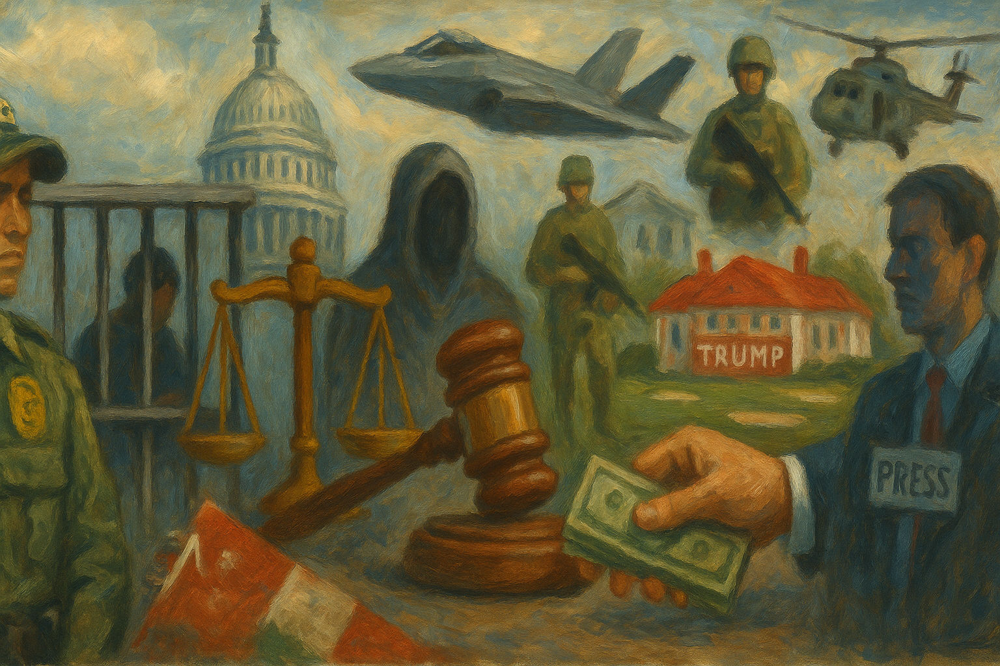

<!-- Generated by build_publish_week_v1 (appendix post) -->
<!-- Header image: image_wide_week17_appendix.png -->

# Week 17 Appendix: Citizenship as Leverage

*A week of near-static clock time in which law, borders, and money were quietly retooled to sort belonging and shield power from consequence.*

This was an exceptionally heavy week of authoritarian pressure across multiple pillars of U.S. democracy. The most acute threats cluster around rule of law, immigration, and foreign influence. The administration openly toys with suspending habeas corpus and due process for migrants, weaponizes the Alien Enemies Act, and directs DOJ to "name and shame" political opponents while preparing investigations of prosecutors who charged Trump. Immigration enforcement is fused with political repression: ICE misleads courts to raid student activists, DHS floats classifying migrants as an "invasion," and National Guard deployment for immigration is explored. Simultaneously, a dense web of foreign money and arms deals—Qatar’s $400m jet, a $5.5bn Trump-branded golf project, massive Saudi and Qatari arms packages, and sanctions relief for Syria tied to Trump-branded real estate—pushes emoluments and crony capitalism to the foreground. Civil society and media are squeezed through mass firings at Voice of America, exclusion of reporters from Air Force One, campus crackdowns, and new tools to strip nonprofits’ tax status. Courts and some states push back on deportations, health cuts, and grant retaliation, but the net structural pressure is strongly negative.

Power and Authority

1. White House deputy chief of staff Stephen Miller suggested suspending the writ of habeas corpus (2025-05-10): A senior White House official floated suspending habeas corpus, signaling willingness to curtail core constitutional protections against arbitrary detention in the name of security.

2. President Donald Trump planned to accept a $400 million luxury jet from the Qatari royal family for use as Air Force One and later his library (2025-05-11): Trump’s plan to accept a $400m jet from Qatar for presidential and later personal use blurred the line between public office and private enrichment, raising serious emoluments and foreign influence concerns.

3. President Donald Trump rarely attended in-person daily intelligence briefings during his second term (2025-05-10): Trump’s minimal participation in intelligence briefings reduced informed oversight of security agencies and weakened accountable decision-making on national security threats.

4. President Donald Trump implemented sweeping cuts to the federal government and pursued deportations sometimes in defiance of court orders (2025-05-12): Trump’s deep federal cuts combined with deportations that at times ignored court rulings strained state capacity and signaled disregard for judicial constraints on executive power.

5. President Donald Trump ended a 31-day bombing campaign against the Houthis in Yemen and declared victory (2025-05-13): Halting the Yemen bombing campaign after limited success highlighted unilateral executive control over overseas military force with little public debate or congressional constraint.

6. President Donald Trump and Health Secretary Robert F. Kennedy Jr. announced an administration plan and executive order to tie U.S. drug prices to lower foreign prices (2025-05-12): The administration used executive authority to reshape drug pricing, asserting strong centralized control over a major economic and public health domain normally shared with Congress and regulators.

7. President Donald Trump shut down the CBP One app used by migrants to schedule asylum appointments (2025-05-13): Closing the CBP One app removed a key lawful channel for asylum processing, concentrating discretionary power at the border and increasing migrants’ exposure to arbitrary enforcement.

8. President Donald Trump lifted nearly 50-year-old U.S. sanctions on Syria following Gulf consultations (2025-05-13): Ending long-standing Syria sanctions in a context of prospective Trump-branded real estate deals raised concerns that personal business interests were steering coercive foreign policy tools.

9. President Donald Trump promised Saudi Arabia $142 billion in advanced U.S. defense and security equipment (2025-05-13): Trump’s commitment to a massive Saudi arms package deepened security dependence on an authoritarian partner and tied U.S. defense policy to lucrative weapons exports.

10. President Donald Trump publicly questioned whether people in the U.S. have a right to due process (2025-05-16): Trump’s televised doubt about the constitutional right to due process undermined public understanding of a core safeguard against arbitrary state power.

11. Department of Justice weaponization working group head Ed Martin announced a policy to publicly name and shame political opponents who cannot be charged (2025-05-15): DOJ’s new practice of publicly stigmatizing uncharged political targets repurposed prosecutorial authority into a tool of reputational punishment outside normal legal process.

12. Director of National Intelligence Tulsi Gabbard fired the National Intelligence Council chair and deputy after a report contradicted Trump’s claims on Venezuela (2025-05-15): Removing top intelligence analysts for producing findings at odds with presidential narratives signaled political control over intelligence and discouraged independent threat assessment.

Institutions and Governance

1. California Fish and Game Commission began a mandatory review of Channel Islands marine protected areas (2025-05-10): The commission’s review of marine protections illustrated routine regulatory governance balancing ecological stewardship with economic interests through a structured public process.

2. Representatives Dina Titus and Ilhan Omar introduced the Evidence-Based Drug Policy Act of 2025 to ease research limits on Schedule I substances (2025-05-10): The bill sought to remove statutory barriers to studying Schedule I drugs, strengthening evidence-based policymaking over ideologically driven restrictions.

3. House Judiciary Committee Republicans summoned former special counsel prosecutor Jay Bratt to testify about Trump prosecutions (2025-05-10): Calling a former special counsel prosecutor to defend charging decisions signaled partisan pressure on prosecutorial independence and ongoing efforts to reframe accountability as persecution.

4. FBI Director Kash Patel appeared at a Senate budget hearing without a required 2025 spending plan (2025-05-10): The FBI director’s failure to provide a timely budget plan hindered congressional oversight of a key law enforcement agency’s priorities and resource use.

5. Senator Chris Murphy criticized Homeland Security for reckless spending that risked Anti-Deficiency Act violations (2025-05-10): Murphy’s warning that DHS spending could breach fiscal law highlighted tensions between aggressive enforcement agendas and statutory budget constraints.

6. President Donald Trump nominated Casey Means, an unlicensed physician with anti-vaccine views, as surgeon general (2025-05-10): Selecting an unlicensed, anti-vaccine figure for surgeon general prioritized ideological loyalty over expertise in a role central to public health guidance.

7. President Donald Trump withdrew Ed Martin’s nomination as U.S. attorney and reassigned him to powerful DOJ roles while nominating Jeanine Pirro (2025-05-10): After opposition to a partisan U.S. attorney nominee, Trump placed him in influential non-confirmed DOJ posts and tapped a loyal media ally for the job, sidestepping Senate scrutiny.

8. House Energy and Commerce Committee Republicans proposed $880 billion in Medicaid cuts to help fund extension of 2017 tax cuts (2025-05-12): The committee’s plan to slash Medicaid for millions to finance tax cuts for higher earners reflected legislative priorities favoring fiscal relief for the wealthy over health coverage for low-income residents.

9. House Armed Services Committee members from both parties advanced a $150 billion increase in military spending as part of reconciliation (2025-05-12): Bipartisan support for a large defense hike within reconciliation underscored how security budgets can expand with limited scrutiny even as social programs face cuts.

10. Federal courts approved multiple large patent-review-period determinations for drugs and biologics (2025-05-12): FDA determinations on regulatory review periods for numerous drugs set the stage for extended patents, reinforcing the legal framework that grants pharmaceutical firms long market exclusivity.

11. House Ways and Means Committee Republicans drafted a reconciliation bill to extend Trump tax cuts while cutting social and climate programs (2025-05-14): The reconciliation draft paired permanent tax relief for higher earners with deep reductions to Medicaid, SNAP, and climate incentives, entrenching a fiscal structure that favors capital over social protection.

12. House Republicans proposed a tax bill altering the child tax credit and excluding many low-income and undocumented families (2025-05-14): By conditioning full child tax credits on higher earnings and Social Security numbers, the bill would deny benefits to millions of poor and mixed-status families, embedding status-based inequality into the tax code.

13. Republican lawmakers sought authority to revoke tax-exempt status of nonprofits deemed terrorist-supporting in a major tax bill (2025-05-14): A proposed power to strip nonprofits’ tax status based on broad terrorism labels risked enabling partisan punishment of civil society groups critical of the government.

14. Health and Human Services Secretary Robert F. Kennedy Jr. testified in Congress defending deep health budget cuts and faced questions on vaccines (2025-05-14): Kennedy’s defense of large health cuts and evasiveness on vaccines highlighted how partisan budget priorities and skepticism of science can reshape federal health institutions.

15. House Republicans from New York formed a bloc to demand higher SALT deductions in exchange for supporting the budget bill (2025-05-14): A small GOP faction leveraged the narrow House majority to seek tax relief for high-tax-state constituents, illustrating intra-party bargaining that can reshape national fiscal legislation.

16. House Budget Committee rejected a major reconciliation bill backed by Trump and GOP leadership (2025-05-15): The committee’s rejection of Trump’s flagship spending bill exposed internal Republican divisions that temporarily slowed enactment of sweeping fiscal and immigration changes.

17. Senate Democratic leader Chuck Schumer placed a hold on Justice Department nominations over the Qatar jet gift (2025-05-13): Schumer’s blanket hold on DOJ nominees used Senate confirmation powers to demand transparency and constitutional justification for the Qatar aircraft arrangement.

18. Republican senators remained silent after Stephen Miller’s suggestion of suspending habeas corpus (2025-05-13): GOP senators’ refusal to repudiate talk of suspending habeas corpus signaled weakening legislative resistance to extreme expansions of executive detention power.

19. Twenty Democratic-led states sued to block federal cuts to grants for jurisdictions limiting immigration cooperation (2025-05-13): States turned to the courts to resist federal attempts to coerce local immigration policy through grant cuts, asserting federalism limits on executive punishment of disfavored jurisdictions.

20. Federal grand jury indicted Wisconsin Judge Hannah Dugan for allegedly obstructing an ICE arrest (2025-05-13): Indicting a sitting state judge over courtroom handling of an immigration case raised alarms that federal prosecutors were using criminal charges to intimidate the judiciary.

21. Judge Hannah Dugan moved to dismiss her indictment on constitutional and judicial immunity grounds (2025-05-15): Dugan’s motion argued that prosecuting her for courtroom decisions violated judicial independence, forcing courts to confront limits on executive power over judges.

22. Conservative judge J. Michael Luttig publicly warned that Trump was weaponizing the federal government and undermining the rule of law (2025-05-15): A prominent conservative jurist’s critique of Trump’s use of state power lent cross-partisan credibility to concerns about erosion of legal constraints on the executive.

23. U.S. Supreme Court heard consolidated challenges to Trump’s executive order restricting birthright citizenship (2025-05-15): The Court’s review of an order limiting citizenship for U.S.-born children of noncitizens put the constitutional scope of the 14th Amendment and presidential power over membership on the line.

24. U.S. Supreme Court blocked the Trump administration’s attempt to deport alleged gang members without due process under the Alien Enemies Act (2025-05-16): By requiring meaningful notice and legal challenge opportunities before deportation, the Court reaffirmed due process limits on emergency-style immigration removals.

25. Federal judge in South Dakota granted a preliminary injunction preventing deportation of Indian PhD graduate Priya Saxena (2025-05-16): The injunction shielding a student from deportation over a minor traffic offense showed courts acting as a check on overbroad immigration enforcement.

26. Federal courts ordered the release of several international students detained for pro-Palestinian activism (2025-05-14): Judges in multiple cases freed foreign students held over political speech, signaling judicial resistance to using immigration law as a tool to suppress campus dissent.

27. Federal judge rejected an injunction to stop IRS sharing immigrants’ tax records with ICE (2025-05-12): Allowing IRS-ICE data sharing to continue expanded the state’s ability to repurpose confidential tax information for immigration enforcement, weakening privacy protections.

28. Judge Aileen Cannon dismissed the Mar-a-Lago classified documents case by ruling the special counsel unlawfully appointed (2025-05-14): Throwing out the documents case on novel appointment grounds shielded Trump from trial and raised concerns that judicial doctrine was being stretched to favor a former president.

29. Appeals court allowed CREW to investigate Elon Musk’s Department of Government Efficiency (2025-05-14): The ruling permitting watchdog scrutiny of a new government efficiency department supported transparency and external oversight of novel executive structures.

30. Federal judge temporarily blocked the administration from canceling ABA grants for domestic and sexual violence training (2025-05-14): By halting grant cancellations seen as retaliation, the court protected funding for legal services and signaled limits on punishing organizations for their advocacy.

31. U.S. Department of Justice civil rights division leadership asked departing civil rights attorneys to stay or return amid mass exits and reassignments (2025-05-14): DOJ’s scramble to retain civil rights lawyers after politicized reshuffling revealed internal strain that could weaken enforcement of anti-discrimination laws.

32. Trump administration fired Shira Perlmutter, head of the U.S. Copyright Office, after an AI report (2025-05-12): Removing the copyright chief soon after she issued a cautious AI report suggested political interference in a technical office expected to provide independent legal analysis.

33. House Appropriations subcommittee witnesses requested increased funding for judges’ security amid rising threats (2025-05-15): Judicial leaders’ plea for more security funding underscored how escalating threats can endanger judges and, by extension, the independence of the courts.

34. House Homeland Security Committee held a hearing where DHS Secretary Kristi Noem refused to answer questions on deportations of U.S. citizens (2025-05-15): Noem’s stonewalling on wrongful deportations limited congressional oversight of DHS and obscured potential abuses in citizenship determinations.

35. Federal Election Assistance Commission sought public comment on voting system testing and financial reporting information collections (2025-05-16): EAC’s moves to refine data collection on voting systems and grant spending aimed to strengthen technical integrity and transparency in election administration.

36. Federal Election Commission announced a closed Sunshine Act meeting on personnel and civil matters (2025-05-15): The FEC’s notice of a closed meeting under Sunshine Act exceptions reflected routine governance of sensitive enforcement and personnel issues within election oversight.

37. Harvard Law School confirmed that a long-overlooked document is an original 1300 Magna Carta (2025-05-16): Identifying an original Magna Carta in a U.S. archive highlighted enduring legal roots of rule-of-law and due process principles that underpin modern democratic institutions.

Economic Structure

1. House Republicans proposed changes to the federal retirement system to cut long-term costs (2025-05-10): Plans to raise contributions and alter pensions for federal workers shifted fiscal burdens onto public servants, potentially weakening the attractiveness and independence of the civil service.

2. Columbia University and NewYork-Presbyterian Hospital agreed to a $750 million settlement with victims of gynecologist Robert Hadden (2025-05-10): The large settlement and new safety policies represented institutional accountability for long-ignored abuse, showing civil litigation’s role in checking powerful organizations.

3. Trump administration considered tariff exemptions for childcare and baby products after steep China tariffs (2025-05-10): Contemplating carve-outs for baby goods after broad tariff hikes illustrated ad hoc trade policymaking that can create uncertainty for consumers and businesses.

4. President Donald Trump announced a 100% tariff on all foreign-produced movies (2025-05-10): Imposing a blanket tariff on foreign films politicized cultural trade and risked retaliatory measures, with potential chilling effects on cross-border cultural exchange.

5. Trump Organization and foreign partners advanced 20 new Trump-branded real estate projects in nine countries during Trump’s presidency (2025-05-10): The rapid expansion of Trump-branded projects abroad while he held office deepened conflicts between private profit-seeking and impartial foreign policy.

6. U.S. Department of Energy announced elimination of 47 energy efficiency regulations for appliances (2025-05-12): Rolling back appliance efficiency standards favored short-term industry savings over long-term consumer costs and environmental benefits, reflecting deregulatory capture.

7. President Donald Trump issued an executive order temporarily reducing tariffs on Chinese imports to 10–30% as part of trade talks (2025-05-12): Trump’s order to pause and lower China tariffs after earlier steep hikes exemplified volatile trade policy that unsettles markets and supply chains.

8. Food and Drug Administration expanded approvals for several natural color additives in foods (2025-05-12): FDA’s approvals of new food color additives reflected routine risk-based regulation that shapes manufacturing practices and consumer safety standards.

9. Federal procurement agencies issued Federal Acquisition Circular 2025-04 revising Buy American rules and technical FAR provisions (2025-05-12): Updates to procurement rules and the list of domestically nonavailable articles adjusted how federal spending supports domestic industry and small businesses.

10. SpaceX and the U.S. Department of Defense secured a $6 billion Pentagon contract and emerged as frontrunner for the Golden Dome missile shield (2025-05-12): The huge defense contract for SpaceX, amid concerns about weakened oversight, highlighted growing reliance on a politically connected private firm for core security infrastructure.

11. President Donald Trump proposed a $1.01 trillion military budget with deep cuts to non-defense discretionary spending (2025-05-12): Trump’s budget shifted federal priorities toward the military while slashing education, environment, and health, reinforcing a fiscal order that privileges defense and elites over social goods.

12. Environmental Protection Agency delayed PFAS reporting deadlines to 2026–2027 (2025-05-13): Extending PFAS reporting timelines gave industry more time to comply but also postponed data needed for regulating harmful chemicals affecting public health.

13. Trump administration cut an additional $450 million in federal grants to Harvard University (2025-05-13): Large grant cuts to Harvard, which responded with a First Amendment lawsuit, suggested federal funding was being used to pressure an academic critic of administration policies.

14. Trump administration and Qatar approved a $2 billion U.S. arms sale to Qatar including advanced drones and munitions (2025-05-13): The major arms sale to Qatar, alongside personal Trump business ties there, intertwined U.S. export policy with a partner linked to controversial groups and potential conflicts of interest.

15. Trump administration and Qatar signed a defense and aviation package including up to 210 Boeing jets and large defense investments (2025-05-14): The $243 billion U.S.-Qatar package deepened economic and defense interdependence while the parallel Qatar jet gift raised questions about whether state deals were sweetened by personal benefits.

16. House Republicans and President Donald Trump backed a reconciliation bill allowing revocation of nonprofit tax-exempt status for alleged terrorist support (2025-05-15): Empowering Treasury to strip nonprofits’ tax status on vague terrorism grounds threatened to chill advocacy and concentrate economic leverage over civil society in the executive branch.

17. President Donald Trump nominated David Keeling, a critic of heat protections, to lead OSHA (2025-05-15): Choosing an OSHA chief expected to weaken heat safety rules signaled regulatory leadership aligned with employer interests over worker protections in a warming climate.

18. Moody’s Rating Service downgraded the U.S. sovereign credit rating for the first time since 1917 (2025-05-15): The downgrade, citing widening deficits and weak revenues, increased borrowing costs and signaled market concern about the sustainability of current fiscal and tax policies.

19. Environmental Protection Agency announced a joint OTC–MANEVU meeting and proposed CERCLA settlements for the Mohawk Tannery site (2025-05-16): EPA’s regional air-quality meeting and Superfund settlements showed ongoing, if contested, use of federal tools to manage pollution and remediation responsibilities.

20. Environmental Protection Agency exempted l-arginine used in certain greenhouse pesticides from tolerance requirements (2025-05-14): The pesticide tolerance exemption modestly reduced regulatory burdens for growers while relying on EPA’s safety assessment to protect consumers and workers.

21. Drug Enforcement Administration processed multiple applications for controlled substance importation for research and distribution (2025-05-14): DEA’s handling of controlled-substance import applications balanced research and veterinary needs with diversion controls, illustrating routine but powerful gatekeeping over drug markets.

22. Food and Drug Administration requested information on revising infant formula nutrient requirements (2025-05-14): FDA’s review of infant formula standards opened the door to updated nutritional rules that could affect both child health and industry costs.

23. Jared Kushner’s development firm and Serbian authorities saw a $500 million Trump International Hotel project in Belgrade halted after a forged demolition document was exposed (2025-05-14): The halt of a major Trump-branded project over forged approvals highlighted governance and corruption risks when politically connected developers pursue foreign deals.

24. President Donald Trump repeatedly raised and then reduced tariffs on Chinese goods, including a spike to 145% (2025-05-14): Frequent, dramatic tariff shifts on China created trade uncertainty, raised consumer prices, and showcased the executive’s unilateral sway over global supply chains.

25. Popular business and political elites attended a Saudi lunch and investment forum with Trump and MBS despite prior Khashoggi concerns (2025-05-14): Top U.S. executives’ renewed engagement with Saudi leadership signaled that lucrative deals can outweigh human rights concerns in shaping corporate and diplomatic behavior.

26. Department of Government Efficiency cut staffing at Newark airport, contributing to a severe air traffic controller shortage (2025-05-15): Aggressive staffing cuts that left Newark with a fraction of needed controllers showed how austerity-driven reforms can compromise critical infrastructure and public safety.

Civil Rights and Dissent

1. Federal judge in Vermont ordered the release of Turkish student Rümeysa Öztürk from immigration detention (2025-05-10): The court found insufficient grounds for Öztürk’s detention, reinforcing due process protections for immigrants targeted over political speech.

2. Newark Mayor Ras Baraka and Homeland Security agents clashed when Baraka was arrested while protesting outside an ICE detention facility (2025-05-10): Arresting a sitting mayor at a peaceful protest against a private detention operator signaled federal readiness to criminalize local dissent over immigration policy.

3. Department of Homeland Security spokesperson threatened possible arrests of Democratic members of Congress for oversight visits to an ICE facility (2025-05-10): DHS’s threat to arrest lawmakers conducting oversight blurred lines between law enforcement and partisan intimidation, chilling legislative scrutiny of detention conditions.

4. Tennessee Highway Patrol and ICE conducted traffic-stop sweeps that led to 103 people being turned over to immigration authorities (2025-05-10): The large-scale transfer of motorists to ICE after targeted stops raised concerns about racial profiling and the use of routine policing to feed immigration crackdowns.

5. New York City police and Columbia University arrested student protesters and briefly suspended student journalists covering Gaza protests (2025-05-10): Arrests of campus protesters and suspensions of student reporters highlighted tensions between university order, free expression, and press freedom in political protests.

6. Pentagon leadership ordered military academies to disregard race, ethnicity, and sex in admissions while allowing athletic preferences (2025-05-10): The directive to strip DEI considerations from academy admissions, while preserving athletic exceptions, threatened to reduce diversity in officer pipelines and reshape military representation.

7. Pentagon and Department of Defense Education Activity ordered removal of DEI and gender ideology books from military and base school libraries worldwide (2025-05-10): Purging hundreds of books on diversity and gender from military-linked libraries narrowed the information environment for service members and families, curbing exposure to equality-focused ideas.

8. Trump administration ended Temporary Protected Status for Afghan nationals in the U.S. (2025-05-12): Terminating TPS for Afghans under Taliban rule exposed thousands to possible return to unsafe conditions, reflecting a hard line on humanitarian protection.

9. Trump administration offered refugee status to a group of white South Africans despite a general suspension of refugee resettlement (2025-05-11): Granting an exception for white South Africans while broader refugee programs were frozen suggested racially selective application of humanitarian protections.

10. House Energy and Commerce Committee and Capitol Police saw disability rights activists protesting Medicaid cuts arrested inside the Capitol (2025-05-14): Arresting disabled protesters opposing Medicaid cuts inside Congress underscored how security rules can be used to suppress visible dissent over life-sustaining programs.

11. South Carolina Supreme Court upheld a six-week abortion ban against a challenge by Planned Parenthood (2025-05-14): The unanimous ruling cemented one of the nation’s earliest abortion cutoffs, sharply restricting reproductive autonomy and reinforcing a regional patchwork of rights.

12. Hasan Piker and U.S. Customs and Border Protection were involved in a secondary inspection where Piker was questioned about his political views (2025-05-12): Border agents’ questioning of a U.S. commentator about his opinions on Trump and Gaza suggested use of entry controls to intimidate critics and chill speech.

13. Trump administration ordered the FBI to shift one-third of its resources from white-collar crime to immigration enforcement (2025-05-12): Redirecting FBI effort away from financial crimes toward immigration crackdowns prioritized policing vulnerable migrants over investigating elite wrongdoing.

14. Ben Cohen and U.S. Capitol Police clashed when Cohen was arrested for protesting Gaza blockade and Medicaid cuts during a Senate hearing (2025-05-15): The arrest of a prominent business figure for a peaceful disruption at a hearing highlighted limits on protest inside Congress and the risks activists face when linking foreign policy and domestic welfare.

15. Trump administration fired nearly 600 Voice of America contractors, many foreign journalists, despite a court order (2025-05-16): Mass firings at VOA gutted an independent U.S.-funded news outlet and left many journalists facing deportation, weakening both press freedom and protection for critics of authoritarian regimes.

16. State Department directed universities to report international students and scholars involved in certain protests deemed antisemitic or terrorist-related (2025-05-16): Requiring universities to flag foreign students engaged in contentious protests turned immigration status into leverage against campus speech and academic freedom.

17. Trump administration issued executive orders allowing deportation or exclusion of non-citizens based on political and cultural viewpoints, including broad definitions of antisemitism (2025-05-15): New orders enabling immigration penalties for disfavored viewpoints weaponized entry and deportation powers against ideological expression, especially criticism of Israeli policy.

18. Homeland Security Secretary Kristi Noem suggested migrants could be deemed a rebellion or invasion to justify suspending habeas corpus (2025-05-14): Framing migrant flows as an invasion to suspend habeas corpus signaled intent to strip basic court access from a targeted population under emergency rhetoric.

19. Trump administration sought to deport Venezuelan migrants accused of gang affiliation under the Alien Enemies Act (2025-05-13): Using an 18th-century wartime statute to fast-track deportations of Venezuelans stretched emergency powers into immigration enforcement, raising due process and discrimination concerns.

20. Trump administration conducted ICE raids in Nashville that triggered an exodus of restaurant workers (2025-05-15): High-profile ICE raids that emptied local workplaces illustrated how aggressive enforcement can destabilize communities and deter immigrants from participating in public life.

21. ICE agents obtained a search warrant under allegedly false pretenses to target Columbia students for pro-Palestinian activism (2025-05-16): ICE’s use of a misleading warrant to access student housing for arrests showed law enforcement tools being bent to suppress political activism under the guise of immigration enforcement.

22. U.S. Secret Service and DHS investigated former FBI Director James Comey over an Instagram post interpreted as a threat to Trump (2025-05-16): Launching a threat investigation over ambiguous social media imagery by a Trump critic risked turning protective services into instruments for policing political expression.

23. Bruce Springsteen used a concert to denounce attacks on democratic principles and due process in the U.S. (2025-05-16): Springsteen’s public criticism of deportations without due process and ideological pressure on institutions exemplified cultural figures mobilizing speech to defend democratic norms.

24. Omaha voters elected Democrat John Ewing as the city’s first Black mayor over a Trump-aligned incumbent (2025-05-15): Omaha’s election of its first Black mayor signaled local electoral pushback against Trumpism and modestly broadened representation in municipal leadership.

Information, Memory and Manipulation

1. White House communications office launched a government-run news website called White House Wire (2025-05-10): Creating a presidential news outlet allowed the administration to bypass independent media and push unfiltered narratives under official branding.

2. White House posted AI-generated imagery and videos of deportation flights to promote its agenda (2025-05-10): Using AI visuals and curated deportation footage for political messaging blurred lines between documentation and propaganda, shaping public perception of immigration policy.

3. Meidas and Zeteo sources describing White House travel practices reported that wire service reporters were excluded from Air Force One for Trump’s Middle East trip (2025-05-12): Barring wire reporters from Air Force One limited independent coverage of presidential diplomacy and signaled a preference for controlled media access.

4. Trump administration fired nearly 600 Voice of America contractors despite a court order to maintain strong news operations (2025-05-16): The mass VOA firings weakened a key independent news outlet and suggested disregard for judicial directives protecting journalistic capacity.

5. State Department and DHS considered a reality TV show where immigrants would compete for U.S. citizenship (2025-05-15): Entertaining a citizenship competition show trivialized naturalization and risked turning life-altering legal status into spectacle for political branding.

6. State Department directed universities to report foreign students involved in certain protests as potential security concerns (2025-05-16): Linking campus protest participation to security reporting obligations pressured universities to monitor and potentially discipline political expression by international students.

7. Trump administration and Pentagon ordered removal of DEI and gender-related books from military and base school libraries (2025-05-10): The book purge curated which histories and identities are visible in military education, erasing perspectives on equity and inclusion from official memory spaces.

8. Trump administration fired the head of the U.S. Copyright Office after she issued a cautious AI report (2025-05-12): Removing a key knowledge official following an unwelcome AI analysis signaled that expert assessments of emerging technologies would be shaped by political preferences.

9. FAA Chief Operating Officer Tim Arel refused in a congressional hearing to disclose how many air traffic controllers had quit or been fired (2025-05-14): Withholding basic staffing data from Congress limited public insight into aviation safety risks and undermined transparent oversight of a critical agency.

10. Noahpinion and other commentators reported allegations that a $400 million Qatari jet gift to Trump reflected corruption and foreign influence (2025-05-14): Public reporting on the Qatar jet allegations highlighted the role of independent analysis in surfacing potential corruption when official justifications remain opaque.

11. U.S. Environmental Protection Agency published a notice of availability for multiple Environmental Impact Statements (2025-05-16): Making EIS documents publicly available supported informed participation in environmental decisions and maintained transparency in major project reviews.

12. U.S. intelligence community released an assessment concluding that Saudi Crown Prince Mohammed bin Salman approved Jamal Khashoggi’s killing (2025-05-14): The assessment formally attributing Khashoggi’s murder to MBS underscored tensions between documented human rights abuses and ongoing U.S.-Saudi cooperation.

13. President Donald Trump and allies claimed credit for an India-Pakistan ceasefire that was negotiated without U.S. involvement (2025-05-10): Trump’s false assertion of brokering a South Asian ceasefire illustrated the use of misleading foreign policy narratives to bolster his image.

14. Department of Homeland Security and FBI investigated James Comey over an Instagram post interpreted as an assassination threat (2025-05-15): Treating ambiguous imagery as a potential threat from a prominent critic risked conflating dissent with violence and could deter outspoken commentary.

15. Department of Homeland Security confirmed use of a hacked TeleMessage app for internal communications (2025-05-10): CBP’s reliance on a compromised messaging app exposed sensitive enforcement communications to potential interception, undermining secure and accountable record-keeping.

