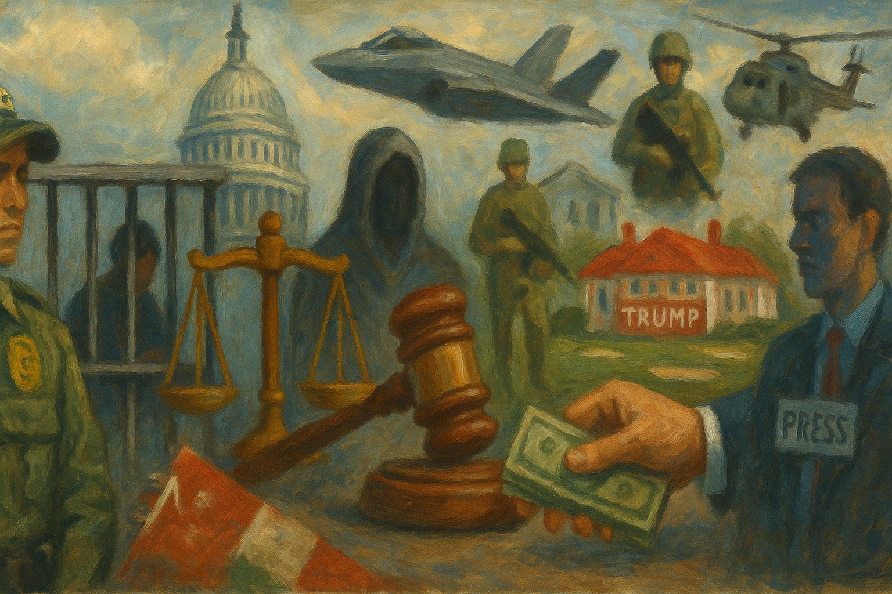

<!-- Generated by build_publish_week_v1 (appendix post) -->
<!-- Header image: image_wide_week17_appendix.png -->

# Week 17 Appendix: Stillness That Masks Motion

*Courts brake executive overreach while foreign self-dealing, retaliation, and information control advance largely unchecked beneath a flat clock reading.*

This was a high-pressure week for democratic structure, defined less by a single rupture than by the convergence of several authoritarian methods: open contempt for due process, politicized law enforcement, foreign-linked corruption, and information control. The most consequential pattern was the administration’s repeated effort to treat legal restraints as optional—through talk of suspending habeas corpus, aggressive deportation theories, viewpoint-based immigration enforcement, and retaliatory investigations of prosecutors, judges, and political opponents. At the same time, the proposed acceptance of a $400 million Qatari jet, paired with Trump business expansion in the Gulf and major defense deals, sharply intensified corruption and foreign-influence concerns. A third theme was institutional hollowing: loyalty-based appointments, retaliatory firings, civil-service destabilization, and attacks on independent media, especially Voice of America. Courts provided meaningful resistance in several immigration and due-process cases, but those rulings mostly functioned as defensive brakes against executive overreach rather than affirmative institutional recovery. Overall, the week showed a presidency pressing simultaneously on legality, accountability, and the information environment.

Power and Authority

1. Stephen Miller said the administration was considering suspending habeas corpus (2025-05-10): The statement tested a core limit on detention power and signaled willingness to bypass basic judicial protections.

2. President Trump planned to accept a luxury Boeing 747-8 from Qatar for presidential use and later transfer (2025-05-13): The planned acceptance of a major foreign gift raised conflict-of-interest and constitutional concerns about foreign influence over the presidency.

3. President Trump attended few daily intelligence briefings (2025-05-10) *[single source]*: Reduced engagement with intelligence briefings raised accountability concerns about executive preparedness in national security decision-making.

4. President Trump directed the Bureau of Prisons to reopen and enlarge Alcatraz (2025-05-10): The directive signaled a punitive use of executive power in criminal justice and expanded the politics of spectacle around incarceration.

5. President Trump threatened to rescind the Digital Equity Act (2025-05-10) *[single source]*: The threat put executive pressure on a law aimed at widening access to digital infrastructure for low-income communities.

6. President Trump signed an executive order to pursue most-favored-nation prescription drug pricing (2025-05-12): The order used unilateral executive power to reshape drug pricing policy, raising separation-of-powers and implementation questions.

7. President Trump issued an executive order modifying tariff rates with China (2025-05-12): The order changed trade policy by executive action, affecting economic planning and concentrating major tariff decisions in the presidency.

8. The Trump administration implemented broad cuts to the federal government (2025-05-12) *[single source]*: The cuts reduced state capacity and tested whether the executive could shrink federal functions without normal legislative process.

9. President Trump announced he was lifting sanctions on Syria (2025-05-12): The move showed foreign policy being made through personal executive discretion with major regional and accountability consequences.

10. The Trump administration kept the CBP One migrant appointment app shut down (2025-05-13): Closing a legal entry channel narrowed access to asylum processing and shifted more immigration control into executive discretion.

11. The Trump administration considered a $5,000 baby bonus to encourage childbirth (2025-05-13) *[single source]*: The proposal showed the executive branch using policy incentives to shape private family decisions without broader structural support.

12. The Trump administration proposed eliminating Head Start in an internal memo before backing away (2025-05-13) *[single source]*: The proposal showed executive willingness to target a major early-childhood program that supports low-income families.

13. President Trump signed an executive order aimed at dismantling the Department of Education (2025-05-13): The order tested whether the executive could weaken a cabinet department without Congress, shifting power away from normal lawmaking.

14. Robert F. Kennedy Jr. reinstated parts of NIOSH and the World Trade Center Health Program (2025-05-14) *[single source]*: The selective reinstatement showed executive control over public-health capacity and raised questions about politically driven restoration of services.

15. Robert F. Kennedy Jr. ordered the FDA to review mifepristone regulations (2025-05-14): The order put reproductive access at risk by reopening federal restrictions through executive control of health regulation.

16. The Trump administration relied on executive orders that allowed scrutiny of non-citizens based on viewpoints (2025-05-15) *[single source]*: The orders expanded executive power to police speech and immigration status together, raising due process and free-expression concerns.

17. The Department of Justice announced a policy to publicly identify political opponents it could not charge (2025-05-15) *[single source]*: The policy blurred law enforcement and political punishment by using public accusation without criminal process.

18. President Trump questioned whether people in the United States have a right to due process (2025-05-16): The remarks challenged a basic constitutional safeguard and signaled executive hostility to legal limits on state power.

Institutions and Governance

1. The California Fish and Game Commission reviewed proposals to change marine protected areas around the Channel Islands (2025-05-10) *[single source]*: The review showed routine state governance over public resources through formal regulatory process and stakeholder petitions.

2. Representatives Dina Titus and Ilhan Omar introduced the Evidence-Based Drug Policy Act of 2025 (2025-05-10) *[single source]*: The bill sought to shift drug policy through legislation rather than executive fiat, reinforcing Congress's policymaking role.

3. The House Judiciary Committee summoned former prosecutor Jay Bratt for testimony on Trump prosecutions (2025-05-10): The move tested the line between legislative oversight and political pressure on prosecutorial independence.

4. FBI Director Kash Patel appeared at a Senate budget hearing without the FBI spending plan (2025-05-10): The missing plan weakened congressional oversight of a major federal agency's budget and management.

5. Senator Chris Murphy criticized Homeland Security spending and warned of possible Anti-Deficiency Act problems (2025-05-10) *[single source]*: The warning highlighted congressional oversight of whether executive agencies were spending lawfully and setting defensible priorities.

6. House Republicans proposed changes to the federal retirement system (2025-05-10) *[single source]*: The proposal used the legislative process to reshape federal employment terms and the long-term structure of public service.

7. President Trump nominated Casey Means for surgeon general (2025-05-10): The nomination raised questions about merit standards and the use of appointments to place loyalists in key public offices.

8. President Trump withdrew Ed Martin's nomination and nominated Jeanine Pirro as U.S. attorney for Washington (2025-05-10): The switch highlighted political control over justice appointments and the use of non-confirmed roles to keep allies in power.

9. The Trump administration fired FEMA's acting administrator after his testimony (2025-05-10): The firing suggested retaliation against internal dissent and weakened the independence of emergency management leadership.

10. Republican-led Congress advanced a budget reconciliation bill with major cuts to Medicaid and SNAP (2025-05-11): The bill showed Congress using fast-track procedure to make large social-policy changes with limited bipartisan deliberation.

11. The House Armed Services Committee advanced a $150 billion military spending increase with bipartisan support (2025-05-12) *[single source]*: The vote showed congressional budget priorities shifting toward defense through the reconciliation process.

12. The Federal Procurement Policy Office, the Department of Defense, the General Services Administration, NASA, and the Department of Energy issued Federal Acquisition Circular 2025-04 and related procurement rule changes (2025-05-12): The changes updated federal purchasing rules, showing routine administrative governance over contracting standards and domestic sourcing.

13. The Trump administration fired the head of the U.S. Copyright Office after an AI report (2025-05-12): The firing raised concerns that agency leadership could be removed for producing analysis that conflicted with political interests.

14. Chuck Schumer placed a hold on Justice Department nominations over the Qatar jet plan (2025-05-13): The hold used Senate procedure to force executive accountability on a possible constitutional conflict.

15. Republican senators did not publicly reject Stephen Miller's habeas corpus remarks (2025-05-13): The silence showed weak legislative resistance to rhetoric that challenged constitutional limits on detention power.

16. Sean Duffy changed his wife's flight away from Newark while publicly defending the airport (2025-05-14): The episode raised accountability concerns about whether a cabinet official's private conduct matched his public safety assurances.

17. Republican lawmakers proposed changes to the child tax credit that would exclude many low-income and mixed-status families (2025-05-14) *[single source]*: The proposal showed Congress using tax law to shape eligibility in ways that affect representation, fairness, and state support.

18. Republican lawmakers proposed allowing the government to revoke nonprofits' tax-exempt status as terrorist-supporting (2025-05-14) *[single source]*: The provision would give the state a broad tool to pressure civil society groups through tax status rather than criminal process.

19. Robert F. Kennedy Jr. testified before Congress on health cuts, layoffs, and vaccine issues (2025-05-14): The hearings tested whether Congress could extract accountability for major changes to public-health administration.

20. House Republicans from New York formed a bloc to demand a higher SALT deduction cap (2025-05-14) *[single source]*: The bloc showed how a narrow majority can give small factions leverage over major budget legislation.

21. The Department of Justice asked civil rights attorneys to stay after mass departures (2025-05-14): The request exposed institutional strain inside a core enforcement division and raised concerns about politicized attrition.

22. President Trump nominated David Keeling to lead OSHA (2025-05-15) *[single source]*: The nomination mattered because leadership choices at OSHA shape how workplace protections are enforced or weakened.

23. The DNC chair and a DNC subcommittee pressed for neutrality in primaries and recommended invalidating the vice-chair election (2025-05-16): The dispute showed internal party governance being contested through procedural rules and leadership authority.

24. House Republicans and Democrats on the Budget Committee blocked Trump's spending bill in committee (2025-05-16): The failed vote showed institutional checks within Congress and deep party divisions over spending and cuts.

25. The Federal Election Commission noticed a closed Sunshine Act meeting (2025-05-15): The notice reflected formal transparency rules that govern when election regulators may meet outside public view.

26. The Federal Aviation Administration chief operating officer refused to disclose air traffic controller staffing losses at a hearing (2025-05-14) *[single source]*: The refusal limited congressional oversight of aviation safety staffing and weakened transparency around agency capacity.

27. The Federal Aviation Administration faced reported operational chaos affecting air traffic management (2025-05-14) *[single source]*: The reported dysfunction raised concerns about state capacity in a safety-critical federal agency.

28. Harvard University Law School confirmed that it possessed an original 1300 Magna Carta (2025-05-16): The finding mattered as a public reminder of the historical roots of due process and limits on arbitrary power.

29. Federal courts and litigants filed, answered, amended, stayed, dismissed, or otherwise advanced a large set of active cases challenging administration actions (2025-05-12): The volume of case activity showed courts functioning as a central arena for checking executive action, even when many entries were procedural.

30. Federal courts granted or denied targeted injunctions, stays, and other relief in challenges to administration actions (2025-05-12): These rulings showed courts actively shaping the practical limits of executive action across immigration, labor, records, and agency disputes.

31. The Supreme Court issued procedural orders and opinions in several cases (2025-05-14): The Court's orders and opinions mattered because Supreme Court procedure and precedent set national legal boundaries for state power.

Economic Structure

1. The Trump Organization and foreign partners expanded or pursued Trump-branded projects abroad during Trump's presidency (2025-05-10): The projects blurred public office and private gain by tying foreign permits and business opportunities to a sitting president's brand.

2. The Trump administration canceled funding for the United Nations Population Fund (2025-05-10) *[single source]*: The funding cut used budget power to withdraw support from an international public-health program tied to reproductive care.

3. President Trump proposed a 100% tariff on foreign-produced films (2025-05-10): The proposal used tariff power to intervene in cultural markets and showed trade policy being made through abrupt executive threats.

4. President Trump and U.S. trade officials announced, raised, reduced, paused, and renegotiated tariffs involving China and other goods (2025-05-10): The rapid tariff shifts created policy uncertainty that affected markets, business planning, and the credibility of U.S. economic governance.

5. The Food and Drug Administration approved expanded uses of several food color additives and set multiple drug patent review periods (2025-05-12): These routine regulatory actions shaped market access, patent timing, and the balance between public oversight and private pharmaceutical rights.

6. The Resolution Foundation and researchers Ji and Rogers published analyses on productivity stagnation and the effects of Medicare price cuts on innovation (2025-05-12): The studies informed public debate over how state policy choices shape productivity, innovation, and long-term economic capacity.

7. SpaceX secured a $6 billion Pentagon contract (2025-05-12): The contract highlighted how defense spending can deepen the political and economic power of firms closely tied to governing elites.

8. President Trump proposed a $1.01 trillion military budget (2025-05-12) *[single source]*: The proposal shifted federal priorities toward defense and away from domestic programs, shaping the distribution of public resources.

9. The Environmental Protection Agency delayed the PFAS reporting submission period (2025-05-13): The delay changed the timing of environmental compliance and affected how quickly regulators and the public could access pollution data.

10. President Trump and Qatar moved forward with major defense and aviation deals while the Qatar jet controversy unfolded (2025-05-14): The overlap of state deals and personal benefit concerns deepened questions about whether foreign commercial ties were shaping U.S. policy.

11. The Environmental Protection Agency, the Food and Drug Administration, and the Drug Enforcement Administration issued routine rules, notices, and application actions on pesticides, infant formula, controlled substances, and environmental meetings and settlements (2025-05-14): These actions showed ordinary regulatory governance continuing across health, agriculture, and environmental administration.

12. Business leaders and President Trump met in Saudi Arabia around investment and commercial deals (2025-05-14): The meetings showed how corporate access and foreign state relationships can converge around executive economic diplomacy.

13. House Republicans proposed phasing out green tax credits from the Inflation Reduction Act (2025-05-15): The proposal would redirect federal incentives away from clean energy, affecting energy costs, jobs, and industrial policy.

14. Newark Liberty International Airport and federal staffing authorities faced severe air traffic staffing shortages and delays (2025-05-15) *[single source]*: The staffing crisis showed how cuts to public capacity can produce direct economic and safety harms in core infrastructure.

15. Moody's downgraded the U.S. credit rating (2025-05-15): The downgrade signaled reduced confidence in federal fiscal management and could raise borrowing costs across the economy.

Civil Rights and Dissent

1. A federal judge blocked the deportation of migrants to Libya (2025-05-10): The order checked executive detention and removal power by enforcing legal limits on where migrants could be sent.

2. Federal judges ordered the release of Rümeysa Öztürk from immigration detention (2025-05-10) *[single source]*: The rulings protected due process and speech rights by rejecting detention tied to political expression.

3. Democratic-led states and Washington, D.C. sued the Trump administration over HHS cuts (2025-05-10): The lawsuit sought to preserve public-health services and challenged executive actions that could reduce access to care.

4. A federal judge blocked the deportation of Venezuelan immigrants detained in New York (2025-05-10) *[single source]*: The ruling protected detainees from removal to abusive conditions and reinforced due process in immigration enforcement.

5. ICE agents and DHS officials arrested Newark Mayor Ras Baraka at an immigration facility protest and threatened possible arrests of members of Congress (2025-05-10): The arrest and threats raised concerns that federal enforcement was being used to chill protest and oversight around detention policy.

6. Tennessee Highway Patrol and ICE arrested more than 100 people after traffic stops targeting suspected migrants (2025-05-10): The operation raised concerns about racial profiling and the use of routine policing to intensify immigration enforcement.

7. The Department of Homeland Security offered a $1,000 stipend and travel help for self-deportation (2025-05-10) *[single source]*: The policy used financial pressure to induce departure by undocumented people, raising coercion and rights concerns.

8. A federal judge ordered North Carolina to certify Allison Riggs as the winner of a state supreme court race (2025-05-10): The order protected ballot counting and blocked partisan efforts to overturn an election result after voting ended.

9. Columbia University and police arrested protesters during a library occupation and temporarily suspended student journalists (2025-05-10): The response raised concerns about protest rights and press freedom on campus during political dissent.

10. The FBI opened a nationwide inquiry into people linked to the online group 764 (2025-05-11) *[single source]*: The investigation addressed coercion and abuse of minors, showing law enforcement acting to protect vulnerable people online.

11. Advocates organized No Kings Day protests for June 14 (2025-05-11): The planned demonstrations reflected collective use of protest rights to oppose perceived authoritarian politics.

12. Hasan Piker and Customs and Border Protection underwent extended questioning about his political views at the border (2025-05-12) *[single source]*: The questioning raised concerns that border powers were being used in ways that could chill speech and journalism.

13. The Trump administration directed the FBI to devote major resources to assisting ICE enforcement (2025-05-12) *[single source]*: The shift expanded immigration policing capacity while reducing attention to other federal crimes, affecting rights and enforcement priorities.

14. A lawsuit plaintiff filed a case alleging organized voter suppression efforts (2025-05-13) *[single source]*: The suit sought court protection against tactics that could deny fair ballot access to targeted voters.

15. A federal judge ruled that the Alien Enemies Act could be used only with notice and a chance to challenge removal (2025-05-13): The ruling partly allowed executive deportation power but imposed due process safeguards for targeted migrants.

16. A federal judge halted further planning for the HHS reorganization (2025-05-14) *[single source]*: The order checked an executive restructuring that threatened public-health services and workforce protections.

17. Federal judges ordered the release of Badar Khan Suri and other detained student activists or considered related release requests (2025-05-14): The cases tested whether immigration detention could be used against noncitizens for political speech and association.

18. The South Carolina Supreme Court upheld the state's six-week abortion ban (2025-05-14) *[single source]*: The ruling narrowed reproductive autonomy and reinforced state power over bodily rights.

19. Democracy Docket warned that Republican control of North Carolina elections could bring new voting barriers (2025-05-14): The warning highlighted how control of election administration can shape voter access before ballots are cast.

20. U.S. Capitol Police arrested protesters opposing Medicaid cuts inside the Capitol (2025-05-14): The arrests showed the tension between protest rights and strict limits on dissent inside government buildings.

21. The Supreme Court heard arguments on Trump's birthright citizenship order (2025-05-14) *[single source]*: The case tested whether the executive could narrow a constitutional citizenship guarantee and whether lower courts could block it nationwide.

22. ICE and local businesses in Nashville carried out or prompted feared raids that drove immigrant workers from restaurants (2025-05-15) *[single source]*: The enforcement climate disrupted work and community life, showing how immigration policing can chill daily participation in public life.

23. The Election Assistance Commission sought comments and approvals on voting-system and HAVA grant reporting forms (2025-05-15): The notices supported election administration by setting standards for voting systems and financial accountability.

24. Voters in Omaha elected John Ewing as the city's first Black mayor (2025-05-15) *[single source]*: The result expanded representation in local government and showed electoral change through ordinary democratic process.

25. Justice Sonia Sotomayor urged lawyers to defend democracy and voting rights (2025-05-15) *[single source]*: The remarks underscored the role of legal advocacy in protecting ballot access and constitutional rights.

26. Ben Cohen and other activists protested during a Senate hearing and were arrested (2025-05-15) *[single source]*: The arrests showed how direct action inside official proceedings can trigger criminal enforcement even when aimed at public policy grievances.

27. A federal judge granted Priya Saxena protection from deportation (2025-05-16) *[single source]*: The injunction checked immigration enforcement against a student whose visa revocation appeared legally weak.

28. The Supreme Court kept in place a block on deportations under the Alien Enemies Act and required meaningful notice (2025-05-16): The ruling reinforced due process by limiting summary removals under a wartime statute the administration sought to use broadly.

29. David Hogg announced plans to spend money to challenge incumbent Democrats in primaries (2025-05-16): The effort reflected organized intra-party dissent using electoral means rather than state power.

30. Washington Elementary STEM Magnet School and volunteers began planting trees and creating green space for students (2025-05-16) *[single source]*: The project addressed unequal access to healthy public space in an underserved school community.

31. The Bearded Ladies Cabaret sought the return of its stolen Beardmobile and framed it as a blow to LGBTQ+ visibility (2025-05-16): The incident mattered because the vehicle served as a public symbol of queer community presence and expression.

32. Bruce Springsteen criticized attacks on democratic rights during a concert (2025-05-16): The remarks reflected public cultural dissent against due process violations and pressure on institutions.

Information, Memory and Manipulation

1. Customs and Border Protection confirmed it used the hacked TeleMessage app (2025-05-10) *[single source]*: Use of a compromised communications tool raised risks to secure records, oversight, and the integrity of government information handling.

2. The White House launched the White House Wire website and posted AI-generated and deportation-themed content (2025-05-10) *[single source]*: The moves expanded direct state messaging while bypassing independent media filters and using spectacle to shape public perception.

3. A federal appeals court paused a ruling that would have restored Voice of America operations (2025-05-10) *[single source]*: The pause prolonged disruption at a public news outlet that serves as an independent information source abroad.

4. The White House Correspondents' Association criticized the exclusion of wire service reporters from Air Force One (2025-05-12): The exclusion restricted broad press access to presidential travel and reduced the pool reporting to the public in real time.

5. Attorney General Pam Bondi reportedly concluded that the Qatar plane transfer was legally permissible (2025-05-13): The legal blessing affected public transparency by framing a disputed foreign gift as lawful without congressional approval.

6. Patrick Soon-Shiong suppressed critical editorial content at the Los Angeles Times (2025-05-14) *[single source]*: Owner intervention in editorial decisions raised concerns about private control over independent political journalism.

7. Tulsi Gabbard fired the National Intelligence Council chair and deputy after a report contradicted Trump's claims (2025-05-15): The firings suggested political punishment for unwelcome intelligence analysis and weakened the independence of official information channels.

8. The Department of Justice and Trump allies announced plans to investigate prosecutors who had brought cases against Trump (2025-05-14) *[single source]*: The move threatened to recast legal accountability as political misconduct, shaping public understanding of law and truth through retaliation.

9. The Trump administration fired nearly 600 Voice of America contractors (2025-05-16): The firings weakened an independent public broadcaster and increased executive control over a major international news institution.

10. The Pentagon ordered military academies to ignore race and sex in admissions and remove DEI and gender-related books from libraries (2025-05-10): The directives reshaped what military institutions could teach, read, and consider, tightening political control over education and memory.

11. President Trump claimed credit for brokering an India-Pakistan ceasefire that others disputed (2025-05-10) *[single source]*: The disputed claim raised concerns about truthfulness in presidential communication on a major foreign conflict.

12. The U.S. government turned against vaccines according to a reported policy shift (2025-05-14) *[single source]*: A federal turn against vaccines would distort public-health information and weaken trust in evidence-based governance.

13. President Trump and senior officials called for action against James Comey over a social media post and backed a federal investigation (2025-05-14): Treating an ambiguous post as a threat risked using state power to stigmatize a critic and shape public discourse through intimidation.

14. The EPA published notice that environmental impact statements were available for public review (2025-05-16): The notice supported public access to government records and participation in environmental decision-making.

