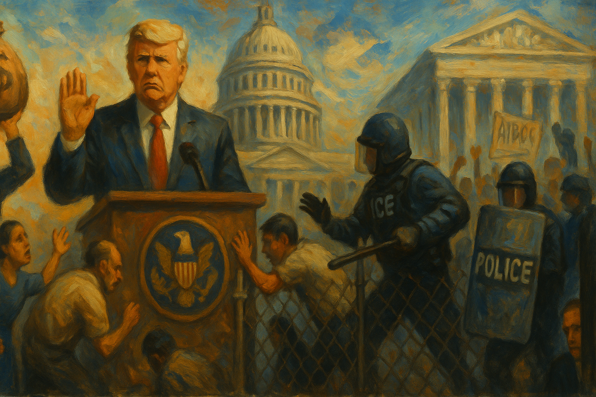

<!-- Generated by build_publish_week_v1 (appendix post) -->
<!-- Header image: image_wide_week18_appendix.png -->

# Week 18 Appendix: A Week of Weight, Not Rupture

*House Republicans fused tax cuts with a bigger deportation machine while courts, alone among institutions, kept forcing due process back into the system.*

This was a high-pressure week defined by three overlapping patterns: executive retaliation against institutions that can check power, intensified use of immigration machinery as a coercive governing tool, and open normalization of corruption and patronage. The most structurally significant events were the Qatari jet and crypto-dinner influence scandals; the House passage of a sweeping reconciliation bill that couples elite tax benefits with mass enforcement funding, court-limiting provisions, and deep social cuts; the proposed reclassification and downsizing of the civil service; and repeated efforts to criminalize or intimidate oversight, dissent, universities, law firms, and the press. Courts provided meaningful resistance in several cases—blocking deportations, restoring grants, halting agency dismantling, and striking down retaliatory orders—but the week also included Supreme Court moves favoring presidential control over independent agencies and allowing TPS revocation. Overall, the week shows democratic erosion proceeding less through a single rupture than through coordinated pressure on accountability systems: law enforcement priorities, administrative staffing, information integrity, immigration status, and access to public institutions are all being bent toward loyalty, punishment, and elite advantage.

Power and Authority

1. President Trump planned to accept and then defended accepting a luxury Boeing 747 from Qatar for presidential use (2025-05-17): The planned acceptance of a major gift from a foreign government tested constitutional limits, raised corruption concerns, and blurred the line between public office and private benefit.

2. The Trump administration used executive pressure to push major law firms into agreements aligned with administration interests (2025-05-18) *[single source]*: Using presidential leverage against law firms threatened independent legal advocacy and signaled that access to government could depend on political compliance.

3. President Trump issued and advanced plans to reclassify about 50,000 civil service jobs into more removable policy roles (2025-05-18) *[single source]*: The proposed reclassification would expand political control over career staff and weaken the independence of agencies that produce and administer public policy.

4. The Trump administration cut funding across agencies and programs as part of a broader effort to reshape federal priorities (2025-05-18) *[single source]*: Broad executive funding cuts shifted power over public services and increased pressure on institutions that depend on federal support to function.

5. President Trump transferred a strip of federal border land to military control and solicited bids for new border wall construction (2025-05-18) *[single source]*: The moves expanded direct executive and military control at the border and deepened the use of federal land and contractors for coercive immigration policy.

6. Ed Martin announced that he would investigate Biden-era pardons (2025-05-18): Using pardon oversight to revisit a predecessor's clemency decisions raised concerns that executive legal tools were being turned into partisan instruments.

7. President Trump personally lobbied House Republicans to support his budget bill and dismissed objections from holdouts (2025-05-19): Direct presidential pressure on lawmakers showed executive dominance over the legislative agenda and narrowed space for independent deliberation within the governing party.

8. The Trump administration struggled to deliver federal disaster assistance in St. Louis and Mississippi (2025-05-19) *[single source]*: Delays and weak federal response tested the state's basic capacity to protect communities and undermined confidence in equal access to public aid.

9. President Trump announced the Golden Dome missile defense project and named Gen. Michael Guetlein to lead it (2025-05-20): The project concentrated defense spending and strategic authority in a large executive initiative with limited demonstrated feasibility or oversight.

10. President Trump announced an investigation into Biden's use of an autopen for executive orders (2025-05-20): Questioning the legitimacy of a predecessor's official acts through executive investigation risked turning state power into a tool for political delegitimization.

11. The Trump administration ended federal DEI programs in the civil service (2025-05-21) *[single source]*: Ending these programs changed executive control over hiring and workplace policy across government and signaled a broader ideological purge of federal administration.

12. Homeland Security Secretary Kristi Noem revoked Harvard's authority to enroll foreign students (2025-05-21): The order used executive immigration power to punish a university, threatening academic autonomy and the legal status of thousands of students.

13. The House-passed reconciliation bill provided a historic increase in immigration enforcement funding (2025-05-22) *[single source]*: The measure would sharply expand detention and enforcement capacity, increasing the state's coercive reach over migrants and asylum seekers.

14. President Trump signed executive orders to accelerate nuclear development and restructure nuclear regulation (2025-05-23): The orders concentrated energy and regulatory power in the executive branch by speeding approvals, reshaping oversight, and directing national security agencies toward a single industrial agenda.

15. The Trump administration and DOGE left the Department of Veterans Affairs in operational disarray through layoffs, freezes, and contract cuts (2025-05-23): Executive management choices weakened a major public service system and reduced the state's ability to deliver care to veterans.

Institutions and Governance

1. Senator Richard Durbin requested a federal investigation into anonymous pizza deliveries to judges (2025-05-17): The request highlighted threats to judicial independence and the need for institutional protection of judges handling politically sensitive cases.

2. House Republicans proposed new immigration fees to fund enforcement and detention (2025-05-17) *[single source]*: The proposal used legislative power to make legal protection more costly and to redirect public authority toward a larger enforcement state.

3. House Republicans failed to advance and then later revived a major budget package extending tax cuts and raising the debt ceiling (2025-05-17): The bill became the week's main vehicle for reshaping fiscal priorities, social programs, and institutional power through a single partisan package.

4. Twenty Democratic-led states filed lawsuits to block federal grant cuts tied to immigration cooperation (2025-05-17): The suits challenged the use of federal funding as leverage against states and tested the balance between national power and state autonomy.

5. Homeland Security Secretary Kristi Noem called for censure and committee removal of House Democrats under DHS investigation (2025-05-17): An executive official's demand to punish lawmakers for oversight activity threatened legislative independence and blurred separation between branches.

6. The Justice Department considered letting prosecutors indict members of Congress without Public Integrity Section approval (2025-05-17) *[single source]*: The proposal would weaken an internal safeguard meant to prevent politically charged prosecutions of elected officials.

7. Deputy Attorney General Todd Blanche was named acting Librarian of Congress (2025-05-17): Placing a close Trump ally in charge of a congressional institution raised concerns about patronage and politicization of a nonpartisan office.

8. Director of National Intelligence Tulsi Gabbard fired the acting chair and deputy of the National Intelligence Council after an assessment contradicted administration claims (2025-05-17): The firings suggested political retaliation inside the intelligence system and weakened confidence in independent national security analysis.

9. The House Homeland Security Committee proposed $46.5 billion for new border wall construction (2025-05-18) *[single source]*: The proposal showed Congress using budget power to entrench a long-term border enforcement agenda despite declining crossings.

10. The North Carolina legislature advanced a cluster of bills targeting immigrants, DEI programs, protest activity, the attorney general, school books, Medicaid, and voter registration (2025-05-18) *[single source]*: The package showed state lawmakers using procedural and policy tools to narrow rights, weaken checks, and reshape civic participation.

11. Congressional Republicans proposed a reconciliation bill that increased ICE funding and allowed the president to target nonprofit tax status (2025-05-18) *[single source]*: The proposal combined expanded enforcement power with a new tool that could be used to pressure civil society groups.

12. Texas officials took steps described as targeting Latino officials and suppressing Latino voting power (2025-05-18) *[single source]*: The actions raised representation concerns by linking official power to reduced political participation and influence for a minority community.

13. Congressional leaders delayed installing a congressionally approved plaque honoring officers who defended the Capitol on January 6 (2025-05-19) *[single source]*: The delay showed how institutional control over public memory can be used to avoid formal recognition of anti-democratic violence.

14. DHS Secretary Kristi Noem misdefined habeas corpus during Senate testimony (2025-05-19): The exchange raised concerns about whether senior officials understood a core legal safeguard against unlawful detention.

15. Representative LaMonica McIver and her allies said charges tied to an ICE oversight visit were politically motivated and aimed at criminalizing oversight (2025-05-19): The dispute tested whether members of Congress could inspect executive detention sites without facing retaliatory legal exposure.

16. House Republicans proposed cutting energy loan programs, clean vehicle credits, and advanced vehicle manufacturing support (2025-05-19) *[single source]*: The proposals used legislative budgeting to redirect industrial policy and reduce federal support for emerging energy sectors.

17. The Senate confirmed Charles Kushner as ambassador to France (2025-05-19): The confirmation showed Congress ratifying a politically connected appointment despite concerns about nepotism and prior criminal conduct.

18. The Federal Election Commission canceled and rescheduled public meetings during the week (2025-05-20): Changes to open meetings affected transparency around election administration and reduced predictability in a key oversight body's public work.

19. Democratic senators questioned Paramount over efforts to settle Trump's lawsuit while seeking merger approval (2025-05-20): The inquiry examined whether regulatory leverage and private settlement talks were distorting media independence and fair governance.

20. Congressional investigators subpoenaed oil company communications about sponsorships used to shape public image and policy influence (2025-05-20) *[single source]*: The subpoenas highlighted how private money can work through cultural institutions to influence public debate and policymaking.

21. Representative Jamie Raskin asked the DOJ inspector general to investigate possible insider trading before Trump's tariff announcement (2025-05-20) *[single source]*: The request sought institutional accountability for whether officials used privileged policy knowledge for private gain.

22. The Missouri GOP filed legislation to make ballot initiatives harder to qualify (2025-05-21) *[single source]*: The proposal would narrow a direct-democracy channel by adding procedural barriers between voters and the ballot.

23. The House of Representatives lost Representative Gerry Connolly to death in office (2025-05-21): The death changed representation in Congress and affected committee leadership and partisan balance in a closely divided chamber.

24. The Louisiana Senate passed an anti-grooming bill and sent it onward in the legislative process (2025-05-21) *[single source]*: The bill showed state lawmakers using criminal lawmaking to address child protection through expanded statutory authority.

25. The Senate passed the No Tax on Tips Act unanimously (2025-05-21): The vote showed bipartisan use of tax policy to target a specific class of workers and shift federal revenue choices.

26. Senate committees held budget hearings that pressed DHS, HHS, and State officials on funding, rights, and disaster response (2025-05-21): The hearings showed Congress exercising oversight over executive agencies and exposing gaps between official claims and agency conduct.

27. Representative Nancy Mace filed a resolution to expel Representative LaMonica McIver (2025-05-21): The move used House discipline procedures in the middle of a contested criminal case, increasing pressure on a member involved in oversight of detention policy.

28. Congress enacted the TAKE IT DOWN Act (2025-05-19): The new law expanded federal rules for online content removal, increasing government-backed obligations on digital platforms.

29. Congress used the Congressional Review Act to nullify EPA and National Park Service rules (2025-05-23): The resolutions showed Congress directly reversing agency rulemaking and narrowing executive regulatory discretion.

30. The Election Assistance Commission announced a vacancy on the Technical Guidelines Development Committee (2025-05-23): The vacancy affected a body that helps shape voting system standards, making it relevant to election administration capacity and representation.

Economic Structure

1. The FBI deprioritized white-collar crime and shifted field office time toward immigration enforcement (2025-05-17): The shift reduced state attention to financial misconduct and redirected enforcement capacity away from corruption and corporate accountability.

2. The FBI disbanded a squad that investigated members of Congress for fraud and corruption (2025-05-17): Closing a public corruption unit weakened institutional capacity to police elite misconduct and reduced accountability for lawmakers.

3. The Trump administration proposed or carried out cuts affecting 9/11 responder care, IRS enforcement, USAID contracts, and Harvard grants (2025-05-17): These funding decisions reduced public goods, weakened enforcement against tax evasion, and used money as leverage against institutions.

4. Moody's downgraded the United States credit rating (2025-05-17): The downgrade signaled reduced confidence in federal fiscal governance and raised the risk of higher borrowing costs for public operations.

5. President Trump announced, adjusted, and maintained major tariffs while threatening new tariffs on the EU and Apple (2025-05-17): The tariff moves concentrated trade power in the presidency and created broad uncertainty for prices, markets, and international commerce.

6. President Trump threatened Walmart over tariff-related price increases (2025-05-17): The threat showed a president using public pressure to influence private pricing decisions, blurring lines between state power and market operations.

7. The CFPB and the Trump administration moved to dismantle the bureau and rescind dozens of consumer protection guidance documents (2025-05-19) *[single source]*: Weakening the consumer watchdog reduced protections for borrowers and shifted regulatory power away from ordinary consumers toward financial actors.

8. Oregon counties redirected addiction treatment funds to law enforcement uses (2025-05-19) *[single source]*: The spending shift moved public money from treatment to policing, changing how the state addressed addiction and public health.

9. The Congressional Budget Office and outside analysts projected that the House budget bill would increase debt, cut coverage, and worsen income inequality (2025-05-19) *[single source]*: The analyses showed the bill would redistribute resources upward while reducing health and food support for lower-income households.

10. The EPA approved state air plans and related environmental compliance revisions in California, Michigan, Texas, Indiana, Alabama, Mississippi, California drinking water, and Hawaii drinking water (2025-05-19): These approvals shaped how environmental and public health standards were enforced through state-federal regulatory systems.

11. The EPA revoked the waste emissions charge for petroleum and natural gas systems after congressional disapproval (2025-05-19): Removing the methane-related charge reduced environmental oversight costs for industry and weakened a climate accountability tool.

12. The FDA, DEA, OSHA, GSA, Census Bureau, and FCC issued routine regulatory notices, guidance, renewals, applications, and comment requests (2025-05-19): These actions maintained the ordinary administrative machinery that governs drugs, labor safety, procurement, data collection, and communications markets.

13. Verizon ended DEI policies as part of a deal tied to FCC approval of its Frontier acquisition (2025-05-20): The change showed how regulatory approval could be used to reshape corporate governance and workplace policy beyond the merger itself.

14. Walmart and Subaru announced price increases linked to tariffs (2025-05-20): The increases showed how trade policy choices were passing costs to consumers and affecting household purchasing power.

15. The California insurance commissioner approved a 17 percent emergency rate hike for State Farm (2025-05-21): The approval shifted disaster-related financial strain onto homeowners and showed regulatory adaptation to climate-driven market instability.

16. President Trump considered re-privatizing Fannie Mae and Freddie Mac (2025-05-22) *[single source]*: The proposal could alter federal backing in housing finance and affect mortgage costs, market stability, and public exposure to housing risk.

17. President Trump hosted a dinner for top investors in his cryptocurrency at his country club (2025-05-22): The event fused presidential access with private financial promotion and raised concerns about pay-to-play influence over economic policy.

18. AT&T, Comcast, T-Mobile, Uber, and United Airlines endorsed the House bill despite its large SNAP cuts (2025-05-22) *[single source]*: The endorsements showed major firms backing legislation that served business interests while reducing food assistance for vulnerable households.

19. San Francisco Mayor Daniel Lurie announced regulatory and zoning reforms to support small retail businesses (2025-05-23) *[single source]*: The reforms aimed to lower barriers to entry for small firms and showed local government using regulation to shape urban economic access.

20. The FAA capped flights at Newark Airport because of air traffic control and infrastructure problems (2025-05-20) *[single source]*: The cap showed how public infrastructure strain can force direct economic limits on transportation capacity and commerce.

21. The GSA rescinded 36 federal travel regulation bulletins (2025-05-22): The rescissions updated the rules governing federal travel and reflected executive control over administrative spending procedures.

22. The EPA published environmental impact and information collection notices affecting hazardous waste, air pollution, and contractor disclosures (2025-05-23): The notices sustained the regulatory framework through which environmental compliance, contracting transparency, and pollution reporting are managed.

23. The FDA determined the review period for ELAHERE for patent extension purposes (2025-05-19): The determination affected how long a drug maker could retain market exclusivity, with consequences for competition and pricing.

24. Noah Smith published an analysis of U.S. wage stagnation from 1973 to 1994 (2025-05-17) *[single source]*: The analysis discussed long-run inequality and labor-market structure but did not record a discrete government action during the week.

Civil Rights and Dissent

1. An appeals court and several federal judges issued rulings that partly blocked Alien Enemies Act deportations and required more notice or process (2025-05-17) *[single source]*: The rulings protected due process for migrants by limiting rapid removals and requiring time to challenge deportation.

2. An appeals court upheld a ruling blocking deportations to third countries without due process (2025-05-17) *[single source]*: The decision reinforced that migrants could not be sent to other countries without a meaningful chance to contest the move.

3. The Supreme Court temporarily blocked Alien Enemies Act deportations of Venezuelan migrants after finding 24 hours' notice inadequate (2025-05-17): The order affirmed that even emergency deportation claims must meet basic due process standards.

4. A federal judge refused to block IRS sharing of immigrant tax records with ICE (2025-05-17): Allowing the data sharing increased the risk that information given for tax compliance could be used for immigration enforcement.

5. Lawyers for a two-year-old U.S. citizen expelled to Honduras with her mother dropped their lawsuit while seeking other ways to address the harm (2025-05-17) *[single source]*: The case reflected the rights costs of aggressive immigration enforcement for mixed-status families and even U.S. citizen children.

6. A federal grand jury and Judge Hannah Dugan indicted the judge and then received her not-guilty plea in a case tied to helping an immigrant avoid arrest (2025-05-17) *[single source]*: The prosecution raised questions about whether immigration enforcement was colliding with judicial independence and courtroom autonomy.

7. A federal judge blocked cuts to American Bar Association grants after finding the move likely retaliatory (2025-05-17): The ruling protected legal aid funding and checked the use of federal money to punish a disfavored professional body.

8. Homeland Security Secretary Kristi Noem ended Temporary Protected Status for Afghan nationals (2025-05-17) *[single source]*: Ending TPS exposed a vulnerable group to loss of lawful status and possible removal despite ongoing safety concerns.

9. Customs and Border Protection detained and questioned Hasan Piker about his political views (2025-05-17): Questioning a traveler about political beliefs raised concerns that border powers were being used to chill speech and viewpoint expression.

10. The Department of Homeland Security threatened possible arrests of House Democrats after an ICE facility oversight visit (2025-05-17): Threatening lawmakers over oversight activity risked deterring scrutiny of detention conditions and chilled dissent against executive enforcement.

11. The Department of Homeland Security considered a reality show in which immigrants would compete for citizenship (2025-05-17): Treating citizenship as entertainment diminished the dignity of immigration status and signaled arbitrary control over belonging.

12. Students and teachers sued Oklahoma schools chief Ryan Walters over a mandate to teach alleged 2020 election discrepancies (2025-05-17): The lawsuit challenged state control over classroom content and defended students' access to vetted civic education.

13. The Trump administration offered refugee status to a group of white South Africans while broader refugee admissions remained restricted (2025-05-17): The selective exception raised concerns that refugee policy was being applied through racial or ideological preference rather than consistent standards.

14. Georgia prosecutors continued a RICO case against dozens of Cop City protesters (2025-05-18): Using organized crime charges against protest activity risked chilling dissent and expanding punitive tools against social movements.

15. The Supreme Court allowed the Trump administration to revoke TPS for hundreds of thousands of Venezuelans while appeals continued (2025-05-19): The order stripped a large migrant group of protection from deportation and showed how emergency rulings can reshape rights quickly.

16. A federal appeals court upheld an order requiring the government to facilitate the return of a deported Venezuelan man (2025-05-19) *[single source]*: The ruling reinforced that the government remained responsible for remedying wrongful deportation and respecting due process.

17. A federal judge blocked Alien Enemies Act deportations from Central California and certified a class of affected noncitizens (2025-05-19): The order broadened due process protection for migrants by stopping removals across a defined class rather than one case at a time.

18. The Department of Justice and Alina Habba dropped charges against Newark Mayor Ras Baraka while pursuing charges against Representative LaMonica McIver (2025-05-19): The split treatment of two officials involved in the same oversight dispute raised concerns about selective prosecution and intimidation of dissent.

19. A federal judge ordered the Trump administration to maintain custody and later found it violated an injunction by deporting migrants toward South Sudan (2025-05-20): The rulings protected migrants from third-country removal without notice and showed courts enforcing due process against executive defiance.

20. A California appeals court halted the Temecula Valley school district's CRT ban (2025-05-20): The ruling protected educators and students from vague censorship rules that chilled teaching about race and history.

21. The Supreme Court restored a censured Maine lawmaker's right to vote in the state house (2025-05-20): The order intervened in a legislative discipline dispute and affected how far a chamber can go in limiting a member's representation role.

22. The Department of Justice moved to cancel police reform consent decrees in Minneapolis and Louisville (2025-05-21): Ending the settlements would reduce federal oversight of police departments accused of civil rights violations and weaken reform mechanisms.

23. ICE conducted arrests at immigration courts across multiple cities (2025-05-21) *[single source]*: Arresting people at court risked deterring attendance at legal hearings and undermined access to due process in immigration cases.

24. ICE and GEO Group denied Mahmoud Khalil a contact visit with his wife and newborn son while he remained detained (2025-05-21): The denial highlighted how detention policy can burden family integrity and impose punitive conditions on a political activist.

25. ICE kept Mahmoud Khalil detained after his arrest over pro-Palestinian advocacy (2025-05-21): Detaining a lawful permanent resident tied to political advocacy raised concerns that immigration power was being used to suppress dissent.

26. The Department of Justice and EEOC opened civil rights investigations into Chicago, Harvard Law Review, and Harvard hiring practices (2025-05-21): The probes showed federal civil rights enforcement being redirected toward claims of anti-white or anti-Asian discrimination in ways that could chill institutional autonomy.

27. A federal judge blocked cancellation of a desegregation education grant (2025-05-21): The injunction preserved support for school desegregation work and protected a federal equity program from abrupt termination.

28. A federal judge blocked the deportation of a Venezuelan man to El Salvador (2025-05-21): The order protected an individual from transfer to a third country before he could fully assert due process rights.

29. ICE deported Bhutanese Nepali refugees to Bhutan, where some were rejected and pushed onward into stateless limbo (2025-05-21) *[single source]*: The deportations exposed refugees to statelessness and showed how removal policy can override long-settled humanitarian protections.

30. A federal judge issued a nationwide injunction blocking arrests, detention, or deportation of thousands of international students whose F-1 status had been revoked (2025-05-22): The injunction protected students from abrupt loss of status and checked executive use of immigration databases without notice.

31. Judge Allison Burroughs temporarily blocked DHS from revoking Harvard's student visa program (2025-05-23): The order protected international students from immediate displacement and checked executive retaliation against a university through immigration law.

32. A federal judge blocked the Trump administration from dismantling the Department of Education and ordered fired employees reinstated (2025-05-22): The ruling protected a major public institution whose work affects equal access to education and federal civil rights enforcement.

33. A federal judge blocked broad federal layoffs and reorganizations across 22 agencies (2025-05-22): The injunction protected the capacity of public agencies whose services and rights enforcement depend on a functioning civil workforce.

34. The Supreme Court deadlocked 4-4 and left in place a ruling blocking a taxpayer-funded religious charter school in Oklahoma (2025-05-22): The split preserved a church-state boundary in public education funding, though without creating a national precedent.

35. Public sector unions launched a campaign against Republican cuts to education, healthcare, and social services (2025-05-23) *[single source]*: The campaign represented organized civic resistance to budget choices that would reduce public services and worker security.

36. Senator Katie Britt called Capitol Police on fired federal workers who were advocating against budget cuts (2025-05-23) *[single source]*: Using police against constituents engaged in advocacy raised concerns about intimidation of peaceful political participation.

37. The Supreme Court allowed the removal of independent agency heads from the NLRB and MSPB to stand while appeals continued (2025-05-22): The stay weakened protections for independent labor and civil service boards that help safeguard workers and due process inside government.

38. The Justice Department opened a criminal investigation into Andrew Cuomo over nursing home testimony (2025-05-20): The investigation tested accountability for public health reporting but also raised questions about selective timing and prosecutorial discretion in politics.

39. The Justice Department sought to dismiss charges against an MS-13 leader so he could be deported (2025-05-23) *[single source]*: Dropping a criminal case to prioritize deportation raised rule-of-law concerns about whether prosecution decisions were being subordinated to political messaging.

40. A federal judge dismissed a trespassing charge against Newark Mayor Ras Baraka and criticized the U.S. attorney's office (2025-05-21): The dismissal checked a prosecution tied to immigration oversight and underscored judicial concern about misuse of criminal process.

41. A federal judge reversed the firings of two Democratic members of the Privacy and Civil Liberties Oversight Board (2025-05-21): The ruling protected an oversight body's independence and preserved a civil liberties check on national security power.

42. A federal judge ordered restoration of removed public articles and studies after finding likely First Amendment violations (2025-05-23): The order protected public access to information and checked viewpoint-based removal of material from government-linked forums.

43. A federal judge overturned Trump's order targeting Jenner & Block as unconstitutional (2025-05-23): The ruling protected lawyers and clients from executive retaliation aimed at punishing a firm for its associations and advocacy.

44. A federal judge granted a preliminary injunction requiring the return of O.C.G. to the United States (2025-05-23): The order showed courts compelling the government to remedy a wrongful removal and restore access to legal process.

45. A federal judge granted a temporary restraining order in W.J.C.C. v. Trump (2025-05-22): The order preserved the status quo in an immigration-related challenge and temporarily protected affected noncitizens from immediate harm.

46. A federal judge granted class certification in M.A.P.S. v. Garite for noncitizens subject to the proclamation in West Texas (2025-05-22): The certification expanded collective access to judicial review for migrants facing the same removal policy.

47. A federal judge denied a temporary restraining order seeking to stop further dissolution of DHS civil rights and oversight offices (2025-05-23): The denial left internal rights-protection offices vulnerable and showed the fragility of administrative safeguards for complaints and oversight.

48. A federal judge denied a preliminary injunction in Solutions In Hometown Connections v. Noem (2025-05-20): The denial left challenged immigration-related executive action in place while litigation continued, limiting immediate relief for affected parties.

49. A federal judge denied a preliminary injunction in Carter v. Department of Education (2025-05-21): The denial left the challenged education action in effect and showed the uneven pace of judicial protection for rights-related claims.

50. A federal judge extended a preliminary injunction in Moe v. Trump (2025-05-22): The extension preserved temporary protection in an ongoing challenge to executive action while the case proceeded.

51. A federal judge granted a preliminary injunction in Somerville Public Schools and State of New York v. McMahon (2025-05-22): The injunction protected education-related plaintiffs from immediate federal action and preserved judicial review over contested policy changes.

52. Plaintiffs in several immigration and education cases filed appeals, amended complaints, or voluntary dismissals that changed the posture of active rights litigation (2025-05-19): These filings showed continued legal contest over deportation, education, and federal benefits, even when no immediate ruling changed conditions on the ground.

53. The Supreme Court and lower courts issued routine orders and opinions in unrelated criminal, civil, and administrative cases (2025-05-19): These decisions affected legal process and court administration but did not materially alter the week's main democracy conflicts.

54. The New Orleans Archdiocese and abuse claimants reached a proposed settlement over clergy abuse claims (2025-05-22) *[single source]*: The agreement addressed long-running abuse allegations and access to records, with implications for accountability and survivor redress.

55. Plaintiffs in Texas and Massachusetts filed lawsuits over a death in police custody and over treatment of Glenn Smallwood Jr. (2025-05-21) *[single source]*: The litigation challenged state treatment of vulnerable people in custody and sought accountability for possible constitutional violations.

56. The family of Ashli Babbitt and the federal government moved toward and then reported a settlement in the wrongful death lawsuit (2025-05-18): The settlement showed how the state was resolving a politically charged case tied to January 6 and law enforcement use of force.

57. The Supreme Court allowed a stay in CREW v. DOGE that paused expedited discovery into DOGE leadership (2025-05-23): The stay slowed fact-finding in a case about executive structure and accountability, limiting immediate transparency into a powerful new entity.

Information, Memory and Manipulation

1. The White House and President Trump threatened legal action against media outlets over unfavorable reporting (2025-05-17) *[single source]*: Threatening lawsuits against news organizations increased pressure on the press and risked chilling aggressive reporting on those in power.

2. President Trump made unsupported or false public claims about foreign investment totals, gas prices, Biden's health, crime, and the 2020 election (2025-05-17) *[single source]*: Repeated false claims from a major political figure distorted public understanding of elections, the economy, and a rival's health.

3. President Trump reposted conspiracy material about James Comey and the Clintons (2025-05-17): Amplifying conspiracy content from a leading political actor degraded factual discourse and normalized disinformation as elite communication.

4. DHS spokesperson Tricia McLaughlin falsely accused House Democrats of assaulting ICE officers despite contrary video evidence (2025-05-17): The false claim used official messaging to discredit oversight lawmakers and muddy the factual record around executive conduct.

5. The White House Correspondents Association criticized the exclusion of wire service reporters from Air Force One coverage on Trump's Middle East trip (2025-05-17): Restricting routine press access reduced transparency around presidential travel and limited the public's independent view of executive actions.

6. The Secret Service, DHS, and the FBI opened an investigation into James Comey's '8647' social media post (2025-05-17): Investigating a former official over an ambiguous post raised concerns that threat assessments could be shaped by political pressure and public messaging.

7. CBS News president Wendy McMahon resigned amid pressure tied to Trump's lawsuit and corporate conflict (2025-05-19) *[single source]*: The departure showed how legal and political pressure can affect newsroom leadership and weaken media independence.

8. Jon Stewart criticized CNN's promotion of Jake Tapper's book during coverage of Biden's diagnosis (2025-05-19): The criticism highlighted concerns about commercial incentives shaping news judgment and public trust in media priorities.

9. Verizon removed DEI webpages and references from its public website (2025-05-20): Deleting public records of prior commitments altered the visible institutional record and reduced transparency about a major company's policy reversal.

10. President Trump insulted reporters from NOTUS and NBC during press interactions (2025-05-20) *[single source]*: Publicly attacking journalists from the presidency sought to discredit independent reporting and intimidate questioners in real time.

11. The DNI chief of staff ordered edits to an intelligence assessment on Venezuela to avoid political harm to top officials (2025-05-20): Directing intelligence edits for political protection threatened the integrity of state information used in public decision-making.

12. The Chicago Sun-Times and a content partner published and then acknowledged an AI-generated reading list containing fake books (2025-05-21): The incident showed how weak editorial controls over AI content can spread false information and erode trust in news institutions.

13. Defense Secretary Pete Hegseth restricted reporters' movement inside the Pentagon and required escorts for broader access (2025-05-23): The new rules narrowed press access to a core national security institution and reduced the ease of independent reporting on military affairs.

14. The FCC announced a public CSRIC meeting on communications security and reliability (2025-05-23): The notice maintained a public forum for discussion of communications infrastructure that shapes the information environment.

15. The Department of Defense and the White House confirmed and defended acceptance of the Qatari jet while disputing how the arrangement began (2025-05-21): Conflicting official accounts about a foreign aircraft deal raised transparency concerns around executive communications and public disclosure.

16. Congressional and public commentary circulated opinion and historical pieces not tied to a discrete current-week democracy action (2025-05-18) *[single source]*: These entries reflected commentary or historical reference rather than a new institutional act affecting democratic power during the week.

