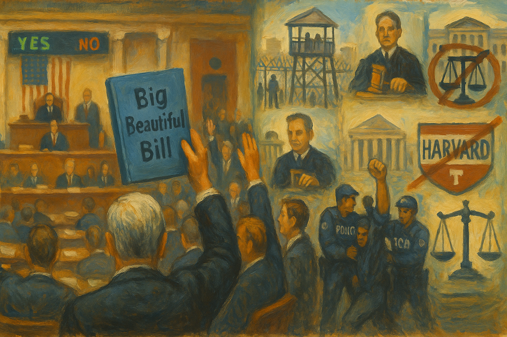

<!-- Generated by build_publish_week_v1 -->
<!-- Header image: image_wide_week18.png -->

# Week 18: A Week of Weight, Not Rupture

*House Republicans fused tax cuts with a bigger deportation machine while courts, alone among institutions, kept forcing due process back into the system.*

The clock's hands scarcely moved this week, and that stillness is itself a kind of answer. Week 18 unfolded not as rupture but as accumulation. Nearly every visible lever of power tilted the same direction by small degrees, so the net motion looked modest even as the underlying pressure did not. The Democracy Clock is not a seismograph tuned only to earthquakes; it also registers weather, and this week the weather was heavy on nearly every front: enforcement redirected, oversight thinned, foreign money accepted, courts strained. The story of Week 18 is not one dramatic event. It is many small events, in agencies and courtrooms and hearing rooms, all leaning the same way.

At the close of Week 17, the clock stood at 7:40 p.m. It ends Week 18 at 7:40 p.m. as well. The hands moved forward by a fraction too small to register on the public face, though the underlying measure ticked from 460.2 to 460.3. This is a week of density rather than velocity. Dozens of separate actions pushed the same direction, but no single shock reset the baseline. The courts, still functioning, absorbed much of the pressure. Congress passed something large, but its full weight will land in future weeks. The clock's near-stillness records a week of sustained strain rather than sudden collapse.

The most consequential single development was legislative. After days of internal Republican wrangling, House leaders revived and passed a sprawling budget package that fused two purposes rarely seen together in one bill. It made the 2017 tax cuts permanent, protecting income already concentrated at the top. It also funded, at record scale, a much larger immigration enforcement apparatus. The same measure cut Medicaid and food assistance to help pay for both.

This was not incidental overlap. It was a design choice. Wealth kept its privileges. Enforcement capacity grew. The costs fell on people who depend on public assistance. Large employers—telecom firms, airlines, ride-share companies—publicly backed the bill despite its cuts to food aid, a detail that speaks plainly about whose interests the legislation served. Corporate power and enforcement power grew together, funded by the same document, while the safety net beneath ordinary households grew thinner.

Structurally, this matters. Tax and enforcement policy, once written into statute, resist reversal in ways executive orders do not. A president's directive can be undone by the next president. A five-year appropriation for detention and enforcement, once passed, has its own momentum. Congress did not merely acquiesce this week; it built infrastructure.

Against that legislative current, the courts held a firmer line than almost any other institution. The Supreme Court, joined by several federal judges, repeatedly slowed the administration's deportation machinery. It found that twenty-four hours' notice was not enough process before removing people under wartime authority. Appeals courts required the government to facilitate the return of a wrongly deported man. A judge certified a class of migrants in West Texas, extending protection beyond a single plaintiff to an entire group facing the same order.

These were not sweeping victories. They were narrow, procedural, case by case. But taken together, they show a judiciary still able to force due process back into a system built for speed. Where Congress wrote enforcement into the budget, the courts wrote friction into its execution. This tension—one branch building capacity, another slowing its use—shaped much of the week's legal terrain.

Even as courts imposed limits, the administration kept expanding how immigration status itself could be wielded as leverage. Temporary Protected Status ended for Afghans, and, following a Supreme Court order, hundreds of thousands of Venezuelans lost protection while their case continued on appeal. At the same time, the government moved swiftly to admit a small group of white South African refugees, a contrast that drew immediate scrutiny. Citizenship itself, in a proposal DHS was reportedly vetting, might become the subject of a reality-television competition.

Nowhere was this use of immigration power as leverage clearer than in the treatment of Harvard and of Mahmoud Khalil. Homeland Security stripped Harvard's authority to enroll foreign students, a move that threatened thousands of enrolled students with sudden loss of status, until a federal judge blocked the action days later. Khalil, a lawful permanent resident detained over pro-Palestinian advocacy, remained in custody and was denied a visit with his newborn son. Together these cases showed status and detention used less as immigration administration than as tools of institutional punishment and political message-sending.

A parallel pattern of retaliation ran through the week's treatment of oversight itself. The Justice Department considered removing an internal safeguard that requires special approval before indicting a sitting member of Congress, a change that would make prosecutorial power over lawmakers far easier to deploy. DHS threatened to arrest House Democrats who had visited an ICE facility to inspect conditions. Representative LaMonica McIver faced criminal charges from that same visit, even as Newark's mayor, arrested in a related incident, had his case dismissed by a judge who openly criticized the prosecutors' conduct.

The unevenness was the point. A member of Congress performing oversight faced prosecution. A local mayor, in a similar confrontation, did not. The charge was refiled against the congresswoman while dropped against him, a distinction with no clear neutral principle behind it. A federal judge struck down, as unconstitutional, an executive order targeting the law firm Jenner & Block for its associations. Legal institutions, elected oversight, and ordinary advocacy all found themselves inside the same pressure system, tested for compliance rather than protected as a matter of course.

Underneath these visible confrontations, a quieter transformation was underway inside the machinery of government itself. The administration proposed reclassifying roughly fifty thousand civil service positions into categories far easier to remove for political reasons. The Director of National Intelligence fired two senior officials at the National Intelligence Council after an assessment contradicted administration talking points. Federal DEI programs across the civil service were eliminated outright.

The Supreme Court, meanwhile, let the president proceed with removing the heads of the National Labor Relations Board and the Merit Systems Protection Board while appeals continued. The decision strengthens unitary control over agencies meant to operate at arm's length from the White House. None of this required one dramatic firing to register; it required only the accumulation of smaller ones, each defensible alone, each part of a pattern visible only in aggregate.

Enforcement capacity aimed at elite misconduct shrank in tandem. The FBI deprioritized white-collar crime and disbanded the unit that investigated members of Congress for corruption. The IRS absorbed a 31 percent cut to enforcement staffing. The Consumer Financial Protection Bureau moved toward dismantling, rescinding dozens of consumer-protection guidance documents along the way. None of these steps prosecuted anyone. Each made future prosecution less likely. The state's capacity to see wrongdoing by the powerful was, deliberately, made smaller.

Corruption itself moved further into the open rather than staying hidden. Trump defended his plan to accept a $400 million luxury jet from Qatar for use as Air Force One, an arrangement that fuses a foreign government's largesse directly with presidential transport. Days later, he hosted a private dinner for the top holders of his personal cryptocurrency, a gathering that mixed presidential access with a business he personally profited from, its guest list withheld from public view. Charles Kushner, previously pardoned for federal crimes, was confirmed by the Senate as ambassador to France in the same stretch of days.

None of these episodes was concealed. That is what sets this week apart from earlier patterns of scandal. Self-dealing, foreign gifts, and pay-to-play access were defended openly rather than denied. The absence of shame was itself the development, a signal that the ordinary reputational cost of such conduct had been sharply reduced.

Pressure on independent information ran along several fronts at once. CBS News's president resigned amid tension tied to Trump's lawsuit against the network. The administration threatened legal action against ABC and Business Insider over unfavorable coverage. The Pentagon, under Secretary Hegseth, imposed new rules requiring reporters to be escorted through much of the building, narrowing routine access to a core national security institution. And in a striking case of internal manipulation, a Director of National Intelligence official reportedly ordered edits to an intelligence assessment on Venezuela specifically to avoid political embarrassment for senior officials, a direct intervention in the integrity of state information rather than mere messaging around it.

Universities absorbed similar pressure through financial leverage rather than open censorship. Harvard lost an additional $450 million in federal grants, on top of earlier cuts, in actions a federal judge would later find likely retaliatory and in violation of First Amendment protections. The threats arrived faster than the courts could resolve them. The pressure itself, regardless of ultimate legal outcome, had already shaped institutional behavior in the meantime.

Even amid this pressure, courts did not stand uniformly aside. A judge blocked the administration from dismantling the Department of Education and ordered fired employees reinstated. Another halted broad layoffs across twenty-two agencies. A deadlocked Supreme Court left standing a ruling against the nation's first taxpayer-funded religious charter school. These rulings did not reverse the week's overall direction, but they showed that institutional structure, where it still held, could still produce friction against consolidation.

Scheduled and pending matters carried into the following weeks without resolution here. Harvard's foreign-student authority remained under a temporary judicial block, with further hearings expected. The class-action challenge to Alien Enemies Act deportations in West Texas continued under its newly certified scope. The proposed civil-service reclassification, not yet finalized, awaited further rulemaking. Each thread was left open, its resolution deferred rather than decided.

Viewed as a whole, Week 18 did not mark a single collapse of any safeguard. It marked instead the steady wearing away of the margins that make safeguards meaningful, the difference between a rule that exists and a rule that can be reliably invoked. Courts still ruled. Reporters still asked questions. Watchdogs still, in places, watched. But each of these acts now carried a higher cost and a narrower chance of consequence than before. The week's stillness on the clock's face conceals a heavier truth beneath it. Erosion does not always look like loss. Sometimes it looks like an ordinary week, repeated.

<!-- Synopses for cross-posting -->
Long Synopsis: Week 18 moved the Democracy Clock by only a hundredth of a point, from 460.2 to 460.3, yet the stillness concealed dense accumulation. House Republicans revived and passed a sprawling budget bill making 2017 tax cuts permanent, funding record immigration enforcement, and cutting Medicaid and food aid to pay for both. Courts pushed back hardest: the Supreme Court and appeals judges repeatedly slowed deportations, required due process, and struck down retaliation against a law firm. Meanwhile the administration escalated immigration as leverage against Harvard and activist Mahmoud Khalil, moved to reclassify fifty thousand civil-service jobs, gutted anti-corruption enforcement at the FBI and IRS, and normalized open self-dealing through a $400 million Qatari jet and a private crypto donor dinner. Oversight itself came under pressure, with uneven prosecutions of lawmakers and mayors alike.
Short Synopsis: The clock barely moved, but Week 18 packed dozens of small, same-direction shifts into one span: a megabill fusing tax cuts with mass enforcement, courts fighting to preserve due process, civil-service politicization, and open corruption defended rather than denied.

