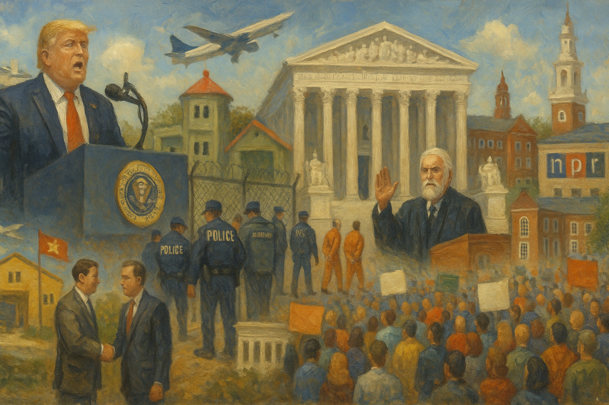

<!-- Generated by build_publish_week_v1 (appendix post) -->
<!-- Header image: image_wide_week19_appendix.png -->

# Week 19 Appendix: The Ring Around Harvard

*One week widened the gap between executive discipline and institutional independence, while courts absorbed the strain of holding the line.*

This was a high-pressure week for democratic structure, defined less by a single rupture than by a coordinated pattern of executive retaliation, patronage, and anti-pluralist state use. The most consequential cluster involved the administration’s campaign against Harvard and foreign students: revoking enrollment authority, pausing student visa interviews, demanding student information, ordering social-media screening, and cutting federal ties. That concentrated pressure hit academic freedom, civil liberties, transparency, and citizenship equality at once. A second major theme was corruption and selective impunity, especially through a burst of pardons and clemencies for politically connected or donor-adjacent figures, alongside reporting on Trump-linked business advantages in Vietnam and crypto. A third theme was aggressive immigration enforcement and due-process erosion: arrest quotas, wrongful detentions, parole revocations, and repeated efforts to evade or narrow court-ordered protections. Courts did provide meaningful resistance in several areas—tariffs, Harvard, deportations, law-firm retaliation, and media funding—but the week still showed an executive branch repeatedly testing whether law is a constraint or merely terrain to fight over.

Power and Authority

1. President Trump signed an order targeting DEI programs at military academies (2025-05-24) *[single source]*: The order used executive power to reshape military education and restrict inclusion, affecting who could organize and what materials could remain in federal institutions.

2. FEMA denied North Carolina's request for full hurricane debris-removal funding (2025-05-24): The denial showed federal control over disaster aid and affected how quickly a state could recover essential public services after a major storm.

3. President Trump delivered partisan remarks at West Point and Arlington events (2025-05-24): Using military and memorial settings for partisan messaging tested norms that keep armed institutions and national remembrance apart from personal politics.

4. The Trump administration revoked Harvard's authority to enroll foreign students (2025-05-25): The move used federal immigration power to pressure a university, tying academic operations to executive demands and threatening institutional independence.

5. President Trump was accused of blending personal business interests with foreign policy (2025-05-26) *[single source]*: The reported overlap between private gain and state policy raised accountability concerns about whether public power was being used for personal benefit.

6. President Trump pardoned Paul Walczak (2025-05-26): The pardon raised concerns that clemency could reward donor access or personal ties rather than neutral standards of justice.

7. President Trump pardoned former sheriff Scott Jenkins (2025-05-26): The pardon overrode a corruption conviction and signaled that executive clemency could shield politically useful allies from accountability.

8. The Trump administration proposed higher federal spending for ICE and the Pentagon (2025-05-26) *[single source]*: The budget priorities shifted state capacity toward enforcement and military power rather than civilian support, affecting how federal coercive power was resourced.

9. The Trump administration paused new foreign student visa interviews at U.S. embassies (2025-05-26): The pause expanded executive control over who could enter for study and gave the administration leverage over universities that rely on international students.

10. The Trump administration ordered federal agencies to cut ties with Harvard (2025-05-27): Canceling contracts used federal purchasing power to punish a disfavored institution and pressure it to align with executive demands.

11. President Trump signed a record number of executive orders since returning to office (2025-05-27) *[single source]*: The pace of unilateral directives showed a governing style centered on executive action rather than legislative bargaining or ordinary oversight.

12. President Trump pardoned Todd and Julie Chrisley (2025-05-27): The pardons added to concerns that clemency was being used to favor politically connected supporters rather than uphold equal accountability.

13. President Trump commuted Larry Hoover's sentence (2025-05-28): The commutation showed the broad reach of presidential clemency and raised questions about consistency in how executive mercy was applied.

14. The Trump administration closed the State Department's office of analytic outreach (2025-05-28) *[single source]*: Closing the office narrowed outside input into foreign-policy analysis and concentrated decision-making more tightly inside the executive branch.

15. The Trump administration targeted DEI programs and trans rights in ways that affected Pride events (2025-05-29) *[single source]*: Federal pressure on inclusion policies shaped public and corporate behavior beyond government, showing how executive signals can chill civic expression.

16. The Trump administration issued merit hiring guidance that stressed loyalty to the executive branch (2025-05-29) *[single source]*: The guidance pointed federal hiring toward political loyalty tests, weakening norms of a neutral civil service accountable to law rather than a leader.

17. Elon Musk left his role overseeing the Department of Government Efficiency (2025-05-30): The departure highlighted how a private business leader had exercised unusual influence inside government and raised questions about informal power after leaving office.

18. The State Department planned to create an Office of Remigration (2025-05-30): The restructuring redirected diplomatic and refugee functions toward removal policy, expanding executive machinery for deportation and migration control.

19. The Trump administration ordered mandatory social media screening for Harvard visa applicants and visitors (2025-05-30): The directive used visa power and surveillance screening to target one university's international community, increasing executive leverage over academic exchange.

Institutions and Governance

1. House Republicans passed a tax-and-spending bill that funded the Golden Dome missile defense project (2025-05-24) *[single source]*: The vote showed Congress directing large public resources through a partisan spending package, shaping defense priorities and fiscal governance.

2. Senator John Fetterman faced scrutiny over absenteeism and returned to hearings and votes (2025-05-24) *[single source]*: The episode raised accountability questions about whether elected officials were meeting their basic legislative duties to constituents.

3. Representative Jasmine Crockett called for future oversight of President Trump and his business dealings (2025-05-24) *[single source]*: The statement underscored Congress's oversight role in checking conflicts of interest and executive misconduct.

4. Speaker Mike Johnson declined to comment on controversy around Trump's crypto dinner (2025-05-24): The response reflected weak legislative scrutiny of possible conflicts involving a former president and political fundraising.

5. Judge Brian Murphy ordered the Trump administration to facilitate the return of a wrongly deported asylum seeker (2025-05-24): The ruling enforced due process limits on immigration power and showed the courts acting as a check on executive removal decisions.

6. Rudy Giuliani said he wanted appointment as special counsel to investigate Joe Biden and his family (2025-05-24): The proposal pointed to pressure for partisan use of prosecutorial tools, testing norms of independent justice administration.

7. Republican lawmakers threatened to block Trump's spending bill over debt concerns (2025-05-25): The dispute showed internal legislative conflict over fiscal power and the terms under which Congress would advance the administration's agenda.

8. California lawmakers moved to amend CEQA to streamline permitting (2025-05-25) *[single source]*: The proposed changes would alter how a major state review process balances public oversight, environmental review, and development approvals.

9. State legislatures in Texas and Colorado advanced single-stair housing reforms (2025-05-25) *[single source]*: The reforms showed state governments changing building rules through ordinary lawmaking rather than executive action, affecting local governance capacity.

10. The Texas legislature advanced a bill to allow housing in some commercial zones (2025-05-25) *[single source]*: The bill would limit local anti-development barriers and shift land-use authority through state legislative action.

11. Federal judges considered creating their own armed security force (2025-05-25) *[single source]*: The discussion showed deep concern that the judiciary could not rely on executive-controlled protection, raising questions about judicial independence and safety.

12. Judge Allison Burroughs granted Harvard a temporary restraining order against the foreign-student enrollment ban (2025-05-25): The order preserved the status quo and showed the courts checking executive pressure on a university's core operations.

13. Indivisible and allied activists mobilized mass protests in more than 1,300 cities (2025-05-25) *[single source]*: The protests showed organized civic pressure on elected officials and parties, reinforcing participation outside formal institutions.

14. Judge Brian Murphy rejected DHS's bid to undo a ruling on unlawful deportations to South Sudan (2025-05-26): The decision reaffirmed that executive agencies had to follow court-ordered due process in deportation cases.

15. NPR filed suit against the Trump administration over an order cutting public media funding (2025-05-26): The case tested whether the executive branch could use funding controls to retaliate against protected speech and independent journalism.

16. Republican officials in multiple states advanced measures to restrict ballot initiatives and referendums (2025-05-26) *[single source]*: The push would make direct democracy harder to use, narrowing one route for voters to shape policy outside legislatures.

17. Senator Tommy Tuberville announced he would leave the Senate to run for governor of Alabama (2025-05-26): The move affected representation and the composition of a federal legislative body while opening a major state race.

18. The FCC announced a meeting of the North American Numbering Council (2025-05-27): The notice reflected routine regulatory governance over communications infrastructure with public comment and advisory oversight.

19. Democratic state attorneys general prepared lawsuits against anticipated Trump administration actions (2025-05-27) *[single source]*: The planning showed states using courts as an institutional check on expected federal overreach.

20. Courts had paused at least 177 Trump administration initiatives by late May (2025-05-27) *[single source]*: The volume of rulings showed the judiciary serving as a broad defensive barrier against contested executive actions.

21. The Trump administration appealed a district court injunction in the South Sudan deportation case to the Supreme Court (2025-05-27): The appeal escalated a separation-of-powers fight over whether courts could require due process before third-country deportations.

22. Defendants in LeBlanc v. Privacy and Civil Liberties Oversight Board appealed an adverse summary judgment order (2025-05-27): The appeal kept a dispute over the structure and authority of an oversight body active in the courts.

23. Democracy Forward partly dismissed its Treasury data-access case against SBA and Education while continuing against Treasury (2025-05-27): The update narrowed but preserved litigation over access to sensitive federal data and agency accountability.

24. Judge Liman barred the Trump administration from withholding New York City funds over congestion pricing (2025-05-27): The ruling checked federal attempts to use funding as leverage against a local policy choice.

25. The United Auto Workers voluntarily dismissed its claims in National Treasury Employees Union v. Trump (2025-05-27): The dismissal changed the scope of a labor-related challenge to executive action and narrowed one avenue of institutional contest.

26. Judge Chutkan let most claims proceed in the states' lawsuit over Elon Musk and DOGE while dismissing Trump from the case (2025-05-27): The ruling kept alive a constitutional challenge to whether executive power was being exercised without lawful appointment or authorization.

27. Judge Vargas kept most of a Treasury data injunction in place while allowing vetted DOGE staff access (2025-05-27): The decision balanced executive staffing claims against safeguards for sensitive government financial data.

28. Judge Timothy Kelly denied a preliminary injunction in Taylor v. Trump (2025-05-27): The ruling showed courts requiring plaintiffs to exhaust administrative remedies before granting emergency relief against executive action.

29. Judge Richard Leon granted summary judgment against Trump's order targeting WilmerHale (2025-05-27): The ruling protected legal independence by blocking executive retaliation against a law firm for its associations and advocacy.

30. Plaintiffs in Pallek v. Rollins sought emergency relief to stop federal collection of SNAP applicant and recipient data from states (2025-05-27): The filing raised institutional questions about federal access to state-held welfare records and the limits of administrative data gathering.

31. The Supreme Court granted, vacated, and remanded two cases in light of Barnes v. Felix and granted review in Fernandez v. United States (2025-05-27): The orders showed the Court shaping lower-court doctrine and setting the agenda for future federal criminal procedure rulings.

32. The House of Representatives passed the One Big Beautiful bill (2025-05-28): The vote advanced a major package linking tax policy, deportation funding, and safety-net cuts, showing Congress moving a broad partisan agenda.

33. Judge Paula Xinis denied the administration more time in the Kilmar Abrego Garcia case (2025-05-28): The ruling pressed the executive branch to answer promptly in a case about removal and detention, reinforcing procedural accountability.

34. The Court of International Trade ruled that major Trump tariffs were unlawful (2025-05-28): The decision reaffirmed that tariff power is bounded by statute and constitutional separation of powers, not open-ended executive emergency claims.

35. The Massachusetts attorney general filed an amicus brief supporting Harvard in its case against DHS (2025-05-28): The filing showed a state government backing a university against federal pressure in court.

36. Defendants in Environmental Defense Fund v. Department of Transportation answered a FOIA complaint and denied improper withholding (2025-05-28): The response kept a records dispute active and tested agency compliance with public access obligations.

37. Judge Farbiarz partly ruled for Mahmoud Khalil on vagueness grounds in his removal case (2025-05-28): The ruling recognized constitutional limits on removing a resident for political activity while leaving other grounds for litigation.

38. Defendants in Planned Parenthood of Greater New York v. HHS opposed a preliminary injunction motion (2025-05-28): The filing continued a court fight over federal health policy and the limits of agency action.

39. Defendants in State of Washington v. Department of Transportation opposed a preliminary injunction over paused transportation obligations (2025-05-28): The dispute tested whether agencies could freeze funding decisions before issuing final guidance.

40. The D.C. Circuit denied government stay requests in the Middle East Broadcasting Networks and Radio Free Asia cases (2025-05-28): The denials kept lower-court protections in place for federally funded broadcasters challenging executive funding actions.

41. Judge Talwani denied a stay and granted relief for people already in the United States in Svitlana Doe v. Noem (2025-05-28): The order temporarily protected a class of migrants from abrupt status loss while litigation continued.

42. The district court denied a temporary restraining order in Perlmutter v. Blanche (2025-05-28): The denial left the challenged executive action in place and showed the limits of emergency judicial relief.

43. Idaho and Montana lawmakers enacted Pride-month flag bans at public sites (2025-05-29): The laws used state legislative power to restrict symbolic expression in government spaces and schools.

44. Utah lawmakers banned LGBTQ+ flags at government buildings and schools (2025-05-29): The law restricted expression in public institutions and showed legislatures using state power to police identity-related speech.

45. Oklahoma parents organized as WOKE used a state opt-out law to challenge the new social studies curriculum (2025-05-29) *[single source]*: The effort showed citizens using a legislative tool to contest state education policy and demand procedural accountability.

46. The Federal Circuit temporarily stayed the tariff ruling while appeals proceeded (2025-05-29): The stay preserved executive tariffs for the moment while higher courts reviewed the scope of presidential trade authority.

47. Harvard University settled a lawsuit and agreed to transfer early photographs of enslaved people to an African American museum (2025-05-29): The settlement addressed institutional control over historically significant records and accountability for past harms.

48. Judge Allison Burroughs expanded protection for Harvard against the foreign-student enrollment block (2025-05-29): The injunction kept federal pressure from taking effect and reinforced judicial review over executive action against universities.

49. Twenty-two young Americans sued the Trump administration over anti-environment executive orders (2025-05-29) *[single source]*: The lawsuit asked courts to review whether executive energy directives violated constitutional rights and statutory limits.

50. The district court granted a preliminary injunction in Learning Resources v. Trump and the government appealed (2025-05-29): The case added to the growing pattern of courts limiting executive action while appeals kept the institutional conflict active.

51. Federal agencies in State of New York v. Trump filed opposition to a preliminary injunction motion (2025-05-29): The filing continued a state-federal court dispute over contested executive action.

52. Parents, grandparents, and teachers in Oklahoma sued to block the new social studies curriculum (2025-05-29) *[single source]*: The lawsuit challenged both the content and the approval process of state curriculum changes, focusing on transparency and lawful procedure.

53. The Supreme Court stayed the Fifth Circuit mandate in Highland Capital Management v. NexPoint Advisors (2025-05-29): The stay paused a lower-court ruling and showed the Court's power to control the timing and effect of appellate judgments.

54. The Supreme Court issued its opinion in Seven County Infrastructure Coalition v. Eagle County (2025-05-29): The opinion set binding national law on environmental review and agency obligations, affecting future federal project approvals.

55. The Virginia legislature passed a constitutional amendment to codify abortion rights (2025-05-30) *[single source]*: The vote used formal constitutional process to protect a right through state institutions rather than ordinary statute alone.

56. The Supreme Court allowed the Trump administration to end humanitarian parole protections for CHNV migrants while litigation continued (2025-05-30): The order shifted the balance toward executive immigration power and immediately weakened legal protections for hundreds of thousands of people.

57. Judge Brian Murphy halted a deportation flight to South Sudan after finding a prior order had been violated (2025-05-30): The intervention enforced judicial authority over deportation procedures and protected the right to challenge removal to third countries.

58. Plaintiffs in Mennonite Church USA v. DHS appealed the denial of a preliminary injunction (2025-05-30): The appeal kept alive a challenge to federal immigration enforcement and its effect on religious and associational life.

59. Plaintiffs in J. Doe 4 v. Musk filed a second amended class action complaint (2025-05-30): The filing continued litigation over the scope and legality of power exercised through DOGE-related actions.

60. The Ninth Circuit denied the government's stay motion in AFGE v. Trump (2025-05-30): The denial left lower-court limits in place and showed continued judicial resistance in a federal workforce dispute.

61. The district court protected a subset of Venezuelan TPS holders from document invalidation (2025-05-30): The order preserved work and status documents for some migrants, showing courts narrowing executive immigration actions case by case.

62. Judge William Young partly denied the government's motion to dismiss in American Public Health Association v. NIH (2025-05-30): The ruling kept much of a challenge to federal health-related action alive, preserving judicial review of agency conduct.

63. The district court ordered the government to disburse May funding to Radio Free Europe/Radio Liberty (2025-05-30): The order enforced congressionally appropriated funding and limited executive control over an independent broadcaster's survival.

64. Plaintiffs in Valuta Corporation v. FinCEN moved for a temporary restraining order (2025-05-30): The filing opened a new court challenge to federal financial enforcement action and sought immediate judicial intervention.

65. The Supreme Court denied a stay in Kapoor v. DeMarco (2025-05-30): The denial left the lower-court ruling in effect and showed the Court declining emergency intervention.

66. The Federal Election Commission announced a closed Sunshine Act meeting on civil litigation matters (2025-05-30): The notice reflected the election regulator's formal governance process, even though the meeting itself was not open to the public.

Economic Structure

1. President Trump announced a 50% tariff on European Union goods and threatened a tariff on Apple products (2025-05-24): The tariff threats showed one leader using trade power to pressure foreign partners and firms, with broad effects on markets and prices.

2. President Trump extended the deadline for the proposed 50% tariff on EU goods (2025-05-25) *[single source]*: The extension kept major trade policy under personal executive control and prolonged uncertainty for businesses and trading partners.

3. Cities including Dallas and Santa Monica implemented YIMBY housing reforms (2025-05-25) *[single source]*: The local changes used zoning and permitting policy to expand housing supply, affecting access to a basic economic good.

4. The Vietnamese government fast-tracked approval of a Trump family golf complex during trade talks (2025-05-25) *[single source]*: The project raised conflict-of-interest concerns by linking a political family's business interests to international economic negotiations.

5. The proposed federal budget cut SNAP and Medicaid while shifting costs to states (2025-05-26): The proposal would reduce core public benefits and move fiscal burdens downward, affecting how government supports basic welfare.

6. The Trump administration resumed collections on defaulted student loans (2025-05-26) *[single source]*: Restarting collections increased state-backed financial pressure on borrowers and affected household economic security.

7. North Carolina budget writers proposed eliminating the corporate income tax (2025-05-26) *[single source]*: The proposal would shift the state's revenue structure toward lower business taxation and likely reduce funds for public services.

8. The EPA submitted an Acid Rain Program information collection request for OMB review (2025-05-27): The filing maintained a regulatory system for tracking emissions, supporting continued oversight of pollution controls.

9. The FCC held an open meeting on telecom certification, foreign control transparency, and spectrum use (2025-05-27): The meeting addressed how communications infrastructure is regulated, with implications for market access, security, and public oversight.

10. OMB, the Department of Defense, GSA, and NASA submitted a review request on Federal Acquisition Regulation Part 32 requirements (2025-05-27): The action maintained rules for contract financing and payment, shaping accountability in federal procurement.

11. OMB, the Department of Defense, GSA, and NASA submitted a review request on service contracting information collection (2025-05-27): The request preserved reporting rules used to judge labor costs and realism in federal service contracts.

12. OMB, the Department of Defense, GSA, and NASA submitted a review request on contractor travel cost reporting (2025-05-27): The filing supported oversight of how contractors charge travel expenses to the government.

13. OMB, the Department of Defense, GSA, and NASA submitted a review request on government property reporting by contractors (2025-05-27): The action maintained accountability rules for public property held by private contractors.

14. OMB, the Department of Defense, GSA, and NASA submitted a review request on value engineering requirements (2025-05-27): The request kept in place a procurement process meant to evaluate contractor proposals for cost savings and efficiency.

15. xAI acquired X (2025-05-27) *[single source]*: The deal concentrated control over a major social platform and its data inside a single AI company, with implications for market and information power.

16. The EPA approved alternative emissions test methods for regulated sources (2025-05-28): The approval changed compliance options for industry while keeping federal environmental standards in force.

17. The FCC and Arizona's Department of Economic Security created a matching program to verify Lifeline and ACP eligibility (2025-05-28): The program used administrative data to police access to communications subsidies, affecting how low-income benefits are delivered.

18. The FCC opened comment periods on multiple information collections for cable, radio, broadband, equipment, telehealth, and universal service programs (2025-05-28): The notices showed routine regulatory governance over communications markets and the paperwork burdens tied to public programs.

19. Governor Josh Green signed a Hawaii law raising taxes on hotel stays, rentals, and cruise visits for climate mitigation (2025-05-28): The law used tax policy to fund public climate adaptation, showing a state redirecting tourism revenue toward shared environmental costs.

20. Flamingo Everglades Adventures and public partners opened a hurricane-resilient eco-hotel in Everglades National Park (2025-05-28) *[single source]*: The project showed how public-private partnerships can shape infrastructure in public lands when government budgets are constrained.

21. International tourism analysts reported a sharp decline in foreign visitor spending in the United States (2025-05-28) *[single source]*: The decline linked national policy choices to lost economic activity in travel-dependent sectors across the country.

22. President Trump pressed Federal Reserve Chair Jerome Powell to lower interest rates (2025-05-28): The request tested the norm of central bank independence from direct political pressure.

23. Trump Media & Technology Group raised $2.5 billion to buy Bitcoin and launched investment products aligned with Trump's policies (2025-05-28): The moves blurred the line between political influence and private financial gain by tying investment products to a political figure's policy agenda.

24. The FDA issued debarment orders against drug and food import violators (2025-05-29): The orders showed routine regulatory enforcement against illegal import practices that affect public health and market integrity.

25. The EPA set pesticide residue tolerances for florylpicoxamid (2025-05-29): The rule set federal safety limits for food residues, shaping agricultural markets and consumer protection.

26. The FDA announced an animal drug user fee educational conference (2025-05-29): The conference notice supported transparency and stakeholder access in a regulatory approval system that affects industry and public health.

27. The FDA classified several medical and diagnostic devices into class II with special controls (2025-05-29): The classifications adjusted regulatory burdens while keeping federal safety controls over new health technologies.

28. The FDA confirmed the effective date for myoglobin as a color additive in meat analogue products (2025-05-29): The confirmation finalized a food regulation change that affects product formulation and market entry.

29. The FDA issued draft and final guidance on medical device submissions and extended comment on poppy seed opiate practices (2025-05-29): The actions updated how firms interact with regulators and how public input enters technical rulemaking.

30. The FDA revoked emergency use authorizations for four COVID-19 diagnostic devices (2025-05-29): The revocations changed the market status of pandemic-era tests and showed continuing federal control over emergency health products.

31. The EPA published environmental impact statement notices and announced a pesticide dialogue meeting (2025-05-30): The notices supported public participation in environmental review and regulatory discussion for major projects and pesticide policy.

32. The EPA received requests to cancel certain pesticide registrations (2025-05-30): The notice opened a process that could remove products from the market through regulatory review and public comment.

33. The FDA determined that ACTIGALL and COREG CR were not withdrawn for safety reasons (2025-05-30): The determinations kept the path open for generic competition, affecting drug availability and pricing.

34. The FDA set a regulatory review period for LOQTORZI for patent extension purposes (2025-05-30): The determination affected how long a drug maker could seek market exclusivity through patent extension.

35. The FDA issued draft guidance on replacing color additives in drug products (2025-05-30): The guidance updated compliance expectations for manufacturers and shaped how quickly product changes could reach market.

36. The FDA released its annual report on postmarketing requirements and commitments (2025-05-30): The report provided accountability data on whether drug and biologics firms were meeting safety and study obligations after approval.

37. The FDA withdrew approval of two no-longer-marketed drug applications (2025-05-30): The withdrawal changed the legal market status of the products and reflected routine federal control over drug approvals.

38. Analysts cited by Noahpinion reported that health care costs, higher education costs, and service-sector productivity had stabilized or improved (2025-05-30) *[single source]*: The reported trends suggested shifts in affordability and productivity that affect access to major social goods and economic opportunity.

Civil Rights and Dissent

1. ICE and other immigration officials detained a U.S. citizen in Alabama during a workplace operation (2025-05-24) *[single source]*: The detention showed how aggressive immigration enforcement can sweep up citizens and threaten due process and bodily security.

2. The Trump administration revoked humanitarian parole for a four-year-old Mexican girl receiving life-saving care (2025-05-24) *[single source]*: The decision used immigration authority in a way that directly threatened a child's access to medical treatment and legal protection.

3. The State Department revoked a Mexican singer's work visa, forcing cancellation of a Texas concert (2025-05-24): The visa action showed how immigration control can restrict cultural participation and cross-border artistic work.

4. Patriot Front marched in Kansas City (2025-05-24) *[single source]*: The march showed continued public activity by a white nationalist group, affecting the safety and equal standing of targeted communities.

5. A Georgia police officer resigned after the wrongful arrest of an undocumented college student that led to ICE detention (2025-05-25): The case showed how local policing tied to federal immigration enforcement can strip liberty from residents without lawful basis.

6. The FBI and Justice Department arrested Joseph Neumayer over an attempted firebombing of a U.S. embassy office in Tel Aviv (2025-05-25): The arrest addressed a violent threat against a diplomatic site and protected the security conditions needed for lawful public order.

7. The Trump administration reopened investigations into the White House cocaine case, the Dobbs leak, and the January 6 pipe bombs (2025-05-26): The move raised questions about whether federal investigative power was being directed toward politically charged cases for public signaling.

8. The Trump administration sued the North Carolina election board over voter record requirements (2025-05-27) *[single source]*: The lawsuit put federal pressure on election administration rules in a way that could affect ballot access and voter eligibility disputes.

9. The Justice Department opened an investigation into California's law on trans athletes in girls' sports (2025-05-28): The investigation used federal civil rights enforcement to challenge a state policy affecting transgender students' equal participation.

10. Homeland Security leaders ordered immigration agents to raise arrests to 3,000 per day (2025-05-28) *[single source]*: The quota intensified enforcement pressure on immigrant communities and increased the risk of rushed arrests and weaker due process.

11. The 50501 movement and allied groups expanded protest organizing, launched new campaigns, and built resistance infrastructure (2025-05-28) *[single source]*: The organizing showed broad civic mobilization to defend rights and contest government actions through protest, boycotts, and local networks.

12. The Supreme Court allowed the administration to revoke temporary protections for large groups of migrants (2025-05-30): The decision exposed many migrants to removal and sharply reduced legal security for people who had been allowed to live and work in the country.

13. Anthony Weiner said female politicians were judged more harshly than male politicians (2025-05-30) *[single source]*: The remarks pointed to persistent gender bias that can distort equal political participation and representation.

14. Joe Biden urged Americans to defend democracy in a public speech (2025-05-30) *[single source]*: The speech called for civic engagement and public defense of democratic norms at a time of visible institutional strain.

Information, Memory and Manipulation

1. The White House stopped publishing and removed official transcripts of Trump's speeches (2025-05-24) *[single source]*: Removing the transcript archive reduced the public record of presidential statements and made scrutiny of official speech harder.

2. President Trump criticized Harvard's foreign student enrollment and demanded more information about it (2025-05-24): The remarks used public messaging to single out a university and frame foreign enrollment as suspect, shaping public perception of academic institutions.

3. The White House and Pentagon officials handled a leak investigation that was clouded by false claims of an illegal NSA wiretap (2025-05-27): The episode undermined trust in official investigative claims and raised concerns about misinformation inside national security processes.

4. Boeing admitted in legal filings that employees had conspired to defraud the FAA over 737 Max safety risks (2025-05-27) *[single source]*: The admission showed deliberate deception of regulators and the public in a matter of life-and-death safety information.

5. Boeing and its political allies were reported to have used donations and lobbying ties to build influence around regulatory decisions (2025-05-27) *[single source]*: The reported influence network raised concerns that public information and oversight could be distorted by corporate political access.

6. President Trump attacked judges and judicial decisions in a Memorial Day social media post (2025-05-27): The post sought to discredit courts in the public sphere and weaken trust in judicial independence.

7. President Trump rewarded and punished media companies, law firms, and universities based on loyalty (2025-05-27) *[single source]*: Using public power to pressure independent institutions threatened the autonomy of the information and legal spheres.

8. HHS Secretary Robert F. Kennedy Jr.'s commission issued a report that drew criticism for broken links and nonexistent sources (2025-05-28) *[single source]*: Errors in an official health report weakened confidence in the reliability of government information used for public policy.

9. President Trump posted a meme invoking QAnon-style messaging after the tariff ruling (2025-05-29): The post amplified conspiratorial framing from a political leader, further blurring the line between official politics and disinformation culture.

10. Oklahoma State Superintendent Ryan Walters installed a social studies curriculum that included 2020 election conspiracy theories and Christian nationalist themes (2025-05-29): The curriculum used state education power to embed disputed political narratives into public instruction and civic memory.

11. The FBI investigated an AI-enabled impersonation of White House chief of staff Susie Wiles (2025-05-30): The case showed how synthetic media and hacked communications can be used to deceive political networks and exploit trust around government officials.

12. PBS sued the Trump administration over an order targeting its federal funding (2025-05-30) *[single source]*: The lawsuit challenged an alleged attempt to use funding power to punish a public broadcaster for its coverage.

13. The National Archives announced a FOIA Advisory Committee meeting (2025-05-29): The meeting supported public discussion of records access and transparency rules that shape how citizens obtain government information.

