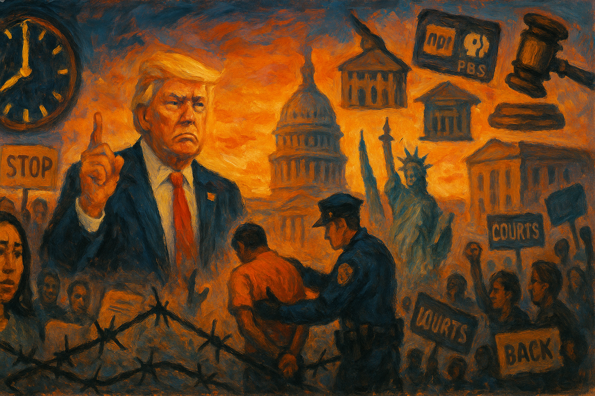

<!-- Generated by build_publish_week_v1 -->
<!-- Header image: image_wide_week19.png -->

# Week 19: The Ring Around Harvard

*One week widened the gap between executive discipline and institutional independence, while courts absorbed the strain of holding the line.*

The week did not open with a single shock. It opened with a rhythm already familiar by its nineteenth repetition: an order here, a pardon there, a lawsuit answering both. The Democracy Clock has tracked this rhythm for months, and this week it moved again, though barely. The story is not the size of the movement. It is what kept driving it forward.

At the close of last period, the clock stood at 7:40 p.m. By the end of this week, it had moved to 7:41 p.m., a shift of three-tenths of a minute. The change was small because much of what happened this week was continuation rather than escalation. The administration pressed harder on tools it had already built. Courts pushed back with tools they had already used. Neither side broke new structural ground. But neither side stood still, and the clock recorded that motion, however slight.

The clearest and most sustained development involved Harvard. The administration moved to strip the university's authority to enroll foreign students, reaching beyond ordinary regulation into the heart of academic operation. Judge Allison Burroughs issued a temporary restraining order within a day, holding the policy back before it could take effect. But the pressure did not stop at enrollment. Federal agencies were ordered to cut contracts with the university. Visa interviews for foreign students were paused nationwide while officials weighed expanded social media vetting. By week's end, the administration had gone further still, demanding that all foreign visitors to Harvard submit to social media screening.

Each of these moves, taken alone, might read as a policy dispute. Taken together, they formed a ring of pressure closing around a single institution: enrollment power, funding, visa access, and surveillance, all deployed in the same seven days against the same target. Burroughs extended her injunction a second time before the week ended, and the university's lawyers kept the case alive in court. But the administration kept pushing even under injunction, and that persistence marked something more durable than a single fight. It showed a template. Universities that draw executive displeasure can now expect coordinated pressure across many channels of federal power, not just one.

A second sustained development ran through immigration enforcement, where the week's numbers told their own story. Homeland Security leaders ordered agents to raise arrests to three thousand per day, a quota that pushes officers toward speed over care. The costs of that speed showed up quickly. A U.S. citizen was detained in an Alabama workplace raid. A four-year-old Mexican girl receiving life-saving medical care lost her humanitarian parole. A Georgia police officer resigned after wrongfully arresting an undocumented college student, a case that ended in ICE detention before the officer's own conscience caught up.

Courts spent much of the week trying to hold a line against this pace. Judge Brian Murphy again found that the administration had violated a prior order in a deportation case tied to South Sudan, and halted a new flight after finding the violation repeated. Judge Talwani protected a class of migrants from abrupt status loss. A district court preserved documents for a group of Venezuelan TPS holders. Yet the Supreme Court, at the very end of the week, allowed the administration to end humanitarian parole protections for CHNV migrants while the underlying case continued. That decision stripped legal footing from hundreds of thousands of people even as their claims remained unresolved. The pattern here was not simple defeat for either side. It was attrition: enforcement moving faster than courts could fully restrain it, and courts winning battles that left the larger war unsettled.

A third development, quieter in tone but heavy in implication, concerned clemency. President Trump pardoned Paul Walczak, a donor-adjacent figure convicted of tax crimes. He pardoned former sheriff Scott Jenkins, whose bribery conviction had sent him to prison for cash-for-badges corruption. He pardoned Todd and Julie Chrisley, reality television figures convicted of fraud and tax evasion, days after their daughter had lobbied publicly for clemency. He commuted the sentence of Larry Hoover, a former gang leader whose case drew attention for reasons unrelated to any of the others. The sheer volume of these actions in a single week, more than in most full months of ordinary governance, raised a plain question. Was the pardon power still an exceptional act of mercy, or had it become a routine channel for rewarding loyalty and access?

That question gained weight from parallel reporting. Trump family business interests received favorable treatment in Vietnam during ongoing trade talks, with a golf complex fast-tracked for approval even as tariff negotiations proceeded. Trump Media announced plans to raise two and a half billion dollars to buy Bitcoin, tying a political figure's private financial interests directly to policy areas his administration was shaping. None of these episodes required proof of an explicit quid pro quo to matter. Their cumulative weight showed a pattern: proximity to power increasingly determined who faced consequences and who did not.

Boeing added a further, starker case. In legal filings, the company admitted that employees had conspired to defraud the FAA over safety risks tied to the 737 Max, a plane whose failures had already cost lives. The administration's handling of this admission, alongside reports of the company's lobbying influence, reinforced a picture in which severe corporate wrongdoing met muted consequence. Ordinary citizens, meanwhile, faced quotas, raids, and clemency denied.

Running beneath all three of these developments was a fourth: the judiciary's role as the week's central check on power. Beyond Harvard and immigration, courts intervened repeatedly elsewhere. The Court of International Trade ruled that major Trump tariffs were unlawful, a decision the Federal Circuit temporarily stayed while appeals proceeded. That kept the underlying question of presidential trade power unresolved but contested. Judge Richard Leon granted summary judgment against the executive order targeting the law firm WilmerHale, finding the retaliation unconstitutional. Judge Liman barred the administration from withholding New York City funds over its congestion pricing policy, checking an attempt to use federal leverage against a disfavored jurisdiction. The D.C. Circuit denied government stays in cases brought by Middle East Broadcasting Networks and Radio Free Asia. A district court ordered continued funding for Radio Free Europe/Radio Liberty, protecting broadcasters whose survival the administration's funding actions had threatened.

By late May, courts had paused at least a hundred and seventy-seven separate Trump administration initiatives. That number, standing alone, might read as a story of judicial strength. But it also reads as a story of judicial exhaustion. Federal judges were reported to be discussing whether they needed their own armed security force, and that discussion speaks less to institutional confidence than to institutional fear. Courts were doing the work the system asks of them, and doing a great deal of it. Whether that volume was sustainable, or whether it merely delayed rather than resolved the underlying contest over executive power, remained an open question the week did not answer.

A fifth development touched the public record itself. The White House stopped publishing and removed official transcripts of the president's speeches, replacing them with limited video access, a change that narrowed the documentary trail available to future scrutiny. The State Department closed its office of analytic outreach, cutting off one channel through which outside expertise had once informed foreign policy. PBS sued the administration over an order targeting its federal funding, following NPR's earlier suit over similar grounds. Both broadcasters treated funding threats as constitutional injuries rather than ordinary budget disputes. None of these actions alone rewrote the information landscape. Together, they thinned it.

Congress, meanwhile, played a supporting rather than a leading role. The House passed a sweeping tax-and-spending package that paired cuts with expanded deportation funding and reductions to safety-net programs, sending fiscal policy in the same direction enforcement had already been moving. The administration's own budget proposals pushed more money toward ICE and the Pentagon. Some Republican lawmakers threatened to block the package over deficit concerns, a reminder that friction persisted even within the governing coalition. But the broad shape of the legislative week reinforced, rather than checked, the priorities driving executive action.

Identity and education became another front this week. Oklahoma's state superintendent installed a new social studies curriculum embedding 2020 election conspiracy theories and Christian nationalist themes into public instruction, a change parents and teachers moved quickly to challenge in court. The Justice Department opened an investigation into California's law on transgender athletes, using federal civil rights authority to press a state policy dispute. Idaho, Montana, and Utah enacted bans on LGBTQ+ flags at public buildings and schools. None of these actions required new constitutional doctrine. Each used existing legal tools to narrow the space for identity, memory, and civic instruction that fell outside the administration's preferred narrative.

A final, quieter thread ran through election administration. The administration sued North Carolina's election board over voter record requirements, while Republican officials in several states advanced measures making ballot initiatives harder to use. Neither action commanded headlines on its own, but together they added another layer to a broader pattern: narrowing the channels through which citizens could act outside ordinary electoral politics, while framing the changes as protections for integrity rather than restrictions on participation.

Two scheduled matters carried into the following period. The Federal Circuit's stay of the tariff ruling left the underlying question of presidential trade authority pending before higher courts. The Supreme Court's order permitting termination of CHNV parole protections took effect immediately, even as the broader legal challenge to that termination continued in the lower courts.

What this week demonstrated was not rupture but reinforcement. The administration did not discover new powers; it used familiar ones with less hesitation, across more fronts, against more targets, in the same seven days. Courts did not weaken. They worked harder, and their capacity to absorb the volume of conflict directed at them showed signs of strain even as their rulings held. Clemency, corporate accommodation, and executive pressure on universities and broadcasters moved together, each reinforcing the sense that proximity to power shaped outcomes more than the ordinary application of law. The week did not tip toward collapse. It also did not tip back. It held its ground on a widening field, and the ground itself had shifted since the year began.

<!-- Synopses for cross-posting -->
Long Synopsis: The Democracy Clock moved from 7:40 p.m. to 7:41 p.m. this week, a slight shift reflecting continuation rather than rupture. The administration escalated a coordinated campaign against Harvard, combining enrollment revocation, contract cuts, visa freezes, and demands for social media screening. Immigration enforcement intensified through arrest quotas even as courts blocked deportation violations and preserved migrant protections, though the Supreme Court allowed CHNV parole terminations to proceed. A cluster of pardons for donor-adjacent and politically connected figures, alongside Boeing's admitted fraud drawing muted consequence, deepened concerns about selective accountability. Courts paused at least 177 administration initiatives by week's end, even as federal judges reportedly discussed needing armed security. The White House also removed presidential transcripts and closed a State Department analytic office, narrowing public records further.
Short Synopsis: A week of continuation rather than rupture: coordinated pressure on Harvard, intensified immigration enforcement, a burst of pardons for connected allies, and courts working overtime to hold ground against expanding executive reach.

