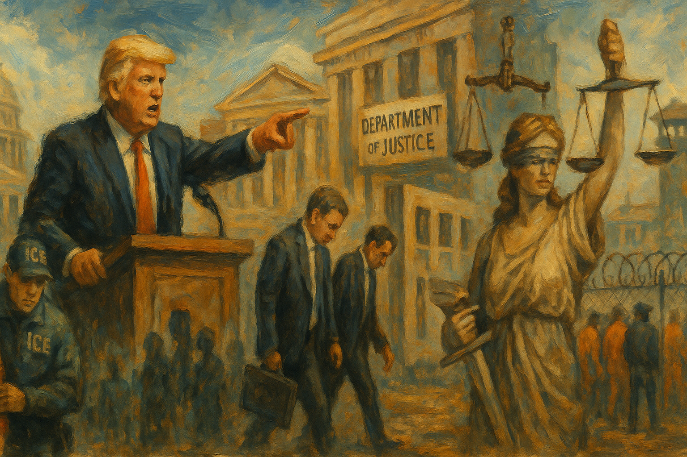

<!-- Generated by build_publish_week_v1 (appendix post) -->
<!-- Header image: image_wide_week2_appendix.png -->

# Week 2 Appendix: Law and Memory as Weapons

*In Trump’s second week back in power, pardons, purges, and data erasure turned law, citizenship, and information into tools of loyalty and fear.*

This was an acute rupture week: a sitting president used executive power to attack nearly every major democratic safeguard simultaneously, while courts and civil society mounted only partial, reactive resistance. Structurally, the heaviest pressure fell on civil service independence, oversight institutions, immigration/citizenship equality, and the rule of law. Trump’s mass firings of inspectors general, DOJ and FBI officials, NLRB and EEOC leaders, combined with Schedule F–style civil service politicization and mass resignation offers, directly hollowed out neutral administration. Parallel moves—blanket pardons for January 6 offenders, closing Jan. 6 cases, and purging prosecutors—recast law as a weapon of the executive and removed accountability for regime-aligned violence. Immigration and citizenship policy shifted toward stratified status and mass detention, including Guantánamo expansion, raids in schools and churches, and attempts to end birthright citizenship. Information and memory were aggressively curated through DEI purges, climate and Jan. 6 data removal, and education orders targeting ‘indoctrination.’ Courts blocked some funding freezes and the birthright order, and state and civil society actors sued over raids and civil service politicization, but these were defensive brakes against a coordinated power grab.

Power and Authority

1. President Donald Trump met with New York City mayor Eric Adams amid speculation about a pardon (2025-01-25): The meeting between Trump and indicted mayor Eric Adams, shortly before inauguration, raised concerns that presidential clemency could be used to shield political figures from federal corruption accountability.

2. President Donald Trump canceled flights for 1,600 Afghan refugees bound for the United States (2025-01-25): Canceling refugee flights for Afghans who aided U.S. forces signaled a willingness to abandon vulnerable allies and use executive power to sharply restrict humanitarian admissions.

3. President Donald Trump declared a state of emergency at the southern border (2025-01-25): Declaring a border emergency expanded unilateral authority over immigration enforcement and resources, normalizing emergency framing for long‑running policy disputes.

4. President Donald Trump issued executive orders dismantling federal DEI and affirmative action programs (2025-01-25): Eliminating diversity, equity, and inclusion and affirmative action initiatives across the federal government reduced institutional commitments to equal opportunity in hiring and contracting.

5. President Donald Trump disbanded the Equal Employment Opportunity Commission by executive order (2025-01-25): Abolishing the EEOC stripped a key federal mechanism for enforcing anti‑discrimination law in workplaces, weakening protections for workers facing bias.

6. President Donald Trump authorized ICE agents to enter schools and churches to search for migrants (2025-01-25): Allowing immigration raids in schools and houses of worship eroded long‑standing protections for sensitive spaces and increased coercive pressure on immigrant communities.

7. President Donald Trump froze almost all foreign aid except military assistance to Israel and Egypt (2025-01-24): Halting congressionally appropriated foreign aid without statutory authority challenged legislative control of spending and disrupted U.S. diplomatic and humanitarian commitments.

8. President Donald Trump froze funding for congressionally approved infrastructure projects (2025-01-25): Blocking infrastructure funds that Congress had already approved asserted presidential control over the purse, undermining separation of powers and delaying public works.

9. President Donald Trump withdrew the United States from the Paris climate accords and the World Health Organization (2025-01-25): Exiting major climate and health agreements weakened multilateral cooperation and signaled a retreat from shared global problem‑solving.

10. President Donald Trump demanded that NATO members raise military spending to 5% of GDP (2025-01-25): Pressuring allies to meet an unprecedented defense‑spending target risked destabilizing NATO burden‑sharing norms and cooperative security arrangements.

11. President Donald Trump directed the military to resume delivery of 2,000‑pound bombs to Israel (2025-01-25): Ordering renewed heavy‑bomb shipments to Israel reversed prior constraints and deepened U.S. involvement in a contested conflict, with implications for civilian protection and regional stability.

12. President Donald Trump announced a proposal to relocate Gaza’s population to other Arab countries (2025-01-25): Advocating mass relocation of Gazans disregarded self‑determination norms and signaled support for demographic engineering as a policy tool.

13. White House personnel teams under President Trump screened civil service job applicants for loyalty to the president (2025-01-25): Loyalty vetting of applicants undermined merit‑based hiring and moved the bureaucracy toward partisan patronage.

14. President Donald Trump declared an energy emergency to roll back appliance efficiency standards (2025-01-26): Using an emergency declaration to weaken efficiency rules expanded executive discretion over long‑term regulatory policy beyond acute crises.

15. President Donald Trump issued mass pardons and commutations for roughly 1,500 January 6 defendants (2025-01-20): Blanket clemency for January 6 offenders signaled tolerance for pro‑regime political violence and weakened deterrence against future attacks on democratic institutions.

16. President Donald Trump signed executive orders diverting California water and overriding state policies (2025-01-26): Directing federal agencies to override California’s water management and endangered‑species protections asserted federal leverage over state environmental policy and funding.

17. President Donald Trump froze travel and communications at the Department of Health and Human Services (2025-01-24): Halting HHS travel and communications constrained public‑health agencies’ ability to share information and coordinate responses, centralizing control in the White House.

18. President Donald Trump ordered a broad freeze on federal grants, loans, and financial assistance (2025-01-27): Freezing trillions in congressionally appropriated aid and grants attempted to subordinate legislative budget authority to presidential ideological review.

19. President Donald Trump rescinded the federal funding freeze memo after legal and political backlash (2025-01-29): Withdrawing the funding‑freeze directive limited immediate damage but underscored the administration’s willingness to test constitutional limits on spending control.

20. President Donald Trump issued executive orders restructuring military personnel and DEI policies (2025-01-27): Orders banning transgender service, abolishing military DEI offices, and reinstating vaccine‑refusers reoriented personnel rules toward ideological criteria over inclusive readiness standards.

21. President Donald Trump invoked the Alien Enemies Act to target undocumented immigrants as a crime threat (2025-01-28): Framing undocumented immigrants as enemy aliens responsible for a “crime wave,” despite contrary data, repurposed an old national‑security statute for domestic immigration crackdowns.

22. President Donald Trump signed an executive order ending birthright citizenship for children of noncitizens (2025-01-20): Attempting to end birthright citizenship by executive order challenged a core interpretation of the Fourteenth Amendment and threatened to create a class of stateless U.S.‑born children.

23. President Donald Trump ordered deportation flights to Colombia to resume after tariff threats (2025-01-28): Restarting deportation flights following economic pressure on Colombia illustrated the use of trade leverage to secure foreign cooperation with domestic enforcement priorities.

24. President Donald Trump revoked deportation protections and TPS extensions for Venezuelans (2025-01-28): Canceling deportation protections and TPS for hundreds of thousands of Venezuelans exposed them to removal despite ongoing instability in their home country.

25. President Donald Trump signed an executive order restricting gender‑affirming care for minors and cutting related federal funding (2025-01-28): Barring federal support and coverage for gender‑affirming care for youth used executive power to limit access to medically endorsed treatment for a targeted group.

26. President Donald Trump paused approvals for new renewable energy projects on public lands and waters (2025-01-28): Blocking new renewable leases and approvals on federal lands slowed the energy transition and concentrated discretion over climate‑relevant infrastructure in the executive.

27. President Donald Trump eliminated federal‑level AI safety requirements by executive order (2025-01-28): Removing AI safety oversight at the federal level prioritized rapid deployment over risk governance, shifting responsibility away from public regulators.

28. President Donald Trump ordered the opening of a 30,000‑person migrant detention facility at Guantánamo Bay (2025-01-29): Expanding Guantánamo for mass migrant detention exported immigration enforcement to an offshore military site with weaker legal protections and oversight.

29. President Donald Trump issued guidance creating a new Schedule Policy/Career category to strip civil service protections (2025-01-24): Reviving Schedule F‑style rules to reclassify policy‑related civil servants weakened job protections and made dismissal for political reasons easier.

30. Office of Personnel Management under Trump offered mass deferred‑resignation deals and buyouts to federal employees (2025-01-27): Emailing nearly all federal workers with inducements to resign by fall sought to clear space for loyal replacements and destabilized the nonpartisan bureaucracy.

31. President Donald Trump fired 18 inspectors general and ordered dismissal of independent anti‑corruption inspectors (2025-01-24): Removing inspectors general across multiple agencies without required notice dismantled internal watchdog capacity and reduced checks on executive misconduct.

32. President Donald Trump fired Democratic appointees from the NLRB and EEOC before their terms expired (2025-01-30): Removing labor and civil‑rights regulators mid‑term, despite statutory protections, undermined agency independence and enforcement of worker protections.

33. President Donald Trump issued an executive order stripping many civil servants of employment protections (2025-01-30): Curtailing statutory job protections for federal employees made it easier to purge perceived opponents and politicize the administrative state.

34. President Donald Trump issued an executive order on FAA staffing blaming prior diversity policies for a fatal crash (2025-01-31): Using an air disaster to justify rolling back diversity‑oriented hiring at the FAA politicized safety policy and targeted inclusion efforts without evidence.

35. President Donald Trump issued an executive order titled Unleashing Prosperity Through Deregulation (2025-01-31): Requiring repeal of at least ten regulations for each new one and imposing a negative cost cap shifted federal rulemaking toward aggressive deregulation regardless of public‑interest impacts.

36. President Donald Trump ordered USDA to remove climate‑crisis content from agency websites (2025-01-31): Directing USDA to take down climate‑related web pages suppressed public access to scientific information and constrained agencies’ ability to communicate environmental risks.

37. President Donald Trump ordered removal of DEI language from IRS materials and set up a DEI tip line (2025-01-31): Scrubbing DEI references from IRS guidance and encouraging reports on such content institutionalized hostility to equity efforts within tax administration.

38. President Donald Trump signed an executive order renaming the Gulf of Mexico as the Gulf of America (2025-01-29): Renaming a major body of water by decree used symbolic power to assert nationalist branding, drawing criticism as a politicization of geographic nomenclature.

39. President Donald Trump issued executive orders canceling federal diversity programs government‑wide (2025-01-30): Canceling diversity programs across agencies reduced institutional support for addressing discrimination and representation in federal workplaces.

40. President Donald Trump issued an executive order affecting treatment of transgender people in federal prisons (2025-01-30): Mandating transfers of trans women to men’s prisons and halting gender‑affirming care in custody curtailed protections for a vulnerable incarcerated group.

41. President Donald Trump signed an executive order blaming DEI for aviation dangers after a fatal crash (2025-01-30): Linking a deadly collision to diversity policies without evidence used tragedy to justify rolling back inclusion initiatives in aviation oversight.

42. President Donald Trump signed an executive order establishing a task force for America’s 250th birthday (2025-01-29): Creating a presidentially chaired semiquincentennial task force centralized control over national historical commemoration and revived prior monument‑focused orders.

43. President Donald Trump signed an executive order on educational freedom and ending radical indoctrination in K‑12 schooling (2025-01-29): Linking federal education funds to school‑choice priorities and defunding programs labeled as radical or anti‑American increased federal leverage over curriculum content.

44. President Donald Trump signed the Laken Riley Act expanding mandatory detention of undocumented immigrants (2025-01-29): Enacting the Laken Riley Act broadened ICE’s authority to detain immigrants based on charges rather than convictions and empowered states to sue over federal enforcement choices.

45. President Donald Trump signed an executive order seeking to deport international students who joined pro‑Palestinian protests (2025-01-29): Targeting foreign students for deportation based on protest participation linked immigration status to political expression and chilled campus dissent.

46. President Donald Trump signed an executive order blaming DEI for flight dangers and directing policy changes (2025-01-30): Using an executive action to tie aviation risk to diversity initiatives reframed inclusion policies as safety threats and justified their rollback.

47. President Donald Trump signed an executive order on additional measures to combat antisemitism (2025-01-29): Directing agencies to intensify use of civil‑rights tools against antisemitism, especially on campuses, expanded federal scrutiny of certain speech and association in educational settings.

48. President Donald Trump signed an executive order on military excellence and readiness restricting transgender service and pronoun use (2025-01-27): Recasting gender identity as incompatible with military standards narrowed who can serve and embedded cultural priorities into defense personnel policy.

49. President Donald Trump signed an executive order titled The Iron Dome For America to build a national missile defense shield (2025-01-27): Mandating a next‑generation missile defense architecture committed large defense resources through executive direction, shaping long‑term security policy with limited legislative input.

50. President Donald Trump signed an executive order protecting children from chemical and surgical mutilation (2025-01-28): Barring federal funding and coverage for gender‑affirming procedures for minors used federal spending power to restrict a contested area of medical care nationwide.

51. President Donald Trump signed an executive order unleashing prosperity through deregulation (2025-01-31): Imposing a ten‑for‑one repeal rule for new regulations constrained agencies’ ability to respond to emerging risks and favored deregulatory outcomes.

52. President Donald Trump signed an executive order on FAA staffing emphasizing merit‑based recruitment (2025-01-31): Reframing prior diversity‑oriented hiring as illegal and ordering a return to narrow merit criteria reshaped staffing rules in a key safety agency along ideological lines.

53. President Donald Trump signed an executive order on aviation safety rolling back diversity initiatives (2025-01-31): Rolling back diversity initiatives in aviation under the banner of safety shifted regulatory priorities and signaled skepticism toward inclusion efforts in technical roles.

54. President Donald Trump signed an executive order on celebrating America’s 250th birthday reinstating monument‑protection orders (2025-01-29): Reinstating prior monument‑protection orders through a semiquincentennial directive reinforced a narrative of safeguarding traditional symbols against protest or reinterpretation.

55. President Donald Trump signed an executive order expanding educational freedom and opportunity for families (2025-01-29): Prioritizing school choice in federal education funding guidance shifted support toward alternative schooling models and away from traditional public systems.

Institutions and Governance

1. U.S. Senate confirmed Kristi Noem as Secretary of Homeland Security (2025-01-25): Confirming a close Trump ally to lead DHS placed immigration and internal security agencies under more ideologically aligned leadership, affecting enforcement priorities and oversight.

2. U.S. Senate confirmed Pete Hegseth as Secretary of Defense by tie‑breaking vote (2025-01-24): Installing a polarizing media figure with limited conventional defense experience to run the Pentagon raised concerns about politicization of military leadership.

3. U.S. Senate and President Donald Trump advanced and supported controversial nominations for RFK Jr., Kash Patel, Tulsi Gabbard, and Pam Bondi (2025-01-29): Hearings for key health, intelligence, FBI, and Justice posts highlighted efforts to place ideologically aligned or controversial figures atop major institutions, potentially weakening their independence.

4. Federal courts issued multiple stays and injunctions blocking Trump’s federal funding freeze (2025-01-28): Judges in several jurisdictions temporarily halted the administration’s attempt to freeze grants and loans, reinforcing congressional spending authority and checking executive overreach.

5. Federal courts temporarily blocked Trump’s attempt to end birthright citizenship (2025-01-29): A federal judge’s temporary block on the birthright‑citizenship order preserved existing constitutional practice while litigation proceeds.

6. Federal courts issued stays related to Trump’s federal grants and loans freeze and ordered funds released (2025-01-28): Court orders requiring continued disbursement of federal funds mitigated immediate harm to state services and underscored judicial oversight of impoundment attempts.

7. Federal courts handled litigation over immigration enforcement in sensitive locations and civil service politicization (2025-01-27): Lawsuits by Quaker congregations and civil servants challenged new enforcement and personnel policies, using the judiciary to contest executive encroachments on rights and neutrality.

8. Federal courts intervened in Trump administration handling of January 6 cases and supervised‑release conditions (2025-01-27): Judicial actions, including lifting Stewart Rhodes’s DC ban after commutation and reviewing DOJ case handling, showed courts adapting to executive clemency while trying to preserve some oversight.

9. Department of Justice under Acting Attorney General James McHenry fired dozens of prosecutors and lawyers involved in cases against Donald Trump and January 6 defendants (2025-01-27): Purging prosecutors tied to Trump and insurrection cases compromised DOJ independence and signaled that legal careers depend on alignment with presidential interests.

10. Department of Justice removed its public database of January 6 prosecutions (2025-01-26): Taking down the Jan. 6 case database reduced transparency about accountability for the Capitol attack and hindered public tracking of outcomes.

11. Department of Justice launched a special project reviewing handling of January 6 criminal cases (2025-01-27): Re‑examining Jan. 6 prosecutions under new leadership raised concerns that accountability efforts could be softened or reversed for political reasons.

12. Trump administration closed the case against former co‑defendants in the classified documents probe (2025-01-29): Ending prosecutions of Trump’s co‑defendants in the documents case reduced legal scrutiny of alleged mishandling of state secrets by insiders.

13. U.S. Congress enacted the Laken Riley Act expanding immigration detention authority (2025-01-29): Passing and signing the Laken Riley Act codified broader mandatory detention for certain undocumented immigrants and gave states new tools to pressure federal enforcement.

14. Representative Andy Ogles introduced a constitutional amendment bill to allow Donald Trump a third presidential term (2025-01-29): Proposing to relax the two‑term limit for presidents moved the idea of extended tenure from rhetoric into formal constitutional debate.

15. Senator Mike Lee proposed authorizing privateering against drug cartels (2025-01-29): Reviving privateering concepts for cartel enforcement blurred lines between state and private violence and raised legal questions about delegating war‑like powers.

16. Federal Election Commission announced a Sunshine Act meeting and adjusted campaign finance limits for inflation (2025-01-27): Routine FEC actions on open meetings and updated contribution limits maintained procedural transparency and adapted campaign finance rules to current economic conditions.

17. National Archives and Records Administration invited public comment on federal records schedules and appointed SES review board members (2025-01-28): NARA’s records‑schedule notice and SES board appointments reflected ongoing institutional processes for managing federal records and senior‑staff accountability.

18. Environmental Protection Agency delayed effective dates of several regulations and reopened comment periods on six actions (2025-01-28): Delaying environmental rules under a regulatory freeze while reopening comment on others showed how executive directives can slow protections even as formal participation continues.

19. General Services Administration postponed GSAR amendments and sought comment on overseas employment and SAM notarization rules (2025-01-27): GSA’s postponement of acquisition‑rule changes and solicitation of comments on employment and registration forms illustrated how regulatory freezes ripple through procurement and personnel systems.

20. Drug Enforcement Administration processed multiple applications to import or manufacture controlled substances for research and diagnostics (2025-01-28): DEA’s handling of controlled‑substance import and manufacturing applications showed ongoing regulatory oversight of sensitive pharmaceuticals despite broader political turmoil.

21. Illinois Governor JB Pritzker barred January 6 participants from state employment by executive order (2025-01-30): Illinois’s move to exclude insurrection participants from state jobs used state authority to reinforce accountability norms for attacks on democratic institutions.

22. U.S. Congress held hearings and boycotts over Russ Vought’s OMB nomination and RFK Jr.’s HHS nomination (2025-01-30): Senate Democrats’ boycott of Vought’s markup and tough questioning of RFK Jr. signaled legislative concern about nominees seen as threats to budget norms and public‑health policy.

23. U.S. Congress introduced bipartisan bills to improve pay and support for federal wildland firefighters (2025-01-30): New House and Senate bills to stabilize firefighter pay and careers aimed to strengthen a critical public‑safety workforce through legislative action.

24. U.S. Congress froze federal grants and loans via OMB memo without clear authorization, prompting oversight concerns (2025-01-27): An OMB memo halting grants and loans without explicit statutory basis raised alarms about unilateral budget control and triggered talk of a constitutional confrontation.

25. Federal courts handled cross‑state abortion and homelessness litigation (2025-01-30): Cases over a New York doctor indicted in Louisiana and anti‑camping rules in Oregon showed courts arbitrating conflicts between state policies and individual rights.

26. Federal courts oversaw settlement of high‑profile defamation and First Amendment cases involving media and Meta (2025-01-30): Settlements in defamation and free‑speech litigation involving ABC News and Meta highlighted how powerful actors resolve speech disputes through negotiated payouts rather than full trials.

27. U.S. Senate Judiciary Committee held a confirmation hearing for Pam Bondi as Attorney General (2025-01-31): Bondi’s hearing, including questions on gun policy and enforcement priorities, foreshadowed how DOJ leadership might approach rights and public‑safety tradeoffs.

28. U.S. Congress called Chicago’s mayor to testify on sanctuary city policies (2025-01-30): Republican efforts to summon Chicago’s mayor for hearings on sanctuary policies used congressional oversight to pressure local choices on cooperation with federal immigration enforcement.

29. Federal courts indicted and sentenced high‑profile political figures for corruption and bribery (2025-01-29): The indictment of Eric Adams and sentencing of Bob Menendez to 11 years demonstrated that federal courts continued to prosecute corruption among powerful officials.

30. Federal courts issued an injunction against Trump’s attempt to impound funds owed to states (2025-01-30): A district court’s injunction against impounding state‑directed funds protected state budgets and reinforced that the executive cannot unilaterally withhold appropriated money.

Economic Structure

1. President Donald Trump launched a personal cryptocurrency branded $Trump (2025-01-22): Creating a presidentially branded cryptocurrency blurred lines between public office and private speculation, raising conflict‑of‑interest and consumer‑protection concerns.

2. Trump administration froze and then rescinded a broad pause on federal grants and loans (2025-01-29): The abrupt freeze and reversal of federal financial assistance disrupted Medicaid portals and other services, illustrating how executive maneuvers can destabilize core social programs.

3. Trump administration halted foreign aid appropriated by Congress (2025-01-27): Freezing foreign aid programs undermined long‑standing U.S. development and humanitarian efforts, potentially ceding influence to rival powers.

4. President Donald Trump imposed new tariffs on Colombia, Canada, Mexico, and China (2025-01-31): Tariffs tied to deportation disputes and broader trade policy risked retaliatory measures and economic strain for workers and consumers in multiple countries.

5. Trump administration froze NIH funding and imposed new restrictions on health researchers (2025-01-30): Pausing NIH support and adding constraints on fellows threatened continuity of biomedical research and the careers of early‑stage scientists.

6. Trump administration halted approvals for renewable energy projects on federal lands and waters (2025-01-28): Blocking new renewable projects on public lands slowed clean‑energy investment and favored incumbent fossil‑fuel interests.

7. Trump administration delayed multiple FDA and EPA regulations under a regulatory freeze (2025-01-27): Delaying health and environmental rules shifted regulatory timelines in ways that can benefit regulated industries at the expense of public protections.

8. Jared Kushner and Affinity Partners positioned private investments to benefit from potential Gaza redevelopment (2025-01-27): Kushner’s financial stake in Gaza‑related real estate created potential conflicts between private profit and U.S. foreign‑policy decisions on Palestinian displacement.

9. Trump Organization issued an ethics statement while pursuing Trump Tower Belgrade on Serbian state land (2025-01-27): Pledging to avoid foreign‑government business while building on government‑owned land via a private partner highlighted loopholes in self‑imposed ethics rules.

10. Trump Media and Technology Group announced a crypto‑focused financial brand called Truth.Fi (2025-01-31): Expanding a politically connected media company into large‑scale crypto investments raised questions about regulatory oversight and entanglement of political influence with speculative finance.

11. Meta Platforms and Donald Trump settled Trump’s lawsuit over his suspension for $25 million (2025-01-31): A large settlement tied to Trump’s future cooperation with Meta suggested that political leverage can shape corporate accountability and platform decisions.

12. Senator Mike Lee called for abolishing the Transportation Security Administration (2025-01-27): Proposing to dismantle TSA and shift screening to airlines would significantly restructure federal responsibility for aviation security.

13. House Republicans and President Donald Trump discussed potentially abolishing FEMA at a Florida retreat (2025-01-26): Entertaining abolition of FEMA signaled openness to shrinking federal disaster response, which could leave states and individuals more exposed to catastrophic risk.

14. Trump administration and Elon Musk’s allies pressured Treasury and OPM systems, contributing to a senior official’s resignation (2025-01-31): Conflicts over access to sensitive payment systems and HR data, culminating in David Lebryk’s departure, highlighted growing private influence over core financial infrastructure.

15. Texas energy sector continued rapid build‑out of solar power capacity (2025-01-28): Texas’s leadership in solar deployment illustrated how market forces and state policy can drive large‑scale renewable adoption even amid federal headwinds.

16. Biden administration pursued antitrust actions against major tech companies (2025-01-28): Ongoing antitrust efforts against dominant tech firms reflected attempts to curb concentrated economic and political power in digital markets.

17. DeepSeek, a Chinese AI company released open‑source large language models rivaling U.S. systems (2025-01-30): China’s release of competitive open‑source AI models complicated U.S. efforts to maintain technological advantage through export controls and proprietary development.

18. Trump administration halted federal grants and loans that included DEI provisions (2025-01-27): Conditioning federal funding on exclusion of DEI initiatives tied access to public resources to compliance with the administration’s ideological agenda.

19. Organic Consultants LLC, Aveva, Vici Health Sciences, Medi‑Physics, and Catalent sought DEA registrations for controlled substances manufacturing or import (2025-01-28): Multiple firms’ applications to handle controlled substances for research and diagnostics underscored the role of federal licensing in shaping pharmaceutical and research markets.

Civil Rights and Dissent

1. President Donald Trump commuted the sentence and later pardoned Oath Keepers leader Stewart Rhodes (2025-01-25): Clemency for a leader convicted of seditious conspiracy signaled leniency toward organized political violence against Congress.

2. Trump administration directed ICE to conduct large‑scale raids with arrest quotas and in sensitive locations (2025-01-26): Aggressive ICE operations with daily arrest targets, raids in churches and schools, and multi‑agency sweeps heightened fear and risk of rights violations in immigrant and Indigenous communities.

3. Oklahoma State Board of Education required proof of citizenship or immigration status for public school enrollment (2025-01-28): Mandating status documentation for K‑12 enrollment threatened to deter undocumented families from sending children to school, undermining equal access to education.

4. President Donald Trump rescinded deportation protections and TPS for Venezuelans in the U.S. (2025-01-28): Ending protections for Venezuelans fleeing crisis exposed them to removal and signaled a harsher stance toward humanitarian relief for certain nationalities.

5. President Donald Trump issued orders targeting transgender youth healthcare and transgender students’ rights (2025-01-28): Federal actions cutting funds for gender‑affirming care and imposing bathroom bans curtailed protections for transgender minors in health and education systems.

6. President Donald Trump attempted to end birthright citizenship for children of noncitizens (2025-01-20): The birthright‑citizenship order, though blocked, threatened to create a hereditary underclass lacking full civic membership based on parentage.

7. Trump administration invoked the Alien Enemies Act and framed undocumented immigrants as a crime wave (2025-01-28): Using an antiquated national‑security law and misleading crime claims to justify crackdowns cast immigrant communities as inherent security threats.

8. Trump administration planned to detain up to 30,000 migrants at Guantánamo Bay (2025-01-30): Routing migrants to an offshore military facility associated with terrorism detention raised serious due‑process and human‑rights concerns.

9. Trump administration expanded use of military facilities for immigration detention and processing (2025-01-29): Allowing ICE to use Buckley Space Force Base for migrant processing blurred lines between civilian immigration enforcement and military infrastructure.

10. Trump administration moved to deport international students who participated in pro‑Palestinian protests (2025-01-29): Threatening deportation for campus protesters weaponized immigration status against political expression and academic freedom.

11. Quaker congregations and allied groups filed lawsuits challenging ICE access to churches and sensitive locations (2025-01-27): Faith communities turned to the courts to defend religious freedom and sanctuary norms against expanded immigration enforcement in sacred spaces.

12. Navajo Nation leaders and advocates raised concerns about Indigenous people being swept up in immigration raids (2025-01-27): Reports of Indigenous Americans questioned or detained in border sweeps highlighted risks of racial profiling and jurisdictional confusion.

13. ICE agents in Milwaukee wrongfully detained Puerto Rican U.S. citizens during an enforcement action (2025-01-29): Detaining a Puerto Rican family until they proved citizenship underscored how aggressive enforcement can erode rights even for citizens of color.

14. Judge Griffin and North Carolina litigants pursued litigation to overturn Justice Alison Riggs’s election by discarding 60,000 votes (2025-01-26): Efforts to invalidate tens of thousands of ballots in a state supreme court race echoed broader attempts to undo certified election results through the courts.

15. Common Cause NC, Emancipate, and allied groups mobilized voters against attempts to discard ballots in North Carolina (2025-01-26): Grassroots organizing, legal advocacy, and public education campaigns sought to defend voters whose ballots were at risk of being thrown out.

16. Siembra NC expanded ICE watch programs to monitor immigration enforcement in North Carolina (2025-01-26): Community‑based ICE watch efforts aimed to protect undocumented residents by tracking raids and sharing information about enforcement activity.

17. Disability Rights Oregon sued Grants Pass over enforcement of anti‑camping ordinances (2025-01-30): Challenging camping bans that left disabled unhoused people with no legal place to sleep tested how far localities can go in criminalizing homelessness.

18. Federal courts blocked Kalispell, Montana, from closing a homeless shelter (2025-01-27): An injunction protecting a homeless shelter limited local efforts to displace unhoused residents without adequate alternatives.

19. Louisiana prosecutors and a grand jury indicted a New York doctor for prescribing abortion pills to a Louisiana minor (2025-01-31): Charging an out‑of‑state physician for telehealth abortion care tested the reach of restrictive state laws across borders and shield‑law protections.

20. Illinois Governor JB Pritzker barred January 6 participants from state employment (2025-01-30): Illinois’s employment ban for insurrectionists used state hiring power to reinforce consequences for anti‑democratic violence.

21. Trump administration changed federal prison policy to transfer trans women to men’s facilities and halt gender‑affirming care (2025-01-30): New prison rules increased physical and psychological risks for transgender inmates by disregarding gender identity in housing and treatment decisions.

22. Trump administration lifted protections against immigration raids in schools, churches, and hospitals (2025-01-30): Removing sensitive‑location safeguards expanded where enforcement could occur, discouraging immigrants from accessing education, worship, and healthcare.

23. Trump administration used Guantánamo Bay and military bases for migrant detention and processing (2025-01-29): Relying on military installations for civil immigration detention blurred civilian‑military boundaries and placed detainees in more remote, less transparent settings.

24. Trump administration expanded use of the Laken Riley Act to detain immigrants arrested for minor offenses (2025-01-29): Allowing detention and deportation based on low‑level charges, without conviction, broadened state power over noncitizens and increased vulnerability to arbitrary enforcement.

Information, Memory and Manipulation

1. Trump administration removed DOJ’s public database of January 6 defendants and outcomes (2025-01-26): Deleting the Jan. 6 prosecutions database obscured the public record of accountability for the Capitol attack and hindered independent analysis.

2. Trump administration ordered USDA and Forest Service to take down climate‑crisis web content (2025-01-31): Removing climate‑related pages from federal websites limited public access to scientific information and erased official acknowledgment of climate risks.

3. Trump administration deleted DEI references from IRS materials and removed diversity webpages (2025-01-31): Scrubbing diversity language and resources from IRS documents sanitized the historical record of equity efforts within the tax agency.

4. U.S. Air Force removed material on Black and female WWII pilots from training to comply with Trump’s DEI order (2025-01-25): Erasing Tuskegee Airmen and WASP content from training curricula diminished recognition of marginalized groups’ contributions to U.S. military history.

5. Trump administration suspended DEI‑related training materials at the State Department’s Foreign Service Institute (2025-01-22): Pulling hundreds of DEI‑related courses from diplomatic training constrained efforts to build an inclusive foreign‑service culture.

6. President Donald Trump and Elon Musk’s allies used a “government efficiency” initiative to seek opaque access to personnel data and influence HR systems (2025-01-27): Lawsuits and reports about Musk‑linked data collection and system lockouts at OPM raised alarms about private actors controlling sensitive government information.

7. Trump administration locked EPA employees’ status to probationary and limited their job security (2025-01-29): Reclassifying over 1,100 EPA staff as probationary increased vulnerability to dismissal and may chill internal dissent about environmental policy changes.

8. Trump administration removed or withheld records related to the Cop City protest killing until investigative reporting (2025-01-28): State withholding of documents on Manuel Paez Terán’s killing, later obtained by journalists, limited transparency around a controversial police operation.

9. President Donald Trump falsely claimed the U.S. military entered California to turn on water supplies (2025-01-27): Misrepresenting routine water‑pump maintenance as military intervention distorted public understanding of federal‑state relations and environmental management.

10. White House Press Secretary Karoline Leavitt made misleading claims about foreign aid being spent on condoms for Gaza (2025-01-28): False assertions about aid spending were used to justify halting foreign assistance, illustrating how misinformation can frame major policy shifts.

11. President Donald Trump blamed DEI policies for a fatal DC air crash without evidence (2025-01-31): Speculating that diversity hiring caused an aviation disaster politicized tragedy and fueled narratives against inclusion initiatives.

12. President Donald Trump claimed undocumented immigrants were driving a crime wave despite data showing declines (2025-01-28): Using inaccurate crime statistics to justify invoking the Alien Enemies Act framed immigrants as dangerous and supported harsher enforcement.

13. Elon Musk supported far‑right politicians abroad and spread smears against foreign leaders (2025-01-27): Musk’s amplification of far‑right narratives and gestures abroad raised concerns about wealthy individuals influencing democratic discourse in multiple countries.

14. Federal Communications Commission under Chair Brendan Carr opened investigations into NPR, PBS, and requested unedited CBS interview transcripts (2025-01-29): Targeting public broadcasters and demanding raw interview materials risked chilling editorial independence and advantaging more government‑aligned outlets.

15. Pentagon reallocated press‑corps seating to favor pro‑Trump outlets over legacy media (2025-01-31): Shifting Pentagon press access away from major outlets toward friendlier media altered who can routinely question defense officials.

16. Elon Musk’s aides at OPM locked career civil servants out of HR data systems (2025-01-31): Blocking staff from accessing personnel systems concentrated control of sensitive employee data in the hands of political appointees and private allies.

17. Trump administration restored TikTok’s operations in the U.S. (2025-01-25): Reversing prior efforts to restrict TikTok without clear new safeguards raised questions about data security and the platform’s role in the information ecosystem.

18. Trump administration used executive orders and education policy to promote a 1776‑style patriotic curriculum and defund “radical” programs (2025-01-29): Reestablishing the 1776 Commission and tying funding to approved narratives sought to reshape civic education toward a narrower, state‑sanctioned history.

19. Trump administration pressured media and tech companies through lawsuits and settlements (2025-01-30): Legal pressure on ABC and Meta, culminating in settlements, illustrated how powerful political actors can shape media behavior through litigation risk.

20. National Archives and EPA published environmental impact statements and reopened comment periods (2025-01-31): Maintaining public access to environmental impact statements and extending comment windows supported transparency and participation in environmental decision‑making.

21. Trump administration used Medicaid portal messaging to attribute outages to executive orders on unallowable grant payments (2025-01-29): Portal notices linking service disruptions to new grant rules highlighted how technical systems can be used to communicate and justify contentious policy changes.

22. Trump administration suspended observance of MLK Day, Holocaust Day, Juneteenth, and Pride at the Defense Intelligence Agency (2025-01-28): Halting recognition of key civil‑rights and remembrance days within a major intelligence agency signaled a retreat from institutional acknowledgment of historical injustices.

