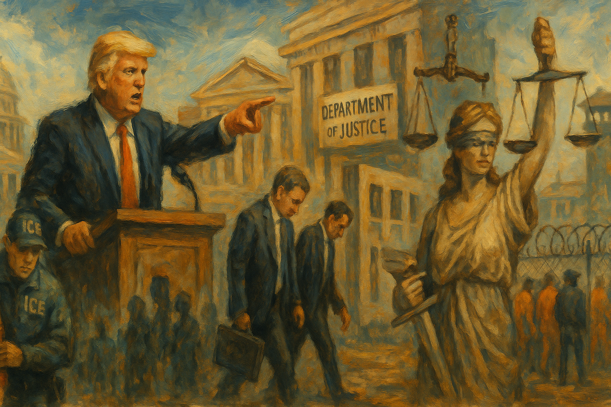

<!-- Generated by build_publish_week_v1 (appendix post) -->
<!-- Header image: image_wide_week2_appendix.png -->

# Week 2 Appendix: Speed as a Method of Rule

*In its first full week back, the new administration opened a dozen fronts at once, testing whether pace alone could outrun courts, Congress, and the press.*

This week—the first full week of the second Trump term—shows a systemic, multi-front assault on institutional checks rather than a single dramatic event. The dominant pattern is rapid, simultaneous executive action: mass pardons of January 6 defendants including a seditious-conspiracy leader, firing of 17+ inspectors general without statutory notice, purges of DOJ prosecutors and FBI agents tied to Trump investigations, an attempted funding freeze affecting trillions in federal spending, and an executive order challenging birthright citizenship. Immigration enforcement escalated sharply (ICE quotas, Chicago raids, Guantánamo detention plans, church/school raids), while civil service protections were undermined via mass buyout offers and Schedule F-style reclassification. Courts pushed back repeatedly—blocking the funding freeze, the birthright citizenship order, and the OMB memo—demonstrating judicial resistance even as the volume of executive action threatens to outpace institutional capacity to respond. The week reveals a strategy of overwhelming scrutiny through sheer velocity of action.

Power and Authority

1. Trump cancelled flights for 1,600 Afghan refugees and declared a national emergency at the southern border (2025-01-25): The president used executive power to halt refugee resettlement and declare a border emergency, expanding unilateral authority over immigration on his first days back in office.

2. Trump pardoned or commuted sentences for about 1,500 January 6 defendants, including Oath Keepers leader Stewart Rhodes (2025-01-25): Blanket pardons for Capitol attack participants, including a seditious-conspiracy leader, undermined accountability for a violent assault on the transfer of power.

3. Trump invoked the 1798 Alien Enemies Act to target immigrants labeled as gang members (2025-01-28): Reviving a wartime-era law to justify mass immigration enforcement expands executive emergency power into a new legal domain.

4. Trump ordered ICE to prepare a 30,000-person migrant detention facility at Guantánamo Bay naval base (2025-01-29): Repurposing a military prison known for human rights abuses to hold civilian immigration detainees raises due process and humane-treatment concerns.

5. Trump administration froze foreign aid except military assistance to Israel and Egypt (2025-01-25): Halting most foreign aid without congressional input tested limits on executive control over appropriated funds and weakened diplomatic tools.

6. Trump withdrew the United States from the Paris climate accords (2025-01-25) *[single source]*: Unilateral withdrawal from a major international agreement reduced U.S. commitments on global climate cooperation without legislative involvement.

7. Trump demanded NATO members raise military spending to 5 percent of GDP (2025-01-25): A steep new demand on allies risked destabilizing a decades-old defense alliance built to deter aggression.

8. Trump lifted the hold on 2,000-pound bomb shipments to Israel (2025-01-25) *[single source]*: Reversing a prior administration's arms restriction shifted U.S. military support policy in an active conflict zone.

9. Trump proposed relocating Gaza's 2.2 million residents to other Arab countries (2025-01-25): A proposal to displace an entire population reflects a dramatic break from established U.S. positions on Palestinian self-determination.

10. ICE began coordinated multi-agency immigration raids in Chicago and other cities, arresting over 950 people in one weekend (2025-01-26): Large-scale enforcement operations, including at previously protected sites like schools and churches, escalated fear in immigrant communities and tested limits on due process.

11. Trump administration set ICE arrest quotas of 1,200 to 1,800 people per day (2025-01-26) *[single source]*: Numeric enforcement targets increase pressure on agents to make arrests quickly, raising the risk of civil rights violations and wrongful detentions.

12. US Northern Command allowed ICE to use Buckley Space Force Base in Colorado for immigration detention operations (2025-01-27) *[single source]*: Blending military infrastructure with civilian immigration enforcement raises questions about the militarization of domestic policy.

13. Trump cancelled visa appointments and revoked visas for Colombian officials, then imposed 25 percent tariffs on Colombian goods after Colombia refused deportation flights (2025-01-28): Rapid economic and diplomatic retaliation against an ally over a policy dispute strained relations and demonstrated coercive use of trade power.

14. Pete Hegseth revoked Gen. Mark Milley's security clearance, personal security detail, and ordered a review of his rank (2025-01-29): Stripping protections from a former joint chiefs chair who had criticized Trump signals use of military authority to punish political critics.

15. Trump invited Israeli Prime Minister Benjamin Netanyahu to be the first foreign leader to visit the White House (2025-01-29): Hosting a leader wanted by the International Criminal Court signals a diplomatic stance disregarding international legal accountability.

16. Trump signed an executive order authorizing sanctions against International Criminal Court officials (2025-01-30): Threatening asset freezes and travel bans against an international court investigating alleged war crimes undermines global rule-of-law mechanisms.

17. Trump ended UNRWA funding and withdrew the United States from the UN Human Rights Council (2025-01-30): Cutting humanitarian aid to Palestinian refugees and leaving a key human rights body weakens U.S. engagement in multilateral institutions.

18. Stephen Miller directed a purge of FBI agents who had investigated Trump, pressuring officials to produce lists for termination (2025-01-28) *[single source]*: A White House aide orchestrating removal of law enforcement personnel who investigated the president represents a direct attack on the independence of federal law enforcement.

19. Trump imposed 25 percent tariffs on Canada and Mexico and 10 percent on China, then delayed tariffs on USMCA-covered goods and autos (2025-01-30): Launching a broad trade war through unilateral tariff authority, later softened with selective exemptions, raised concerns about economic disruption and favoritism.

20. Trump expanded Elon Musk's Department of Government Efficiency authority over federal spending systems (2025-01-30) *[single source]*: Granting a private citizen sweeping oversight of government payment systems raises conflicts of interest and undermines institutional independence.

Institutions and Governance

1. Trump fired at least 17 inspectors general across federal agencies without the legally required 30-day notice to Congress (2025-01-24): Removing independent government watchdogs en masse, in apparent violation of federal law, sharply weakens oversight of executive branch conduct.

2. Democrats and some Republicans expressed bipartisan outrage over the inspector general firings and demanded explanation from the White House (2025-01-26): Cross-party pushback signals institutional concern over the legality and implications of removing independent oversight officials.

3. Hannibal “Mike” Ware recommended that the White House consult legal counsel before proceeding with inspector general dismissals (2025-01-26): An internal watchdog council flagged potential legal noncompliance in the firings, signaling institutional resistance to the removals.

4. James McHenry as acting attorney general, fired more than a dozen career DOJ prosecutors who had worked on criminal cases against Trump (2025-01-27): Purging prosecutors tied to prior investigations of the president threatens the Justice Department's independence and politicizes law enforcement.

5. DOJ removed the public database listing criminal charges and convictions of pardoned January 6 defendants (2025-01-26): Deleting official records of prosecutions reduces public transparency and accountability regarding the Capitol attack.

6. Office of Personnel Management issued guidance implementing Schedule Policy/Career to strip civil service protections from federal employees (2025-01-27): Reviving a plan to reclassify career civil servants as at-will political appointees threatens the nonpartisan federal workforce.

7. Trump administration offered nearly all 3 million federal employees a buyout to resign by resignation deadline while keeping pay through September (2025-01-27): A mass resignation incentive risks depleting institutional expertise and reshaping the federal workforce with political loyalists.

8. federal judge Loren AliKhan issued an administrative stay blocking the Trump administration's freeze on federal grants and loans (2025-01-27): Judicial intervention halted a sweeping funding freeze that threatened disruption to education, healthcare, and disaster relief programs nationwide.

9. Trump administration froze all federal grants and loans, then rescinded the memo within two days while insisting the underlying funding freeze remained in effect (2025-01-27): A chaotic freeze-and-reversal on trillions of dollars in federal spending, contradicted by later official statements, raised questions about compliance with congressional appropriations law.

10. federal judge Jack McConnell issued a formal injunction preventing the Trump administration from impounding federal funds owed to states (2025-01-30): A court order protected states' access to federal financial assistance, reinforcing legal limits on executive impoundment of appropriated funds.

11. Trump signed an executive order making independent regulatory agencies like the SEC and FTC directly accountable to the White House (2025-01-30): Subordinating independent regulators to presidential control concentrates power and weakens institutional checks Congress designed into these agencies.

12. Trump signed an order requiring agencies to repeal at least ten existing regulations for every new one, capping fiscal year 2025 regulatory costs below zero (2025-01-31): A blanket deregulation mandate constrains agencies' ability to protect public health, labor, and the environment through case-by-case rulemaking.

13. Trump fired National Labor Relations Board general counsel Jennifer Abruzzo and chair Gwynne Wilcox, leaving the board without quorum (2025-01-31): Removing labor board leadership paralyzed a key regulatory body, undermining enforcement of federal labor law and its independence from the executive.

14. Trump issued a memorandum prohibiting approval of collective bargaining agreements signed in the final 30 days of the outgoing administration (2025-01-31): Voiding labor agreements negotiated at the end of the prior administration asserts broad executive power to override existing contractual commitments to federal workers.

15. FBI launched sweeping staff cuts, ordering resignation or termination of at least five senior officials in major field offices (2025-01-31): A broad purge of career FBI leadership, targeting officials tied to January 6 and Trump-related investigations, threatens the bureau's independence from political influence.

16. David Lebryk resigned as the highest-ranking career Treasury official after Musk associates demanded access to sensitive federal payment systems (2025-01-30) *[single source]*: The resignation of a top nonpartisan Treasury official under pressure from a private outside adviser raises concerns about the integrity of federal payment infrastructure.

17. Marko Elez gained direct access to Treasury Department payment systems managing a large share of federal spending (2025-01-31): An outside engineer with ties to Musk obtaining write access to critical government payment infrastructure raises serious security and accountability concerns.

18. Senate confirmed Kristi Noem as Homeland Security Secretary and Pete Hegseth as Defense Secretary despite controversy (2025-01-25): Confirming cabinet officials with limited relevant experience and controversial records places loyalists in charge of major security and enforcement agencies.

19. Senate Finance and Health Committees held contentious confirmation hearings for Robert F. Kennedy Jr. as health secretary, questioning his positions on vaccines and abortion (2025-01-29): Scrutiny of a health secretary nominee's scientifically unsupported claims highlights risks to public health policy credibility.

20. Senate intelligence committee questioned Tulsi Gabbard on her past statements about Edward Snowden and foreign leaders during her confirmation hearing (2025-01-30): Scrutiny of a national intelligence director nominee's record on surveillance and foreign policy positions is central to intelligence oversight.

21. Senate Democrats boycotted a committee vote advancing Russell Vought's nomination to lead the Office of Management and Budget (2025-01-30): A boycott over Vought's role in the funding freeze reflects partisan conflict over an appointment with major budgetary authority.

22. Kash Patel refused during his Senate confirmation hearing to say whether he would use FBI power to investigate Trump's political opponents (2025-01-30): An FBI director nominee's unwillingness to disavow politically motivated investigations raises concerns about the agency's impartiality.

23. US District Judge Sidney Stein sentenced former Senator Bob Menendez to 11 years in prison for bribery (2025-01-29): A substantial prison sentence for a former senator convicted of accepting bribes reinforces accountability for corruption at high levels of government.

24. US prosecutors continued federal corruption case against New York City Mayor Eric Adams ahead of an April trial (2025-01-25): An ongoing federal indictment against a sitting mayor for bribery and illegal campaign contributions tests accountability for municipal leadership.

25. Judge Amit Mehta rescinded an order barring Oath Keepers leader Stewart Rhodes from entering Washington DC after his pardon (2025-01-27): A court lifted supervised-release restrictions on a pardoned seditious-conspiracy defendant, reflecting downstream legal effects of the mass pardons.

26. Louisiana grand jury indicted a New York doctor for prescribing abortion medication to a minor across state lines (2025-01-26): The first criminal charges against an out-of-state doctor for mailing abortion pills since Roe's reversal tests interstate legal conflicts over reproductive healthcare.

27. US district judge Dana Christensen issued an injunction blocking a Montana city from closing a homeless shelter (2025-01-27) *[single source]*: A federal court protected access to shelter for unhoused residents against a local government's attempt to revoke its operating permit.

28. Disability Rights Oregon sued the city of Grants Pass over camping regulations affecting disabled unhoused residents (2025-01-30) *[single source]*: Litigation challenges a local government's enforcement of camping bans following a Supreme Court ruling permitting criminalization of outdoor sleeping.

29. Supreme Court granted certiorari, issued procedural orders, and denied a stay of execution in several unrelated cases (2025-01-27): Routine Supreme Court orders this week included accepting a major federal liability case, disbarring an attorney, and denying a death-row stay of execution.

30. Justice Department settled a religious land-use lawsuit protecting Amish residents from municipal sewage requirements (2025-01-30): A settlement enforcing federal religious-exercise protections against local regulation shows continued civil rights enforcement in a narrow area.

31. Justice Department secured convictions in cases involving a correctional officer's obstruction of a fatal custodial assault investigation and a police officer's sexual assaults on duty (2025-01-27): Federal prosecutions of law enforcement misconduct, including cover-up of a jail death and repeated on-duty sexual assaults, illustrate continued accountability enforcement within DOJ's civil rights function.

32. Justice Department sued to block Hewlett Packard Enterprise's $14 billion acquisition of Juniper Networks on antitrust grounds (2025-01-30): Antitrust enforcement against a major tech merger signals continued scrutiny of market concentration affecting competition and pricing.

33. Congress enacted the Laken Riley Act into law, mandating detention of undocumented immigrants charged with theft-related crimes (2025-01-29): New legislation expands mandatory federal detention authority over noncitizens charged but not convicted of certain crimes, raising due process concerns.

34. Florida legislature and House Speaker Daniel Perez rejected Governor DeSantis's immigration special session plan and passed a competing immigration bill (2025-01-26): State legislative pushback against a governor's immigration agenda reflects internal Republican conflict over enforcement authority and legislative process.

35. Illinois Governor JB Pritzker signed an order barring January 6 insurrectionists from state employment (2025-01-30): A state-level measure to exclude Capitol attack participants from public jobs represents an accountability response to the federal pardons.

36. Council of Inspectors General and DOJ whistleblowers filed a class-action lawsuit alleging appointees improperly collected career civil servant information for Musk associate Amanda Scales (2025-01-27) *[single source]*: A whistleblower lawsuit alleges misuse of federal personnel data for political purposes tied to an outside advisor, raising privacy and civil-service concerns.

37. state attorneys general in 22 states sued the Trump administration over the executive order attempting to end birthright citizenship (2025-01-30): A large multistate lawsuit challenges an executive order that seeks to override a constitutional citizenship guarantee.

38. Judge Griffin continued a legal effort to overturn Justice Alison Riggs's certified election to the North Carolina Supreme Court (2025-01-30): An ongoing attempt to discard tens of thousands of votes to reverse a certified judicial election result threatens electoral integrity.

39. Federal Election Commission held closed Sunshine Act meetings on compliance, investigatory, and procedural matters (2025-01-28): Routine closed-door FEC meetings addressed enforcement and administrative rules affecting election oversight capacity.

40. New Orleans Archbishop Gregory Aymond fired leaders of a church-affiliated food bank after they refused to contribute funds toward a sexual-abuse settlement (2025-01-30) *[single source]*: A dispute over diverting food-bank funds to a bankruptcy settlement raises concerns about governance and mission integrity at a major charitable organization.

41. Federal courts and justices conducted routine consolidations and procedural rulings in cases challenging Trump administration immigration and funding actions (2025-01-27): Multiple ongoing lawsuits against executive actions on funding and immigration proceeded through standard case-management steps.

42. General Services Administration and National Archives conducted routine regulatory notices, comment requests, and records schedule postponements (2025-01-27): Administrative agencies proceeded with standard rulemaking and records-management notices amid the broader deregulatory push.

43. Environmental Protection Agency delayed effective dates of four regulations and processed routine chemical-notice and impact-statement filings (2025-01-28): Regulatory delays implementing a White House freeze directive affected environmental rules alongside continued routine EPA administrative processing.

44. Drug Enforcement Administration processed routine applications from companies seeking to manufacture or import controlled substances (2025-01-27): Standard regulatory notices for controlled-substance manufacturing and import registrations continued during the period.

Economic Structure

1. Trump launched a personal cryptocurrency called "$Trump" days before taking office (2025-01-25): A sitting president profiting from a personal cryptocurrency raises significant conflict-of-interest and financial regulation concerns.

2. Trump froze funding for congressionally approved infrastructure projects covering roads, bridges, airports, and ports (2025-01-25): Halting bipartisan infrastructure spending already approved by Congress undermines public works and tests limits on executive impoundment authority.

3. Trump administration blocked funding for the World Health Organization and Gaza aid programs (2025-01-28): Cutting international health and aid funding reduces U.S. global health engagement and diplomatic influence.

4. Trump Media and Technology Group announced a $250 million expansion into cryptocurrency investments through a new financial brand (2025-01-31): A former president's media company expanding into crypto investment deepens concerns about blending political power with personal financial interests.

5. Meta agreed to pay $25 million to settle a lawsuit Trump brought after his 2021 suspension from the platform (2025-01-31): A major tech company's settlement with the president over a content-moderation dispute raises questions about corporate deference to political power.

6. Trump signed orders reviving the coal industry, expanding tree-cutting on public lands, and boosting deep-sea mining (2025-01-30): Multiple orders prioritizing fossil fuel and resource extraction over environmental protections reverse climate policy and long-term conservation goals.

7. Trump ordered creation of a federal sovereign wealth fund and a strategic bitcoin reserve (2025-01-30): Directing new financial instruments without clear congressional authorization raises questions about executive control over substantial public and cryptocurrency assets.

8. Trump paused enforcement of the Foreign Corrupt Practices Act pending revised guidance (2025-01-30) *[single source]*: Halting prosecutions of American companies for bribing foreign officials weakens a long-standing anti-corruption law and international business norms.

9. Trump barred certain nonprofit employees from student loan forgiveness based on employer activities the administration deems improper (2025-01-30) *[single source]*: Conditioning loan forgiveness benefits on employer conduct politicizes a public assistance program and could penalize workers at disfavored organizations.

10. Popular Information reporting documented Cigna's $50,000 donation to the Republican Attorneys General Association, which funds anti-abortion litigation (2025-01-30) *[single source]*: A healthcare company's political donation to a group litigating against abortion access contradicts its public reproductive-health commitments.

11. Popular Information reporting detailed a lobbyist's direct outreach to White House officials seeking reversal of a completed federal decision on a tribal casino project (2025-01-31) *[single source]*: Private lobbying to overturn a finalized agency decision illustrates how political access can be used to reverse administrative determinations.

12. reporting on Billy Long revealed that donors with pending IRS tax issues paid off the campaign debt of Trump's IRS nominee shortly after his nomination (2025-01-31) *[single source]*: A pattern of donations from people with matters before the IRS to the agency's incoming leader raises serious concerns about corruption and conflicts of interest.

13. DeepSeek and Nvidia released competitive AI models from a Chinese company, causing a decline in Nvidia's stock price (2025-01-30): A Chinese firm's low-cost AI breakthrough shook U.S. tech markets and intensified debate over export controls and global AI competition.

14. Trump signed orders on healthcare price transparency and prescription drug pricing negotiations with Congress (2025-01-30) *[single source]*: Directives on healthcare pricing had mixed potential impact, with drug pricing changes possibly weakening Medicare's negotiating leverage.

15. GS Foods Group settled a False Claims Act case for nearly $950,000 over improper small-business contract bidding (2025-01-29): A federal settlement over misrepresented small-business status in government contracting demonstrates continued fraud enforcement in procurement.

Civil Rights and Dissent

1. Trump issued executive orders dismantling federal DEI programs and disbanding the Equal Employment Opportunity Commission (2025-01-25): Eliminating a key civil rights enforcement agency and diversity programs reverses decades of anti-discrimination protections in federal employment.

2. Trump issued an order allowing ICE agents to enter schools and churches to search for undocumented immigrants (2025-01-25): Removing longstanding protections for sensitive locations exposes immigrant families to enforcement in spaces previously considered safe.

3. The White House issued an executive order and memorandum restricting federal funding for abortion, reinstating the Mexico City Policy (2025-01-25): Cutting federal funds for abortion-related services domestically and abroad narrows reproductive healthcare access for low-income populations.

4. US Air Force removed training materials on the Tuskegee Airmen and Women Air Force Service Pilots to comply with DEI order (2025-01-25) *[single source]*: Erasing historical recognition of Black and female military pioneers from training curricula undermines accurate historical education.

5. Common Cause NC and Emancipate NC mobilized public awareness and legal campaigns to protect 60,000 votes at risk of being discarded in a North Carolina judicial race (2025-01-26) *[single source]*: Grassroots civil society organizations organized to defend electoral integrity against an attempt to overturn a certified election result.

6. Siembra NC organized ICE watch community-defense programs in Raleigh and Durham that drew overflow crowds (2025-01-26) *[single source]*: Community organizing to monitor immigration enforcement reflects a civil society response protecting vulnerable populations from aggressive raids.

7. US Education Department dismissed 11 complaints and ended investigations into book bans in schools (2025-01-27): Ending federal scrutiny of book-ban complaints, disproportionately affecting titles by or about people of color and LGBTQ+ individuals, reduces protections against censorship in schools.

8. Trump signed an executive order banning transgender individuals from military service (2025-01-27): Reversing policy allowing transgender troops to serve openly excludes citizens from military service based on identity rather than qualification.

9. Trump signed executive orders eliminating DEI offices and race- and sex-based preferences within the Department of Defense and Homeland Security (2025-01-27): Purging diversity offices from military institutions and restricting curriculum on race and gender narrows equal-opportunity protections in the armed forces.

10. Trump signed an executive order reinstating with back pay service members discharged for refusing the COVID-19 vaccine (2025-01-27): Reversing a prior vaccine-related discharge policy restores service members' status but raises questions about precedent for future public health mandates.

11. Trump signed executive orders restricting gender-affirming medical care for minors and directing DOJ enforcement against providers (2025-01-28): Cutting federal funding and threatening legal action against healthcare providers for transgender youth care restricts medical access based on gender identity, prompting hospitals nationwide to suspend treatment.

12. Trump administration attempted to end birthright citizenship via executive order, prompting immediate legal challenges (2025-01-28): Attempting to unilaterally reinterpret a constitutional citizenship guarantee threatens the legal status of children born to certain immigrant parents.

13. Trump administration revoked an 18-month extension of Temporary Protected Status for more than 600,000 Venezuelans (2025-01-28): Rescinding deportation protections places hundreds of thousands of Venezuelan immigrants at risk of removal, reversing a prior humanitarian policy.

14. Oklahoma State Board of Education approved a proposal requiring families to prove immigration status to enroll children in school (2025-01-28): A state policy conditioning school enrollment on immigration status could unlawfully restrict undocumented children's constitutional right to public education.

15. Trump signed an executive order directing agencies to explore deporting pro-Palestinian student activists for protest activity (2025-01-29): Using immigration enforcement to target students for political speech and protest activity threatens free expression and due process protections.

16. Trump signed executive orders combating antisemitism that direct agencies to investigate and potentially deport resident aliens involved in campus protests (2025-01-29): Directing enforcement actions against campus protesters under an antisemitism framework raises concerns about conflating legitimate activism with actionable misconduct.

17. Trump signed an order ending federal benefits for undocumented immigrants (2025-01-30): Broadly restricting taxpayer-funded benefits for undocumented immigrants may affect vulnerable populations including children and the sick.

18. Trump signed an order banning transgender athletes from women's sports categories (2025-01-30): Federally enforcing a ban on transgender athletes in women's sports restricts participation in public institutions based on gender identity.

19. Trump signed an order transferring transgender women in federal prisons to men's facilities and ending gender-affirming treatment for inmates (2025-01-30): Forcibly reassigning transgender inmates and cutting medical treatment raises serious safety and constitutional concerns for a vulnerable incarcerated population.

20. Trump signed an order making English the official language of the United States (2025-01-30): Establishing English as the sole official language could reduce government services for non-English speakers, affecting immigrants and linguistic minorities.

21. Trump signed an order requiring commercial truck drivers to read and speak English (2025-01-30): A language requirement for truck drivers could restrict employment opportunities for immigrant workers in the trucking industry.

22. Trump signed orders targeting so-called sanctuary cities and expanding legal protections for immigration officers (2025-01-30) *[single source]*: Pressuring local jurisdictions that limit cooperation with federal immigration enforcement undermines local governance and federalism.

23. Trump signed an order establishing a task force to combat alleged anti-Christian bias in government (2025-01-30): A task force framed around protecting Christian religious rights raises concern it could be used to justify discrimination against other groups.

24. Trump administration arrested over 8,200 people in ICE operations between January 22 and January 31, with limited transparency on locations or criminal backgrounds (2025-01-31) *[single source]*: A large volume of immigration arrests with opaque public reporting raises concerns about accountability and the accuracy of enforcement narratives.

25. ICE mistakenly detained three US citizens, including a young child, in Milwaukee before confirming their citizenship (2025-01-29) *[single source]*: Wrongful detention of American citizens during immigration sweeps illustrates the risk of racial profiling and error under quota-driven enforcement.

26. ICE detained a German tourist indefinitely at a California facility, including a stint in solitary confinement (2025-01-25) *[single source]*: The extended detention of a foreign visitor without clear resolution highlights concerns about due process protections within immigration detention.

27. Quaker groups sued the Trump administration over a DHS order allowing ICE to enter churches, citing religious freedom violations (2025-01-29): Faith organizations challenged government policy permitting immigration enforcement inside houses of worship as a violation of religious liberty.

28. Brazil's government protested the treatment of 88 deported immigrants who arrived from the US in handcuffs and leg shackles (2025-01-26) *[single source]*: International condemnation of degrading deportation practices highlights human rights concerns in US immigration enforcement abroad.

29. NIH Fellows United-UAW 2750 demanded bargaining rights over Trump administration policy changes affecting research funding and operations (2025-01-30) *[single source]*: A labor union representing federal researchers pushed back against funding freezes and communication restrictions threatening scientific work.

30. Greg Abbott issued a directive requiring Texas state agencies to remove gender pronouns from official communications (2025-01-30) *[single source]*: A state directive restricting pronoun use in government communications, following a federal order, led to the firing of at least one employee who refused to comply.

31. Trump administration dissolved an internal DHS advisory board that reviewed new local police immigration-enforcement partnerships for civil rights concerns (2025-01-31): Eliminating oversight of a program with a documented history of racial profiling removed a key institutional check as local police immigration partnerships expanded.

32. Ryan English was arrested near the US Capitol with weapons allegedly intended to kill prominent Republican officials (2025-01-27): A thwarted plot to attack government officials near the Capitol underscores continued threats of political violence in the current climate.

Information, Memory and Manipulation

1. Trump falsely claimed he ordered the military into California to restore water supplies when no such deployment occurred (2025-01-27): A demonstrably false statement from the president about military action undermines public trust in official government communications.

2. FCC opened an investigation into NPR and PBS over airing commercials and requested CBS's unedited transcript of a Kamala Harris interview (2025-01-29) *[single source]*: Regulatory pressure on public and commercial broadcasters raises concerns about government interference with editorial independence and press freedom.

3. Trump administration ordered deletion of DEI-related terms from federal documents, causing erasure of unrelated content mentioning "inequity" or "inclusion" (2025-01-31) *[single source]*: A blunt directive to purge DEI language from government materials led to overbroad removal of unrelated informational content, reducing public access to government information.

4. Trump ordered the US Department of Agriculture to take down websites documenting or referencing the climate crisis (2025-01-30) *[single source]*: Removing government climate information from public view restricts access to scientific data relevant to public and agricultural policy decisions.

5. Trump blamed diversity hiring practices and predecessor administrations for a fatal plane-helicopter collision without evidence (2025-01-29): Baseless public claims linking a fatal aviation disaster to diversity policies spread misinformation and shift accountability away from unresolved safety questions.

6. Trump signed a memorandum and executive order directing review of FAA hiring practices, attributing the crash to prior diversity initiatives (2025-01-30): An official memorandum formalizing unsubstantiated diversity-blame narratives for an aviation disaster risks politicizing air-safety hiring standards and public record.

7. Trump signed an order directing declassification of JFK, RFK, and MLK assassination files (2025-01-30): Ordering release of long-classified historical documents could increase public transparency about major events in modern American history.

8. Trump signed executive orders on K-12 education targeting "radical indoctrination" and reestablishing the 1776 Commission on patriotic education (2025-01-29): Federal directives narrowing permissible school curricula on race, gender, and history assert centralized ideological control over civic education content.

9. Trump signed an executive order expanding federal support for school choice and private education funding mechanisms (2025-01-29): Redirecting federal education funds toward private and faith-based alternatives could fragment public education funding and access.

10. Trump moved to begin dismantling the Department of Education without congressional approval (2025-01-30): Attempting to eliminate a cabinet-level agency responsible for national education policy without legislative authorization challenges separation of powers.

11. Trump signed executive orders targeting diversity initiatives at universities and directing scrutiny of foreign gifts and accreditation (2025-01-30) *[single source]*: New federal pressure on universities over diversity programs and accreditation could chill academic freedom and reshape institutional independence.

12. Trump signed a proclamation designating January 27 as a National Day of Remembrance for the liberation of Auschwitz (2025-01-27): A Holocaust remembrance proclamation affirming historical memory and opposition to antisemitism stands alongside the administration's other actions curbing diversity education.

13. Trump issued a proclamation for National Black History Month 2025 (2025-01-31): An official proclamation recognizing Black History Month reflects continued formal observance amid other actions restricting DEI-related content and history education.

14. Trump signed an executive order establishing a task force to plan the nation's 250th anniversary celebration and reinstating monument-protection orders (2025-01-29): Reinstating monument-protection rules with expanded criminal penalties for vandalism could be used to restrict protest activity near historical sites.

15. Trump signed an executive order to rename the Gulf of Mexico as the Gulf of America (2025-01-29): A symbolic renaming reflects an early effort to reshape national narrative and geographic terminology through executive action, despite public opposition.

16. Trump signed an order eliminating AI safety oversight policies at the federal level (2025-01-28): Removing federal AI safety guardrails could reduce protections against algorithmic manipulation and misinformation risks in emerging technology.

17. Gavin Newsom vetoed a California AI safety bill (2025-01-28): A state-level veto of AI safety legislation aligns with the broader national trend of deprioritizing algorithmic oversight during this period.

18. Elon Musk publicly endorsed far-right political figures and parties in the United Kingdom and Germany (2025-01-27): A prominent US business figure's support for foreign far-right movements raises concerns about cross-border influence on democratic processes.

