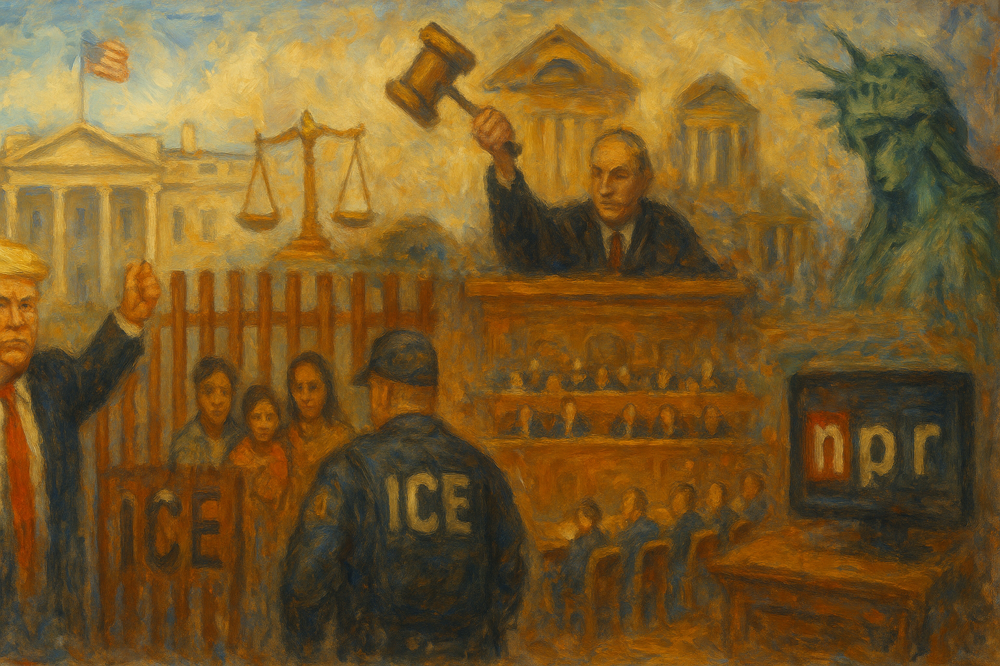

<!-- Generated by build_publish_week_v1 (appendix post) -->
<!-- Header image: image_wide_week20_appendix.png -->

# Week 20 Appendix: Surveillance as Everyday Governance

*In a week of near-still clock time, immigration raids, data centralization, and partisan clemency showed power consolidating quietly inside a more permissive order.*

This was an exceptionally heavy week of authoritarian structural pressure, with the executive branch aggressively consolidating power while degrading multiple guardrails simultaneously. Trump’s team signaled willingness to bypass Congress on spending and civil service purges, weaponized immigration and law enforcement against political opponents and protesters, and normalized sweeping travel bans and mass deportations. The House advanced the “Big, Beautiful Bill,” embedding deep social cuts, deregulatory favors, and even non-reviewable mining leases, illustrating how legislative process is being used to entrench crony capitalism and environmental rollback. Courts were a mixed arena: some rulings protected migrants and speech, but the Supreme Court repeatedly used emergency orders to greenlight data grabs and union-hostile moves, and to shield industries like guns from accountability. Information control and memory politics intensified through attacks on NPR/PBS, censorship of VA scientists, historical erasures, and conspiratorial presidential messaging. Across immigration, reproductive rights, veterans’ care, science agencies, and FEMA/NOAA, policy choices systematically shifted risk and suffering onto vulnerable groups while preserving elite advantage, indicating a regime that treats inequality and institutional chaos as governing tools rather than side effects.

Power and Authority

1. President Trump announced and signed orders doubling tariffs on steel and aluminum imports to 50% (2025-05-31): By sharply raising metal tariffs via executive action, the president unilaterally reshaped trade conditions with limited congressional input, concentrating economic decision-making power in the executive and testing checks on tariff authority.

2. President Trump ordered an investigation into former President Biden’s competence and presidency (2025-06-05): Ordering an executive-branch probe into a predecessor’s mental fitness and decision-making weaponized investigative powers against a political rival, blurring lines between neutral oversight and partisan re-litigation of prior governance.

3. President Trump launched investigations into Joe Biden’s pardons and clemencies (2025-06-02): Targeting a former president’s clemency decisions for special scrutiny risked turning prosecutorial discretion into a tool against political opponents, undermining the norm of even-handed treatment of presidential powers.

4. President Trump issued mass pardons and commutations for January 6 defendants and ordered related cases dropped (2025-06-03): Granting sweeping clemency to January 6 offenders and halting prosecutions signaled tolerance of political violence on the regime’s behalf, weakening deterrence and the rule of law around attacks on democratic institutions.

5. Trump administration fired or sidelined prosecutors handling January 6 cases and disbanded the Capitol siege section (2025-06-03): Removing prosecutors who pursued January 6 cases and dismantling their unit undermined prosecutorial independence and signaled that accountability for insurrection-related crimes depends on political loyalty.

6. President Trump signed proclamations imposing a broad travel ban on nationals from 12 countries and restricting entry from seven more (2025-06-05): Reviving and expanding nationality-based travel bans concentrated sweeping gatekeeping power in the executive, stratifying access to U.S. territory and family unity by origin under a security rationale with limited individualized review.

7. President Trump signed a proclamation suspending Harvard University from the student visa program and restricting foreign student visas (2025-06-04): Targeting a single university’s ability to host foreign students used immigration powers to punish a disfavored institution, pressuring academic independence and signaling that access to U.S. study can hinge on political alignment.

8. President Trump threatened to impose large fines on California over trans athlete participation in sports (2025-06-03): Threatening punitive federal fines against a state for allowing trans athletes in school sports leveraged national power to coerce state policy on civil rights, undermining state autonomy and equal protection norms.

9. President Trump publicly threatened to terminate Elon Musk’s federal subsidies and contracts after political disagreements (2025-06-05): Using the prospect of canceling major federal contracts as retaliation for criticism blurred the line between neutral procurement and personal vendetta, signaling that access to state resources depends on political loyalty.

10. President Trump ordered a large military parade to celebrate his birthday (2025-06-02): Directing a personal military parade used state coercive symbols for leader glorification, normalizing personalized displays of force that can erode norms of civilian, institution-centered democratic culture.

11. President Trump issued an executive order reshaping federal cybersecurity policy and expanding AI-enabled defenses (2025-06-06): Centralizing cybersecurity strategy and expanding AI-based defenses strengthened protection against foreign threats but also broadened executive control over digital infrastructure and data, with implications for surveillance and accountability.

12. President Trump issued executive orders to expand supersonic flight, tighten drone airspace control, and promote U.S. drone dominance (2025-06-06): A trio of aviation and drone orders used unilateral authority to reset safety rules, expand commercial and security uses, and centralize control of airspace, increasing executive leverage over critical transport and surveillance technologies.

13. President Trump ended enforcement of federal emergency abortion guidance under EMTALA (2025-06-05): Halting enforcement of emergency abortion protections narrowed federal guarantees for life-saving care, shifting life-and-death decisions toward state bans and signaling executive willingness to roll back established health rights.

14. President Trump directed the Justice Department to investigate Biden-era emergency abortion guidance (2025-06-05): Framing prior emergency abortion protections as suspect policy and ending them recast federal health guarantees as partisan, weakening the expectation that core medical rights are insulated from political swings.

15. President Trump ordered the renaming of the USNS Harvey Milk and other ships to emphasize a "warrior culture" (2025-06-03): Stripping a Navy ship of Harvey Milk’s name and similar moves used command authority to recast official symbols away from civil rights figures, narrowing whose histories are honored in state narratives.

16. President Trump announced plans to cancel significant federal funding and grants for California (2025-06-05): Preparing to strip California of federal funds weaponized fiscal powers against a political adversary state, threatening residents’ services to pressure state leaders and eroding norms of neutral intergovernmental support.

17. President Trump publicly promoted a conspiracy theory claiming Joe Biden was executed and replaced by clones (2025-05-31): Amplifying an extreme conspiracy about a former president’s death from the bully pulpit degraded shared reality and modeled disinformation as acceptable political communication, undermining informed consent in democratic governance.

18. Trump administration rescinded a Biden-era guidance requiring hospitals to perform emergency abortions where state bans apply (2025-06-02): Revoking federal protection for emergency abortions in hostile states reduced national baseline rights to life-saving care, leaving access to depend more heavily on local politics and weakening uniform application of federal law.

19. Trump administration announced plans to transform the State Department’s refugee bureau into an Office of Remigration (2025-05-31): Reorienting a refugee-focused bureau toward facilitating migrant return signaled a structural shift away from protection toward removal, embedding a more exclusionary vision of membership into foreign and humanitarian policy.

20. Trump administration deployed National Guard and US Marines to Los Angeles to suppress mostly peaceful anti-deportation protests (2025-06-03): Using military forces to police civilian demonstrations against deportations militarized domestic protest management, chilling dissent and blurring boundaries between civil law enforcement and armed forces.

21. Trump administration announced a broad travel ban that also trapped many veterans’ translators abroad (2025-06-06): Imposing a nationality-based travel ban that stranded translators who aided U.S. forces signaled that loyalty to the U.S. does not guarantee protection, undermining trust essential for future military partnerships.

Institutions and Governance

1. Office of Management and Budget Director Russell Vought signaled plans to use impoundment and executive tools to cut federal jobs and spending without full congressional approval (2025-06-01): Proposing to bypass Congress on major workforce and budget cuts challenged the legislature’s power of the purse and suggested a readiness to revive constrained impoundment tactics to centralize fiscal control in the executive.

2. U.S. Court of International Trade ruled that President Trump’s "Liberation Day" tariffs were unconstitutional without congressional authorization (2025-05-31): By striking down unilateral tariffs as beyond presidential authority, the trade court reinforced Congress’s constitutional role over taxation and trade, modestly checking executive overreach in economic policy.

3. Federal appeals court temporarily paused a lower-court ruling that had blocked many of Trump’s tariffs (2025-05-31): Allowing contested tariffs to remain in force during appeal preserved executive leverage over trade while legal challenges proceed, illustrating how interim judicial decisions can sustain disputed policies.

4. U.S. Supreme Court allowed the Trump administration to end humanitarian parole for about 500,000 migrants during ongoing litigation (2025-05-31): Letting parole terminations proceed before final review exposed hundreds of thousands to deportation, showing how emergency high-court decisions can reshape lives and immigration policy before full merits consideration.

5. U.S. Supreme Court agreed to hear a case on nationwide injunctions affecting Trump’s efforts to restrict birthright citizenship (2025-06-01): Taking up a challenge to courts’ ability to issue nationwide injunctions in birthright citizenship disputes opened the door to narrowing judicial tools that currently check sweeping executive actions.

6. U.S. Supreme Court ordered the government to facilitate the return of a wrongfully deported Maryland resident (2025-06-01): Requiring the administration to bring back a deported resident underscored the judiciary’s capacity to correct executive abuses in immigration enforcement and to enforce due process after the fact.

7. U.S. Supreme Court upheld President Trump’s firing of National Labor Relations Board chair Gwynne Wilcox (2025-06-01): Affirming the president’s removal of an independent agency head strengthened the unitary executive model, potentially weakening the insulation of labor regulators from direct political control.

8. U.S. Supreme Court lifted an injunction to allow the Department of Government Efficiency access to Social Security data (2025-06-06): Granting emergency access to vast Social Security records for an unelected efficiency unit expanded state and quasi-private reach into sensitive data, prioritizing administrative goals over privacy and union concerns.

9. U.S. Supreme Court granted a stay in a Social Security Administration labor dispute, favoring management over unions (2025-06-06): Allowing the SSA to proceed with contested employment practices during litigation tilted the balance toward agency leadership and away from union protections, weakening organized labor’s leverage inside government.

10. U.S. Supreme Court dismissed Mexico’s lawsuit against U.S. gunmakers under federal immunity law (2025-06-05): By shielding gun manufacturers from Mexico’s suit over cartel violence, the Court reaffirmed broad statutory immunity for a powerful industry, limiting cross-border accountability for weapons flows.

11. U.S. Supreme Court ruled unanimously that Catholic Charities is exempt from unemployment taxes under the First Amendment (2025-06-05): Expanding religious exemptions from unemployment taxes adjusted the boundary between church and state, potentially encouraging more entities to seek faith-based carve-outs from generally applicable labor laws.

12. U.S. Supreme Court lowered the burden for majority-group plaintiffs in reverse discrimination cases (2025-06-05): Making it easier for majority-group employees to bring discrimination claims could redirect civil rights litigation resources and reshape how equality law is used and perceived in workplace disputes.

13. U.S. Supreme Court allowed the Department of Government Efficiency to proceed with contested actions via emergency stay (2025-06-06): Letting Doge continue disputed efficiency measures through an emergency order highlighted how the Court’s shadow docket can accelerate structural changes in federal operations without full briefing or transparency.

14. U.S. District Judge Tanya Chutkan allowed 14 states’ lawsuit against Elon Musk and the Department of Government Efficiency to proceed (2025-05-31): Letting states challenge the legality of a Musk-led government unit preserved a key avenue for contesting novel delegations of state power to private actors.

15. U.S. District Court in Washington, DC ruled that migrants sent to an El Salvador prison must be allowed to challenge their deportations (2025-06-04): Requiring a process for migrants exiled under an old wartime law reinforced judicial oversight of extraordinary deportation schemes and affirmed that even novel programs must allow legal challenge.

16. U.S. District Court in Boston ordered the return of a deported gay Guatemalan asylum seeker due to due process violations (2025-06-04): Forcing DHS to bring back a wrongly deported asylum seeker underscored courts’ role in correcting administrative misrepresentations and protecting vulnerable individuals from summary removal.

17. Federal judge in Colorado temporarily halted deportation of the family of the Boulder attack suspect (2025-06-04): Blocking immediate removal of a suspect’s family pending review emphasized that even in high-profile terrorism cases, due process protections extend to relatives seeking asylum.

18. Federal judge blocked the deportation of a Venezuelan man under the Alien Enemies Act for lack of due process (2025-06-02): Stopping a deportation under a rarely used wartime statute highlighted judicial concern over expansive executive power in immigration, even while acknowledging broad statutory authority.

19. Federal appeals court ruled that San Diego’s ban on group yoga classes in shoreline parks violated the First Amendment (2025-06-05): Recognizing yoga instruction as protected speech limited local governments’ ability to restrict peaceful expressive activities in public spaces under the guise of regulating commerce.

20. NPR and public radio stations filed a lawsuit challenging Trump’s executive order cutting funding to allegedly biased media (2025-06-01): Public broadcasters’ suit argued that defunding based on perceived bias violates the First Amendment, testing whether the executive can financially punish critical outlets without judicial pushback.

21. Department of Homeland Security published and then removed a list of allegedly noncompliant sheriffs and sanctuary jurisdictions (2025-06-02): Issuing a public shaming list of sheriffs over immigration cooperation, then retracting it under pressure, showed federal attempts to coerce local law enforcement alignment through reputational tools rather than formal process.

22. House of Representatives passed Donald Trump’s One Big Beautiful Bill and related budget legislation with deep social cuts and AI preemption (2025-06-03): Advancing a sprawling bill that extends tax cuts, slashes safety-net programs, and preempts state AI regulation illustrated Congress functioning as a vehicle for an executive-aligned agenda with limited deliberation.

23. Congressional Budget Office reported that Trump’s tariffs and omnibus bill would raise inflation, slow growth, and increase deficits (2025-06-05): Independent fiscal analyses contradicting administration claims provided a factual check on major economic policies, though political actors’ misrepresentation of the findings highlighted pressures on neutral budget institutions.

24. House Oversight Committee Republicans sought testimony from Biden aides about his cognitive state and decision-making (2025-06-05): Launching an inquiry into a former president’s mental fitness risked turning congressional oversight into partisan theater, potentially crowding out substantive policy scrutiny.

25. House Oversight Committee Democrats demanded release of all FBI and DOJ files related to the Jeffrey Epstein case (2025-06-05): Pressing for long-promised Epstein records highlighted concerns that law enforcement may be shielding information about elite misconduct, and tested transparency commitments from top justice officials.

26. Senator Elizabeth Warren released a report detailing Elon Musk’s wealth gains and alleged influence over federal decisions (2025-06-03): Documenting how a powerful businessman’s net worth and federal influence surged raised alarms about regulatory capture and the entanglement of public policy with private fortunes.

27. Newark Mayor Ras Baraka filed a civil rights lawsuit against federal officials over his arrest and prosecution (2025-06-03): A sitting mayor’s suit alleging false arrest and malicious prosecution by federal actors spotlighted potential misuse of justice powers against local elected officials and tested avenues for redress.

28. Federal Election Commission canceled its scheduled open meeting for June 5, 2025 (2025-06-02): Calling off a public FEC meeting reduced opportunities for transparent discussion of campaign finance and enforcement issues, modestly weakening open oversight of electoral rules.

29. Federal courts issued orders barring ICE from transferring Boston student Marcelo Gomes Da Silva and later clarifying his detention conditions (2025-06-02): Judicial interventions in a high-profile student protester’s case underscored courts’ role in checking immigration enforcement and protecting due process for politically active noncitizens.

30. U.S. Justice Department allowed Dominion Voting Systems’ defamation trial against Mike Lindell to proceed (2025-06-02): The continuation of Dominion’s suit against a prominent election denier showed that courts remain a venue for holding purveyors of election misinformation civilly accountable.

31. U.S. Justice Department Civil Rights Division sent a letter warning California schools that allowing trans girls in sports violates equal protection (2025-06-02): Using federal civil rights enforcement to threaten schools over trans inclusion inverted traditional protections, signaling a willingness to reinterpret constitutional guarantees to restrict, rather than expand, marginalized students’ rights.

32. Congressional caucuses formed new groups to advance "Abundance"-inspired legislation on green energy and public goods (2025-06-02): Creating caucuses around an abundance agenda indicated some lawmakers’ intent to use institutional channels to expand state capacity for public investment, countering broader trends of retrenchment.

33. Senator Angus King and Representative Jamie Raskin delivered speeches invoking Margaret Chase Smith’s Declaration of Conscience to warn about executive overreach (2025-06-01): By publicly recalling a historic stand against demagoguery, the lawmakers used institutional platforms to frame current power concentration as a constitutional crisis and to rally colleagues toward oversight.

34. House Oversight Committee Democrats moved toward subpoenaing Elon Musk over alleged drug use while serving in the administration (2025-06-04): Pursuing testimony on a powerful insider’s conduct signaled some willingness in Congress to scrutinize elite behavior, though the inquiry also intersected with factional political conflicts.

35. Federal courts allowed the Social Security Administration to proceed with contested employment actions in a union case (2025-06-06): The Supreme Court’s stay in the SSA union dispute enabled management to implement changes before full review, reflecting a judiciary increasingly deferential to agency leadership over organized labor.

Economic Structure

1. Trump administration proposed deep Medicaid and ACA cuts projected to leave over 10 million people without coverage (2025-05-31): Large reductions in Medicaid and ACA subsidies would shift health costs onto low-income households, weakening the social safety net and increasing economic precarity tied to illness.

2. Trump administration proposed a 42% cut to federal rental assistance programs serving over 10 million people (2025-06-02): Slashing housing vouchers and Section 8 aid would likely increase homelessness and housing insecurity, especially for families with children, embedding deeper inequality into the housing system.

3. Trump administration proposed steep cuts to WIC nutrition benefits for women, infants, and children (2025-06-02): Reducing basic food support for millions of low-income mothers and young children would worsen nutrition and health outcomes, using budget policy to shift hardship onto those with least power.

4. Trump administration proposed eliminating Preschool Development Grants for early childhood education (2025-06-02): Ending federal support for state preschool systems would widen educational gaps by income and geography, undermining long-term equality of opportunity.

5. Trump administration proposed massive cuts to FEMA grants and signaled an intent to eliminate FEMA (2025-06-04): Dismantling FEMA’s grant programs and planning its eventual elimination would offload disaster risk onto states and individuals, weakening national capacity to respond to climate-driven emergencies.

6. Trump administration canceled nearly $4 billion in Building Resilient Infrastructure and Communities grants (2025-06-04): Revoking pre-disaster resilience funding undermined local efforts to harden infrastructure against storms and floods, increasing future public costs and vulnerability.

7. Trump administration downsized FEMA staff and reduced training for state and local emergency officials (2025-06-04): Allowing thousands of FEMA staff to leave and cutting training hollowed out federal disaster-response capacity, making communities more dependent on uneven local resources.

8. Trump administration cut staffing and proposed deep budget reductions for NOAA and the National Weather Service (2025-06-02): Large staff and budget cuts at NOAA and NWS degraded weather forecasting and hurricane preparedness, weakening a core public good that protects lives and property.

9. Trump administration proposed a 43% cut to the National Institutes of Health budget (2025-06-03): Slashing NIH funding threatened to halt much university-based biomedical research, undermining long-term public health innovation and shifting scientific capacity toward private or foreign actors.

10. Trump administration proposed eliminating 80,000 VA jobs and canceling many veterans’ service contracts (2025-06-06): Mass VA staffing cuts and contract cancellations would push veterans toward private care and likely degrade service quality, effectively privatizing key aspects of veterans’ healthcare.

11. Trump administration requested Congress rescind $9.4 billion in previously approved spending, including for NPR, PBS, and foreign aid (2025-06-05): Seeking to claw back funds from public media and international aid reprioritized federal resources away from information and diplomacy, while signaling that appropriations can be revisited to punish disfavored programs.

12. House Republicans advanced the GENIUS Act to regulate stablecoins amid heavy crypto industry donations (2025-06-05): Moving a stablecoin framework that could benefit a Trump-family-backed token after large crypto contributions illustrated how financial regulation can be shaped to favor politically connected ventures.

13. MGX, a UAE government-owned firm used the Trump-family-backed stablecoin USD1 to invest $2 billion in Binance (2025-06-05): A foreign sovereign fund’s use of a Trump-linked stablecoin for a major investment highlighted how private political families can profit from international finance flows intertwined with U.S. policy.

14. Organization for Economic Cooperation and Development reported that Trump’s trade war is slowing U.S. and global economic growth (2025-06-05): An international body’s warning that tariffs are dampening growth and raising inflation underscored the broader economic risks of unilateral trade policies driven by political goals.

15. Trump administration paused implementation of its "Liberation Day" tariffs amid market and legal pressures (2025-06-05): Temporarily shelving record-high tariffs after backlash showed how abrupt economic moves can be used as leverage, creating uncertainty that itself becomes a tool of political pressure.

16. Trump administration centralized federal personal data using Palantir technology under an executive order (2025-06-02): Building a unified data infrastructure across agencies increased efficiency but also concentrated sensitive information in ways that could enable surveillance or discriminatory targeting with limited oversight.

17. Trump administration threatened to cancel federal funding for California’s high-speed rail project over alleged noncompliance (2025-06-04): Using grant compliance findings to justify pulling billions from a major state infrastructure project risked politicizing federal investment decisions and undermining long-term public transit development.

18. Trump administration sought to rescind funding for NPR and PBS as "antithetical to American interests" (2025-06-03): Targeting public broadcasters for defunding based on perceived ideological bias used budget tools to reshape the media landscape, favoring commercial or aligned outlets over independent public service media.

19. House Republicans included a provision in reconciliation to grant Twin Metals mining leases near Boundary Waters with limited judicial review (2025-06-06): Embedding a mining company’s lease rights and shielding them from most lawsuits in a budget bill exemplified how legislation can be tailored to protect specific corporate interests from environmental and legal accountability.

20. Trump administration proposed budget cuts and structural changes that would reduce support for veterans’ translators and pause refugee admissions (2025-06-06): Restricting entry for allies who aided U.S. forces and pausing refugee admissions signaled that economic and security policy can disregard prior commitments, potentially undermining future cooperation abroad.

21. Trump administration proposed and enacted policies that reversed industrial growth in battery manufacturing and clean energy (2025-06-03): Tariffs, subsidy rollbacks, and new fees discouraged domestic battery and EV investment, weakening the industrial base needed for both climate goals and modern defense capabilities.

22. China imposed export controls on rare earth materials to the United States (2025-06-03): Chinese restrictions on rare earth exports exposed U.S. dependence on foreign supply chains for critical technologies, highlighting vulnerabilities in economic and security planning.

23. Major corporations withdrew or reduced sponsorships for Pride parades under political pressure (2025-06-03): Corporate retreat from Pride sponsorships in response to political attacks on diversity initiatives reduced financial support for LGBTQ events, illustrating how culture-war pressure can reshape private-sector backing for civil society.

24. Companies including Oracle and Morgan Stanley cut ties with law firms that complied with Trump’s anti-media executive order (2025-06-02): Corporate clients’ decision to drop firms enforcing a controversial order signaled market resistance to perceived executive overreach, using economic leverage to defend rule-of-law norms.

25. U.S. labor market saw unemployment claims rise to an eight-month high amid tariff uncertainty (2025-06-04): An uptick in jobless claims alongside tariff shocks suggested that trade policy volatility was feeding into labor market stress, with workers bearing the brunt of macroeconomic experimentation.

26. Bureau of Labor Statistics reported inflation data based partly on less precise methods due to staffing shortages (2025-06-04): Reliance on rougher estimation techniques for key inflation metrics because of understaffing raised concerns about the accuracy of economic data that guides policy and public expectations.

27. Trump administration proposed limiting federal student loans and forgiveness for medical and professional programs (2025-06-01): Capping federal loans and curbing forgiveness for graduate programs risked pushing aspiring doctors toward private debt or different careers, with long-term effects on healthcare access and class mobility.

28. Trump administration threatened to cancel government contracts with Musk’s companies, prompting SpaceX to plan Dragon decommissioning (2025-06-04): The feud over contracts and spacecraft decommissioning exposed how critical public services like ISS resupply depend on a few private actors whose business decisions are entangled with political disputes.

29. Trump administration proposed and enacted policies that would cut FEMA infrastructure grants and shift disaster costs to states (2025-06-04): Rolling back federal disaster mitigation funding and planning FEMA’s elimination would leave poorer states especially exposed to climate shocks, deepening regional inequality in resilience.

Civil Rights and Dissent

1. Immigration and Customs Enforcement and Federal Protective Service officers entered Representative Jerry Nadler’s office and handcuffed an aide during a claimed safety check (2025-05-31): Detaining a congressional staffer in his office under dubious pretexts suggested federal enforcement tools being used to intimidate political opponents, chilling legislative independence.

2. Immigration and Customs Enforcement conducted a high-profile raid on a San Diego restaurant, detaining staff and using flash-bang grenades on protesters (2025-06-02): Aggressive tactics at a workplace raid, including crowd-dispersal grenades, exemplified militarized immigration enforcement that can endanger bystanders and suppress community protest.

3. Senior ICE and DHS officials including Stephen Miller pressured ICE leadership to dramatically increase deportations beyond criminal cases (2025-06-02): Internal demands to boost deportation numbers and expand targets beyond serious offenders prioritized quotas over discretion, heightening fear among immigrants and eroding trust in enforcement priorities.

4. Senior U.S. immigration officials ordered officers to increase warrantless "collateral" arrests of undocumented people encountered incidentally (2025-06-04): Encouraging collateral arrests without warrants expanded the pool of people swept into detention, stretching legal norms and intensifying the climate of insecurity for immigrant communities.

5. Trump administration ended humanitarian parole for hundreds of thousands of migrants from several countries (2025-05-31): Terminating parole for about half a million people abruptly converted many into undocumented status, exposing them to detention and deportation and deepening a tiered system of rights based on origin.

6. Trump administration restored humanitarian parole for a four-year-old girl with a life-threatening illness after public outcry (2025-06-02): Reinstating parole for a single high-profile child after backlash highlighted how life-or-death immigration decisions can hinge on media attention rather than consistent humanitarian standards.

7. Trump administration intensified a crackdown on pro-Palestinian campus protests, detaining and seeking to deport student activists (2025-06-05): Using immigration enforcement against student protesters under the banner of combating antisemitism conflated dissent with bigotry, threatening free speech and academic freedom for noncitizens.

8. Immigration agents arrested international student Rümeysa Öztürk after she co-authored a Gaza op-ed (2025-06-02): The street arrest of a student writer by masked immigration officers suggested political speech about foreign policy can trigger coercive action for noncitizens, chilling campus expression.

9. Federal judge blocked deportation of a Venezuelan man under the Alien Enemies Act for lack of due process (2025-06-02): Judicial intervention in a wartime-law deportation underscored the tension between expansive security statutes and individual rights, especially for migrants labeled as potential enemies.

10. West Virginia county prosecutor suggested women should report miscarriages to police under the state’s abortion ban (2025-06-05): Encouraging police involvement in miscarriages blurred lines between healthcare and criminal investigation, heightening the risk that pregnancy loss could be treated as a crime.

11. Trump administration deployed National Guard and Marines to manage protests against deportations in Los Angeles (2025-06-03): Bringing military forces into a largely civilian protest context escalated the state’s response to dissent, potentially deterring lawful assembly through the threat of overwhelming force.

12. Cook County regional organized crime taskforce and partner agencies conducted a nationwide crackdown on organized retail theft, arresting hundreds (2025-06-04): A large, coordinated operation against retail theft illustrated robust law enforcement capacity, but also raised questions about proportionality and the focus of criminal justice resources.

13. Local authorities in Charlottesville, Virginia charged a traffic safety activist with vandalism for chalking a crosswalk at a dangerous intersection (2025-06-04): Prosecuting a citizen for a chalk crosswalk after officials ignored safety requests suggested a punitive response to grassroots advocacy, potentially discouraging civic engagement.

14. Rev. William Barber and Moral Monday protesters were arrested in the Capitol Rotunda while protesting budget cuts to healthcare and social services (2025-06-04): Arresting peaceful demonstrators inside the Capitol underscored how access to symbolic democratic spaces can be tightly controlled when protests challenge dominant fiscal agendas.

15. David Huerta, SEIU of California president was arrested and injured during an immigration raid at a Los Angeles garment factory (2025-06-06): The arrest and hospitalization of a union leader at a raid, amid disputed official accounts, suggested labor organizers challenging enforcement priorities may face heightened physical and legal risks.

16. Louisiana legislature passed an anti-grooming law criminalizing manipulative pursuit of minors for sexual offenses (2025-06-05): Creating a standalone offense for grooming aimed to prevent child abuse earlier in the cycle, expanding legal tools to protect minors while raising questions about definitional scope.

17. Federal prosecutors and courts indicted Kilmar Ábrego García on smuggling charges after his mistaken deportation and ordered return (2025-06-06): Charging a previously wrongfully deported man upon his return blurred the line between correcting government error and pursuing potentially politicized prosecutions in a contentious immigration case.

18. Enrique Tarrio and other January 6 defendants filed a lawsuit against the federal government challenging their prosecutions (2025-06-06): The suit by convicted January 6 participants contested the legitimacy of their prosecutions, reflecting ongoing efforts to reframe accountability for the Capitol attack as political persecution.

19. Senator Cory Booker publicly urged citizens to hold politicians accountable despite fear of Trump (2025-06-01): Calling on the public to make officials fear electoral consequences more than presidential retaliation framed civic participation as a counterweight to authoritarian pressure within Congress.

20. West Virginia officials signaled that miscarriages might be scrutinized under strict abortion laws (2025-06-05): Hints that pregnancy loss could trigger law enforcement review deepened concerns that reproductive autonomy is being policed in ways that deter seeking medical care or reporting complications.

Information, Memory and Manipulation

1. Department of Veterans Affairs political leadership required VA doctors and scientists to obtain political clearance before publishing or speaking publicly (2025-06-01): Mandating political review of VA research communications curtailed scientific independence and limited veterans’ and the public’s access to unfiltered information about health risks and system capacity.

2. Pentagon leadership under Secretary Pete Hegseth locked briefing room doors and effectively halted regular press briefings (2025-05-31): Restricting Pentagon press access reduced transparency around military operations and policy, weakening a key channel for public oversight of the defense establishment.

3. President Trump amplified extreme conspiracy content claiming Joe Biden was executed and replaced by clones (2025-05-31): The president’s promotion of fantastical claims about a rival’s identity normalized disinformation at the highest level, corroding shared factual baselines essential for democratic debate.

4. Homeland Security Secretary Kristi Noem accused Harvard of promoting Chinese Communist Party priorities and suggested students were spies (2025-06-01): Baselessly portraying a major university and its students as aligned with a foreign adversary stoked xenophobia and undermined trust in academic institutions as spaces for independent inquiry.

5. Trump administration issued an executive order titled "Restoring Gold Standard Science" that empowered political appointees to suppress disfavored research (2025-06-03): Framing prior pandemic science as politicized while granting new authority to silence inconvenient findings inverted the idea of scientific integrity, making evidence more vulnerable to partisan control.

6. Defense Department temporarily removed Jackie Robinson’s biography from its website (2025-06-02): Taking down material honoring a civil rights icon from an official site fit a broader pattern of selectively editing public history, raising concerns about politically motivated erasure.

7. Trump administration moved to cut federal funding to NPR and PBS and labeled them biased against American interests (2025-06-04): Targeting public broadcasters for defunding based on content judgments threatened the financial viability of independent news and signaled preference for more compliant media ecosystems.

8. Trump administration centralized personal data across agencies using Palantir technology under a new executive order (2025-06-02): Building a unified data platform increased the state’s capacity to monitor individuals and patterns, raising fears that advanced analytics could be used to target opponents or marginalized groups.

9. FBI Director Kash Patel required employees to take polygraph tests to root out leakers amid staff purges (2025-06-02): Expanding polygraph use in a climate of high turnover risked turning internal security tools into instruments for silencing dissent and discouraging whistleblowing within a key investigative agency.

10. Bureau of Labor Statistics acknowledged using less precise methods for inflation estimates due to staffing shortages (2025-06-04): Reliance on rougher estimation for core economic indicators, combined with political spin about fiscal impacts, undermined confidence in official statistics that anchor public debate and policy.

11. Trump administration used the Boulder rally attack suspect’s immigration status to promote a broader deportation agenda (2025-06-03): Highlighting one attacker’s visa overstay to justify sweeping deportation policies framed immigrants as inherent security threats, shaping public memory of the incident toward punitive reforms.

12. Trump administration and Department of Government Efficiency secured Supreme Court permission to access sensitive Social Security records for efficiency drives (2025-06-06): Granting a Musk-led unit broad access to Social Security data expanded the scope for algorithmic profiling and targeting of beneficiaries, with limited transparency about safeguards or uses.

13. National Archives and Records Administration invited public comment on proposed federal records schedules (2025-06-05): Opening records disposition plans to public input supported transparency and helped guard against inappropriate destruction of documents with historical or accountability value.

14. Education Secretary Linda McMahon testified with uncertainty about whether teaching Black history and 2020 election facts violates DEI policies (2025-06-04): Hesitation to affirm that teaching Tulsa, Ruby Bridges, or accurate election results is permissible signaled pressure on schools to self-censor core civic and historical content.

15. Trump administration renamed the USNS Harvey Milk and other ships to de-emphasize civil rights figures (2025-06-03): Rebranding Navy vessels away from LGBTQ and other icons recast official commemorations, narrowing which struggles are honored in state symbolism and shaping collective memory.

16. Senator Joni Ernst responded to concerns about Medicaid cuts by saying "we are all going to die" and invoking Christianity (2025-06-03): Deflecting fears about healthcare loss with fatalistic and religious rhetoric minimized policy consequences and used faith language to normalize reduced social protection.

17. Representative Mary Miller publicly disparaged a Sikh prayer in Congress after misidentifying the leader as Muslim (2025-06-06): A lawmaker’s inaccurate, intolerant comments about a minority faith leader amplified religious ignorance from an official platform, risking normalization of sectarian bias in civic spaces.

18. Trump administration used antisemitism rhetoric to justify detaining and deporting pro-Palestinian protesters (2025-06-05): Invoking antisemitism to rationalize crackdowns on pro-Palestinian speech blurred genuine hate concerns with suppression of dissent, complicating public understanding of both.

19. Trump administration misrepresented deficit impacts of its budget bill despite contrary CBO findings (2025-06-03): Claiming historic deficit reduction while independent analysis projected large increases showed willingness to distort fiscal facts, undermining informed democratic debate on budget choices.

20. Trump administration framed Harvard and foreign students as security risks while imposing visa bans (2025-06-05): Pairing visa suspensions with rhetoric about espionage and foreign influence cast academic exchange as suspect, reshaping public narratives about universities and immigrants.

21. Trump administration used chaotic, overlapping policy moves across tariffs, immigration, social cuts, and media funding (2025-06-06): Simultaneous shocks in trade, immigration raids, social spending, and media policy created a dense crisis environment that can overwhelm public attention and hinder coordinated opposition.

