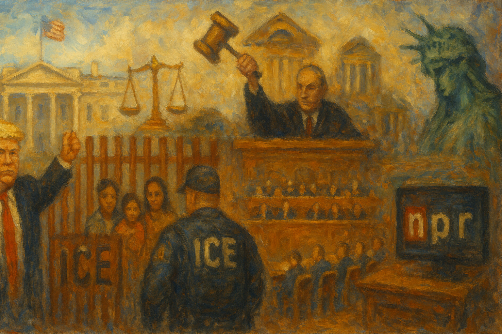

<!-- Generated by build_publish_week_v1 (appendix post) -->
<!-- Header image: image_wide_week20_appendix.png -->

# Week 20 Appendix: A Week of High Pressure, No Movement

*Executive expansion collided with judicial resistance across immigration, spending, and information control, leaving the clock exactly where it stood.*

This was a high-pressure week defined by executive aggrandizement, coercive immigration enforcement, politicization of state capacity, and widening fusion between public power and private loyalty networks. The strongest structural pressures came from repeated efforts to bypass Congress on spending and workforce cuts, aggressive use of immigration machinery with weak due-process protections, retaliation or threatened retaliation against media, universities, and private actors, and a broad hollowing of administrative competence in public-health, weather, disaster, and veterans systems. Courts provided meaningful but uneven resistance: several judges blocked deportations, protected labor rights, and checked some executive actions, yet appellate and Supreme Court interventions also enabled tariff enforcement, DOGE data access, and narrower discovery into executive conduct. The week also showed democratic decay operating through policy substance, not just rhetoric: budget and regulatory moves targeted welfare provision, scientific independence, public media, and civic inclusion, while patronage, donor influence, and personal feuds around government contracts underscored a governing style in which loyalty and leverage increasingly displace neutral administration.

Power and Authority

1. The Department of Energy cut staff and eliminated regulations (2025-05-31) *[single source]*: The staffing cuts and deregulation reduced administrative capacity and shifted policy power away from professional oversight inside a major federal agency.

2. The State Department planned to convert its refugee bureau into an Office of Remigration (2025-05-31) *[single source]*: The planned reorganization signaled a stronger state focus on expulsion and migration control, with direct effects on the treatment and security of migrants.

3. President Trump announced and then ordered higher steel and aluminum tariffs (2025-06-02): The tariff action showed direct presidential use of trade power with broad effects on prices, industry, and the balance between executive action and economic policy.

4. Russell Vought said the administration could use executive tools and impoundment to cut the federal workforce without full congressional approval (2025-06-01) *[single source]*: The statement tested Congress's spending authority by asserting that the executive could carry out major cuts without normal legislative control.

5. FEMA acting chief David Richardson said he had not known the United States had a hurricane season (2025-06-01) *[single source]*: The remark raised doubts about leadership competence in a disaster agency whose decisions affect public safety and emergency response.

6. The Trump administration considered new vaccine trials and tighter limits on Covid vaccines (2025-06-02): The proposed changes increased political control over vaccine policy and risked weakening evidence-based public health access.

7. The Trump administration cut National Weather Service staffing and froze hiring (2025-06-02): The staffing cuts weakened a core public-warning system and reduced federal capacity to protect communities during severe weather.

8. The White House restored humanitarian parole for a four-year-old girl and her family after revoking it (2025-06-02) *[single source]*: The reversal showed how executive immigration power could abruptly endanger or restore a family's legal status and access to lifesaving care.

9. Director of National Intelligence Tulsi Gabbard considered changing President Trump's intelligence briefings to hold his attention (2025-06-02): The effort suggested national security briefings were being adapted to presidential preference rather than standard institutional practice.

10. The Trump administration canceled FEMA resilience grants, reduced FEMA staffing and training, and proposed eliminating FEMA (2025-06-04): The moves reduced federal disaster-preparedness capacity and shifted emergency burdens away from national institutions that support public safety.

11. President Trump used the Boulder attack to press for harsher deportation policies (2025-06-03): The response used a violent incident to justify broader coercive immigration policy, expanding executive pressure on a vulnerable population.

12. President Trump had previously pardoned January 6 defendants and ordered pending cases dismissed (2025-06-03) *[single source]*: The pardons and dismissals weakened accountability for political violence and showed direct presidential power overriding ordinary legal consequences.

13. Defense Secretary Pete Hegseth ordered the Navy to remove Harvey Milk's name from a ship (2025-06-03): The order used executive control over military symbols to reshape official recognition of a marginalized public figure.

14. The White House issued an executive order on scientific research that gave political appointees more control over research they opposed (2025-06-03) *[single source]*: The order increased political leverage over scientific work and risked weakening independent evidence in federal policymaking.

15. President Trump ordered an investigation into Joe Biden's presidency over alleged cognitive decline (2025-06-05): The order used executive investigative power against a predecessor in a way that could blur oversight, retaliation, and partisan advantage.

16. President Trump signed a proclamation restricting entry from 19 countries (2025-06-05): The travel ban used executive immigration power to sort entry by nationality, affecting equal treatment, family unity, and access to refuge.

17. President Trump signed a proclamation restricting foreign student visas at Harvard (2025-06-05): The proclamation used immigration authority to target a specific university, testing limits on executive retaliation against institutions.

18. The Trump administration ended enforcement of emergency abortion guidance under EMTALA (2025-06-05): The policy change narrowed federal protection for emergency reproductive care and shifted life-and-health decisions toward state restrictions.

19. The Trump administration proposed deep cuts to Veterans Affairs medical services and jobs (2025-06-06): The proposal would reduce federal capacity to deliver care to veterans and shift power over services through austerity and possible privatization.

20. President Trump and Elon Musk publicly feuded over government contracts and SpaceX services (2025-06-06): The dispute exposed how critical public functions and federal contracting could be shaped by personal conflict between political and private power centers.

21. President Trump issued executive orders on cybersecurity, supersonic flight, drone restrictions, and drone industry expansion (2025-06-06): The orders expanded direct presidential direction over security and airspace policy through broad executive action rather than legislation.

Institutions and Governance

1. House Oversight Chair James Comer said he planned hearings on Joe Biden's executive orders (2025-05-31): The planned hearings aimed to challenge the validity of a prior president's actions and used oversight powers in a highly partisan way.

2. The U.S. Court of International Trade ruled that President Trump's Liberation Day tariffs were illegal (2025-05-31): The ruling reaffirmed that tariff power belongs to Congress and checked unilateral executive action through judicial review.

3. The U.S. Court of Appeals for the Federal Circuit paused the lower court ruling against Trump's tariffs (2025-05-31): The pause let contested tariffs stay in force and showed how appellate procedure can preserve executive action during review.

4. The Utah Court of Appeals sanctioned a lawyer for filing a brief with false AI-generated citations (2025-05-31) *[single source]*: The sanction reinforced court standards for truthful filings and professional accountability in legal proceedings.

5. The Supreme Court allowed the administration to end immigration parole protections for hundreds of thousands of people (2025-05-31): The order let the executive strip legal status from a large group while litigation continued, with major effects on due process and security.

6. Judge Tanya Chutkan allowed 14 states to proceed with their lawsuit against Elon Musk and DOGE (2025-05-31): The ruling opened judicial review of whether a powerful private actor and a new government entity were acting without legal authority.

7. Plaintiffs in City of Chelsea v. Trump filed an amended complaint over sanctuary-jurisdiction designations (2025-05-31): The filing expanded a court challenge to federal pressure on local governments over immigration policy.

8. Defendants in LULAC v. Executive Office of the President answered complaints and argued the plaintiffs lacked standing (2025-05-31): The response shaped a live institutional fight over access to court in a challenge to executive action.

9. Senator Angus King and Representative Jamie Raskin warned about executive power and democratic erosion in public statements (2025-06-01) *[single source]*: The statements reflected elected officials using institutional voice to defend congressional responsibility and democratic guardrails.

10. NPR and public radio stations sued over President Trump's order cutting funding to public media (2025-06-01): The lawsuit asked courts to block executive retaliation against media funding and tested First Amendment limits on presidential power.

11. The Supreme Court agreed to hear a case on nationwide injunctions tied to birthright citizenship (2025-06-01): The Court's decision put a major procedural check on executive action under review in a case tied to constitutional citizenship rights.

12. The Supreme Court ordered the administration to facilitate Kilmar Abrego Garcia's return after wrongful deportation (2025-06-01): The ruling showed the judiciary acting as a check on executive immigration errors and insisting on due process.

13. The Supreme Court let President Trump remove the head of the National Labor Relations Board (2025-06-01): The decision strengthened presidential control over an independent agency and shifted the balance between Congress and the executive.

14. Dominion Voting Systems and Mike Lindell began a defamation trial (2025-06-01) *[single source]*: The trial tested whether courts would impose accountability for election falsehoods that can damage trust in democratic processes.

15. The CDC renewed the charter of its Advisory Committee to the Director (2025-06-02): The renewal preserved an expert advisory structure inside a major public health institution.

16. The National Sheriffs' Association criticized DHS for publishing a sanctuary-jurisdiction list (2025-06-02): The statement showed institutional resistance from local law enforcement to federal naming-and-shaming tactics.

17. The government asked the Supreme Court to halt a ruling limiting mass federal layoffs (2025-06-02): The filing sought to preserve executive control over large workforce cuts while litigation continued.

18. Plaintiffs and the court in State of California v. U.S. Department of Education amended the complaint, mooted a dismissal motion, and later reassigned the case after recusal (2025-06-03): The filings and reassignment changed the posture of a major challenge to executive action affecting education funding authority.

19. The district court and plaintiffs in State of California v. Trump dismissed the case for lack of jurisdiction and then received a notice of appeal (2025-06-02): The rulings showed how jurisdictional procedure can shape whether courts reach the merits of challenges to executive action.

20. Judge Marsha Pechman blocked DHS from ending collective bargaining rights for Transportation Security Officers (2025-06-02): The injunction protected union rights and limited executive retaliation against a federal workforce.

21. Judge Holcomb blocked deportations in Darwin Antonio Arevalo Millan v. Trump pending required notice and process (2025-06-02): The injunction required procedural safeguards before removal and reinforced judicial oversight of deportation practices.

22. Judge Bates reaffirmed limits on enforcement of Executive Order 14246 against Jenner & Block (2025-06-02): The ruling constrained agency enforcement of a contested executive order and preserved judicial checks on retaliation through federal power.

23. Harvard University moved for summary judgment against the government's funding freeze (2025-06-02): The motion asked a court to void executive funding retaliation against a university and restore institutional independence.

24. The Supreme Court granted review in several cases on June 2 (2025-06-02): The grants showed the Court selecting disputes that could shape election law, private detention liability, and other national legal rules.

25. The Federal Election Commission canceled its June 5 open meeting (2025-06-02): The cancellation reduced public visibility into election-regulation business and limited routine transparency.

26. The Department of Homeland Security removed its sanctuary-jurisdiction list after backlash (2025-06-01) *[single source]*: The removal showed a federal retreat after accuracy and legitimacy concerns about a tool used to pressure local governments.

27. The Department of Justice and 16 Republican state attorneys general were asked to help create a liability shield for fossil fuel companies (2025-06-01) *[single source]*: The request sought to use federal legal power to limit accountability for a major industry through institutional protection.

28. The EPA announced a meeting of its Children's Health Protection Advisory Committee (2025-06-03): The notice maintained a formal advisory channel for public and expert input on children's environmental health policy.

29. The House of Representatives passed a budget bill with a ten-year bar on most state AI regulation (2025-06-03) *[single source]*: The bill used federal legislation to preempt state oversight of AI, shifting regulatory power upward and narrowing local democratic control.

30. The Senate considered President Trump's tax and spending bill (2025-06-03) *[single source]*: The Senate's review put a major fiscal and governance package into the next stage of institutional decision-making.

31. The White House made deficit-reduction claims about the budget bill that conflicted with CBO estimates (2025-06-03): The mismatch between official claims and budget scoring tested accountability in legislative debate over a major bill.

32. Plaintiffs in Baraka v. Habba filed suit over Mayor Ras Baraka's arrest outside an ICE detention facility (2025-06-03): The complaint asked courts to review whether federal law enforcement had been used for political retaliation.

33. Judge Ali dismissed the Democratic National Committee's lawsuit against President Trump (2025-06-03): The dismissal narrowed one institutional avenue for challenging executive action in court.

34. Judge Royce Lamberth ordered treatment access restored in Kingdom v. Trump while the case proceeds (2025-06-03): The injunction required the government to maintain care for affected people and showed courts preserving rights during litigation.

35. The district court stayed enforcement of a tariff injunction in Learning Resources v. Trump pending appeal (2025-06-03): The stay let the government keep collecting contested tariffs while appellate review continued.

36. The House Oversight Committee prepared to subpoena Elon Musk over his conduct while working in the administration (2025-06-04): The move signaled congressional oversight of a politically connected private actor with unusual government influence.

37. Judge James Boasberg ordered the administration to let migrants held in El Salvador challenge their deportations (2025-06-04): The ruling required access to legal process for people removed abroad and checked executive efforts to place them beyond review.

38. Judge Brian Murphy ordered the return of a deported Guatemalan asylum seeker and required due process before any new removal (2025-06-04): The order reinforced that deportation decisions must follow lawful process, especially where persecution risks are claimed.

39. Judge Gordon Gallagher temporarily blocked deportation of the Boulder suspect's family and required access to counsel (2025-06-04): The orders prevented family-based punishment without process and preserved court review over emergency removals.

40. Plaintiffs in National TPS Alliance v. Noem and the court accused the government of noncompliance with discovery orders and obtained a new compliance order (2025-06-04): The dispute highlighted judicial enforcement of executive compliance in immigration litigation.

41. President Trump and Harvard University triggered a new lawsuit over a proclamation suspending entry of foreign students to Harvard (2025-06-04): The case moved a direct conflict between executive immigration power and university autonomy into court.

42. Alvin Brown sued over his removal from the National Transportation Safety Board (2025-06-04): The lawsuit challenged whether the president could remove an independent board member outside statutory limits.

43. The First Circuit denied government stay requests in two education cases (2025-06-04): The denials kept lower-court protections in place and limited executive efforts to pause adverse rulings.

44. Judge Andrew Carter granted a temporary restraining order in National Job Corps Association v. Department of Labor (2025-06-04): The order preserved judicial review over a challenged federal labor action before further harm could occur.

45. The Supreme Court denied a stay application in Ikome v. Bondi as moot (2025-06-04): The order resolved an emergency request without reaching the merits, affecting the case's procedural path.

46. The House Oversight Committee sought testimony from Joe Biden's former aides about his condition in office (2025-06-05): The inquiry used congressional oversight to question the legitimacy of a prior administration's decision-making.

47. The Congressional Budget Office released analyses of tariffs and the omnibus bill (2025-06-05): The analyses provided an institutional check on political claims by scoring likely fiscal and economic effects.

48. Russell Vought told lawmakers he believed the Impoundment Control Act was unconstitutional (2025-06-05): The claim challenged Congress's control over appropriated spending and tested a core separation-of-powers rule.

49. House Oversight Democrats demanded release of all Epstein files from the FBI and Justice Department (2025-06-05): The demand pressed executive agencies for disclosure in a politically sensitive case and framed transparency as an oversight issue.

50. The Ninth Circuit ruled that San Diego's ban on group yoga instruction at beaches was unconstitutional (2025-06-05) *[single source]*: The ruling protected expressive activity in public space and limited local government power under the First Amendment.

51. Justice Department attorney Ed Martin opened an inquiry into Joe Biden's clemencies (2025-06-05): The inquiry used legal process to revisit a former president's clemency decisions, raising questions about neutral administration of justice.

52. Mahmoud Khalil's legal team sought a preliminary injunction for his release from detention (2025-06-05) *[single source]*: The filing asked a court to review whether detention was being used to punish protected speech and deny due process.

53. The Supreme Court ruled in Smith & Wesson Brands v. Estados Unidos Mexicanos (2025-06-05): The decision limited one route for holding gun manufacturers accountable through civil litigation with cross-border implications.

54. The Supreme Court ruled in Catholic Charities Bureau v. Wisconsin Labor and Industry Review Commission (2025-06-05): The decision expanded a religious exemption from unemployment taxes and shaped the boundary between state regulation and religious claims.

55. The Supreme Court ruled in Ames v. Ohio Department of Youth Services (2025-06-05): The decision changed the legal standard for some discrimination claims and will shape future civil-rights litigation.

56. Judge Burroughs temporarily blocked the administration from preventing foreign students from enrolling at Harvard (2025-06-05): The order checked executive retaliation against a university and protected students while the case proceeds.

57. Judge Buchwald barred the government from detaining or transferring Chung while the case proceeds (2025-06-05): The injunction preserved court jurisdiction and protected an individual from executive detention during litigation.

58. Judge Deborah Boardman blocked the halt of national service programs and discharge of AmeriCorps members (2025-06-05): The injunction enforced administrative-law procedures and protected a public service program from abrupt executive disruption.

59. The Fourth Circuit let the administration keep suspending 32 environmental and infrastructure grants during appeal (2025-06-05): The stay preserved executive control over contested grant suspensions while appellate review continued.

60. The Supreme Court granted review or issued opinions in several additional cases on June 5 and June 6 (2025-06-06): The Court's orders and opinions continued to shape national legal rules across criminal law, procedure, and federal authority.

61. The House of Representatives passed President Trump's Big Beautiful Bill by a single vote (2025-06-06): The vote advanced a major package that would reshape taxes, social programs, and immigration enforcement through ordinary legislative power.

62. A reconciliation bill backed by the Trump administration included a provision to restore mining leases near the Boundary Waters and bar most judicial review (2025-06-06) *[single source]*: The provision used legislation to narrow court oversight and favor a specific project on public land.

63. North Carolina lawmakers moved toward a vote on the North Carolina Border Protection Act (2025-06-06): The bill showed a state legislature using its powers to expand immigration enforcement at the state level.

64. Enrique Tarrio and other January 6 defendants sued the federal government over their prosecutions (2025-06-06) *[single source]*: The lawsuit asked courts to revisit the conduct of prosecutors and agents in a major political-violence case.

65. The Supreme Court allowed DOGE to access Social Security records during ongoing litigation (2025-06-06): The order widened executive access to sensitive personal data while privacy and legality challenges remain unresolved.

66. The D.C. Circuit let the administration keep the Associated Press out of restricted presidential spaces while litigation proceeds (2025-06-06): The ruling narrowed press access to the presidency and left only some public-forum protections in place.

67. The Supreme Court stayed discovery into DOGE's internal executive communications and remanded the case (2025-06-06): The ruling limited judicial access to internal executive deliberations and strengthened secrecy claims during oversight litigation.

68. The National Archives and Records Administration requested public comments on proposed federal records schedules (2025-06-05): The notice preserved a formal public process for decisions about retaining or disposing of federal records.

69. The Democracy Docket opinion entry described concerns about the Justice Department's role in democracy-related enforcement (2025-06-02) *[single source]*: The entry flagged democracy-related concerns about how federal legal institutions were being used, even without a discrete new government act described here.

Economic Structure

1. The House of Representatives passed a budget bill with cuts to Medicaid and SNAP and more money for immigration enforcement (2025-05-31): The bill shifted public resources away from social support and toward enforcement, with major effects on inequality and material security.

2. The Trump administration proposed a $19.3 billion cut to the Department of Energy budget (2025-05-31) *[single source]*: The proposed cut would reduce federal investment capacity in energy policy, research, and public goods.

3. The Congressional Budget Office and other analysts estimated that proposed Medicaid and ACA cuts would cause millions to lose coverage (2025-05-31): The estimates showed how budget choices could strip health coverage from millions and deepen economic insecurity.

4. President Trump backed away from his promise to end taxes on Social Security benefits and instead proposed a deduction for working seniors (2025-05-31): The shift reduced the scope of a promised benefit and showed fiscal policy being reshaped by internal budget constraints.

5. Republican lawmakers advanced a budget bill that would limit federal student loans for medical education (2025-06-01) *[single source]*: The proposal would raise financial barriers to medical training and could reduce access to professional pathways for lower-income students.

6. Major companies cut ties with law firms that complied with Trump's executive orders (2025-06-01) *[single source]*: The decisions showed private economic actors reallocating business in response to perceived government overreach and legal risk.

7. The Trump administration proposed cuts to NOAA and the National Institutes of Health (2025-06-03): The proposed cuts would reduce federal support for weather, climate, and biomedical research that underpins public goods and long-term capacity.

8. Federal agencies issued routine regulatory notices on drugs, chemicals, aviation security, and environmental permits (2025-06-02): The notices reflected ongoing administrative management of markets, safety, and environmental compliance through ordinary rulemaking channels.

9. The Trump administration planned layoffs, contract cancellations, and hiring freezes in the Veterans Affairs system (2025-06-02) *[single source]*: The changes threatened a major public service system by reducing staffing and support for veterans' care.

10. The Trump administration canceled EV credits and solar subsidies (2025-06-02) *[single source]*: The policy would redirect economic incentives away from clean-energy investment and affect jobs, prices, and industrial development.

11. The Trump administration proposed broad tariffs on imports (2025-06-02) *[single source]*: The proposal signaled a trade policy that could raise consumer costs and reshape market access through executive action.

12. The Trump administration proposed eliminating preschool grants, cutting WIC, and reducing housing assistance (2025-06-02) *[single source]*: The budget proposals would reduce support for children and low-income families, increasing material hardship and weakening equal opportunity.

13. House Republicans passed a bill reducing subsidies for battery manufacturing, EV purchases, and charging infrastructure (2025-06-03) *[single source]*: The bill would shift industrial policy away from emerging energy sectors and could weaken domestic manufacturing capacity.

14. Battery manufacturers canceled major U.S. battery projects amid tariff and policy uncertainty (2025-06-03) *[single source]*: The cancellations showed how unstable policy signals can deter investment in strategic domestic industry.

15. Corporations withdrew sponsorship from Pride events (2025-06-03): The pullback reduced funding for civic events and showed how political pressure can reshape private support for public community life.

16. The Trump administration requested Congress rescind $9.4 billion in approved funding for public media and foreign aid (2025-06-04): The rescission request sought to reverse enacted spending and redirect public resources through a new political fight over appropriations.

17. The House and Senate advanced and debated a budget bill projected to cut social programs and add to the deficit (2025-06-06): The bill would restructure federal spending toward tax cuts and enforcement while reducing support for health, food, and housing programs.

18. The White House threatened to pull federal funding from California's high-speed rail project (2025-06-04): The threat put a major state infrastructure project at risk by using federal grant leverage over long-term public investment.

19. The Labor Department and Bureau of Labor Statistics faced questions about inflation data accuracy because of staffing shortages (2025-06-04) *[single source]*: The staffing problem weakened confidence in official economic statistics that guide public policy and market decisions.

20. The GENIUS Act's Senate supporters and crypto donors advanced stablecoin legislation while recipients had major crypto-industry financial backing (2025-06-05) *[single source]*: The episode showed how financial influence and private gain could shape market-regulation policy with public consequences.

21. The OECD reported that Trump's trade policies were slowing economic growth (2025-06-05) *[single source]*: The report linked executive trade choices to weaker growth, showing how political decisions can impose broad economic costs.

22. The Trump administration paused some tariffs while overall tariff rates remained volatile (2025-06-05) *[single source]*: The reversals and fluctuations created uncertainty for firms and consumers, weakening predictability in economic governance.

23. MGX and World Liberty Financial used the Trump-backed stablecoin USD1 in a $2 billion Binance investment (2025-06-05) *[single source]*: The transaction highlighted how a politically connected financial product could blend private profit, foreign capital, and public influence.

24. Donald Trump threatened to cancel SpaceX contracts (2025-06-06): The threat showed how federal contracting power could be used in a personal political dispute with major economic consequences.

25. U.S. unemployment filings rose to their highest level in eight months (2025-06-04) *[single source]*: The increase signaled economic strain that can shape public confidence and household security.

Civil Rights and Dissent

1. ICE and Federal Protective Service officers entered Representative Jerry Nadler's office and handcuffed a staff member (2025-05-31): The incident raised concerns that federal enforcement power was being used in a way that could chill advocacy and intimidate political opposition.

2. The House budget bill included a large increase in border and immigration enforcement funding (2025-05-31): The funding increase would expand detention and deportation capacity, with direct effects on liberty and bodily security for migrants.

3. North Carolina lawmakers considered a bill that would criminalize voter registration activity (2025-05-31) *[single source]*: The proposal threatened a basic pathway into democratic participation by raising legal risk around voter registration work.

4. Stephen Miller pressed ICE officials to increase deportation numbers (2025-06-01) *[single source]*: The meeting signaled stronger political pressure for aggressive removals, increasing fear and legal exposure for immigrant communities.

5. A federal court barred ICE from transferring Marcelo Gomes Da Silva and issued a second order in his detention case (2025-06-02) *[single source]*: The orders protected a detained student from removal and reinforced due-process limits on immigration custody.

6. Immigration agents had arrested Rümeysa Öztürk after she co-authored a campus op-ed about Gaza (2025-06-02) *[single source]*: The arrest linked immigration enforcement to political expression and raised concerns about punishment for protected speech.

7. The FBI and local authorities treated the Boulder attack as terrorism and brought hate-crime charges (2025-06-03): The response addressed a violent attack on a public gathering and highlighted the state's role in protecting targeted communities.

8. ICE raided a San Diego restaurant and used flash-bang grenades as protesters gathered (2025-05-30): The raid combined workplace immigration enforcement with force against a crowd, raising concerns about community safety and protest rights.

9. The Trump administration announced plans for mass deportations (2025-06-02) *[single source]*: The plan pointed to a broad expansion of coercive immigration enforcement with major effects on rights, family stability, and community security.

10. A Florida-based election skeptic was appointed to run elections in Shasta County (2025-06-02) *[single source]*: Putting an election skeptic in charge of election administration risked weakening public trust in fair and neutral voting processes.

11. A federal judge temporarily blocked deportation of the Boulder suspect's family (2025-06-04): The order protected family members from removal without process and rejected guilt by association in immigration enforcement.

12. Rev. William Barber and other protesters were arrested during a Moral Monday protest against the Republican budget bill (2025-06-04): The arrests showed civil disobedience being met with police action in a protest over policies affecting poor people and health access.

13. Representative Mary Miller criticized a Sikh prayer in Congress and first misidentified the speaker as Muslim (2025-06-05): The remarks raised concerns about religious intolerance inside government and the equal standing of minority faiths in public life.

14. A West Virginia prosecutor suggested women report miscarriages to police (2025-06-05): The suggestion reflected a legal climate in which pregnancy outcomes could draw police scrutiny, increasing fear around reproductive autonomy.

15. David Huerta was arrested during an immigration raid in Los Angeles (2025-06-06): The arrest of a union leader during enforcement activity raised concerns about suppressing labor solidarity and public dissent.

16. ICE conducted raids and deportations that drew community protests and legal resistance (2025-06-06): The raids and removals intensified pressure on immigrant communities and prompted organized defense of due process and humane treatment.

17. Democracy NC organized a statewide Black Women Speak advocacy call (2025-06-06) *[single source]*: The event showed civil society organizing to respond to legislation affecting Black and Brown communities through collective democratic action.

18. The administration and universities intensified a crackdown on pro-Palestinian student protesters and sought detentions and deportations (2025-06-05) *[single source]*: The crackdown linked protest activity to immigration punishment and threatened speech and assembly rights on campus.

19. The administration imposed a travel ban that affected Afghan translators who had assisted U.S. forces (2025-06-06): The policy restricted entry for people tied to U.S. military missions abroad, affecting safety, family unity, and equal treatment.

20. A new lawsuit in Tarrant County challenged redistricting maps as diluting minority voting power (2025-06-04) *[single source]*: The suit sought judicial protection against district lines that could weaken fair representation for minority voters.

21. A GOP map drawer and a right-wing law firm worked on Texas redistricting plans that allegedly targeted minority voters (2025-06-04) *[single source]*: The reported collaboration raised concerns about using mapmaking to reduce minority electoral influence.

Information, Memory and Manipulation

1. Fox News programming highlighted by Aaron Rupar gave little attention to Medicaid while focusing heavily on Joe Biden (2025-05-31) *[single source]*: The coverage pattern suggested agenda-setting that could distort public understanding of a major policy issue.

2. Pentagon officials under Pete Hegseth restricted press access and kept briefing-room doors locked (2025-05-31): The restrictions reduced routine media access to a major national-security institution and weakened transparency.

3. President Trump shared a conspiracy theory claiming Joe Biden had been replaced by a clone (2025-05-31): The post spread false claims from the top of politics and undermined reality-based public discourse.

4. Oren Cass dismissed economics as a field in a public argument (2025-05-31) *[single source]*: The intervention fed a public climate in which expertise can be discounted without substantive engagement.

5. Veterans Affairs political appointees required doctors and scientists to get clearance before publishing or speaking publicly (2025-06-01) *[single source]*: The rule gave political officials control over scientific communication and reduced transparency from government experts.

6. The Trump administration planned a centralized database of Americans' personal information across agencies (2025-06-01) *[single source]*: The plan concentrated sensitive data in ways that raised privacy and surveillance concerns for the public.

7. The Defense Department removed Jackie Robinson's biography from its website (2025-06-02): The removal altered public access to official historical material and raised concerns about state control of memory.

8. The Make America Healthy Again Commission issued a report that drew criticism for errors and misrepresentations (2025-06-02) *[single source]*: The disputed report raised concerns about the reliability of government-backed information used to shape health policy.

9. Education Secretary Linda McMahon testified about DEI policies and Black history education (2025-06-04): The testimony reflected a federal effort to shape what schools can teach about race, history, and inclusion.

10. Senator Elizabeth Warren released a report on Elon Musk's gains and conflicts of interest (2025-06-04) *[single source]*: The report sought to document how wealth and government influence may have intersected, adding public information for accountability.

11. Elon Musk used social media to attack President Trump's spending bill and later claim Trump was in the Epstein files (2025-06-06): The posts showed a powerful private actor using a major platform to shape political narratives with little evidentiary restraint.

12. President Trump attacked Elon Musk during a press conference (2025-06-05): The public attack turned a policy and contract dispute into a high-visibility narrative battle that could sway public understanding of governance.

