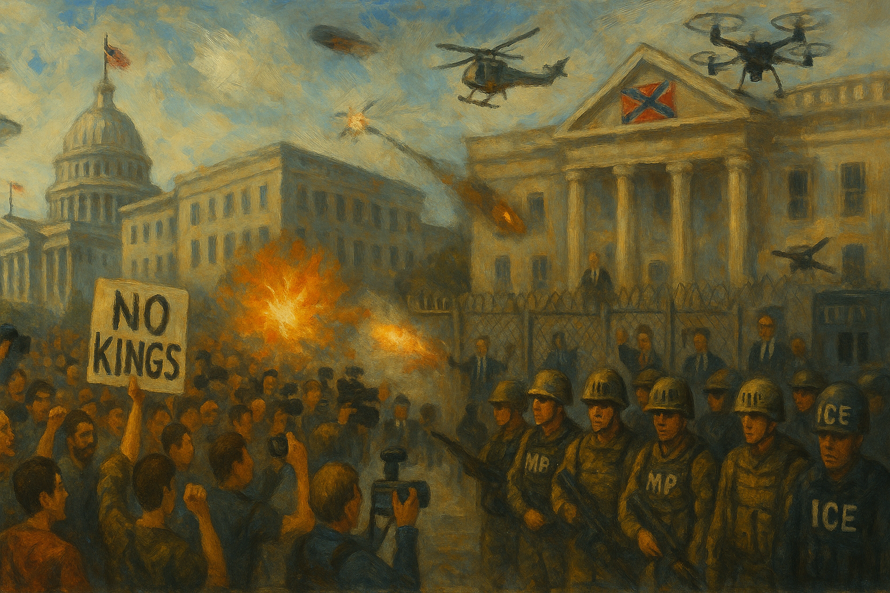

<!-- Generated by build_publish_week_v1 -->
<!-- Header image: image_wide_week21.png -->

# Week 21: Pressure Without Rupture

*Immigration raids, troop deployments, and a senator's forcible removal met fierce court resistance, leaving the clock's needle nearly still.*

The pattern for Week 21 was pressure applied without pause. Nothing exploded. Instead, force built across a dozen fronts at once, each small enough to explain away, all moving in the same direction. The Democracy Clock, which tracks the erosion and repair of democratic structure across the term, registered that buildup. This week's shift was modest in number but wide in reach. It touched immigration enforcement, oversight, public memory, and health administration within a single seven-day span.

At the close of Week 20, the clock stood at 7:41 p.m. It closed Week 21 at the same time, with a net movement of six one-hundredths of a minute. The number is small, but the reason isn't simple stagnation. So much force moved in the authoritarian direction this week that it should have registered as a major shift, but courts pushed back hard and often, on tariffs, on troop deployment, on election rules, on detention practices. Intense pressure met unusually active resistance. The net clock movement stayed almost flat even as the republic's underlying condition grew more strained.

The week's defining story began in Los Angeles. Federal immigration agents launched coordinated raids across the city, using tactics that witnesses and reporters called military in character. Agents chased farmworkers. They struck and detained journalists. They pointed weapons at a pastor who tried to intervene at a detention outside a church. President Trump directed his cabinet to "liberate" the city from what he called a Migrant Invasion. An enforcement operation became, in his telling, an act of war against an American city.

California sued. The state argued that federalizing its National Guard without the governor's consent broke basic constitutional limits on military power. A district court agreed and ruled the federalization unlawful. The Ninth Circuit stayed that ruling within a day. Federal control stayed in place while the appeal moved forward. Marines joined the Guard on the ground. Predator drones flew surveillance missions over the protests. The dispute stopped being about immigration policy and became a live test of whether a state can resist federal military power inside its own borders.

Nor was this contained to one city. Nationally, ICE arrests hit record single-day highs after Stephen Miller pushed for sharply increased quotas. A new proclamation barred entry from twelve countries. Agents detained a pregnant American citizen despite her claim of citizenship. Immigration status was used to punish political speech: a French scientist was denied entry after officials reviewed messages critical of the president, and administration officials pressed to investigate lawmakers who criticized ICE tactics. Raids hit a meatpacking plant in Omaha and produce farms in Ventura County, disrupting food production and stripping workers of their footing in a single afternoon.

As protests spread beyond Los Angeles, the language used to describe them hardened. Representative Anna Paulina Luna claimed, without evidence, that a communist group linked to China was funding the demonstrations. She later announced a formal investigation into the No Kings protest movement on that theory. Speaker Mike Johnson said Governor Newsom "ought to be tarred and feathered." President Trump warned that protesters at his military parade would face "very big force." Several states pre-positioned security forces and issued warnings before demonstrations had even begun. Dissent was framed as danger before a single placard was raised, and force was prepared against a threat largely invented for the occasion.

Millions of people were nonetheless expected to join nationwide No Kings protests by week's end, an act of open, undeterred civic assembly that ran directly against the administration's framing. The scale of the planned turnout suggested that stigmatizing language had not achieved its intended chilling effect, at least not yet. But the attempt itself mattered: officials were testing whether protest could be discredited by association with foreign enemies rather than answered on its merits.

Oversight of the immigration crackdown drew direct retaliation. Members of Congress were denied access to detention facilities in Los Angeles and New York, blocking a basic check on how people were being held. Representative LaMonica McIver was indicted over her conduct during an oversight visit to an ICE facility. Then came the week's most visible confrontation: federal agents forcibly removed Senator Alex Padilla from a DHS press conference and handcuffed him as he tried to question Secretary Noem. A sitting United States senator was dragged from a room for doing his job. That is not a small event. It marked a new low for how the executive was willing to treat legislative scrutiny in real time.

Retaliation against political opponents extended beyond immigration. President Trump ordered investigations into former President Biden's pardons and mental fitness while in office. His pardon attorney reportedly weighed clemency for people involved in the 2020 fake-elector scheme. Miles Taylor filed an inspector general complaint alleging that the investigation order itself was retaliatory. Meanwhile, the intelligence community's own watchdog was undercut when the Director of National Intelligence fired the acting counsel to its inspector general and installed a direct adviser instead. Independent oversight, wherever it touched the administration's interests, came under pressure.

Universities and media organizations faced a parallel campaign. Harvard's ability to host international students was suspended, turning immigration authority into a lever against an academic institution. Funding was frozen or threatened at multiple universities over admissions, hiring, protest policy, and research content. Voice of America moved toward mass layoffs that would gut it as an independent broadcaster. ABC suspended, then fired, a longtime anchor after he criticized a senior aide to the president. The House passed a rescissions bill defunding NPR and PBS. Taken alone, these were budget and personnel decisions. Taken together, they described a state working to narrow the space where independent institutions could operate without political cost.

Public health administration underwent a similarly ideological turn. Health Secretary Robert F. Kennedy Jr. dismissed all seventeen members of the CDC's vaccine advisory committee in a single stroke, replacing independent expertise with handpicked appointees. The EEOC halted processing of gender-identity discrimination claims. HHS proposed cutting LGBTQ-specific counseling from the 988 suicide hotline. Medicaid enrollee data was handed to the Department of Homeland Security, folding a welfare program into an immigration-enforcement pipeline. Each action pushed a system built for neutral service delivery toward a narrower set of political priorities.

Public memory and official record-keeping bent in the same direction. President Trump announced the restoration of Confederate names to seven Army bases, reversing a prior renaming effort. He tried, and failed, to fire the head of the National Portrait Gallery; the Smithsonian's governing board rejected the move outright. The Navy moved to strip Harvey Milk's name from a ship. Government websites were purged of disfavored language. Books were pulled from Naval Academy and military-school libraries. A farm trade report showing an unfavorable deficit was delayed and redacted. None of these acts rewrote history by decree, but together they showed a state trying to choose what could be honored, what could be said, and what could be counted.

Economic administration reflected the same duality as the week's overall structure: aggressive executive assertion met by resistance. Congress passed resolutions blocking California's vehicle emissions standards, another case of federal power overriding a state's own regulatory choice. The World Bank projected a sharp decline in American growth tied to tariff policy, even as the administration doubled steel and aluminum tariffs. The Pentagon estimated the Los Angeles deployment alone would cost taxpayers $134 million, a striking figure for an operation whose legal basis remained contested in the courts.

Courts did real work this week, and it would be wrong to read the flat clock reading as evidence that nothing was resisted. Judges blocked deportations under the Alien Enemies Act. A judge ruled the administration had likely broken the law by canceling the TSA union contract. A federal judge in Massachusetts blocked key parts of the president's election executive order, protecting state authority over voting rules. Judges blocked the elimination of Job Corps and preserved in-state tuition for undocumented students in Texas. These rulings did not undo the week's structural direction, but they mattered: they showed institutions still able to impose real limits, even under sustained pressure.

Congress passed the Aerial Firefighting Enhancement Act through ordinary legislative process, a small but genuine example of routine governance continuing amid the surrounding turbulence. The Election Assistance Commission held public meetings on voting system guidelines, preserving a measure of procedural transparency in an area under active dispute elsewhere. These were modest counterweights, but real ones.

No Kings protests were scheduled to unfold across the country in the days following this period, organized in direct response to the administration's military parade and its broader posture. Whether that mobilization would proceed peacefully, and how federal and state security forces would respond, remained open questions as the week closed.

Week 21 did not mark a rupture in the term's arc. It marked deepening. The tools used this week were largely the tools of prior weeks: immigration enforcement stretched toward military operations, oversight blocked or punished, independent institutions pressured through funding, memory reshaped through symbol and omission. What changed was the confidence behind these tools, and the willingness to turn them on a sitting senator, a major university, and a state government within the same seven days. Courts held some lines. Millions of people prepared to gather in protest rather than stay home. The republic's capacity for resistance had not failed. But the machinery pressing against it had not slowed either, and the space in which that resistance could operate kept narrowing, week by week, action by action.

<!-- Synopses for cross-posting -->
Long Synopsis: Week 21 saw force applied across a dozen fronts at once. Federal agents launched military-style raids in Los Angeles, prompting National Guard federalization over the governor's objection and a Ninth Circuit stay that kept troops deployed. Nationally, ICE arrests hit record highs, a new entry ban targeted twelve countries, and officials treated protest as foreign subversion. Oversight itself came under attack: lawmakers were denied detention access, one was indicted, and Senator Alex Padilla was forcibly removed and handcuffed at a press conference. Universities, public broadcasters, and health agencies faced funding threats and purges of independent expertise. Yet courts pushed back repeatedly, on tariffs, deportations, election rules, and detention. The clock moved just six one-hundredths of a minute, a flat reading masking intense, opposing forces.
Short Synopsis: Immigration raids, a senator's forcible removal, and purges of independent expertise met sustained judicial resistance this week, producing a nearly flat clock reading despite historic pressure toward authoritarian consolidation.

