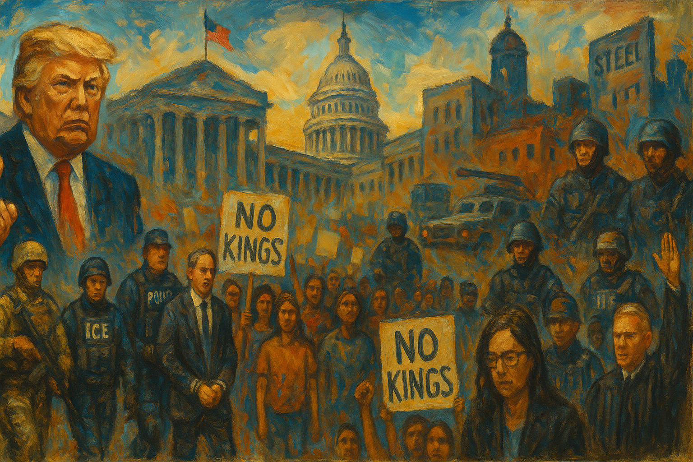

<!-- Generated by build_publish_week_v1 (appendix post) -->
<!-- Header image: image_wide_week22_appendix.png -->

# Week 22 Appendix: Fragmentation as Shelter for Power

*A week of raids, parades, and rulings arrived in overwhelming volume, letting old patterns deepen while institutions struggled to answer any single front.*

This was a high-pressure week defined by the fusion of immigration enforcement, militarized executive power, and politicized state administration. The strongest structural signal came from the use of federal coercive tools against disfavored cities, immigrants, protesters, and even elected officials: ICE raids intensified, sanctuary jurisdictions were targeted, lawmakers’ oversight access was restricted, and Brad Lander’s arrest suggested law enforcement being used in a politically charged way. A second major theme was executive disregard for legal and institutional limits, visible in the TikTok enforcement delay despite statute and court backing, threats to withhold aid, pressure on agencies to conform to presidential narratives, and continued conflict over troop deployments in Los Angeles. Third, the week showed deepening corruption and capture risks: the EPA dropped a case against a major Trump donor, crypto enforcement was loosened amid Trump-linked business interests, and Voice of America was gutted while partisan government messaging expanded. Courts provided meaningful pockets of resistance on immigrant rights, trans rights, grants, and academic freedom, but the overall week still points toward more coercive, personalized, and selectively enforced governance.

Power and Authority

1. The Department of Homeland Security withdrew its list of alleged noncompliant sanctuary jurisdictions (2025-06-14) *[single source]*: The withdrawal showed the administration using and then retreating from a federal pressure tool aimed at states and cities over immigration enforcement.

2. President Trump kept pressing executive actions against sanctuary jurisdictions (2025-06-14) *[single source]*: The policy sought to use federal funding and prosecution threats to force local compliance on immigration, testing the line between federal authority and local autonomy.

3. President Trump called for mass deportations focused on major Democratic-run cities (2025-06-15): The directive framed immigration enforcement as a political campaign against opposition-led cities, expanding executive coercion through selective targeting.

4. President Trump deployed National Guard troops and Marines to Los Angeles over protests and immigration unrest (2025-06-15): The federal troop deployment without state consent raised major questions about domestic military use, state authority, and executive control over civil unrest.

5. President Trump held a military parade in Washington (2025-06-14): The parade used military display in a civilian political setting, reinforcing personalist symbolism and the public projection of executive power.

6. President Trump issued an executive order implementing the U.S.-UK Economic Prosperity Deal (2025-06-16): The order used executive authority to shape trade policy and supply-chain rules, concentrating major economic decisions in the presidency.

7. Katie Miller pressured the Social Security commissioner not to contradict President Trump (2025-06-16) *[single source]*: The pressure suggested White House efforts to bend agency communications to presidential claims, weakening independent administration of public information.

8. President Trump ordered ICE to resume raids on farms and hotels after a brief pause (2025-06-17): The reversal showed volatile executive control over immigration enforcement, with major effects on workers, employers, and the predictability of state power.

9. The State Department required student and exchange visa applicants to make social media available for review (2025-06-18): The rule expanded ideological screening by the executive branch and tied entry to the United States to broad disclosure of personal expression.

10. President Trump suggested he could withhold disaster aid from California (2025-06-18): The threat implied that federal relief could be used as leverage against a political rival, testing neutral administration of public resources.

11. The Department of Homeland Security issued guidance requiring advance notice for congressional visits to detention facilities (2025-06-19): The guidance limited immediate oversight of detention operations and strengthened executive control over access to coercive state institutions.

12. President Trump extended the TikTok enforcement delay by executive order (2025-06-19): The extension asserted executive discretion over a law already enacted and upheld, raising separation-of-powers concerns about selective nonenforcement.

13. Secretary Pete Hegseth ordered a passive approach to Juneteenth messaging at the Pentagon (2025-06-19): The directive used executive control over official messaging to downplay a federal holiday tied to Black emancipation and public memory.

14. President Trump kept in place the cancellation of asylum appointments at the U.S.-Mexico border (2025-06-19) *[single source]*: The action blocked a legal entry pathway for asylum seekers and concentrated border access decisions in unilateral executive control.

15. The Trump administration ordered two Michigan coal plants to remain open (2025-06-20) *[single source]*: The order overrode planned closures through emergency-style federal authority, challenging state energy policy and expanding presidential control over industry.

16. The Trump administration terminated hundreds of Voice of America and USAGM employees (2025-06-20): The cuts sharply reduced a federally funded news network, giving the executive branch greater power over the reach and survival of public-interest journalism.

Institutions and Governance

1. The Michigan Republican Party sued Secretary of State Jocelyn Benson over election administration (2025-06-14) *[single source]*: The lawsuit sought to reshape election administration rules in a battleground state, putting court pressure on how voting systems are run.

2. Judge Charles Breyer ordered federal control of California National Guard troops returned to the state before an appellate stay (2025-06-14): The ruling tested judicial checks on presidential military action inside a state and highlighted conflict over federal and state authority.

3. The Trump administration complied with a Supreme Court order to return Kilmar Abrego Garcia to the United States (2025-06-15): The compliance showed the judiciary still able to compel executive action in an immigration case after earlier resistance.

4. Representative Thomas Massie and other lawmakers introduced bipartisan war powers measures on Iran (2025-06-16): The measures sought to reassert Congress's constitutional role over military action and limit unilateral presidential war decisions.

5. A Colorado jury ordered Mike Lindell to pay damages for defaming a former Dominion employee (2025-06-16): The verdict imposed legal accountability for false election claims and reinforced court-based limits on disinformation about voting systems.

6. Judge William Young ruled NIH grant terminations unlawful and discriminatory (2025-06-16): The ruling checked executive grant cuts that the court found discriminatory, defending legal limits on agency funding decisions.

7. The American Bar Association sued the Trump administration over executive orders targeting law firms (2025-06-16) *[single source]*: The suit challenged executive actions seen as coercing the legal profession, raising rule-of-law concerns about retaliation against institutional critics.

8. State coalitions and nonprofits sued over terminated Justice Department violence-prevention grants (2025-06-16) *[single source]*: The case challenged executive withdrawal of congressionally supported grant programs that affected public safety and nonprofit capacity.

9. The Supreme Court granted review in several cases and vacated one lower-court judgment (2025-06-16): The orders signaled the Court's continuing role in setting national legal agendas and redirecting lower-court doctrine.

10. The Federal Election Commission announced filing dates for Virginia's 11th District special election (2025-06-16): The notice set campaign reporting rules for a federal special election and maintained procedural transparency in election finance.

11. The Department of Veterans Affairs removed anti-discrimination language from internal guidelines (2025-06-16) *[single source]*: The change weakened formal protections inside a federal institution, affecting how veterans and staff could expect equal treatment.

12. The Senate confirmed Rodney Scott as commissioner of Customs and Border Protection (2025-06-18) *[single source]*: The confirmation placed a controversial figure atop a major enforcement agency, shaping accountability and institutional culture at the border.

13. The California Assembly passed a bill that could narrow access to police personnel records (2025-06-17) *[single source]*: The bill could reduce transparency around police misconduct records, affecting public oversight of law enforcement institutions.

14. Congress reviewed security arrangements after the Minnesota shootings (2025-06-17): The review reflected institutional adaptation to political violence and the need to protect elected officials without normalizing intimidation.

15. Congressional Democrats opened inquiries and proposed legislation on President Trump's cryptocurrency dealings (2025-06-17) *[single source]*: The oversight push aimed to test conflicts of interest and whether public office was being used for private financial gain.

16. Judge Julia Kobick blocked passport restrictions on transgender and intersex applicants (2025-06-17): The injunction limited executive control over identity documents and affirmed judicial review of rights-affecting administrative rules.

17. Federal courts issued multiple injunctions and stays in challenges to Trump administration actions (2025-06-17): The rulings showed courts continuing to slow, narrow, or pause executive actions across education, grants, records, and immigration cases.

18. The Election Assistance Commission requested comments on an election office staffing survey (2025-06-17): The survey sought data on election administration capacity, supporting institutional planning for running elections.

19. Democrats on the Senate Judiciary Committee boycotted a Republican hearing on President Biden's mental fitness (2025-06-18): The boycott underscored partisan breakdown in congressional oversight and the use of hearings as political theater rather than shared fact-finding.

20. Senators Mike Lee and Steve Daines advanced a budget amendment authorizing large public land sales (2025-06-18) *[single source]*: The amendment would speed major land transfers with less public input, shifting governance away from open deliberation on shared resources.

21. Governor Patrick Morrisey ended West Virginia state support for Juneteenth observances (2025-06-18): The decision withdrew official recognition from a civil-rights holiday, showing how state institutions shape public memory and inclusion.

22. Judge Kathleen Williams held Florida Attorney General James Uthmeier in contempt over a blocked immigration law (2025-06-18): The contempt finding defended judicial authority against a state official who kept pushing enforcement after a court order.

23. Judge Dana Sabraw ordered the Trump administration to restore legal services for separated migrant families (2025-06-18) *[single source]*: The order enforced a settlement and required the government to resume services owed to families harmed by prior federal policy.

24. The Supreme Court upheld Tennessee's ban on gender-affirming care for minors (2025-06-18): The ruling narrowed constitutional protection claims in a major rights dispute and set a national judicial marker for similar state laws.

25. The Supreme Court released opinions in several cases on June 18 (2025-06-18): The opinions added new binding precedent across environmental, administrative, and prisoner-rights disputes, shaping national legal rules.

26. New York representatives Dan Goldman and Jerry Nadler were denied entry to an ICE facility despite seeking an oversight visit (2025-06-19) *[single source]*: The denial obstructed legislative oversight of detention operations and sharpened conflict between Congress and the executive branch.

27. The Ninth Circuit allowed President Trump to keep control of California National Guard troops during the appeal (2025-06-19): The ruling strengthened federal control in an active state-federal dispute over domestic troop deployment while the case continued.

28. The Supreme Court allowed a challenge to California's vehicle emission waiver to proceed (2025-06-20): The decision reopened litigation over a long-standing state regulatory power, affecting the balance between federal and state environmental authority.

29. The Supreme Court released opinions in several cases on June 20 and denied expedited review in one case (2025-06-20): The Court continued shaping national law through merits decisions while declining to fast-track another dispute involving the administration.

30. The Federal Election Commission canceled a scheduled open meeting (2025-06-20): The cancellation reduced public visibility into election-regulation deliberations and limited routine transparency around agency decision-making.

31. Congress enacted joint resolutions overturning an OCC bank-merger rule and an EPA air-quality rule (2025-06-20): The laws used congressional disapproval to reverse agency rules, showing direct legislative intervention in regulatory governance.

Economic Structure

1. The Environmental Protection Agency dropped its enforcement case against Geo Group (2025-06-14) *[single source]*: The decision raised concerns that regulatory enforcement could bend toward a politically connected contractor rather than neutral public-health standards.

2. The Trump administration paused workplace immigration raids in agriculture and hospitality before reversing course (2025-06-14): The brief pause showed immigration enforcement being adjusted around employer labor needs, linking coercive policy to economic interests.

3. Target rolled back diversity, equity, and inclusion initiatives (2025-06-15) *[single source]*: The rollback showed large firms adapting internal policy to a changed political climate, with effects on workplace inclusion and corporate accountability.

4. Eric Trump and the Trump Organization announced Trump Mobile (2025-06-15): The launch raised conflict-of-interest concerns by expanding a family business while the presidency still shaped markets and regulation.

5. The Centers for Disease Control and Prevention opened multiple public comment processes on health and research data collections (2025-06-16): The notices maintained routine administrative channels for public input into health data systems that support policy and oversight.

6. The Food and Drug Administration issued multiple patent-review determinations and regulatory notices for drugs and devices (2025-06-16): The actions affected market exclusivity, product review, and industry compliance across health sectors, shaping access and competition through administrative process.

7. The Environmental Protection Agency issued routine corrections, exemptions, hearings, and permit-related actions (2025-06-16): The actions adjusted environmental compliance rules and permit processes that shape industrial costs, pollution controls, and public participation.

8. The Federal Communications Commission issued notices on information collections and advisory work (2025-06-16): The notices affected communications regulation, compliance burdens, and public input into technical and market rules.

9. The Office of Management and Budget and procurement agencies advanced multiple federal acquisition and accounting review notices (2025-06-16): The reviews shaped contractor reporting and procurement oversight, affecting how public money is monitored in federal contracting.

10. Commerce Secretary Howard Lutnick announced a waitlist for a $5 million Trump Card residency program (2025-06-16): The proposal linked immigration access to wealth, reinforcing a market-based hierarchy in entry and residency policy.

11. The Securities and Exchange Commission and the Trump administration dropped or loosened cryptocurrency enforcement actions (2025-06-17) *[single source]*: The pullback raised concerns that financial oversight was being softened in ways that benefited politically connected crypto interests.

12. The National Archives and Records Administration announced a policy advisory committee meeting on classified information programs (2025-06-17): The meeting supported intergovernmental coordination on security information rules that affect public administration and private-sector obligations.

13. The Drug Enforcement Administration published controlled-substance manufacturing and import registration applications (2025-06-18): The applications shaped who may produce or import tightly regulated substances, affecting research, pharmaceutical supply, and federal oversight.

14. President Trump criticized Federal Reserve Chair Jerome Powell after rates were not cut (2025-06-18): The attacks put public pressure on an independent economic institution, testing norms that shield monetary policy from direct political control.

15. Amazon and Verizon withdrew support for Juneteenth celebrations (2025-06-18): The pullbacks showed corporate retreat from public diversity commitments under political and regulatory pressure, affecting civic and cultural funding.

16. The General Services Administration advanced environmental review decisions for federal infrastructure projects (2025-06-20): The actions moved forward major federal construction and border infrastructure decisions through formal environmental review channels.

17. The Chinese government and Chinese banks kept subsidizing manufacturing while banks slowed some industrial lending (2025-06-20) *[single source]*: The developments showed state-directed industrial policy shaping market competition, employment, and financial risk in a major trading economy.

Civil Rights and Dissent

1. A federal judge denied Mahmoud Khalil's release from detention (2025-06-14): The ruling left a political activist in immigration detention without criminal charges, intensifying due-process and retaliation concerns.

2. Immigration and Customs Enforcement increased arrests of immigrants without criminal records (2025-06-14): The surge broadened coercive enforcement against non-criminal migrants and increased the rights burden on immigrant communities.

3. Immigration and Customs Enforcement planned special response deployments to several Democratic-led cities (2025-06-14): The move linked immigration enforcement with protest management and raised fears of militarized policing of dissent in opposition-led areas.

4. The Texas Department of Public Safety evacuated the Texas Capitol after threats tied to a protest day (2025-06-14): The evacuation showed how threats of political violence can disrupt democratic participation and intimidate public officials.

5. Protest organizers and participants held large No Kings and anti-ICE demonstrations across the country (2025-06-14): The protests showed broad civic mobilization against executive overreach and immigration crackdowns, reinforcing public dissent as a democratic check.

6. A gunman posing as a police officer killed Minnesota Representative Melissa Hortman and wounded Senator John Hoffman and their spouses (2025-06-14): The attack brought lethal political violence directly into state governance and threatened the safety needed for democratic service.

7. The Trump administration considered expanding the travel ban to dozens more countries (2025-06-14): The possible expansion would widen nationality-based exclusion and further restrict entry rights through executive immigration policy.

8. President Trump attempted to end birthright citizenship by executive order (2025-06-15) *[single source]*: The order challenged a core constitutional basis of citizenship and threatened equal membership rights for children born in the United States.

9. Secretary Pete Hegseth renamed a Navy vessel that had honored Harvey Milk (2025-06-15): The renaming withdrew official recognition from an LGBTQ figure and signaled state-backed exclusion in military symbolism.

10. The FBI added Vance Boelter to its most wanted list and offered a reward before his arrest (2025-06-15): The manhunt reflected the seriousness of politically targeted violence against elected officials and the need to protect democratic actors.

11. Stephen Miller and ICE leadership pushed for 3,000 immigration arrests per day and workplace targeting (2025-06-15): The directive intensified mass enforcement and increased the risk of broad rights violations in everyday public spaces and workplaces.

12. Governor Ron DeSantis said drivers could run over protesters if they felt threatened (2025-06-15) *[single source]*: The statement risked chilling peaceful assembly by signaling official tolerance for violence against demonstrators.

13. Los Angeles police used tear gas and projectiles to disperse protesters after a No Kings demonstration (2025-06-15) *[single source]*: The forceful dispersal raised concerns about whether protest rights were being narrowed through aggressive crowd-control tactics.

14. A peacekeeper at a Salt Lake City No Kings protest fatally shot a demonstrator during a confrontation involving an armed man (2025-06-15) *[single source]*: The shooting showed how protest spaces were becoming more dangerous and how violence can distort the exercise of assembly rights.

15. Immigration and Customs Enforcement conducted raids and detentions in Los Angeles, including at Home Depot parking lots (2025-06-16): The raids spread fear through immigrant communities and raised due-process and profiling concerns in routine public and work spaces.

16. Police in metro Atlanta and ICE arrested journalist Mario Guevara while he covered a protest and transferred him to immigration custody (2025-06-16) *[single source]*: The arrest and transfer blurred protest policing, immigration enforcement, and press freedom, increasing risk for journalists covering dissent.

17. The Department of Homeland Security reversed the brief pause on raids at farms, hotels, and restaurants (2025-06-16): The reversal restored broad workplace enforcement against migrant labor and deepened insecurity for workers in vulnerable sectors.

18. President Trump fired Nuclear Regulatory Commission Commissioner Christopher Hanson without cause, according to Hanson (2025-06-16): The removal raised concerns about whether independent officials could be pushed out for political reasons, weakening institutional protections against arbitrary power.

19. The Los Angeles district attorney and federal prosecutors pursued additional charges and cases against anti-ICE demonstrators (2025-06-17) *[single source]*: The prosecutions raised concerns that criminal law was being used in ways that could chill protest and public opposition to federal raids.

20. Federal prosecutors filed federal charges against Vance Boelter over the Minnesota shootings (2025-06-17): The charges treated the attacks as a grave threat to democratic officials and underscored the legal response to political violence.

21. California lawmakers reported harsh conditions for detainees after visiting an ICE facility (2025-06-17) *[single source]*: The reports pointed to rights and dignity concerns inside detention and highlighted the human cost of intensified immigration enforcement.

22. Mayor Karen Bass lifted the downtown Los Angeles curfew imposed after protests (2025-06-17): The move eased a restriction on public movement and assembly after days of unrest tied to immigration enforcement.

23. The NAACP declined to invite President Trump to its national convention (2025-06-17): The decision marked organized civil-rights opposition to the administration and reflected deep conflict over equal citizenship and representation.

24. The Los Angeles Dodgers denied federal agents access to Dodger Stadium property (2025-06-18): The refusal showed a local institution resisting visible immigration enforcement activity amid widespread fear in immigrant communities.

25. Journalists, legal observers, and protesters sued DHS and Secretary Kristi Noem over alleged protest suppression (2025-06-18): The lawsuit challenged alleged excessive force and defended First Amendment protections for protest and reporting.

26. Brad Lander was arrested by ICE and other federal agents outside immigration court and later released without charges (2025-06-17): The arrest of an elected official accompanying an immigrant raised concerns about intimidation, selective enforcement, and the policing of advocacy.

27. Immigration and Customs Enforcement detained Oregon vineyard manager Moises Sotelo-Casas and moved him without informing family or counsel (2025-06-19): The detention highlighted the human and economic impact of raids on farm labor and concerns about transparency in custody transfers.

28. The Trump administration rescinded guidance treating schools and churches as protected areas from immigration arrests (2025-06-19) *[single source]*: The change removed informal safe spaces for undocumented people and expanded the reach of enforcement into core civic institutions.

29. Juneteenth organizers and communities faced reduced or canceled celebrations as sponsors and governments withdrew support (2025-06-19) *[single source]*: The cutbacks weakened public recognition of Black emancipation and narrowed civic space for shared historical commemoration.

30. An Australian writer was denied entry to the United States after questioning about his protest coverage and views (2025-06-19) *[single source]*: The denial suggested border screening could be used against political expression and journalism tied to protest movements.

31. Federal prosecutors moved to drop charges against Los Angeles protester Jose Manuel Mojica (2025-06-19): The dismissal cast doubt on an aggressive protest prosecution and highlighted the stakes of federal charging decisions during demonstrations.

Information, Memory and Manipulation

1. President Trump removed the Martin Luther King Jr. bust from the Oval Office and the White House gave limited explanation (2025-06-15) *[single source]*: The move affected symbolic public memory inside the presidency and raised questions about how civil-rights history was being curated.

2. The Pentagon rapid response team used official social media to attack critics and promote Secretary Hegseth's agenda (2025-06-15) *[single source]*: The activity blurred public communication with partisan messaging and weakened trust in official information channels.

3. President Trump dismissed climate change predictions after a weather forecast did not match conditions (2025-06-15) *[single source]*: The statement spread misleading claims about science and undercut evidence-based public understanding of climate risk.

4. The Government Accountability Office found the Trump administration broke the law by freezing funds for libraries, archives, and museums (2025-06-16) *[single source]*: The finding showed unlawful interference with institutions that preserve records, culture, and public memory.

5. President Trump dismissed intelligence assessments on Iran's nuclear timeline (2025-06-16): The rejection of intelligence findings weakened the credibility of expert analysis in a high-stakes national security debate.

6. Public health officials and former vaccine advisers warned that resignations and firings were undermining objective use of health data (2025-06-16) *[single source]*: The warnings pointed to politicization of scientific information systems that guide vaccine policy and public trust.

7. Right-wing media figures and Senator Mike Lee spread false claims after the Minnesota lawmaker killings (2025-06-17): The misinformation distorted a political violence case and showed how elite amplification can quickly reshape public understanding of events.

8. The Trump administration issued a stop-work order for the LGBTQ-focused 988 suicide hotline service (2025-06-18) *[single source]*: The order cut a specialized information and support channel for a vulnerable group, narrowing targeted public-health communication.

9. President Trump and Tulsi Gabbard made competing public claims about Iran intelligence and media coverage (2025-06-19): The conflicting statements added confusion around national security facts and weakened confidence in authoritative public information.

10. President Trump claimed he deserved the Nobel Peace Prize (2025-06-19) *[single source]*: The statement sought to shape public perception of his foreign-policy record through self-promotional narrative rather than verifiable outcomes.

11. President Trump called for a special prosecutor to investigate the 2020 election again (2025-06-19) *[single source]*: The demand revived false claims about a settled election and further eroded trust in electoral legitimacy.

