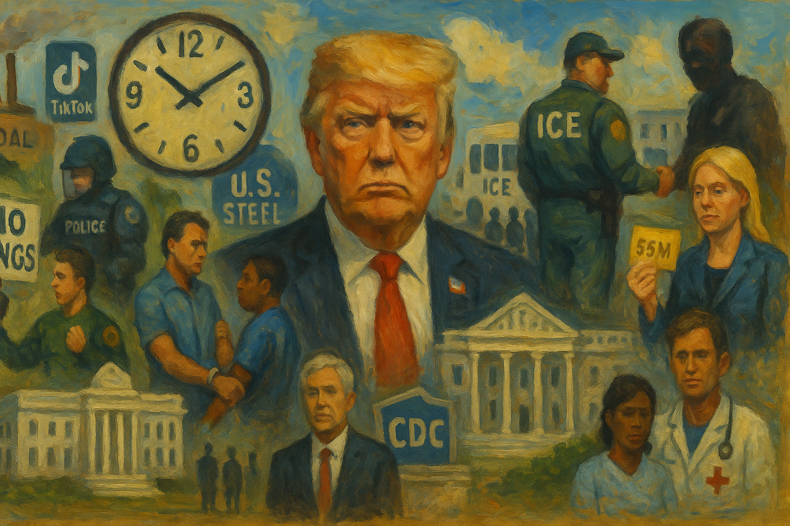

<!-- Generated by build_publish_week_v1 -->
<!-- Header image: image_wide_week22.png -->

# Week 22: Fragmentation as Shelter for Power

*A week of raids, parades, and rulings arrived in overwhelming volume, letting old patterns deepen while institutions struggled to answer any single front.*

The Democracy Clock barely moved this week, and that stillness is itself the story. Week 22 delivered no single rupture, no clean reset of the hands. Instead it delivered volume: raids, parades, firings, lawsuits, protests, and rulings arrived from every direction at once. The flood was dense enough that no single thread dominated the news cycle for long. That pattern deserves a name. When power multiplies its fronts faster than institutions can answer any one of them, fragmentation itself becomes a kind of shelter. Almost nothing this week was new. Nearly everything was familiar, deepened, and repeated with more confidence than before.

At the close of Week 21, the public clock read 7:41 p.m. It closed Week 22 at the same time, with an internal shift of one tenth of a minute buried beneath a surface of accumulating pressure. The number looks calm. It is not. It reflects a week of very high coercive activity, met by courts, protests, and internal contradictions strong enough to blunt the shock but not to reverse it. Federal power expanded aggressively against opposition cities and dissenting citizens. Judicial pushback was real, but it could not fully arrest the trend. The week deepened old wounds more than it opened new ones.

The clearest throughline began with a directive that read like a campaign strategy dressed as immigration policy. The president ordered ICE to concentrate deportation efforts on Democratic-run cities, naming them outright as targets. Enforcement became a weapon here, aimed less at uniform application of law than at punishing places that had opposed him. Federal troops and Marines moved into Los Angeles over the objections of state officials. ICE agents appeared in Home Depot parking lots and other everyday spaces where day laborers gathered. Raids intensified even after a brief pause for farm and hospitality workers, a pause reversed within days under apparent political pressure. Each retreat and advance suggested less a coherent plan than a governing style built on volatility itself.

The human cost of that volatility surfaced in small, concrete details. An Oregon vineyard manager was detained and moved without notice to his family. Protected-area guidance shielding schools and churches from immigration arrests was quietly withdrawn. Informal sanctuaries that had let undocumented families move through ordinary civic life without fear disappeared overnight. None of this was a singular tragedy. Together it showed a widening net, cast without much discretion, in service of a message aimed at cities that had voted the wrong way.

Civil society did not stay silent. Nationwide No Kings and anti-ICE demonstrations drew enormous crowds, a visible answer to the enforcement surge. But the state's response revealed its own hardening. Los Angeles police used tear gas and projectiles against a largely peaceful crowd. Governor DeSantis suggested drivers could run over protesters who felt threatened, a statement that all but sanctioned vehicular violence against demonstrators. Federal prosecutors pursued charges against protesters with unusual persistence, even as some cases later collapsed, including one dropped against a man accused of assaulting officers.

The reach of enforcement extended past ordinary protesters into more surprising territory. Journalist Mario Guevara was arrested while covering a demonstration and transferred into ICE custody. Immigration enforcement folded directly into the policing of the press. New York City Comptroller Brad Lander was arrested by federal agents outside immigration court while accompanying an immigrant, then released without charges. An elected official swept up this way was not an isolated incident. It was a signal: proximity to dissent, even from officials, now carried real risk.

Beneath the immigration story ran a second, quieter contest over institutional access. The Department of Homeland Security issued new guidance requiring advance notice before members of Congress could visit detention facilities, a rule that conflicted with existing statute. It slowed oversight precisely when scrutiny was most needed. New York representatives Dan Goldman and Jerry Nadler were denied entry to an ICE facility despite seeking exactly that kind of visit. Meanwhile the fight over the California National Guard played out in real time in the courts. A district judge ordered federal control returned to the state. The Ninth Circuit reversed course and let the president keep command while the appeal continued. The back-and-forth showed judicial independence still functioning, but not always fast enough to check the executive branch in the moment it mattered most.

Courts did register real resistance elsewhere. A federal judge ruled the administration's termination of NIH research grants unlawful and discriminatory. Another blocked passport rules that would have restricted transgender and intersex applicants. A Florida attorney general was held in contempt for defying an order tied to a blocked immigration law. These rulings mattered. They confirmed that judicial review remained a live constraint, even as the pace of executive action outstripped the courts' ability to answer all of it.

The administration's appetite for unilateral control was not confined to immigration. President Trump extended, by executive order, the delay in enforcing a law on TikTok that Congress had passed and the courts had upheld. He asserted personal discretion over a matter Congress had already settled. He also suggested he might withhold wildfire disaster aid from California, turning emergency relief into potential leverage against a political rival. The Department of Energy ordered two Michigan coal plants to stay open under emergency authority, overriding planned closures and state energy policy in one stroke. A Nuclear Regulatory Commission member was fired without cause, by his own account, thinning the independence of a body meant to sit apart from politics. Pressure was applied inside the Social Security Administration to keep leadership from contradicting presidential claims. No single one of these acts marks a dramatic escalation. Together they describe an executive branch that treats institutional boundaries as negotiable rather than fixed.

Financial entanglement deepened alongside political control. The Environmental Protection Agency dropped its enforcement case against Geo Group, a major Trump donor and government contractor, raising a capture concern that goes beyond ordinary deregulatory preference. Cryptocurrency enforcement loosened at the Securities and Exchange Commission even as the president's own family expanded ventures in the space. Eric Trump and the Trump Organization launched Trump Mobile, a new consumer business entering the market while tariff policy and undisclosed partnerships sat squarely under presidential control. Congressional Democrats opened inquiries into the president's crypto dealings. Oversight attempts continued even where enforcement did not.

Information control moved on two fronts that mirrored each other. Official channels grew more aggressive in message discipline: the Pentagon's rapid-response team used government social media to attack critics, and public officials pushed false narratives blaming the political left after the assassination of Minnesota lawmaker Melissa Hortman and the wounding of Senator John Hoffman and their spouses. At the same time, independent and public-interest information channels lost ground. The administration terminated 639 Voice of America and USAGM employees, a near-dismantling of a major federally funded broadcaster. The Government Accountability Office found that the administration had unlawfully frozen funds for libraries, archives, and museums, striking directly at institutions built to preserve public memory and hold power accountable across time.

Citizenship itself became more visibly a matter of price and politics. The president moved again to end birthright citizenship by executive order, testing a constitutional guarantee that has stood since Reconstruction. At nearly the same moment, Commerce Secretary Howard Lutnick opened a waitlist for a five-million-dollar "Trump Card" residency program, offering fast entry to those who could pay. The State Department began requiring student and exchange visa applicants to disclose social media for ideological review. An Australian writer was denied entry after questioning about his coverage of protests. Read together, these actions sketched a hierarchy of belonging: heritage-based exclusion at one end, wealth-based fast access at the other, and ideological screening in between.

The killing of Representative Hortman and the wounding of Senator Hoffman ran through the week as a grim undercurrent, touching several developments without settling fully into any one of them. It forced Congress to review its own security. It produced federal charges against the suspect. It also produced a wave of disinformation, spread by right-wing media figures and at least one sitting senator, falsely tying the attacker to the political left. The episode showed how quickly shared grief could be pressed into partisan narrative, and how little resistance that met in the moment.

A final cluster of actions, smaller in scale but consistent in direction, touched the terrain of public memory. The Navy ship once named for Harvey Milk was stripped of that name. The Martin Luther King Jr. bust was quietly removed from the Oval Office, with little explanation offered. West Virginia's governor ended state support for Juneteenth observances. Amazon and Verizon withdrew sponsorship of Juneteenth celebrations in the same week the holiday was meant to be marked. No single action here reshapes law. Together they describe a steady narrowing of whose history the state chooses to honor, and whose it lets recede.

Congress showed flashes of its own initiative. Bipartisan lawmakers introduced war powers measures aimed at reasserting control over potential military action against Iran. A Colorado jury ordered Mike Lindell to pay damages for defaming a former Dominion employee, a rare moment of legal accountability for false election claims. The NAACP declined, for the first time in over a century, to invite the sitting president to its national convention. None of this reversed the week's larger current. But it showed that resistance remained organized, visible, and occasionally effective.

Scheduled proceedings will carry consequences into the weeks ahead. The Ninth Circuit's ruling on National Guard control remains under appeal, and the underlying dispute over federal authority in Los Angeles is far from resolved. The GAO's finding on the unlawful funding freeze for libraries, archives, and museums invites further congressional or judicial follow-through. The Federal Election Commission's cancellation of its scheduled open meeting, left unexplained, leaves a gap in the public record still to be accounted for.

Nothing about Week 22 marks a single decisive turn. It reads instead as consolidation: old patterns pursued with more confidence and less apparent restraint. Federal power pressed harder against opposition-led cities. Independent information channels lost more ground than they gained. Citizenship grew more contingent on wealth and ideology. Courts still functioned, protests still gathered, Congress still asked its questions. But each of these checks moved more slowly than the executive action they were meant to constrain. The week's stillness on the public clock conceals a widening gap between the machinery of accountability and the speed of its adversary. That gap, more than any single event, is what future readers will need to understand about this moment.

<!-- Synopses for cross-posting -->
Long Synopsis: Week 22 saw no single rupture, but a flood of coercive activity that outpaced institutional response. The administration directed ICE to target Democratic-run cities by name, deployed troops to Los Angeles, and reversed a brief pause on workplace raids. An Oregon vineyard manager was detained, protected-area guidance for schools and churches was withdrawn, and journalist Mario Guevara was arrested and transferred to ICE custody. Nationwide No Kings protests drew massive crowds, met by tear gas, prosecutions, and a Florida official's suggestion that drivers could run over demonstrators. Courts blocked some actions, including unlawful NIH grant terminations and passport restrictions, but appellate rulings also preserved federal troop control pending appeal. The EPA dropped an enforcement case against a major Trump donor, crypto oversight loosened, and Voice of America lost 639 employees. The public clock barely moved, concealing a widening gap between accountability and executive speed.
Short Synopsis: Immigration raids, military deployment, and protests collided this week as federal power targeted opposition cities while courts, journalists, and civil society pushed back with uneven success. The clock barely moved, masking a week of dense, confident consolidation.

