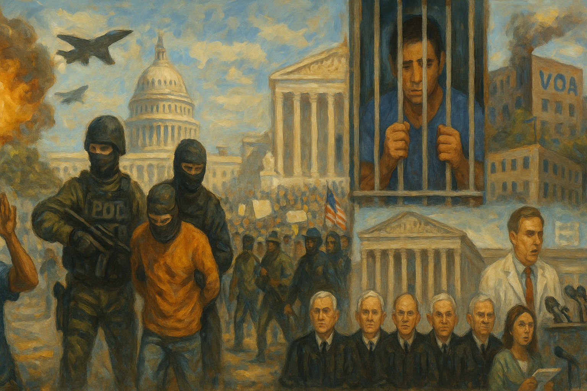

<!-- Generated by build_publish_week_v1 (appendix post) -->
<!-- Header image: image_wide_week23_appendix.png -->

# Week 23 Appendix: Secrecy as War-Making Method

*Unauthorized strikes, militarized immigration raids, and curated intelligence fused into a week where executive power acted first and explained, if ever, later.*

This week delivers a concentrated shock to multiple pillars of American democracy. The most acute pressure comes from unilateral war-making against Iran, framed with manipulated intelligence and followed by efforts to restrict congressional access to classified assessments. That campaign, combined with domestic troop deployments against immigration protesters, normalizes emergency-style executive power and blurs civil–military boundaries. Simultaneously, immigration enforcement is weaponized at scale: masked raids, record detentions, deaths and medical neglect in custody, expansion of private detention, and plans for massive new camps like “Alligator Alcatraz” collectively signal a system where law is a tool of fear rather than a limit on state power. The Supreme Court’s decisions narrowing nationwide injunctions and limiting Medicaid patients’ ability to sue, together with a hard-right immigration docket, structurally weaken judicial checks just as the executive and DOJ test open defiance of court orders. Information and knowledge systems are also targeted: mass firings at Voice of America, threats and investigations against journalists, politicization of vaccine and health science bodies, and pressure on universities and DEI infrastructure. Against this, there are pockets of resistance—federal judges rebuking ICE and DOJ abuses, state and civil society lawsuits, and a high-profile progressive electoral win in New York—but they operate in an environment of accelerating authoritarian drift.

Power and Authority

1. President Donald Trump ordered large-scale airstrikes on Iranian nuclear facilities without congressional authorization (2025-06-21): Trump’s unilateral bombing of Iranian nuclear sites, conducted without a declaration of war or clear imminent threat, concentrated war-making power in the executive and sidestepped constitutional checks on the use of force.

2. President Donald Trump publicly dismissed U.S. intelligence assessments on Iran’s nuclear intentions (2025-06-21): By rejecting his own intelligence community’s finding that Iran was not building a nuclear weapon, Trump weakened evidence-based national security decision-making and opened space for policy driven by politics and foreign partners’ claims.

3. President Donald Trump called for a special prosecutor to investigate baseless 2020 election fraud claims (2025-06-21): Trump’s renewed demand for a special prosecutor into already-discredited 2020 fraud allegations kept a false narrative of a stolen election alive, undermining confidence in electoral outcomes and justifying future restrictive measures.

4. President Donald Trump threatened Iran with greater retaliation for any response to U.S. strikes (2025-06-21): Trump’s public warning that any Iranian retaliation would be met with greater force escalated the risk of open-ended conflict driven by executive rhetoric rather than deliberative policy.

5. President Donald Trump revoked security clearances of several former senior officials (2025-06-25): Stripping former national security officials of clearances during an international crisis reduced continuity of expertise and signaled willingness to use access to classified information as a political tool.

6. President Donald Trump removed Director of National Intelligence Tulsi Gabbard from a Senate Iran briefing team (2025-06-25): Pulling the DNI from a key Iran briefing and substituting other loyal officials narrowed the range of information reaching senators and further politicized intelligence oversight.

7. President Donald Trump ordered deployment and federalization of National Guard and Marines to Los Angeles over state objections (2025-06-21): Federalizing and deploying thousands of troops to Los Angeles to support immigration raids over state leaders’ objections blurred civil–military lines and used federal force to control a disfavored jurisdiction.

8. President Donald Trump announced restrictions on classified information sharing with Congress after an intelligence leak (2025-06-26): By curbing Congress’s access to classified assessments following a leak about Iran strikes, the administration weakened legislative oversight of war powers and centralized control over critical information.

9. President Donald Trump publicly attacked Rep. Thomas Massie for introducing a War Powers Resolution (2025-06-23): Trump’s attacks on a Republican lawmaker for questioning unauthorized military action signaled intolerance for intra-party oversight and discouraged congressional checks on executive war powers.

10. President Donald Trump called for cancellation of Israeli Prime Minister Benjamin Netanyahu’s corruption trial (2025-06-26): Urging that a foreign leader’s bribery and fraud trial be canceled invited political interference in another country’s judiciary and normalized viewing corruption prosecutions as illegitimate “witch hunts.”

11. President Donald Trump called for regime change in Iran on social media (2025-06-22): Openly advocating regime change in Iran without congressional debate or allied backing raised the stakes of U.S. involvement and framed foreign policy around leader preferences rather than stable doctrine.

12. President Donald Trump announced a ceasefire between Israel and Iran and then publicly rebuked Israel for violating it (2025-06-25): Trump’s personal announcement of a ceasefire and subsequent public scolding of Israel underscored how major conflict diplomacy was being run through his social media persona rather than institutional channels.

13. President Donald Trump terminated U.S. trade discussions with Canada over its Digital Services Tax (2025-06-26): Halting trade talks with Canada in retaliation for its digital tax on U.S. firms used bilateral economic relations as a personal leverage tool, risking broader economic and diplomatic fallout.

14. President Donald Trump called for resettling Afrikaners while barring other refugees from travel-ban countries (2025-06-27): Prioritizing resettlement of Afrikaners while excluding refugees from travel-ban nations embedded ideological and ethnic preferences into humanitarian policy, deepening stratified access to protection.

15. President Donald Trump publicly demanded defunding of Voice of America and firing of critical journalists (2025-06-25): Calling for VOA to be defunded and for specific reporters to be fired used presidential influence to intimidate independent media and chill critical coverage of military and foreign policy.

16. President Donald Trump announced a news conference to defend Iran strikes and attack critical media coverage (2025-06-26): Orchestrating a Pentagon news conference explicitly to rebut negative reporting on Iran strikes further fused military communications with the president’s political narrative management.

17. President Donald Trump called for a special prosecutor and continued to promote 2020 election fraud narratives (2025-06-21): Sustaining false claims of a stolen 2020 election through demands for new investigations kept distrust in electoral institutions high and normalized using prosecutorial tools against political outcomes.

18. President Donald Trump used social media to pressure Israel to scale down an airstrike on Iran (2025-06-24): Directly instructing a foreign ally via social media to alter its military plans highlighted personalized, ad hoc control over sensitive security decisions outside normal diplomatic processes.

19. President Donald Trump publicly attacked Rep. Alexandria Ocasio-Cortez and other lawmakers with derogatory language (2025-06-24): Trump’s demeaning attacks on opposition lawmakers on his platform further degraded norms of democratic discourse and framed critics as illegitimate rather than as coequal representatives.

20. President Donald Trump called for cancellation of Benjamin Netanyahu’s trial as part of praising joint military actions (2025-06-26): Linking Netanyahu’s legal troubles to shared military achievements suggested that loyalty in security matters should shield leaders from corruption accountability, echoing similar domestic narratives.

21. President Donald Trump announced secretive negotiations to ease sanctions on Iran in exchange for nuclear limits (2025-06-27): Engaging in largely undisclosed talks to trade sanctions relief for nuclear concessions, while publicly emphasizing military pressure, concentrated foreign policy choices in the executive with limited public or congressional input.

22. President Donald Trump renewed public claims that Iran’s nuclear program had been completely destroyed (2025-06-27): Persisting in overstated claims about the success of Iran strikes despite contrary intelligence entrenched a pattern of executive narratives overriding factual assessments in national security debates.

23. President Donald Trump publicly praised NATO Secretary General’s private texts to bolster his standing (2025-06-24): Releasing flattering messages from NATO’s leader to support his image before a summit personalized alliance diplomacy and used selective disclosure to shape perceptions of international support.

24. President Donald Trump called for resettling Afrikaners while maintaining travel bans on other refugees (2025-06-27): Favoring Afrikaner resettlement while excluding refugees from banned countries embedded ideological and racial preferences into refugee policy, signaling unequal valuation of lives in humanitarian decisions.

25. President Donald Trump used social media to frame Iran strikes as comparable to historic atomic bombings (2025-06-26): Invoking Hiroshima and Nagasaki to describe Iran strikes glorified military action and recast a contested operation as a defining national triumph, shaping public memory of the conflict.

26. President Donald Trump publicly claimed that 2020 election investigations were needed despite prior indictment for obstruction (2025-06-21): Continuing to demand probes into the 2020 election even after being indicted for obstructing the vote count blurred lines between personal legal exposure and the state’s investigative machinery.

27. President Donald Trump used social media to pressure Israel over ceasefire violations with Iran (2025-06-24): Publicly chastising Israel for breaking a ceasefire via social media highlighted how major alliance management decisions were being conducted through personal channels rather than institutional diplomacy.

28. President Donald Trump announced that Israel and Iran had agreed to a ceasefire that was quickly violated (2025-06-25): Trump’s premature announcement of an Israel–Iran ceasefire, followed by renewed strikes, underscored the gap between presidential declarations and on-the-ground realities, complicating accountability for conflict outcomes.

Institutions and Governance

1. Members of Congress criticized Trump’s Iran strikes as unconstitutional and pushed War Powers resolutions (2025-06-21): Lawmakers from both chambers argued that bombing Iran without authorization violated the Constitution and advanced War Powers measures, highlighting institutional resistance but also the fragility of legislative checks on war powers.

2. U.S. House of Representatives voted to table impeachment articles against Trump over unauthorized Iran strikes (2025-06-24): By shelving impeachment articles related to unauthorized military action, the House signaled limited appetite to use its strongest accountability tool against executive overreach in foreign policy.

3. Trump administration canceled and postponed classified briefings to Congress on Iran strikes (2025-06-23): Canceling and delaying briefings on the Iran operation restricted Congress’s ability to scrutinize the decision-making and effectiveness of the strikes, weakening routine oversight of military actions.

4. Senate Parliamentarian Elizabeth MacDonough ruled that several GOP reconciliation provisions violated Senate rules (2025-06-25): The parliamentarian’s decisions striking Medicaid and court-limiting provisions from the budget bill preserved procedural constraints on what can be passed via simple-majority reconciliation.

5. Republican lawmakers called for firing the Senate parliamentarian after adverse rulings (2025-06-26): Threats to remove the parliamentarian for enforcing reconciliation rules showed willingness to attack neutral procedural referees when they constrain partisan legislative goals.

6. Senate Majority Leader John Thune rejected efforts to overrule the parliamentarian and pledged to amend the bill instead (2025-06-27): Thune’s decision to respect the parliamentarian’s ruling and adjust the budget bill rather than override it upheld internal Senate norms that buffer institutions from raw partisan pressure.

7. Senate leadership planned to vote on a major budget reconciliation bill by July 4 under White House pressure (2025-06-27): Rushing a sweeping tax-and-spending package to meet a presidential deadline, partly to cover DHS overspending, illustrated how fiscal timelines can be driven by executive demands and agency crises rather than deliberation.

8. Republican-controlled House of Representatives passed Trump’s large tax-and-spending bill and sent it to the Senate (2025-06-26): House passage of a sprawling bill with deep Medicaid cuts and enforcement funding shifts set the stage for major structural changes to social spending and immigration capacity if enacted.

9. Congressional Democrats condemned the administration’s withholding of information on Iran strikes (2025-06-26): Democratic leaders’ public objections to restricted briefings underscored the importance of information access for meaningful oversight, even as they lacked tools to compel fuller disclosure.

10. Department of Homeland Security and ICE required 72 hours’ notice for congressional detention facility visits despite law allowing surprise inspections (2025-06-25): Imposing advance-notice requirements on congressional visits to detention centers undermined statutory unannounced inspection rights and reduced real-time oversight of conditions and abuses.

11. Supreme Court of the United States allowed the administration to deport migrants to third countries pending litigation (2025-06-23): By staying lower-court blocks and permitting deportations to non-origin countries, the Court expanded executive discretion over removal policy while migrants’ legal challenges proceed.

12. Supreme Court of the United States limited lower courts’ ability to issue nationwide injunctions against federal policies (2025-06-26): New rulings curbing nationwide injunctions, including in a birthright citizenship case, reduced lower courts’ capacity to halt contested executive orders across the country, shifting power toward the presidency.

13. Supreme Court of the United States ruled that Medicaid patients cannot sue to enforce provider choice rights (2025-06-26): By holding that Medicaid beneficiaries lack a private right to sue over provider exclusions, the Court made it harder for low-income patients to challenge state efforts to defund providers like Planned Parenthood.

14. Supreme Court of the United States upheld Texas’s age-verification law for pornography websites (2025-06-27): Affirming Texas’s strict age checks for adult sites endorsed a model of online regulation that raises privacy and free-expression concerns while expanding state control over digital access.

15. Supreme Court of the United States affirmed the constitutionality of key Affordable Care Act preventive services provisions (2025-06-27): Upholding ACA preventive-care mandates while confirming the health secretary’s power over the task force preserved coverage but concentrated influence over scientific recommendations in a politically appointed official.

16. Supreme Court of the United States required schools to allow religious opt-outs from LGBTQ-themed classroom materials (2025-06-27): Mandating opt-outs from LGBTQ-inclusive readings on religious grounds risked encouraging districts to preemptively remove such content, narrowing inclusive civic education through litigation pressure.

17. Department of Justice under President Trump sued the entire bench of Maryland federal judges over a deportation-delay order (2025-06-26): Suing all Maryland federal judges for requiring a one-day pause before deportations directly challenged judicial authority and signaled hostility toward court-imposed limits on immigration enforcement.

18. Federal courts in New York ordered the return of a man deported in violation of a court order (2025-06-24): By compelling the government to retrieve a deported man and explain its actions, appellate judges asserted that executive agencies must obey judicial stays in immigration cases.

19. Whistleblower Erez Reuveni and federal courts exposed and scrutinized DOJ official Emil Bove’s alleged defiance of deportation court orders (2025-06-24): Allegations that a top DOJ official urged ignoring deportation injunctions, now under judicial and public scrutiny, highlighted internal resistance to rule-of-law erosion but also the vulnerability of whistleblowers.

20. Senate Judiciary Committee held a contentious confirmation hearing for DOJ official Emil Bove to a federal appeals court (2025-06-25): Questioning Bove over alleged court-order defiance and politicized prosecutions underscored concerns that judicial appointments are being used to entrench executive-aligned legal theories.

21. Federal courts blocked Trump’s order terminating collective bargaining rights for over one million federal employees (2025-06-24): A temporary injunction preserving federal workers’ bargaining rights checked an executive attempt to weaken organized labor within the civil service.

22. Coalition of states and the District of Columbia sued the Trump administration over cancellation of federal grants (2025-06-24): States’ lawsuit challenging unilateral grant cancellations sought to defend funding for safety, health, and research programs against executive budgetary maneuvers.

23. U.S. District Court Judge Tana Lin enjoined the administration from withholding EV charger infrastructure funds from most states (2025-06-25): Blocking efforts to freeze billions in EV charger funds reinforced statutory spending commitments and limited the executive’s ability to unilaterally stall a nationwide infrastructure program.

24. Federal courts and EPA handled multiple challenges to Trump emergency declarations and environmental deregulation (2025-06-23): Lawsuits over an “energy emergency” and use of the Alien Enemies Act, along with mixed rulings, showed courts both constraining and enabling executive efforts to bypass normal environmental and immigration processes.

25. National Archives and Records Administration invited public comment on federal records disposition schedules (2025-06-24): NARA’s routine solicitation of comments on records schedules maintained a formal avenue for public input into which federal records are preserved or destroyed, supporting archival transparency.

26. Federal courts rebuked prosecutors over the hasty charging of Newark Mayor Ras Baraka (2025-06-21): A magistrate judge’s criticism of rushed trespass charges against a mayor signaled judicial concern about using federal criminal process to intimidate local officials engaged in oversight.

27. Federal courts criticized the administration for failing to comply with an injunction on Voice of America firings (2025-06-23): A judge’s rebuke over noncompliance with an order protecting VOA staff highlighted tensions between the judiciary and executive over politicized media purges.

28. Federal courts handled lawsuits over ICE arrests at courthouses and detention of a Honduran family (2025-06-25): Litigation by a Honduran family and others against ICE courthouse arrests tested whether courts will protect vulnerable immigrants from enforcement tactics that may chill access to justice.

29. Federal courts oversaw emergency motions to prevent deportation of Kilmar Abrego Garcia (2025-06-27): Emergency filings to halt Abrego Garcia’s deportation underscored how judicial intervention remains a last line of defense against abrupt removals that may bypass due process.

30. Federal courts awarded damages to a clergy abuse survivor under extended civil limitations law (2025-06-27): A $2.4 million verdict for a clergy abuse survivor, enabled by a state law reviving old claims, showed courts can expand accountability for historic institutional wrongdoing.

31. Federal courts handled Gavin Newsom’s defamation lawsuit against Fox News (2025-06-27): Newsom’s suit over allegedly deceptive editing by Fox raised questions about how courts will balance political speech protections with remedies for misinformation by major outlets.

32. Federal courts heard a copyright case on AI training using pirated and purchased books (2025-06-26): A ruling that AI firms may train on lawfully purchased books without paying authors, while barring use of pirated copies, set an important precedent for how intellectual property is treated in AI development.

33. Senate Parliamentarian and GOP leadership navigated internal conflict over reconciliation rules without overruling procedural advice (2025-06-26): Despite pressure from some Republicans to fire the parliamentarian, leadership’s decision to work within her rulings preserved a key nonpartisan constraint on majority power in the Senate.

34. Federal courts and DOJ oversaw and contested DOJ’s lawsuit against Maryland judges over deportation delays (2025-06-26): The unprecedented suit against an entire district bench over a deportation-delay order highlighted escalating institutional conflict between the executive and judiciary on immigration control.

Economic Structure

1. Trump administration conducted Iran strikes that threatened closure of the Strait of Hormuz and raised global freight and energy risks (2025-06-21): Military escalation with Iran, including threats to the Strait of Hormuz and rising freight rates and evacuations, exposed how unilateral security decisions can destabilize global trade and energy markets.

2. Senate Republicans advanced a budget reconciliation bill with historic Medicaid cuts and large deficit increases (2025-06-25): The reconciliation package’s deep Medicaid reductions and deficit expansion shifted fiscal priorities toward tax cuts and enforcement spending at the expense of low-income healthcare.

3. Senator Elizabeth Warren and Democratic colleagues pressed oil companies about lobbying for a tax break in the reconciliation bill (2025-06-26): Senators’ inquiries into fossil fuel firms’ lobbying for a CAMT exemption highlighted how targeted tax provisions can be shaped by corporate influence to shield specific industries.

4. Trump administration and Florida officials approved and funded a large migrant detention facility in the Everglades known as Alligator Alcatraz (2025-06-25): Authorizing a 5,000-bed Everglades detention complex with substantial federal costs embedded long-term spending on carceral infrastructure as a response to immigration pressures.

5. Governor Ron DeSantis and the state of Florida seized county land under emergency powers to build the Alligator Alcatraz detention facility (2025-06-27): Using emergency authority to take local land for a controversial detention project bypassed normal land-use and fiscal scrutiny, raising concerns about how emergency framing can redirect public resources.

6. ICE and CoreCivic contracted to convert a shuttered California prison into the state’s largest immigrant detention center (2025-06-26): Partnering with a private prison firm to expand detention capacity deepened reliance on for-profit incarceration to implement federal immigration policy.

7. Stephen Miller, White House deputy chief of staff held a significant financial stake in Palantir while it received a major ICE contract (2025-06-24): Miller’s Palantir holdings during a $30 million ICE surveillance contract raised serious conflict-of-interest concerns about insiders profiting from expanded enforcement spending.

8. Trump’s media company announced a $400 million share buyback program (2025-06-23): A large buyback by Trump’s media firm suggested efforts to bolster share prices and investor confidence, intertwining the financial health of a partisan outlet with the political fortunes of its principal.

9. President Donald Trump publicly attacked Federal Reserve Chair Jerome Powell for not cutting interest rates (2025-06-23): Trump’s criticism of the Fed chair for maintaining rates risked undermining central bank independence and signaling that monetary policy should align with short-term political goals.

10. Zohran Mamdani, New York City mayoral candidate proposed expansive economic policies including rent freezes, higher taxes, and major public investments (2025-06-24): Mamdani’s platform of rent freezes, higher taxes on the wealthy, free buses, universal childcare, and large-scale housing construction outlined a redistributive urban economic model that could reshape local public goods.

11. California Legislature passed a major expansion of film and TV production tax credits (2025-06-27): Boosting Hollywood tax incentives to $750 million annually used targeted credits to compete for industry investment and jobs, illustrating how states deploy fiscal tools to shape economic geography.

12. DHS restored previously frozen counter-terrorism funding to several major cities (2025-06-26): Reinstating security grants to cities after earlier freezes suggested that critical safety funding had been used as leverage in disputes with local governments.

13. EPA and other federal regulators issued multiple chemical, environmental, and Superfund decisions affecting industry compliance (2025-06-23): EPA actions on mine permits, chemical risk evaluations, SNURs, and Superfund settlements shaped the regulatory burden on industry and the strength of environmental protections.

14. FDA and OSHA updated multiple medical device, drug, and workplace safety standards and guidance (2025-06-26): New classifications, guidances, and testing-lab recognitions for drugs, devices, and hazardous chemicals adjusted regulatory expectations that affect innovation, safety, and industry costs.

15. FDA and Census Bureau sought public comment on numerous information collections for food, tobacco, and economic data (2025-06-27): Requests for comment on data collections for food safety, tobacco, and construction and demographic surveys maintained statistical infrastructure that underpins economic and health policymaking.

16. DHS and FEMA committed substantial federal funds to new migrant detention capacity in Florida (2025-06-25): Federal financing of a costly Everglades detention complex illustrated how immigration enforcement priorities can drive large, recurring public expenditures.

17. EPA tentatively approved New York’s revised drinking water supervision program (2025-06-26): EPA’s approval of New York’s updated drinking water rules aligned state standards with federal requirements, affecting compliance costs and public health protections.

18. California Legislature and Governor Gavin Newsom advanced a large film tax credit expansion expected to be signed into law (2025-06-27): Expanding film tax credits to retain production in-state showed how subnational governments use fiscal incentives to compete for mobile capital and jobs.

19. EPA issued corrections and updates to ozone and air-quality regulatory materials (2025-06-26): Technical corrections to ozone-protection rules and SIP materials ensured that enforceable environmental standards remained accurate, supporting predictable compliance for regulated entities.

20. DHS restored counter-terrorism grants to cities previously frozen in political disputes (2025-06-26): Reinstating security grants after earlier freezes suggested that vital public safety funding had been used as leverage in conflicts with local governments, intertwining security budgets with political alignment.

Civil Rights and Dissent

1. ICE and DHS under the Trump administration conducted intensified, often masked immigration raids and mass detentions across Los Angeles and other areas (2025-06-21): Aggressive ICE operations, including masked agents, record detention levels, wrongful arrests of citizens, and daily arrest quotas, created a climate of fear that chilled everyday life and access to services for immigrant communities.

2. ICE and DOJ detained and attempted to deport activists, long-term residents, and families with serious medical needs (2025-06-21): Cases involving Mahmoud Khalil, a Honduran mother with a child with leukemia, and other vulnerable individuals showed immigration enforcement being used against activists and the medically fragile, raising grave human rights concerns.

3. Department of Homeland Security issued a national terrorism advisory citing Iran conflict and domestic tensions (2025-06-22): A terrorism advisory tied to the Iran conflict raised concerns that heightened threat framing could justify expanded surveillance and restrictions on civil liberties at home.

4. ICE and federal prosecutors arrested and charged local officials and a New York City comptroller during immigration-related incidents (2025-06-21): Arrests and charges against Newark’s mayor, a U.S. representative, and NYC’s comptroller during oversight or accompaniment of immigrants suggested federal power being used to intimidate elected officials who challenge enforcement tactics.

5. Department of Homeland Security announced plans to build new immigrant detention facilities in Florida, including Alligator Alcatraz (2025-06-23): Expanding detention capacity with remote, high-security facilities entrenched a carceral approach to migration that isolates detainees from communities and oversight.

6. Department of Homeland Security terminated Temporary Protected Status for over half a million Haitians (2025-06-26): Ending TPS for Haitians with a short grace period threatened mass loss of lawful status and potential return to unstable conditions, disproportionately affecting a vulnerable diaspora.

7. Trump administration and DOJ planned to dismiss large numbers of asylum claims and expand DHS prosecutorial authority (2025-06-25): Plans to summarily dismiss asylum claims and shift prosecutorial power from U.S. attorneys to DHS threatened due process protections and concentrated enforcement discretion in a politicized department.

8. Emil Bove and DOJ leadership purged DOJ staff involved in January 6 prosecutions and sought leniency for a politically useful mayor (2025-06-25): Firing prosecutors who pursued January 6 cases and attempting to drop charges against NYC’s mayor in exchange for immigration cooperation showed law enforcement being reshaped to serve regime interests.

9. Federal immigration officers increasingly concealed their identities with masks and casual clothing during operations (2025-06-25): The growing use of masks and unmarked attire by immigration agents eroded transparency and made it harder for the public to distinguish lawful officers from impersonators, undermining trust and accountability.

10. Department of Education under the Trump administration declared California’s trans-inclusive sports policies in violation of Title IX (2025-06-25): Threatening enforcement against California for allowing trans athletes reframed civil rights protections as violations, signaling federal willingness to punish inclusive state education policies.

11. Supreme Court of the United States required schools to allow religious opt-outs from LGBTQ-themed instruction (2025-06-27): Allowing parents to withdraw children from LGBTQ-inclusive lessons on religious grounds risked marginalizing queer narratives in public education and emboldening broader content-based opt-outs.

12. Supreme Court of the United States upheld Texas’s age-verification law for pornography sites despite privacy concerns (2025-06-27): Requiring users to submit IDs or transactional data to access adult content raised civil liberties and privacy issues, particularly around state tracking of lawful adult behavior.

13. Supreme Court of the United States allowed deportations to third countries and narrowed migrants’ ability to challenge removals (2025-06-23): High Court stays and rulings enabling deportations to non-origin countries with limited process expanded executive power over noncitizens while reducing judicial avenues for relief.

14. Representative Andy Ogles called for denaturalization and deportation of Zohran Mamdani after his NYC mayoral primary win (2025-06-27): A sitting congressman’s demand to strip a political opponent’s citizenship based on ideology and smears weaponized denaturalization against democratic participation by minorities.

15. House Homeland Security Committee Democrats publicly condemned Ogles’ denaturalization remarks as racist (2025-06-27): Committee leaders’ denunciation of calls to denaturalize Mamdani framed such rhetoric as incompatible with equal citizenship, signaling institutional pushback against ethnonationalist politics.

16. New York Police Department hate crimes taskforce investigated death threats and Islamophobic attacks against Zohran Mamdani (2025-06-26): Police probes into threats against Mamdani highlighted how minority politicians face heightened risks of targeted violence that can deter diverse representation.

17. ICE and local law enforcement arrested protesters and activists opposing Palantir’s ICE contracts (2025-06-26): Arrests at a protest targeting Palantir’s deportation software underscored how civil disobedience against surveillance contractors can trigger criminal charges, potentially chilling dissent.

18. Activists and Capitol Police clashed during protests against Medicaid cuts at the Russell Senate Office Building (2025-06-27): Arrests of protesters opposing Medicaid reductions illustrated how direct action is used to contest redistributive policy shifts, and how security responses can constrain such mobilization.

19. Department of Homeland Security and ICE detained a long-term Iranian resident and other Iranians amid U.S. strikes on Iran (2025-06-27): Arresting Iranian nationals with long U.S. residence during a foreign conflict blurred lines between external security policy and domestic targeting of diaspora communities.

20. Supreme Court of the United States limited Medicaid patients’ ability to sue over provider exclusions affecting Planned Parenthood (2025-06-26): Restricting Medicaid beneficiaries’ standing to challenge provider bans weakened a legal avenue for defending reproductive and low-income healthcare access.

21. Trump administration and DOJ explored agreements with dozens of countries to hold deported individuals, including in rights-abusing states (2025-06-25): Seeking deportation agreements with 53 countries, many with poor human rights records, raised the risk that U.S. removals would consign people to abusive conditions abroad.

22. Trump administration planned to resettle Afrikaners while barring refugees from travel-ban countries (2025-06-27): Selective resettlement of Afrikaners alongside continued exclusion of other refugees embedded ideological and racial preferences into asylum policy, undermining equal treatment norms.

23. Supreme Court of the United States curbed nationwide injunctions that had blocked Trump’s birthright citizenship order (2025-06-27): Limiting nationwide injunctions in a case involving birthright citizenship made it harder to secure broad judicial relief against policies that could stratify citizenship by heritage.

24. Supreme Court of the United States allowed DHS to proceed with contested immigration status policies pending litigation (2025-06-23): Granting stays that let DHS implement disputed status policies while cases proceed shifted the balance toward enforcement-first outcomes for affected immigrants.

25. Supreme Court of the United States upheld Texas’s age-verification law for pornography websites despite First Amendment concerns (2025-06-27): Endorsing strict age checks for adult content, despite dissenting free-speech and privacy concerns, expanded state power over online expression in ways that may chill lawful adult access.

26. Supreme Court of the United States affirmed ACA preventive services while empowering the health secretary over the task force (2025-06-27): While preserving preventive coverage, the Court’s decision to place the task force under the health secretary’s direct control increased the risk that scientific standards could be reshaped by ideological appointees.

27. Supreme Court of the United States limited lower courts’ ability to block Trump’s birthright citizenship order nationwide (2025-06-27): Restricting nationwide injunctions in the birthright citizenship case allowed partial implementation of a policy that could undermine equal citizenship while challenges continue.

28. Supreme Court of the United States narrowed Medicaid patients’ ability to sue over provider choice, affecting Planned Parenthood access (2025-06-26): By limiting private enforcement of Medicaid provider-choice rights, the Court made it easier for states to exclude reproductive health providers from coverage without direct patient recourse.

29. Supreme Court of the United States curbed nationwide injunctions that had blocked Trump’s executive orders (2025-06-27): Ending broad injunctions against executive orders reduced a key tool civil rights groups had used to quickly halt policies affecting people nationwide, shifting litigation burdens onto dispersed plaintiffs.

30. Supreme Court of the United States allowed deportations to third countries with limited process (2025-06-23): Permitting removals to conflict-ridden third countries without robust individualized review heightened the risk that migrants would be sent to danger with little judicial oversight.

31. Supreme Court of the United States upheld Texas’s age-verification law for pornography websites (2025-06-27): The Court’s endorsement of Texas’s ID-based access regime for adult sites set a precedent for intrusive verification schemes that may chill lawful expression and privacy.

32. Supreme Court of the United States affirmed ACA preventive services while centralizing control under the health secretary (2025-06-27): By confirming the health secretary’s power to appoint and remove preventive-services task force members, the Court increased the potential for politicized control over which services must be covered.

33. Supreme Court of the United States required schools to allow religious opt-outs from LGBTQ-themed readings (2025-06-27): The ruling that schools must accommodate religious opt-outs from LGBTQ-inclusive materials risked encouraging districts to avoid such content altogether, narrowing representation in public education.

34. Supreme Court of the United States limited nationwide injunctions in a birthright citizenship case (2025-06-27): Restricting nationwide injunctions in litigation over Trump’s birthright citizenship order made it harder to secure broad protection for affected children while the policy’s constitutionality is tested.

35. Supreme Court of the United States allowed deportations to third countries with limited judicial review (2025-06-23): By permitting deportations to non-origin countries with minimal process, the Court expanded executive discretion over where migrants are sent, often to places with serious safety risks.

36. Supreme Court of the United States upheld Texas’s age-verification law for pornography websites despite privacy concerns (2025-06-27): The Court’s approval of Texas’s ID-based access regime for adult content set a precedent for intrusive verification schemes that may chill lawful expression and privacy.

37. Supreme Court of the United States affirmed ACA preventive services while centralizing control under the health secretary (2025-06-27): By confirming the health secretary’s power over the preventive-services task force, the Court increased the potential for politicized control over which services must be covered.

Information, Memory and Manipulation

1. Trump administration contradicted U.S. intelligence and relied on disputed or foreign claims to justify Iran strikes (2025-06-23): By sidelining its own intelligence community and leaning on Israeli claims to rationalize bombing Iran, the administration politicized intelligence and echoed patterns seen before the Iraq War.

2. President Donald Trump and senior officials insisted Iran’s nuclear program was obliterated despite intelligence showing only limited damage (2025-06-25): Trump and Defense Secretary Hegseth’s claims of total success, contradicted by DIA assessments and IAEA statements, exemplified executive disinformation about war outcomes.

3. Defense Secretary Pete Hegseth and FBI launched a criminal leak investigation into the DIA Iran assessment and attacked media coverage (2025-06-26): Investigating the leak of an intelligence report that contradicted the White House narrative, while accusing media of cheering against the president, targeted sources of independent information about the war.

4. Trump administration announced plans to restrict congressional access to classified information after the DIA leak (2025-06-26): Citing leaks as justification to limit classified briefings to Congress concentrated control over war-related information in the executive and weakened legislative oversight.

5. Trump administration terminated 639 Voice of America employees as part of dismantling the U.S. Agency for Global Media (2025-06-25): Mass firings at VOA gutted a major independent public broadcaster, reducing U.S. capacity to provide credible news abroad and opening space for more state-aligned messaging.

6. President Donald Trump called for defunding Voice of America and firing specific journalists critical of his Iran policy (2025-06-25): Trump’s demands to defund VOA and fire CNN’s Pentagon correspondent for unfavorable reporting exemplified direct political pressure on independent media and individual reporters.

7. White House Press Secretary Karoline Leavitt publicly attacked CNN correspondent Natasha Bertrand for her Iran coverage (2025-06-26): The press secretary’s denunciation of a specific reporter as pushing false narratives further personalized attacks on journalists covering national security.

8. Media Matters for America sued the FTC alleging retaliatory investigations for its reporting on extremist content (2025-06-23): Claims that Trump appointees used regulatory powers to punish a watchdog group for criticizing social media platforms raised alarms about weaponizing oversight against critical civil society.

9. Governor Gavin Newsom filed a major defamation lawsuit against Fox News and Jesse Watters (2025-06-26): Newsom’s suit over an allegedly deceptive clip sought to hold a powerful outlet accountable for misinformation, testing how courts will police partisan editing in political coverage.

10. Vice President J.D. Vance misidentified Senator Alex Padilla as a convicted criminal during a news conference (2025-06-21): Confusing a sitting senator with a notorious criminal name functioned as a smear that associated a political opponent with criminality in the public mind.

11. Homeland Security Secretary Kristi Noem threatened to revoke Harvard’s SEVP certification over alleged extremism before a judge blocked it (2025-06-23): Using immigration certification as leverage against a university for perceived ideological noncompliance, later halted by a court, showed how federal power can be aimed at academic speech.

12. Trump administration and DOJ expanded investigations and threats against universities over hiring and perceived extremism (2025-06-26): New probes into university hiring and pressure that led to UVA’s president resigning as part of a DEI settlement signaled a broader campaign to reshape academic institutions’ values and leadership.

13. Health Secretary Robert F. Kennedy Jr. fired and replaced CDC vaccine advisory panels with ideological allies and promoted anti-vaccine narratives (2025-06-25): RFK Jr.’s wholesale replacement of vaccine advisers with skeptics and subsequent thimerosal restrictions injected anti-scientific ideology into core public health decision-making structures.

14. CDC and HHS under RFK Jr. allowed a presentation citing a nonexistent study on vaccine harms (2025-06-24): Featuring a fabricated study in an official CDC presentation undermined the credibility of public health communications and suggested weakened internal scientific vetting.

15. RFK Jr. and the U.S. government announced U.S. withdrawal of funding from global vaccine alliance Gavi (2025-06-25): Cutting support for Gavi over alleged suppression of dissenting vaccine views aligned U.S. global health policy with anti-vaccine narratives and weakened multilateral immunization efforts.

16. Pakistani journalist Jalil Afridi and ICE saw his brief detention and credential seizure after a State Department briefing (2025-06-24): Detaining a foreign journalist and seizing his press credential without charges sent a chilling signal to reporters covering U.S. foreign policy and immigration.

17. President Donald Trump attacked Rep. Alexandria Ocasio-Cortez and other lawmakers on Truth Social with demeaning language (2025-06-24): Using his platform to insult and belittle opposition lawmakers normalized treating political disagreement as personal vilification rather than democratic debate.

18. Trump administration pressured the University of Virginia president to resign as part of a DEI investigation settlement (2025-06-27): Forcing UVA’s president out to resolve a DOJ probe into diversity policies showed how legal pressure can be used to reshape university leadership and chill equity initiatives.

19. U.S. State Department and OMB moved to terminate most overseas pro-democracy programs funded by DRL (2025-06-26): Plans to end nearly all DRL democracy grants would sharply reduce U.S. support for civil society and human rights abroad, reshaping America’s narrative role in global democracy promotion.

20. President Donald Trump and NATO Secretary General Mark Rutte publicized private texts praising Trump ahead of a NATO meeting (2025-06-24): Releasing selective praise from NATO’s leader served as a public-relations tool to bolster Trump’s image, illustrating how private diplomatic communications can be weaponized for domestic narratives.

21. National Archives and Records Administration sought public comment on records schedules for multiple agencies (2025-06-24): NARA’s open comment process on records retention helped maintain transparency over which government documents are preserved, even as other parts of the state faced accusations of secrecy and manipulation.

22. EPA published a notice of availability for multiple Environmental Impact Statements (2025-06-27): Making EIS documents publicly available with comment periods supported informed debate over major projects, contributing to an open environmental record despite broader pressures on transparency.

23. Trump administration and DOJ used lawsuits and investigations against media and watchdogs to contest critical narratives (2025-06-27): From Newsom’s Fox suit to Media Matters’ FTC case, litigation around media practices reflected a contested information environment where courts are asked to referee political narratives.

24. RFK Jr. and HHS restructured vaccine and preventive health advisory bodies following a Supreme Court ruling (2025-06-27): Leveraging new authority affirmed by the Court, RFK Jr. reshaped key health panels in ways that may align scientific guidance with his long-standing skepticism of vaccines.

25. President Donald Trump and Defense Secretary Pete Hegseth planned a news conference to defend Iran strikes and counter negative media narratives (2025-06-26): Coordinating a high-profile briefing explicitly to rebut critical coverage of the Iran operation showed how military communications were being used to reinforce a contested political storyline.

26. Vice President J.D. Vance and Secretary of State Marco Rubio publicly contradicted intelligence assessments to support claims about Iran’s nuclear ambitions (2025-06-23): Senior officials’ statements dismissing the intelligence community’s view on Iran’s nuclear intentions reinforced a pattern of political narratives overriding professional analysis.

27. RFK Jr. and the U.S. government withdrew funding from Gavi while promoting skepticism about vaccine safety (2025-06-25): Defunding a key global vaccination partner on ideological grounds signaled a shift away from evidence-based global health cooperation toward politicized narratives about vaccines.

28. Trump administration and DOJ expanded investigations into universities’ hiring and DEI practices (2025-06-26): Federal scrutiny of university hiring and diversity policies, coupled with leadership changes, risked pressuring campuses to align curricula and staffing with administration ideology.

29. Trump administration moved to terminate most DRL-funded pro-democracy programs abroad (2025-06-26): Cutting nearly all DRL democracy grants would reduce U.S. support for independent media and civil society overseas, reshaping how American power influences global narratives about governance.

30. President Donald Trump continued to promote debunked 2020 election fraud narratives while facing related indictments (2025-06-21): Persisting in claims of a stolen election despite an indictment for obstructing the 2020 count entrenched disinformation about electoral legitimacy at the highest level of government.

