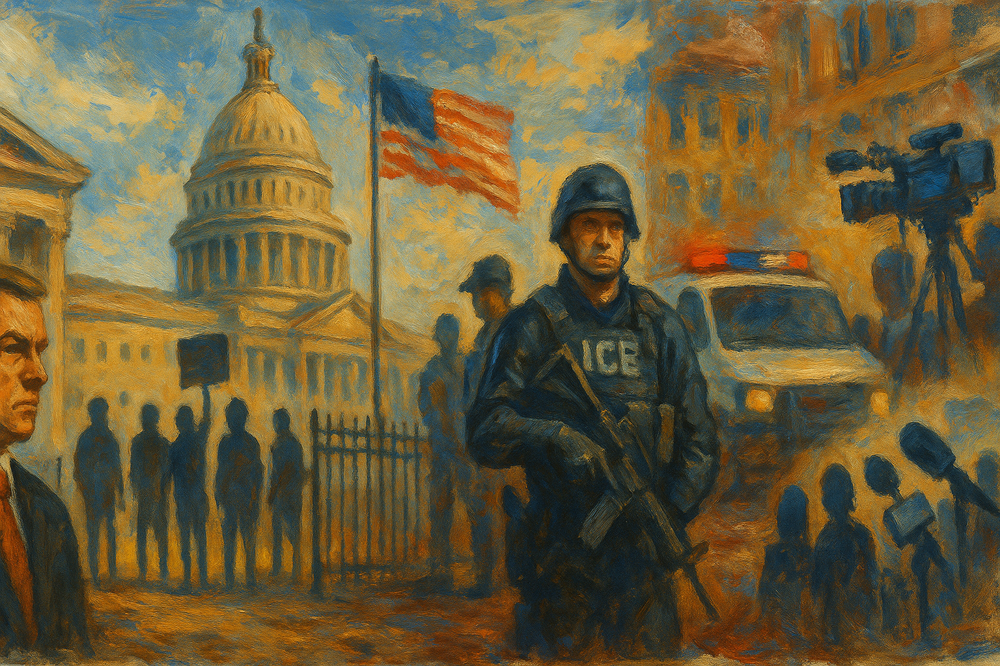

<!-- Generated by build_publish_week_v1 (appendix post) -->
<!-- Header image: image_wide_week26_appendix.png -->

# Week 26 Appendix: Data and Force as Governance

*In a week without a single shock, immigration raids, civil service purges, and curated secrecy deepened a regime of control over bodies, data, and memory.*

This was a structurally heavy week for democratic erosion, with converging pressures on rule of law, civil service independence, immigration enforcement, and information integrity. The administration deepened its project of politicizing the state: Schedule G and mass layoffs at Education and State, purges and retaliatory firings at DOJ, and ideological reshaping at NIH and VA all push the bureaucracy toward loyalty over competence (traits 1, 7, 22). Immigration policy hardened into a quasi-police-state architecture—ending bond hearings, rapid deportations, courthouse arrests, data-sharing from Medicaid and IRS, and lethal, highly visible raids—entrenching a two-tier citizenship regime (traits 4, 9, 45, 47). Simultaneously, Congress and the executive coordinated to defund public broadcasting and foreign aid while expanding border surveillance and tariffs, reinforcing crony capitalism and weakening independent media and alliances (traits 16, 26, 38, 43). The Epstein files saga crystallized information manipulation and elite impunity: DOJ opacity, retaliatory personnel moves, and partisan blocking of transparency collided with cross-partisan demands and court-ordered unsealing (traits 17, 21, 51, 60). A few countervailing moves—courts protecting some immigrants and refugees, bipartisan pushes for Epstein transparency, and robust protest mobilization—offered limited but notable democratic resistance.

Power and Authority

1. Homeland Security Secretary Kristi Noem required prior approval for large FEMA expenditures and contracts (2025-07-12): Noem centralized control over FEMA spending above $100,000, potentially slowing emergency response and concentrating disaster-management power in a single political appointee.

2. Trump administration cut FEMA grant programs and allowed staff exodus (2025-07-12): Cuts to FEMA grants and loss of experienced staff weakened federal disaster capacity, shifting risk to vulnerable communities while preserving centralized political control.

3. President Donald Trump authorized ICE agents to use "whatever means" necessary for self-protection and ordered arrests of protesters (2025-07-12): Trump’s directive expanded ICE’s discretion to use force and target protesters, blurring lines between immigration enforcement and suppression of dissent.

4. President Donald Trump claimed he was considering revoking Rosie O'Donnell's citizenship (2025-07-12): Trump’s threat to strip a critic’s citizenship, though legally baseless, signaled willingness to wield state power rhetorically against dissenters and constitutional guarantees.

5. Trump administration canceled a Biden-era civil rights settlement addressing Alabama sewage crisis (2025-07-13): By voiding a settlement that required Alabama to fix a raw sewage crisis in a poor, Black county, the administration withdrew federal protection from marginalized residents facing environmental health harms.

6. Homeland Security Secretary Kristi Noem declined to renew FEMA call center contracts after Texas floods (2025-07-13): Nonrenewal of FEMA call-center contracts sharply reduced answered disaster calls, weakening federal responsiveness while leaving the decision in a single cabinet official’s hands.

7. Trump administration conducted mass layoffs at the State Department and closed the Bureau of Democracy, Human Rights, and Labor (2025-07-13): Eliminating over 1,300 State Department jobs and shuttering a key human-rights bureau reduced professional diplomatic capacity and centralized foreign-policy influence in political hands.

8. Attorney General Pam Bondi announced DOJ guidance limiting non-essential multilingual services (2025-07-14): Restricting multilingual DOJ services after declaring English the official language reduced access to justice for non-English speakers and signaled state preference for a dominant linguistic group.

9. President Donald Trump expanded ICE officers and detention facilities to intensify deportations (2025-07-15): Trump’s expansion of ICE staffing and detention infrastructure entrenched a large-scale deportation apparatus, deepening reliance on coercive tools in immigration policy.

10. Trump administration ordered destruction of emergency food supplies for children in Afghanistan and Pakistan (2025-07-15): Incinerating nearly 500 metric tons of paid-for emergency food for children abroad prioritized security narratives over humanitarian obligations and squandered public resources.

11. Trump administration pursued harsh immigration enforcement including Title 42 expulsions and mass deportations (2025-07-15): Use of emergency health powers and aggressive deportations framed immigration as a security crisis, normalizing extraordinary authority over migrants and asylum seekers.

12. President Donald Trump asked House Republicans whether he should fire Federal Reserve Chair Jerome Powell (2025-07-16): Trump’s public musing about firing the Fed chair threatened the central bank’s independence, signaling potential political interference in monetary policy.

13. President Donald Trump issued an executive order creating Schedule G in the excepted service (2025-07-17): Schedule G reclassified many policy roles as easily removable, enabling presidents to replace career officials with loyalists and weakening civil service neutrality.

14. Department of Veterans Affairs leadership banned LGBTQ+ pride flags at VA hospitals and closed an office probing racial disparities (2025-07-18): The VA’s rollback of DEI symbols and investigations signaled official disfavor toward LGBTQ+ and Black veterans’ concerns, narrowing institutional support for equal treatment.

15. Department of Veterans Affairs leadership ended gender-affirming care for transgender veterans (2025-07-18): Terminating gender-affirming care under executive direction stripped a vulnerable group of medically recognized treatment, using state power to enforce ideological boundaries on healthcare.

16. Department of Veterans Affairs leadership removed explicit anti-discrimination protections from hospital bylaws (2025-07-18): Deleting language barring discrimination based on marital status or political views weakened formal safeguards for equal access to VA care and opened space for viewpoint-based bias.

17. Camp Mystic director Dick Eastland delayed evacuation after severe flood warning at Texas camp (2025-07-18): Eastland’s hour-long delay in ordering evacuation despite flood warnings contributed to 27 deaths, raising questions about private authority and accountability in life-or-death decisions.

Institutions and Governance

1. Representatives Marc Veasey and Ro Khanna announced plans for measures demanding release of Epstein files (2025-07-12): House Democrats prepared a resolution and amendment to force disclosure of Epstein-related records, using legislative tools to press for transparency in a politically sensitive investigation.

2. Los Angeles federal judge temporarily blocked ICE raids over racial profiling concerns (2025-07-12): The court halted certain ICE operations, requiring adherence to reasonable-suspicion standards and limiting appearance-based targeting, reinforcing judicial checks on discriminatory enforcement.

3. President Donald Trump criticized DOJ’s closure of Epstein file and urged focus on voter fraud and corruption (2025-07-12): Trump’s comments sought to redirect investigative priorities away from Epstein toward favored narratives, pressuring DOJ’s agenda-setting in politically charged areas.

4. Department of Justice and FBI leadership decided not to release additional Epstein case information (2025-07-12): By withholding further Epstein materials while denying existence of a client list, DOJ and FBI limited public scrutiny of a major scandal, fueling distrust and conspiracy narratives.

5. Attorney General Pam Bondi directed dismissal of charges against Dr. Michael Kirk Moore over vaccine fraud (2025-07-12): Dropping charges mid-trial against a doctor accused of destroying vaccines and issuing fake cards signaled politicized leniency in pandemic-related enforcement.

6. Senate Homeland Security and Governmental Affairs Committee issued report detailing Secret Service failures in 2024 Trump assassination attempt (2025-07-13): The bipartisan report documented serious protective lapses and led to agent suspensions, illustrating congressional oversight of executive security services.

7. Texas legislature failed to pass a bill creating a flood warning system (2025-07-13): Legislative inaction on a flood warning system left communities more exposed to disasters, underscoring how policy neglect can undermine public safety infrastructure.

8. Senators Richard Blumenthal and Chris Murphy criticized DHS Secretary Kristi Noem’s migrant transport and ad spending (2025-07-13): Senators warned that Noem’s high-profile spending could violate budget law, asserting congressional authority over appropriations and agency priorities.

9. U.S. Agency for Global Media overseen by Kari Lake dismantled most of its operations and related foreign influence programs (2025-07-13): Shrinking USAGM reduced U.S. capacity to project independent news and democratic narratives abroad, weakening a key soft-power institution.

10. Supreme Court of the United States granted a stay allowing Department of Education to proceed with large workforce reduction (2025-07-14): The Court’s emergency stay let the administration fire nearly half of Education’s staff despite lower-court concerns, expanding executive leeway over statutory protections.

11. Department of Justice opposed Ghislaine Maxwell’s appeal and defended her conviction (2025-07-14): DOJ’s stance to uphold Maxwell’s sentence affirmed accountability for a central Epstein accomplice even as broader transparency remained contested.

12. Trump administration fired 17 immigration judges despite congressional funding for more positions (2025-07-14): Terminating immigration judges contrary to appropriations intent undercut adjudicatory capacity and suggested political interference in case processing.

13. Trump administration appealed ruling that barred DHS from racial profiling in arrests (2025-07-14): By seeking to overturn limits on race-based arrests, the administration challenged judicial efforts to constrain discriminatory enforcement practices.

14. U.S. Election Assistance Commission announced a public meeting on updated voting system guidelines (2025-07-14): The EAC scheduled an open technical meeting on voting system standards, supporting transparent, expert-informed election administration.

15. House Rules Committee Republicans rejected Representative Ro Khanna’s amendment to release Epstein files (2025-07-14): Blocking Khanna’s transparency amendment kept key Epstein records sealed, reinforcing partisan control over access to politically sensitive information.

16. Federal Election Commission canceled two scheduled open meetings (2025-07-15): The FEC’s cancellation of July public meetings reduced opportunities for public oversight of campaign finance and election-regulation decisions.

17. House Speaker Mike Johnson called for DOJ to release Epstein files while having voted to block related amendment (2025-07-15): Johnson’s public demand for Epstein transparency contrasted with his procedural vote against release, illustrating performative oversight amid substantive obstruction.

18. House Speaker Mike Johnson insisted Ukraine aid be tied to a border security package (2025-07-15): Linking foreign aid to contentious immigration measures used legislative leverage to advance domestic enforcement priorities, complicating bipartisan security policymaking.

19. U.S. Senate considered and then passed a $9.4 billion rescissions package cutting public broadcasting and foreign aid (2025-07-17): Senate approval of Trump’s rescissions package retroactively endorsed unilateral spending cuts, slashing funds for public media and foreign assistance and shifting budget power toward the executive.

20. House Judiciary Committee Democrats demanded hearings with Pam Bondi and Kash Patel on Epstein case handling (2025-07-15): Democrats sought public testimony from top law-enforcement officials about Epstein decisions, using oversight powers to probe potential cover-ups and politicization.

21. House Oversight Chair James Comer used digital signatures while investigating Biden’s autopen use (2025-07-15): Comer’s reliance on digital signatures in an inquiry criticizing Biden’s autopen highlighted partisan inconsistency in standards for executive documentation.

22. House Committee on Education and the Workforce held hearings on antisemitism at major universities (2025-07-15): Repeated hearings grilling university leaders over campus antisemitism and DEI practices increased congressional pressure on academic governance and speech policies.

23. Louisiana state legislature and courts upheld a lookback law enabling clergy abuse lawsuits (2025-07-16): Maintaining Louisiana’s lookback window preserved survivors’ ability to sue over historic clergy abuse, reinforcing access to justice despite institutional resistance.

24. Roman Catholic Archdiocese of New Orleans and U.S. Bankruptcy Court filed a settlement plan including a public archive of abuse files (2025-07-16): The archdiocese’s bankruptcy plan proposed hundreds of millions in payouts and a limited public archive of abuse records, balancing institutional survival with partial transparency.

25. U.S. Supreme Court denied an emergency application in Gomez v. United States (2025-07-15): By declining emergency relief without noted dissent, the Court left a lower-court ruling in place, illustrating its gatekeeping role over urgent challenges.

26. Over 75 former judges urged the Senate Judiciary Committee to reject Emil Bove’s appeals court nomination (2025-07-15): Retired judges warned that Bove’s alleged disregard for court orders made him unfit for the bench, spotlighting concerns about politicized judicial appointments.

27. Senate Judiciary Committee Republicans advanced Emil Bove’s nomination despite Democratic walkout and whistleblower concerns (2025-07-17): Pushing Bove’s nomination forward without hearing a whistleblower underscored majority willingness to prioritize partisan loyalty over thorough vetting.

28. Florida Supreme Court upheld a congressional map that reduced Black voters’ influence (2025-07-17): The court’s approval of a DeSantis-backed map that dismantled a Black-influence district weakened minority representation and signaled judicial tolerance of partisan gerrymandering.

29. U.S. District Court for the District of Columbia received a class-action lawsuit challenging courthouse immigration arrests (2025-07-17): Immigrants and advocates sued DHS and DOJ over arrests at immigration courts, arguing due process violations and seeking to curb enforcement tactics that chill access to hearings.

30. Coalition of 20 states sued the Trump administration over cuts to a FEMA resilience grant program (2025-07-16): States challenged FEMA grant reductions for infrastructure resilience, asserting that federal retrenchment undermined lawful disaster-preparedness commitments.

31. Department of Justice requested a one-day sentence for former officer Brett Hankison in Breonna Taylor civil rights case (2025-07-17): DOJ’s call for minimal jail time for a convicted officer in a high-profile killing raised doubts about federal willingness to impose serious consequences for civil rights violations.

32. Congress enacted the Apex Area Technical Corrections Act (2025-07-15): Passage of a technical corrections law illustrated routine legislative maintenance of statutory language and local governance arrangements.

33. Congress enacted the HALT Fentanyl Act (2025-07-16): The new law expanded tools against fentanyl trafficking, strengthening federal criminal authority in response to a public health crisis.

34. Congress enacted the GENIUS Act to promote innovation and technology (2025-07-18): The GENIUS Act established new federal support structures for technological development, shaping long-term economic and strategic capacity.

35. National Archives and Records Administration sought public comment on proposed federal records schedules (2025-07-17): NARA’s request for input on records disposition plans invited public oversight of which federal documents are preserved or destroyed.

36. Federal judge ordered the Trump administration to provide documents on cost-cutting efforts to a watchdog group (2025-07-14): The court compelled disclosure about the Department of Government Efficiency’s cuts, reinforcing judicial enforcement of transparency obligations.

37. Texas Governor Greg Abbott’s office refused to release emails with Elon Musk citing privacy concerns (2025-07-14): Abbott’s refusal to disclose correspondence with a powerful businessman limited public insight into potential private influence on state policy.

38. National Archives and Records Administration invited comments on records schedules for DOT and VA (2025-07-17): By opening proposed records schedules to comment, NARA allowed stakeholders to weigh in on long-term retention of transportation and veterans’ records.

Economic Structure

1. President Donald Trump announced 30% tariffs on goods from the EU and Mexico (2025-07-12): Sharp tariff hikes on allied economies risked trade retaliation, higher consumer prices, and strain on cooperative economic alliances.

2. Trump administration imposed a 17% tariff on Mexican tomatoes (2025-07-14): Tariffs on Mexican tomatoes, half of U.S. supply, threatened to raise food prices and entrench domestic producers, illustrating how trade tools can burden consumers.

3. Trump administration and Congress enacted a reconciliation bill cutting renewable energy support and LIHEAP (2025-07-14): The energy bill removed incentives for renewables and low-income energy aid, increasing projected power costs and deepening energy insecurity for poorer households.

4. Centers for Disease Control and Prevention invited public comment on multiple public health data collection initiatives (2025-07-14): CDC notices on infection surveillance, research tools, tobacco campaigns, emergency use, devices, and electronic products sought input on data burdens while sustaining evidence-based regulation.

5. Federal Communications Commission finalized cable television rate deregulation and sought comment on paperwork reductions (2025-07-14): By easing cable rate rules and paperwork, the FCC reduced regulatory burdens on operators, potentially affecting consumer prices and competition.

6. Food and Drug Administration set regulatory review periods enabling patent extensions for several biologics (2025-07-14): FDA determinations for multiple high-value drugs shaped how long manufacturers can maintain market exclusivity, influencing drug prices and innovation incentives.

7. Food and Drug Administration approved gardenia blue as a food color additive and revoked obsolete food standards (2025-07-15): FDA’s approval of a new natural dye and removal of outdated standards updated food regulations, balancing industry flexibility with labeling and safety.

8. General Services Administration issued decisions on port-of-entry modernization and rescinded outdated management bulletins (2025-07-15): GSA’s port expansion and regulatory clean-up affected cross-border trade efficiency and federal asset management practices.

9. General Services Administration sought OMB review of acquisition-related information collections (2025-07-15): GSA’s requests on contract modifications, packing lists, and construction payrolls aimed to streamline procurement compliance while maintaining oversight of federal spending.

10. Environmental Protection Agency approved multiple state and territorial air-quality plans and pesticide tolerances (2025-07-16): EPA approvals for emissions inventories, maintenance plans, and pesticide tolerances set environmental baselines that affect public health and industry operations.

11. Food and Drug Administration issued draft guidances on hepatitis B blood testing and cancer drug combinations (2025-07-16): FDA’s draft guidances updated expectations for blood safety and combination cancer therapies, shaping clinical practice and drug development pathways.

12. Drug Enforcement Administration received applications for bulk manufacture and import of controlled substances (2025-07-17): DEA notices on new manufacturing and import registrations for controlled substances balanced research and pharmaceutical supply needs with diversion risks.

13. Federal Communications Commission updated FM allotments tables for radio broadcasting (2025-07-17): FCC adjustments to FM channel allotments reflected licensing changes and shaped future opportunities for local radio service.

14. Food and Drug Administration sought comment on revoking standards and evaluating youth tobacco campaigns (2025-07-14): FDA’s deregulatory move on obsolete food standards and evaluation of anti-tobacco messaging illustrated ongoing recalibration of consumer protection tools.

15. Former Congressman Alex Mooney and Capitol South blurred lines between consulting and lobbying for Christian Employers Alliance (2025-07-15): Mooney’s role as a "consultant" soon after leaving Congress highlighted how ex-lawmakers can influence policy while skirting formal lobbying bans.

16. Senate Republicans and the White House agreed to restore $400 million in proposed PEPFAR cuts (2025-07-15): Reversing part of the rescissions package preserved key global HIV/AIDS funding, tempering broader retrenchment in foreign aid.

17. Trump administration lifted export controls on chip design software and certain AI chips to China (2025-07-16): Relaxing tech export limits allowed major U.S. firms to resume AI-related sales to China, potentially boosting profits while weakening strategic leverage.

18. Department of Commerce halted development of a NOAA extreme rainfall prediction tool (2025-07-16): Stopping work on a rainfall forecasting tool reduced federal capacity to anticipate extreme weather, undermining climate resilience planning.

19. Department of Transportation cut $4 billion in federal funding for California’s high-speed rail project (2025-07-16): Pulling major support from California’s rail project weakened long-term infrastructure investment and signaled partisan use of federal funding levers.

20. Trump administration and CBS News arranged settlements directing up to $63 million to Trump’s presidential library (2025-07-16): Large settlement flows from media lawsuits to Trump’s library raised concerns about private legal windfalls funding institutions tied to a political figure.

21. Trump Organization and SDC Imobiliare announced Trump Tower Bucharest and resumed foreign real estate deals (2025-07-17): New foreign projects and lifted self-imposed deal bans deepened Trump’s overseas business entanglements, creating potential conflicts with U.S. diplomatic and security interests.

22. Department of Housing and Urban Development planned to terminate seven major housing discrimination investigations (2025-07-17): Ending large fair-housing probes curtailed federal enforcement against segregation and discrimination, weakening protections for marginalized renters and buyers.

23. Internal Revenue Service moved to terminate its free Direct File tax tool after industry lobbying (2025-07-17): Efforts to end the IRS’s free filing service following meetings with tax software firms favored private vendors over low-cost public options for taxpayers.

24. Trump administration terminated seven HUD housing discrimination probes and cut climate tools while expanding border surveillance contracts (2025-07-15): Combined HUD, NOAA, and border-surveillance decisions shifted federal resources from civil-rights and climate work toward security tech benefiting favored contractors.

25. Bureau of Labor Statistics and Trump administration cut economic data collection, increasing estimated price shares (2025-07-18): Reductions in BLS data collection forced greater reliance on imputed prices, degrading the accuracy of inflation statistics that guide policy and markets.

26. Trump administration funded $6 billion expansion of US-Mexico border surveillance under OBBA (2025-07-15): Massive investments in biometric towers and data systems at the border deepened reliance on private surveillance firms for core state functions.

27. California state government funded low-income housing targeted to ex-prisoners and institutionalized individuals (2025-07-18): California’s supportive housing initiative for ex-prisoners and others sought to address homelessness and reintegration, but faced potential local resistance to siting.

28. California government implemented a $20 minimum wage for fast food workers, affecting employment (2025-07-18): Research showing job losses after California’s fast-food wage hike highlighted trade-offs between higher pay and employment in low-wage sectors.

Civil Rights and Dissent

1. Immigration and Customs Enforcement conducted raids at licensed cannabis farms using less-lethal munitions and tear gas (2025-07-11): ICE raids at California farms injured workers and swept up hundreds, including a disabled veteran, illustrating militarized tactics against largely nonviolent laborers.

2. ICE Director Todd Lyons authorized rapid deportations to third countries with minimal notice (2025-07-13): Lyons’ memo allowed deportations with as little as six hours’ notice and limited safety assurances, heightening risks of refoulement and undermining due process.

3. ICE and DHS detained hundreds at "Alligator Alcatraz," including many with no criminal record (2025-07-13): Reports that over 250 detainees at a harsh Florida facility had no criminal record contradicted official claims and highlighted punitive detention of non-criminal migrants.

4. Democratic state lawmakers in Florida filed suit after being denied access to the Alligator Alcatraz detention facility (2025-07-14): Lawmakers sued to enforce their statutory right to inspect detention centers, challenging secrecy around conditions for detained migrants.

5. Trump administration implemented policy ending bond hearings for many undocumented immigrants (2025-07-15): A new policy barring bond hearings for immigrants who entered unlawfully shifted release decisions from judges to DHS, curtailing judicial oversight of detention.

6. Immigration and Customs Enforcement used Terminal Island as a staging ground for mass workplace raids in Los Angeles (2025-07-16): ICE’s use of a historically significant island to launch raids that detained nearly 2,800 people evoked past mass incarcerations and intensified fear in immigrant communities.

7. U.S. Immigration and Customs Enforcement arrested Mahdi Khanbabazadeh outside his child’s preschool in Oregon (2025-07-15): ICE’s first confirmed arrest at an Oregon school under new rules allowing operations at sensitive locations highlighted the psychological impact of enforcement on families.

8. U.S. Immigration and Customs Enforcement detained an Irish tourist for a minor visa overstay and held him for about 100 days (2025-07-15): ICE’s prolonged detention of a tourist who overstayed by three days, despite his consent to deportation, showed punitive use of detention beyond clear security needs.

9. Texas Attorney General Ken Paxton threatened to arrest Democratic legislators boycotting a redistricting session (2025-07-14): Paxton’s threat to jail absent lawmakers used criminal law to coerce participation in a partisan redistricting process, pressuring political opposition.

10. Department of Homeland Security agents testified about unusual orders to arrest pro-Palestinian students and academics (2025-07-15): Agents’ testimony that they were directed to target specific political viewpoints raised alarms about law enforcement being used against campus dissent.

11. Internal Revenue Service and ICE developed a system to share confidential tax data for deportation targeting (2025-07-15): Plans to give ICE access to IRS tax data, including home addresses, blurred lines between tax administration and immigration enforcement, threatening privacy and trust.

12. Trump administration agreed to share Medicaid data on tens of millions of recipients with ICE (2025-07-17): Using Medicaid records to locate migrants repurposed health data for enforcement, risking deterrence from care and expanding surveillance of vulnerable populations.

13. Trump administration reversed policy to make undocumented immigrants ineligible for bond hearings (2025-07-14): A policy shift concentrating release authority in DHS officials reduced judicial checks on detention and increased executive control over immigrants’ liberty.

14. Trump administration used masked, out-of-uniform ICE agents in mass deportation raids (2025-07-18): Deploying masked agents without clear identification in communities intensified perceptions of secret-police tactics and eroded trust in lawful enforcement.

15. Texas Board of Elections voted to require additional data or purge nearly 100,000 voters (2025-07-14): New ID requirements risked removing tens of thousands from voter rolls, disproportionately affecting marginalized groups under the banner of list maintenance.

16. Texas Republicans and President Donald Trump pursued mid-decade redistricting to gain five GOP seats (2025-07-17): Coordinated efforts to redraw Texas districts mid-cycle aimed to entrench partisan advantage and dilute the influence of growing nonwhite populations.

17. California Governor Gavin Newsom threatened to pursue partisan redrawing of California’s congressional map (2025-07-17): Newsom’s floated plan to bypass an independent commission to counter Texas gerrymandering underscored escalating partisan map wars and pressure on neutral processes.

18. Federal appeals court temporarily blocked termination of Temporary Protected Status for Afghans (2025-07-14): The court’s injunction preserved legal status for about 12,000 Afghans, providing temporary protection against abrupt loss of residency.

19. Federal judge blocked a presidential proclamation banning vetted refugees (2025-07-14): Judicial intervention stopped use of a proclamation to bar 80 vetted refugees, checking executive overreach in refugee admissions.

20. Federal court in Ohio granted a temporary restraining order preventing transfer of detainee Ayman Soliman (2025-07-16): The TRO kept Soliman in-state pending a bond hearing, safeguarding his ability to contest asylum termination and deportation.

21. Department of Homeland Security and Department of Justice were sued in a class action over courthouse immigration arrests (2025-07-16): The lawsuit argued that arresting immigrants at court hearings violated constitutional protections and chilled access to justice.

22. Baltimore city government and partners expanded community-based violence reduction and youth engagement programs (2025-07-16): Baltimore’s Safe Streets, GVRS, youth engagement, and school-based interventions reduced shootings and assaults, showing non-carceral strategies can enhance safety and civic trust.

23. Nationwide protesters honoring John Lewis held over 1,500 demonstrations for voting rights and justice (2025-07-17): Mass protests under the banner "Good Trouble Lives On" mobilized citizens to defend voting rights and civil liberties amid contemporary controversies.

24. Indivisible organized online training sessions to prepare for community organizing and protests (2025-07-14): Indivisible’s "One Million Rising" trainings built grassroots capacity for sustained civic engagement and resistance to perceived democratic backsliding.

25. Representative Pramila Jayapal announced legislation to bar ICE from detaining and deporting U.S. citizens (2025-07-16): Jayapal’s proposal responded to wrongful detentions by seeking statutory safeguards against citizens being swept into immigration enforcement.

26. Trump administration deported five immigrants to Eswatini, a country with which they had no ties (2025-07-15): Sending migrants to a third country unconnected to them underscored the arbitrariness and potential cruelty of certain deportation practices.

27. El Salvador President Nayib Bukele transferred 250 Venezuelan migrants in a prisoner swap returning 10 U.S. citizens (2025-07-17): The swap highlighted how migrants can be treated as bargaining chips in international negotiations, raising concerns about their rights and agency.

28. House Republicans approved a rescissions package defunding PBS, NPR, and foreign aid (2025-07-18): House passage of deep cuts to public broadcasting and aid reduced support for independent information and global humanitarian programs.

29. Supreme Court of the United States struck down affirmative action in college admissions (2025-07-18): The Court’s ruling against race-conscious admissions reshaped access to elite education, prompting alternative selection methods and raising equity concerns.

30. Texas officials received death threats during flood response operations (2025-07-15): Threats against local officials managing disaster response undermined their ability to act and contributed to a hostile environment for public service.

31. Los Angeles Times and animal rescues reported and responded to pet abandonment linked to ICE raids (2025-07-12): Increased pet abandonment after immigration raids illustrated the broader social disruption and family fragmentation caused by aggressive enforcement.

32. Federal court and Biden administration extended Temporary Protected Status for Venezuelans (2025-07-15): Extending TPS for nearly half a million Venezuelans provided legal stability and work authorization, contrasting sharply with contemporaneous restrictive policies.

Information, Memory and Manipulation

1. Secretary of Defense Pete Hegseth used Metallica’s song without permission in a drone promotion video (2025-07-12): The Pentagon’s unauthorized use of copyrighted music in propaganda content raised questions about respect for intellectual property and messaging practices.

2. U.S. Agency for Global Media under Kari Lake dismantled most U.S.-backed international broadcasting operations (2025-07-13): Curtailing USAGM reduced U.S. support for independent journalism abroad, weakening a counterweight to authoritarian media ecosystems.

3. NASA decided not to publish major climate change assessments on its website (2025-07-14): Withholding climate assessments from public view limited access to scientific evidence crucial for informed debate and policy.

4. Elon Musk amplified criticism of Trump over unreleased Epstein files (2025-07-14): Musk’s high-profile posts questioning Epstein file secrecy leveraged his platform to shape public narratives and pressure the administration.

5. Popular Information and other outlets reported on Trump’s defense of Pam Bondi amid Epstein backlash (2025-07-14): Coverage of Trump’s defense of Bondi highlighted efforts to manage public perception of DOJ’s opaque Epstein decisions.

6. Wired and other media reported that DOJ and FBI edited out minutes from Epstein cell surveillance video (2025-07-15): Allegations of missing footage from "full raw" Epstein video undermined confidence in official evidence and record-keeping.

7. Trump administration sued three members of the Corporation for Public Broadcasting board after defunding PBS and NPR (2025-07-15): Litigation against CPB board members, following funding cuts, increased pressure on public media governance and independence.

8. President Donald Trump posted unsubstantiated mortgage fraud allegations against Senator Adam Schiff amid tariff-driven inflation (2025-07-15): Trump’s attack on Schiff appeared aimed at diverting attention from rising prices linked to his tariffs, using personal smears to shift blame.

9. Trump administration sued Dow Jones, News Corp, Rupert Murdoch, and Wall Street Journal reporters for libel over Epstein coverage (2025-07-17): Trump’s multibillion-dollar libel suit against major media entities sought to punish reporting on his ties to Epstein, potentially chilling investigative journalism.

10. Trump administration sued three CPB members after attempts to fire them (2025-07-15): Suing public broadcasting board members escalated conflict with independent media governance and could deter resistance to political interference.

11. CBS announced cancellation of The Late Show with Stephen Colbert (2025-07-17): Ending a prominent political satire program altered the late-night media landscape, reducing a high-visibility venue for critical commentary.

12. Elon Musk used his platform to criticize Trump over Epstein controversy (2025-07-17): Musk’s public criticism of Trump on Epstein matters illustrated how powerful private platforms can challenge or reshape elite narratives.

13. President Donald Trump ranted on Truth Social calling Epstein backlash a "hoax" and attacking former supporters (2025-07-16): Trump’s posts framed criticism over Epstein files as a hoax, seeking to delegitimize concerns and maintain control over the scandal’s narrative.

14. Trump administration cut Bureau of Labor Statistics resources, increasing estimated inflation data (2025-07-18): Budget cuts that forced BLS to estimate a much larger share of prices weakened the reliability of official economic data used by the public and policymakers.

15. National Archives and Records Administration sought public input on records schedules affecting federal archives (2025-07-17): NARA’s comment process on records schedules allowed public scrutiny of which government documents are preserved, influencing collective memory.

16. Department of Justice filed motions to unseal Epstein grand jury transcripts with redactions (2025-07-17): DOJ’s request to unseal grand jury materials, while protecting identities, partially opened a secretive process to public view in a high-profile case.

17. President Donald Trump ordered Attorney General Pam Bondi to release Epstein grand jury testimony (2025-07-18): Trump’s directive to release testimony marked a tactical shift toward disclosure under political pressure, though scope and completeness remained uncertain.

18. Governor Gavin Newsom filed a major defamation lawsuit against Fox News and Jesse Watters (2025-07-18): Newsom’s $787 million suit over alleged misreporting sought accountability but also exemplified powerful officials using costly litigation against media outlets.

19. Trump administration dismantled USAGM and, with Congress, cut public broadcasting funding (2025-07-17): Combined executive and legislative actions to shrink USAGM, PBS, and NPR funding weakened independent public media at home and abroad.

20. Heather Cox Richardson and pollsters reported polling showing strong public support for immigration and pathways to citizenship (2025-07-15): Poll data revealing broad pro-immigration sentiment highlighted a gap between public opinion and the administration’s restrictive policies.

21. Trump administration cut economic and climate-related data tools while amplifying partisan narratives (2025-07-18): Reductions in BLS and NOAA data capacity, alongside politicized messaging, increased the administration’s ability to shape perceptions without robust empirical checks.

