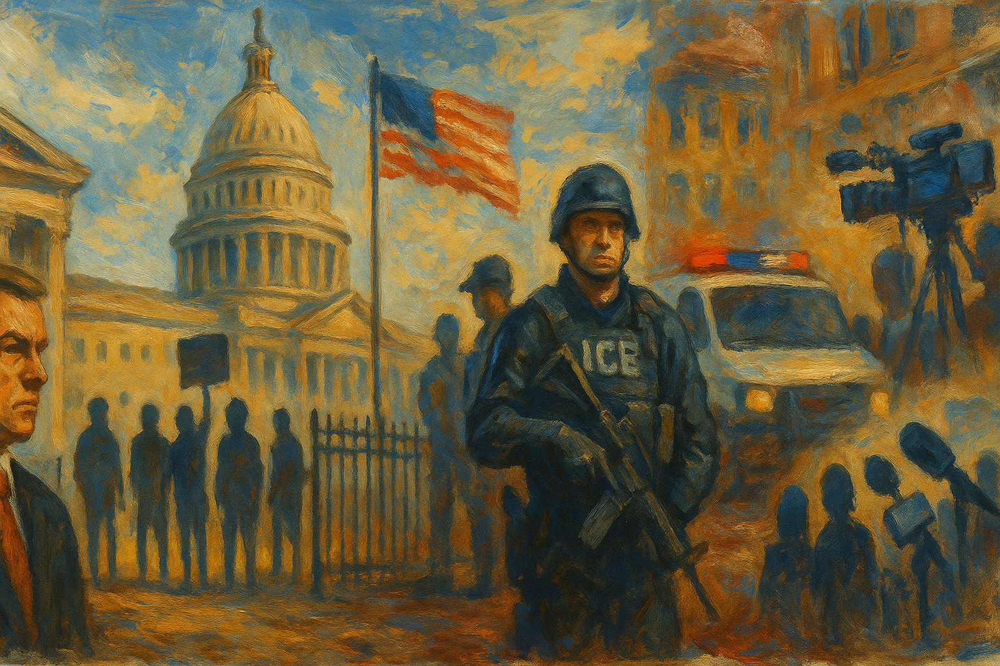

<!-- Generated by build_publish_week_v1 (appendix post) -->
<!-- Header image: image_wide_week26_appendix.png -->

# Week 26 Appendix: The Clock Holds, the State Consolidates

*A week without clock movement revealed how deeply coercive enforcement, weakened oversight, and blurred private interest have become ordinary governance.*

This was a high-pressure week defined by politicization of state capacity, especially in immigration enforcement, the civil service, and information control. The strongest structural signal came from the executive branch extending discretionary power while weakening internal and external checks: FEMA spending and grant cuts, Schedule G’s new federal worker classification, repeated firings inside DOJ, and efforts to bypass Senate confirmation all point toward a more loyalty-based state. Immigration policy supplied the clearest coercive edge, with expanded detention, curtailed bond hearings, aggressive raids, third-country deportations, and new data-sharing arrangements that repurpose Medicaid and tax information for enforcement. A second major theme was transparency breakdown around the Epstein matter, where blocked disclosures, contradictory messaging, media pressure, and selective release efforts exposed how information can be managed as a factional tool rather than a public good. Elections and representation also took a hit through voter-roll actions, DOJ requests for state voter data, and open partisan redistricting pushes in Texas and beyond. Courts and civil society provided some resistance, but the week’s net force was toward entrenching executive-centered, retaliatory governance.

Power and Authority

1. Homeland Security Secretary Kristi Noem required prior approval for FEMA expenditures and contracts over $100,000 (2025-07-12) *[single source]*: The order centralized disaster-response decisions in the secretary's office, reducing FEMA's operational autonomy during emergencies.

2. The Trump administration cut FEMA grants and let key disaster-response capacity erode (2025-07-12): The reductions weakened a core public-safety agency, limiting the state's ability to protect communities during disasters.

3. Homeland Security Secretary Kristi Noem did not renew FEMA call center contracts after the Texas floods (2025-07-12): The lapse reduced access to federal disaster assistance, showing how executive decisions can degrade emergency response capacity.

4. President Trump authorized ICE agents to use whatever means necessary for self-protection and ordered arrests of protesters who impeded raids (2025-07-12): The directive expanded coercive federal power in immigration operations and increased the risk of force against protest activity.

5. President Trump said he was considering revoking Rosie O'Donnell's citizenship (2025-07-12): The threat treated citizenship as a tool of personal retaliation, testing limits on executive power over dissenters' status.

6. The Trump administration canceled a civil rights settlement that required Alabama to address Lowndes County's sewage crisis (2025-07-13) *[single source]*: Ending the settlement withdrew federal pressure on a state to remedy unequal public-health conditions, weakening rights enforcement through executive action.

7. The Trump administration carried out mass layoffs at the State Department and closed the Bureau of Democracy, Human Rights, and Labor (2025-07-13): The layoffs concentrated control over foreign-policy staffing while shrinking institutional capacity tied to rights and democratic accountability.

8. President Trump defended Pam Bondi and dismissed scrutiny over the Epstein files (2025-07-14): The president used his office to shield an ally from accountability pressure in a politically sensitive justice matter.

9. Attorney General Pam Bondi issued guidance limiting non-essential multilingual services at the Justice Department (2025-07-14) *[single source]*: The guidance reduced language access in federal services, narrowing equal access to justice for non-English speakers.

10. The Trump administration moved to end bond hearings for many immigrants in deportation proceedings (2025-07-15): The policy shifted release decisions from judges to the executive branch, reducing due-process checks on detention power.

11. The Trump administration expanded ICE officers and detention facilities (2025-07-15) *[single source]*: The expansion increased the state's detention capacity and strengthened the infrastructure for mass immigration enforcement.

12. The Trump administration ordered the destruction of emergency food intended for children in Afghanistan and Pakistan (2025-07-15) *[single source]*: The decision showed executive control over aid being used in ways that reduced humanitarian protection and public accountability for public resources.

13. President Trump called for a simple redraw of Texas congressional districts to favor Republicans (2025-07-15): The president directly pressed for partisan mapmaking, using national influence to shape state representation for party gain.

14. President Trump declined to support a special counsel for the Epstein case (2025-07-16): Refusing an outside prosecutor kept control of a politically sensitive matter inside the executive branch, limiting an independent check.

15. President Trump asked House Republicans whether he should fire Federal Reserve Chair Jerome Powell (2025-07-16): The move tested political pressure on an independent economic institution whose credibility depends on insulation from presidential control.

16. President Trump issued an executive order creating Schedule G in the excepted service (2025-07-17): The order created a new channel for policy-facing federal jobs, increasing presidential leverage over the civil service.

17. The Trump administration reinstated more than $1 billion in after-school and summer education funding after a pause (2025-07-17) *[single source]*: The reversal showed how executive discretion over funding can abruptly disrupt and then restore public programs without legislative change.

18. The Trump Organization changed its ethics statement to allow new foreign deals during Trump's presidency (2025-07-17) *[single source]*: The change reopened channels for foreign financial entanglements around a sitting president, raising risks of influence over public decisions.

19. President Trump ordered Attorney General Pam Bondi to seek release of Epstein grand jury testimony (2025-07-18): The order showed the president intervening directly in a politically charged justice matter to manage pressure over transparency.

Institutions and Governance

1. Representative Marc Veasey announced a resolution demanding release of the Epstein files (2025-07-12): The move sought to use congressional process to force disclosure in a high-profile case and strengthen oversight.

2. Representative Ro Khanna announced and then introduced amendments to force a vote on releasing the Epstein files (2025-07-12): The amendments used House procedure to press for disclosure and put lawmakers on record on transparency.

3. Senator Jon Ossoff questioned Trump's handling of the Epstein files at a campaign rally (2025-07-12): The remarks added public pressure for accountability in a matter involving executive control over sensitive records.

4. A Los Angeles judge blocked future ICE raids that relied on racial profiling and lacked reasonable suspicion (2025-07-12) *[single source]*: The ruling imposed a judicial check on immigration enforcement practices that threatened equal protection and due process.

5. Homeland Security Secretary Kristi Noem said DHS would comply with the Los Angeles ruling on ICE raids (2025-07-12) *[single source]*: The statement acknowledged a court-imposed limit on executive enforcement power, even as the department disputed the underlying criticism.

6. The Department of Justice considered criminal charges against election officials (2025-07-12): Possible prosecutions of election administrators risked chilling independent election management and altering institutional incentives.

7. A Senate committee issued a report faulting the Secret Service for failures during the Butler assassination attempt (2025-07-13): The report used legislative oversight to document security failures and press for accountability inside a federal protective agency.

8. The Texas legislature failed to pass a flood warning system bill (2025-07-13): The failure showed how legislative inaction on basic public-safety infrastructure can weaken state capacity and accountability.

9. Senators Richard Blumenthal and Chris Murphy criticized Kristi Noem's spending and warned of Anti-Deficiency Act issues (2025-07-13) *[single source]*: The criticism asserted Congress's budget oversight role against executive spending choices that may have exceeded legal limits.

10. Democratic state lawmakers in Florida sued after they were denied access to the Alligator Alcatraz detention facility (2025-07-14) *[single source]*: The suit defended statutory inspection rights and challenged barriers to legislative oversight of detention conditions.

11. House Republicans blocked Democratic efforts to force release of the Epstein files (2025-07-14): The votes used House procedure to prevent disclosure in a politically sensitive case, limiting legislative transparency.

12. A federal court held trial on challenges to North Carolina's redistricting maps (2025-07-14): The case tested whether district lines unlawfully diluted minority voting power, placing electoral fairness under judicial review.

13. Environmental groups filed suit to stop operation of the Alligator Alcatraz detention facility (2025-07-14): The case challenged the legality of a detention site and sought judicial review of blurred federal-state responsibility.

14. The Supreme Court granted a stay allowing the Department of Education to proceed with mass layoffs (2025-07-14): The order let the executive branch shrink a congressionally created department while litigation continued, weakening institutional checks.

15. A federal appeals court temporarily blocked the administration from ending Temporary Protected Status for Afghans (2025-07-14) *[single source]*: The ruling preserved legal status for a vulnerable group and showed courts constraining executive immigration authority.

16. A federal judge blocked the administration from using a proclamation to bar vetted refugees (2025-07-14) *[single source]*: The decision checked executive overreach in refugee admissions and preserved a legal pathway for protected entrants.

17. The Trump administration appealed a ruling that barred DHS from making arrests based on racial profiling factors (2025-07-14) *[single source]*: The appeal sought to narrow a judicial limit on discriminatory enforcement, testing how far courts can restrain executive policing practices.

18. The Election Assistance Commission announced a public meeting on voluntary voting system guidelines (2025-07-14): The notice preserved a public process for election technology standards that shape trust and administration.

19. A federal judge ordered the Trump administration to provide DOGE-related documents and testimony to a watchdog group (2025-07-14): The order enforced disclosure obligations and strengthened judicial oversight of executive cost-cutting operations.

20. Congress enacted the Apex Area Technical Corrections Act (2025-07-15): The law reflected routine legislative maintenance of statutory text and institutional legal clarity.

21. Representative James Comer used digital signatures on letters in his autopen investigation of Biden (2025-07-15): The episode highlighted procedural inconsistency inside a congressional investigation centered on document-signing practices.

22. Democratic members of the House Judiciary Committee demanded a hearing with Pam Bondi and Kash Patel on the Epstein case (2025-07-15): The request sought formal oversight of executive handling of a high-profile investigation and its public credibility.

23. The House Armed Services Committee voted to block Pete Hegseth from restoring Confederate base names (2025-07-15): The vote showed Congress using the budget process to check executive actions that conflicted with prior law.

24. The House of Representatives held a hearing on antisemitism involving university leaders (2025-07-15): The hearing used congressional oversight to pressure higher-education governance on speech, discrimination, and campus policy.

25. House Speaker Mike Johnson called for the Justice Department to release more Epstein documents (2025-07-15): The statement signaled intra-party pressure for disclosure and highlighted tension between legislative leaders and executive secrecy.

26. House Speaker Mike Johnson proposed tying Ukraine aid to a border security package (2025-07-15): The proposal linked unrelated policy areas to reshape legislative bargaining and immigration politics inside Congress.

27. The Senate considered a rescissions package to approve $9.4 billion in executive spending cuts (2025-07-15): The package tested whether Congress would ratify unilateral executive clawbacks and weaken its own appropriations power.

28. Former judges urged the Senate Judiciary Committee to reject Emil Bove's nomination (2025-07-15): The letter warned that a judicial nominee's record could erode court integrity and public trust in the appointment process.

29. The Federal Election Commission canceled two open meetings (2025-07-15): Canceling public meetings reduced opportunities for public oversight of a key election-regulation body.

30. The Louisiana legislature and courts kept in force a lookback law for clergy abuse claims after church challenges failed (2025-07-16) *[single source]*: The outcome preserved a legal route for old abuse claims, showing institutions can expand access to justice against powerful bodies.

31. Representatives Thomas Massie and Ro Khanna launched a discharge petition to force a House vote on Epstein records (2025-07-16): The petition used a minority procedural tool to bypass leadership control and seek disclosure.

32. Senator Adam Schiff questioned Maurene Comey's firing (2025-07-16): The inquiry raised oversight concerns about whether prosecutorial personnel decisions were politically motivated.

33. Senator Ron Wyden investigated Epstein's financial network and sought confidential bank reports (2025-07-16) *[single source]*: The investigation used Senate oversight to trace enabling financial systems behind a major criminal case.

34. Representative Pramila Jayapal announced legislation to block ICE from detaining and deporting U.S. citizens (2025-07-16) *[single source]*: The proposal responded to enforcement abuses by trying to restore legal limits through statute.

35. A temporary restraining order kept Ayman Soliman in Ohio pending his bond hearing (2025-07-16) *[single source]*: The order protected access to a local hearing and showed courts preserving due-process footing in removal cases.

36. A class of immigrants and advocates filed suit against DHS, DOJ, and ICE over courthouse arrests (2025-07-16): The case challenged whether executive agencies were undermining court access by turning hearings into arrest points.

37. A coalition of 20 states sued the Trump administration over FEMA resilience grant cuts (2025-07-16): The lawsuit used federalism and the courts to contest executive reductions in disaster-preparedness funding.

38. The Supreme Court stayed the Eighth Circuit's mandate in Turtle Mountain Band of Chippewa Indians v. Howe (2025-07-16): The stay paused a lower-court ruling and showed the Court's emergency docket shaping institutional outcomes before full review.

39. The Democratic Congressional Campaign Committee and Governor Gavin Newsom mobilized against Texas redistricting plans (2025-07-16): The response showed party and state institutions preparing countermeasures against partisan mapmaking that could alter representation.

40. Senator Cory Booker introduced the Pesticide Injury Accountability Act (2025-07-17) *[single source]*: The bill sought to reopen legal accountability channels against powerful manufacturers by changing federal law.

41. Governor Gavin Newsom threatened to redraw California House maps in response to Texas redistricting (2025-07-17): The threat showed how partisan escalation can pressure independent redistricting structures and strain procedural norms.

42. The Senate passed a $9 billion rescissions package cutting previously approved spending (2025-07-17): The vote shifted budget power toward executive priorities by canceling funds Congress had already authorized.

43. Republican senators urged the Trump administration to reverse a Department of Education funding freeze (2025-07-17): The letter showed legislative pushback against executive withholding of funds for a major public program.

44. Senator Dick Durbin sought information from DOJ and FBI about the Epstein investigation staffing (2025-07-17): The request pressed for oversight of how federal investigative resources were being used in a politically charged case.

45. The House of Representatives passed Trump's proposed cuts to foreign aid and public broadcasting (2025-07-18): The vote completed a major legislative endorsement of executive budget priorities with broad effects on public institutions.

Economic Structure

1. President Trump announced 30% tariffs on goods from the European Union and Mexico (2025-07-12): The tariffs used executive trade power to reshape prices, supply chains, and relations with major economic partners.

2. European Union leaders prepared countermeasures against the new U.S. tariffs (2025-07-12) *[single source]*: The response showed how unilateral U.S. trade actions can trigger retaliatory economic measures with domestic spillover effects.

3. President Trump announced 100% secondary tariffs or sanctions tied to Russia if no peace deal was reached (2025-07-13): The threat used trade tools as geopolitical leverage, with potential effects on markets and allied economic relations.

4. Health and agriculture officials and the dairy industry announced a voluntary agreement to remove synthetic dyes from ice cream (2025-07-14) *[single source]*: The deal showed a regulatory approach that relied on voluntary industry compliance rather than binding public rules.

5. Congress and President Trump advanced and defended a reconciliation law that cut support for renewable energy and assistance programs (2025-07-14) *[single source]*: The law shifted federal economic policy away from public-energy support, affecting household costs and state development paths.

6. The Centers for Disease Control and Prevention requested public comment on two public-health data collection proposals (2025-07-14): The notices maintained public input into federal health-data systems that support evidence-based public services.

7. The Federal Communications Commission finalized cable television rate deregulation and sought comment on two paperwork-related information collections (2025-07-14): The actions reduced regulatory burdens in communications markets and reflected a deregulatory approach to economic governance.

8. The Food and Drug Administration set regulatory review periods for seven drug and biologic patent extension cases (2025-07-14): The determinations affected market exclusivity and the balance between pharmaceutical profits and future competition.

9. The Food and Drug Administration requested comment on four health-related information collections (2025-07-14): The notices preserved administrative processes that shape public-health regulation, emergency readiness, and product oversight.

10. Consumer price data and the Trump administration showed inflation rising in part because of tariffs (2025-07-14): The increase linked trade policy to consumer costs, showing how executive economic choices can directly affect household purchasing power.

11. President Trump imposed a 17% tariff on Mexican tomatoes (2025-07-14): The tariff altered food-trade terms in a way likely to affect prices, supply chains, and growers on both sides of the border.

12. Attorney General Pam Bondi fired the Justice Department's top ethics adviser without giving a reason (2025-07-14): Removing the department's ethics watchdog weakened internal compliance safeguards in a key federal institution.

13. The National Institutes of Health planned to replace advisory panel scientists with people aligned with administration policies (2025-07-14) *[single source]*: The plan threatened scientific independence by shifting expert advisory roles toward political loyalty.

14. The Department of Justice unit defending Trump policies lost nearly two-thirds of its lawyers to resignations (2025-07-15): The departures weakened institutional legal capacity and suggested strain inside a core executive litigation function.

15. The Food and Drug Administration approved gardenia blue as a color additive (2025-07-15): The rule changed food-manufacturing standards through formal regulation rather than voluntary industry action.

16. The General Services Administration issued a border port modernization decision and submitted two procurement information collections for review (2025-07-15): The actions shaped federal infrastructure and procurement systems that channel public spending and contractor access.

17. Congress and the Trump administration funded a $6 billion expansion of border surveillance technology in the tax bill (2025-07-15) *[single source]*: The spending redirected large public resources into surveillance infrastructure, deepening the economic base of enforcement technology.

18. Former Congressman Alex Mooney appeared to engage in lobbying activity despite post-service restrictions (2025-07-15) *[single source]*: The case highlighted how revolving-door rules can be skirted, weakening trust in economic policymaking and legislative ethics.

19. Senate Republicans and the White House agreed to reverse a proposed $400 million cut to PEPFAR (2025-07-15) *[single source]*: The reversal preserved a major public-health funding stream and showed budget negotiations can still protect some public goods.

20. The Environmental Protection Agency approved or updated eight air, chemical, pesticide, and disposal rules and notices (2025-07-16): The actions maintained routine environmental regulation that affects public health, industrial compliance, and state implementation.

21. The Food and Drug Administration issued draft guidance on hepatitis B testing for blood donations (2025-07-16): The guidance updated a federal safety framework that supports trust in blood supply regulation.

22. The General Services Administration rescinded 41 outdated Federal Management Regulation bulletins (2025-07-16): The move advanced a deregulatory management agenda by removing guidance across federal administrative operations.

23. The Trump administration lifted export controls on chip design software and resumed some AI chip sales to China (2025-07-16): The reversals changed industrial and strategic trade policy in ways that could shift technological advantage and corporate access to markets.

24. The Commerce Department halted work on a NOAA extreme-rainfall prediction tool (2025-07-16): Stopping the tool reduced public forecasting capacity, weakening a science-based public good tied to safety and planning.

25. The Transportation Department cut $4 billion in federal funding for California high-speed rail (2025-07-16): The cut used federal spending power to reshape a major state infrastructure project with long-term economic and environmental effects.

26. Trump's presidential library was set to receive up to $63 million from settlements with major media and tech companies (2025-07-16) *[single source]*: The funding stream raised questions about whether private settlements were becoming a channel for political financial benefit.

27. The Trump administration planned to terminate seven major HUD housing discrimination investigations (2025-07-17) *[single source]*: Ending the cases would reduce federal enforcement against segregation and discrimination in a core economic sector.

28. The IRS moved to terminate its Direct File free tax filing tool after meeting with tax software lobbyists (2025-07-17): The effort suggested private industry influence over whether taxpayers keep access to a free public service.

29. The Drug Enforcement Administration published six controlled-substance manufacturing and import registration applications (2025-07-17): The notices reflected routine federal gatekeeping over sensitive drug markets and research supply chains.

30. The Environmental Protection Agency set a pesticide tolerance for durian and finalized significant new use rules for chemicals (2025-07-17): The rules maintained federal oversight of food safety and chemical risk before new commercial uses proceed.

31. The Federal Communications Commission amended FM allotment tables in two rulemakings (2025-07-17): The changes updated broadcast market structure and licensing availability in local media economies.

32. The Food and Drug Administration issued draft guidance on cancer drug combinations and revoked obsolete food standards for 11 products (2025-07-17): The actions adjusted federal product rules in ways that affect drug development and food-industry compliance costs.

33. The Trump Organization announced Trump Tower Bucharest with a Romanian developer tied to a corruption investigation (2025-07-17): The project deepened concerns that private foreign business interests could overlap with public power and weaken clean governance norms.

34. Congress enacted the GENIUS Act (2025-07-18): The law added a new federal framework for innovation and technology policy with long-term economic effects.

35. The Centers for Disease Control and Prevention requested comment on six health-data collection projects (2025-07-18): The notices sustained public-health information systems that support oversight, program evaluation, and disease detection.

36. The Environmental Protection Agency and the General Services Administration published an environmental impact statement notice and sought comment on construction payroll records (2025-07-18): The actions preserved procedural oversight in environmental review and federal contracting compliance.

37. Camp Mystic's director had several camp buildings removed from FEMA's 100-year flood map (2025-07-18): The change showed how regulatory decisions about risk can shape private development while weakening public safety protections.

38. Governor Gavin Newsom announced $101 million for low-income housing aimed in part at people leaving prison or institutions (2025-07-18) *[single source]*: The funding used state spending to expand housing access for vulnerable groups and address structural barriers to reintegration.

39. A study of California's $20 fast-food minimum wage found a 3.2% employment decline relative to other states (2025-07-18) *[single source]*: The findings fed debate over how wage regulation balances worker income goals against employment effects in a major labor market.

Civil Rights and Dissent

1. Elon Musk announced the formation of the America Party (2025-07-12): A new party bid by a major private actor signaled an attempt to reshape electoral representation outside the two-party structure.

2. Steve Bannon said Trump could run again in 2028 despite the constitutional two-term limit (2025-07-12) *[single source]*: The statement normalized open talk of bypassing a core constitutional limit on democratic succession.

3. The Los Angeles Times reported that ICE raids led to more abandoned pets in Latino communities (2025-07-12): The report documented how aggressive enforcement can destabilize daily life in targeted communities beyond formal arrests.

4. Representatives Debbie Wasserman Schultz and Maxwell Frost reported overcrowded and unsanitary conditions after touring a Florida migrant detention facility (2025-07-12): Their accounts raised rights and bodily-safety concerns about detention conditions for migrants under state custody.

5. The Department of Justice dropped charges against a Utah doctor accused of destroying Covid vaccines and issuing fake cards (2025-07-13): The dismissal suggested selective enforcement in a public-health fraud case, affecting equal accountability under law.

6. ICE agents raided two Southern California cannabis farms using tear gas and less-lethal ammunition and arresting about 200 people (2025-07-13): The raids showed force-heavy immigration policing against workers, raising concerns about bodily security and protest suppression.

7. ICE Director Todd Lyons authorized deportations to third countries with as little as six hours' notice (2025-07-13) *[single source]*: The memo sharply reduced procedural protection for migrants facing removal to places where they may have no ties or safety guarantees.

8. The Miami Herald reported that more than 250 detainees at Alligator Alcatraz had no criminal record (2025-07-13): The report undercut official claims about detention targets and raised concerns about arbitrary confinement of non-criminal migrants.

9. The Trump administration implemented a policy making many undocumented immigrants ineligible for bond hearings (2025-07-14): The policy reduced judicial review of detention and made prolonged confinement easier during immigration proceedings.

10. The North Carolina Board of Elections moved to require additional voter registration information that could affect nearly 100,000 voters (2025-07-14) *[single source]*: The action risked disenfranchising eligible voters through administrative hurdles in a battleground state.

11. Andrew Cuomo announced an independent run for New York City mayor after losing the Democratic primary (2025-07-14): The decision altered voter choice and coalition dynamics in a major city election.

12. Indivisible and Good Trouble organizers organized protest trainings and a national mobilization for July 17 (2025-07-14) *[single source]*: The efforts strengthened civic capacity for collective action in defense of voting rights and democratic participation.

13. The Biden administration extended Temporary Protected Status for about 472,000 Venezuelans (2025-07-15) *[single source]*: The extension preserved legal protection and work authorization for a large immigrant population facing instability at home.

14. ICE agents arrested Mahdi Khanbabazadeh outside an Oregon preschool after breaking his car window (2025-07-15): The arrest at a sensitive location showed how immigration enforcement can intrude on family life and chill community trust.

15. ICE detained an Irish tourist for about 100 days after a three-day visa overstay caused by a medical issue (2025-07-15): The case illustrated harsh detention practices against a minor overstay, raising proportionality and due-process concerns.

16. DHS agents testified about unusual orders to arrest pro-Palestinian students and academics (2025-07-15): The testimony suggested law enforcement pressure on political expression in academic settings, threatening protected dissent.

17. The Department of Justice requested voter rolls from nine states (2025-07-16) *[single source]*: The request raised concerns that federal power could be used to pressure election administration and voter privacy.

18. Adelita Grijalva won the Arizona Democratic primary for a House seat (2025-07-16): The result shaped representation in a safe Democratic district and reflected internal party power dynamics.

19. Katalin Cseh and other Hungarian opposition figures urged Democrats to organize against authoritarian drift (2025-07-16) *[single source]*: The appeal framed civic mobilization as a defense against democratic backsliding and complacency.

20. The 50501 Movement and Good Trouble organizers held or planned nationwide protests across the United States (2025-07-17): The demonstrations showed large-scale civic resistance as a live channel for democratic participation and rights advocacy.

21. Thousands of Los Angeles residents marched peacefully against ICE raids (2025-07-17): The protest reflected organized public opposition to immigration enforcement tactics and defense of immigrant communities.

22. The Department of Veterans Affairs banned pride flags, ended gender-affirming care for transgender veterans, and removed anti-discrimination language from hospital bylaws (2025-07-18) *[single source]*: The changes rolled back protections for LGBTQ+ and other veterans, narrowing equal treatment and access within a federal care system.

23. ICE agents conducted mass deportation raids while masked and without clear uniforms (2025-07-18) *[single source]*: The tactics heightened fear and opacity in immigration enforcement, raising civil-liberties concerns about accountability and abuse.

Information, Memory and Manipulation

1. President Trump criticized backlash over the DOJ's Epstein file closure and urged attention elsewhere (2025-07-12): The comments signaled presidential pressure on how a politically sensitive justice matter should be framed and prioritized.

2. The Department of Justice and the FBI said they would not release more Epstein materials and stated no client list existed (2025-07-12): The decision limited public access to records in a high-profile case and intensified disputes over official transparency.

3. Fox News stopped covering Epstein after Trump told supporters to move on (2025-07-13): The shift raised concerns that a major outlet adjusted coverage in response to political cues rather than editorial independence.

4. President Trump and his supporters fought publicly over his comments telling them to move on from Epstein (2025-07-13): The backlash showed how narrative control around a sensitive case had become a struggle over trust, loyalty, and information credibility.

5. Elon Musk amplified questions about why the Epstein files had not been released (2025-07-14): A major platform owner helped drive public attention and suspicion around a contested government information decision.

6. NASA said it would not publish major climate change assessments on its website (2025-07-14): The decision reduced public access to government scientific information that informs democratic debate and policy choices.

7. Texas Governor Greg Abbott's office refused to release emails between Abbott and Elon Musk (2025-07-14): The refusal blocked scrutiny of government contacts with a powerful private actor and narrowed public-record transparency.

8. President Trump posted allegations against Senator Adam Schiff amid inflation concerns (2025-07-15): The post appeared to redirect public attention from economic problems by injecting an unrelated accusation into the news cycle.

9. Wired reported that nearly three minutes were cut from the DOJ and FBI's Epstein cell surveillance video (2025-07-15): The report raised doubts about the completeness of official evidence released in a case already marked by distrust.

10. The Trump administration sued three Corporation for Public Broadcasting board members after trying to remove them (2025-07-15) *[single source]*: The lawsuit increased pressure on a public media institution whose independence depends on insulation from political retaliation.

11. President Trump claimed he had spoken with Coca-Cola about cane sugar, and the company denied it (2025-07-16): The episode showed an apparent attempt to shift media attention with a claim that was quickly contradicted by the company involved.

12. President Trump called the Epstein backlash a hoax and attacked former supporters on Truth Social (2025-07-16): The posts sought to recast a transparency dispute as a loyalty test and shape how supporters interpreted the controversy.

13. Representative Randy Fine said he would introduce legislation to end the House subscription contract with The Wall Street Journal (2025-07-17) *[single source]*: The proposal suggested using legislative power to punish a news outlet after unfavorable reporting.

14. The Department of Justice moved to unseal Epstein grand jury transcripts with redactions (2025-07-17): The filing opened a possible path to more disclosure while keeping the executive branch in control of what would be released.

15. A federal judge dismissed Trump's lawsuit against Bob Woodward over interview tapes (2025-07-17): The dismissal protected journalistic publication rights against a high-profile legal challenge from a political figure.

16. CBS canceled The Late Show with Stephen Colbert effective in 2026 (2025-07-17): Ending a major political satire program raised concerns about shrinking space for critical commentary in mass media.

17. Donald Trump sued The Wall Street Journal, Rupert Murdoch, and related parties over Epstein reporting (2025-07-17): The suit escalated legal pressure on a major news outlet and risked chilling aggressive reporting on powerful figures.

18. The National Archives and Records Administration requested public comment on proposed federal records schedules (2025-07-17): The notice preserved a public role in decisions about whether federal records are kept or destroyed.

19. The Trump administration cut Bureau of Labor Statistics data collection capacity, increasing the share of estimated prices (2025-07-18) *[single source]*: The cuts threatened the reliability of official economic statistics that citizens, markets, and policymakers use to judge government performance.

20. President Trump amplified QAnon-linked conspiracy narratives and then faced criticism over Epstein secrecy (2025-07-14): The pattern showed how elite promotion of conspiratorial narratives can distort public discourse and later destabilize trust in official claims.

21. Gavin Newsom filed a defamation lawsuit against Fox News and Jesse Watters (2025-07-18): The suit sought accountability for allegedly false reporting and highlighted escalating legal conflict between politicians and media outlets.

