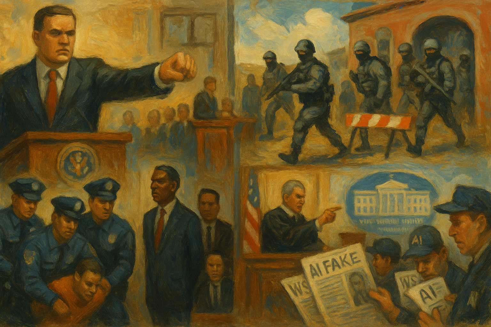

<!-- Generated by build_publish_week_v1 (appendix post) -->
<!-- Header image: image_wide_week27_appendix.png -->

# Week 27 Appendix: Databases and Detention as Governance

*A week when immigration camps, crypto reserves, and AI propaganda showed how law, money, and information are being refitted to serve power first.*

This week shows an aggressive consolidation of executive power, heavy politicization of law enforcement, and a coordinated information struggle around legitimacy and accountability. Structurally, the sharpest pressures fall on civil service independence, regulatory integrity, immigration enforcement, and the information ecosystem. Mass firings and restructurings at State, EPA, USDA, DOJ, and ICE, combined with Supreme Court stays and RIF approvals, deepen capture of the bureaucracy (traits 1, 16, 22). Immigration policy becomes a central vector of authoritarian drift: expanded detention infrastructure, National Guard deployments, masked raids, Medicaid data-sharing, and courthouse arrests normalize rights-violating enforcement against non‑citizens (traits 4, 9, 11, 46, 47). Parallel moves weaponize the justice system against political enemies (Obama, Schiff) while rolling back police-reform consent decrees and birthright citizenship, even as some courts push back (traits 4, 14, 51). On the information front, the White House seizes control of the press pool, bans the Wall Street Journal, leverages mergers, and floods discourse with AI fakes and treason accusations, while selectively releasing MLK and Clinton files to distract from Epstein records (traits 42–43, 52–53, 58–60). A few countervailing judicial and legislative actions appear, but they are outweighed by systemic entrenchment.

Power and Authority

1. President Trump and the Environmental Protection Agency eliminated the EPA's research and development office and began mass layoffs (2025-07-19): The administration cut thousands of EPA staff and dismantled its research arm, weakening federal capacity to generate independent science that informs environmental regulation and public health protections.

2. President Trump publicly pressured Federal Reserve Chair Jerome Powell to cut interest rates and suggested firing him (2025-07-19): Trump’s attacks on the Fed chair and hints at removal challenged the central bank’s independence, risking politicization of monetary policy that is meant to be insulated from short‑term political demands.

3. President Trump demanded release of grand jury testimony related to the Epstein investigation (2025-07-19): By urging disclosure of sensitive grand jury material in a case touching on his own reputation, Trump blurred lines between personal interest and state power, pressuring legal processes for political damage control.

4. Director of National Intelligence Tulsi Gabbard referred former President Obama and officials to DOJ for treason investigations over 2016 intelligence (2025-07-19): The DNI’s treason referral against a former president and national security officials weaponized intelligence oversight to criminalize prior policy decisions, undermining norms that separate partisan conflict from prosecutorial power.

5. President Trump raised US tariffs to an average effective rate of 20.6 percent (2025-07-19): The sharp tariff increase centralized trade power in the executive, using border taxes as a unilateral tool that can reshape prices and international relations without direct democratic input.

6. Secretary of State Marco Rubio revoked US visas of eight Brazilian Supreme Court judges (2025-07-19): Stripping visas from foreign judges adjudicating Bolsonaro’s alleged coup attempt used US diplomatic power to pressure another country’s judiciary, signaling willingness to intervene on behalf of aligned political actors.

7. Trump administration implemented deep State Department budget cuts and reorganization targeting rights programs (2025-07-21): Nearly halving the State Department budget and cutting LGBTQ+, reproductive health, and minority programs shifted US foreign policy away from rights promotion, concentrating discretion over diplomacy in ideological appointees.

8. Trump administration targeted sanctuary cities with intensified ICE operations (2025-07-22): Prioritizing aggressive ICE deployments in sanctuary jurisdictions used federal enforcement power to punish local governments for divergent immigration policies, straining federalism and heightening fear in immigrant communities.

9. President Trump signed an executive order creating a Strategic Bitcoin Reserve and federal crypto stockpile (2025-07-22): By directing the federal government to accumulate bitcoin and digital assets, Trump intertwined national economic strategy with a volatile asset class in which his allies have stakes, raising conflict‑of‑interest and stability concerns.

10. President Trump issued an executive order effectively barring trans women from US Olympic and Paralympic women’s teams (2025-07-22): Extending a federal ban on trans athletes into Olympic selection policy used executive authority to restrict participation of a marginalized group in national representation, signaling state‑endorsed exclusion.

11. President Trump ordered redrawing of Texas congressional districts ahead of the 2026 midterms (2025-07-25): Trump’s direction of Texas redistricting, amid DOJ racial‑gerrymandering concerns, inserted presidential influence into state map‑drawing to entrench partisan advantage and dilute minority representation.

12. President Trump signed an executive order to accelerate federal permitting of data center infrastructure (2025-07-23): The order fast‑tracked AI data center projects by easing environmental review and revoking prior safeguards, centralizing permitting discretion in the executive and prioritizing industry speed over local and environmental checks.

13. President Trump issued an executive order restricting use of so‑called 'woke' AI in the federal government (2025-07-23): Mandating that federal AI systems avoid DEI‑related content allowed the executive to impose ideological tests on government technology, shaping information outputs to align with administration narratives.

14. President Trump created the American AI Exports Program to promote US AI technology abroad (2025-07-23): The AI export order positioned the executive branch to steer global deployment of US AI stacks, blending industrial policy and national security in ways that can privilege favored firms and geopolitical aims.

15. President Trump signed executive orders to clear unhoused people from streets and expand civil commitment (2025-07-24): New homelessness orders directed aggressive removal of unhoused people from public spaces and sought to overturn court limits on involuntary treatment, expanding coercive state power over a vulnerable population.

16. President Trump signed an executive order on 'Saving College Sports' restricting third‑party pay for athletes (2025-07-24): By directing federal agencies to curb pay‑for‑play arrangements in college sports, the order inserted federal authority into collegiate governance and athlete compensation debates traditionally handled by states and associations.

17. Florida Governor Ron DeSantis and the Department of Homeland Security signed an agreement deputizing Florida highway patrol to enforce federal immigration law (2025-07-25): The 287(g)‑style agreement expanded state troopers’ authority to arrest and detain immigrants on federal grounds, deepening the fusion of state policing with federal immigration enforcement and heightening risks of civil‑rights abuses.

18. Department of Defense awarded a $1.26 billion contract to build a 5,000‑bed detention facility at Fort Bliss (2025-07-25): Funding a massive tent detention complex on a military base expanded the federal infrastructure for large‑scale confinement of migrants, normalizing quasi‑military facilities for civil immigration enforcement.

19. President Trump stated he had authority to pardon Ghislaine Maxwell and had not ruled it out (2025-07-25): By publicly musing about a potential pardon for Maxwell while DOJ engages her as a witness, Trump highlighted how clemency powers could be used to shield or incentivize cooperation by high‑profile offenders tied to elites.

Institutions and Governance

1. Senator Ron Wyden renewed demands for financial records related to Jeffrey Epstein (2025-07-19): Wyden’s push for bank reports on Epstein’s flagged transactions sought to expose how financial institutions handled suspected trafficking funds, reinforcing legislative oversight of elite financial crime.

2. Senator Dick Durbin questioned DOJ and FBI over mass reassignment of agents to review Epstein files mentioning Trump (2025-07-19): Durbin’s inquiry challenged whether investigative resources were being redirected to protect or target specific political figures, testing transparency and impartiality in high‑profile case management.

3. Senator Lisa Murkowski criticized Trump’s orders undermining renewable energy projects she had protected in legislation (2025-07-19): Murkowski’s complaint underscored how executive orders can override negotiated statutory compromises, weakening Congress’s ability to set durable policy on energy and climate.

4. Speaker Mike Johnson refused to schedule a vote on a bipartisan resolution to release Epstein files (2025-07-20): By blocking a floor vote likely to pass, Johnson used agenda control to prevent disclosure in a politically sensitive case, limiting Congress’s transparency role.

5. Speaker Mike Johnson sent the House into early recess to avoid a vote on releasing Epstein files (2025-07-21): Closing the House early to dodge a bipartisan transparency vote turned procedural control into a shield against accountability on elite‑linked sexual abuse investigations.

6. House Ethics complainant Article3 Project filed an ethics complaint against Minority Leader Hakeem Jeffries over comments on a US attorney retention vote (2025-07-20): The complaint alleged improper pressure on district judges over Alina Habba’s retention, highlighting tensions between political speech and judicial independence in appointment processes.

7. Supreme Court of the United States lifted injunctions blocking State Department mass firings (2025-07-21): The Court’s decision allowed RIF notices to proceed for over 1,300 State employees, signaling judicial deference to executive workforce purges that can politicize foreign‑service staffing.

8. US District Court for the Southern District of Mississippi temporarily blocked enforcement of Mississippi’s anti‑DEI education law (2025-07-21): The TRO against a statewide DEI ban in schools and universities preserved existing diversity programs while courts assess First and Fourteenth Amendment claims, checking legislative overreach into academic governance.

9. US Court of Appeals allowed termination of TPS for Afghans and Cameroonians to proceed (2025-07-21): By reversing a lower‑court block on ending TPS for tens of thousands, the appeals court enabled abrupt status loss for vulnerable immigrants, narrowing judicial protection against harsh executive immigration shifts.

10. Coalition of 21 Democratic attorneys general sued to block restrictions on undocumented immigrants’ access to federal health and safety‑net programs (2025-07-21): The multistate lawsuit challenged federal efforts to cut immigrants off from basic services, using state litigation to defend social protections and contest executive policy.

11. Department of Homeland Security restored TPS and work authorization for Haitians following a court order (2025-07-21): DHS’s compliance with a judicial block on TPS termination for Haitians showed courts still constraining abrupt status revocations that would destabilize immigrant communities.

12. Federal judges in Maryland secured dismissal of a Trump administration lawsuit against state judges over deportation orders (2025-07-21): The dismissal defended state judicial authority against federal attempts to punish judges for blocking deportations, reinforcing separation of powers and judicial independence.

13. US District Court ordered restoration of immigration judges’ ability to appoint counsel for mentally disabled immigrants (2025-07-21): Reinstating judges’ authority to assign counsel to vulnerable immigrants strengthened due‑process safeguards in complex proceedings where unrepresented individuals face removal.

14. Supreme Court of the United States granted a stay in Trump v. Boyle allowing termination of Consumer Product Safety Commission members (2025-07-23): The stay let the administration keep three CPSC commissioners removed, signaling high‑court support for expanded presidential control over independent regulatory bodies.

15. US Courts of Appeals and District Courts repeatedly blocked Trump’s executive order ending birthright citizenship (2025-07-24): Appellate and district rulings declaring the birthright‑citizenship order unconstitutional upheld Fourteenth Amendment guarantees and limited executive attempts to redefine citizenship unilaterally.

16. Federal courts in Tennessee and Maryland ordered release and barred immediate deportation of Kilmar Ábrego García (2025-07-23): Judges in two states intervened to free Ábrego from custody and prevent sudden deportation, asserting judicial oversight over executive detention and removal practices.

17. US District Judge Robin Rosenberg denied DOJ requests to unseal Epstein grand jury transcripts (2025-07-23): Rosenberg’s rulings kept grand jury materials sealed despite DOJ motions, emphasizing legal limits on transparency in sensitive cases even amid intense political pressure.

18. Federal judge dismissed a Trump administration lawsuit challenging Illinois and Chicago sanctuary policies (2025-07-23): The dismissal upheld state and local discretion over cooperation with federal immigration enforcement, reinforcing federalism against attempts to coerce sanctuary jurisdictions.

19. Trump administration filed a lawsuit against New York City over its sanctuary city policies (2025-07-24): Suing NYC for its sanctuary stance sought to use federal courts to override local limits on cooperation with immigration enforcement, escalating conflict over jurisdictional authority.

20. House Oversight Committee voted to subpoena Ghislaine Maxwell and the Justice Department for Epstein files (2025-07-23): Bipartisan committee votes to compel Maxwell’s testimony and DOJ records aimed to pierce executive secrecy around Epstein, reasserting congressional investigative powers over a politically fraught case.

21. Senate Republicans on the Judiciary Committee blocked the Epstein Transparency Act (2025-07-23): Committee Republicans prevented advancement of a bill to increase disclosure in the Epstein case, limiting statutory routes for public access to information about elite‑linked crimes.

22. Senators Lindsey Graham and John Cornyn urged appointment of a special counsel to investigate Obama‑era intelligence on Russia (2025-07-24): Calls for a special counsel into prior intelligence assessments risked reframing settled bipartisan findings as partisan misconduct, pressuring DOJ to reopen politically charged inquiries.

23. Congress and President Trump enacted the Rescissions Act of 2025 canceling budgetary resources (2025-07-24): The rescissions law clawed back previously appropriated funds, shifting fiscal priorities and demonstrating how executive‑legislative alignment can rapidly reallocate resources away from earlier commitments.

24. Congress and President Trump enacted the Filing Relief for Natural Disasters Act (2025-07-24): The new law provided tax‑filing relief in disaster areas, showing Congress still using its authority to ease administrative burdens and support affected communities.

25. Congress and President Trump created the Jocelyn Nungaray National Wildlife Refuge (2025-07-24): Establishing a new wildlife refuge demonstrated ongoing legislative capacity to protect public lands and biodiversity through statute despite broader deregulatory trends.

26. Federal Election Commission canceled a scheduled open meeting for September 4, 2025 (2025-07-24): Canceling a public FEC meeting reduced opportunities for transparent discussion of campaign‑finance and election‑oversight issues, limiting public visibility into regulatory decisions.

27. National Archives and Records Administration invited public comment on proposed federal records schedules (2025-07-24): NARA’s request for input on record disposition plans opened a channel for public oversight of which government documents are preserved or destroyed, supporting archival transparency.

28. Federal judge ordered restoration of a public spending tracker website (2025-07-21): Requiring the administration to reinstate an online tracker for apportionment decisions enforced statutory transparency obligations around federal spending.

29. Department of Justice released additional documents from the Hillary Clinton email investigation (2025-07-23): Publishing more records from a long‑closed probe into Clinton’s emails kept a politically charged case in public view, raising questions about selective transparency and political use of past investigations.

30. Trump administration released over 230,000 FBI records on Martin Luther King Jr. (2025-07-21): The mass release of historic FBI surveillance files on MLK, over family objections, expanded access to state records while also appearing timed to divert attention from Epstein‑file secrecy.

31. Department of Justice announced it would not release additional Epstein files despite holding about 100,000 pages (2025-07-24): DOJ’s refusal to disclose more Epstein records, citing sensitivity, deepened concerns that information about elite‑linked crimes is being withheld from public scrutiny.

32. Federal judge ordered the Trump administration to restore a public spending tracker website (2025-07-21): The order enforced statutory transparency requirements for apportionment data, countering executive efforts to obscure how funds are allocated.

Economic Structure

1. President Trump and Congress enacted a tax bill projected to add $3.4 trillion to the debt and cut Medicaid and SNAP (2025-07-21): The law made corporate and high‑income tax cuts permanent while slashing safety‑net programs, shifting fiscal benefits toward capital and leaving millions with reduced health coverage and food assistance.

2. Trump administration tripled ICE’s budget and planned expanded enforcement in sanctuary cities (2025-07-21): Massive ICE funding increases and targeted operations in sanctuary jurisdictions redirected public money toward aggressive immigration control, expanding a carceral infrastructure with limited accountability.

3. Neuralink falsely self‑certified as a small disadvantaged business to obtain federal contracting advantages (2025-07-19): Neuralink’s long‑running misclassification as an SDB exploited programs meant for marginalized entrepreneurs, illustrating how well‑capitalized firms can game procurement rules.

4. Trump administration raised tariffs and pushed for broad new tariffs in EU negotiations (2025-07-20): Higher tariffs, including proposed double‑digit levies on EU goods, increased consumer prices and trade tensions, using trade policy as a blunt economic and geopolitical instrument.

5. General Motors reported a 35 percent drop in net income due to Trump’s automotive tariffs (2025-07-21): GM’s earnings hit underscored how tariff policy can destabilize major employers and supply chains, with downstream effects on workers and regional economies.

6. President Trump and Congress enacted the GENIUS Act establishing a crypto‑friendly regulatory framework for stablecoins (2025-07-22): The crypto law, heavily shaped by industry lobbyists and overlapping with Trump‑linked ventures, legitimized stablecoins while raising concerns that financial regulation is being written for insiders.

7. Trump Media & Technology Group acquired $2 billion in bitcoin, pivoting into a crypto holding company (2025-07-22): TMTG’s massive bitcoin purchase, amid pro‑crypto federal policy, highlighted how political influence and corporate strategy can reinforce each other in speculative markets.

8. Senate and President Trump installed Paul Atkins as SEC chair and dropped major crypto enforcement cases (2025-07-22): Atkins’s confirmation and swift dismissal of lawsuits against large crypto firms signaled a regulatory turn favoring an industry with close ties to administration allies.

9. White House issued ethics waivers allowing advisor David Sacks to keep crypto investments while shaping policy (2025-07-22): Letting a senior digital‑assets advisor retain undisclosed crypto stakes while influencing regulation created direct conflicts of interest, eroding trust in impartial economic policymaking.

10. Trump administration froze and then agreed to unfreeze billions in federal education funding after lawsuits (2025-07-24): The temporary freeze of over $5–6 billion in education funds, reversed under pressure, showed how executive budget maneuvers can be used to exert leverage over schools and states.

11. Coalition of nonprofits and local governments sued over federal funding rules threatening services for domestic violence and homelessness (2025-07-21): Challenges to new HUD and HHS conditions highlighted how funding levers can be used to reshape social‑service provision and potentially punish organizations serving vulnerable groups.

12. Trump administration froze $6 billion in federal education program funding, prompting litigation (2025-07-21): The freeze on congressionally allocated education funds, later challenged in court, illustrated executive willingness to override legislative spending decisions affecting schools nationwide.

13. Trump administration cut $20 million in EPA clean‑water grants for pesticide‑contaminated rural California (2025-07-24): Rescinding funds for safe drinking water in farmworker communities, labeled a 'wasteful DEI program,' shifted environmental burdens onto poor, largely minority residents.

14. US Department of Agriculture announced salary cuts, office closures, and relocation of thousands of staff (2025-07-24): USDA’s restructuring reduced Washington‑based capacity and uprooted staff, weakening federal support for farmers and food safety while aligning with broader efforts to shrink the civil service.

15. Trump administration signed a $9 billion rescissions package cutting foreign aid and public broadcasting funds (2025-07-24): Canceling $8 billion in foreign aid and $1.1 billion for public broadcasting reoriented federal spending away from diplomacy and independent media toward other priorities.

16. Columbia University and the Trump administration reached a $200 million settlement restoring over $400 million in federal grants (2025-07-24): The settlement tied restoration of research funding to speech‑related conditions and governance changes, demonstrating how federal dollars can be used to reshape university policies and campus expression.

17. Trump administration awarded a $1.26 billion contract for a massive immigrant detention facility at Fort Bliss (2025-07-22): The Fort Bliss contract expanded a lucrative detention industry, channeling public funds into long‑term confinement infrastructure for migrants.

18. Trump administration approved the Paramount–Skydance merger after anti‑DEI assurances (2025-07-25): FCC approval of the media merger, conditioned on rolling back DEI and addressing alleged news bias, showed how regulatory power can shape corporate governance and newsroom culture.

19. Trump administration unfroze over $5 billion in previously withheld federal education funding (2025-07-25): Releasing funds after legal and public pressure underscored both the vulnerability of school budgets to executive decisions and the capacity of external checks to reverse them.

20. Trump administration used taxpayer funds for Trump’s Scotland trip tied to his golf business (2025-07-24): Criticism over public spending on a trip that promoted Trump’s private golf course highlighted ongoing concerns about emoluments and blending of official travel with personal business.

Civil Rights and Dissent

1. Family of Cornelius Taylor sued the city of Atlanta after he was killed during a homeless encampment sweep (2025-07-19): The lawsuit over a fatal bulldozer sweep challenged aggressive encampment clearances that can endanger unhoused people while prioritizing urban image and development goals.

2. Department of Justice requested a one‑day sentence for former officer Brett Hankison in the Breonna Taylor case (2025-07-19): DOJ’s call for minimal punishment in a civil‑rights conviction over a deadly raid signaled leniency toward police misconduct, undermining confidence in federal civil‑rights enforcement.

3. Federal courts sentenced Brett Hankison to nearly three years in prison for violating Breonna Taylor’s rights (2025-07-22): The 33‑month sentence, harsher than DOJ’s recommendation, demonstrated judicial willingness to impose meaningful accountability for rights‑violating police raids.

4. Immigration and Customs Enforcement expanded detention capacity with tent facilities and targeted sanctuary cities (2025-07-19): ICE’s rapid build‑out of tent detention and focus on sanctuary jurisdictions intensified mass confinement of migrants, often in precarious conditions with limited legal recourse.

5. Coalition of 21 state attorneys general urged Congress to ban masked federal immigration agents (2025-07-20): State AGs pressed for legislation requiring ICE agents to show their identities, arguing that masked raids erode accountability and enable abuses against immigrants.

6. Immigration and Customs Enforcement allowed agents to continue wearing masks during arrest raids (2025-07-20): ICE’s insistence on masked operations, despite impersonation and fear concerns, entrenched opaque enforcement practices that make it harder for targets to assert their rights.

7. Immigration and Customs Enforcement and CMS gained access to Medicaid records to locate undocumented immigrants (2025-07-21): Sharing sensitive health‑program data with ICE for enforcement purposes risked deterring families from seeking care and expanded surveillance of immigrant communities.

8. Human Rights Watch and partner groups documented abusive conditions in Florida ICE detention centers (2025-07-21): Reports of shackling, overcrowding, and inadequate medical care in ICE facilities highlighted systemic rights violations against detainees held under expanded enforcement policies.

9. Trump administration terminated police‑reform consent decrees in more than 20 cities (2025-07-25): Ending federal oversight agreements with police departments rolled back mechanisms designed to curb systemic misconduct, weakening protections for communities facing abusive policing.

10. Immigration and Customs Enforcement detained journalist Mario Guevara and pursued his deportation after protest coverage (2025-07-20): ICE’s continued detention of a protest‑covering journalist, despite dropped charges, suggested retaliatory use of immigration powers against both a reporter and immigrant communities.

11. Immigration and Customs Enforcement detained an asylum seeker in a San Antonio courtroom immediately after her hearing (2025-07-22): Arresting an asylum seeker at court despite a future hearing date exemplified tactics that undermine due process and discourage immigrants from engaging with the legal system.

12. Immigration and Customs Enforcement increased use of ankle monitors and supervision in Alternatives to Detention (2025-07-24): Expanding electronic monitoring tightened control over migrants outside physical detention, extending surveillance and constraints on daily life without full judicial oversight.

13. Immigration and Customs Enforcement arrested nearly 3,000 people in Los Angeles, including some citizens and lawful residents (2025-07-25): Large‑scale ICE sweeps in Los Angeles, with mistaken arrests and no criminal history for many, spread fear in immigrant neighborhoods and raised due‑process concerns.

14. Florida Governor Ron DeSantis announced deportations and transfers from the 'Alligator Alcatraz' detention camp (2025-07-25): Deporting detainees from a widely criticized camp with harsh conditions highlighted how state‑run facilities can facilitate rapid removals with limited transparency or oversight.

15. Department of Homeland Security and ICE directed CBP to ask detained teenagers if they wished to self‑deport (2025-07-23): Prompting minors in custody to 'choose' self‑deportation exploited their vulnerability and limited understanding, undermining meaningful consent in life‑altering decisions.

16. Trump administration ended investigations and consent decrees on police misconduct in multiple cities (2025-07-25): Terminating federal oversight of troubled police departments weakened a key tool for enforcing civil‑rights standards and curbing abusive practices.

17. Columbia University disciplined about 80 students for a pro‑Palestinian library protest (2025-07-24): Mass suspensions, expulsions, and degree revocations for protest participants, under a broadened antisemitism definition, signaled a campus crackdown on certain political speech.

18. ICE agents at Durham courthouse and local community organizers sparked a rapid protest against courthouse immigration enforcement (2025-07-23): Community mobilization in response to ICE presence at a courthouse illustrated local resistance to enforcement tactics seen as chilling access to justice for immigrants.

19. Climate activists and local police clashed during protests at Wells Fargo offices, leading to seven arrests (2025-07-23): Arrests at coordinated climate protests against fossil‑fuel financing showed how civil disobedience campaigns challenging corporate and federal climate policies face policing and legal risk.

20. US government and Venezuelan youth baseball team denied visas to a Little League team from Venezuela (2025-07-24): Refusing visas for child athletes curtailed a benign cultural exchange, reflecting how restrictive immigration policies can spill over into apolitical civic and sporting ties.

21. Trump administration banned trans women from US women’s Olympic and Paralympic teams (2025-07-22): The exclusion of trans women from national teams codified discrimination in elite sport, reinforcing broader efforts to restrict transgender participation in public life.

22. Trump administration and ICE expanded courthouse and hallway arrests at New York immigration courts (2025-07-25): Detaining people immediately after hearings, even when granted follow‑up dates, turned courts into arrest zones, discouraging attendance and undermining trust in legal processes.

23. Trump administration and DHS held over 56,000 people in detention centers amid reports of inhumane conditions (2025-07-25): Record‑high detention numbers, many without criminal histories, combined with reports of overcrowding and neglect, underscored a punitive approach to migration over humane alternatives.

Information, Memory and Manipulation

1. Donald Trump filed multibillion‑dollar defamation lawsuits against the Wall Street Journal and Rupert Murdoch (2025-07-19): Trump’s $10 billion libel suits over reporting on an alleged Epstein letter sought to punish a major outlet for unfavorable coverage, potentially chilling investigative reporting.

2. Federal judge Paul Gardephe dismissed Trump’s $50 million lawsuit against journalist Bob Woodward (2025-07-19): The dismissal of Trump’s suit over use of interview tapes reaffirmed legal protections for journalists publishing material obtained with consent, pushing back against retaliatory litigation.

3. Director of National Intelligence Tulsi Gabbard publicly accused Barack Obama of a 'treasonous conspiracy' against Trump (2025-07-19): Gabbard’s televised treason claims, contradicting prior bipartisan findings on Russian interference, injected disinformation into official discourse and framed political opponents as criminals.

4. Trump administration altered State Department human rights reports to remove sections on reproductive, LGBTQ+, and minority rights (2025-07-21): Editing out key rights topics from official reports reshaped the public record of global abuses, aligning US documentation with the administration’s ideological agenda.

5. President Trump posted an AI‑generated video depicting Barack Obama being arrested (2025-07-21): Sharing a fabricated arrest video of a former president used deepfake technology to blur reality and inflame partisan narratives about supposed past crimes.

6. Wall Street Journal published an alleged 2003 Trump birthday letter to Jeffrey Epstein (2025-07-21): The story, and Trump’s denial and lawsuit, intensified disputes over document authenticity and media credibility in reporting on elite networks around Epstein.

7. White House removed the Wall Street Journal from the presidential press pool and took control of pool assignments (2025-07-22): By seizing press‑pool control from reporters and excluding the WSJ after critical coverage, the administration used access as leverage to reward friendly outlets and punish critics.

8. Unknown pro‑Trump operators ran an AI‑driven bot network of hundreds of accounts promoting administration figures (2025-07-20): The discovery of a large AI bot network amplifying pro‑Trump messaging on X highlighted coordinated computational propaganda efforts in the online information sphere.

9. Department of Homeland Security tweeted neo‑Nazi‑echoing rhetoric praising genocide against Indigenous people (2025-07-23): A DHS tweet featuring imagery and language glorifying Indigenous genocide signaled extremist narratives seeping into official communications, distorting public memory of historical atrocities.

10. Kari Lake at US Agency for Global Media locked the acting CEO out of systems and threatened the Voice of America director (2025-07-23): Power moves inside USAGM to sideline leadership and pressure VOA management raised alarms about political interference in US‑funded international broadcasting.

11. White House Press Secretary Karoline Leavitt called for revoking Pulitzers from the New York Times and Washington Post over Russia reporting (2025-07-23): Demanding that major outlets lose awards for coverage of Russian interference sought to delegitimize prior investigative work and rewrite the narrative of 2016 election meddling.

12. President Trump and congressional allies repeatedly claimed without evidence that Obama cheated in the 2016 election (2025-07-24): Coordinated messaging that Obama 'rigged' 2016, despite contrary evidence, aimed to recast past elections as illegitimate and normalize treating opponents as criminal conspirators.

13. Trump administration released 230,000 MLK assassination documents while withholding Epstein files (2025-07-24): The selective release of historic civil‑rights surveillance records, contrasted with secrecy around Epstein, suggested archives are being curated to distract from current elite accountability issues.

14. Trump administration withheld about 100,000 pages of Epstein files from public release (2025-07-24): Maintaining secrecy over a vast trove of Epstein documents, even as related scandals swirl, reinforced perceptions that information about elite wrongdoing is being shielded.

15. Defense Secretary Pete Hegseth was reported to have shared content from a 'SECRET' email in a Signal chat (2025-07-25): Allegations that Hegseth relayed classified information via an encrypted chat raised concerns about selective and informal handling of secrets at the top of the security establishment.

16. Trump administration used AI and policy to shape government information outputs and narratives (2025-07-24): Executive orders on 'woke' AI and AI export, combined with bot networks and deepfakes, embedded algorithmic tools into a broader strategy to steer public understanding and suppress disfavored perspectives.

