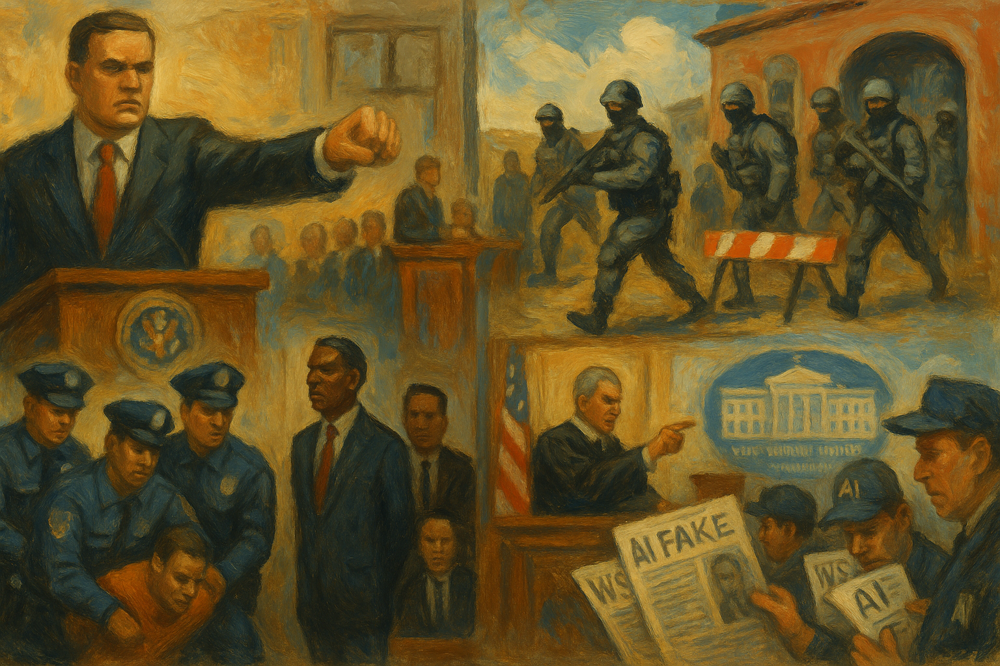

<!-- Generated by build_publish_week_v1 (appendix post) -->
<!-- Header image: image_wide_week27_appendix.png -->

# Week 27 Appendix: A Government That Manages Exposure

*A dense week of executive pressure, media suits, and mass detention moved the Democracy Clock only slightly, but courts kept holding one line.*

This was a high-pressure week defined by the fusion of retaliation, secrecy, and institutional repurposing. The strongest pattern was the use of state and quasi-state power to protect the executive and punish perceived enemies: DOJ and intelligence channels were mobilized around baseless Obama-related “treason” claims, while Congress’s own leadership shut down House business to avoid votes on Epstein transparency. At the same time, the administration intensified pressure on independent information systems: Trump escalated lawsuits against major media, the White House tightened direct control over press-pool access, and AI- and propaganda-style narrative management expanded. Immigration enforcement remained a major engine of democratic decay, with masked raids, courthouse detentions, data-sharing, detention expansion, and militarized support structures all deepening a model of opaque coercive governance. A parallel theme was institutional hollowing: mass civil-service cuts at EPA, State, and USDA, plus policy deals coercing universities and media firms, showed executive leverage being used to weaken independent expertise and autonomy. Courts provided some meaningful checks, especially on birthright citizenship and immigrant due process, but the week’s overall force was toward entrenching politicized executive control.

Power and Authority

1. President Trump criticized Federal Reserve Chair Jerome Powell and suggested he could be removed (2025-07-19): The president's public pressure on the Fed tested the independence of a key institution that is meant to operate apart from direct political control.

2. President Trump asked Attorney General Pam Bondi to seek release of Epstein grand jury testimony (2025-07-19): The request showed a president intervening in a sensitive criminal matter, raising questions about political influence over justice decisions and disclosure.

3. Secretary of State Marco Rubio revoked U.S. visas for Brazilian judges involved in Jair Bolsonaro's case (2025-07-19): The move used U.S. executive power to pressure foreign judicial actors, testing norms against political interference in another country's legal process.

4. President Trump called for Senate Republicans to cancel recess to speed confirmation of his nominees (2025-07-19): The demand pressed the Senate to reorder its schedule around executive staffing priorities, showing direct pressure on a coequal branch.

5. The Trump administration implemented deep State Department cuts and reorganization (2025-07-21): The overhaul reduced diplomatic and rights-focused capacity while concentrating executive control over staffing, mission, and program priorities.

6. The Trump administration targeted sanctuary cities for intensified ICE operations (2025-07-22) *[single source]*: The plan used federal enforcement power against disfavored local jurisdictions, sharpening conflict over local autonomy and immigrant rights.

7. President Trump signed pro-crypto executive orders and created a Strategic Bitcoin Reserve (2025-07-22) *[single source]*: The orders aligned federal policy with a volatile private industry, raising concerns about executive favoritism and weakened consumer safeguards.

8. President Trump signed the GENIUS Act regulating stablecoins (2025-07-22): The law gave federal legitimacy to a fast-growing financial sector, increasing the democratic stakes of lobbying, oversight, and conflict-of-interest concerns.

9. President Trump issued executive orders to expand AI exports, speed data center permitting, and restrict federal use of so-called woke AI (2025-07-23): The orders combined deregulation, procurement control, and ideological standards, expanding executive influence over infrastructure, information systems, and federal technology policy.

10. President Trump reached a settlement with Paramount over a CBS interview lawsuit (2025-07-22): A president's settlement with a major media company during a pending merger review raised concerns about leverage over press institutions.

11. President Trump signed an order directing governments to clear unhoused people from public spaces (2025-07-24): The order expanded coercive state power over vulnerable people and pushed federal policy toward forced removal and treatment.

12. The USDA announced salary cuts and relocation of thousands of employees (2025-07-24): The restructuring weakened agency continuity and expertise while increasing executive control over where and how federal staff work.

13. The EPA rescinded a $20 million clean water grant for rural California communities (2025-07-24) *[single source]*: The cancellation withdrew federal support from a vulnerable community and showed executive power reshaping public goods through ideological criteria.

14. Governor Ron DeSantis and the Department of Homeland Security expanded Florida troopers' role in federal immigration enforcement (2025-07-25) *[single source]*: The agreement widened state participation in federal immigration policing, increasing coercive capacity and blurring lines of accountability.

15. The Department of Defense awarded a contract for a large tent detention facility at Fort Bliss (2025-07-25): The contract expanded detention infrastructure through executive action, deepening the state's capacity to confine migrants at scale.

16. President Trump said he had authority to pardon Ghislaine Maxwell and did not rule it out (2025-07-25): The statement highlighted the broad pardon power in a politically charged criminal case, raising accountability concerns.

Institutions and Governance

1. Senator Ron Wyden renewed his demand for Epstein-related financial records (2025-07-19): The request pressed for oversight of financial institutions and transparency in a case involving powerful actors.

2. Senator Dick Durbin asked the DOJ and FBI about the reassignment of agents to review Epstein files (2025-07-19) *[single source]*: The inquiry sought accountability for how federal law enforcement resources were used in a politically sensitive matter.

3. Senator Lisa Murkowski criticized presidential orders that undercut energy protections in a budget bill (2025-07-19) *[single source]*: Her complaint highlighted conflict between enacted legislation and later executive action, testing the balance between branches.

4. A coalition of 21 state attorneys general urged Congress to ban masked federal immigration agents (2025-07-20) *[single source]*: The appeal sought statutory limits to improve identification, transparency, and accountability in federal enforcement operations.

5. The Article3 Project filed a House ethics complaint against Hakeem Jeffries (2025-07-20): The complaint reflected conflict over whether political pressure on judges threatened judicial independence and legislative ethics norms.

6. Speaker Mike Johnson and House Republicans blocked or delayed votes on releasing Epstein-related records and sent the House home early (2025-07-20): House leaders used procedure to avoid a transparency vote, weakening deliberation and public accountability in Congress.

7. Activists urged senators to oppose Emil Bove's lifetime judicial appointment (2025-07-20): The campaign showed public efforts to influence a lifetime court appointment that could shape checks on power for years.

8. North Carolina Republican lawmakers proposed a bill barring election officials from encouraging turnout (2025-07-21) *[single source]*: The proposal would narrow the role of election administrators and could reduce participation by treating voter outreach as improper.

9. The House Oversight Committee moved to subpoena Ghislaine Maxwell (2025-07-21): The committee used oversight powers to seek testimony in a case tied to public demands for accountability and disclosure.

10. House Republicans advanced a proposal to rename the Kennedy Center Opera House for Melania Trump (2025-07-21): The amendment used legislative power for symbolic honor tied to the ruling family, blurring governance and personal glorification.

11. Representative Jim Jordan subpoenaed a DOJ prosecutor tied to Trump investigations (2025-07-21): The subpoena extended congressional pressure on prosecutors involved in cases touching the president, testing norms around independent law enforcement.

12. The Supreme Court lifted injunctions that had blocked State Department firings (2025-07-21): The order cleared the way for mass executive layoffs, showing how court rulings can reshape agency capacity and oversight limits.

13. The Supreme Court denied rehearing petitions in five cases (2025-07-21): The denials left prior rulings in place and reflected the Court's gatekeeping role over which disputes receive further review.

14. The Election Assistance Commission announced a public meeting on voting system guidelines (2025-07-21): The meeting supported transparent rulemaking around voting technology standards that affect election administration and trust.

15. A federal judge ordered the Trump administration to restore a public spending tracker website (2025-07-21) *[single source]*: The ruling enforced statutory transparency requirements and protected public access to federal spending information.

16. Japan's political parties and commentators debated immigration assimilation and local caps on foreign residents (2025-07-22) *[single source]*: The proposals showed how legislative and party agendas can reshape membership, representation, and equal treatment in a democracy.

17. A New Jersey judicial panel and the Justice Department clashed over who would lead the U.S. attorney's office in New Jersey (2025-07-22): The dispute tested the boundary between judicial appointment authority and executive control over federal prosecution leadership.

18. The FCC announced an open commission meeting agenda (2025-07-23): The notice set out public business on communications policy, supporting procedural transparency in agency decision-making.

19. Representative Jim Himes rejected calls to prosecute Barack Obama as legally baseless (2025-07-23): The response defended institutional standards against efforts to use oversight rhetoric for unsupported criminal accusations.

20. Senators Lindsey Graham and John Cornyn called for a special counsel to investigate Obama-era intelligence decisions (2025-07-23): The demand pressed the Justice Department to open a politically charged inquiry, testing norms of prosecutorial independence.

21. Senate Republicans blocked the Epstein Transparency Act in committee (2025-07-23) *[single source]*: The move stopped a legislative path to disclosure, limiting Congress's role in forcing transparency on a high-profile case.

22. North Carolina activists tracked and opposed election and immigration bills they viewed as anti-democratic (2025-07-24) *[single source]*: The organizing effort showed civil monitoring of state lawmaking that could alter representation, rights, and executive power.

23. The Supreme Court granted a stay in Turtle Mountain Band v. Howe (2025-07-24): The stay paused a lower court mandate and showed the Court's power to alter the timing and effect of election-related litigation.

24. The House Oversight Committee subpoenaed the Justice Department for Epstein files (2025-07-24): The subpoena asserted congressional oversight over executive records in response to public demands for disclosure and accountability.

25. The Federal Election Commission canceled a scheduled open meeting (2025-07-24): Canceling a public meeting reduced a routine venue for transparency and public observation in election oversight.

26. The FCC deleted a personnel item from its open meeting agenda (2025-07-25): Removing a public agenda item narrowed visibility into an appointment-related decision inside a federal regulator.

Economic Structure

1. The EPA eliminated its research and development office and began layoffs (2025-07-19): The cuts reduced independent scientific capacity inside a regulator, weakening the public side of environmental and health oversight.

2. The Trump administration raised U.S. tariffs and threatened more in trade talks (2025-07-19) *[single source]*: The tariff push used state economic power in ways likely to raise prices and shift costs onto consumers and firms.

3. Neuralink falsely claimed small disadvantaged business status in federal contracting records (2025-07-19) *[single source]*: The false certification undermined the integrity of public contracting rules meant to direct opportunity to eligible firms.

4. President Trump signed a tax law projected to add trillions to the deficit while cutting safety-net support (2025-07-21) *[single source]*: The law shifted fiscal benefits upward while reducing public support systems, deepening the democratic stakes of tax and budget policy.

5. The EPA issued technical corrections and notices on chemical, pesticide, and emissions rules (2025-07-21): These actions maintained or adjusted regulatory frameworks that shape how public health and environmental risks are governed.

6. The FCC issued multiple notices on broadcast, numbering, and paperwork rules (2025-07-21): The notices affected how communications markets are regulated and how firms comply with federal oversight requirements.

7. The FDA issued guidance on clinical trials and biosimilar meetings (2025-07-21): The guidance shaped how drug development is governed, affecting access to evidence, safety standards, and regulatory process.

8. General Motors reported a sharp profit drop tied to tariffs (2025-07-21) *[single source]*: The report showed how trade policy can directly affect major employers, investment decisions, and industrial stability.

9. School districts and advocacy groups sued over a freeze of $6 billion in education funding (2025-07-21): The suit challenged executive withholding of congressionally directed funds, a key issue for budget accountability and public education.

10. Nonprofit organizations sued over new federal funding conditions for homelessness and domestic violence services (2025-07-21) *[single source]*: The case challenged federal leverage over essential services, showing how funding rules can reshape civil society and public welfare.

11. Trump Media & Technology Group announced a $2 billion bitcoin acquisition (2025-07-22) *[single source]*: The purchase deepened overlap between political influence and private financial interests in a lightly regulated market.

12. The White House issued waivers allowing a crypto adviser to keep investments while shaping policy (2025-07-22) *[single source]*: The waivers raised conflict-of-interest concerns and suggested weak barriers between private gain and public rulemaking.

13. The Trump administration awarded a $1.26 billion contract for a major immigrant detention facility (2025-07-22): The award expanded a contractor-driven detention economy, tying public coercive power to large private payments.

14. A federal finance agency under new leadership was described as being used for political retaliation (2025-07-23) *[single source]*: Using a financial regulator for partisan ends would weaken neutral administration and public trust in economic governance.

15. Columbia University agreed to pay a large settlement to restore frozen federal grants (2025-07-23): The deal showed how federal funding pressure can force major institutions into costly compliance with political demands.

16. Congress and federal agencies enacted or administered budget, disaster, conservation, census, air quality, chemical, workplace, and procurement measures (2025-07-24): These actions shaped the distribution of public money, regulatory burdens, and access to public goods across many sectors.

17. Analysts and political actors reported or argued that tariffs, tax cuts, and deficits were raising economic strain (2025-07-24): The claims linked executive and legislative choices to higher prices, larger deficits, and pressure on household welfare.

18. The FCC approved the Paramount-Skydance merger (2025-07-24): The approval advanced major media consolidation, increasing concerns about concentrated ownership and political influence over information markets.

19. President Trump signed a $9 billion rescissions package into law (2025-07-24) *[single source]*: The cuts redirected federal priorities by reducing foreign aid and public broadcasting support through budget power.

20. The Trump administration announced it would unfreeze more than $5 billion in education funding (2025-07-25): Restoring the money reversed a major withholding decision and showed how executive control over funds can disrupt public schools.

21. Reports and officials described declines in tourism and trade-related economic effects (2025-07-25) *[single source]*: The reports tied policy choices and political climate to lost revenue and broader strain on local economies.

22. Noahpinion commentary described policy debates over public groceries and fiscal ideology (2025-07-24) *[single source]*: These debates reflected competing views about the state's role in markets, public provision, and budget priorities.

Civil Rights and Dissent

1. The family of Cornelius Taylor sued Atlanta over a fatal homeless encampment sweep (2025-07-19): The suit challenged how local power was used against unhoused people and sought accountability for a deadly clearance operation.

2. The DOJ requested a one-day sentence for Brett Hankison in the Breonna Taylor case (2025-07-19): The request raised concerns about unequal accountability for police violence in a major civil rights case.

3. ICE expanded detention capacity with temporary tent facilities (2025-07-19): The expansion increased the state's ability to confine migrants while raising due process and humane-treatment concerns.

4. ICE kept journalist Mario Guevara in detention after charges were dropped (2025-07-20) *[single source]*: The detention linked immigration enforcement with pressure on a reporter, threatening both immigrant rights and press freedom.

5. ICE and DHS used masked raids, Medicaid data, and disputed deportation practices in immigration enforcement (2025-07-20): These actions expanded opaque enforcement tools and raised concerns about privacy, due process, and abuse of vulnerable people.

6. The U.S. government returned 230 Venezuelan nationals from an El Salvador prison to Venezuela (2025-07-20): The release highlighted the severe rights stakes of cross-border detention and deportation arrangements.

7. Republican officials and litigants advanced efforts that could restrict voting by overseas Americans (2025-07-20) *[single source]*: The push threatened access to the ballot for a distinct voter group and fit a broader pattern of participation limits.

8. Activists in North Carolina organized against an election bill and planned a protest (2025-07-20) *[single source]*: The mobilization defended fair election rules and showed civic resistance to perceived voter suppression.

9. President Trump threatened to block a stadium deal unless the Washington Commanders restored their former name (2025-07-20): The threat used political leverage in a culture conflict touching racial dignity and public decision-making.

10. A federal judge paused Mississippi's anti-DEI law (2025-07-21): The order temporarily protected speech and equal treatment in public education against a broad state restriction.

11. A federal appeals court allowed the administration to end TPS protections for Afghans and Cameroonians (2025-07-21) *[single source]*: The ruling put thousands at risk of losing lawful status, showing how court decisions can sharply alter immigrant security.

12. A coalition of Democratic attorneys general sued to block restrictions on immigrants' access to federal programs (2025-07-21): The lawsuit sought to preserve access to basic supports for noncitizens and limit executive exclusion from public benefits.

13. The Department of Homeland Security restored TPS and work authorization for Haitians after a court block (2025-07-21): The restoration protected legal status for a vulnerable group and showed judicial checks preserving immigrant rights.

14. A federal judge ordered restoration of appointed legal counsel for some immigrants (2025-07-21) *[single source]*: The ruling protected fair process for immigrants unable to represent themselves in removal proceedings.

15. America First Legal asked the DOJ to investigate Johns Hopkins over DEI practices (2025-07-21): The complaint sought federal intervention against diversity efforts in education, with implications for equal access and academic autonomy.

16. Advocacy groups reported abusive conditions in Florida ICE detention centers (2025-07-21) *[single source]*: The report described treatment that raised serious human rights concerns inside a growing detention system.

17. Tom Homan and ICE announced more enforcement in sanctuary cities after Congress tripled ICE's budget (2025-07-21) *[single source]*: The plan expanded immigration policing in targeted communities and increased the scale of coercive enforcement.

18. Zohran Mamdani and his supporters won the New York City Democratic mayoral primary amid attacks on his identity (2025-07-21): The result expanded representation for Muslim and South Asian voters while showing the democratic stakes of identity-based attacks.

19. ABC and U.S. Olympic bodies barred trans women from U.S. Olympic and Paralympic women's categories after a policy change (2025-07-22): The change restricted participation rights for transgender athletes and extended state-backed exclusion into elite sports.

20. A federal judge sentenced Brett Hankison to prison for violating Breonna Taylor's rights (2025-07-22): The sentence imposed accountability in a landmark police violence case after the DOJ had sought far less punishment.

21. A Boston federal court concluded trial over the administration's ideological deportation policy (2025-07-22) *[single source]*: The case tested whether immigration power was being used to punish protected political speech by foreign scholars.

22. ICE detained a Cuban asylum seeker after her immigration court hearing (2025-07-22) *[single source]*: The courthouse arrest raised due process concerns by turning compliance with legal proceedings into a point of detention.

23. The Pentagon mobilized National Guard troops to assist ICE detention operations (2025-07-22): Using military personnel to support immigration detention deepened the militarization of civilian enforcement.

24. A federal judge and a Maryland federal judge ordered Kilmar Abrego Garcia released and blocked immediate deportation (2025-07-23): The rulings protected due process by limiting detention and preventing rapid removal before legal review.

25. A federal appeals court ruled Trump's birthright citizenship order unconstitutional (2025-07-23) *[single source]*: The decision defended a core constitutional guarantee against executive efforts to narrow membership by birth.

26. A federal judge dismissed the administration's lawsuit against Illinois and Chicago over sanctuary policies (2025-07-23): The dismissal protected local policy space against federal pressure in immigration enforcement disputes.

27. ICE detained an Afghan translator after a routine immigration appointment (2025-07-23): The detention of a legal entrant and U.S. military ally raised fairness and trust concerns in the immigration system.

28. The Trump administration told CBP officers to ask detained teenagers if they wanted to self-deport (2025-07-23) *[single source]*: The directive put pressure on minors in custody and raised concerns about informed consent and due process.

29. Climate activists were arrested during protests at Wells Fargo offices (2025-07-23): The arrests showed the continued policing of civil disobedience tied to climate and corporate accountability demands.

30. The Supreme Court issued a stay in Turtle Mountain Band v. Howe (2025-07-24) *[single source]*: The stay affected an election-related dispute with implications for Native representation and voting rights.

31. The Trump administration filed an emergency appeal to end diversity-related grants (2025-07-24) *[single source]*: The appeal sought to cut funding tied to equity efforts, affecting access and inclusion in public-serving institutions.

32. The DOJ and DHS sought access to Colorado voting machines through a consultant's outreach (2025-07-24): The requests raised alarm about unauthorized federal intrusion into election equipment and local control of voting systems.

33. Columbia University disciplined about 80 students for a pro-Palestinian protest (2025-07-24): The sanctions raised major free speech concerns by punishing campus dissent on a contested political issue.

34. Community members protested ICE activity at the Durham courthouse (2025-07-24) *[single source]*: The protest responded to courthouse enforcement tactics that can deter immigrants from using legal processes.

35. Activists warned about Texas redistricting plans they viewed as unfair (2025-07-24): The organizing reflected concern that map changes could distort representation and weaken electoral fairness.

36. Democratic lawmakers demanded DHS records on masked ICE agents and unmarked vehicles (2025-07-25): The request sought safeguards for constitutional rights by pressing for accountability in opaque enforcement practices.

37. Donald Trump and Texas officials pushed a new Texas redistricting effort (2025-07-25): The effort raised concerns about partisan and racial manipulation of district lines before the next federal election.

38. The Muscogee Nation Supreme Court ruled that descendants of enslaved people were entitled to tribal citizenship (2025-07-25) *[single source]*: The ruling expanded political inclusion by enforcing treaty-based citizenship rights within the tribe.

39. A Venezuelan migrant filed a wrongful detention claim against Homeland Security (2025-07-25): The claim sought legal accountability for detention and transfer practices affecting migrants' bodily security and due process.

40. Federal agents and ICE detained migrants at or after immigration court appearances in New York (2025-07-25): The courthouse detentions risked turning legal compliance into a trap, undermining trust in due process.

41. Florida officials announced transfers and deportations from the Alligator Alcatraz detention camp (2025-07-25): The removals highlighted the rights stakes of mass detention under harsh conditions and limited public oversight.

42. ICE arrested nearly 3,000 people in Los Angeles during a crackdown (2025-07-25): The sweep, including mistaken detentions, showed the broad civil-liberties costs of high-volume immigration enforcement.

43. The DOJ ended police reform consent decrees and related investigations in more than 20 cities (2025-07-25): The rollback reduced federal tools for addressing police misconduct and civil rights violations at the local level.

44. Reports and video evidence described or showed abusive immigration enforcement against Latino and migrant communities (2025-07-25) *[single source]*: The accounts pointed to excessive force and degrading treatment in ways that threaten equal protection and bodily security.

45. The Trump administration denied visas to a Venezuelan Little League team (2025-07-25): The visa denial blocked youth participation in an international event and showed how immigration policy can limit civic and cultural exchange.

Information, Memory and Manipulation

1. President Trump sued the Wall Street Journal, Dow Jones, Rupert Murdoch, and others over Epstein reporting (2025-07-19): The lawsuit threatened a major news outlet with massive damages, increasing pressure on investigative reporting about powerful figures.

2. A federal judge dismissed Trump's lawsuit against Bob Woodward (2025-07-19): The dismissal protected journalistic publication rights and limited use of the courts to punish reporting.

3. Director of National Intelligence Tulsi Gabbard and President Trump accused Barack Obama of treason and pushed claims of election manipulation (2025-07-19): The accusations used official standing to spread unsupported claims that could erode trust in elections and lawful opposition.

4. An AI bot network on X amplified pro-administration messaging (2025-07-20) *[single source]*: The network showed how automated accounts can distort public debate and manufacture apparent support for those in power.

5. The White House removed the Wall Street Journal from the Scotland press pool and took direct control of pool assignments (2025-07-20): The changes let the executive reward or punish outlets through access control, weakening independent press coverage of the presidency.

6. The Atlanta Police Foundation was ordered to release records about Cop City lobbying and referendum efforts (2025-07-20) *[single source]*: The ruling expanded public access to records about a powerful private actor shaping policing policy and public debate.

7. The State Department removed sections on LGBTQ+, minority, and reproductive rights from annual human rights reports (2025-07-21) *[single source]*: The edits altered official records that inform Congress and the public, narrowing what abuses the government chose to document.

8. President Trump and his allies denied the authenticity of an alleged Epstein letter and disputed language-based evidence (2025-07-21): The coordinated denials showed an effort to shape public understanding of damaging reporting through narrative control rather than disclosure.

9. The Trump administration released Martin Luther King Jr. assassination files (2025-07-21): The release reopened questions about selective disclosure, historical surveillance, and political use of public memory.

10. The DOJ and federal judges fought over whether to unseal Epstein grand jury materials (2025-07-21): The dispute showed the tension between secrecy rules and public demands for information in a case involving elite networks.

11. The DOJ formed a strike force to investigate Obama-related claims (2025-07-23): Launching a special unit around disputed allegations suggested state information channels were being used to reinforce a political narrative.

12. CNN published newly found photos of Trump with Jeffrey Epstein (2025-07-23): The publication added factual material to public scrutiny of a president's past associations, supporting accountability through reporting.

13. Reports and officials said Trump had been told his name appeared in Epstein files before broader release was denied (2025-07-23): The reports raised questions about whether disclosure decisions were shaped to protect a powerful officeholder from scrutiny.

14. White House and DHS officials used inflammatory or retaliatory public messaging against critics and media institutions (2025-07-23) *[single source]*: The statements showed official communication being used to intimidate critics and degrade trust in independent journalism.

15. Kari Lake locked the acting USAGM chief out of agency systems and pressured the Voice of America director (2025-07-23): The actions suggested political interference inside a government media agency that depends on editorial and managerial independence.

16. Attorney General Pam Bondi released more FBI documents from the Hillary Clinton email investigation (2025-07-23): The release revived a politically charged archive and showed selective disclosure shaping public attention around past controversies.

17. The DOJ withheld roughly 100,000 pages of Epstein files from public release (2025-07-24) *[single source]*: The refusal limited public access to records in a case with major accountability implications for powerful people.

18. The National Archives requested public comment on federal records schedules (2025-07-24): The notice opened a formal process for deciding what records are preserved or destroyed, a core part of democratic memory.

19. Defense Secretary Pete Hegseth was reported to have sent Signal messages drawn from material marked secret (2025-07-25): The report raised concerns about mishandling classified information and the integrity of official information security practices.

20. The Federal Secure Cloud Advisory Committee announced a public meeting on secure cloud adoption (2025-07-25): The meeting supported public oversight of how government manages and secures digital information systems.

21. The Wall Street Journal reported that Bill Clinton had sent a note for Epstein's birthday album (2025-07-25): The report added to public scrutiny of elite ties to Epstein and showed the continuing role of investigative reporting in accountability.

