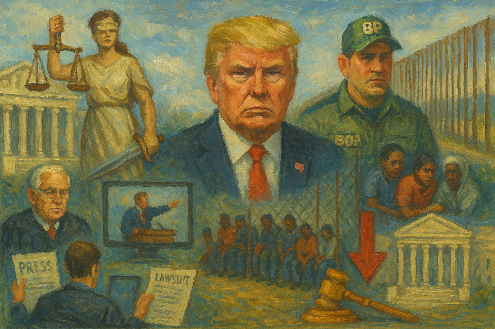

<!-- Generated by build_publish_week_v1 (appendix post) -->
<!-- Header image: image_wide_week28_appendix.png -->

# Week 28 Appendix: Confinement as Governance

*With no single shock, the administration deepened a regime where law, welfare, and information serve personalized power and stratified citizenship.*

This week shows an aggressive consolidation of executive and partisan power across multiple fronts, with courts, agencies, immigration enforcement, and trade policy all pulled deeper into a personalized, Trump‑centric project. Structurally, the heaviest pressure falls on judicial independence (Emil Bove’s confirmation despite whistleblower warnings; DOJ attacks on Judge Boasberg; politicized US attorney appointments), the rule of law in immigration and detention (Alien Enemies Act deportations, Alligator Alcatraz, Cecot flights defying court orders), and the stratification of citizenship by ancestry, race, and status (Vance’s redefinition of citizenship, DACA self‑deportation push, SNAP and Medicaid cuts, harsh detention of disabled migrants). Simultaneously, the administration weaponizes economic tools—tariffs, emergency powers, AI‑driven deregulation, and social program retrenchment—to reward allies, punish adversaries at home and abroad, and obscure accountability. Universities and media are squeezed through funding threats, politicized investigations, and licensing leverage, while state‑level moves in Texas and North Carolina entrench gerrymanders and voter suppression. There are pockets of resistance—federal courts blocking birthright and Planned Parenthood cuts, multistate lawsuits, investigative journalism correcting abuses—but the net effect is a marked entrenchment of authoritarian methods inside nominally legal and electoral frameworks.

Power and Authority

1. President Trump and the Department of Government Efficiency used an AI tool to generate a large-scale deregulation "delete list" (2025-07-26): The administration’s DOGE AI Deregulation Decision Tool aimed to eliminate up to half of federal rules with minimal public oversight, shifting vast regulatory power into opaque executive-controlled algorithms.

2. Secretary of Health and Human Services Robert F. Kennedy Jr. moved to remove all members of a key preventive health task force (2025-07-26): Replacing an entire federal preventive health advisory panel with ideologically aligned appointees concentrated control of health guidance in political hands, weakening expert-based checks on executive health policy.

3. President Trump signed a rescissions package cutting previously appropriated funds (2025-07-26): Using rescissions to claw back congressionally approved spending, including for education, expanded executive leverage over the power of the purse and tested statutory limits on impoundment.

4. Federal Emergency Management Agency launched a detention support grant program for temporary migrant facilities (2025-07-26): FEMA’s new $608 million grant program to build temporary migrant detention centers expanded federal capacity to confine noncitizens, deepening executive control over vulnerable populations.

5. President Trump publicly demanded prosecution of prominent Black public figures without evidence (2025-07-26): Calling for criminal charges against Kamala Harris, Beyoncé, Oprah Winfrey, and Al Sharpton absent evidence signaled willingness to wield prosecutorial power rhetorically against political and cultural opponents.

6. President Trump enacted massive Medicaid cuts through the One Big Beautiful Bill Act (2025-07-27): Cutting over $1 trillion from Medicaid and offering only limited rural offsets shifted health burdens onto low-income Americans and states, using federal spending power to reshape social rights.

7. White House budget chief Russell Vought announced exploration of pocket rescissions to withhold congressionally allocated funds (2025-07-27): Considering pocket rescissions to let appropriated funds expire would let the executive nullify spending laws without repeal, eroding Congress’s control over federal resources.

8. CIA Director John Ratcliffe refused to rule out treason indictments against former senior officials (2025-07-27): Floating possible treason charges against Brennan, Comey, and Hillary Clinton over alleged conspiracies against Trump blurred intelligence work with partisan retribution and threatened to criminalize prior oversight.

9. President Trump accepted a luxury jumbo jet from Qatar to serve as Air Force One (2025-07-28): Accepting a $400 million aircraft from Qatar as Air Force One, later funded through opaque budget transfers, raised serious emoluments and foreign influence concerns around core state assets.

10. President Trump issued an executive order enabling mass detention of homeless people (2025-07-28): The "Ending Crime and Disorder on America’s Streets" order empowered sweeping arrests and camp-style detention of homeless individuals, expanding coercive executive authority over a marginalized group.

11. Trump administration authorized federal employees to proselytize and pray publicly at work (2025-07-28): New guidance allowing federal workers to promote their faith on the job blurred church–state boundaries and risked embedding favored religious expression within government operations.

12. Trump administration froze over $100 million in federal research funding to Duke University over affirmative action (2025-07-30): Halting NIH research funds to Duke unless it abandoned race-conscious practices used federal purse strings to coerce university policy on diversity and hiring.

13. President Trump ordered construction of a 90,000-square-foot White House ballroom (2025-07-30): Authorizing a $200 million, donor-funded ballroom to replace the East Wing redirected substantial resources and symbolic space toward leader-centered spectacle at the seat of government.

14. President Trump issued an executive order imposing a 40% tariff on Brazilian imports and declaring a national emergency (2025-07-30): Using emergency powers to levy steep tariffs on Brazil in response to its internal politics and treatment of Bolsonaro showed economic coercion deployed through unilateral executive action.

15. President Trump suspended duty-free de minimis treatment for all countries (2025-07-30): Eliminating duty-free treatment for low-value imports via executive order centralized control over a large slice of trade policy in the presidency under a national security rationale.

16. President Trump raised tariffs on Canadian goods to 35% through executive order (2025-07-31): Increasing tariffs on Canadian imports and citing drugs and Palestine policy as justifications used emergency trade powers to punish a close ally over political disagreements.

17. President Trump further modified reciprocal tariff rates on multiple trading partners (2025-07-31): An order adjusting reciprocal tariff rates across countries entrenched the president’s use of emergency economic authorities to unilaterally reshape trade relationships.

18. Office of Personnel Management allowed federal employees to publicly pray and evangelize at work (2025-07-31): OPM’s memo institutionalizing public prayer and persuasion in federal workplaces risked privileging certain faiths and pressuring subordinates, altering norms of religious neutrality in government.

19. President Trump announced new global tariff base rates just before a self-imposed deadline (2025-08-01): Setting broad 10–15% tariff baselines by executive fiat, amid ongoing court challenges to his trade authority, underscored the presidency’s expanded unilateral role in economic governance.

20. Treasury Secretary Scott Bessent described new "Trump accounts" as a backdoor to privatize Social Security (2025-07-31): Framing new retirement accounts as a path to privatize Social Security signaled executive intent to shift core social insurance from public guarantees toward market-based instruments.

21. President Trump announced sweeping new tariffs on dozens of countries (2025-07-31): Rolling out tariffs from 10% to 41% on a wide range of countries in one move used trade shocks as a blunt geopolitical tool, increasing executive leverage over foreign and domestic actors.

Institutions and Governance

1. Federal courts maintained a nationwide block on Trump’s birthright citizenship ban (2025-07-26): By keeping Trump’s order curtailing birthright citizenship on hold, the judiciary upheld constitutional protections against unilateral redefinition of citizenship by the executive.

2. House Speaker Mike Johnson adjourned the House to avoid a vote on releasing Jeffrey Epstein files (2025-07-27): Shutting down the chamber to block a transparency vote on Epstein records used procedural control to limit disclosure in a high-profile accountability case.

3. House Oversight Committee Democrats moved to subpoena Steve Bannon for Epstein interview tapes (2025-07-27): Seeking Bannon’s unreleased Epstein interviews asserted congressional oversight over networks of elite misconduct and potential cover-ups.

4. Senator Dick Durbin demanded DOJ records and assurances regarding Ghislaine Maxwell meetings (2025-07-28): Durbin’s push for full DOJ transcripts and a no-pardon pledge in the Maxwell matter sought to reinforce transparency and limit preferential treatment in a politically sensitive case.

5. Freedom of the Press Foundation sued the Department of Justice for a memo approving Qatar’s jet gift to Trump (2025-07-28): Litigation to obtain DOJ’s emoluments memo on Trump’s Qatar jet challenged secrecy around legal justifications for accepting large foreign gifts.

6. Judge Indira Talwani ordered continuation of Medicaid reimbursements to Planned Parenthood (2025-07-28): Blocking a tax-bill provision that cut Medicaid payments to abortion providers preserved access to reproductive health services and checked legislative overreach.

7. U.S. Court of Appeals for the Federal Circuit heard challenges to Trump’s use of emergency powers to impose tariffs (2025-07-28): Arguments in VOS Selections v. Trump tested whether the president exceeded statutory authority under IEEPA, probing judicial limits on unilateral trade actions.

8. Department of Justice filed a misconduct complaint against Judge James Boasberg over public comments (2025-07-28): Targeting a federal judge for remarks about the administration risked chilling judicial speech and signaled executive willingness to discipline perceived critics on the bench.

9. Federal courts in New Jersey suspended criminal proceedings due to questions over acting U.S. attorney Alina Habba’s authority (2025-07-28): Halting cases while reviewing Habba’s appointment highlighted concerns that politicized prosecutorial selections could undermine the legitimacy of federal prosecutions.

10. Coalition of 21 states and Washington, DC sued USDA to block a directive demanding extensive SNAP applicant data (2025-07-28): States challenged federal demands for sensitive SNAP data, defending privacy and resisting expansion of centralized surveillance over low-income residents.

11. House Oversight Committee subpoenaed Ghislaine Maxwell to testify and later rejected her immunity demands (2025-07-29): Compelling Maxwell’s deposition while refusing clemency conditions asserted congressional prerogatives in investigating elite sex-trafficking networks without trading away accountability.

12. Senate Minority Leader Chuck Schumer and Democratic senators demanded DOJ turn over Epstein files and requested a counterintelligence assessment (2025-07-29): Invoking statutory powers to obtain Epstein records and seeking a threat assessment on their misuse pressed the executive for transparency in a politically fraught case.

13. Senate Judiciary Committee Democrats called for a Hatch Act investigation into Trump appointees’ redistricting work (2025-07-29): Seeking scrutiny of senior officials’ involvement in partisan mid-decade redistricting aimed to enforce civil service neutrality in election-related policymaking.

14. President Trump attacked the Senate Judiciary "blue slip" tradition and urged its removal (2025-07-29): Pressuring the Senate to abandon home-state vetoes over judicial nominees sought to weaken a long-standing check on centralized control of the federal bench.

15. Texas Attorney General Ken Paxton sued a New York county clerk for refusing to enforce a Texas abortion fine (2025-07-29): Texas’s lawsuit against a New York official over an out-of-state abortion provider tested the reach of one state’s laws into another’s jurisdiction and shield protections.

16. Coalition of Democratic attorneys general and governors sued to block Trump administration efforts to terminate Planned Parenthood funding (2025-07-29): States turned to the courts to defend reproductive health funding and free speech rights against federal attempts to defund specific providers.

17. Department of Justice asked courts to unseal Epstein and Maxwell grand jury transcripts and disclosed limited testimony (2025-07-29): Seeking publication of grand jury testimony while revealing only two law enforcement witnesses had appeared raised questions about both transparency and the thoroughness of prior proceedings.

18. U.S. Senate confirmed former Trump lawyer Emil Bove to a lifetime federal appeals court seat (2025-07-30): Confirming Bove despite whistleblower claims he urged ignoring court orders and misled Congress deepened concerns about partisan capture and lowered standards for judicial independence.

19. Democratic members of Congress sued ICE over new restrictions on detention facility visits (2025-07-30): Lawmakers challenged ICE’s requirement for advance notice of visits, arguing it unlawfully impeded congressional oversight of immigration detention conditions.

20. Senator Ron Wyden requested a DHS inspector general investigation into agent reassignments (2025-07-30): Wyden’s call for IG review of shifting agents from child exploitation to immigration enforcement sought to reassert watchdog scrutiny over politicized resource allocation.

21. Federal judiciary and judicial leadership reported escalating threats and intimidation against judges handling Trump-related cases (2025-08-01): Rising harassment of judges, including pranks invoking a murdered judge’s son and impeachment threats, highlighted mounting pressure on courts that could chill independent decision-making.

22. Federal courts and 16 Democratic-led states received a multistate lawsuit challenging an executive order targeting transgender youth healthcare (2025-08-01): States sued to block an order threatening to strip funds from hospitals providing gender-affirming care, using litigation to defend state health policy autonomy and minority rights.

23. Federal courts heard a challenge to Trump’s reciprocal tariff regime under emergency powers (2025-07-31): Reviewing whether IEEPA justified broad reciprocal tariffs put judicial scrutiny on the scope of delegated emergency economic authority.

Economic Structure

1. Trump administration announced release of over $5 billion in previously withheld education funding (2025-07-26): Restoring delayed school funds under political pressure showed how executive control over disbursement can be used to create uncertainty in core public services.

2. Trump administration impounded National Institutes of Health funding before later reversing course (2025-07-26): Temporarily blocking billions for external NIH research, then backing down, signaled willingness to use health research funding as a bargaining chip in broader political fights.

3. Congress and President Trump enacted historic Medicaid funding cuts paired with tax cuts and deportation funding (2025-07-26): Mandating the largest Medicaid reduction in history while expanding deportation resources reallocated federal resources away from health security toward enforcement priorities.

4. Trump administration implemented a new tariff regime on European, Japanese, British and other imports (2025-07-29): Imposing broad tariffs of 10–20% or more on major trading partners risked higher consumer prices and supply disruptions while centralizing trade leverage in the executive.

5. Trump administration cut more than half of federal funding for community gun violence prevention grants (2025-07-29): Terminating 69 of 145 violence intervention grants reduced federal support for local public safety programs, prioritizing other enforcement and fiscal goals over community-based prevention.

6. Securities and Exchange Commission approved a Trump Jr.-backed gun company for public trading (2025-07-28): Greenlighting a gun firm tied to the president’s son soon after the new chair attended another Trump Jr. event raised concerns about regulatory capture and favoritism in capital markets.

7. Treasury Department reallocated nearly $934 million from nuclear modernization to renovate Trump’s Air Force One (2025-07-29): Shifting almost a billion dollars from missile modernization to refit a Qatar-gifted jet as Air Force One prioritized presidential prestige over other defense investments, with limited transparency.

8. Interior Secretary Doug Burgum ended federal subsidies for wind and solar energy projects (2025-07-30): Eliminating support for renewables while maintaining fossil fuel advantages reshaped energy markets away from low-carbon sources, privileging incumbent industries.

9. President Trump imposed a 50% tariff on copper imports (2025-07-30): A steep copper tariff threatened higher costs for construction and electronics, using trade barriers to favor domestic producers at the expense of downstream consumers.

10. Federal Reserve and President Trump responded to rising inflation while Trump attacked Fed Chair Jerome Powell (2025-07-30): The Fed held rates amid tariff-driven inflation as Trump publicly blamed and politicized Powell, undermining confidence in independent monetary policy during economic strain.

11. President Trump criticized an unfavorable jobs report as rigged and fired the BLS commissioner (2025-07-31): Dismissing the head of the Bureau of Labor Statistics after weak employment data and alleging bias threatened the integrity of official economic statistics.

12. Trump administration announced major cuts and cost shifts in the SNAP food assistance program (2025-08-01): Raising state administrative burdens, tightening work rules, and restricting noncitizen eligibility for SNAP risked increasing hunger while offloading federal obligations onto states and poor households.

13. Treasury Secretary Scott Bessent promoted "Trump accounts" as a way to privatize Social Security (2025-07-31): Describing new accounts as a backdoor to privatize Social Security signaled a structural shift from collective retirement guarantees toward individualized market exposure.

14. Social Security Administration abandoned a plan to sharply limit phone service after public outcry (2025-08-01): Canceling a move that would have overwhelmed field offices preserved basic access to benefits information, showing how transparency can check service degradation.

15. Congress and President enacted the VA Home Loan Program Reform Act to improve veterans’ housing access (2025-07-30): Reforming VA home loans aimed to ease veterans’ path to homeownership, modestly strengthening an economic support for a key constituency.

16. Bangladeshi government and garment industry implemented post–Rana Plaza labor reforms improving wages and safety (2025-07-30): Raising minimum wages, auditing factories, and curbing subcontracting improved conditions and pay in Bangladesh’s export sector, illustrating how regulation can align growth with worker welfare.

17. Bangladesh’s garment sector drove substantial national economic growth and child health gains (2025-07-30): Research showing the garment boom boosted GDP and neonatal survival underscored how industrial employment can reshape economic and social outcomes in low-income democracies.

18. Anti-sweatshop activists and global brands secured safety accords that also led to factory closures and job losses in Bangladesh (2025-07-30): Post-disaster activism and brand agreements reduced factory numbers and employment, highlighting trade-offs between labor standards and job availability in export-led development.

19. Xi Jinping and the Chinese government cracked down on disfavored industries and appointed loyalists over technocrats (2025-07-28): China’s selective industrial crackdowns and loyalty-based appointments concentrated economic and political power, offering a comparative model of state-led control over markets.

20. U.S. Census Bureau advanced multiple data collection and pretesting initiatives affecting economic and education statistics (2025-07-30): New and renewed Census data programs on questionnaires, school finance, and digital feeds aimed to improve the quality of information underpinning fiscal and policy decisions.

21. Food and Drug Administration set extensive FY 2026 user fee rates and information collections for drugs, devices, and food safety (2025-07-29): FDA’s broad user-fee and data-collection framework shaped the cost and pace of bringing medical and food products to market, influencing industry structure and public health protections.

22. Environmental Protection Agency issued and reconsidered multiple environmental and chemical regulations and deadlines (2025-07-29): EPA actions on air quality designations, chemical SNURs, pesticide cancellations, and PCE rule reconsideration adjusted the regulatory burden on industry and the strength of environmental protections.

23. Federal Communications Commission advanced spectrum, antenna, and paperwork rules affecting communications markets (2025-07-29): FCC moves on wireless antenna collocation, satellite spectrum sharing, and information burdens shaped infrastructure deployment costs and competitive dynamics in telecom.

24. Transportation Security Administration sought revisions and extensions for pipeline security and screening service information collections (2025-08-01): TSA’s data requests for pipeline security and reimbursable screening programs affected compliance costs and oversight of critical infrastructure and private partners.

25. Environmental Protection Agency extended compliance deadlines for oil and gas emissions standards (2025-07-31): Giving oil and gas operators more time to meet emissions rules eased short-term industry burdens while delaying full implementation of pollution controls.

26. U.S. government maintained and adjusted Energy Star and environmental impact review information programs (2025-08-01): Continuing Energy Star labeling data collection and publishing environmental impact statements supported transparency in environmental performance and major project impacts.

27. Trump administration and foreign partners announced trade deals with Indonesia, Pakistan, Vietnam and others involving tariffs and energy purchases (2025-07-31): New agreements trading tariff relief for large U.S. energy and goods purchases reoriented partner economies toward U.S. exports while locking in elevated tariff baselines.

28. Trump administration announced a pilot to cover GLP-1 weight loss drugs under Medicare and Medicaid (2025-08-01): Extending coverage for expensive GLP-1 drugs through public programs could shift large new costs onto federal and state budgets while expanding access to obesity treatments.

29. Trump administration discussed large but disputed investment pledges from Japan and Europe (2025-08-01): Inflated claims about foreign investment commitments risked misleading the public about the real economic benefits of contentious trade negotiations.

Civil Rights and Dissent

1. Florida Highway Patrol and U.S. Border Patrol officers arrested and prosecuted a U.S. citizen who recorded a violent immigration stop (2025-07-26): Detaining and sentencing Kenny Laynez-Ambrosio after he filmed officers’ treatment of undocumented passengers highlighted risks to bystanders’ rights during aggressive immigration enforcement.

2. Trump administration expanded immigration arrests and moved to strip legal status from over one million immigrants (2025-07-29): Ending the CHNV parole program and targeting 3,000 arrests per day destabilized immigrant workers’ lives and labor markets, deepening a tiered system of rights based on status.

3. Trump administration urged DACA recipients to self-deport despite no rule change (2025-07-29): Pressuring DACA beneficiaries to leave the country without formal policy shifts weaponized uncertainty to erode protections for a legally recognized group.

4. Department of Justice requested detailed noncitizen voter data from California counties (2025-07-29): Seeking extensive personal information on noncitizens on voter rolls under a fraud pretext risked chilling participation and enabling targeted voter suppression.

5. Immigration officials at San Francisco International Airport detained a South Korean scientist with a green card without explanation or attorney access (2025-07-29): Holding a lawful permanent resident researcher incommunicado underscored due process vulnerabilities for immigrants even with established legal status.

6. North Carolina General Assembly rescheduled and then held a Judiciary I hearing on a voter suppression bill under constrained public access (2025-07-28): Moving the HB 958 hearing to a low-visibility slot and then proceeding despite protests limited public input on legislation seen as undermining free and fair elections.

7. North Carolina legislature overrode the governor’s vetoes on anti-immigrant, anti-LGBTQ, and deregulatory bills (2025-07-29): Enacting HB 318 and HB 805 over vetoes curtailed protections for immigrants and transgender people and loosened environmental rules, narrowing rights for targeted groups.

8. Texas Republicans released a congressional map projected to give the party five more seats (2025-07-30): A new Texas map consolidating Democratic voters and diluting minority communities’ influence exemplified partisan gerrymandering that weakens electoral competition and representation.

9. Governor Gavin Newsom floated a special election to alter California’s redistricting process in response to Texas (2025-08-01): Considering a voter-approved change to California’s independent commission to counter Texas’s gerrymander highlighted interstate escalation over control of House representation.

10. Popular Information and North Carolina courts exposed and then corrected the wrongful invalidation of 29 ballots in a state supreme court race (2025-08-01): Investigative reporting that led to restoration of discarded ballots and a different winner in a close race demonstrated how media scrutiny can repair discrete electoral injustices.

11. Missouri Republican lawmakers moved to overturn multiple voter-approved initiatives, prompting backlash (2025-07-29): Efforts to repeal measures on Medicaid expansion, marijuana, abortion, and animal welfare signaled legislative willingness to disregard direct democratic outcomes.

12. Trump administration invoked the Alien Enemies Act to deport Venezuelan migrants without hearings (2025-07-31): Using an 18th-century law to justify warrantless raids and deportations of Venezuelans as enemy aliens bypassed normal due process and expanded executive power over noncitizens.

13. Florida and federal authorities operated the Alligator Alcatraz detention camp under conditions alleged to deny due process and humane treatment (2025-07-30): Reports of detainees held without charges, barred from lawyers, and living in squalid conditions at Alligator Alcatraz illustrated a legal black hole for immigration detainees.

14. Stewart Detention Center in Georgia placed a double-amputee detainee in solitary confinement after he refused to enter a flooded area (2025-07-31): Punishing a disabled immigrant for protecting his prosthetics highlighted systemic neglect and punitive practices toward vulnerable detainees.

15. Cibola County Correctional Center staff and FBI investigators were implicated in drug smuggling and lethal overdoses among detainees (2025-08-01): An FBI probe into staff-facilitated drug trafficking and deaths at a mixed-use detention facility underscored how privatized incarceration can endanger detainees’ basic rights and safety.

16. Trump administration cut over $1 trillion from Medicaid and advanced SNAP restrictions affecting noncitizens and the poor (2025-07-27): Combined Medicaid and SNAP retrenchments targeted low-income and immigrant households, weakening social rights and deepening economic precarity for disfavored groups.

17. Trump administration pushed Congress to defund gender-affirming care through appropriations riders (2025-07-28): Seeking to bar federal funds for gender-affirming care in multiple appropriations bills used budget levers to restrict healthcare access for transgender people nationwide.

18. Vice President J.D. Vance advocated an exclusionary, ancestry-based definition of American citizenship (2025-07-28): Arguing that descendants of Civil War fighters have a stronger claim to America than others promoted a hierarchical vision of belonging at odds with civic equality.

19. Trump administration mandated antisemitism trainings at universities designed by pro-Israel groups as a funding condition (2025-07-30): Requiring one-sided antisemitism curricula that equate anti-Zionism with antisemitism as a prerequisite for federal funds risked suppressing certain political speech on campuses.

20. Oklahoma Schools Chief Ryan Walters announced a "MAGA Exam" for out-of-state teachers seeking certification (2025-07-31): Requiring teachers from liberal states to pass an ideologically framed exam tied certification to adherence to "America First" narratives, politicizing entry into the profession.

21. Pro-Palestinian protesters and New York law enforcement clashed at Senator Chuck Schumer’s office, leading to mass arrests including elected officials (2025-08-01): Arresting demonstrators and local officials protesting Gaza policy highlighted tensions between protest rights and policing in high-profile political spaces.

22. Trump administration withheld and then restored large sums of education and university funding over ideological disputes (2025-07-31): Using funding freezes and settlements with Columbia and Duke to force changes in hiring and diversity practices leveraged economic pressure to reshape academic environments.

23. Trump administration threatened to defund sanctuary cities and praised aggressive ICE tactics (2025-07-28): Legislation to strip funds and tax breaks from sanctuary jurisdictions sought to coerce localities into deeper cooperation with federal immigration enforcement.

24. Trump administration and FEMA expanded detention infrastructure and support for migrant confinement (2025-07-26): New detention grants and use of harsh facilities like Cecot and Alligator Alcatraz entrenched a carceral approach to migration that sidelines due process and humane treatment.

Information, Memory and Manipulation

1. President Trump called for revoking NBC and ABC broadcasting licenses and labeled them partisan arms (2025-07-26): Urging license revocations for major networks over perceived bias threatened regulatory retaliation against critical media and encouraged self-censorship.

2. President Trump made conflicting public claims about his relationship with Jeffrey Epstein and Virginia Giuffre (2025-07-30): Shifting explanations about when and why he broke with Epstein, including a new story about Giuffre, muddied the historical record around his ties to a convicted sex offender.

3. Axios leadership and corporate sponsors published highly favorable coverage of Trump’s second term aligned with conservative funders (2025-07-28): A glowing assessment of Trump’s presidency that downplayed harms and mirrored sponsor interests illustrated how financial ties can shape ostensibly neutral political reporting.

4. Department of Homeland Security posted manifest destiny imagery and repurposed artwork to promote nationalist themes (2025-07-28): Using the "American Progress" painting and an unauthorized religious image to celebrate heritage and homeland recast expansionist and exclusionary narratives as official identity.

5. Trump administration and DOJ pressured universities over DEI and antisemitism policies and opened investigations into academic institutions (2025-07-28): Probes of Duke, George Mason, and others, plus mandated antisemitism trainings, used legal scrutiny and funding threats to steer campus discourse and governance.

6. Federal Communications Commission approved a CBS–Skydance merger conditioned on avoiding civil rights programs and adding a political bias monitor (2025-07-31): Tying merger approval to content-related conditions risked entangling federal regulators in editorial decisions and chilling coverage of civil rights issues.

7. FCC Commissioner Anna Gomez warned that the administration was weaponizing broadcast licensing power (2025-07-29): An FCC commissioner’s public alarm about licensing being used to pressure outlets underscored institutional concern over creeping censorship via regulatory tools.

8. President Trump attacked media figures Jessica Tarlov and others over critical commentary (2025-07-29): Personal insults directed at journalists and commentators who advocated gun control or criticized policy contributed to a hostile environment for independent media voices.

9. FBI Records/Information Dissemination Section leadership ordered Trump’s name redacted from Epstein files and pressured a resisting official to retire (2025-07-31): Directing redactions to shield Trump in FOIA releases and sidelining an internal critic showed active curation of public records to protect the president.

10. Popular Information and Sinclair Broadcast Group exposed and then prompted the resignation of a national anchor over biased content (2025-08-01): Revelations that Sinclair pushed right-wing narratives as news led its lead anchor to quit, illustrating both the reach of coordinated propaganda and the role of watchdog journalism.

11. Trump administration manipulated economic narratives and data around trade deals and jobs (2025-08-01): Overstating foreign investment pledges, disputing CBO projections, and firing the BLS chief after unfavorable data collectively undermined trust in factual economic reporting.

12. Trump administration used AI and opaque classification to reshape regulation and spending with limited transparency (2025-07-27): Algorithmic deregulation and creative classification of Air Force One costs reduced public visibility into how rules and funds are being altered to serve executive priorities.

13. Trump administration and DOJ selectively pursued transparency in the Epstein and Maxwell cases (2025-07-30): Pushing to unseal some grand jury transcripts while withholding other Epstein files and redacting Trump’s name suggested a strategy of controlled disclosure to manage public perception.

14. Vice President J.D. Vance and DHS promoted narratives redefining citizenship and American history around heritage and conquest (2025-07-28): Speeches and imagery that valorized ancestral bloodlines and manifest destiny reframed national identity in exclusionary terms, shaping how future citizens understand belonging.

15. Popular Information used investigative reporting to alter government and state-level decisions (2025-08-01): Exposés on SSA phone cuts, North Carolina ballots, and Tennessee Speaker Sexton’s residency and per diem abuses showed how independent media can still force institutional corrections.

16. President Trump made unfounded claims about ending six wars in a meeting with the UK prime minister (2025-08-01): Boasting of having ended six wars without evidence inflated foreign policy achievements and contributed to a distorted public understanding of U.S. military engagement.

