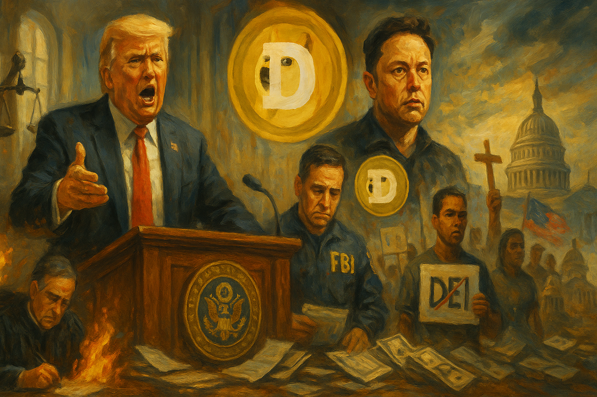

<!-- Generated by build_publish_week_v1 (appendix post) -->
<!-- Header image: image_wide_week3_appendix.png -->

# Week 3 Appendix: The Week the Government Doubled In Speed

*A private operative gained access to Treasury systems as courts, unions, and crowds scrambled to match an administration moving faster than oversight allows.*

This week (Feb 1-7, 2025) marks an extraordinarily dense burst of structural pressure across nearly every democratic-decay category, driven by the earliest days of the second Trump administration. The dominant story is a coordinated assault on the administrative state: mass firings of inspectors general, FBI officials, and Jan 6 prosecutors; Elon Musk's DOGE operation seizing Treasury payment systems and OPM/USAID databases without statutory authority; and an attempted unilateral impoundment of congressionally appropriated funds that courts blocked within days. Simultaneously the administration launched sweeping executive orders on birthright citizenship, transgender rights, tariffs against Canada/Mexico/China, ICC sanctions, and withdrawal from UN bodies—many immediately challenged in court, producing a pattern of court-executive confrontation. Civil service protections, press access, and independent oversight bodies were all targeted in tandem, while judicial and civil-society pushback (lawsuits, protests, the 50501 movement) provided the week's counterweight.

Power and Authority

1. Trump administration froze trillions of dollars in federal spending, disrupting Medicaid, childcare, and other programs (2025-02-01): The administration attempted to seize control of congressional spending power in an act legal experts called a clear violation of the Constitution, before rescinding the order amid court action and public backlash.

2. Trump fired 18 inspectors general without required congressional notice (2025-02-01) *[single source]*: Removing independent watchdogs across federal agencies without legal notice strips away built-in checks on waste, fraud, and abuse of executive power.

3. Trump issued executive order dismissing anti-corruption inspectors across federal agencies (2025-02-01): A further purge of oversight officials consolidates power in the executive branch and removes safeguards meant to catch government misconduct.

4. Trump fired members of the NLRB and EEOC before their terms expired (2025-02-01): Dismissing independent labor and civil-rights board members without cause threatens the impartiality of federal agencies meant to protect workers and citizens from discrimination.

5. Trump pardoned roughly 1,600 people convicted in the January 6 Capitol riot (2025-02-01): Mass pardons for those who attacked the Capitol undermine accountability for actions that directly threatened the peaceful transfer of power.

6. Trump administration moved to place USAID under State Department control and strip its independence (2025-02-01): Dismantling an independent aid agency's autonomy concentrates foreign-policy and funding decisions in the executive branch, reducing institutional checks on how aid dollars are used.

7. Elon Musk and DOGE team gained access to and effectively took control of Treasury payment systems handling trillions of dollars (2025-02-02): An unelected private citizen and his associates seized operational control of the federal payment pipeline that disburses Social Security, tax refunds, and other public funds, raising acute accountability concerns.

8. Trump administration ordered agencies to identify civil servants for stripped protections and demanded mass resignations of federal workers (2025-02-01): Threatening the job security of roughly 2 million federal employees to compel loyalty undermines the merit-based, nonpartisan civil service system.

9. Trump signed three executive orders imposing tariffs on Mexico, Canada, and China under emergency powers (2025-02-01): Using national-emergency authority to unilaterally impose sweeping tariffs bypasses normal trade procedures and expands executive control over international commerce.

10. Trump signed executive order withdrawing the US from the UN Human Rights Council and cutting funding to UNRWA and other international bodies (2025-02-04): Unilateral withdrawal from key international institutions reduces US engagement in global human-rights accountability and humanitarian coordination.

11. Trump signed executive order imposing sanctions on International Criminal Court officials (2025-02-06): Sanctioning an international court investigating alleged war crimes uses economic coercion to obstruct international justice mechanisms and protect allied officials from accountability.

12. Trump declared the US would 'take over' the Gaza Strip (2025-02-05): A proposal to seize control of foreign territory represents a dramatic and unilateral assertion of American power with significant implications for international law and regional stability.

13. Emil Bove (acting deputy attorney general) fired roughly two dozen DOJ prosecutors who worked on January 6 and Trump investigations, and demanded a list of FBI agents involved (2025-02-01): Purging prosecutors and identifying agents tied to investigations into the president threatens the independence of federal law enforcement and signals retaliation against accountability efforts.

14. Trump fired Chairman of the Joint Chiefs of Staff General Charles Q. Brown Jr. (2025-02-01): Removing the top uniformed military officer, with the defense secretary publicly questioning his qualifications based on race, raises concerns about politicization of military leadership.

15. Trump attempted to strike down birthright citizenship via executive order (2025-02-01): Seeking to unilaterally reinterpret the 14th Amendment's citizenship guarantee challenges a core constitutional protection through executive fiat rather than legislative or judicial process.

16. Trump signed executive order authorizing a maximum-pressure sanctions campaign against Iran (2025-02-04): Directing multiple federal agencies to escalate sanctions, prosecutions, and diplomatic isolation of Iran without congressional authorization expands unilateral executive control over foreign policy.

17. Trump removed security details protecting former officials Mike Pompeo and John Bolton despite ongoing assassination threats (2025-02-03): Withdrawing protection from former officials facing credible threats raises questions about the use of executive discretion to punish perceived critics.

18. Marco Rubio announced a deal with El Salvador to imprison deportees of any nationality, including US citizens, for a fee (2025-02-05): Outsourcing incarceration of Americans to a foreign prison raises serious constitutional concerns and expands executive reach beyond established legal norms.

19. Trump signed executive order halting US aid to South Africa and prioritizing resettlement of Afrikaner refugees (2025-02-07): Conditioning foreign aid on the administration's characterization of another nation's internal land and human-rights policy asserts sweeping executive control over foreign assistance and refugee policy.

20. White House issued memorandum directing agencies to align NGO funding decisions with administration priorities (2025-02-06): Conditioning federal funding to civil-society organizations on ideological alignment threatens the independence of nongovernmental watchdogs and service providers.

Institutions and Governance

1. Federal district judge Loren AliKhan issued a temporary restraining order blocking the administration's federal spending freeze (2025-02-01): A federal court quickly intervened to stop an executive attempt to seize control of congressionally appropriated funds, reaffirming judicial checks on unlawful impoundment.

2. Democratic state attorneys general filed coordinated lawsuits challenging Trump administration actions across multiple states (2025-02-01): Preparation and coordinated litigation by state officials represents federalism functioning as a check on executive overreach, resulting in over 170 court rulings pausing administration initiatives.

3. US District Judge John Coughenour issued injunctions blocking Trump's executive order ending birthright citizenship, calling it clearly unconstitutional (2025-02-05): A federal judge halted enforcement of an order attempting to override the 14th Amendment, reasserting judicial review over executive attempts to rewrite constitutional rights.

4. US District Judge Deborah Boardman issued a second temporary injunction against Trump's birthright citizenship executive order (2025-02-04): A second court ruling blocking the citizenship order shows sustained judicial resistance to an unprecedented reinterpretation of constitutional rights.

5. US District Judge Royce Lamberth blocked transfer of transgender women from federal women's prisons to men's facilities and halted denial of hormone therapy (2025-02-04): A federal judge found the administration's order discriminated against transgender individuals and violated constitutional protections, temporarily preserving prior housing and medical care.

6. Federal judge George O'Toole Jr. temporarily blocked deadline for the administration's federal employee buyout offer (2025-02-05): A court delay of the deadline for a contested mass-resignation program gave employees and unions more time to challenge its legality before it took effect.

7. Federal Judge Paul Engelmayer issued an emergency order restricting DOGE's access to Treasury payment systems (2025-02-07): A judge moved to halt private, unvetted access to the federal payment infrastructure, though administration allies publicly called for defying the ruling.

8. FBI agents (two anonymous groups) sued the Department of Justice to block collection of information on agents who worked January 6 cases (2025-02-03): Agents preemptively sought judicial protection against a data-collection effort they feared would be used for retaliatory firings, testing civil-service protections.

9. Federal employee unions sued the Trump administration over DOGE's unauthorized access to Treasury payment systems (2025-02-03): Unions argued that granting a private team access to sensitive government financial records without proper authority violated federal privacy law, prompting a court-ordered access restriction.

10. American Association of University Professors and other higher-education groups filed lawsuit against Trump administration's anti-diversity executive orders (2025-02-03): Academic organizations argued that orders eliminating diversity offices and threatening funding cuts violate the Constitution and exceed executive authority over higher education.

11. American Federation of Government Employees and American Foreign Service Association sued Trump, Rubio, and Bessent over the dismantling of USAID (2025-02-06): Government worker unions challenged the constitutionality of unilaterally gutting a congressionally established agency, arguing it exceeds executive authority.

12. Gwynne Wilcox sued Trump and the NLRB chair over her removal from the board (2025-02-05) *[single source]*: A fired labor board member argued her dismissal was an unlawful, politically motivated violation of statutory protections meant to insulate independent agencies from partisan control.

13. US Senate confirmed Pam Bondi as attorney general and Russell Vought as OMB director along party lines (2025-02-04): Confirming officials with records of loyalty to the president over independent institutions raises concerns about politicization of key oversight and budget positions.

14. Senate Democrats held an all-night filibuster protest against Russell Vought's confirmation to OMB (2025-02-05): An overnight Senate protest highlighted concerns that the nominee's budget proposals threatened funding for Medicare, Medicaid, and Social Security, though the confirmation proceeded.

15. Trump fired the Archivist of the United States following the National Archives' role in retrieving classified documents from Mar-a-Lago (2025-02-07): Removing the official responsible for federal recordkeeping raises transparency concerns following the archives' prior enforcement action against the president.

16. Ellen Weintraub refused to vacate her seat on the Federal Election Commission after being fired by Trump (2025-02-06): A commissioner's refusal to step down without following statutory removal procedures tests the independence of the agency responsible for overseeing campaign finance and election law.

17. Pam Bondi dismantled the DOJ's foreign bribery unit and Kleptocracy Initiative, and scaled back Foreign Agents Registration Act enforcement (2025-02-06) *[single source]*: Reducing enforcement capacity against foreign corruption and asset seizures weakens the government's ability to counter foreign influence and hold corrupt actors accountable.

18. Supreme Court considered reviving the nondelegation doctrine in a case challenging FCC authority (2025-02-06) *[single source]*: A potential ruling limiting agencies' ability to create regulations could shift significant regulatory power away from Congress and executive agencies toward the judiciary.

19. DOJ (Emil Bove) compelled the FBI to submit details on 5,000-6,000 agents who worked January 6 cases after a weeklong standoff (2025-02-07): Forcing the bureau to hand over personnel information despite internal objections signals continued pressure on law enforcement independence and raised fears of retaliation.

20. West Virginia State Senate passed bill expanding non-medical exemptions to school vaccine requirements (2025-02-01) *[single source]*: State-level rejection of federal vaccination guidance reduces immunization coverage protections and reflects growing fragmentation of public-health policy.

21. Florida House of Representatives passed bill to override Supreme Court obscenity standard for school book removals (2025-02-01): The bill would let books be removed from schools for alleged obscenity without regard to literary, artistic, or educational value, contradicting decades-old constitutional precedent.

22. Missouri county judge ordered resumption of abortion procedures under voter-approved Amendment 3 (2025-02-01) *[single source]*: A court enforced a citizen-passed constitutional amendment protecting abortion access, though the state continued blocking medication abortion through separate regulatory barriers.

23. North Carolina trial court rejected Jefferson Griffin's challenges to 60,000 ballots in a state Supreme Court race (2025-02-01): A trial court upheld the validity of an election result against post-election challenges targeting ballots on registration technicalities, though the ruling was later appealed.

24. DOJ sued the state of Illinois and city of Chicago over sanctuary immigration laws (2025-02-06): The federal government sought a court order nullifying state and local laws limiting cooperation with immigration enforcement, escalating federal-state conflict over immigration policy.

25. North Carolina superior court judge Wayland J. Sermons Jr. ruled that racial bias affected jury selection in a 2009 death-row sentencing (2025-02-06) *[single source]*: A judicial finding of racial bias in jury selection under the state's Racial Justice Act could affect future death-penalty cases involving discriminatory practices.

26. Oklahoma State Board of Education approved social studies standards requiring students to study debunked 2020 election fraud claims (2025-02-01): Mandating that discredited election conspiracy theories be presented for classroom debate undermines factual civic education about election integrity for thousands of students.

27. LaRose (Ohio Secretary of State) withdrew lawsuit challenging Biden's voter registration order after Trump rescinded it, then praised Trump's replacement order (2025-02-01) *[single source]*: Reversing a legal position based on partisan alignment rather than consistent constitutional principle illustrates selective application of federal-overreach arguments in election administration.

Economic Structure

1. US Army Corps of Engineers released billions of gallons of water from California dams on Trump's order during the rainy season (2025-02-01): Ordering water releases against expert water-management advice risks harming farmers who depend on stored water for summer irrigation, illustrating federal override of local resource planning.

2. Trump administration awarded a $1 billion, 15-year no-competitive-review contract to Geo Group to operate an ICE detention facility (2025-02-01) *[single source]*: A massive long-term contract to a private prison company to expand detention capacity, despite legal challenges and a state law barring such facilities, illustrates profit-driven expansion of immigration detention.

3. Scott Bessent (Treasury Secretary) paused all forthcoming Consumer Financial Protection Bureau regulations, including a rule limiting medical debt on credit reports (2025-02-04): Halting a consumer-protection rule intended to shield Americans from predatory medical debt practices threatens financial relief for millions ahead of its scheduled implementation.

4. SEC halted an investigation and prosecution of crypto entrepreneur Justin Sun for fraud shortly before he invested $75 million benefiting Trump financially (2025-02-01): Suspending enforcement action against a major financial backer of the president's business ventures raises questions about whether regulatory decisions are being influenced by personal financial ties.

5. SEC required staff attorneys to seek permission from politically appointed leadership before starting new investigations (2025-02-01) *[single source]*: Centralizing investigative approval under political appointees could slow or block enforcement actions against politically connected firms and individuals.

6. Paramount Global dismantled diversity hiring programs under pressure ahead of an FCC merger decision (2025-02-01): A media company rolling back diversity initiatives to win regulatory approval for a merger shows how administrative leverage can be used to compel ideological compliance from private business.

7. Canada, Mexico, and China announced retaliatory tariffs and a WTO complaint in response to US trade actions (2025-02-01): Major trading partners' retaliatory measures signal an escalating trade conflict with economic consequences for American consumers, farmers, and manufacturers.

8. US Postal Service briefly suspended incoming parcels from China and Hong Kong amid trade tensions (2025-02-04) *[single source]*: A temporary halt in international mail delivery tied to elimination of a duty-free exemption disrupted commerce and reflected the ripple effects of escalating tariff disputes.

9. Trump signed executive order directing creation of a US sovereign wealth fund (2025-02-03): Establishing a new financial vehicle for federal assets without prior legislative authorization raises questions about executive control over public wealth and potential use in politically connected transactions such as a TikTok purchase.

10. Health and Human Services Department released a report condemning private equity's role in declining healthcare quality, then removed it from the agency website (2025-02-06) *[single source]*: A report linking private equity ownership of nursing homes to an 11% rise in patient deaths was pulled from public view following an administration-wide purge of prior policy materials.

11. Jared Kushner raised $2 billion from Saudi Arabia's sovereign wealth fund for his private equity firm despite no formal administration role (2025-02-06): A presidential family member's continued foreign financial dealings while his father-in-law holds office raises unresolved conflict-of-interest concerns regarding US foreign policy influence.

12. USDA reported that avian flu affected 14.7 million egg-laying hens, driving up egg prices (2025-02-02) *[single source]*: A worsening agricultural disease outbreak is straining food supply and raising consumer costs, underscoring the economic stakes of public health and regulatory response capacity.

Civil Rights and Dissent

1. ICE arrested a Nicaraguan man with humanitarian parole status three days after a routine check-in (2025-02-01) *[single source]*: Detaining a person with approved legal status despite compliance with monitoring requirements shows unpredictable enforcement that undermines trust in stated immigration protections.

2. Trump administration deported over 100 asylum seekers, including children, to Panama without due process hearings (2025-02-01) *[single source]*: Sending shackled migrants to a third country without hearings because their home countries would not accept them violates due-process protections for vulnerable populations.

3. ICE and DOJ detained and criminally charged a Harvard Medical School scientist over a customs paperwork dispute involving research samples (2025-02-01) *[single source]*: Escalating a customs irregularity into smuggling charges carrying 20 years in prison against a researcher who feared persecution illustrates aggressive use of enforcement power against a foreign scientist.

4. Florida state colleges enrolled in the ICE 287(g) program, deputizing campus police as immigration enforcement agents (2025-02-01): Training campus police to detain and report students on immigration status threatens international students' safety and could chill campus speech and protest.

5. ICE detained a Costa Rican man who later died after being deported in a vegetative state (2025-02-01) *[single source]*: A detainee's death following alleged medical neglect during detention and deportation raises serious questions about ICE's duty of care and treatment of vulnerable detainees.

6. Trump signed executive order banning transgender athletes from competing in women's sports (2025-02-05): Directing federal agencies to cut funding from schools allowing transgender athletes to compete restricts transgender rights and threatens broad federal enforcement against noncompliant institutions.

7. US State Department ordered removal of gender pronouns from federal employees' email signatures (2025-02-01): Mandating removal of gender identity markers from official communications restricts personal expression and signals broader suppression of LGBTQ+ recognition in government workplaces.

8. Trump signed executive order purging transgender service members from the military and restricting gender-affirming care (2025-02-02): Removing transgender troops and limiting medical care, including for federal prisoners, represents a broad rollback of transgender rights across military and correctional systems.

9. Trump administration revoked protections for over 600,000 Venezuelans legally residing in the US (2025-02-02): Ending Temporary Protected Status for a large population exposes hundreds of thousands to potential deportation, undermining prior legal assurances of safety.

10. West Point disbanded 12 student-led cultural and identity clubs, including LGBTQ+ and women's engineering groups (2025-02-05): Ordering the immediate shutdown of student organizations at a federal military academy under DEI directives restricts campus association and expression for cadets.

11. North Carolina legislature enacted law criminalizing road-blocking and mask-wearing at protests (2025-02-03) *[single source]*: New criminal penalties for common protest tactics create additional legal risk for demonstrators and could deter participation in public dissent.

12. 50501 Movement and Tesla Takedown launched nationwide grassroots protest and boycott campaigns against administration policies and Elon Musk (2025-02-01): Decentralized protest and boycott movements emerged rapidly in response to perceived threats to democratic institutions, marking significant civil-society mobilization.

13. Protesters held a massive peaceful demonstration in Los Angeles against Trump's immigration policies (2025-02-03): A large peaceful protest against immigration enforcement policy reflects continued public exercise of First Amendment assembly rights amid heightened enforcement.

14. Democratic lawmakers and protesters rallied at the Treasury Department against Musk's access to federal payment systems (2025-02-05): Public and congressional protest against private control of sensitive government financial systems demonstrates active civic and political resistance to executive overreach.

15. Trump administration halted DOJ civil rights investigations and police reform agreements in Louisville and Minneapolis (2025-02-05): Ending federal police-reform efforts established after the killings of Breonna Taylor and George Floyd removes accountability mechanisms for documented civil-rights violations by police.

16. San Clemente City Council partnered with US Border Patrol to install beach surveillance cameras despite state sanctuary law (2025-02-07) *[single source]*: A city without its own police force worked around state sanctuary restrictions to directly assist federal immigration surveillance, illustrating gaps in state protections.

17. Trump supporters confronted and intimidated immigrant-rights protesters in Lake Worth Beach, Florida (2025-02-07) *[single source]*: Counter-protest confrontations and related vandalism against an immigrant advocacy center reflect a chilling climate for civic activism amid intensified immigration enforcement.

18. Al Green (Representative) filed articles of impeachment against Trump over the Gaza takeover proposal (2025-02-05): A formal impeachment effort in response to a controversial foreign-policy proposal represents an assertion of legislative check on executive action, though unlikely to advance.

Information, Memory and Manipulation

1. Pentagon implemented a media rotation program replacing NYT, NPR, NBC, and Politico with New York Post, Breitbart, OANN, and HuffPost (2025-02-01): Swapping out established news outlets for more favorable ones in the Pentagon press corps restructures which journalists have routine access to cover the military.

2. Trump administration denied Reuters access to a cabinet meeting and ejected a HuffPost reporter from the White House press pool (2025-02-01) *[single source]*: Restricting specific news organizations' access to official government proceedings limits the public's ability to receive independent coverage of executive branch activities.

3. Trump administration removed the Associated Press from the press pool after it declined to adopt the term 'Gulf of America' (2025-02-01) *[single source]*: Retaliating against a major wire service for editorial word choice punishes independent journalism and was later found by a court to violate First Amendment protections.

4. Karoline Leavitt (White House Press Secretary) announced the administration would no longer recognize the White House Correspondents' Association's role in managing press pool access (2025-02-01): Displacing the independent journalist association that traditionally manages press pool access lets the government directly choose which reporters cover the president.

5. Purdue Exponent removed names and images of pro-Palestinian student protesters from its website over safety fears (2025-02-01) *[single source]*: A student newspaper scrubbing identifying information about campus activists reflects a chilling effect on independent reporting driven by fear of federal enforcement targeting protesters.

6. Department of Defense Education Activity banned instruction on race and gender, ordered book removals, and canceled cultural observances in 161 military schools (2025-02-01): A sweeping censorship regime affecting 67,000 military-family students eliminated content about women, minorities, and LGBTQ people from curricula and school libraries.

7. Department of Education threatened to cut federal funding from schools teaching about systemic racism (2025-02-01): Using funding threats to suppress curriculum on racial history restricts educational speech and was later challenged in court as a free-speech violation.

8. Washington Post owner Jeff Bezos killed a planned Harris endorsement editorial and later restricted opinion coverage to only certain viewpoints (2025-02-01): An owner's intervention to block editorial content and later narrow permitted opinion topics signals erosion of editorial independence at a major national newspaper.

9. ICE updated timestamps on years-old press releases to make them appear as current enforcement actions in search results (2025-02-06) *[single source]*: Manipulating publication dates to create a false impression of ongoing mass deportations spreads misinformation and fuels fear within immigrant communities.

10. Trump administration ordered removal of public health information on contraception, HIV, gender-affirming care, and social vulnerability from CDC and other agency websites (2025-02-04) *[single source]*: Stripping public health resources from federal websites in response to executive orders limits access to information relied on by healthcare providers and researchers.

11. Trump administration directed Department of Education to end investigations into school book bans, calling them a 'hoax' (2025-02-07) *[single source]*: Halting federal scrutiny of a nationwide surge in book bans reduces oversight of censorship practices affecting access to educational materials.

12. OSHA ordered destruction of 18 workplace safety publications as part of a DEI-related purge (2025-02-07) *[single source]*: Removing longstanding safety guidance documents, most unrelated to diversity programs but flagged for unrelated keyword matches, reduces public access to critical worker-safety information.

13. Trump called for CBS to cancel '60 Minutes' and lose its broadcast license over an edited interview (2025-02-06): Threatening a major broadcaster's operating license over editorial decisions represents an attempt to use regulatory leverage to punish critical journalism.

14. ABC News, Paramount, and Meta paid settlements totaling tens of millions of dollars to Trump over defamation and censorship claims (2025-02-02): Major media and technology companies making large payments to settle disputes with the president may discourage critical coverage and signal capitulation to political pressure on editorial independence.

15. Brendan Carr (FCC Chair) ordered investigation into NPR and PBS sponsorship practices (2025-02-02): A federal regulator's scrutiny of public broadcasters perceived as having liberal bias raises concerns about using agency authority to pressure independent media outlets.

16. Trump took control of the Kennedy Center, fired its board chair and president, and banned drag shows (2025-02-01): Seizing direct control of a major federal cultural institution to dictate its artistic programming represents government censorship of specific forms of artistic expression.

17. Trump administration ceased publication of federal data on immigration, workforce, climate, and other topics across multiple agencies (2025-02-01): Halting routine federal data collection and reporting undermines evidence-based policymaking and the public's ability to independently assess government performance and social conditions.

18. Oklahoma Superintendent Ryan Walters withheld curriculum changes from state board members until the day before a vote requiring students to study 2020 election fraud claims (2025-02-01) *[single source]*: Rushing approval of curriculum embedding debunked election-fraud narratives while denying board members adequate time for review undermines transparent decision-making in public education.

