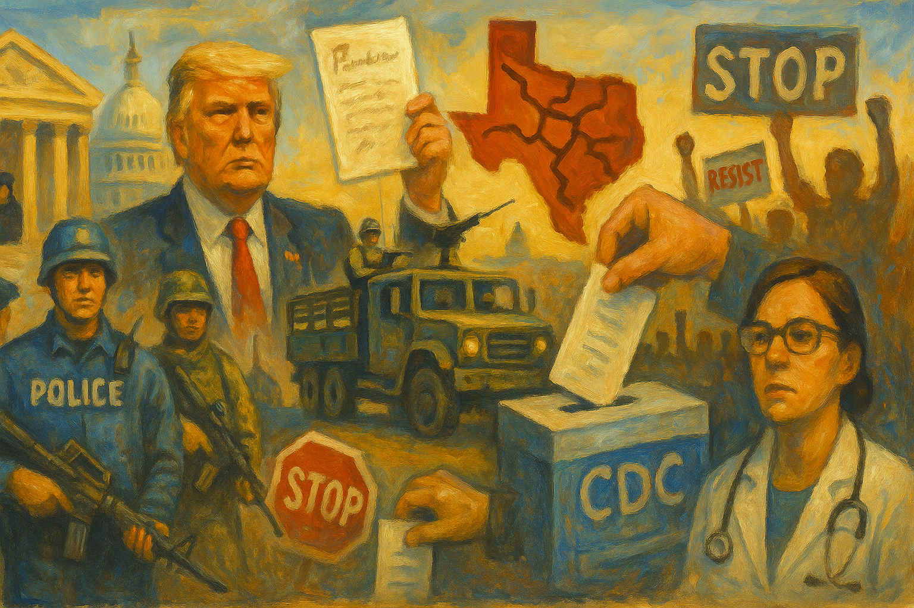

<!-- Generated by build_publish_week_v1 (appendix post) -->
<!-- Header image: image_wide_week31_appendix.png -->

# Week 31 Appendix: The Week the Levers Multiplied

*Federal troops in Washington, a gerrymander pushed through by force, and a purge of unwelcome facts moved together across a single week.*

This was a high-pressure week for democratic structure, defined by three overlapping patterns: executive centralization, election-system manipulation, and the politicization of law enforcement and information. The most consequential cluster involved Washington, D.C., where Trump’s federal takeover of local policing, expanded troop deployments, arming of National Guard personnel, and use of federal prosecutors signaled a major assertion of executive power over civilian governance. A second major front was electoral: Trump’s push to end mail-in voting by executive order, Texas’s aggressive mid-decade gerrymander and coercive treatment of Democratic legislators, and new voter-registration restrictions all increased pressure on fair competition and voter access. A third theme was institutional capture through truth suppression and loyalty enforcement, including the firing of the BLS commissioner, nomination of loyalists, politicized DOJ actions, and immigration policies driven by ideological vetting and retaliatory detention. Courts provided some countervailing resistance, especially in immigration and church-state cases, but the week’s dominant structural force was unmistakably authoritarian: using state power to discipline opponents, narrow participation, and subordinate neutral institutions to political command.

Power and Authority

1. President Trump pardoned January 6 defendants and allies moved against related prosecutors and agents (2025-08-16) *[single source]*: The pardons weakened accountability for an attack on the transfer of power and signaled executive protection for political allies tied to anti-democratic violence.

2. President Trump ordered the removal of homeless people from Washington, D.C., with fines or jail for refusal (2025-08-16): The order used punitive state power against a vulnerable population and expanded executive control over public space through coercive enforcement.

3. President Trump and allied governors deployed National Guard troops and federal agents to Washington, D.C., and moved to take control of local policing (2025-08-16): The deployment concentrated federal coercive power in a local jurisdiction and blurred lines between civilian policing, military force, and executive command.

4. President Trump announced plans for an executive order to end mail-in voting and target voting machines (2025-08-17): The plan asserted executive power over election rules that are largely state-run and threatened voting access through unsupported fraud claims.

5. Florida Governor Ron DeSantis announced construction of a new immigration jail in northern Florida (2025-08-18): The expansion increased detention capacity and deepened the use of state power to confine migrants through a growing enforcement infrastructure.

6. The Trump administration implemented broad policy changes affecting international students and student visas (2025-08-18) *[single source]*: The changes expanded executive leverage over entry, status, and campus life for foreign students, shaping speech, study, and mobility through immigration power.

7. Homeland Security Secretary Kristi Noem announced plans to paint the southern border wall black (2025-08-19): The move reinforced a punitive border-control posture and used executive authority to intensify symbolic and physical exclusion at the border.

8. Director of National Intelligence Tulsi Gabbard revoked security clearances for 37 current and former intelligence officials (2025-08-19): The revocations used executive national-security powers against officials accused of disloyalty, raising concerns about retaliation and chilling internal dissent.

9. The White House launched an official TikTok account while the administration continued to pause enforcement of the app ban law (2025-08-20): The move showed selective executive use of enforcement discretion in a way that affected digital governance, legal consistency, and political communication.

10. Homeland Security Secretary Kristi Noem pushed ICE to buy and operate its own fleet of deportation planes (2025-08-20): The proposal would expand the executive branch's independent deportation capacity and make mass removal operations easier to scale.

11. The Trump administration clawed back more than $12 million in California public health grants over alleged promotion of gender ideology (2025-08-21) *[single source]*: The funding withdrawal used federal executive power to punish a state program on ideological grounds, linking public-health support to political conformity.

12. President Trump signed an executive order creating the America by Design initiative for federal services (2025-08-21): The order reorganized federal service design through new White House-directed structures, expanding executive coordination over how the public interacts with government.

13. The State Department and USCIS expanded continuous vetting, social media screening, and mass visa revocations for visa holders and applicants (2025-08-21) *[single source]*: The policy widened executive surveillance and discretionary exclusion over millions of noncitizens, tying legal status to ongoing ideological and behavioral review.

14. President Trump signed a directive authorizing military action against Latin American drug cartels (2025-08-22): The directive extended executive war-making and security powers into cross-border operations with limited visible legislative constraint.

15. FEMA required disaster victims to have an email address to apply for federal aid (2025-08-22): The rule narrowed practical access to emergency relief and shifted executive administration of aid in ways that could exclude vulnerable residents.

16. The Trump administration canceled union contracts for hundreds of thousands of federal workers (2025-08-22) *[single source]*: The cancellation reduced organized worker power inside the federal government and strengthened executive control over the civil service.

17. President Trump and Defense Secretary Pete Hegseth armed National Guard troops in Washington, D.C., and signaled broader military-style policing plans (2025-08-21) *[single source]*: Arming Guard patrols escalated the federal security posture in the capital and further normalized military involvement in civilian law enforcement.

Institutions and Governance

1. Texas House Democrats left the state to block a redistricting vote by denying a quorum (2025-08-16): The walkout used legislative procedure to resist a map fight that could reshape representation and partisan control in Congress.

2. The Florida Supreme Court upheld a redistricting plan that reduced Black voting influence in northern Florida (2025-08-16) *[single source]*: The ruling weakened constitutional limits on gerrymandering and altered how courts protect fair representation in state elections.

3. A Texas judge restrained Beto O’Rourke’s group from sending funds to Democrats outside Texas (2025-08-17): The order constrained political fundraising tied to a legislative standoff and affected the opposition's ability to organize and compete.

4. Governor Gavin Newsom filed a FOIA request about federal agents appearing at his Los Angeles news conference (2025-08-18) *[single source]*: The request sought oversight of possible federal intimidation in a political setting and tested accountability for law-enforcement deployment.

5. Senator Adam Schiff requested an FCC investigation into whether merger approval was tied to media commitments (2025-08-18) *[single source]*: The request pressed for oversight of possible political influence over media regulation and agency independence.

6. The Justice Department impaneled a grand jury over claims of an Obama-era treason conspiracy (2025-08-18): The move raised concerns that prosecutorial tools were being used to pursue politically charged claims with weak factual grounding.

7. The Supreme Court suspended four attorneys and ordered them to show cause why they should not be disbarred (2025-08-18): The disciplinary actions showed the Court using its supervisory role to enforce professional accountability within the legal system.

8. Democratic-led states and Washington, D.C. sued the Justice Department over immigration-related conditions on crime-victim funding (2025-08-18) *[single source]*: The lawsuit challenged federal use of grant conditions to force state policy compliance and tested limits on executive leverage over states.

9. Texas Democratic lawmakers returned to the legislature after their redistricting walkout ended (2025-08-18): Their return reopened formal legislative and legal channels in a fight over representation, quorum power, and partisan mapmaking.

10. President Trump nominated E. J. Antoni to lead the Bureau of Labor Statistics (2025-08-18): The nomination put a politically aligned figure forward to lead a key statistical agency, raising concerns about institutional independence.

11. Missouri Attorney General Andrew Bailey was named co-deputy director of the FBI (2025-08-18): The appointment placed a partisan state official in senior federal law-enforcement leadership and heightened concerns about politicized agency control.

12. Democratic lawmakers demanded that DHS explain the use of masks and unmarked vehicles in immigration raids (2025-08-19) *[single source]*: The demand sought legislative oversight of opaque enforcement tactics that can shield abuse from public accountability.

13. Republican legislators in California sued to block Governor Newsom's fast-tracked redistricting plan (2025-08-19): The lawsuit challenged procedural shortcuts in a map fight that could alter congressional representation and weaken independent redistricting norms.

14. The Supreme Court denied a stay of execution and certiorari in the Bates cases (2025-08-19): The denials left a death sentence in place and reflected the Court's gatekeeping role over final review in capital cases.

15. The Election Assistance Commission solicited comments on a petition to require documentary proof of citizenship for federal voter registration (2025-08-21): The petition opened a federal rulemaking path that could add new barriers to voter registration and reshape access to the ballot.

16. The Texas Legislature convened a special session on voting and abortion (2025-08-20) *[single source]*: The session put election rules and bodily autonomy on the legislative agenda, with potential effects on participation and rights.

17. Texas House Republicans and Speaker Dustin Burrows imposed surveillance, escort, and attendance controls on Democratic members during the redistricting fight (2025-08-20): The controls used legislative and police mechanisms to discipline opposition lawmakers and shape the conditions of representation.

18. The Texas House approved a mid-decade congressional map favoring Republicans (2025-08-20): The vote advanced a map that could shift congressional power through partisan line-drawing rather than voter preference alone.

19. North Carolina legislators introduced a bill criminalizing unauthorized camping and sleeping (2025-08-20) *[single source]*: The bill proposed using state law to punish homelessness, expanding legislative control over vulnerable people in public space.

20. North Carolina legislators introduced a bill requiring full Social Security numbers for voter registration (2025-08-20): The bill proposed a stricter registration requirement that could deter or block eligible voters from entering the electorate.

21. A federal judge blocked a Texas law requiring Ten Commandments displays in public school classrooms (2025-08-20) *[single source]*: The ruling checked state power on church-state grounds and reinforced judicial review over laws affecting public education and religious neutrality.

22. A federal judge ruled that Alina Habba was not lawfully serving as acting U.S. attorney for New Jersey (2025-08-20): The ruling enforced appointment rules and tested executive efforts to keep a preferred prosecutor in office without Senate confirmation.

23. Governor Gavin Newsom and the California Legislature signed and advanced mid-decade redistricting measures for a special election (2025-08-21): The measures used state institutions to counter another state's gerrymander, escalating mapmaking as a tool of partisan power.

24. The Department of Justice and the House Oversight Committee began releasing Epstein-related materials and testimony in batches (2025-08-21): The piecemeal release tested the balance between congressional oversight, executive control of records, and public transparency in a high-profile case.

25. The Supreme Court granted in part and denied in part the federal government's stay request in NIH v. American Public Health Association (2025-08-21) *[single source]*: The order partly preserved executive control over grant funding while leaving some lower-court limits in place, showing contested judicial oversight of agency action.

Economic Structure

1. The Trump administration cut funding for gun violence prevention programs (2025-08-16) *[single source]*: The cuts reduced support for public-safety programs in vulnerable communities and shifted federal spending away from preventive public goods.

2. The Trump administration imposed a 50% tariff on Brazilian coffee (2025-08-16) *[single source]*: The tariff raised costs for businesses and consumers and showed executive trade policy reshaping domestic prices and market conditions.

3. Washington, D.C., restaurants reported a sharp drop in diners after the federal police takeover announcement (2025-08-17): The decline showed how coercive political actions can quickly damage local commerce and economic confidence in a targeted city.

4. The EPA moved to rescind the 2009 endangerment finding on greenhouse gases (2025-08-18): The move weakened the regulatory basis for climate policy and shifted economic advantage toward fossil-fuel interests over public protections.

5. Health Secretary Robert F. Kennedy Jr. ended 22 federal mRNA vaccine projects worth $500 million (2025-08-18) *[single source]*: The cancellations redirected major public research funding away from vaccine development and weakened long-term public-health capacity.

6. Federal pandemic relief funding for homeless students expired in California (2025-08-18) *[single source]*: The funding lapse reduced school support for homeless students and exposed how budget choices can narrow access to basic educational stability.

7. Congress enacted the Maintaining American Superiority by Improving Export Control Transparency Act (2025-08-19): The law adjusted export-control governance in ways that affect industrial policy, trade oversight, and state management of strategic markets.

8. The CDC submitted an information collection request for the National Outbreak Reporting System (2025-08-19): The request maintained federal public-health data infrastructure that supports outbreak tracking and coordinated response.

9. The EPA published notices on new chemical submissions, pesticide registrations, and pesticide use applications (2025-08-19): The notices advanced routine regulatory review over chemicals and pesticides, shaping how public safeguards interact with industrial production.

10. The EPA approved replacement waste panels at the Waste Isolation Pilot Plant (2025-08-19): The approval enabled continued radioactive waste disposal under federal standards, affecting long-term environmental governance and public risk management.

11. The FCC adopted new caller ID authentication rules under STIR/SHAKEN (2025-08-19): The rules strengthened telecom accountability and consumer protection by tightening standards for call authentication.

12. The FCC issued a notice on proposed radio station community-of-license changes (2025-08-19): The notice affected local media market structure and how federal regulators manage community access to broadcast service.

13. The FDA announced a public workshop on its CMC development and readiness pilot program (2025-08-19): The workshop supported regulatory streamlining in drug development, affecting how public agencies shape market entry for medicines.

14. The FDA determined that RIFADIN capsules were not withdrawn for safety or effectiveness reasons (2025-08-19): The determination preserved a path for generic competition and affected drug availability through regulatory market access rules.

15. The FDA released draft guidances on oncology survival assessment and radiopharmaceutical dosage optimization (2025-08-19): The guidances shaped evidence standards for cancer drug development and the regulatory terms of future treatment markets.

16. The General Services Administration kept federal per diem reimbursement rates unchanged for fiscal year 2026 (2025-08-19): The decision set travel reimbursement policy for federal operations and affected how agencies budget routine public work.

17. The Trump administration repealed Biden-era green energy incentives and the Treasury Department rewrote renewable energy credit standards (2025-08-19): The changes reduced support for clean-energy investment and shifted federal economic policy toward fossil-fuel-favored market outcomes.

18. The U.S. government pursued converting Chips Act funding for Intel into an equity stake (2025-08-19): The move showed a more direct state role in industrial ownership and strategic support for domestic semiconductor production.

19. The Congressional Budget Office reported that the budget reconciliation bill would trigger major Medicare and Medicaid cuts (2025-08-19): The report showed how fiscal policy choices could reduce core social insurance and shift economic risk onto older and poorer residents.

20. A national report showed electricity prices rising faster than overall inflation (2025-08-19) *[single source]*: The increase highlighted how energy policy and market structure can intensify household cost burdens and economic inequality.

21. USCIS issued a new policy for more rigorous and holistic citizenship evaluations (2025-08-19) *[single source]*: The policy added subjective standards to naturalization decisions, affecting access to citizenship through administrative gatekeeping.

22. The Census Bureau sought OMB approval for the Household Trends and Outlook Pulse Survey (2025-08-20): The survey request supported federal data collection used for planning and resource decisions that shape public policy and representation.

23. The EPA extended the postponement of parts of the trichloroethylene regulation (2025-08-20): The delay slowed enforcement of a toxic chemical rule and showed litigation and agency discretion affecting public-health protections.

24. The FCC removed obsolete broadcast regulations (2025-08-20): The rulemaking reduced regulatory burdens on broadcasters and updated the framework governing communications markets.

25. ICE sought to spend more than $2.4 million on SUVs and custom vehicle wraps without open bidding (2025-08-20) *[single source]*: The proposed purchase raised accountability concerns about procurement, branding, and the use of public funds in enforcement operations.

26. The Education Department proposed limiting Public Service Loan Forgiveness based on employers' alleged conduct or values (2025-08-20) *[single source]*: The proposed rule would tie debt relief to ideological judgments about employers, changing access to a major public benefit.

27. President Trump called for Federal Reserve Governor Lisa Cook to resign and later threatened to fire her (2025-08-20): The pressure campaign threatened central bank independence by using political allegations to try to reshape monetary governance.

28. The CDC announced a convening on accelerated hepatitis C diagnosis and treatment (2025-08-20): The meeting supported public-health planning and federal coordination around faster testing and treatment access.

29. The CDC, EPA, FCC, FDA, Census Bureau, DEA, and OSHA issued a large set of notices on imports, environmental review, air quality, communications, drug and device regulation, and testing-lab recognition (2025-08-21): The notices reflected routine but consequential federal rulemaking that shapes markets, public safeguards, and access to regulated goods and services.

30. President Trump signed a tax bill that changed federal student loan borrowing and repayment rules (2025-08-21) *[single source]*: The law narrowed higher-education financing options and shifted more cost and risk onto students and borrowers.

31. The CDC, EPA, FCC, FDA, and OSHA issued another set of notices on import embargo rescissions, environmental statements, communications paperwork, animal drugs, tobacco rules, and lab recognition (2025-08-22): The actions continued routine federal economic governance across trade, health, communications, and safety regulation, affecting how markets and public protections operate.

Civil Rights and Dissent

1. The State Department halted visitor and medical visas for children and other people from Gaza (2025-08-16): The halt restricted humanitarian access and used immigration power in ways that affected bodily security and equal treatment.

2. The Trump administration threatened to arrest leaders of Democratic cities over immigration enforcement cooperation (2025-08-17) *[single source]*: The threats used federal enforcement power against local officials and challenged local autonomy in ways that could chill dissenting governance choices.

3. D.C. residents protested the federal military presence in the city (2025-08-17) *[single source]*: The protests showed public resistance to federal coercive force in local civic life and asserted the right to contest militarized governance.

4. A federal judge heard an ACLU lawsuit over abuses at the Alligator Alcatraz detention center (2025-08-18) *[single source]*: The case tested whether detained migrants were being denied due process and basic humane treatment under federal and state authority.

5. A federal judge issued and later expanded orders limiting construction and operation at the Alligator Alcatraz detention center (2025-08-18): The orders checked detention expansion and addressed alleged rights harms to migrants held in a harsh and legally contested facility.

6. Families in Monterey County reported fear from ICE raids that was expected to reduce school attendance (2025-08-18): The fear showed how immigration enforcement can suppress access to school, health care, and ordinary civic participation for immigrant families.

7. Texas Democrats and Representative Nicole Collier challenged police monitoring, confinement, and detention tactics during the redistricting fight (2025-08-19): The dispute showed state power being used to constrain elected dissent and raised civil-liberties concerns inside a legislative setting.

8. The Education Department rescinded guidance supporting English learners in schools (2025-08-20): The rescission weakened federal support for language access in education and reduced protections for students who rely on those services.

9. The city of Grants Pass settled a lawsuit by agreeing to provide camping spaces and services for unhoused people (2025-08-20): The settlement protected disabled and unhoused residents from exclusionary enforcement and affirmed minimum accommodations under disability law.

10. A federal appeals court allowed the Trump administration to move forward temporarily with ending TPS for immigrants from Nicaragua, Honduras, and Nepal (2025-08-20) *[single source]*: The ruling put tens of thousands of migrants at risk of losing lawful protection and increased insecurity around residence and work rights.

11. ICE detained Los Angeles teenager Benjamin Marcelo Guerrero-Cruz after stopping him in public (2025-08-20): The detention highlighted aggressive immigration enforcement against young people and raised concerns about due process and treatment in custody.

12. More than 750 current and former federal health workers accused Robert F. Kennedy Jr. of fueling harassment and violence against health staff (2025-08-20): The letter linked official rhetoric to threats against public workers and showed how misinformation can chill professional service and public trust.

13. Rev. William Barber and other activists held Moral Monday protests in Raleigh against a congressional bill funding Trump's agenda (2025-08-20) *[single source]*: The protest reflected organized civic opposition to federal policy and the continued use of public assembly to contest state power.

14. The ACLU and journalist Mario Guevara filed petitions and lawsuits challenging his continued ICE detention after he covered protests (2025-08-21) *[single source]*: The filings argued that immigration detention was being used to punish reporting and suppress protected newsgathering and protest coverage.

15. The U.S. military compiled a list of Los Angeles hotels to avoid after anti-ICE protests targeted agent lodging (2025-08-21) *[single source]*: The response showed protest activity affecting federal operations and highlighted friction between immigration enforcement and local dissent.

16. Kilmar Ábrego García was released from criminal custody after a court order while awaiting trial (2025-08-22) *[single source]*: The release marked a judicial correction after wrongful deportation and reinforced due process protections in an immigration-linked case.

Information, Memory and Manipulation

1. Trump administration officials left sensitive summit documents on a public printer and then downplayed the breach (2025-08-16): The mishandling and misleading response undermined trust in official truthfulness and the state's stewardship of sensitive public records.

2. President Trump fired the Bureau of Labor Statistics commissioner after accusing her of issuing a rigged report (2025-08-18) *[single source]*: The firing threatened the independence of official economic data and signaled political punishment for unwelcome facts.

3. Newsmax agreed to pay Dominion Voting Systems to settle a defamation lawsuit over false election claims (2025-08-18): The settlement imposed consequences for election misinformation that had damaged public trust in vote counting and democratic legitimacy.

4. The Justice Department and U.S. attorney's office in Washington opened investigations into alleged manipulation of D.C. crime data (2025-08-18): The probes put official public-safety information under political pressure and raised concerns about using law enforcement to shape narratives.

5. President Trump and the White House attacked Smithsonian exhibits and criticized the institution's focus on slavery and race (2025-08-19): The attacks sought to pressure a public memory institution to change how national history and identity are presented.

6. Health Secretary Robert F. Kennedy Jr. promoted beef tallow as healthier than seed oils and accused the American Academy of Pediatrics of a pay-to-play scheme (2025-08-19) *[single source]*: The statements used official standing to cast doubt on established health guidance and distort the public information environment around medicine.

7. Winnie Greco gave a reporter cash in a chip bag after a campaign event (2025-08-20) *[single source]*: The incident raised concerns about improper attempts to influence press behavior and the integrity of campaign-media relations.

8. The State Department fired its top press officer after a dispute over language in a media response on Palestinian relocation (2025-08-20) *[single source]*: The firing suggested political control over official messaging and narrowed space for internal dissent in public communications.

9. The Department of Justice released redacted transcripts of Ghislaine Maxwell interviews (2025-08-22): The release shaped public access to politically sensitive records through selective disclosure controlled by the executive branch.

