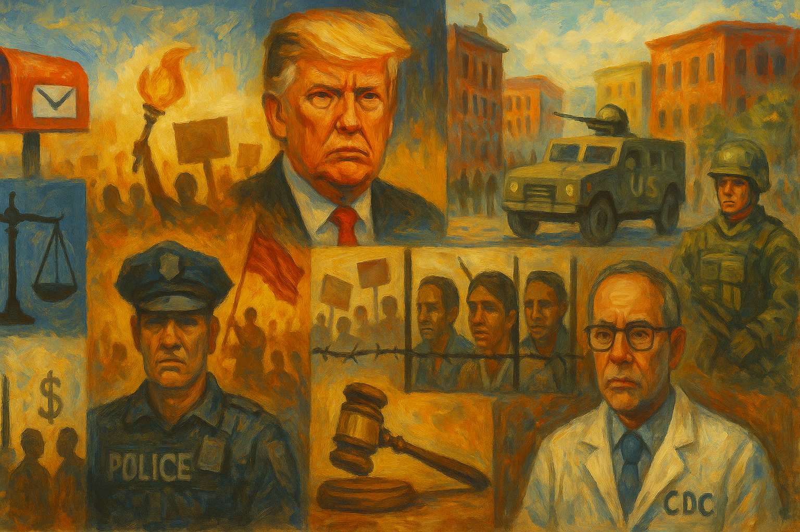

<!-- Generated by build_publish_week_v1 (appendix post) -->
<!-- Header image: image_wide_week32_appendix.png -->

# Week 32 Appendix: The Ordinary Machinery of Emergency Rule

*Washington's federal takeover became a template this week, as coercive tools spread quietly across cities, agencies, courts, and labor markets alike.*

This was a high-pressure week defined by executive overreach across multiple domains at once: elections, law enforcement, civil service, public health, labor, and domestic security. The strongest pattern was the use of presidential and administrative power to bypass or intimidate normal checks—drafting an order to eliminate mail voting, criminalizing protected protest conduct, escalating federal control over Washington, D.C., threatening troop deployments to Chicago and other cities, and targeting political opponents through investigations and personnel removals. A second major theme was politicization of state capacity: the firing of CDC leadership, appointment of a non-expert acting CDC head, retaliation against FEMA dissenters, and attempts to remove an independent Federal Reserve governor all point to loyalty tests replacing institutional autonomy. Elections were also under direct structural pressure through Texas redistricting, Missouri’s planned remap, and threats against California’s redistricting. Courts provided some meaningful resistance—blocking deportations, dismissing the Maryland judges suit, protecting sanctuary cities, and ordering map redraws—but the week’s net force still ran strongly toward entrenching executive-centered, retaliatory governance.

Power and Authority

1. The Trump administration ordered a halt to the Revolution Wind offshore project (2025-08-23) *[single source]*: The halt showed direct executive intervention in a major energy project, using federal power to stop a near-complete public-facing infrastructure effort.

2. Director of National Intelligence Tulsi Gabbard announced a 40% cut to her office (2025-08-23) *[single source]*: The cuts reduced federal capacity to track foreign influence operations, weakening state defenses against outside interference in democratic politics.

3. President Trump demanded that Colorado release Tina Peters and threatened harsh measures (2025-08-23): The demand pressed a state to undo a criminal sentence for an election ally, testing limits on executive interference with judicial outcomes.

4. President Trump announced that lawyers were drafting an order to eliminate mail-in voting (2025-08-24): The proposal targeted a widely used voting method through executive action, raising direct concerns about ballot access and federal control over election rules.

5. President Trump threatened to remove Federal Reserve Governor Lisa Cook and later announced her removal (2025-08-27): The move challenged the independence of a key economic institution by using executive power against an official who disputed the president's authority.

6. President Trump criticized the Senate blue-slip practice for judicial nominations (2025-08-24): The attack on a Senate check over nominations signaled pressure to weaken legislative restraints on presidential appointment power.

7. President Trump signed orders to end cashless bail and threatened funding consequences for noncompliant jurisdictions (2025-08-25): The orders used federal leverage to push local criminal justice policy, expanding presidential influence over state and city law enforcement choices.

8. President Trump signed an order directing prosecutions tied to flag burning (2025-08-25): The order sought to use executive power against a form of protest long protected as speech, testing limits on dissent and constitutional restraint.

9. President Trump declared a crime emergency in Washington, D.C., and issued added federal policing measures (2025-08-25): The declaration expanded direct federal control over local policing in the capital and normalized emergency-style rule over city governance.

10. President Trump and Pentagon officials planned or threatened National Guard and military deployments to Chicago and Baltimore (2025-08-26): The threats and planning extended presidential use of military force in domestic politics, pressuring cities without local consent.

11. Secretary of Defense Pete Hegseth announced that National Guard troops in Washington, D.C., would carry weapons (2025-08-23): Arming Guard troops in the capital increased the coercive posture of the federal presence and raised the risk of force in civilian governance.

12. President Trump sought to extend the National Guard deployment in Washington, D.C., beyond the normal limit (2025-08-23): The effort signaled a push to prolong extraordinary federal control in the capital beyond ordinary legal boundaries.

13. The Trump administration removed the de minimis tariff exemption for small packages (2025-08-29) *[single source]*: The change used executive trade power to reshape consumer imports and small-business supply chains without legislative action.

14. The White House threatened to cut sex education funds unless states removed references to transgender people (2025-08-27): The threat used federal funding power to force changes in state curricula, linking executive control to limits on recognition of a minority group.

15. The White House and HHS leadership removed CDC Director Susan Monarez (2025-08-27): The firing showed direct political intervention in a Senate-confirmed public health post, weakening agency independence and expert-led governance.

16. Robert F. Kennedy Jr. announced new Covid vaccine restrictions (2025-08-28): The unclear restrictions altered vaccine access through executive health authority and risked disrupting public trust in national guidance.

17. Transportation Secretary Sean Duffy announced a federal takeover of Union Station in Washington, D.C. (2025-08-27): The takeover expanded federal control over a major civic site in the capital, reinforcing the administration's broader centralization of authority in D.C.

18. President Trump issued an order excluding more federal units from labor-management relations rules (2025-08-28): The order narrowed collective bargaining rights inside federal agencies, increasing executive control over parts of the civil service.

19. President Trump issued an order favoring classical styles for federal buildings (2025-08-28): The order used executive authority to shape civic symbolism and the visual language of government space from the top down.

20. President Trump revoked the extended Secret Service detail for former Vice President Kamala Harris (2025-08-29): The directive used presidential control over security arrangements to alter protections for a former national officeholder and political rival.

Institutions and Governance

1. The Department of Justice submitted a limited set of Epstein documents to the House Oversight Committee (2025-08-23): The partial response frustrated a congressional subpoena and weakened legislative oversight over a high-profile federal matter.

2. A federal judge blocked the White House from defunding 34 sanctuary municipalities (2025-08-23): The ruling checked executive attempts to coerce local governments through funding threats and reinforced constitutional limits on federal power.

3. The Department of Justice opened investigations into James Comey and John Brennan (2025-08-23): The investigations targeted former senior officials tied to prior scrutiny of Trump, raising concerns about politicized use of justice institutions.

4. The Department of Justice transferred Ghislaine Maxwell to a minimum-security prison (2025-08-23): The transfer raised questions about equal treatment and public confidence in how the justice system handles powerful or notorious offenders.

5. Governor Gavin Newsom's office filed a freedom of information request about federal agents at the Japanese American National Museum (2025-08-23) *[single source]*: The request sought records on possible federal overreach, using transparency tools to test accountability for executive action.

6. The House Oversight Committee subpoenaed documents from Jeffrey Epstein's estate (2025-08-25): The subpoena showed Congress using formal oversight powers to seek records tied to a politically sensitive federal investigation.

7. Representative Andy Biggs introduced a bill to extend the federal takeover of Washington, D.C., police (2025-08-25): The bill aimed to turn a temporary emergency intervention into a longer default structure, shifting power away from local self-government.

8. A federal judge halted the deportation of Kilmar Abrego Garcia (2025-08-25): The order enforced due process limits on immigration power and showed courts acting as a check on executive detention and removal.

9. A federal court accepted El Mayo Zambada's guilty plea to racketeering charges (2025-08-25) *[single source]*: The plea marked a major criminal case moving through ordinary court process, reinforcing institutional handling of transnational organized crime.

10. The Department of Justice filed a court document alleging corruption by a Smartmatic executive (2025-08-25): The filing raised accountability questions around election-related contracting and the integrity of public procurement tied to voting systems.

11. A U.S. district judge ruled that Alina Habba was not lawfully serving as U.S. attorney for New Jersey (2025-08-25): The ruling enforced appointment rules and limited executive efforts to hold prosecutorial office without proper legal footing.

12. A Utah judge invalidated the state's congressional maps and ordered them redrawn (2025-08-25) *[single source]*: The ruling enforced voter-approved redistricting rules and checked partisan mapmaking through the courts.

13. The Trump administration announced plans to sue California over its mid-decade redistricting effort (2025-08-25): The planned suit showed federal institutions being used to contest a state's electoral map strategy before any election was held.

14. The FCC announced a public meeting of the Consumer Protection and Accessibility Advisory Committee (2025-08-26): The notice preserved a formal venue for public input on communications access and consumer protection policy.

15. A North Carolina court issued a ruling in a voter disenfranchisement case (2025-08-26) *[single source]*: The ruling directly affected how election rules could burden targeted voters, making court oversight central to ballot access.

16. A federal judge dismissed the Trump administration's lawsuit against Maryland's federal judges (2025-08-26): The dismissal defended judicial independence and rejected an executive attempt to sue judges over their case-management order.

17. The NAACP and allied lawyers sued Texas over its new congressional maps (2025-08-26): The suit used the courts to challenge alleged racial vote dilution and test the legality of a major redistricting plan.

18. Governor J.B. Pritzker said Illinois was prepared to sue over a federal troop deployment to Chicago (2025-08-26): The statement signaled a coming judicial check on federal intervention in state affairs and local policing.

19. The National Archives announced a FOIA Advisory Committee meeting (2025-08-26): The meeting maintained a formal process for improving public access to government records and transparency practice.

20. The Supreme Court denied a stay of execution and certiorari in Windom v. Florida (2025-08-27): The order left a death sentence in place and showed the Court's gatekeeping role over final review in capital cases.

21. Congress left Washington, D.C., under a spending freeze that created a budget shortfall (2025-08-28): The freeze constrained a locally funded city through federal budget mechanics, exposing D.C.'s limited self-governing power.

22. The EPA announced a proposed consent decree to resolve a Clean Air Act lawsuit (2025-08-28): The decree showed courts and agencies using settlement mechanisms to force overdue regulatory action and public accountability.

23. The FDA terminated the Arthritis Advisory Committee (2025-08-29): The termination reduced one standing channel for outside expert input into federal drug oversight and advisory process.

Economic Structure

1. President Trump announced that the government had taken a 10% stake in Intel (2025-08-23): The move blurred the line between public power and private corporate control, raising questions about favoritism and state-directed ownership.

2. The Pentagon blocked Ukraine from using U.S.-supplied long-range missiles inside Russia (2025-08-23): The restriction used control over military aid to shape another country's war choices, tying U.S. executive power to strategic dependence.

3. The EPA approved Florida's emissions control plan for incineration units (2025-08-25): The approval made a state pollution plan federally enforceable, showing routine regulatory power over industrial emissions and public goods.

4. The EPA proposed renewing information collection for methylene chloride regulation (2025-08-25): The proposal sustained federal oversight of a hazardous chemical regime that affects worker safety and industrial compliance.

5. The FDA announced a public meeting on hiring and retention in its drug review program (2025-08-25): The meeting addressed staffing capacity in a core regulator, linking administrative strength to timely public health oversight.

6. President Trump announced the cancellation of solar and wind projects tied to prior federal policy (2025-08-25) *[single source]*: The cancellations redirected federal economic priorities and affected jobs, energy costs, and the distribution of public investment.

7. The EPA allowed temporary use of incinerators during disaster recovery without full normal requirements (2025-08-26): The rule eased environmental constraints in emergencies, showing how regulatory burdens can be shifted during crisis response.

8. The EPA finalized a rule renewing eligibility for certain hydrofluorocarbon allowances (2025-08-26): The rule allocated climate-related production rights through federal regulation, shaping industrial winners and compliance costs.

9. The FCC corrected a rule on telecommunications certification bodies (2025-08-26): The correction clarified compliance rules meant to protect communications infrastructure from prohibited influence and weak oversight gaps.

10. The FCC issued a final rule to speed wireline broadband deployment (2025-08-26): The rule changed infrastructure procedures that affect internet access, utility bargaining, and the pace of a key public service.

11. The FCC removed obsolete regulations from the Code of Federal Regulations (2025-08-26): The action aligned federal rules with court decisions and kept the regulatory code tied to enforceable law.

12. The FCC submitted an information collection request to OMB for review (2025-08-26): The request reflected routine federal control over paperwork burdens and compliance design for regulated entities.

13. The FDA issued a correction to the regulatory review period for CAMZYOS (2025-08-26): The correction affected patent timing and market exclusivity, showing how administrative determinations shape pharmaceutical competition.

14. The FDA determined that certain Heparin Sodium products were not withdrawn for safety or effectiveness reasons (2025-08-26): The determination preserved a path for generic approvals, affecting competition and drug pricing through regulatory judgment.

15. The FDA determined regulatory review periods for multiple drug and biologic patent extension requests (2025-08-26): The determinations shaped how long companies could keep exclusive rights, affecting medicine markets through administrative patent timing.

16. The FDA submitted a GRAS information collection request for OMB review (2025-08-26): The request maintained federal review processes around food safety claims and industry reporting burdens.

17. President Trump threatened tariffs on countries with digital services taxes (2025-08-26) *[single source]*: The threat used trade power to defend U.S. technology firms abroad and tied foreign tax policy to coercive tariff leverage.

18. The Census Bureau submitted a Certification of Identity information collection request to OMB (2025-08-27): The request governed access to personnel records, linking administrative process to privacy and record control.

19. The Census Bureau submitted the National Sample Survey of Registered Nurses for OMB review (2025-08-27): The survey supported workforce data needed for health policy and labor planning, showing the state's role in economic measurement.

20. The EPA corrected underground injection control regulations (2025-08-27): The correction maintained the accuracy of environmental rules that govern industrial disposal and public risk.

21. The EPA finalized decisions on 175 small refinery exemption petitions (2025-08-27): The decisions redistributed compliance burdens under renewable fuel rules and showed how agencies can ease obligations for incumbent industries.

22. The EPA received an application for an experimental mosquito-control permit (2025-08-27): The application put federal regulators at the center of a large-scale biotechnology test with environmental and public health stakes.

23. The FCC issued a final rule to expedite satellite and earth station applications (2025-08-27): The rule reduced licensing friction in a strategic industry, shaping market access through administrative design.

24. The FDA revoked the emergency use authorization for Covid-19 convalescent plasma (2025-08-27): The revocation updated emergency regulatory status as licensed supply replaced temporary authorization, affecting treatment access rules.

25. Federal procurement agencies adjusted acquisition-related thresholds for inflation in the Federal Acquisition Regulation (2025-08-27): The changes reset purchasing rules across government contracting, affecting procurement access and administrative burdens.

26. The Trump administration cut funding for public broadcasting (2025-08-28) *[single source]*: The funding cut weakened a public information service that many rural communities rely on for emergency alerts and civic access.

27. The EPA approved air quality plans for the Mojave Desert, South Dakota, and Texas (2025-08-28): The approvals enforced state compliance with federal air standards and shaped how environmental public goods are managed.

28. The EPA denied a petition against TVA's Shawnee plant permit (2025-08-28): The denial left a major fossil fuel plant permit in place, showing agency discretion over environmental accountability.

29. The EPA announced a proposed consent decree over Louisville area ozone redesignation (2025-08-28): The decree set deadlines for overdue air-quality action, using legal settlement to move stalled regulation.

30. The EPA received NASA's emergency exemption request to use ortho-phthalaldehyde on the International Space Station (2025-08-28): The request showed federal regulators balancing emergency operational needs against normal chemical approval rules.

31. The EPA sought comment on renewing information collection for economics-project focus groups (2025-08-28): The renewal supported how the agency gathers evidence for policy design, affecting the quality of regulatory decision-making.

32. The EPA submitted an information collection request on minimum-risk pesticide labeling (2025-08-28): The request shaped how lightly regulated pesticide products are labeled and monitored, affecting consumer protection and compliance.

33. The FCC sought comments on an information collection tied to registration numbers and call signs (2025-08-28): The notice reflected routine federal control over telecom compliance systems that structure market participation.

34. The FDA announced a workshop on patient experience data in drug development (2025-08-28): The workshop shaped how public input may enter future regulatory decisions on medicines and approvals.

35. The FDA announced year four of its CMC Development and Readiness Pilot Program (2025-08-28): The program used regulatory flexibility to speed product development, affecting which firms gain faster access to approval pathways.

36. The FDA issued a priority review voucher for a rare pediatric disease product (2025-08-28): The voucher granted a valuable regulatory asset that can shift incentives and market advantage in drug development.

37. The General Services Administration proposed revisions to Federal Audit Clearinghouse reporting (2025-08-28): The proposal changed how audit findings and fraud disclosures are structured, affecting oversight of federal spending.

38. The General Services Administration submitted information collection requests for the Art-in-Architecture program and customer experience surveys (2025-08-28): The requests shaped how federal agencies gather data and administer public-facing programs, affecting accountability and service design.

39. The Trump administration proposed ending federal wage and overtime protections for childcare and home care workers (2025-08-29) *[single source]*: The proposal would weaken labor standards for millions of low-paid care workers, shifting bargaining power toward employers.

40. The Trump administration rescinded a minimum wage requirement for disabled workers (2025-08-29) *[single source]*: The rescission reduced wage protection for a vulnerable workforce and widened executive influence over labor standards.

41. The Trump administration attempted to rescind collective bargaining rights from federal workers (2025-08-29) *[single source]*: The move weakened organized labor inside government and reduced a key check on managerial and political control of the workforce.

42. The Trump administration cut the minimum wage requirement for federal contractors (2025-08-29) *[single source]*: The cut lowered labor standards in federally funded work and shifted public contracting benefits away from workers.

43. The EPA published a notice of availability for environmental impact statements (2025-08-29): The notice kept public review channels open for major projects, linking environmental governance to procedural transparency.

44. The FCC amended its unlawful text message rule to comply with a court decision (2025-08-29): The amendment reset consumer-protection rules in response to judicial review, showing the interaction of courts and regulators in market governance.

45. The FDA submitted a medical device registration information collection request to OMB (2025-08-29): The request supported the federal tracking system for medical devices, affecting recall capacity and regulatory compliance.

46. The FDA withdrew approval of RELYVRIO after failed trial results (2025-08-29): The withdrawal showed the agency reversing market access when evidence no longer supported a drug's approval.

47. The CDC announced a meeting of the Advisory Committee on Immunization Practices (2025-08-29): The meeting preserved a formal process for vaccine recommendations that shape coverage rules and national health access.

Civil Rights and Dissent

1. Deputy Attorney General Todd Blanche ordered the arrest of Newark Mayor Ras Baraka (2025-08-23) *[single source]*: The arrest of a local elected official, later followed by dismissal of the case, raised concerns about federal power being used against political figures.

2. Attorney General Pam Bondi opened criminal investigations into Adam Schiff, Letitia James, and Lisa Cook (2025-08-23): The investigations targeted prominent critics and rivals, raising concerns that law enforcement was being used to burden opposition figures.

3. FBI agents searched John Bolton's home and office (2025-08-23): The raid on a prominent Trump critic suggested an aggressive use of federal search power with chilling effects on dissent and opposition.

4. The Trump administration opened a new immigrant detention site at Fort Bliss (2025-08-23) *[single source]*: The large detention expansion increased the state's capacity to confine migrants and shaped bodily security for a vulnerable population.

5. Lawyers for Kilmar Abrego Garcia said the Department of Justice tried to coerce a guilty plea with deportation threats (2025-08-23) *[single source]*: The allegation suggested immigration status was used as leverage against due process, heightening rights concerns in federal prosecution.

6. A new generation of Democratic candidates challenged long-serving incumbents in primary races (2025-08-23) *[single source]*: The challenges reflected active internal electoral contestation and showed that party representation remained open to organized dissent.

7. Representatives Ro Khanna and Thomas Massie announced a press conference for Epstein survivors (2025-08-23): The event created a public platform for victims to speak and press for accountability in a case tied to elite impunity concerns.

8. States and the Pentagon sent or planned to send troops to Washington, D.C. (2025-08-23): The troop presence in the capital deepened the use of military force in civilian space and raised concerns about intimidation of public life.

9. Graham Platner announced his candidacy for the U.S. Senate in Maine (2025-08-24): The candidacy added a new electoral challenger and reflected continued access to formal democratic competition.

10. President Trump threatened an investigation into Chris Christie (2025-08-24): The threat suggested federal investigative power could be aimed at a political critic, chilling open opposition.

11. Governor Gavin Newsom publicly criticized Trump's militarization of cities (2025-08-25) *[single source]*: The criticism showed elected officials using public speech to resist federal overreach and defend state autonomy.

12. Governor J.B. Pritzker rejected Trump's threats to deploy the National Guard in Illinois (2025-08-25): The response defended state authority and publicly contested federal intervention in local public safety matters.

13. Governor Wes Moore responded publicly to Trump's comments about Baltimore (2025-08-25): The response showed state-level political pushback against federal threats tied to military force and local governance.

14. Representative Nancy Mace spread false information during a school shooter hoax and later deleted the post (2025-08-25) *[single source]*: A public official's false claim risked public panic and showed how misinformation can distort civic trust and safety.

15. FEMA employees warned of disaster mismanagement and then faced leave or suspension (2025-08-27): The retaliation risked chilling internal dissent by public servants who tried to alert Congress and the public to agency failure.

16. Governor J.B. Pritzker warned against militarization of Chicago and called for peaceful protest (2025-08-26): The statement defended protest rights and framed civic resistance as a lawful response to federal overreach.

17. A federal court ordered the closure of the Alligator Alcatraz immigration detention facility (2025-08-27): The order addressed alleged rights abuses in detention and limited the state's ability to hold migrants in harsh conditions.

18. The Fulton County Commission faced daily fines for refusing to appoint two Republicans to the election board (2025-08-27): The contempt fight showed how election administration disputes can affect representation and public trust in local oversight bodies.

19. A Washington, D.C., grand jury declined to indict a protester accused of throwing a sandwich at a federal agent (2025-08-27): The decision limited criminal escalation from a protest incident and showed restraint in a tense federalized civic environment.

20. The U.S. Election Assistance Commission announced a public meeting on voting system guidelines (2025-08-27): The meeting preserved a public process for election system standards that affect voter confidence and access.

21. Voters in Georgia and Iowa produced notable special election results (2025-08-27) *[single source]*: The results showed continued electoral competition and the capacity for shifts in representation through ordinary voting.

22. Federal immigration authorities arrested two firefighters during a wildfire response in Washington state (2025-08-28) *[single source]*: The arrests showed immigration enforcement interrupting emergency work and raised concerns about rights, fear, and public safety tradeoffs.

23. ICE transferred an 18-year-old detainee without notifying his family (2025-08-28): The transfer highlighted weak notice protections for detainees and limited family oversight of immigration custody decisions.

24. The FBI investigated the Minneapolis school shooting as domestic terrorism and a hate crime (2025-08-28): The investigation treated targeted mass violence as a democratic security issue tied to hate and public protection.

25. Four senior CDC officials resigned in protest after Susan Monarez was removed (2025-08-28): The resignations were a form of institutional dissent against political interference in public health governance.

26. The Trump administration proposed banning abortions through the VA except when the mother's life was endangered (2025-08-29) *[single source]*: The proposal would narrow reproductive healthcare access for veterans, directly affecting bodily autonomy and equal treatment.

27. Wake County Indivisible organized a municipal election meet-and-greet (2025-08-29) *[single source]*: The event supported local voter engagement and direct contact between residents and candidates in a municipal election.

28. The Legislative Response Team planned a die-in protest in Raleigh over a federal bill (2025-08-29) *[single source]*: The planned action showed organized public dissent using symbolic protest to contest national policy choices.

29. Organizers in Washington, D.C. scheduled a march against federal troop deployment in the city (2025-08-29): The planned march asserted protest rights against militarized federal control of local civic space.

Information, Memory and Manipulation

1. President Trump called for the FCC to revoke ABC and NBC broadcast licenses (2025-08-24): The demand threatened critical media outlets with state regulatory punishment, putting pressure on press freedom.

2. President Trump claimed he had the highest poll numbers ever despite reports showing lower approval (2025-08-25) *[single source]*: The false claim sought to shape public perception through misinformation rather than verifiable political data.

3. The CDC proposed a Data Management Plan template for public comment (2025-08-26): The proposal supported more consistent public data handling and could improve transparency in federally funded research.

4. A whistleblower reported that a DOGE official copied Social Security data to an unsecured cloud server (2025-08-28): The report raised major accountability and privacy concerns over state handling of sensitive records for hundreds of millions of people.

5. Indivisible released a statement criticizing the militarization of American cities (2025-08-29) *[single source]*: The statement contested the federal narrative around troop deployments and sought to shape public understanding of local autonomy and race.

6. The Pentagon announced that it would restore a portrait of Robert E. Lee at West Point (2025-08-29): The restoration used state control over official memory to reinsert a Confederate symbol into a federal military institution.

7. The FCC sought comments on an information collection about accessibility for blind and visually impaired users (2025-08-28): The notice addressed access to information technology and preserved a public process around communications inclusion.

