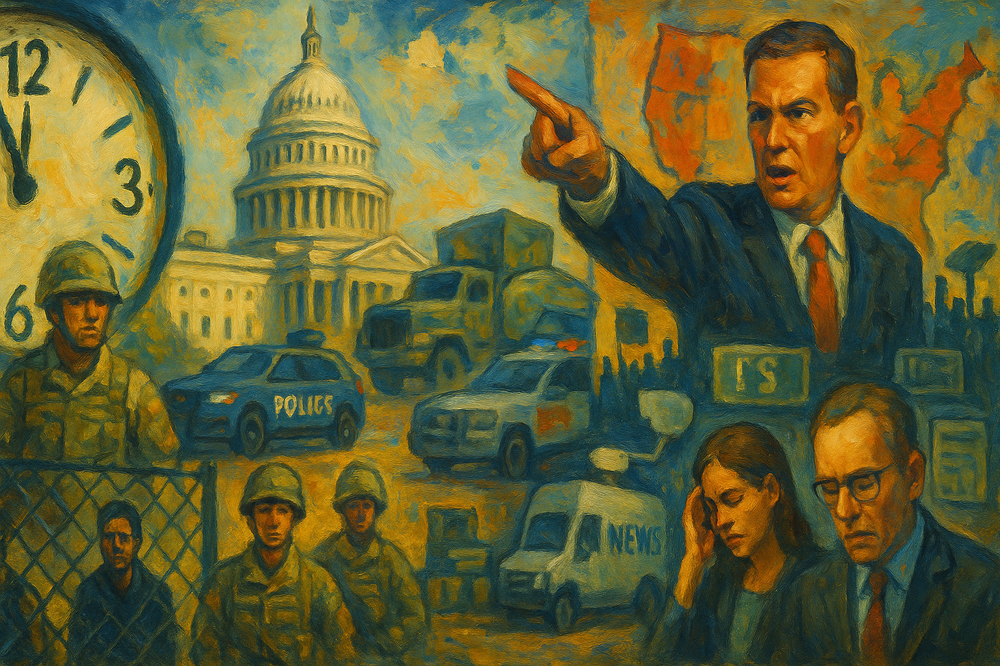

<!-- Generated by build_publish_week_v1 -->
<!-- Header image: image_wide_week32.png -->

# Week 32: Emergencies as Everyday Rule

*A half-minute shift on the Democracy Clock marks a week when emergency logic, lawfare, and economic patronage quietly deepen executive control.*

> The forms of liberty may survive long after the spirit has fled. — Anonymous observer of fading republics
> Power is most dangerous when it learns to operate without spectacle, moving by memo instead of march. — Contemporary political theorist
> The test of a democracy is not how it behaves in crisis, but what it calls a crisis. — Civil rights lawyer

The week did not turn on a single order or speech. It unfolded as a series of moves that, taken together, showed a government more willing to rule by decree, to treat opposition as a security problem, and to sort people into tiers of protection and risk. The pattern was not new, but the confidence with which it was applied across policing, elections, labor, and memory gave the period its weight. It felt coordinated, not incidental.

At the start of Week 32, the Democracy Clock stood at 8:07 p.m. It ended the week at the same public time, with a net movement of half a minute deeper into danger. The face of the clock did not change, but its hands edged forward. That small shift captured a week in which no single rupture dominated, yet the tools of emergency, law enforcement, and economic power were tightened in ways that will be hard to reverse. Courts, civil servants, and civil society registered resistance, but they did not alter the direction of travel.

The clearest expression of that direction came in Washington, D.C. On paper, the president declared a “crime emergency” in the capital and used it to assume control of city policing. Crime rates were low, but the declaration allowed the White House to take charge of the Metropolitan Police Department and to frame the move as a response to chaos. Within days, an executive order expanded the emergency, deepening federal operational control and tying it to National Guard deployments. What looked like a temporary response began to resemble an occupation.

Congressional allies moved to make that occupation durable. Representative Andy Biggs introduced a bill that would turn six‑month federal takeovers of D.C. policing into the default in declared emergencies. The proposal did not abolish local government; it simply ensured that, when the president invoked crisis, national control could persist. At the same time, the administration ordered a federal takeover of Union Station under the banner of “beautification,” extending executive presence over a key transportation hub in the already‑subordinated district. The capital became a test bed.

The logic did not stop at the capital. After Maryland’s governor criticized federal actions, the president threatened to send troops to Baltimore, blurring the line between public safety and personal retaliation. In Illinois, the White House floated National Guard deployments to Chicago, prompting Governor J.B. Pritzker to announce that the state was prepared to sue over any unauthorized military presence. California’s governor, Gavin Newsom, condemned the militarization of Los Angeles and other cities, framing the deployments as unlawful power grabs rather than neutral security measures. Blue jurisdictions were put on notice.

Resistance formed not only in governors’ mansions but also in the streets and courts. Organizers in Washington called for a September march demanding the withdrawal of federal troops from the district, while national groups like Indivisible described the pattern as racially charged militarization of majority‑Black cities. A D.C. grand jury declined to indict a protester accused of throwing a sandwich at a federal officer, a small but telling refusal to endorse the most aggressive readings of federal authority. In the background, a federal judge blocked efforts to defund sanctuary jurisdictions, and an earlier congressional budget freeze had already created a large shortfall in D.C.’s finances, underscoring how fiscal levers and emergency rhetoric now worked together to constrain local self‑rule.

If the capital showed how force could be centralized, the justice system showed how law could be bent. The week opened with the arrest of Newark’s mayor in a chaotic incident overseen directly by the deputy attorney general, an unusual level of senior involvement in a local matter. The charges did not stand, but the message did: federal law enforcement could reach into city halls. Soon after, FBI agents raided the home and office of former National Security Adviser John Bolton over classified information concerns, departing from the negotiated procedures often used with high‑profile figures and signaling that prominent critics were not beyond the reach of dawn searches.

At the same time, the Department of Justice pursued coercive tactics against vulnerable defendants. In the case of Kilmar Ábrego García, prosecutors allegedly used the threat of deportation to a country where he faced greater legal risk to pressure him into a guilty plea in a smuggling case. The Federal Housing Finance Agency, under new leadership, mined detailed mortgage data to build fraud investigations against outspoken critics of the president, including Senator Adam Schiff, New York Attorney General Letitia James, and Federal Reserve Governor Lisa Cook. Regulatory data, collected for neutral oversight, became a tool for targeted legal pressure. The law became a weapon, not a limit.

The contrast with elite‑linked cases was stark. When the House Oversight Committee subpoenaed records from Jeffrey Epstein’s estate, the Justice Department responded with a limited production that consisted largely of already public documents, resisting meaningful transparency about past non‑prosecution decisions and possible ties to current officials. Ghislaine Maxwell, convicted of sex trafficking, was transferred to a minimum‑security facility, drawing criticism from victims who saw the move as lenient treatment for a high‑profile offender. A whistleblower later revealed that a senior official had copied Social Security data for 300 million Americans onto an unsecured server, yet there was no immediate sign of accountability at the top. Impunity ran upward.

The president’s own rhetoric reinforced this two‑tier system. He threatened to reopen the Bridgegate scandal against former Governor Chris Christie, now a critic, and ordered the Justice Department to prioritize prosecution of American flag burning, despite Supreme Court precedent protecting such acts as speech. The department also launched criminal probes into former FBI Director James Comey and former CIA Director John Brennan over past testimony, targeting officials who had once scrutinized the president. Law enforcement authority was not expanded by statute; it was redirected by choice. The targets told the story.

Courts did not stand idle, but their checks were partial and contested. Judge Paula Xinis blocked Ábrego’s re‑deportation and required that he be held near the court, asserting due process limits on immigration enforcement. A federal court ruled that Alina Habba had not been lawfully serving as U.S. attorney for New Jersey, reinforcing procedural constraints on installing loyalists in key prosecutorial posts. Another judge dismissed an unprecedented lawsuit the administration had filed against all Maryland federal district judges, affirming judicial immunity and defending separation of powers. At the margins, ordinary people also pushed back: a mother in Los Angeles filed a million‑dollar claim against immigration agents over an arrest she described as racially motivated and violent. Yet these acts of resistance occurred within a landscape where the balance of initiative lay with the executive.

Alongside these legal maneuvers, the administration worked to redefine dissent itself as a form of disorder. One executive order directed the Justice Department to punish jurisdictions that used cashless bail, threatening federal funding to override local criminal justice reforms. Another instructed prosecutors to treat flag burning as a priority offense, recasting a symbolic act of protest as a criminal threat to the nation. Both orders treated policy disagreement and expressive conduct as security problems to be stamped out rather than arguments to be debated. The range of “acceptable” politics narrowed.

The same logic extended to the press and elections. The president called on the Federal Communications Commission to revoke the broadcast licenses of ABC and NBC, labeling them “threats to democracy” for critical coverage. He publicly claimed record‑high poll numbers despite low approval ratings, using disinformation to project an image of overwhelming popular support. At the same time, he announced that aides were drafting an executive order to eliminate mail‑in balloting nationwide, centralizing control over voting methods in the presidency and casting a widely used practice as inherently suspect. Normal democratic tools were recast as dangers.

These moves unfolded against a backdrop of heightened fear and misinformation. Representative Nancy Mace amplified a false report about a school shooter by posting a misidentified student video, illustrating how elected officials could inadvertently fuel panic. Yet civil society continued to organize. Labor and advocacy groups planned a Labor Day “die‑in” to dramatize the harms of a sweeping federal bill they dubbed the “One Big Ugly Bill,” and protest organizers in D.C. prepared a march against troop deployments. A D.C. grand jury’s refusal to indict the sandwich‑throwing protester suggested that not all institutions accepted the administration’s framing of protest as crime. Still, the cumulative effect of executive orders, threats, and prosecutions was to narrow the space in which dissent felt safe.

Nowhere was stratification more visible than in immigration and social policy. The administration opened a massive immigrant detention site at Fort Bliss, Texas, on a military base, drawing comparisons to internment camps and raising questions about the rights and conditions of those held there. Immigration and Customs Enforcement agents arrested two firefighters from a wildfire crew during an operation, disrupting emergency response and signaling that even essential workers were not shielded from harsh enforcement. An 18‑year‑old detainee was transferred across state lines without timely notice to his family, and another detainee, Luis Manuel Rivas Velásquez, was secretly moved after complaining about conditions, impeding his access to counsel and loved ones. Vulnerability became leverage.

A federal court did order the closure of the notorious “Alligator Alcatraz” detention facility in the Everglades over environmental and human rights violations, and state officials began complying. That closure showed that egregious abuses could still trigger judicial correction. But it was an exception in a week when opaque transfers, coercive plea tactics, and militarized detention expanded. The pattern suggested that migrants and detainees occupied a legal space where due process was fragile and retaliation easy. Rights existed more on paper than in practice.

Domestic policy mirrored this hierarchy. The administration threatened to cut sex education funds unless references to transgender people were removed, pressuring states to erase inclusive curricula and further marginalizing LGBTQ youth. It proposed a rule that would ban almost all abortions in Veterans Affairs facilities, even in cases of rape and incest, using control over veterans’ healthcare to restrict reproductive rights for women who had served. The president revoked extended Secret Service protection for former Vice President Kamala Harris, reversing a predecessor’s decision and using security discretion in a way widely read as punitive toward a political rival. Protection itself became conditional.

Public health decisions added another layer. Confusing new restrictions on COVID‑19 vaccines were announced not through transparent expert processes but by political leaders, including the health secretary, raising fears that access and guidance would be shaped by ideology rather than evidence. Within the Centers for Disease Control and Prevention, the Senate‑confirmed director, Susan Monarez, was removed after disputes over vaccine policy, and multiple senior officials resigned en masse, citing political interference and data manipulation. The result was a weakened, more compliant leadership at the heart of the nation’s disease response. Expertise was sidelined.

Emergency management showed a similar pattern of punishment for candor. Hundreds of FEMA employees sent a “Katrina Declaration” letter to Congress, warning that staffing cuts and policy changes had left the agency ill‑prepared for disasters. In response, leadership placed some signatories on administrative leave, a clear signal that internal dissent would be met with professional risk. An executive order excluding additional federal units from standard labor‑management rules on national security grounds further reduced collective bargaining rights for segments of the civil service. Those who were already vulnerable—immigrants, disabled people, internal critics—bore the brunt of these choices.

Even as leadership was purged, some formal processes continued. The CDC scheduled an Advisory Committee on Immunization Practices meeting on multiple vaccines, with public comment, preserving the appearance of evidence‑based recommendation. The agency also sought input on a standardized data management plan template to improve transparency and reproducibility in health research. The Food and Drug Administration held meetings on staffing, patient experience, and manufacturing readiness. These efforts suggested that procedural normalcy still existed on paper, even as the institutions that housed it were being bent toward loyalty. Form endured while substance shifted.

Economic policy, meanwhile, moved further into the president’s personal orbit. He announced that the U.S. government had taken a 10 percent equity stake in Intel, a major chipmaker, after personally demanding the arrangement. The administration floated a broader strategy of acquiring stakes in firms heavily reliant on federal contracts, signaling a shift toward state‑linked corporate ownership negotiated at the top. The line between public authority and private enterprise blurred, with industrial policy increasingly shaped by insider conversations rather than open debate. Crony capitalism became a governing method.

Trade policy followed the same pattern of centralized discretion. The administration implemented tariffs on small inbound packages by removing the long‑standing de minimis exemption, prompting postal suspensions in many countries and disrupting low‑value trade flows. A formal executive order later ended the exemption outright, raising costs for consumers and small importers while concentrating trade decisions in the White House. At the same time, the government canceled CHIPS Act‑funded solar and wind projects in favor of fossil fuels, redirected public investment away from renewables, and proposed admitting 600,000 Chinese students to U.S. universities to stabilize higher education finances. The Environmental Protection Agency granted numerous small refinery exemptions from biofuel blending obligations, weakening renewable fuel mandates. Sector after sector was reoriented around executive preferences and favored industries.

Labor policy was hit with a coordinated offensive. The president proposed eliminating federal minimum wage and overtime protections for childcare and home care workers, stripping basic safeguards from millions in a low‑paid, largely female workforce. He rolled back minimum wage protections for disabled workers, reducing economic security for a group already facing structural barriers. An order moved to rescind collective bargaining rights from about one million federal workers, amounting to the largest attempted rollback of federal union rights in modern history. Another directive cut the minimum wage for federal contractors from $17.75 to $13.30 per hour, directly lowering earnings for many who perform public work. The floor itself was lowered.

These changes did not occur in isolation. The administration also cut more than $800 million in public safety and crime‑prevention grants, undercutting community‑based programs even as it emphasized punitive deployments and federal control. Together, the wage cuts, union rollbacks, and funding reductions weakened workers’ bargaining power, increased economic precarity, and removed organized labor as a significant counterweight to executive and corporate power. In response, labor and allied groups planned the Labor Day die‑in against the “One Big Ugly Bill,” using direct action to dramatize the stakes of the new social contract.

Elections and representation were reshaped in quieter but no less consequential ways. The president’s draft executive order to eliminate mail‑in balloting nationwide threatened to centralize control over voting methods and to curtail a practice widely used by the elderly, disabled, and those with inflexible work schedules. In Texas, lawmakers approved and the governor signed a new congressional map projected to give Republicans up to five additional U.S. House seats, raising concerns about partisan gerrymandering and dilution of minority voting power. Civil rights groups, including the NAACP, sued, arguing that the map was a racial gerrymander in violation of the Voting Rights Act. The ground rules of representation were in play.

Elsewhere, courts pushed back. In Utah, a state court invalidated Republican‑drawn congressional maps for violating a voter‑approved independent redistricting commission requirement, ordering new maps by late September. The ruling strengthened judicial enforcement of anti‑gerrymandering reforms. In Missouri, the governor called a special legislative session to redraw districts and change initiative rules, seeking a more Republican‑favoring map and tighter constraints on citizen‑led ballot measures. In Georgia, a Fulton County judge fined county commissioners daily for refusing to appoint two Republicans to the election board, enforcing state law on board composition but raising concerns about compelled inclusion of election deniers.

Amid these maneuvers, some institutions worked to preserve integrity. The U.S. Election Assistance Commission scheduled a public meeting on voting system guidelines, supporting transparent, expert‑driven oversight of election technology. Grassroots groups like Wake County Indivisible hosted municipal candidate meet‑and‑greets, fostering informed participation in local elections. Yet the broader pattern was clear: under the banner of “integrity,” state and federal actors were redrawing lines and rewriting rules in ways that could lock in partisan advantage and weaken the ability of voters—especially minorities and urban residents—to hold leaders to account.

Control over information and memory formed the final layer of the week’s story. The president’s call to revoke ABC and NBC licenses was paired with a $1.1 billion cut to the Corporation for Public Broadcasting. Public media stations, especially in rural areas, warned of severe service impacts, including reduced capacity for emergency alerts and civic information. Independent and noncommercial outlets, already operating on thin margins, faced a new wave of financial strain, while state‑aligned voices remained untouched. The media field tilted.

At the same time, the administration moved to shape national symbols and historical narratives. An executive order mandated classical styles for new federal architecture, using building design to project a particular vision of American identity. The Pentagon decided to reinstall a portrait of Confederate General Robert E. Lee at West Point’s library, reversing earlier efforts to remove such imagery and signaling a political re‑centering of contested historical figures. The General Services Administration updated its Art‑in‑Architecture information collection to emphasize certain historical subjects, a bureaucratic adjustment that would influence which stories appeared in public art. Stone and canvas became tools of power.

Some transparency and accessibility processes persisted. The National Archives convened a FOIA Advisory Committee meeting on vexatious requests and reforms, and agencies published notices of environmental impact statements, inviting public comment on major projects. The Federal Communications Commission sought input on accessibility of digital devices for blind and visually impaired people. Yet these efforts unfolded in an environment where the loudest structural moves favored state‑aligned narratives and symbols, and where government archives in sensitive areas, such as the Epstein case, were being withheld or sanitized.

Looking ahead from this week, several scheduled actions already cast their shadows. Utah’s court‑ordered redrawing of congressional maps by late September, the Election Assistance Commission’s public meeting on voting system guidelines, and the planned September march in Washington against troop deployments all promised to test, in concrete ways, how much space remained for legal correction and public protest within the tightening frame. Each would measure the remaining give in the system.

In the arc of the term, Week 32 did not introduce new tools of control so much as deepen their use. Emergency declarations became a routine path to federal takeovers of local policing. Law enforcement and regulatory data were more openly used against critics while elite‑linked cases stalled. Labor protections were rolled back in clusters, not as isolated reforms. Public health and emergency agencies were purged of independent leadership even as their formal processes continued. Media funding and national symbols were adjusted to favor a particular story of the country. The week’s modest movement on the Democracy Clock reflects this accumulation: rights and procedures remained on the books, but using them now required more courage, more organization, and a greater willingness to face personal risk.

<!-- Synopses for cross-posting -->
Long Synopsis: Week 32 records only a half‑minute advance on the Democracy Clock, yet the movement comes from a dense layering of control rather than a single rupture. In Washington, a manufactured "crime emergency" allowed the White House to seize operational command of D.C. policing, expand National Guard deployments, and treat the capital as a test bed for federal occupation, with threats aimed at Baltimore, Chicago, and other blue jurisdictions. Law enforcement and regulatory data were turned against critics and immigrants, even as elite‑linked cases like Epstein and Maxwell remained shrouded or leniently handled. Simultaneously, the administration drafted an order to end mail‑in voting, blessed gerrymandered maps, and attacked public and independent media, while taking a personal equity stake in Intel and rolling back wages, overtime, and union rights for millions of workers. Courts, civil servants, and organizers mounted scattered resistance, but the week’s through‑line is normalization: emergency powers, lawfare, and crony economics settling into the grain of governance.
Short Synopsis: With no single shock, Week 32 deepens a pattern: emergency declarations, law enforcement, and economic levers are repurposed to centralize power, stratify rights, and narrow democratic space, while institutional pushback remains partial.

