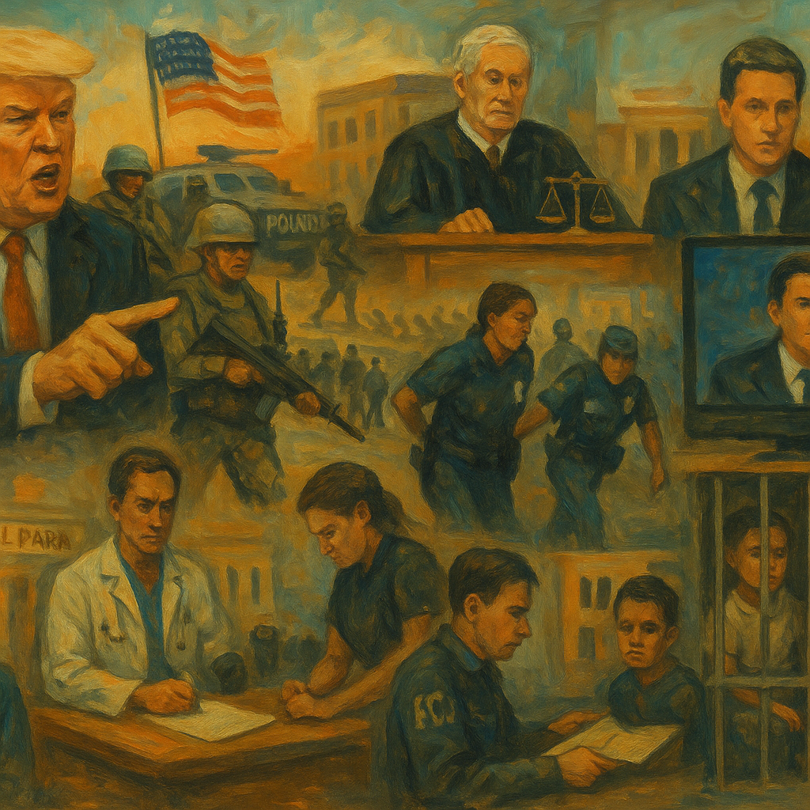

<!-- Generated by build_publish_week_v1 (appendix post) -->
<!-- Header image: image_wide_week35_appendix.png -->

# Week 35 Appendix: Security As Presidential Clay

*National Guard deployments, immigration raids, and curated memory showed how ordinary tools of government were reshaped around one man’s fears and advantage.*

This week shows an aggressive consolidation of executive power and a sharp authoritarian turn in multiple domains. The Trump administration used emergency rhetoric, military deployments, and immigration crackdowns to override local authority (Memphis, DC, Camp 57) while openly defying statutory and judicial constraints (TikTok delay, Lisa Cook removal push, tariff litigation). Law is increasingly weaponized: RICO threats against protesters, politicized prosecutions and firings (Maurene Comey, Erik Siebert, Letitia James pressure), and Supreme Court-sanctioned warrantless immigration raids. Simultaneously, the information sphere was hit with a coordinated campaign: FCC threats and corporate compliance produced the effective silencing of Jimmy Kimmel; DOJ removed research on far‑right violence; national parks stripped slavery exhibits; and senior officials spread election and violence disinformation. Public health and science governance were gutted via RFK Jr’s purge of vaccine advisory bodies, CDC leadership firing, and EPA’s move to rescind the endangerment finding. Immigration and citizenship were stratified through harsh enforcement, solitary confinement, child detention abuses, TPS fights, and a new pay‑to‑enter “Gold Card” visa. There are pockets of resistance—courts blocking some deportations and Cook’s firing, congressional investigations, state-level vaccine guidance—but the net structural pressure is strongly toward entrenched authoritarian governance.

Power and Authority

1. Florida Surgeon General Joseph Ladapo and the Florida administration ended childhood vaccine mandates for multiple preventable diseases (2025-09-13): Florida eliminated school vaccine mandates for diseases like measles and polio, weakening collective protections for children and shifting core public health decisions toward ideological executive discretion.

2. President Trump ordered flags at half-mast and awarded a posthumous Medal of Freedom for Charlie Kirk (2025-09-13): Trump used national symbols and the highest civilian honor to elevate a partisan activist, reinforcing a cult of personality and blurring lines between state commemoration and factional loyalty.

3. President Trump requested an additional $58 million from Congress for executive and judicial security after Charlie Kirk’s killing (2025-09-13): The administration sought expanded protection for top officials in response to political violence, potentially entrenching a security bubble around elites while broader democratic vulnerabilities remain unaddressed.

4. President Trump threatened to declare a national emergency to seize control of Washington DC’s police over immigration enforcement (2025-09-15): Trump’s threat to federalize DC policing to compel cooperation with mass deportations leveraged emergency powers against local autonomy, eroding checks on centralized executive control.

5. President Trump signed an executive order deploying National Guard troops and a multi-agency task force to Memphis (2025-09-15): The Memphis Safe Task Force embedded federal agents and Guard troops in local crime control, normalizing military-style federal intervention in city governance beyond clear emergency conditions.

6. President Trump publicly questioned First Amendment protection for hate speech (2025-09-15): By suggesting hate speech may not be constitutionally protected, Trump signaled openness to broader state control over expression, undermining settled free speech norms that constrain government power.

7. President Trump threatened to withhold federal funding from New York City if Zohran Mamdani is elected mayor (2025-09-15): Trump’s threat to punish New York City financially over a local electoral outcome weaponized federal resources against disfavored political choices, pressuring voters and state leaders.

8. President Trump ordered construction of a new 27-mile border wall segment in Arizona’s San Rafael Valley (2025-09-15): The administration advanced a major border wall project through a sensitive ecosystem, prioritizing hardline border control and executive security framing over environmental and local concerns.

9. Secretary of State Marco Rubio pledged to revoke visas of people who celebrated Charlie Kirk’s killing (2025-09-15): Rubio’s vow to strip visas based on political expression tied immigration status to ideological conformity, extending executive power over noncitizens into the realm of speech policing.

10. President Trump overturned ICE “sensitive locations” protections for hospitals and schools (2025-09-16): By ending limits on immigration enforcement in hospitals and schools, the administration expanded coercive reach into essential public spaces, chilling access to care and education for immigrant communities.

11. President Trump extended the federal TikTok enforcement delay despite statutory and judicial mandates (2025-09-16): Trump’s order to postpone TikTok enforcement in defiance of Congress and a Supreme Court ruling highlighted executive willingness to selectively ignore legal constraints on favored platforms.

12. President Trump announced military strikes on a Venezuelan drug boat without congressional authorization (2025-09-15): Unilateral strikes in international waters, touted without evidence, underscored the president’s use of lethal force abroad absent clear oversight, stretching war powers norms.

13. President Trump announced efforts to retake Afghanistan’s Bagram airbase from the Taliban (2025-09-18): Trump’s push to reoccupy Bagram signaled a renewed, executive-driven military footprint in a volatile region, with strategic decisions framed around great-power rivalry rather than legislative debate.

14. President Trump ordered a temporary federal takeover of the Washington DC police department using National Guard and federal agents (2025-09-19): The 30-day federal seizure of DC policing authority, justified by disputed crime claims, set a precedent for overriding local self-governance through security narratives.

15. President Trump announced plans for a $200 million White House ballroom project (2025-09-17): The decision to build a lavish new White House ballroom raised questions about using public funds and symbolic space for presidential aggrandizement rather than public needs.

16. President Trump designated ANTIFA as a major terrorist organization and urged investigations of its funders (2025-09-19): Trump’s legally unsupported terrorism designation for a domestic protest tendency framed political opposition as a security threat, inviting expanded surveillance and repression of dissent.

17. President Trump issued the Gold Card executive order creating a pay-to-immigrate visa program (2025-09-19): The Gold Card program tied expedited immigrant visas to million‑dollar “gifts,” formalizing a pathway where wealth directly purchases legal status and access to the United States.

18. President Trump publicly praised ABC for suspending Jimmy Kimmel after critical comments (2025-09-18): Trump’s celebration of Kimmel’s suspension reinforced a climate where media outlets are rewarded or punished based on personal loyalty to the president, pressuring editorial independence.

Institutions and Governance

1. Senator Lindsey Graham and Representative Brian Fitzpatrick launched a bipartisan push to attach Russia sanctions to a government funding bill (2025-09-13): Lawmakers sought to embed strong Russia sanctions into a must‑pass continuing resolution, using congressional power of the purse to shape foreign policy and constrain executive discretion.

2. Fulton County Superior Court Judge Kevin Farmer dismissed RICO conspiracy charges against Cop City protesters for lack of proper authority (2025-09-13): The court threw out sweeping RICO charges after finding the attorney general lacked required gubernatorial authorization, reinforcing procedural limits on criminalizing protest movements.

3. Brazilian Supreme Court convicted former president Jair Bolsonaro of plotting a coup and sentenced him to prison (2025-09-13): Brazil’s high court imposed a 27‑year sentence on Bolsonaro for coup plotting, demonstrating judicial willingness to hold ex‑executives accountable for attacks on electoral outcomes.

4. Trump administration pressed the Supreme Court to overturn a ruling that found its global tariffs illegal (2025-09-13): The administration lobbied the Court to restore contested tariffs, testing judicial limits on unilateral economic powers claimed under emergency statutes.

5. Supreme Court of the United States allowed warrantless immigration raids targeting people based on appearance and other proxies (2025-09-14): By lifting a restraining order and permitting warrantless raids, the Court expanded federal enforcement latitude at the expense of due process and equal protection for immigrants.

6. Missouri legislature approved a mid-decade congressional gerrymander to flip a Democratic seat (2025-09-14): Missouri lawmakers redrew districts mid‑cycle to convert a Democratic seat to Republican control, using redistricting power to entrench partisan advantage over voter preferences.

7. Senator Elizabeth Warren and Representative Steve Cohen introduced legislation to ban employer credit checks in hiring (2025-09-15): The bill sought to curb the use of credit histories in employment decisions, addressing structural barriers that disproportionately harm women and minorities in the labor market.

8. Texas legislature enacted Senate Bill 17 restricting real estate purchases by certain foreign nationals (2025-09-15): Texas barred many Chinese, Iranian, Russian, and North Korean nationals from buying most property, prompting legal challenges over discrimination and conflicts with federal authority on foreign investment.

9. House Judiciary Committee scheduled an FBI oversight hearing with Director Kash Patel (2025-09-15): The committee moved to question FBI leadership amid concerns about politicization and investigative missteps, exercising legislative oversight over federal law enforcement.

10. Senate Judiciary Committee grilled FBI Director Kash Patel over reassigning agents from domestic terrorism to immigration (2025-09-15): Senators challenged Patel on shifting FBI resources away from domestic extremism, highlighting how allocation decisions can weaken core security functions and accountability.

11. Representative Nancy Mace filed a resolution to censure Rep. Ilhan Omar and remove her from committees based on false claims (2025-09-15): The censure bid used unsubstantiated accusations about Omar’s comments on Charlie Kirk to weaponize House discipline procedures against a political opponent.

12. Center for Human Rights and Constitutional Law and partner groups filed a court complaint alleging abusive conditions at ICE’s Dilley family detention center (2025-09-15): Advocates asked a federal court to enforce Flores standards at a large family facility, documenting prolonged detention and neglect that test legal limits on child custody conditions.

13. Maurene Comey sued the Trump Justice Department over her firing as a federal prosecutor (2025-09-15): Comey’s lawsuit alleged unconstitutional, retaliatory removal tied to her father’s history with Trump, challenging presidential claims of unfettered power over career prosecutors.

14. U.S. Court of Appeals for the D.C. Circuit blocked President Trump’s attempt to fire Federal Reserve Governor Lisa Cook (2025-09-15): The appeals court preserved Cook’s position, reinforcing the Fed’s structural independence against unprecedented presidential efforts to remove a sitting governor.

15. Federal appeals court criticized deportations of protected men to Ghana but found itself unable to intervene post-removal (2025-09-15): A judge condemned the administration’s deportation of men with immigration protections, illustrating how rapid executive actions can outpace judicial remedies and weaken due process.

16. Pentagon Inspector General completed a review of Defense Secretary Pete Hegseth’s use of Signal to share sensitive plans (2025-09-15): The IG’s report on unauthorized disclosures to non‑officials highlighted internal oversight of national security decision‑making and potential breaches of classification norms.

17. President Trump filed a $15 billion defamation lawsuit against the New York Times and related defendants (2025-09-16): Trump’s massive libel suit against a major newspaper and authors sought to punish critical reporting through civil courts, testing protections for investigative journalism.

18. Georgia Supreme Court declined to hear Fani Willis’s appeal of her disqualification from the Trump RICO case (2025-09-16): By leaving Willis’s removal in place, the court prolonged uncertainty over prosecution of a major election interference case, delaying accountability for alleged 2020‑related crimes.

19. Youth climate activists represented by Our Children’s Trust challenged three pro-fossil-fuel Trump executive orders in federal court (2025-09-16): Young plaintiffs argued that energy emergency orders unlawfully endanger citizens and exceed executive authority, using litigation to contest climate policy as a constitutional harm.

20. Senate Environment and Public Works Committee opened an investigation into industry lobbying behind EPA’s move to rescind the endangerment finding (2025-09-16): Senators sought records from oil companies and think tanks to probe whether corporate pressure drove efforts to dismantle the legal basis for federal climate regulation.

21. Representative Brian Mast withdrew a proposal that would have let the Secretary of State revoke passports over alleged terrorism support (2025-09-16): Facing civil liberties concerns, Mast moved to strip a broad passport‑revocation power from State Department legislation, averting a tool that could have targeted activists and dissidents.

22. House of Representatives passed a bill allowing DC minors as young as 14 to be tried as adults for serious crimes (2025-09-16): The House advanced legislation tightening juvenile justice in DC and curbing judicial discretion, asserting congressional control over local criminal policy in the federal district.

23. Trump Department of Justice sued Vermont to invalidate its Climate Superfund Act requiring polluters to pay for climate harms (2025-09-17): DOJ sought to strike down state laws making fossil fuel companies fund climate damage, aligning federal litigation with industry interests against state-level accountability experiments.

24. Utah prosecutors and grand jury indicted Tyler Robinson on aggravated murder and related counts for killing Charlie Kirk (2025-09-17): The indictment on capital charges formalized state prosecution of a high‑profile political killing, raising questions about the use of the death penalty in politically charged cases.

25. Federal judge Steven Merryday dismissed Trump’s $15 billion defamation lawsuit against the New York Times as procedurally deficient (2025-09-19): The court rejected Trump’s sweeping libel complaint for failing basic pleading standards, signaling judicial resistance to using civil courts as blunt instruments against the press.

26. Federal judge Timothy Kelly blocked deportation of Guatemalan children with active immigration cases (2025-09-18): Kelly halted removal of unaccompanied minors after finding the administration’s claims about parental wishes unsubstantiated, reinforcing judicial checks on rushed deportations of vulnerable children.

27. Ninth Circuit Court of Appeals upheld temporary protected status for 600,000 Venezuelans against Trump administration efforts to end it (2025-09-18): The appeals court preserved TPS protections by ruling the homeland security secretary lacked authority to terminate the program, constraining executive power over mass deportation.

28. Immigration judge in Louisiana ordered Mahmoud Khalil deported for misrepresentation on his green card application (2025-09-18): The deportation order against a pro‑Palestinian activist for alleged form misstatements, despite a federal stay, illustrated how immigration courts can be used against politically active residents.

29. Federal judge ordered improvements to harsh immigrant detention conditions in a Manhattan federal building (2025-09-17): Finding likely First and Fifth Amendment violations, the court mandated better conditions for detainees, underscoring judicial oversight of civil detention practices.

30. Federal judge ordered Rudy Giuliani to pay over $1.3 million in legal fees related to 2020 election litigation (2025-09-17): The fee award penalized Giuliani for unpaid legal bills tied to his efforts to overturn the 2020 election, reinforcing financial accountability for actors in anti‑democratic schemes.

31. Federal appeals court ordered deportation of Atlanta journalist Mario Guevara despite prior bond and residency path (2025-09-19): The appellate decision to deport a reporter known for immigration coverage, amid claims of retaliation, raised alarms about judicial complicity in chilling investigative journalism.

32. House Republicans proposed 14 bills imposing tough-on-crime policies on Washington DC (2025-09-19): The legislative package sought to override DC’s local authority on criminal justice, using Congress’s unique power over the district to impose partisan crime policy.

33. House of Representatives passed a resolution honoring Charlie Kirk and condemning political violence (2025-09-19): The symbolic resolution, backed mostly by Republicans but dividing Democrats, used congressional floor time to canonize a polarizing activist, reflecting partisan memory politics.

34. House Republicans advanced NDAA provisions to delay PFAS foam bans and cut cleanup funding (2025-09-19): Defense bill riders would slow the military’s transition away from toxic PFAS foams and reduce cleanup budgets, privileging short‑term operational convenience over long‑term health protections.

35. House of Representatives passed a short-term government funding bill largely along party lines (2025-09-18): The House approved a seven‑week stopgap funding measure without Democratic input, setting up a Senate clash and heightening shutdown risk over unresolved policy disputes.

36. U.S. Senate blocked the House-passed funding bill over healthcare program cuts (2025-09-19): Senate Democrats rejected the House CR for failing to protect Medicaid and other health programs, using budget leverage to resist executive-backed austerity.

37. Senator Chris Murphy and Representative Jason Crow announced plans for legislation protecting anti-government speech from censorship (2025-09-19): In response to Kimmel’s suspension and regulatory threats, lawmakers proposed statutory defenses for politically targeted speakers, aiming to bolster First Amendment safeguards.

38. House Democratic leaders demanded FCC Chair Brendan Carr’s resignation over alleged abuse of power against ABC (2025-09-18): Democrats accused Carr of coercing ABC through licensing threats to punish Jimmy Kimmel, signaling congressional readiness to investigate regulatory retaliation against media.

39. House Democrats launched an investigation into ABC, Sinclair, and the FCC over Jimmy Kimmel’s suspension (2025-09-18): The inquiry aimed to uncover whether political intimidation and regulatory leverage drove programming decisions, probing institutional safeguards for media independence.

40. House Judiciary Committee Democrats failed in an attempt to subpoena FCC Chair Brendan Carr during a hearing (2025-09-19): Ro Khanna’s unsuccessful subpoena effort underscored partisan gridlock over holding a key regulator accountable for perceived censorship‑related abuses.

41. Federal Election Commission canceled two open public meetings scheduled for November 2025 (2025-09-19): The FEC’s cancellation of planned open meetings reduced opportunities for public observation of campaign finance oversight, modestly weakening transparency in election regulation.

42. Environmental Protection Agency proposed rescinding the greenhouse-gas endangerment finding and cutting its research office (2025-09-17): EPA’s move to revoke the scientific basis for climate regulation and dismantle its research arm would sharply curtail the agency’s capacity to protect public health from emissions.

43. Trump administration and HHS Secretary Robert F. Kennedy Jr. fired CDC Director Susan Monarez after conflicts over vaccine policy (2025-09-17): Removing the CDC director for resisting politicized vaccine directives signaled deep encroachment of ideology into public health leadership and weakened institutional independence.

44. Robert F. Kennedy Jr. as HHS Secretary purged and reconstituted the CDC’s Advisory Committee on Immunization Practices with new appointees (2025-09-17): Kennedy’s wholesale replacement of ACIP members with vaccine skeptics and underqualified advisers reoriented a key scientific body toward political goals, undermining evidence‑based guidance.

45. President Trump issued an executive order to bring federal scientific research under tighter presidential control (2025-09-17): The “restoring gold standard science” order centralized scrutiny of grants and targeted diversity initiatives, weakening independent peer review and inviting politicized funding decisions.

46. Advisory Committee on Immunization Practices reversed itself and voted to end Vaccines for Children coverage of the combined MMRV shot (2025-09-19): ACIP’s confused reversal on MMRV coverage exposed diminished expertise and stability in vaccine policymaking, risking reduced access for low‑income children.

47. Advisory Committee on Immunization Practices voted against recommending a prescription requirement for Covid-19 vaccines (2025-09-19): By narrowly rejecting a prescription mandate but urging individualized decisions, ACIP left Covid vaccine access more complex and potentially less routine, affecting coverage and uptake.

48. Trump administration attempted to remove Federal Reserve Governor Lisa Cook over disputed mortgage allegations (2025-09-14): The White House’s push to oust Cook on thin fraud claims, later taken to the Supreme Court, challenged norms insulating monetary policy from partisan purges.

49. Trump Department of Labor leadership proposed nearly 150 deregulatory actions including ending wage and overtime protections for millions of care workers (2025-09-16): The sweeping Labor agenda would strip basic protections from 3.7 million domestic workers and shrink enforcement capacity, shifting institutional priorities away from worker rights.

50. Department of Labor chief of staff issued a memo threatening legal consequences for employees who speak to the media about working conditions (2025-09-16): The gag directive, at odds with labor law, sought to silence internal criticism and whistleblowing, undermining transparency within a key regulatory agency.

51. FEMA chief counsel resigned while urging staff to prioritize people over politics (2025-09-15): The departure of FEMA’s top lawyer, the third under Trump, pointed to mounting political pressure on disaster management professionals and potential erosion of neutral emergency governance.

52. Director of National Intelligence Tulsi Gabbard revoked security clearances for Joel Willett and dozens of other intelligence officials (2025-09-17): The clearance purge targeting current and former officers, including a Senate candidate, suggested political criteria were being used to control access to classified information and sideline critics.

53. Trump administration cut $500 million in international grants combating child and forced labor (2025-09-16): Eliminating major overseas labor grants weakened U.S. support for global worker protections, signaling a retreat from international norms against exploitation.

54. House Republicans proposed an $88 million increase in security funding for top officials in a stopgap bill (2025-09-17): The security add‑on for lawmakers, judges, and executives in a short‑term funding bill highlighted how elite protection can be prioritized amid broader budget standoffs.

55. Trump administration signed a domestic spending bill cutting Medicaid and CHIP by over $1 trillion (2025-09-17): The “One Big, Beautiful Bill” slashed federal health entitlements, with CBO projecting over 10 million people losing coverage, reshaping the social safety net through budget law.

56. House Oversight Committee (minority leadership) opened an investigation into FCC and Trump administration contacts with media executives (2025-09-17): The probe into communications around ABC’s programming decisions sought to uncover whether regulators coordinated with the White House to pressure critical outlets.

57. House of Representatives narrowly rejected a resolution to censure Rep. Ilhan Omar over false claims (2025-09-17): The failed censure effort showed some institutional resistance to using formal sanctions based on misinformation, though the close vote reflected ongoing vulnerability to partisan misuse.

58. Trump administration asked the Supreme Court to authorize firing Federal Reserve Governor Lisa Cook (2025-09-18): Seeking high‑court blessing to remove a Fed governor over unproven allegations escalated the confrontation over central bank independence into a constitutional test.

59. Trump administration pressured federal prosecutors to charge New York Attorney General Letitia James and moved to fire U.S. Attorney Erik Siebert when evidence was lacking (2025-09-18): Top officials leaned on DOJ to pursue baseless mortgage fraud charges against a political adversary and ousted a U.S. attorney who resisted, undermining prosecutorial independence.

60. Federal Election Commission canceled two November 2025 open meetings under the Sunshine Act (2025-09-19): By calling off scheduled public sessions, the FEC modestly reduced opportunities for real‑time scrutiny of its decisions on campaign finance and election rules.

Economic Structure

1. Environmental Protection Agency granted Arizona primacy over regulation of most underground injection wells (2025-09-15): EPA’s approval shifted primary enforcement of underground injection controls to Arizona, decentralizing oversight of groundwater risks while retaining limited federal authority on tribal lands.

2. Centers for Disease Control and Prevention sought OMB approval to continue tuberculosis program evaluation data collection (2025-09-15): CDC’s request to extend TB surveillance reporting supported ongoing monitoring of a serious disease, sustaining data infrastructure that informs public health resource allocation.

3. Trump administration and Trump family interests facilitated a UAE AI chip deal and $2 billion investment in the Trump-linked crypto firm World Liberty Financial (2025-09-15): The arrangement allowing advanced chips to flow to a UAE firm while channeling large investments into a Trump family business raised serious conflict‑of‑interest and corruption concerns.

4. Federal Communications Commission re-established its Technological Advisory Council for a new term (2025-09-16): Reconstituting the TAC ensured ongoing expert input into communications policy, affecting how emerging technologies are regulated and integrated into national infrastructure.

5. Federal Communications Commission clarified outage reporting rules during disaster activations (2025-09-16): The FCC’s rule refined when providers can rely on DIRS instead of NORS, balancing reporting burdens with the need for timely information to protect critical communications services.

6. Federal Communications Commission required all domestic voice providers to block calls from do-not-originate lists to fight robocalls (2025-09-16): The new blocking mandate strengthened consumer protections against fraudulent and nuisance calls, using regulatory power to curb abusive telecommunications practices.

7. Federal Communications Commission sought comment on information collection for land mobile radio service records (2025-09-16): The FCC’s PRA notice aimed to streamline data requirements for radio licensees, affecting compliance costs and the quality of spectrum management information.

8. Federal Communications Commission adopted georouting requirements for 988 suicide prevention text messages (2025-09-16): Mandating georouting for 988 texts improved routing to local crisis centers, enhancing access to mental health support while raising implementation and privacy considerations for carriers.

9. Trump Department of Labor advanced extensive deregulatory proposals including removal of wage and overtime protections for domestic care workers (2025-09-16): The Labor agenda would roll back core protections for millions of low‑wage workers, shifting bargaining power toward employers and weakening enforcement capacity.

10. Environmental Protection Agency released a draft risk evaluation for the chemical D4 under TSCA (2025-09-17): EPA’s draft assessment of D4’s health and environmental risks set the stage for potential restrictions on its use, influencing industrial practices and public exposure.

11. Environmental Protection Agency extended compliance dates for certain trichloroethylene restrictions (2025-09-17): By delaying TCE phaseout deadlines for nuclear fuel and chemical processors, EPA balanced environmental and national security concerns while prolonging use of a hazardous solvent.

12. Federal Communications Commission corrected media ownership rule text in the Code of Federal Regulations (2025-09-17): The technical fix clarified waiver criteria for broadcast ownership limits, affecting how consolidation requests are evaluated in local media markets.

13. Food and Drug Administration issued draft guidance on developing drugs for disseminated coccidioidomycosis (2025-09-17): FDA’s guidance provided a clearer regulatory pathway for antifungal treatments, potentially accelerating therapies for a serious infection affecting vulnerable populations.

14. Food and Drug Administration issued draft guidance on erosive esophagitis drug development (2025-09-17): Standardizing trial expectations for erosive esophagitis drugs aimed to harmonize evidence requirements, influencing investment decisions and patient access to new therapies.

15. Food and Drug Administration issued draft guidance on symptomatic nonerosive GERD drug development (2025-09-17): The sGERD guidance clarified endpoints and design for treatments of a common condition, shaping how pharmaceutical firms pursue approvals in a large market.

16. Credit reporting agencies and broader economy experienced a notable decline in Americans’ average credit scores (2025-09-17): Falling FICO scores driven by higher costs and resumed student loan payments signaled rising household financial stress, with implications for borrowing access and economic resilience.

17. Nexstar Media Group canceled Jimmy Kimmel’s show while seeking FCC approval for a merger with Tegna (2025-09-17): Nexstar’s programming decision amid a pending ownership expansion highlighted how regulatory dependencies can incentivize media companies to align content with perceived FCC preferences.

18. Treasury Secretary Scott Bessent faced scrutiny over listing two homes as principal residences on mortgage documents (2025-09-17): Questions about Bessent’s mortgage filings, even absent clear illegality, underscored expectations for financial transparency and ethical conduct by top economic officials.

19. Drug Enforcement Administration scheduled seven fentanyl-related substances as Schedule I drugs (2025-09-18): DEA’s scheduling decision tightened controls on emerging fentanyl analogues, aiming to curb abuse and trafficking while affecting research and criminal penalties.

20. Environmental Protection Agency amended approval of Hawaii’s underground storage tank program (2025-09-18): EPA’s codification of Hawaii’s UST rules clarified which state provisions are federally enforceable, shaping local responsibility for preventing fuel leaks and contamination.

21. Environmental Protection Agency approved Guam’s New Source Review plan for sulfur dioxide nonattainment areas (2025-09-18): The SIP revision empowered Guam’s environmental agency to issue permits for major SO₂ sources, integrating local permitting into the federal Clean Air Act framework.

22. Environmental Protection Agency issued a Clean Data Determination for Guam’s Piti-Cabras sulfur dioxide area (2025-09-18): Finding the area met the 2010 SO₂ standard suspended certain planning obligations, easing regulatory burdens while maintaining monitoring requirements.

23. Food and Drug Administration corrected an error in radiological health regulations (2025-09-18): Restoring inadvertently deleted regulatory text ensured clarity for entities subject to radiological health rules, supporting consistent enforcement and compliance.

24. Food and Drug Administration reclassified certain hepatitis B virus assay devices to lower regulatory burden (2025-09-18): Reclassification aimed to streamline oversight of HBV diagnostic devices, potentially improving availability while maintaining safety and effectiveness standards.

25. Food and Drug Administration set the fiscal year 2026 fee for using a priority review voucher (2025-09-18): By pricing voucher use at nearly $2 million, FDA influenced the economics of expedited drug approvals, affecting which products companies prioritize for fast‑track review.

26. Occupational Safety and Health Administration extended OMB approval for derricks standard information collection (2025-09-18): Continuing documentation requirements for derrick operations supported enforcement of workplace safety rules in heavy industry sectors.

27. Equal Employment Opportunity Commission appointed members to its Performance Review Board (2025-09-18): EEOC’s PRB appointments shaped how senior executives are evaluated and rewarded, influencing leadership accountability within the civil rights agency.

28. Drug Enforcement Administration adjusted 2025 production quotas for lisdexamfetamine and d-amphetamine to address shortages (2025-09-19): Increasing quotas for key ADHD medications responded to reported shortages, balancing diversion concerns with the need for adequate medical supply.

29. Environmental Protection Agency published notice of availability for multiple Environmental Impact Statements (2025-09-19): EPA’s EIS notice enabled public comment on major infrastructure and environmental projects, supporting participatory review of long‑term development impacts.

30. Environmental Protection Agency announced Science Advisory Committee on Chemicals meetings for D4 risk evaluation (2025-09-19): Scheduling SACC peer review sessions for D4’s draft evaluation embedded external scientific scrutiny into regulatory decisions on a widely used chemical.

31. Environmental Protection Agency solicited public comments on multiple air pollution information collection requests (2025-09-19): EPA’s PRA notice on NESHAP and NSPS data collections sought input on reporting burdens, affecting how industries document hazardous emissions.

32. Food and Drug Administration and U.S. Department of Agriculture extended the comment period on defining ultra-processed foods (2025-09-19): Extending input on a uniform definition of ultra‑processed foods gave stakeholders more time to shape a concept likely to influence nutrition policy and labeling.

33. Federal Communications Commission implemented new rate and reporting rules for incarcerated people’s communications services (2025-09-19): By enforcing the Martha Wright-Reed Act, the FCC capped interstate calling rates and required transparency, easing financial burdens on incarcerated people and families.

34. Food and Drug Administration corrected a final rule on new animal drug applications (2025-09-19): Fixing amendatory language for animal drug approvals ensured accurate regulatory instructions for sponsors, supporting orderly veterinary drug markets.

35. Food and Drug Administration issued draft guidance on safety labeling changes under Section 505(o)(4) (2025-09-19): The guidance clarified when FDA can compel label updates based on new safety or reduced effectiveness data, strengthening post‑market oversight of drugs and biologics.

36. Food and Drug Administration reverted its definition of in vitro diagnostic products after a court vacatur (2025-09-19): Removing explicit coverage of lab‑developed tests from the IVD definition aligned FDA rules with a court ruling, reshaping the regulatory landscape for diagnostic labs.

37. Food and Drug Administration sought OMB approval for information collection on tobacco product exemptions from substantial equivalence (2025-09-19): The request governed how manufacturers seek exemptions for minor tobacco product changes, affecting regulatory workload and the pace of product modifications.

38. Food and Drug Administration sought OMB approval for information collection on meetings about tobacco product development (2025-09-19): Formalizing data on pre‑submission meetings aimed to standardize interactions between FDA and tobacco firms, influencing how new products enter the market.

39. Food and Drug Administration requested OMB approval for environmental impact information collection (2025-09-19): The NEPA‑related collection supported FDA’s assessment of environmental consequences of regulated actions, integrating ecological considerations into product approvals.

40. Food and Drug Administration sought OMB approval for tobacco health document submissions by manufacturers and importers (2025-09-19): Requiring ongoing health document submissions from tobacco companies bolstered FDA’s evidence base for regulating products linked to disease and addiction.

41. Food and Drug Administration debarred William Goldsmith from importing drugs for five years after a felony conviction (2025-09-19): The debarment enforced consequences for misbranding offenses in drug importation, signaling regulatory intolerance for fraudulent practices in pharmaceutical supply chains.

42. National Archives and Records Administration appointed members to its Senior Executive Service Performance Review Board (2025-09-19): NARA’s SES PRB appointments shaped performance oversight for top managers at the nation’s archival institution, affecting leadership accountability over federal records.

43. President Trump signed a proclamation imposing a $100,000 annual fee on each H-1B visa (2025-09-19): The unprecedented executive‑imposed fee threatened to price many employers and skilled migrants out of the H‑1B program, reshaping labor markets and raising legal questions about fee authority.

Civil Rights and Dissent

1. Immigration and Customs Enforcement conducted militarized raids across Los Angeles targeting immigrants and perceived immigrants (2025-09-13): ICE’s masked, armed operations in LA neighborhoods, detaining even citizens, evoked past mass roundups and intensified fear in immigrant communities, chilling everyday exercise of rights.

2. Illinois lawmakers including Governor JB Pritzker and Rep. Delia Ramirez demanded investigation into an ICE traffic-stop killing near Chicago (2025-09-13): State leaders called for accountability after ICE agents fatally shot Silverio Villegas-Gonzalez, spotlighting lethal force in immigration enforcement and its impact on local trust.

3. FBI leadership under Kash Patel and Dan Bongino faced criticism and a lawsuit alleging politicization of the Kirk shooting investigation (2025-09-13): Concerns that loyalty to Trump trumped investigative competence at the FBI raised fears that political violence cases may be handled through a partisan lens.

4. ICE and DHS detained Korean workers with valid visas in a raid on a Hyundai plant and held them in poor conditions (2025-09-13): The Georgia raid and reported mistreatment of lawful Korean workers illustrated overbroad, quota‑driven enforcement that harms legal migrants and strains international relations.

5. Stephen Miller as White House deputy chief of staff threatened to use law enforcement power against political opponents labeled as domestic terrorists (2025-09-14): Miller’s rhetoric about deploying state power against dissenters under a terrorism frame signaled intent to criminalize opposition rather than protect neutral public safety.

6. Elon Musk amplified a list of educators accused of inappropriate comments about Charlie Kirk’s murder (2025-09-14): Musk’s targeting of educators contributed to suspensions and firings, demonstrating how influential actors can chill academic speech and punish perceived ideological deviation.

7. Utah legislature enacted HB 128 allowing open carry on college campuses for concealed-carry permit holders (2025-09-14): The law expanded visible firearms on campuses without red‑flag safeguards, reshaping the balance between Second Amendment claims and students’ sense of safety in educational spaces.

8. Trump administration pursued hard-line immigration policies restricting foreign workers and student visas despite economic needs (2025-09-13): Conflicting directives on deportations and visas created confusion for implementers and signaled that ideological goals were overriding labor market and educational considerations.

9. Trump administration used a high-profile Hyundai raid and other operations to recruit new ICE agents (2025-09-15): Holding a career expo near the Kirk murder site and touting aggressive raids framed immigration enforcement as a prestige mission, reinforcing a punitive enforcement culture.

10. Trump administration and Attorney General Pam Bondi considered bringing RICO charges against protesters including pro-Palestinian demonstrators (2025-09-15): Floating organized‑crime statutes for protest activity threatened to transform political assembly into a prosecutable conspiracy, deterring collective action.

11. Justice Department sued Oregon and Maine over access to voter registration lists and ineligible voter information (2025-09-16): The lawsuits, viewed by states as politically motivated, used federal power to pressure election administrators, potentially justifying future purges or challenges to state autonomy.

12. University of California sued the Trump administration over a research funding freeze and a $1.2 billion fine on UCLA (2025-09-16): UC alleged that civil rights laws were being twisted to punish campus speech and activism, framing the funding actions as an attack on academic freedom and dissent.

13. Trump administration reduced federal efforts to combat human trafficking and reassigned agents to deportations (2025-09-17): Scaling back anti‑trafficking initiatives in favor of immigration enforcement deprioritized protection of vulnerable victims in favor of removal metrics.

14. House Republicans introduced multiple “tough on crime” bills for DC and a separate bill to try DC minors as adults (2025-09-16): Congressional Republicans used their unique authority over DC to impose harsher criminal policies, including adult prosecution of 14‑year‑olds, overriding local preferences.

15. ICE and Department of Homeland Security announced that assaulting ICE officers would be prosecuted as a federal felony and broadened what counts as a threat (2025-09-17): By treating actions like filming operations as potential threats, DHS expanded the scope of conduct that could trigger serious charges, chilling oversight and protest.

16. ICE dramatically increased use of solitary confinement in immigration detention under Trump’s second term (2025-09-17): A sharp rise in solitary confinement, especially for vulnerable detainees, highlighted punitive conditions in civil detention that can amount to psychological torture.

17. Minneapolis Police Department cleared a homeless encampment following shootings (2025-09-17): The encampment sweep raised concerns that public safety incidents were being used to justify displacement of unhoused people rather than address underlying housing needs.

18. Trump administration and Louisiana officials reopened Angola prison’s notorious Camp J as an ICE detention center called Camp 57 (2025-09-18): Repurposing a historically abusive prison unit for civil immigration detention blurred lines between criminal punishment and administrative custody, deepening stigma and risk for detainees.

19. ICE and Nassau County Correctional Center reported the in-custody death of an ICE detainee in New York (2025-09-19): The unexplained death of a detainee in a county jail under ICE contract raised questions about medical care, oversight, and accountability in immigration detention partnerships.

20. U.S. law enforcement agencies including FBI and CBP used social media emojis as alleged indicators of Venezuelan gang affiliation (2025-09-19): Reliance on dubious emoji “codes” to flag Tren de Aragua ties risked mislabeling migrants as gang members, enabling wrongful arrests or deportations based on flimsy evidence.

21. Department of Homeland Security agents arrested New York City and state officials while they attempted oversight of immigration courts (2025-09-19): Detaining elected officials engaged in oversight visits signaled hostility to democratic checks on detention conditions and immigration adjudication.

22. New York lawmakers and activists were arrested for blocking access to an ICE intake facility during a protest (2025-09-19): The arrests of 71 people, including 11 elected officials, for civil disobedience at a federal building highlighted escalating conflict between local representatives and federal immigration enforcement.

23. Federal agents used teargas and pepper balls to disperse protesters outside a Chicago ICE facility (2025-09-19): Riot‑gear tactics against a relatively small protest, including congressional candidates, exemplified militarized responses that can deter lawful assembly and political organizing.

24. Trump administration implemented a $100,000 annual fee on H-1B visas and created the Gold Card pay-to-immigrate program (2025-09-19): Together, the H‑1B fee and Gold Card visa entrenched a tiered immigration system privileging wealth and penalizing skilled workers, reshaping who can access U.S. opportunities.

25. Trump administration pursued aggressive deportations and detention of DACA recipients and other immigrants, prompting a congressional letter (2025-09-18): Reports of Dreamers being detained or deported led 95 members of Congress to demand transparency and legal justification, underscoring threats to previously protected groups.

26. Trump administration deported five men to Ghana despite U.S. immigration court protections (2025-09-15): The removals, condemned by a federal judge, showed how executive agencies can circumvent court‑granted protections, undermining the reliability of legal relief for migrants.

27. Trump administration oversaw harsh conditions and alleged Flores violations at the Dilley family detention center (2025-09-15): Prolonged child detention, poor sanitation, and inadequate medical care at a private facility highlighted systemic rights violations against immigrant families in U.S. custody.

28. Trump administration reassigned roughly 20% of FBI agents, including domestic terrorism squads, to immigration enforcement (2025-09-15): Shifting agents away from monitoring extremist threats to focus on immigration enforcement weakened protections against domestic terrorism while intensifying surveillance of migrants.

29. Trump administration used civil rights law to threaten criminal investigation of an Office Depot employee who refused to print Kirk posters (2025-09-15): Treating a refusal to print political imagery as a potential civil rights crime inverted protections meant for marginalized groups into tools for compelling private speech.

30. Trump administration pursued deportation of pro-Palestinian activist Mahmoud Khalil despite a federal stay (2025-09-18): The deportation order against Khalil, constrained only by a separate federal injunction, illustrated how activism and minor paperwork issues can be leveraged to expel legal residents.

31. Trump administration oversaw deportation proceedings against Atlanta journalist Mario Guevara after his protest arrest (2025-09-19): Guevara’s detention and ordered removal, seen as retaliation for immigration reporting, showed how immigration law can be used to silence critical voices lacking citizenship.

32. Trump administration expanded use of solitary confinement and reopened a notorious prison unit for ICE detainees (2025-09-17): The combination of solitary confinement growth and Camp 57’s opening at Angola signaled a punitive, carceral approach to civil immigration enforcement.

33. Trump administration cut Medicaid and CHIP funding, disproportionately affecting children and low-income families (2025-09-17): Massive entitlement cuts threatened healthcare access for millions, particularly children and rural residents, deepening material inequality that shapes effective political participation.

34. Trump administration reduced international child labor and forced labor grants by $500 million (2025-09-16): Defunding global anti‑exploitation programs weakened protections for children abroad, undermining U.S. commitments to labor rights and human dignity.

35. Trump administration reduced efforts to combat human trafficking in favor of deportation priorities (2025-09-17): Scaling back trafficking work in favor of removal metrics left vulnerable victims with fewer protections and signaled that enforcement optics trumped human rights.

36. Trump administration oversaw abusive conditions at ICE’s Dilley family detention center documented in court filings (2025-09-15): Allegations of sleep deprivation, dirty water, and emotional abuse of children at Dilley highlighted systemic rights violations in family detention under federal contracts.

37. Trump administration pursued warrantless immigration raids and broadened definitions of threats to ICE officers (2025-09-14): Supreme Court‑enabled raids and DHS’s expansive threat framing together empowered aggressive enforcement that erodes due process and chills documentation of abuses.

Information, Memory and Manipulation

1. Trump administration responded to Charlie Kirk’s killing by blaming Democrats and signaling a crackdown on critics (2025-09-13): Officials framed the murder as evidence of left‑wing violence, using inflammatory rhetoric to delegitimize political opponents and justify broader repression.

2. Fox News host Brian Kilmeade suggested extreme lethal measures for people experiencing homelessness and later apologized (2025-09-14): Kilmeade’s comments about executing unhoused and mentally ill people, followed by an apology, normalized dehumanizing rhetoric that can soften public resistance to harsh policies.

3. Trump administration ordered removal of slavery-related signs and exhibits from national parks (2025-09-15): Stripping slavery exhibits from public sites erased key narratives about racial injustice from shared spaces, reshaping historical memory toward a sanitized national story.

4. Attorney General Pam Bondi told employers they had an obligation to fire workers who disparaged Charlie Kirk (2025-09-15): Bondi’s statement encouraged private punishment of political speech, extending state pressure into workplace decisions and chilling criticism of favored figures.

5. Vice President JD Vance made baseless claims about far-left political violence while hosting Charlie Kirk’s podcast (2025-09-15): Vance’s misinformation about political violence, later debunked, exemplified high‑level use of partisan media to distort public understanding of security threats.

6. Washington Post fired columnist Karen Attiah over social media posts about white men after Kirk’s killing (2025-09-15): Attiah’s dismissal for commentary on race and violence raised concerns that media employers are narrowing acceptable speech in ways that disproportionately silence critical perspectives.

7. Justice Department removed a study on far-right extremist violence from its website (2025-09-16): Taking down research showing far‑right groups as the leading domestic killers obscured evidence that contradicts official narratives blaming the “radical left.”

8. President Trump threatened ABC News correspondent Jonathan Karl with potential DOJ targeting over tough questioning (2025-09-16): Trump’s suggestion that the Justice Department might go after a critical journalist signaled willingness to use prosecutorial power to intimidate the press.

9. Guardian-reported Labor Department leadership issued a memo warning staff of legal consequences for speaking to media about working conditions (2025-09-16): The gag order attempted to suppress internal whistleblowing and public discussion of agency operations, undermining transparency in labor governance.

10. Pentagon stopped providing atmospheric and oceanic data to scientists and forecasters citing cybersecurity (2025-09-17): Curtailing access to key environmental data hindered climate research and forecasting, concentrating informational control within the defense establishment.

11. Trump administration and RFK Jr. canceled a major Moderna bird flu vaccine contract and cut mRNA vaccine funding (2025-09-17): Terminating vaccine development contracts on ideological grounds undermined scientific preparedness and signaled hostility to evidence‑based public health tools.

12. Robert F. Kennedy Jr. as HHS Secretary appointed vaccine-skeptical advisers to ACIP after purging prior members (2025-09-18): Stacking the vaccine advisory committee with skeptics lacking relevant expertise risked distorting official recommendations and public perceptions of vaccine safety.

13. President Trump issued an executive order asserting tighter presidential control over federal science funding and messaging (2025-09-17): The order framed scientists as untrustworthy and centralized grant scrutiny, enabling political vetting of research agendas and undermining independent inquiry.

14. Former CDC Director Susan Monarez testified that she was fired for upholding scientific integrity and resisting politicized vaccine directives (2025-09-17): Monarez’s account documented direct political interference in health guidance, illustrating how dissenting experts are removed to align science with administration narratives.

15. FCC Chair Brendan Carr threatened broadcasters over Jimmy Kimmel’s comments and launched investigations into media companies (2025-09-18): Carr’s warnings about “remedies” for airing Kimmel and probes into NPR, PBS, and DEI‑engaged firms used regulatory leverage to pressure editorial content and corporate practices.

16. ABC and Disney suspended Jimmy Kimmel’s show indefinitely after FCC threats and affiliate pressure (2025-09-18): The network’s decision to pull a prominent critic of Trump under regulatory pressure demonstrated how corporate media can become conduits for state‑aligned censorship.

17. Sinclair Broadcast Group replaced Jimmy Kimmel’s slot with a one-hour tribute to Charlie Kirk across its ABC affiliates (2025-09-17): Sinclair’s coordinated tribute programming in Kimmel’s former slot illustrated how consolidated media ownership can rapidly pivot airtime toward regime‑aligned narratives.

18. Nexstar Media Group preempted Jimmy Kimmel Live! across its ABC stations following FCC pressure (2025-09-17): Nexstar’s preemption, preceding ABC’s suspension, showed how large station groups can act as intermediaries for regulatory intimidation, narrowing the range of televised dissent.

19. President Trump suggested TV networks that cover him negatively could face government punishment or license revocation (2025-09-19): Trump’s threats to punish critical networks, despite their lack of federal licenses, signaled a desire to weaponize regulatory myths to chill unfavorable coverage.

20. House Democrats and public figures mounted a public outcry against Kimmel’s suspension as an attack on free speech (2025-09-18): Criticism from politicians, comedians, and unions framed the suspension as censorship, highlighting civil society’s role in defending expressive freedoms under regulatory pressure.

21. UK Channel 4 aired a special program cataloging over 100 falsehoods by President Trump (2025-09-17): The fact‑checking broadcast represented an international media effort to counter U.S. presidential disinformation, reinforcing norms of evidence‑based reporting.

22. Zeteo and other outlets debunked Vice President Vance’s and other officials’ false claims about political violence (2025-09-15): Independent fact‑checking of high‑level misinformation about the Kirk killing illustrated the ongoing contest between propaganda and corrective journalism.

23. Education Department partnered with conservative groups to provide programming on patriotism and liberty (2025-09-17): Aligning official educational content with ideologically conservative organizations risked turning civic education into a vehicle for partisan narratives.

24. President Trump repeated the false claim that he won the 2020 election during a joint press conference (2025-09-18): Reasserting the 2020 lie on an international stage continued to erode public trust in electoral legitimacy and normalize denial of certified results.

25. President Trump and UK Prime Minister Keir Starmer’s press team excluded international outlets like Australia’s ABC from a joint press conference (2025-09-18): Barring certain foreign media, following Trump’s threats against an ABC journalist, signaled selective access based on perceived friendliness, undermining press pluralism.

26. FBI Director Kash Patel admitted he had not fully reviewed the Epstein files and refused to say whether Trump appeared in them (2025-09-16): Patel’s limited review and evasiveness about Epstein records fueled perceptions that politically sensitive information about elite misconduct is being shielded from scrutiny.

27. Texas A&M University leadership forced out faculty and leadership after a complaint about “gender ideology,” leading to the president’s resignation (2025-09-19): The chain of firings and the president’s resignation following ideological complaints showed how political pressure can reshape academic governance and chill classroom speech.

28. Democracy Out Loud and allied groups called for subscription cancellations after Karen Attiah’s firing at the Washington Post (2025-09-17): Organized subscriber backlash framed the firing as part of a broader pattern of suppressing dissenting media voices, using consumer power to defend press independence.

29. House Democrats opened an investigation into ABC, Sinclair, and the FCC over Kimmel’s suspension (2025-09-18): The probe sought to uncover whether regulatory threats and corporate coordination produced viewpoint‑based censorship, testing institutional defenses for media freedom.

30. Channel 4 and UK activists aired “Trump v The Truth” and projected Trump–Epstein imagery onto Windsor Castle during his state visit (2025-09-17): British media and activists used public spectacle and fact‑checking to challenge Trump’s narratives and highlight unresolved questions about his elite associations.

31. President Trump criticized media coverage and hinted at sanctions on Ukraine during a press gaggle (2025-09-15): Trump’s conflation of media grievances with foreign policy commentary illustrated how personal narratives can shape or distort public understanding of international commitments.

32. Justice Department removed a domestic terrorism study and national parks removed slavery exhibits, narrowing official narratives on violence and history (2025-09-17): Coordinated erasure of research on far‑right violence and slavery‑era imagery curated public memory away from structural injustice and toward regime‑friendly stories.

