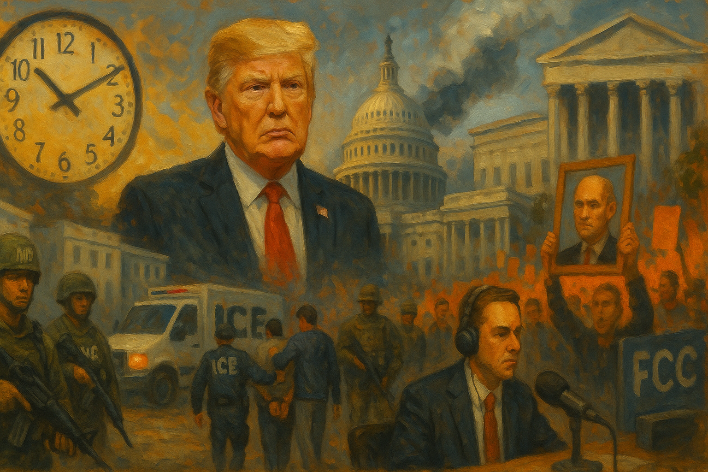

<!-- Generated by build_publish_week_v1 -->
<!-- Header image: image_wide_week35.png -->

# Week 35: Security As Presidential Clay

*National Guard deployments, immigration raids, and curated memory showed how ordinary tools of government were reshaped around one man’s fears and advantage.*

> The instruments of government are never neutral; they remember the hands that last held them. — Anonymous observer of republics
> The true test of a constitution is not what it permits the powerful to do, but what it persuades them to refrain from doing. — A twentieth-century jurist
> When the state controls both the sword and the story, resistance begins with insisting on seeing clearly. — From a dissident’s notebook

The thirty-fifth week of Trump’s second term did not hinge on a single order or speech. It unfolded as a dense pattern of moves that treated security, law, and memory as tools to be shaped by the presidency. National Guard deployments, immigration raids, media pressure, and economic decrees all moved through formal channels, yet together they marked a further slide toward a system in which power answers less to institutions and more to one man’s sense of threat and advantage. The week’s story lies in how ordinary instruments of government were bent to that purpose.

At the start of Week 35, the Democracy Clock stood at 8:07 p.m. By the end, it read 8:08 p.m., a net movement of 0.1 minutes. The shift was small because courts, state governments, and civil society still acted, sometimes effectively, to slow or blunt the administration’s aims. Yet the direction of travel was clear. Executive power was asserted over cities and agencies, law was pressed into service against critics, and the space for independent media and science narrowed. The clock moved because the cost of resisting these trends rose, even as formal rights and procedures remained on the books.

The week’s most visible assertion of power came on American streets. In Memphis, the president announced that National Guard troops would be deployed as part of a “Memphis Safe Task Force,” despite the city’s historically low crime rates. An executive order embedded Guard units alongside federal agencies in local policing, turning what had been a civilian function into a joint military–law enforcement operation. The language was one of public safety. The effect was to normalize soldiers in the role of city police.

Plans did not stop at Memphis. Inside the administration, officials drafted proposals to use Louisiana’s National Guard for routine urban law enforcement, encouraging governors to invite similar interventions. The same week, the president threatened to declare a national emergency to seize control of Washington DC’s police department over disputes about immigration cooperation. Emergency rhetoric, once reserved for hurricanes or riots, became a lever to override local authority when cities resisted federal deportation priorities.

By week’s end, the threat in Washington moved from talk to action. The president ordered a temporary federal takeover of the DC police department, backed by a National Guard deployment for a month, citing contested crime claims. This was not a response to an uprising or natural disaster. It was a political decision to place the capital’s policing under direct presidential control. In parallel, federal agents and Guard units were used in both DC and Memphis under the banner of crime control, reinforcing a model in which security forces align with regime preservation rather than local accountability.

Congressional Republicans moved in step. The House advanced and passed a suite of “tough on crime” bills aimed at Washington DC, including measures to allow 14-year-olds to be tried as adults and to reshape sentencing and policing over local objections. These bills, combined with the Guard deployments and federal takeover, treated the district less as a self-governing community and more as a laboratory for punitive, federally dictated criminal justice. The line between civilian policing and militarized, centralized control grew thinner.

If the Guard deployments showed power on the streets, immigration enforcement revealed how deeply coercion could reach into homes, workplaces, and detention centers. In Los Angeles, ICE conducted large-scale, militarized raids across neighborhoods, targeting immigrants and people perceived to be immigrants. Heavily armed teams swept through communities, spreading fear and raising questions about racial profiling and due process. In Georgia, a worksite raid at a Hyundai plant detained hundreds of Korean workers, many with valid visas, illustrating how aggressive, quota-driven enforcement could ensnare lawful residents and strain foreign relations.

Conditions after arrest were no less telling. Reports from ICE facilities described overcrowding, deprivation, and abuse, including for children. The reopening of Angola prison’s notorious Camp J as an ICE detention center—renamed Camp 57—blurred the line between criminal punishment and civil immigration custody. A unit known for harsh treatment in the criminal system was repurposed for people held on administrative grounds. The message was that immigration status, not conviction, could now land a person in some of the country’s harshest confinement.

Legal definitions shifted to support this posture. ICE and DHS announced that assaulting officers would be prosecuted as a federal felony under broadened standards, stretching “threats” to include acts like filming operations. A memo circulated by DHS and the FBI suggested that certain emojis might indicate affiliation with a South American gang, inviting surveillance and deportation based on flimsy digital signals. At the same time, the administration revoked visas for immigrants who had celebrated Charlie Kirk’s death online, tying legal status directly to political expression.

Courts offered partial checks. Federal judges upheld Temporary Protected Status for Venezuelans, blocked deportation of Guatemalan minors, and ordered improved detention conditions in some facilities. A federal stay slowed the deportation of a pro‑Palestinian activist whose removal order raised free-speech concerns. Yet other rulings cut the other way. An appeals court ordered the deportation of Mario Guevara, an Atlanta journalist known for immigration reporting, despite his prior bond and path toward residency. Another immigration judge’s order against the activist Mahmoud Khalil proceeded until higher courts intervened. The pattern was uneven: some vulnerable people gained protection, others lost it, and the overall system tilted toward fear.

On top of this, the administration rewrote the terms of belonging through money. A presidential proclamation imposed a $100,000 annual fee on each H‑1B visa, threatening to reshape skilled immigration and tech labor markets while testing the limits of executive fee-setting authority. A separate executive order created a “Gold Card” visa purchasable for $1–2 million, formalizing a pathway where residency could be bought outright. In the states, Texas enacted a law restricting real estate purchases by many Chinese, Iranian, Russian, and North Korean nationals. Combined with the end of ICE’s “sensitive locations” policy for hospitals and schools, these moves deepened a tiered system in which wealth, nationality, and ideology determined not just opportunity but basic security.

The killing of Charlie Kirk, a polarizing activist, became the emotional and symbolic center of the week’s politics. After Utah authorities arrested a suspect and brought capital charges, the president ordered US flags to half-mast and awarded Kirk a posthumous Medal of Freedom. The House passed a resolution honoring him and condemning political violence. These gestures elevated Kirk from partisan figure to national martyr, blurring the line between state commemoration and factional celebration.

Alongside the symbolism came money and force. The administration requested tens of millions in new security funding for top executive and judicial officials, and House Republicans embedded an $88 million increase for elite protection in a stopgap spending bill. DHS and ICE used the killing as a recruitment tool at a nearby career expo, pitching law enforcement careers in explicitly partisan terms. The tragedy thus justified both expanded security budgets and a narrative of embattled leadership under siege.

Rhetoric followed the same path. The president and his allies escalated claims that Democrats and left-wing activists were responsible for political violence. Stephen Miller warned that law enforcement power would be used against opponents labeled “domestic terrorists.” Visa revocations targeted immigrants who expressed joy at Kirk’s death. Attorney General Pam Bondi told employers they had an obligation to fire workers who disparaged Kirk, turning private employment decisions into instruments of political discipline. Vice President JD Vance appeared on Kirk’s own podcast to spread baseless claims about far-left violence, reinforcing a story in which criticism of a regime-aligned figure bordered on treason.

This climate fed directly into media and cultural battles. The president threatened ABC correspondent Jonathan Karl with potential DOJ targeting after tough questioning. Jimmy Kimmel’s late-night show was suspended following comments about Kirk’s killing, after FCC Chair Brendan Carr had signaled regulatory pressure. Nexstar, seeking approval for a major merger, aligned the cancellation with its business interests, while Sinclair and Nexstar affiliates replaced Kimmel’s slot with a Charlie Kirk tribute. Commentators and advocacy groups framed Disney’s decision to pull Kimmel as corporate curation of speech under political pressure. The result was a broadcast landscape in which satire critical of the president gave way to programming that honored his ally.

Behind these headline fights, the machinery of law enforcement and justice was being reshaped. The administration and Attorney General Bondi floated the use of RICO statutes against protesters, including pro‑Palestinian demonstrators, treating collective dissent as potential organized crime. In a separate case, they used civil-rights law to justify a criminal investigation of an Office Depot employee who refused to print Kirk posters, inverting protections designed for marginalized groups into tools against individual conscience.

Inside the Justice Department and FBI, personnel and priorities shifted. The president pressured prosecutors to pursue mortgage fraud charges against New York Attorney General Letitia James, a political adversary, and moved to fire US Attorney Erik Siebert when evidence did not support the case. FBI leadership reassigned roughly 20 percent of agents, including domestic terrorism squads, to immigration enforcement, reducing capacity to monitor violent extremism while intensifying surveillance of immigrants. A lawsuit and criticism over the handling of the Kirk shooting investigation alleged that loyalty to Trump, not investigative competence, guided decisions.

Other watchdogs faced similar pressure. The Labor Department issued a memo threatening legal consequences for employees who spoke to the media about working conditions, chilling whistleblowing in a key regulatory agency. At the same time, the FBI director admitted not fully reviewing Jeffrey Epstein files and declined to confirm whether the president appeared in them, fueling concerns about selective transparency in cases involving powerful figures. Together, these moves signaled that speaking out from within the system carried rising risk, while inquiries into elite wrongdoing could be slowed or steered.

Courts and Congress did not stand idle. The House and Senate Judiciary Committees scheduled and held oversight hearings with FBI Director Kash Patel, grilling him over the reassignment of agents and politicization of resources. A Fulton County judge dismissed sweeping RICO charges against “Cop City” protesters for lack of proper authority, limiting the use of organized-crime tools against demonstrators. Federal courts blocked the president’s attempt to fire Federal Reserve Governor Lisa Cook, preserving central bank independence, and dismissed his $15 billion defamation suit against the New York Times, rejecting an effort to weaponize libel law against a major newspaper. A federal judge ordered Rudy Giuliani to pay over $1.3 million in legal fees tied to his election-overturn efforts, imposing tangible costs for attempts to subvert the 2020 result.

Yet other judicial decisions enabled or left open avenues for executive power. The Supreme Court agreed to hear arguments on the legality of the president’s global tariffs, a case that would determine how far emergency economic powers could stretch without explicit congressional authorization. Courts issued mixed rulings on immigrant protections and detention conditions, as noted earlier. The net effect was a legal landscape in which some boundaries held firm while others remained contested or were quietly expanded.

If law and security were being bent, the information environment was being curated. The Kimmel affair was only one front. FCC Chair Carr launched investigations into NPR, PBS, and other media companies, tying merger approvals to their diversity and inclusion stances. House Democrats responded with oversight: opening inquiries into FCC and White House contacts with media executives, calling for Carr’s resignation, and attempting—unsuccessfully—to subpoena him over Kimmel-related threats. These efforts showed that legislative concern about regulatory intimidation was real, but also how difficult it was to compel cooperation from entrenched appointees.

At the same time, the Department of Justice removed from its website a study showing far-right groups as the leading source of ideological homicides, obscuring evidence central to domestic terrorism policy. The Pentagon halted the release of key atmospheric and oceanic data to scientists and forecasters, citing cybersecurity, thereby concentrating environmental information inside the defense establishment. The administration ordered the removal of slavery-related exhibits and signs from national parks, directly editing the historical record presented to millions of visitors. Each action altered what the public could see and know about violence, climate, and the nation’s past.

Universities and schools felt similar pressure. At Texas A&M, a student complaint about “gender ideology” in the classroom triggered the firing of faculty, cascading leadership resignations, and ultimately the president’s departure. The episode showed how political and ideological complaints could reshape university governance and chill academic freedom. The Education Department partnered with conservative groups to provide programming on patriotism and liberty, aligning official civic education with specific ideological organizations. Together with the park exhibit removals, these moves hollowed out critical civic education and replaced it with narratives more favorable to the regime.

Science and public health governance were not spared. Robert F. Kennedy Jr., serving as HHS Secretary, purged the CDC’s Advisory Committee on Immunization Practices and reconstituted it with vaccine skeptics, politicizing a body whose value depended on scientific independence. The administration canceled a major Moderna bird flu vaccine contract and fired CDC Director Susan Monarez after clashes over vaccine policy, weakening institutional capacity at a moment of ongoing infectious disease risk. A presidential executive order on “restoring gold standard science” increased White House control over research grants, with a focus on diversity programs, centralizing decisions about which projects would be funded.

These top-down changes filtered into policy. Florida’s executive branch ended childhood vaccine mandates for diseases like measles and polio without normal legislative or scientific review, shifting risk onto children and communities. Under its new composition, ACIP reversed a prior vote to keep Vaccines for Children coverage of the combined MMRV shot, risking reduced access for low-income families, and voted against a prescription requirement for Covid vaccines while emphasizing individualized decision-making, adding ambiguity and potential hurdles. Former CDC Director Monarez and Senator Doug Jones testified to Congress about these shifts, warning that political interference in vaccine policy threatened evidence-based health decisions. In response, a coalition of West Coast states issued independent vaccine guidelines, an attempt to preserve science-based public health information at the state level.

Economic and environmental policy moved in parallel toward elite and corporate interests. The Labor Department unveiled nearly 150 deregulatory actions, including ending wage and overtime protections for millions of domestic care workers, a workforce largely composed of women and immigrants. Congress and the president enacted a domestic spending bill cutting Medicaid and CHIP by over $1 trillion, shifting health costs onto states and low-income families. Internationally, the administration cut $500 million in grants to combat child and forced labor, reducing US support for vulnerable workers abroad. These choices weakened worker protections and the social safety net at home and abroad.

At the same time, the administration facilitated a deal in which the United Arab Emirates gained access to advanced AI chips while investing $2 billion in a Trump-linked crypto firm, raising stark conflict-of-interest concerns. The EPA moved to rescind the greenhouse-gas endangerment finding and cut its research office, undermining the scientific basis for federal climate regulation. The Justice Department sought to invalidate Vermont’s Climate Superfund Act, which aimed to make big polluters pay for climate harms, and Republican lawmakers advanced defense bill provisions delaying PFAS foam bans and cutting cleanup funds. While some routine environmental and consumer-protection work continued at agencies like EPA, FDA, and the FCC, the strategic direction at the top favored deregulation and industry convenience.

The human backdrop to these policies was one of growing strain. Americans experienced the fastest average credit score decline since the Great Recession, driven by rising costs and the resumption of student loan payments. The administration considered emergency aid for farmers hurt by climate impacts and tariffs, acknowledging economic damage while retaining discretion over who would benefit. The FCC implemented new rate and reporting rules for incarcerated people’s communications, modestly curbing exploitative pricing in prison phone markets, but such steps were exceptions in a broader pattern of shifting risk downward and profit upward.

Finally, the presidency continued to test and stretch formal limits. An executive order further delayed enforcement of a congressionally mandated TikTok ban, despite a Supreme Court ruling, signaling that adverse court decisions could be slow-walked when politically inconvenient. The attempt to remove Fed Governor Lisa Cook over disputed mortgage allegations challenged central bank independence. A unilateral missile strike on a Venezuelan boat in international waters, justified as an anti–drug trafficking action, bypassed congressional authorization and expanded unilateral war-making authority. An emergency board inserted the president into a Long Island Rail Road labor dispute, shaping bargaining conditions under the guise of investigation.

Symbolic and institutional aggrandizement accompanied these moves. The president announced plans for a new $200 million White House ballroom, directing substantial public funds toward ceremonial space. He publicly suggested that TV networks could be punished or lose licenses for negative coverage, tying regulatory power to personal grievance. Budget brinkmanship over a seven-week continuing resolution, combined with Senate rejection of the House bill over healthcare cuts, increased shutdown risk and underscored how social programs had become bargaining chips. The Federal Election Commission quietly canceled two open public meetings scheduled for November, modestly reducing transparency around election regulation.

Against this backdrop, elections and voting rules were reshaped under partisan pressure. Missouri approved a mid-decade congressional gerrymander designed to flip a Democratic seat, manipulating representation outside the normal redistricting cycle. The Justice Department sued Oregon and Maine over access to voter registration lists and ineligible voter information, raising fears that federal litigation over “integrity” could be used to undermine state-run systems. In North Carolina, a bill criticized as rigging elections advanced through the House, adding to concerns about structural barriers to fair representation. Throughout, the president repeated the false claim that he had won the 2020 election, keeping denialism alive as a background justification for these changes.

Yet here, too, there were signs of resilience. A House effort to censure Representative Ilhan Omar on disputed grounds failed narrowly, preserving her committee roles and signaling some resistance to weaponizing internal discipline. Voters in Minnesota elected Democrat Xp Lee in a special election to fill the seat of assassinated state representative Melissa Hortman, restoring partisan balance and rejecting violence as a path to power. Abroad, Brazil’s Supreme Court convicted former president Jair Bolsonaro of plotting a coup and sentenced him to prison, offering an international contrast in accountability for attempts to overturn elections. In Congress, lawmakers proposed legislation to strip a broad passport-revocation power and to protect anti-government speech from censorship, seeking statutory defenses against executive overreach.

The week closed without a single decisive break. It added weight to existing patterns: militarized domestic security, immigration as a tool of stratified citizenship, law bent toward enemies and allies, media and memory curated by power, science subordinated to ideology, and economic policy tilted toward those closest to the regime. Courts, states, and civil society continued to resist in places, sometimes successfully. But each act of resistance now faced a more centralized, more confident executive willing to test boundaries and accept only those constraints it could not yet evade. The movement of the clock captured that imbalance: a small numerical shift, and a deeper sense that the floor beneath democratic life was still giving way.

<!-- Synopses for cross-posting -->
Long Synopsis: Week 35 of Trump’s second term traced how security, law, and memory were molded to presidential will. The Democracy Clock inched from 8:07 to 8:08 p.m., a small numerical shift masking a dense pattern of erosion. National Guard deployments in Memphis and a federal takeover of Washington DC’s police normalized militarized, centralized control over local policing. ICE raids, abusive detention, and speech-based visa revocations deepened a tiered system of citizenship, even as courts sporadically protected vulnerable immigrants. Charlie Kirk’s killing became a pretext for elite security funding, loyalty tests, and media purges, while FCC pressure and corporate compliance sidelined critical voices and elevated regime-aligned programming. Inside government, vaccine advisory bodies were purged, climate science undermined, labor protections gutted, and watchdogs intimidated or reassigned. Courts, states, and civil society mounted real but fragmented resistance. The week’s net effect was to make opposition costlier and executive power more insulated, with law and information increasingly bent toward preserving the regime.
Short Synopsis: A week of incremental but wide-ranging erosion: militarized policing, weaponized immigration, curated media and history, and politicized science all tightened executive control, while courts and civil society offered only partial, uneven resistance.

