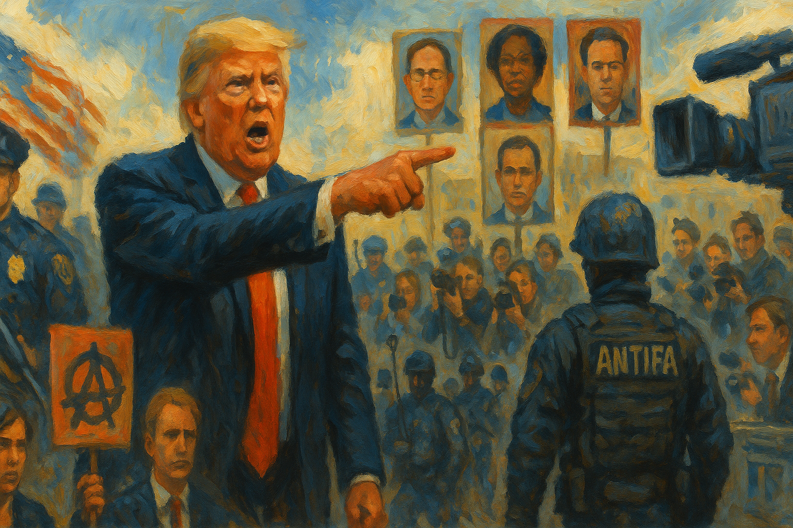

<!-- Generated by build_publish_week_v1 (appendix post) -->
<!-- Header image: image_wide_week36_appendix.png -->

# Week 36 Appendix: A Week Fluent in Retaliation

*Prosecutorial pressure, media coercion, and enforcement expansion moved faster this week, meeting less resistance than before.*

This was a week of overt weaponization of state power against perceived political enemies, marking one of the starkest escalations yet documented. Trump publicly and repeatedly demanded DOJ prosecutions of Comey, James, and Schiff; fired a US Attorney who found insufficient evidence; installed an inexperienced personal loyalist (Halligan) who then obtained a grand jury indictment of Comey within days. Simultaneously, the administration signed sweeping executive actions designating Antifa a domestic terrorist organization and issuing NSPM-7, a memorandum granting law enforcement broad authority to investigate left-leaning nonprofits and activists. Media capture intensified via FCC pressure on ABC/Kimmel, Sinclair's propagandistic Kirk special, and continued affiliate suppression. A bribery investigation into border czar Homan was closed by Trump appointees and then denied by the White House despite documentary evidence. Foreign policy saw erratic tariff threats, an opaque Argentina bailout benefiting a Bessent associate, and sanctions against a Brazilian judge's family. Courts, states, and civil society mounted meaningful resistance throughout.

Power and Authority

1. Trump demanded prosecution of political opponents Comey, James, and Schiff (2025-09-20): The president publicly pressured the attorney general to prosecute named political opponents, converting law enforcement into a tool of personal retribution rather than impartial justice.

2. Trump threatened to fire Attorney General Bondi if she did not indict political enemies (2025-09-20): A threat to remove the attorney general for failing to prosecute opponents shows direct executive coercion of prosecutorial independence.

3. Trump threatened to federalize law enforcement in Washington, DC (2025-09-20): A presidential threat to declare emergency and seize local police authority after the mayor refused ICE cooperation signals disregard for local self-governance.

4. Trump directed appointment of prosecutor to charge political rivals (2025-09-20): Direct presidential instruction to install a loyalist prosecutor to pursue named opponents undermines independence of federal law enforcement.

5. Tulsi Gabbard revoked 37 security clearances without White House advance notice (2025-09-20): An unaccountable, undocumented revocation of clearances for intelligence officials and congressional staff raises concerns about executive oversight and due process.

6. Trump said he plans to designate antifa as a terrorist organization (2025-09-20) *[single source]*: A stated plan to designate a decentralized ideology as a terrorist entity foreshadows expanded government power to target political dissent.

7. Trump signed executive order designating Antifa a domestic terrorist organization (2025-09-22): The order directs federal agencies to investigate and dismantle a decentralized movement, raising First Amendment and due process concerns about criminalizing political ideology.

8. White House Press Secretary Karoline Leavitt defended directing DOJ to investigate political opponents as accountability (2025-09-22) *[single source]*: Official public defense of using the justice department against political rivals normalizes weaponized law enforcement as legitimate governance.

9. Trump threatened military action against Afghanistan over Bagram Airbase (2025-09-20) *[single source]*: A public threat of unilateral military action against a foreign nation without congressional authorization signals potential unchecked war-making power.

10. Trump threatened Venezuela and Afghanistan with unspecified consequences (2025-09-20): Unilateral threats against sovereign nations bypass diplomatic channels and concentrate war-and-peace decisions in the executive alone.

11. Trump ordered military strike on alleged Venezuelan drug boat, killing three (2025-09-20): A lethal military strike ordered without congressional authorization or public evidence raises constitutional concerns about war powers and accountability for use of force.

12. Trump deployed National Guard to Memphis (2025-09-20): Deployment of military troops for domestic law enforcement raises concerns about militarization of policing and limits on federal use of force within states.

13. Karoline Leavitt demanded investigation and firing of UN official over escalator incident (2025-09-23) *[single source]*: A demand for federal investigation and punishment based on an unsubstantiated claim of sabotage shows willingness to weaponize official power over trivial grievances.

14. White House launched investigation into UN escalator malfunction alleging sabotage (2025-09-24): An official investigation into a mechanical malfunction, framed as deliberate sabotage without evidence, illustrates use of executive investigative power for personal grievance.

15. Trump threatened Microsoft executive Lisa Monaco's employment over prior government service (2025-09-26): A presidential demand that a private company fire an employee for her past role in a January 6 investigation constitutes potential abuse of office to punish perceived enemies.

16. Trump threatened political violence in response to ICE facility shooting (2025-09-25): A presidential statement suggesting the political right would respond forcefully to a shooting raised alarms about incitement and normalization of political violence.

17. Trump threatened deployment of National Guard to Portland over sanctuary policies (2025-09-24) *[single source]*: A threat to deploy military forces against a US city over local governance disputes challenges federalism and limits on domestic military use.

18. Trump announced expectation of additional criminal charges against political adversaries (2025-09-26): The president's public statement that more political opponents would face charges confirms an ongoing campaign to use prosecution as retaliation.

Institutions and Governance

1. Senate Democrats introduced reform legislation to codify democratic norms (2025-09-20) *[single source]*: A legislative push to restore norms violated by the executive branch shows institutional pushback, though unlikely to pass a Republican Congress.

2. Senate Democrats forced rehiring of National Weather Service employees (2025-09-20): Congressional pressure that reversed unlawful civil service removals demonstrates legislative capacity to protect institutional independence.

3. Senate Democrats introduced constitutional amendment to overturn Citizens United (2025-09-20) *[single source]*: A proposed amendment to curb corporate campaign spending targets a root cause of money's outsized influence in elections.

4. Senate Democrats preserved USDA field offices in California (2025-09-20) *[single source]*: Legislative intervention to stop closure of federal agency offices shows oversight capacity to protect public service delivery.

5. FBI Director Kash Patel refused to answer Senate questions about Epstein files (2025-09-20) *[single source]*: Evasive testimony before Congress about whether the president appears in investigative files obstructs oversight and transparency.

6. House of Representatives passed bill allowing children as young as 14 to be tried as adults in DC (2025-09-20) *[single source]*: Legislation stripping judicial discretion in juvenile sentencing reduces due process protections for minors in the federal district.

7. Nancy Mace filed censure resolution against Ilhan Omar based on fabricated claims (2025-09-20) *[single source]*: A censure motion citing quotes that do not exist demonstrates abuse of congressional process to punish a political rival.

8. Nancy Mace called for revoking Ilhan Omar's citizenship (2025-09-20): A sitting member of Congress calling to strip a colleague of citizenship represents an extreme attack on constitutional rights.

9. Judge Steven Merryday dismissed Trump's $15 billion defamation lawsuit against the New York Times (2025-09-20) *[single source]*: A federal judge's dismissal of a suit found filled with invective protects press freedom against litigation designed to intimidate journalists.

10. Federal courts halted more than 100 administration policies since January (2025-09-20) *[single source]*: Widespread judicial blocking of executive actions demonstrates continued judicial checks on presidential overreach.

11. Maurene Comey sued Trump administration over unlawful firing (2025-09-20): A former federal prosecutor's lawsuit alleging termination without cause raises questions about politicized removal of career officials.

12. UC students, professors, and staff sued administration over frozen research funding and civil rights demands (2025-09-20): A lawsuit challenges use of civil rights enforcement to suppress academic freedom and coerce university policy changes.

13. Erik Siebert resigned as US Attorney after finding insufficient evidence against Letitia James (2025-09-20): The resignation of a career prosecutor who resisted political pressure signals erosion of prosecutorial independence within the Justice Department.

14. DOJ sued Oregon and Maine over voter registration lists (2025-09-20) *[single source]*: Federal litigation against states over voter data following unproven fraud claims raises concerns about weaponizing the Justice Department against state election administration.

15. House Judiciary Committee Republicans voted against subpoenaing bank executives on Epstein-related transactions (2025-09-23): Blocking a subpoena for financial records limits congressional investigative capacity into transactions tied to a major criminal case.

16. Federal courts ordered restoration of $500 million in UCLA funding (2025-09-23): A court order to restore frozen federal grants shows judicial resistance to unlawful executive withholding of appropriated funds.

17. Speaker Mike Johnson delayed swearing in of elected representative Adelita Grijalva for 43 days (2025-09-23): An unprecedented delay in seating a duly elected representative appears designed to block a discharge petition forcing disclosure of Epstein files.

18. Federal panel began hearing on Texas congressional redistricting map (2025-09-24) *[single source]*: A ten-day hearing to determine whether a racially gerrymandered map dilutes minority voting strength will shape congressional representation ahead of midterms.

19. Clarence Thomas signaled willingness to overturn established constitutional precedent (2025-09-25): A sitting justice's public statement that settled precedent is not sacrosanct raises concerns about the stability of established rights ahead of the new term.

20. Federal judge blocked withholding of emergency management grants conditioned on immigration cooperation (2025-09-24): A court ruling against conditioning disaster funds on immigration enforcement protects states from federal coercion.

21. Federal judge rejected reinstatement request for fired inspectors general despite finding likely legal violations (2025-09-24): A court's refusal to restore watchdogs, despite acknowledging unlawful firing, leaves oversight offices weakened and executive removal power intact.

22. Trump appointed Lindsey Halligan as US Attorney for Eastern District of Virginia (2025-09-20): Installing an inexperienced personal attorney as a federal prosecutor to replace one who resisted political pressure exemplifies politicization of law enforcement.

23. FEMA chief counsel resigned, the third such departure since January (2025-09-20) *[single source]*: Repeated turnover of legal leadership at a key emergency agency suggests institutional strain and politicized pressure on career staff.

24. DOJ removed study on white supremacist violence from its website (2025-09-20) *[single source]*: Suppression of a government study documenting far-right violence trends represents removal of inconvenient factual findings from public record.

25. Pentagon inspector general completed review of Hegseth's use of Signal to share sensitive military information (2025-09-20): Completion of an internal review into unauthorized disclosure of military plans marks an accountability step, pending final report to Congress.

26. Democratic lawmakers demanded answers from Nexstar and Sinclair on Kimmel pre-emption (2025-09-23): Congressional inquiry into possible quid pro quo between broadcasters and the administration signals concern about regulatory capture undermining press freedom.

27. Trump canceled meeting with Democratic leaders on averting a government shutdown (2025-09-23): Cancellation of shutdown negotiations, despite unified Republican control of government, signals contempt for bipartisan legislative process.

28. Senate Committee on Homeland Security and Governmental Affairs issued report finding DOGE violated law and created privacy risks (2025-09-25) *[single source]*: A congressional report documenting illegal data practices and obstruction of oversight by an unaccountable executive body exercises legislative accountability.

29. House and Senate Democrats launched investigation into law firms' agreements with Trump administration (2025-09-24): An inquiry into whether firms doing pro bono work for the administration in exchange for protection violates the law tests accountability for potential quid pro quo arrangements.

30. OMB directed federal agencies to prepare mass firings ahead of a government shutdown (2025-09-24): A shift from standard furlough practice to permanent workforce reductions during a shutdown weaponizes federal employment as budget leverage.

31. James Comey indicted on charges of false statements and obstruction (2025-09-25): The indictment of a former FBI director by a hastily installed loyalist prosecutor, over career prosecutors' objections, exemplifies weaponization of the justice system against a political critic.

32. Oregon Democratic congressional delegation visited ICE facility and publicly challenged administration claims (2025-09-26) *[single source]*: A congressional delegation's oversight visit and public contradiction of the president's claims about a domestic facility demonstrates legislative accountability in action.

33. House Democrats sent letter urging recognition of Palestinian statehood (2025-09-26): A bipartisan-adjacent congressional letter on foreign policy signals legislative attempt to influence executive diplomatic direction.

34. ICE denied congressional oversight access and postponed meeting with Democratic delegation (2025-09-26) *[single source]*: Refusal to allow a congressional facility visit undermines legislative oversight of detention conditions amid escalating protests.

35. House Republicans and White House worked to block a vote on releasing Epstein case files (2025-09-25): Efforts to pressure lawmakers into withdrawing support for a discharge petition obstruct public access to records of significant interest.

36. National Archives and Records Administration improperly released Rep. Sherrill's sealed military records to opponent's ally (2025-09-26): An apparent Privacy Act violation delivering a candidate's confidential records to her opponent's camp raises questions of politicized misuse of federal recordkeeping.

Economic Structure

1. Zeteo reported Trump administration gutted human trafficking programs (2025-09-20) *[single source]*: Cuts to anti-trafficking initiatives and redirection of resources to deportation reduce government capacity to protect vulnerable populations.

2. Trump administration approved UAE AI chip deal alongside $2 billion investment in Trump family crypto company (2025-09-20): Approval of a foreign investment deal coinciding with a separate investment benefiting the president's family business raises conflict-of-interest concerns.

3. Trump issued proclamation restricting H-1B visa entry unless accompanied by $100,000 payment (2025-09-21): A steep new fee on high-skilled foreign workers restructures labor market access and immigration policy through unilateral executive action.

4. ICE conducted large-scale raid on Hyundai battery factory, arresting 475 workers (2025-09-21) *[single source]*: One of the largest immigration raids in recent history targeted a major manufacturing facility, triggering diplomatic fallout and threatening foreign investment.

5. Meidas report documented economic stagnation and deteriorating job market (2025-09-21): Data showing stalled hiring, falling home sales, and reduced worker mobility indicate economic harm attributed to tariff-driven uncertainty.

6. Consumers increased purchases of budget foods amid financial stress (2025-09-21) *[single source]*: Rising sales of low-cost staple foods signal growing financial hardship among working-class households linked to inflation and tariffs.

7. Trump imposed discretionary H-1B visa pricing allowing selective discounts (2025-09-21) *[single source]*: Granting the administration discretionary authority to waive visa fees for favored entities replaces transparent rules with potential political favoritism.

8. Trump announced preferred consortium of billionaires to acquire TikTok's US operations (2025-09-21) *[single source]*: Transferring a major social platform and its vast user data to politically connected billionaires concentrates control over public information with minimal oversight.

9. New York billionaire class and real estate interests mobilized hundreds of millions in campaign funding against a leading mayoral candidate (2025-09-22): Concentrated wealth attempting to override a decisive primary outcome demonstrates outsized financial influence over municipal democratic choice.

10. Sinclair Broadcast Group demanded political donation as condition for restoring suspended programming (2025-09-22): Conditioning a broadcaster's return on financial payment to a partisan organization ties media access directly to political extraction.

11. Forbes report found Trump family net worth doubled since 2024 election, reaching $10 billion (2025-09-22) *[single source]*: Dramatic wealth accumulation by the president's family during his term, driven largely by cryptocurrency and foreign partnerships, raises conflict-of-interest concerns.

12. Chris Wright announced return of $13 billion in green energy funding to treasury (2025-09-24) *[single source]*: Redirecting congressionally appropriated climate funds represents a major reversal of federal clean energy commitments.

13. Trump administration cut Historic Preservation Fund budget by 93 percent (2025-09-25) *[single source]*: A drastic funding cut threatens preservation of Latino heritage sites, undermining public memory and cultural infrastructure for marginalized communities.

14. Trump announced new tariffs on pharmaceuticals, cabinets, furniture, and trucks (2025-09-25): Sweeping new tariffs announced despite prior court rulings against unilateral tariff authority assert executive control over trade policy beyond judicial constraint.

15. Trump administration prepared $20 billion rescue package for Argentina benefiting an ally (2025-09-25): Use of taxpayer funds to support a foreign political ally, while domestic farmers suffered from related trade disruptions, prioritizes personal political interest over economic welfare.

16. Scott Bessent announced $20 billion currency swap with Argentina benefiting a personal associate (2025-09-24) *[single source]*: A major bailout package tied to a Treasury official's personal friendship with a hedge fund investor holding Argentine assets raises serious conflict-of-interest concerns.

17. CPAC promoted Argentina rescue package despite conflicting representation of Argentina's interests (2025-09-24): A political organization tied to the administration promoted a foreign bailout while its affiliated lobbying firm represented that foreign government, blurring lines between domestic messaging and foreign interests.

18. Nexstar sought FCC waiver for $6.2 billion acquisition of Tegna (2025-09-24) *[single source]*: A broadcaster's pending regulatory approval, alongside its suppression of critical programming, raises concerns about quid pro quo dynamics between media consolidation and political favor.

19. Kristi Noem expedited $11 million in disaster aid after contact from a political donor (2025-09-26) *[single source]*: Rapid allocation of federal disaster relief funds following a donor's intervention, while other communities remained unserved, suggests pay-to-play distribution of public resources.

20. Trump announced 50 percent tariff on kitchen cabinets and bathroom vanities (2025-09-26): Unilateral tariffs on consumer goods, justified by national security claims, affect prices and supply chains through executive economic power exercised without congressional authorization.

Civil Rights and Dissent

1. House of Representatives passed juvenile justice bill allowing trial of minors as adults in DC (2025-09-20) *[single source]*: Legislation restricting judicial discretion for youth sentencing weakens due process protections for minors under federal district authority.

2. Renton Police Department / King County Prosecutors arrested and charged suspects in hate crime attack on transgender woman (2025-09-20): Prosecution of a violent attack targeting a transgender woman reflects law enforcement response to protect a vulnerable protected class.

3. US immigration appeals court ordered deportation of journalist Mario Guevara (2025-09-20) *[single source]*: Deportation of a journalist following his arrest at a protest raises concerns about using immigration enforcement to silence press coverage.

4. Pam Bondi demanded employers fire people who disparage Charlie Kirk (2025-09-20): The attorney general's demand for private employers to enforce political speech restrictions represents weaponization of official authority against dissenting expression.

5. Pam Bondi announced DOJ would prosecute hate speech targeting political figures (2025-09-20): A pledge to prosecute broadly defined hate speech risks weaponizing criminal law to suppress political expression and dissent.

6. Todd Blanche floated RICO charges against pro-Palestinian protesters (2025-09-20) *[single source]*: A senior DOJ official's proposal to use organized crime statutes against protesters represents weaponization of law to suppress political dissent.

7. Stephen Miller announced government-wide targeting of an alleged organized campaign despite no evidence (2025-09-20): A senior official's announcement of a sweeping crackdown on a non-existent organized network signals potential abuse of law enforcement against political opposition.

8. Trump administration pressured prosecutors to charge Letitia James despite insufficient evidence (2025-09-20): Political pressure on federal prosecutors to bring charges against an opponent despite a lack of evidence undermines prosecutorial independence.

9. Newsom signed law banning law enforcement face coverings during official business (2025-09-20): A state transparency measure restricting masked enforcement operations asserts due process protections against unmarked federal immigration actions.

10. Trump questioned whether protesters are protected by the First Amendment (2025-09-20) *[single source]*: A sitting president's expressed doubt about constitutional protest rights, alongside discussion of criminal charges against demonstrators, threatens core First Amendment freedoms.

11. Rodney Taylor filed habeas corpus petition challenging ICE detention without bond (2025-09-25) *[single source]*: A legal challenge to prolonged detention without bond tests constitutional limits on immigration enforcement authority.

12. Trump administration fired more than a dozen immigration judges (2025-09-25): Mass removal of immigration judges undermines judicial independence and due process in deportation proceedings.

13. ICE opened detention facility at Angola prison; detainees began hunger strike over medical care denial (2025-09-22) *[single source]*: A hunger strike protesting denied medical care at a repurposed prison facility highlights failures of duty to protect detained immigrants.

14. Trump administration recruited military lawyers as temporary immigration judges (2025-09-22): Appointing unqualified military personnel to preside over deportation cases undermines judicial expertise and due process for immigrants.

15. DHS rejected permit violation claims and attacked Portland mayor (2025-09-24) *[single source]*: A federal agency's dismissal of documented facility violations and attack on a local official reflects a pattern of delegitimizing local oversight of immigration enforcement.

16. Trump administration appointees at HUD halted fair housing enforcement (2025-09-24): Systematic dismantling of federal civil rights enforcement mechanisms reverses decades of progress against housing discrimination.

17. Portland city land-use office issued violation notice to ICE facility for permit breaches (2025-09-24) *[single source]*: A municipal enforcement action against a federal detention facility tests the limits of local authority over immigration enforcement practices.

18. Trump administration issued executive orders targeting lawyer Marc Elias for political opposition work (2025-09-24) *[single source]*: Directing DOJ investigation of a lawyer for representing political opponents threatens attorney-client independence essential to democratic function.

19. Trump signed presidential memorandum targeting activists and nonprofits as a terror network (2025-09-25): A memorandum granting law enforcement broad power to investigate nonprofits and activists based on ideological criteria threatens civil society and free association.

20. DOJ directed investigations into Open Society Foundations (2025-09-26): Coordinated federal investigations into a major philanthropic organization based on presidential grievance exemplify weaponized law enforcement against civil society.

21. ICE detained the superintendent of Iowa's largest school district (2025-09-26): Detention of a sitting public official raises questions about the scope and targeting of immigration enforcement against community leaders.

22. ICE reported non-criminal detainees now outnumber those with criminal records (2025-09-26): Data showing the majority of detainees have no criminal history contradicts stated enforcement priorities and raises due process concerns.

23. Federal officers including US Border Patrol deployed chemical agents and rubber bullets against protesters and a journalist (2025-09-26) *[single source]*: Use of force against peaceful protesters and a reporter covering the scene undermines First Amendment rights to assembly and a free press.

24. John Gillette posted call for execution of Democratic congresswoman (2025-09-25) *[single source]*: A sitting state legislator's public call for a federal representative's execution over protected speech constitutes a direct threat to democratic safety and dissent.

25. ICE officer pushed woman to ground at immigration court (2025-09-25): Documented excessive force against a family member seeking a detained relative's release raises accountability concerns during intensified enforcement.

26. Alaska, Idaho, Iowa, Ohio, Louisiana, Texas, Georgia authorities prosecuted or charged citizens for innocent voter registration mistakes as fraud (2025-09-23): Coordinated multi-state prosecutions treating administrative errors as felony fraud, despite near-zero actual fraud rates, chill lawful voter participation.

27. Sixteen protesters arrested in confrontations with deployed federal border squad in Chicago (2025-09-25): Deployment of federal immigration agents far from their jurisdiction to confront protesters raises concerns about suppression of dissent through militarized enforcement.

28. Trump administration / ICE detained who died in ICE custody at Adelanto facility (2025-09-22) *[single source]*: A death in a privately-run detention facility amid reported neglect of medical needs highlights accountability gaps in immigration detention.

29. ICE detained man who died of alleged liver failure one day after arrest (2025-09-25) *[single source]*: A second detainee death in ICE custody within a week raises systemic concerns about medical screening and detention conditions.

30. Trump administration / HUD dismantled civil rights and detention oversight offices (2025-09-25) *[single source]*: Elimination of independent watchdog offices removes accountability mechanisms for immigration detention conditions and healthcare.

Information, Memory and Manipulation

1. Brendan Carr pressured ABC to suspend Jimmy Kimmel over comments about Kirk (2025-09-20): A federal regulator's pressure on a broadcaster to discipline a comedian over political speech raises concerns about government coercion of editorial independence.

2. MSNBC fired political analyst Matthew Dowd over Kirk commentary (2025-09-20): Termination of an analyst for on-air remarks about political violence illustrates institutional self-censorship under political pressure.

3. Pentagon imposed new restrictions on journalists covering the Department of Defense (2025-09-20): New rules requiring pre-authorization for reporting on unclassified information constitute a prior restraint on press coverage of the military.

4. Washington Post fired columnist Karen Attiah over social media posts (2025-09-20) *[single source]*: Termination of a columnist for commentary on political violence and racial issues shows institutional self-censorship amid broader media pressure.

5. Trump filed $15 billion defamation lawsuit against New York Times (2025-09-20): A presidential lawsuit against a major news organization over critical coverage constitutes litigation designed to intimidate and suppress press freedom.

6. Trump suggested broadcasters critical of him should lose licenses (2025-09-20): A presidential threat to revoke broadcast licenses based on editorial content directly attacks press freedom and First Amendment protections.

7. Trump threatened ABC journalist Jonathan Karl with DOJ prosecution (2025-09-20): A threat to use federal law enforcement against a journalist for asking critical questions represents direct intimidation of the press.

8. Trump threatened Australian Broadcasting Corporation reporter (2025-09-20): A threat against a foreign journalist for a legitimate question about conflicts of interest demonstrates intimidation of the press using diplomatic leverage.

9. JD Vance made baseless claims about left-wing political violence (2025-09-20) *[single source]*: A vice president's use of an official platform to spread disproven claims about political violence inflames partisan divisions with false information.

10. Sen. Adam Schiff claimed FBI director misrepresented Epstein client list (2025-09-21) *[single source]*: Allegations that the FBI director's public claims about an evidence list contradicted years of prior official statements raise transparency concerns.

11. Pennsylvania Governor Shapiro reported chilling effect on Spanish-language radio host's speech (2025-09-21) *[single source]*: A journalist's admitted self-censorship out of fear of federal regulatory retaliation indicates the reach of regulatory pressure on speech.

12. Stephen Miller delivered speech using totalitarian propaganda rhetoric at Kirk memorial (2025-09-21): A senior official's dualistic, dehumanizing rhetoric echoing historical propaganda tactics normalizes extreme language toward political opponents.

13. Trump announced acetaminophen restrictions for pregnant women based on unproven autism claims (2025-09-22): Public promotion of a scientifically unsupported medical claim by the president undermines evidence-based public health guidance for maternal care.

14. Trump promoted dangerous medical misinformation on vaccines and Tylenol at press conference (2025-09-22): A presidential press conference repeating debunked vaccine-autism claims and urging avoidance of a safe medication endangers public health decisions.

15. FDA hosted antidepressant risk panel staffed with skeptics (2025-09-22): A federal health panel stacked with individuals hostile to evidence-based treatment undermines maternal mental health care and scientific credibility.

16. Sinclair Broadcast Group forced Kimmel off air and produced propaganda special sanitizing Kirk's extremist record (2025-09-22): A broadcaster's suppression of critical commentary paired with a whitewashed memorial special demonstrates weaponization of local news for political messaging.

17. Gavin Newsom criticized GOP consolidation of media platforms as censorship (2025-09-22): A state governor's warning about partisan control over information platforms highlights concerns about erosion of independent media.

18. Trump made false claim comparing autism rates in Cuba to the US (2025-09-22) *[single source]*: A demonstrably false public health claim linking autism rates to medication access spreads misinformation that could influence health decisions.

19. Sinclair and Nexstar continued pre-emption of Kimmel's show after ABC reinstatement (2025-09-24): Continued suppression of a reinstated program by affiliate owners, one of which seeks FCC merger approval, suggests possible regulatory leverage over editorial decisions.

20. Trump made unsubstantiated claims linking paracetamol to autism in pregnancy (2025-09-23): Repeated public promotion of a disproven medical claim by the president risks deterring necessary treatment and undermines trust in scientific guidance.

21. CNN fact-checker Daniel Dale documented multiple false claims in Trump's UN speech (2025-09-23) *[single source]*: Extensive fact-checking of falsehoods about the economy, wars, and energy policy delivered to a global audience undermines the credibility of official statements.

22. Harris Faulkner characterized Trump's UN speech as raw truth despite fact-checked falsehoods (2025-09-23) *[single source]*: A major news host's mischaracterization of a fact-checked-false speech as truthful contributes to erosion of shared factual standards.

23. John Thune characterized Trump's UN speech as unvarnished truth (2025-09-23) *[single source]*: The Senate Majority Leader's endorsement of a speech containing documented falsehoods fails to exercise oversight of presidential accuracy.

24. MAGA social media users promoted unfounded conspiracy theory about UN escalator sabotage (2025-09-23): Rapid spread of an unfounded conspiracy theory about a mechanical malfunction illustrates how false narratives proliferate despite contradicting evidence.

25. Karoline Leavitt promoted unfounded sabotage claims about UN equipment (2025-09-23) *[single source]*: A White House official's spread of unsubstantiated sabotage allegations, later contradicted by UN officials, demonstrates use of official platforms to promote false narratives.

26. Ron Johnson made misleading drug safety comparison between Tylenol and ivermectin (2025-09-23) *[single source]*: A senator's use of raw death counts without accounting for usage rates distorts public health information in support of anti-medication rhetoric.

27. Trump delivered UN speech containing multiple false claims about wars and economy (2025-09-23) *[single source]*: A presidential address to a global audience containing numerous fact-checked falsehoods undermines US credibility and the integrity of international discourse.

28. Trump threatened litigation against ABC over Kimmel's return (2025-09-23) *[single source]*: A threat of lawsuits against a media company for airing a critical host signals continued use of legal threats to chill press criticism.

29. Trump alleged triple sabotage at UN without evidence, demanding arrests (2025-09-24): A presidential demand for arrests over an unproven sabotage claim exemplifies use of unsubstantiated conspiracy narratives to delegitimize international institutions.

30. Trump complained about Jimmy Kimmel's return and threatened ABC (2025-09-24): A presidential threat to test legal action against a network over a reinstated critical program demonstrates continued coercion of media outlets.

31. Over 100 former ABC journalists called for corporate defense of press freedom (2025-09-24) *[single source]*: A collective public appeal by former journalists warns that media companies are capitulating to political pressure and abandoning editorial independence.

32. Trump and NRCC attributed ICE facility shooting to radical left terrorists without evidence (2025-09-25): Rapid politicization of a violent incident to delegitimize opposition suppresses honest accountability discourse about the causes of the attack.

33. Trump posted medical misinformation on vaccine schedules and Tylenol use (2025-09-26): Continued presidential promotion of misinformation contradicting established medical guidance risks undermining public trust in vaccines and pediatric care.

34. Guardian analysis documented pattern of shooters inscribing messages on shell casings for media amplification (2025-09-26): Analysis of how violent actors exploit news coverage and law enforcement disclosure to spread extremist messaging illustrates manipulation of the information environment.

35. Pete Hegseth affirmed Medal of Honor awards for soldiers involved in Wounded Knee Massacre (2025-09-26) *[single source]*: Reversal of a review into medals awarded for a massacre of Indigenous civilians officially rewrites a historical atrocity as honorable service.

36. Trump delivered UN speech attacking allies including London mayor and UK green policies (2025-09-24) *[single source]*: Use of an international platform to spread disproven claims about an allied nation's officials and policies undermines diplomatic norms and institutional credibility.

