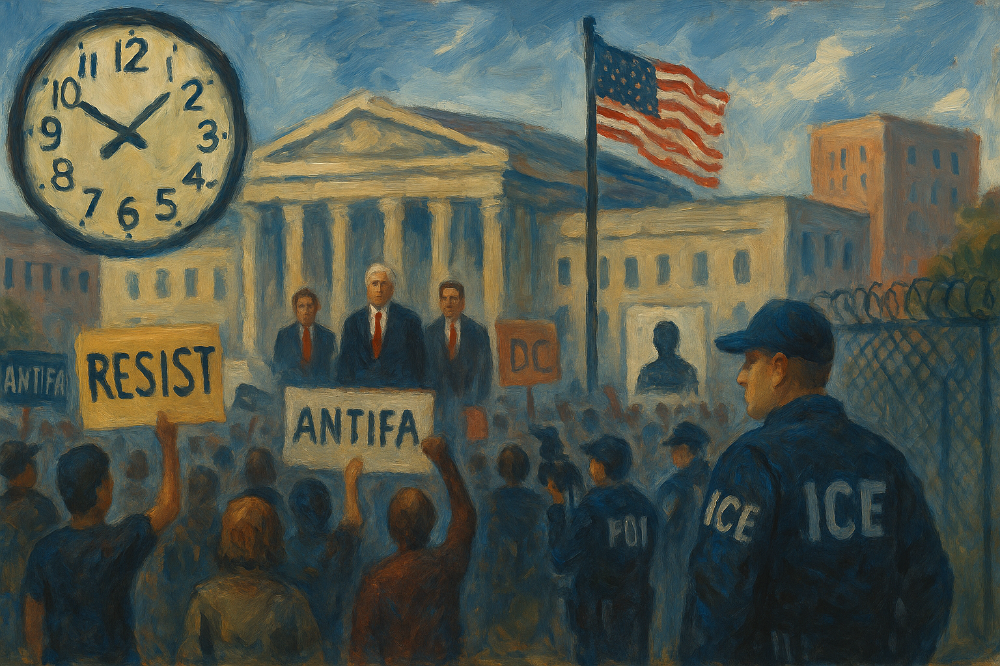

<!-- Generated by build_publish_week_v1 -->
<!-- Header image: image_wide_week36.png -->

# Week 36: Law, Hunger, and Silence as Leverage

*With the clock frozen, the administration deepened its use of law, security, and data to punish critics, coerce states, and narrow who counts as fully protected.*

> When the law is bent to favor friends and ruin enemies, it ceases to be law and becomes a weapon with a seal. — Anonymous legal maxim
> The most dangerous moment is not when the tyrant breaks the rules, but when the guardians learn to look away. — From a twentieth-century jurist
> Democracy does not die when the doors are slammed; it dies when the doors remain open but fewer people dare to walk through. — Civic reflection

The thirty-sixth week of Trump’s second term did not hinge on a single shock. It unfolded as a dense layering of moves that, taken together, made the state feel less like a common instrument and more like a weapon in partisan hands. The pattern was not new, but the confidence with which it was applied across law enforcement, information, and economic power gave the week its character. It was a week in which the tools of democracy were used to narrow who counted as a full participant in it.

At the close of Week 35, the Democracy Clock stood at 8:08 p.m. It ended Week 36 at the same time, with no net change in minutes. The stillness in the measure did not reflect calm. It reflected a balance between deepening authoritarian practices and pockets of institutional resistance. Courts blocked some grant conditions and defamation claims. States and civil society pressed for transparency and oversight. But the core pattern held: executive power was used to redefine dissent as threat, to bend justice toward friends and against critics, and to make access to protection and truth contingent on loyalty.

The most consequential changes this week ran through the Justice Department. On paper, the department’s mission did not change. In practice, its capacity and priorities were reworked. House Judiciary Democrats documented that DOJ’s Public Integrity Section, once staffed with thirty-six attorneys, had been reduced to two. That quiet hollowing out mattered. It meant fewer lawyers to investigate bribery, conflicts of interest, and abuses of office. It meant that even when evidence surfaced, there were fewer hands to carry cases forward.

The Tom Homan bribery case showed what that meant in concrete terms. Homan, Trump’s border czar, had been recorded accepting $50,000 from undercover agents. Yet DOJ leadership closed the investigation and publicly denied he had taken a bribe. Congressional Democrats launched oversight inquiries, demanding documents and explanations. A watchdog group filed a FOIA request for the tapes themselves. On the surface, the system still had channels for challenge. But the decision to shut the case down, despite recorded evidence, sent a clear signal about who would and would not face corruption charges.

At the same time, the department moved aggressively against figures who had crossed Trump. Former FBI Director James Comey was indicted on charges of lying to Congress and obstruction, after an earlier office had declined to bring the case. The indictment came only after an acting U.S. attorney who resisted the prosecution was removed and replaced with Lindsey Halligan, a Trump lawyer with no prosecutorial background. As the statute of limitations neared, Halligan’s office rushed to file charges. Venue and personnel had been adjusted until the desired outcome appeared.

Former CIA Director John Brennan faced a similar turn. DOJ opened a criminal investigation into his role in the 2016 Russia interference assessments, extending a pattern of targeting intelligence officials who had scrutinized Trump’s campaign. Representative Dan Goldman warned that DOJ probes were being steered by presidential demands. The pattern was uneven enforcement. Allies like Homan were shielded, while critics like Comey and Brennan were pursued with unusual zeal.

Around these headline cases, Congress’s handling of the Jeffrey Epstein files showed how scrutiny of elite networks could be blunted. House Judiciary Committee Republicans voted against subpoenaing major bank CEOs over Epstein-linked transactions. House Oversight leaders delayed releasing related records and blocked a floor vote on broader disclosure. FBI Director Kash Patel refused to answer questions about his own appearance in Epstein documents. Some Epstein schedules and files did reach the Oversight Committee, naming high-profile visitors and donors, but the overall posture was one of slow-walking and containment.

There were countercurrents. A federal judge dismissed Trump’s $15 billion defamation suit against the New York Times, criticizing its abusive rhetoric and reinforcing limits on using civil courts to punish critical media. Other courts had halted over a hundred administration policies in more than four hundred lawsuits, reinstating civil servants and restoring CDC funding. These rulings showed that parts of the judiciary still functioned as a check. Yet the Supreme Court moved in the opposite direction on key questions of executive power, granting stays that allowed Trump to keep a removed FTC commissioner out of office and to pause congressionally appropriated foreign aid. The net effect was to weaken neutral enforcement of corruption laws while strengthening presidential leverage over regulators and spending.

If the justice system was being bent, the security apparatus was being re-aimed. Trump signed executive orders designating Antifa as a domestic terrorist organization. The orders did not define a discrete group so much as label a diffuse tendency. That vagueness was the point. It created a framework to treat a wide range of protest and left-leaning activism as terrorism. Days later, a presidential memorandum directed investigations of domestic terrorism with a focus on left-wing groups and nonprofits, framing them as part of a “terror network.”

Congress, for its part, approved a massive $170 billion allocation to ICE to support deportations over four years, with a stated goal of removing one million immigrants annually. That funding entrenched a high-capacity enforcement machine. Data showed that ICE was now detaining more immigrants with no criminal record than those with one. A disabled detainee filed a habeas petition challenging prolonged confinement and inadequate medical care. Nineteen detainees at Louisiana’s Angola prison launched a hunger strike over harsh conditions, lack of services, and medical neglect. Their protest drew attention to the use of a former maximum-security prison as an immigration detention site.

The human cost of this apparatus surfaced in individual stories. ICE detained Des Moines school superintendent Ian Roberts on an old removal order, disrupting local education leadership and sending a message about how deeply immigration enforcement could reach into civic life. In New York, an ICE officer pushed a detainee’s wife to the ground at immigration court, an incident captured on video that led to his removal from duty. Farmworker activist Alfredo Juarez Zeferino was held under such conditions that he ultimately chose voluntary departure. California officials opened an investigation into the death of a Mexican man in ICE custody, while a Los Angeles car wash owner filed a $50 million suit over an ICE raid.

The security frame extended beyond immigration into protest policing. Police in Michigan and Los Angeles used teargas and other crowd-control chemicals on demonstrators, with reports of long-term reproductive health impacts. Protesters at a small pro-Palestinian demonstration outside Benjamin Netanyahu’s New York hotel were arrested, as security perimeters around diplomatic events narrowed the space for expressive activity. City of Portland officials issued a notice of violation to an ICE detention facility for exceeding permit limits, an example of local government trying to assert some control over federal operations on its soil. But the larger pattern was clear. Extraordinary powers justified in the name of terrorism and border security were being used to constrain dissent and to make certain communities feel permanently at risk.

Federal power was also turned inward, against states, school districts, and voters. The Agriculture Department froze more than $10 million in food assistance for Kansas because the governor refused to share beneficiary data, using hunger relief as leverage in a federal–state dispute. DHS withheld $65 million in grants from magnet schools over their trans-inclusive policies, punishing districts financially for maintaining protections for transgender and nonbinary students. These were not abstract fights. They affected whether low-income families could buy food and whether schools could keep programs running.

At the same time, Trump ordered the Justice Department to sue multiple states for detailed voter rolls and identifying information. DOJ filed suits against six states, demanding extensive voter data under the banner of election oversight. The lawsuits expanded federal reach into election administration and raised fears that personal information could be misused for partisan ends. The president publicly framed these efforts as necessary for “integrity,” even as they risked chilling participation and intimidating local officials.

Shutdown brinkmanship became another tool of coercion. Trump canceled meetings with Democratic leaders on government funding as a shutdown loomed. His budget officials signaled they expected a shutdown and emphasized its impact on Democratic constituencies. The president went further, threatening to fire, rather than furlough, large numbers of federal employees during a funding lapse. OMB directed agencies to prepare for large-scale reductions in force, turning a budget impasse into an opportunity to purge programs and staff misaligned with presidential priorities. The House passed a continuing resolution to fund the government through late November, but the Senate rejected it, and the administration showed little interest in compromise.

Alongside these pressures, the administration moved to darken the data landscape. USDA canceled its annual food insecurity survey and ended its household food security report, erasing a decades-old series that tracked hunger trends. The Bureau of Labor Statistics postponed its consumer expenditures report after Trump fired its commissioner for unfavorable jobs data. The White House dismissed these measures as politicized. The effect was to remove key benchmarks for understanding inflation and hardship, making it harder for Congress, states, and the public to assess the impact of policy choices.

The National Archives illustrated how records themselves could be politicized. On one hand, NARA invited public comment on proposed federal records schedules, maintaining a formal process for deciding what information would be preserved or destroyed. On the other, it improperly released Representative Mikie Sherrill’s nearly unredacted military records to an ally of her gubernatorial opponent. That release weaponized confidential service records in an election, undermining privacy protections and trust in archival neutrality. State Department staff, meanwhile, warned that ambassadorships were going unfilled and that personnel were being judged on “fidelity,” suggesting that even internal data about performance and loyalty were being used to reshape the diplomatic corps.

Information control did not stop at data and records. It extended to the press and entertainment. At the Pentagon, reporters were required to sign pledges not to gather unauthorized information and faced new restrictions on their movement inside the building. These rules curtailed independent reporting on military affairs and signaled that access could be conditioned on compliance. The Federal Communications Commission threatened ABC affiliates’ licenses over Jimmy Kimmel’s on-air criticism of Trump, using regulatory power to punish a broadcaster for unfavorable content.

ABC and its parent company, Disney, suspended Kimmel’s show amid this pressure, then reinstated it after public backlash. Even after reinstatement, major station groups like Sinclair and Nexstar refused to air the program on their ABC affiliates, filtering political satire out of local airwaves. Trump himself called negative coverage and heckling “really illegal,” urged prosecutions, and framed Kimmel’s show as an illegal campaign contribution. The combined effect of presidential rhetoric, regulatory threats, and corporate caution was to narrow the space for televised criticism.

The administration’s approach to truth was on display at the United Nations. From the UN podium, Trump urged nations to close borders and expel foreigners, attacked UK green and migration policies with debunked claims, and repeated false narratives about sharia law in London and climate agreements. He portrayed an escalator malfunction at the UN as deliberate sabotage and a security threat, demanding investigations into supposed efforts to undermine his speech and movements. These episodes turned a diplomatic forum into a stage for disinformation and personalized grievance.

At home, Trump promoted unproven claims linking acetaminophen and vaccines to autism, targeting pregnant women with anti-vaccine and anti-Tylenol rhetoric. These statements, amplified by state-aligned platforms, undercut evidence-based health guidance and deepened reliance on politicized narratives. The administration also introduced a “Presidential Walk of Fame” display that omitted Joe Biden’s portrait, replacing it with an autopen image. This symbolic curation of recent history, combined with the misuse of archival records and suppression of inconvenient data, showed how memory itself was being shaped to flatter the incumbent and sideline disfavored figures.

Foreign policy and economic tools were wielded in similarly personalized ways. Trump ordered lethal strikes on Venezuelan vessels alleged to be drug smugglers, without providing evidence to Congress or the public. He threatened Afghanistan with unspecified “bad things” if it did not return Bagram Airbase, using social media to issue warnings that bypassed normal diplomatic channels. He announced the end of military assistance to NATO countries bordering Russia and publicly questioned whether threats to European cities would trigger U.S. defense commitments. These moves weakened alliance assurances and signaled a more transactional approach to collective security.

Sanctions and tariffs became instruments of retaliation. The administration imposed a 50 percent tariff on Brazilian goods in response to anger over Jair Bolsonaro’s coup conviction and ordered sanctions on the wife of a Brazilian Supreme Court justice involved in that case. These actions politicized trade and human-rights tools, punishing a foreign judiciary for domestic accountability. Domestically, Trump announced sweeping tariffs on pharmaceuticals, furniture, cabinets, and trucks, despite prior court limits on his tariff powers. He proposed using tariff revenue to bail out farmers hurt by his own trade policies, centralizing both the infliction of economic pain and the distribution of relief.

Aid and financial support followed ideological lines. The State Department moved to redirect $1.8 billion in foreign aid away from long-standing democracy and health programs toward “America First” projects. Treasury prepared a $20 billion support package for Argentina’s government, an allied administration, outside normal appropriations processes. FEMA and Homeland Security expedited $11 million in disaster aid for a pier project in Naples, Florida, after a political donor’s intervention. These decisions blurred the line between technocratic policy and patronage, making it harder to distinguish governance from reward.

Inside the government, the civil service and military were reshaped to align more closely with presidential preferences. Trump’s threats to fire civil servants during a shutdown, combined with OMB’s planning for reductions in force, turned job security into a tool of discipline. DNI Tulsi Gabbard revoked thirty-seven security clearances for intelligence officials and congressional staff without notifying the White House, disrupting oversight and showing how access to classified information could be used punitively. At the Pentagon, Defense Secretary Pete Hegseth dissolved the advisory committee on women in the armed services and summoned hundreds of generals and admirals to an unusual mass meeting, signaling an effort to recast military culture through direct political messaging.

Agency missions were narrowed or reversed. HUD leadership rolled back Fair Housing Act enforcement and imposed gag orders on civil-rights staff, weakening the federal capacity to combat segregation and discrimination. The Energy Department returned $13 billion in green project funds to the Treasury, reversing climate-related investments and favoring fossil-fuel interests. Congress’s massive ICE funding increase, combined with DHS moves to overhaul the H‑1B visa lottery to favor higher-paid applicants and Trump’s sudden $100,000 fee per H‑1B worker, tilted immigration and labor policy toward wealthier employers and away from lower-status workers.

Outside Washington, some institutions pushed back. California’s governor signed a law banning most law enforcement officers from covering their faces on duty, aiming to increase transparency and accountability in policing. Renton, Washington prosecutors charged suspects in a brutal attack on a trans woman under hate-crime statutes, using existing law to defend a targeted community. Young climate activists filed a human-rights petition against the U.S. government over fossil fuel support, turning to international forums to challenge domestic policy. These actions did not reverse federal trends, but they showed that alternative models of rights enforcement and stewardship still existed.

The week also saw an escalation in how opposition was described. Trump publicly pressured the attorney general to prosecute named political enemies, called negative coverage “really illegal,” and signed a memo targeting lawyers who had litigated against his administration for professional discipline. DOJ planned investigations into a Soros-funded group at his urging. In Arizona, state representative John Gillette used social media to call for Representative Pramila Jayapal to be “tried, convicted and hanged” for supporting non-violent protest. That language did not come from the fringe alone. It echoed a broader framing in which critics and left-wing activists were cast as criminals, traitors, or terrorists.

There were scheduled points of decision on the horizon. The House’s short-term funding bill set a new deadline of November 21 for government financing, ensuring that shutdown brinkmanship would return. DOJ’s voter-data suits against six states began their path through the courts, with hearings and rulings to come. The Supreme Court’s stays on foreign aid and regulatory appointments signaled that further decisions on executive power over spending and independent agencies were pending. Each of these processes would test whether the institutional resistance glimpsed this week could hold.

In the arc of Trump’s second term, Week 36 marked not a leap but a deepening. Emergency frames around terrorism and border security were normalized and extended into domestic politics. Law enforcement and prosecution were steered more openly by personal and ideological priorities. Economic and foreign-policy tools were used to reward allies and punish adversaries, at home and abroad. Information, from hunger statistics to military records, was curated to serve the incumbent’s narrative. The clock did not move because the balance between erosion and resistance held, but the direction of pressure was clear. Rights and protections still existed, yet invoking them demanded more courage and carried greater cost. The structures that might once have absorbed and corrected abuses were themselves being bent, one procedural decision at a time.

<!-- Synopses for cross-posting -->
Long Synopsis: Week 36 of Trump’s second term brought no single rupture, but a dense layering of moves that left the state feeling less like a shared instrument and more like a partisan weapon. The Democracy Clock held at 8:08 p.m., masking a volatile balance between deepening authoritarian practices and scattered resistance. At the Justice Department, the Public Integrity Section was quietly hollowed out while the Tom Homan bribery case was closed despite recorded evidence, even as prosecutors were pushed to indict James Comey and investigate John Brennan. A domestic terrorism order targeting Antifa and a memo casting left-leaning groups as a “terror network” re-aimed security powers at dissent, while Congress poured $170 billion into ICE as it detained more non‑criminal immigrants and faced hunger strikes over brutal conditions. Federal agencies froze Kansas food aid, punished trans‑inclusive schools, and sued states for voter data, even as USDA and BLS erased key hunger and inflation metrics. Pentagon press pledges, FCC license threats over Jimmy Kimmel, and politicized archival leaks tightened control over information and memory. Courts, states, and civil society won scattered victories, but the week’s throughline was the normalization of law, hunger, and data as tools of leverage.
Short Synopsis: The clock stayed at 8:08 p.m. as law enforcement, security, and economic tools were repurposed to shield allies, target critics, coerce states, and darken the data needed to hold power accountable.

