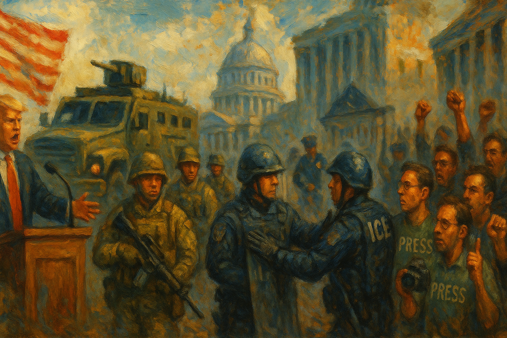

<!-- Generated by build_publish_week_v1 (appendix post) -->
<!-- Header image: image_wide_week37_appendix.png -->

# Week 37 Appendix: Stalemate That Still Consolidates

*Military threats, weaponized prosecutions, and a shutdown wielded as leverage were matched by court rulings, leaving the clock unmoved but the republic more strained.*

This week marks one of the most consequential ruptures yet documented: the federal government shut down amid a manufactured healthcare standoff, while the administration simultaneously moved to militarize domestic cities, purge accountability structures, and punish perceived enemies through prosecution and funding cuts. Trump directed active-duty and National Guard troops toward Portland and floated using American cities as 'training grounds,' framing domestic political opponents as an 'enemy from within' to assembled military brass — rhetoric with direct historical analogues to authoritarian consolidation. Simultaneously, DOJ leadership fired a prosecutor for declining to indict Comey, closed a documented bribery case against an ally, and gutted the Public Integrity Section. OMB weaponized the shutdown to impound billions in funding exclusively from Democratic states and cities. Racist AI-generated deepfakes of congressional leaders were distributed by the President himself and displayed in the White House briefing room. Courts, however, delivered real pushback — blocking birthright-citizenship efforts, FEMA fund diversion, and the Portland deployment attempt — showing institutional resistance still functions, though under severe strain.

Power and Authority

1. Trump directed National Guard and active-duty troop deployment to Portland, authorizing full force (2025-09-27): The president ordered military deployment to a US city based on disputed claims of unrest, raising constitutional concerns about domestic use of force.

2. Trump warned military commanders of an 'enemy from within' and floated using US cities as training grounds (2025-09-30): The president told hundreds of military leaders that domestic cities were akin to a war zone, blurring lines between civilian governance and military force.

3. Trump declared a formal armed conflict with drug cartels, classifying suspected smugglers as unlawful combatants (2025-10-02): The administration claimed extraordinary wartime powers without congressional authorization, expanding executive military authority domestically and abroad.

4. Trump threatened to withhold federal funds from New York City based on a mayoral election outcome (2025-09-29) *[single source]*: The president threatened to punish a city financially depending on which candidate voters chose, raising concerns about coercion of local elections.

5. USDA froze food assistance funding to Kansas after the state refused to share beneficiary data (2025-09-27) *[single source]*: Federal agriculture officials withheld food aid to compel a state to surrender citizen data, using welfare funding as political leverage.

6. Russell Vought impounded billions in appropriated funds for infrastructure and climate projects, targeting Democratic-led states and cities (2025-10-02): The budget director unilaterally withheld congressionally approved money based on partisan criteria, testing limits on executive control over spending.

7. Trump announced plans to use the government shutdown to make irreversible cuts to programs favored by Democrats (2025-09-30): The president said he would exploit a funding lapse to permanently eliminate programs, converting a fiscal crisis into a tool for one-sided policy change.

8. Trump posted about installing gold fixtures and décor in the Oval Office (2025-09-28): The president publicized lavish personal remodeling of a public office, raising questions about use of executive space for self-glorification.

9. Trump signed an executive order guaranteeing NATO-like security protection to Qatar (2025-09-29): The president unilaterally committed US military force to defend a foreign nation without Senate treaty ratification, expanding executive war-power reach.

10. Trump posted an executive order continuing federal advisory committees (2025-09-29): Routine continuation of federal advisory bodies had minimal independent democratic impact this week.

11. Trump signed an executive order directing federal agencies to use artificial intelligence for pediatric cancer research (2025-09-30): The order mobilized federal resources toward a public-health goal, representing an ordinary use of executive authority.

12. Trump signed a proclamation imposing new tariffs on timber, lumber, and wood products under national-security authority (2025-09-29): The president used a national-security rationale to impose significant tariffs unilaterally, expanding presidential control over trade policy.

13. Trump administration signed a memorandum authorizing government-wide investigations into activists and nonprofits framed as domestic terrorism (2025-10-03) *[single source]*: A sweeping directive expanded federal investigative power over political critics and civil-society groups under a terrorism label.

14. Trump continued the national emergency declaration regarding Syria for another year (2025-09-30): Extension of an existing emergency declaration preserved broad sanctions authority without new congressional review.

15. Trump issued a presidential determination setting the fiscal year 2026 refugee admissions ceiling and transferred resettlement administration to HHS (2025-09-30): The administration reshaped refugee policy and reorganized which federal agency oversees resettlement of vulnerable populations.

16. Trump signed an executive order establishing a quick reaction force trained to quell domestic civil disturbances (2025-09-30): The order created a standing domestic rapid-response military capability, raising concerns about bypassing legal limits on military use in law enforcement.

Institutions and Governance

1. House Judiciary Committee opened investigations into the closure of the Homan bribery case (2025-09-27) *[single source]*: Congressional Democrats sought records after the Justice Department dropped a documented bribery investigation into a senior official, testing oversight capacity.

2. State of Texas filed a court submission conceding partisan motivation behind a contested congressional redistricting map (2025-09-27) *[single source]*: The state's own filing undercut its legal defense in a redistricting case affecting minority voter representation.

3. First District Court of Appeal ruled Florida's 1987 open-carry ban unconstitutional (2025-09-27) *[single source]*: A state appellate ruling struck down a longstanding firearms restriction, creating enforcement confusion pending legislative clarification.

4. American Federation of Government Employees filed a lawsuit challenging the deferred resignation program as exceeding congressional authority (2025-09-28): A federal workers' union sought judicial review of a mass workforce-reduction program, testing checks on executive personnel authority.

5. Rudy Giuliani settled a $1.3 billion defamation lawsuit with Dominion Voting Systems (2025-09-28): The settlement resolved a major case over false election-rigging claims, establishing further legal accountability for spreading election disinformation.

6. Clarence Thomas signaled willingness to overturn long-standing precedents on church-state separation and gay marriage (2025-09-28): A sitting justice publicly indicated readiness to revisit major constitutional rulings affecting religious liberty and equal rights.

7. Oregon sued the Trump administration to block National Guard deployment to Portland (2025-09-28): A state challenged federal military deployment within its borders, asserting constitutional limits on executive use of force domestically.

8. Iowa Board of Educational Examiners revoked a school superintendent's education license after his ICE arrest (2025-09-28) *[single source]*: A state licensing action removed a school official from his post following federal immigration enforcement, raising due-process and transparency questions.

9. Trump administration fired more than 100 immigration judges and cleared 600 military lawyers to fill vacant judge seats (2025-09-28) *[single source]*: Mass removal of experienced immigration judges and their replacement with unqualified personnel undermined judicial independence and due process.

10. Trump administration oversaw the largest mass resignation of federal workers in US history through a deferred resignation program (2025-09-28) *[single source]*: Over 100,000 federal workers left government service amid reported fear and pressure, degrading civil-service capacity and institutional stability.

11. Trump appointed a White House aide with no prosecutorial experience as US attorney to pursue charges against James Comey (2025-09-28): The appointment of an inexperienced loyalist to prosecute a political opponent demonstrated politicization of federal law-enforcement leadership.

12. House Speaker Mike Johnson canceled House sessions to delay the swearing-in of a newly elected representative (2025-09-29): Blocking a duly elected member's seating prevented a discharge petition from reaching the threshold needed to force release of Epstein investigation files.

13. Senate failed repeatedly to pass competing funding bills, triggering a government shutdown (2025-09-30): Congress's failure to fund the government disrupted federal operations and furloughed hundreds of thousands of workers.

14. Oregon attorney general sued to block federalization of the state's National Guard troops (2025-09-29) *[single source]*: A state's chief legal officer challenged federal seizure of state militia forces, raising fundamental federalism questions.

15. DOJ Civil Rights Division filed a civil rights lawsuit against pro-Palestinian activists under a law traditionally used to protect abortion clinics (2025-09-29): Selective use of a civil rights statute against protesters, while curtailing its abortion-clinic application, suggested partisan enforcement of law.

16. Federal judge blocked the reallocation of $233 million in FEMA disaster funds from Democratic-led states (2025-09-30): A court stopped the administration from redirecting disaster relief funds away from twelve states, checking executive fiscal maneuvering.

17. Federal judge issued a 161-page ruling finding the administration's deportation of pro-Palestinian academics unconstitutionally chilled free speech (2025-09-30) *[single source]*: A detailed judicial opinion found the government retaliated against protected speech through immigration enforcement, defending First Amendment protections.

18. Federal judge ruled that Trump's acting US attorney for Nevada was not validly serving (2025-09-30) *[single source]*: A court stripped authority from an improperly appointed federal prosecutor, marking a repeated judicial check on administration appointments.

19. Federal labor unions sued to block mass firings of federal employees during the shutdown (2025-09-30): Unions challenged the administration's plan to use a funding lapse as cover for permanent layoffs, testing legal limits on shutdown-driven personnel actions.

20. Trump administration federal agencies issued coordinated statements blaming Democrats for the shutdown, in apparent Hatch Act violation (2025-09-30): Multiple agencies used official channels for partisan political messaging, undermining the civil service's legal obligation to political neutrality.

21. Federal prosecutors recommended an 11-year sentence for Sean Combs following his conviction (2025-09-30): Ordinary federal sentencing proceedings continued in a high-profile criminal case without direct bearing on democratic institutions.

22. Anthony Kennedy warned in an interview that democracy is not guaranteed to survive and criticized rising Supreme Court partisanship (2025-10-01): A retired justice's public warning about judicial partisanship and democratic fragility highlighted concerns about institutional legitimacy.

23. Supreme Court deferred a stay application in Trump's bid to remove Federal Reserve Governor Lisa Cook, scheduling oral arguments for January (2025-10-01): The Court declined to immediately grant the president's request to remove an independent Fed governor, preserving the status quo pending full review.

24. DOJ indicted New York Attorney General Letitia James on bank fraud charges (2025-10-01): The prosecution of a state official who previously won a fraud judgment against the president's business raised concerns about political retaliation.

25. Democracy Docket analysis reported that the Supreme Court's new term includes cases threatening voting rights and mail-in ballot access (2025-10-02): Multiple pending cases could weaken remaining Voting Rights Act protections and restrict mail voting nationwide.

26. Trump administration withdrew the nomination of E.J. Antoni to lead the Bureau of Labor Statistics (2025-10-02): Bipartisan opposition forced withdrawal of a partisan nominee for a key economic statistics agency, preserving some institutional independence.

27. U.S. District Judge Waverly Crenshaw rebuked the Justice Department for what appeared to be a vindictive prosecution of an undocumented immigrant (2025-10-03): A federal judge found the administration may have prosecuted a man in retaliation for winning a lawsuit against his own unlawful deportation.

28. Federal court rejected the administration's attempt to end birthright citizenship as unconstitutional (2025-10-03): A second appellate court found the administration's effort to redefine constitutional citizenship unlawful, reinforcing judicial checks on executive overreach.

29. U.S. District Judge Karin Immergut heard arguments over the legality of the federalized National Guard deployment to Portland (2025-10-03): A court weighed the factual and legal basis for military deployment in a domestic city, testing limits on executive use of force.

30. Oregon attorney general filed a lawsuit to block deployment of federalized National Guard troops to Portland (2025-10-03) *[single source]*: A renewed state legal challenge sought a restraining order against continued military presence in a US city.

31. DOJ Assistant Attorney General Harmeet Dhillon opened a civil rights investigation into the Portland Police Department's handling of ICE protests (2025-10-03): A federal civil rights probe into local police conduct was accompanied by public statements suggesting prejudgment of the outcome.

32. SCOTUS issued a series of routine procedural orders including certiorari grants, stays, and briefing schedules (2025-09-30): The Court's routine docket management this week had limited independent democratic significance.

33. Multiple federal courts issued numerous procedural rulings on stays, injunctions, and case management in pending litigation against the administration (2025-10-01): A large volume of routine litigation tracking showed courts continuing to actively process legal challenges to administration policy across many fronts.

Economic Structure

1. Republican congressional leaders advanced a provision shielding pesticide makers from lawsuits in an appropriations bill (2025-09-27) *[single source]*: A liability shield for pesticide manufacturers would strip citizens of legal recourse for health injuries, prioritizing corporate immunity over consumer protection.

2. Trump administration reallocated nearly $2 billion in congressionally appropriated foreign aid toward administration priorities (2025-09-27): Redirecting funds already appropriated by Congress without authorization tested the boundary between executive discretion and legislative control of spending.

3. Tom Homan participated in detention facility contracting despite a prior pledge to recuse himself over past consulting ties (2025-09-27): A senior official's involvement in contracting for a company that previously paid him raised conflict-of-interest concerns in immigration detention expansion.

4. Trump announced new tariffs on furniture and movies produced outside the United States (2025-09-29): New tariff announcements carried potential inflationary effects for consumers and disrupted international trade relationships.

5. Trump administration approved a $20 billion bailout package for Argentina that Trump acknowledged would not significantly benefit the United States (2025-09-29): A major foreign financial commitment appeared to primarily benefit a hedge fund manager with personal ties to the Treasury Secretary rather than US interests.

6. YouTube settled a lawsuit with Trump for $24.5 million, directing funds to a White House ballroom project and allied political groups (2025-09-29): A private company's litigation settlement funneled money toward the president's personal project and political allies, blurring corporate and presidential interests.

7. Jared Kushner resumed a central foreign-policy advisory role while expanding business partnerships with the Saudi government (2025-09-29): A presidential relative advising on Middle East policy simultaneously profited from deals with a foreign government whose interests that policy affects.

8. Energy Department cut nearly $8 billion in climate-related funding and froze $18 billion in New York City infrastructure projects (2025-10-02): Federal agencies canceled major infrastructure and climate investments exclusively in states led by the opposition party, weaponizing budget authority.

9. Russell Vought froze $2.1 billion in Chicago transit funding, citing race-based contracting concerns (2025-10-03): Another major transit-funding freeze targeted a Democratic-led city, extending a pattern of selectively withholding federal infrastructure money.

10. Wisconsin Planned Parenthood suspended abortion services due to a Medicaid defunding provision in federal tax legislation (2025-10-02): A federal funding provision forced a healthcare provider to halt legal medical services in a state where abortion remains legal, restricting reproductive healthcare access.

11. FTC sued Zillow and Redfin for allegedly suppressing competition in rental advertising (2025-09-30): A federal antitrust lawsuit addressed anticompetitive conduct affecting housing-market competition and consumer costs.

12. ADP reported private-sector job losses for September, including a downward revision of August figures (2025-10-02): Independent economic data showed weakening employment conditions, gaining added importance as government statistics faced political interference.

13. Kristi Noem awarded a $200 million advertising contract bypassing competitive bidding, benefiting a firm with ties to her senior staff (2025-10-02): A cabinet secretary used emergency authority to steer a large contract to associates without normal procurement safeguards, raising corruption concerns.

14. Trump announced tariff-funded aid to soybean farmers hurt by his own trade policies (2025-10-02): The administration used tariff revenue to subsidize farmers harmed by its own trade war, creating a selective relief program for one constituency.

15. Energy Department terminated 321 awards across 223 energy projects with minimal public explanation (2025-10-02) *[single source]*: A sweeping cancellation of federally funded energy projects lacked detailed justification, raising transparency concerns about the decision-making process.

16. Wealthiest 10 percent of Americans added $5 trillion in wealth during the second quarter amid ongoing market gains (2025-10-03) *[single source]*: Accelerating wealth concentration during a period of shutdown and economic instability highlighted disparities in who benefits from market growth.

17. Various federal agencies issued routine regulatory notices, guidance documents, and information-collection requests (2025-09-27): A large volume of ordinary administrative rulemaking and paperwork actions continued without significant independent democratic impact.

Civil Rights and Dissent

1. FBI searched former national security adviser John Bolton's home and office over classified documents allegations (2025-09-27): A search targeting a vocal presidential critic raised concerns about selective enforcement and retaliation against political opponents.

2. Trump administration launched a criminal investigation into former CIA director John Brennan over past intelligence assessments (2025-09-27): A probe into a former official's professional assessments, motivated by presidential animus, suggested politicization of law enforcement against critics.

3. HUD rolled back enforcement of the Fair Housing Act, obstructing discrimination cases (2025-09-27) *[single source]*: Reduced enforcement of a foundational civil rights law opened housing markets to discrimination against protected classes.

4. ICE separated more than 100 US citizen children from their parents through immigration enforcement (2025-09-27) *[single source]*: Family separations involving citizen children raised due-process and constitutional concerns about immigration enforcement practices.

5. Thomas Jacob Sanford carried out a mass shooting and arson attack at a Mormon church in Michigan, killing at least four people (2025-09-27): A politically-linked mass shooting targeting a religious congregation raised concerns about escalating political violence and public safety.

6. Trump administration pressured immigration judges to dismiss asylum cases so detainees could be reassigned to emergency deportation (2025-09-28) *[single source]*: Circumventing judicial review to meet deportation quotas undermined due process protections for asylum seekers.

7. DHS launched 'Midway Blitz,' an intensified immigration enforcement operation in Illinois (2025-09-28): A large-scale enforcement operation, including reported wrongful detention of US citizens, expanded aggressive immigration policing in a sanctuary jurisdiction.

8. ICE routinely arrested immigrants outside courthouses to meet deportation quotas (2025-09-28) *[single source]*: Arresting people at their own legal proceedings undermined due process and deterred lawful engagement with the justice system.

9. Trump fired a federal prosecutor and indicted former FBI director James Comey on charges of lying to Congress (2025-09-28): Removing a prosecutor who declined to bring charges, then indicting a political opponent through a replacement, exemplified weaponized prosecution.

10. Stephen Miller announced that additional indictments were coming against former officials and a former president (2025-09-28): A senior official publicly signaled plans for further prosecutions of political opponents, framing them as insurrectionists.

11. Northwestern University blocked over 300 students from enrolling for refusing to complete a mandatory antisemitism training (2025-09-28) *[single source]*: Coercive enforcement of a contested training raised questions about academic freedom and compelled speech tied to federal compliance pressure.

12. Spencer Cox publicly called for an end to political violence following Charlie Kirk's killing (2025-09-28): A governor's plea against escalating political violence reflected institutional concern over the health of democratic discourse.

13. DOJ prosecuted multiple veterans for participating in protests against ICE raids and National Guard deployments (2025-09-29) *[single source]*: Federal charges against veterans engaging in protest activity signaled potential suppression of dissent and militarized response to civil demonstrations.

14. Trump administration deported dozens of Iranians back to Iran without due process following a deal with Tehran (2025-09-29) *[single source]*: Removing people to a country where they may face persecution, without adequate legal process, raised international law and human rights concerns.

15. Ruwa Romman announced her candidacy for Georgia governor (2025-09-29) *[single source]*: A candidacy from an underrepresented community entering a major statewide race signaled evolving political representation.

16. Pregnancy Justice released research documenting over 400 pregnancy-related criminal prosecutions across 16 states since Roe was overturned (2025-09-30) *[single source]*: Systematic criminal prosecution of pregnant women, disproportionately affecting low-income women, represented a direct attack on reproductive rights and equal justice.

17. Louisiana and Texas attorneys general indicted and sued out-of-state abortion providers, and sued a New York clerk who refused to enforce a Texas fine (2025-09-30) *[single source]*: Escalating interstate legal actions tested whether abortion-restricting states could reach across state lines to punish providers and officials protected by shield laws.

18. ICE held immigrant families, including children, in prolonged detention exceeding legal limits at a Texas facility (2025-09-30) *[single source]*: Detained children were held far longer than the legal 20-day limit amid documented denial of clean water and adequate medical care.

19. DOJ sued Minnesota over its sanctuary city immigration policies (2025-09-30) *[single source]*: A federal lawsuit targeted a state's autonomy to limit cooperation with immigration enforcement, part of a broader campaign against sanctuary jurisdictions.

20. Federal agents conducted a militarized raid on a Chicago apartment building, arresting 37 people with no criminal charges ultimately filed (2025-09-30): A large show-of-force raid detained dozens without substantiated criminal evidence, exemplifying disproportionate enforcement tactics against civilians.

21. ICE agents assaulted three journalists at an immigration court in New York City (2025-09-30): Physical assault of reporters covering immigration proceedings represented a direct attack on press freedom during enforcement operations.

22. US citizen plaintiff sued over warrantless ICE detentions despite showing valid identification (2025-09-30): A citizen challenged repeated warrantless detentions by immigration agents, asserting constitutional protection against unreasonable search and seizure.

23. Trump threatened mass layoffs of federal workers during the shutdown, targeting them as Democrats (2025-09-30): Framing layoffs along partisan lines during a shutdown suggested using government employment as a tool of political retaliation.

24. DOJ opened investigations into George Soros and the Open Society Foundations following presidential calls to prosecute him (2025-10-01): A politically motivated investigation into a major funder of civil-society organizations suggested weaponization of federal power against political opposition.

25. Kash Patel fired an FBI employee for displaying a Pride flag that supervisors had previously approved (2025-10-01) *[single source]*: Termination for protected expression, later challenged in a wrongful-termination lawsuit, represented retaliation against LGBTQ visibility within federal law enforcement.

26. ICE arrested and detained a record roughly 65,000 people, including thousands with no criminal record, during the shutdown (2025-10-01) *[single source]*: A surge in enforcement produced record detention levels, with many people held despite lacking criminal convictions, raising due-process concerns.

27. Department of Homeland Security rescinded guidelines limiting ICE arrests near schools (2025-10-01): Removing protections for sensitive locations increased immigration enforcement near schools, threatening students' access to education without fear.

28. Trump indicted political opponents James Comey and Letitia James through a Trump-installed prosecutor after removing a skeptical career prosecutor (2025-10-01): Continued prosecution of political rivals after replacing a prosecutor who found the evidence weak reinforced a pattern of weaponized justice.

29. Sonoma County Superior Court sentenced an animal-rights activist to 90 days in jail and over $100,000 in restitution for a rescue-motivated slaughterhouse trespass (2025-10-01) *[single source]*: A significant criminal sentence for civil disobedience raised questions about proportionality in punishing protest-motivated property offenses.

30. OpenAI launched an AI video generator whose safeguards failed to prevent violent, racist, and fraudulent content within hours (2025-10-01): Ineffective content moderation allowed rapid spread of harmful synthetic media, undermining trust in the shared information environment.

31. Trump administration froze federal infrastructure and climate funding to Democratic-led states amid shutdown negotiations (2025-10-02) *[single source]*: Additional funding freezes reinforced a pattern of directing federal resources away from opposition-led jurisdictions during the shutdown.

32. Federal agent shoved Democratic congressional candidate Kat Abughazaleh to the ground during a protest (2025-10-03): Physical force against a political candidate exercising free speech rights, paired with official retaliatory social-media posts, exemplified suppression of dissent.

33. Kristi Noem and Pam Bondi publicly threatened prosecution against the founder of a civic app tracking ICE agents' locations (2025-10-03): Federal officials threatened legal consequences for lawful speech, chilling civic tools meant to inform communities about enforcement activity.

34. Immigration Judge (Baltimore) denied asylum to Kilmar Ábrego García amid an ongoing administration campaign against him (2025-10-03) *[single source]*: Denial of asylum to a man with deep US family ties, following a public vilification campaign, exemplified erosion of due process protections for immigrants.

35. ICE deported journalist Mario Guevara to El Salvador after 100 days in custody following his arrest while covering protests (2025-10-03) *[single source]*: Deporting a journalist detained after covering protests raised direct concerns about press freedom and retaliation against reporters.

36. Trump administration launched Operation Midway Blitz enforcement action in Chicago, using force against protesters (2025-10-03): A major enforcement operation combined mass detention with threats of military deployment against a Democratic-led city.

37. Department of Homeland Security announced over 1,000 arrests in Chicago while making largely unsubstantiated claims about detainees' criminal histories (2025-10-03) *[single source]*: Mass arrest announcements relied on unverified claims of serious criminality despite federal data showing most detainees had no convictions.

38. ICE agents deployed teargas and pepper balls against protesters at the Broadview immigration facility (2025-10-03): Use of chemical irritants and physical force against roughly 100 demonstrators suppressed lawful protest activity outside a detention center.

39. Trump administration deployed federal forces to Portland amid ongoing immigration-related protests (2025-10-03): Continued federal deployment to a US city, despite legal challenges, kept pressure on demonstrators opposing immigration enforcement.

40. Immigration lawyer Aaron Reichlin-Melnick reported that drug trafficking prosecutions fell to a multi-decade low as resources shifted toward immigration enforcement (2025-09-29) *[single source]*: Diverting law enforcement resources from drug prosecution to immigration enforcement raised questions about public safety prioritization.

41. Trump administration threatened sanctions against Laos to pressure it into accepting deportees without a formal repatriation agreement (2025-09-29): Coercive use of sanctions to force deportation acceptance instrumentalized foreign policy for domestic enforcement priorities.

42. Trump administration determined that Minnesota's transgender athlete policy violated federal law, threatening enforcement action (2025-09-30): A federal intervention in state education policy targeted transgender athlete protections under threat of enforcement.

43. Israeli forces intercepted a humanitarian aid flotilla in international waters and detained hundreds of activists, including Greta Thunberg (2025-10-01): Interception of a civilian humanitarian mission, with alleged mistreatment of detained activists, raised concerns about treatment of dissenters under international law.

44. Democracy Defenders Fund announced that over 3,700 groups signed a letter criticizing administration intimidation of charitable organizations (2025-10-01) *[single source]*: A broad civil-society coalition publicly condemned executive intimidation tactics targeting nonprofit organizations.

45. US Department of Energy directed employees to avoid using climate-related terminology in official work (2025-10-01) *[single source]*: Restricting scientific language among federal employees suppressed factual discussion of climate policy within a government science agency.

46. Over 100 left-leaning nonprofits pledged coordinated legal and strategic defense against targeting under the administration's domestic-terrorism memo (2025-10-03) *[single source]*: A large coalition of nonprofits organized collective resistance to federal threats against civil-society organizations.

47. Major law firms warned clients that a domestic-terrorism executive memo could be used to target left-leaning nonprofits (2025-10-03) *[single source]*: Legal advisories signaled institutional recognition that a broad terrorism designation risked chilling protected political speech and association.

48. Carolyn Feinstein lost her Department of Justice position, which she and her husband attributed to retaliation over a civic ICE-tracking app (2025-10-03): A federal employee's termination, linked by the family to her spouse's activism, suggested retaliation against relatives of civic critics.

49. Robert Morris pleaded guilty to child sexual abuse committed decades earlier (2025-10-02): The conviction of a prominent religious figure and former presidential adviser closed a long-pending accountability matter for child sexual abuse.

50. Louisiana Governor Jeff Landry requested extended National Guard deployment to Louisiana cities despite falling crime rates (2025-09-29) *[single source]*: A governor's request for prolonged military presence in cities with declining crime raised questions about militarizing routine policing.

Information, Memory and Manipulation

1. Trump administration installed a 'Presidential Walk of Fame' at the White House replacing Biden's portrait with an autopen photo (2025-09-27): Erasing a predecessor from official displays signaled disregard for democratic succession and normalized historical revisionism.

2. Trump ordered declassification of decades-old Amelia Earhart records hours after new Epstein documents were released (2025-09-28): The timing of an unrelated declassification order raised questions about whether executive power was used to divert attention from documents implicating the president.

3. Dr. Andrea Baccarelli provided expert testimony on Tylenol risks that a court found misrepresented study results, while advising Trump health officials (2025-09-27) *[single source]*: A conflicted, discredited medical advisor's influence on presidential health policy undermined scientific integrity in public communications.

4. House Oversight Committee Democrats released a third batch of documents from the Epstein investigation mentioning Trump and other prominent figures (2025-09-27): Release of previously withheld investigative records improved public access to information about a major criminal case implicating officials.

5. Kash Patel publicly contradicted Trump's false claim that hundreds of FBI agents incited the January 6 Capitol attack (2025-09-28) *[single source]*: An FBI director's correction of the president's false statement highlighted institutional friction over the historical record of a major attack on democracy.

6. Trump posted false claims that the FBI planted 274 agents in the January 6 crowd (2025-09-28): The president spread a debunked conspiracy theory contradicted by an official inspector general report, undermining public understanding of the Capitol attack.

7. Trump posted medical advice on vaccines and Tylenol contradicting mainstream expert guidance (2025-09-28): Using an official platform to spread medically unsound advice undermined public health authority and evidence-based communication.

8. Trump shared and later deleted a deepfake video promoting a fictional 'MedBed' healthcare conspiracy theory (2025-09-28) *[single source]*: Deliberate dissemination of fabricated medical claims during active healthcare negotiations undermined trust in public information.

9. Mike Johnson continued repeating a debunked claim that 274 FBI agents were present in the January 6 crowd after being corrected (2025-09-28): A senior congressional leader spread a false narrative after official correction, perpetuating misinformation about the Capitol attack.

10. Elon Musk disputed media reporting on newly released Epstein documents naming him (2025-09-28): A public figure's dispute over reporting accuracy on official documents highlighted contested narratives around the Epstein files.

11. Sebastian Gorka accused Governor Newsom of inciting violence in response to a political criticism (2025-09-28): A senior official used a past assassination to falsely accuse a critic of inciting murder, escalating rhetorical hostility.

12. Trump posted a doctored deepfake video of Democratic leaders featuring racist imagery (2025-09-29) *[single source]*: The president distributed AI-generated content depicting opposition leaders in demeaning stereotypes during active budget negotiations.

13. Trump posted a second doctored deepfake video mocking a Democratic leader with racist caricature (2025-10-01) *[single source]*: A follow-up deepfake continued the pattern of using fabricated racist imagery against political opponents.

14. Department of Education altered furloughed employees' out-of-office email messages without consent to blame Democrats for the shutdown (2025-10-02): Unauthorized manipulation of federal employees' official communications inserted partisan messaging, violating rules on political neutrality.

15. JD Vance made false public claims that Democrats demanded healthcare funding for undocumented immigrants to justify the shutdown (2025-10-02) *[single source]*: The vice president's deliberate misstatement about the shutdown's cause misled the public on the substance of the legislative dispute.

16. Trump administration displayed racist deepfake videos of Democratic leaders on loop in the White House briefing room (2025-10-02): Official government space was used to amplify fabricated racist content targeting political opponents, normalizing disinformation from within government.

17. White House issued a press release misrepresenting scientific studies to support a claim linking Tylenol to autism (2025-10-02) *[single source]*: Official distortion of scientific evidence to support a health claim undermined trust in government communication on medical matters.

18. Corey Lewandowski criticized a Super Bowl halftime performer based on perceived political views (2025-10-02): A presidential adviser's public criticism of an entertainer's politics reflected efforts to police cultural expression along ideological lines.

19. Trump administration suspended Voice of America broadcasts and furloughed its journalists during the shutdown (2025-10-02) *[single source]*: Shutting down a government-funded international broadcaster contradicted a court order reinstating its employees and reduced independent information flow.

20. Labor Department withheld the monthly jobs and unemployment report during the shutdown (2025-10-03): Withholding official economic data reduced public access to information necessary for informed economic decision-making.

21. Trump designated 'antifa' as a major terrorist organization despite it being a decentralized ideology rather than a formal group (2025-10-03) *[single source]*: A terrorism designation applied to a loosely organized political ideology conflated protected dissent with criminal terrorism, expanding potential enforcement reach.

22. Federal agencies posted coordinated partisan messages blaming Democrats for shutdown-related service cuts (2025-10-03): Continued use of official government channels for one-sided political messaging corroded the neutrality expected of public communications.

23. Apple removed a crowdsourced app tracking ICE agent locations after pressure from the Trump administration (2025-10-03): Removal of a civic monitoring tool under government pressure restricted a channel of information that helped citizens track law-enforcement activity.

24. Tom Watson apologized for rude crowd behavior at an international sporting event (2025-09-29) *[single source]*: A private cultural incident had no significant bearing on the health of democratic institutions.

25. USDA canceled the decades-old federal food insecurity survey used to guide assistance funding decisions (2025-09-27) *[single source]*: Eliminating a long-running data collection tool removed a key evidence base for allocating food assistance to vulnerable populations.

26. USDA placed food-insecurity researchers on leave two days after canceling their primary survey (2025-09-27): Sidelining the researchers responsible for evidence-based food policy signaled retaliation and suppression of independent analysis.

27. DOJ continued declining to release Epstein investigative files despite prior campaign promises (2025-09-27): Ongoing withholding of investigative records undermined transparency commitments and public accountability for documented misconduct allegations.

28. Marjorie Taylor Greene publicly committed to continuing calls for Epstein file release despite pressure from Trump (2025-09-28): A congressional representative asserted independence from executive pressure on a matter of public transparency.

29. Howard Lutnick made public statements alleging Epstein used blackmail videos and speculated about a possible cover-up (2025-10-02): A sitting Cabinet secretary's public speculation about a deceased sex offender's operations raised questions about what officials know regarding potential cover-ups.

30. Trump repeated the false claim that he won the 2020 presidential election (2025-09-30): Continued denial of a settled election outcome sustained an attack on the legitimacy of peaceful transfers of power.

31. HUD posted a partisan banner on its official website blaming the 'radical left' for the shutdown (2025-09-30): A federal agency's use of its public website for one-sided political messaging represented an apparent violation of political-neutrality rules.

32. Veterans Affairs issued a partisan statement blaming 'radical liberals' for the shutdown (2025-09-30): A federal agency's spokesperson used inflammatory partisan language in an official statement, politicizing government communications.

33. White House violated the Hatch Act by directing federal agencies to send emails blaming Democrats for the shutdown (2025-09-30): Coordinated use of government resources for partisan messaging across multiple agencies violated laws meant to keep the civil service politically neutral.

34. Trump posted intimidating images of Democratic leaders with campaign merchandise on the Resolute Desk (2025-09-30): The president used social media imagery apparently intended to humiliate opposition leaders during active shutdown negotiations.

35. Trump used systematically false crime statistics to justify potential military deployment against American cities (2025-09-30) *[single source]*: Citing debunked crime data to justify domestic military action undermined fact-based governance and created a pretext for force against civilians.

36. Paramount hired an ideologically aligned editor with no broadcast experience to lead CBS News and acquired her partisan publication (2025-10-01) *[single source]*: A major broadcaster's leadership change and acquisition of a partisan outlet raised concerns about politicization of a national news division.

37. Virginia Giuffre had her posthumous memoir documenting trafficking survival become a bestseller (2025-10-01) *[single source]*: Publication of a survivor's testimony created a lasting public record of institutional failure and abuse, supporting historical accountability.

38. Edi Rama publicly mocked Trump's false claims about brokering a peace deal between two countries never at war (2025-10-02) *[single source]*: A foreign leader's public mockery highlighted the fabrication of a diplomatic accomplishment claimed by the president.

39. Trump administration named three progressive organizations as targets under a domestic-terrorism policy memo (2025-10-03) *[single source]*: Publicly naming organizations for targeting based on ideological opposition raised concerns about selective enforcement against dissenting civil society.

