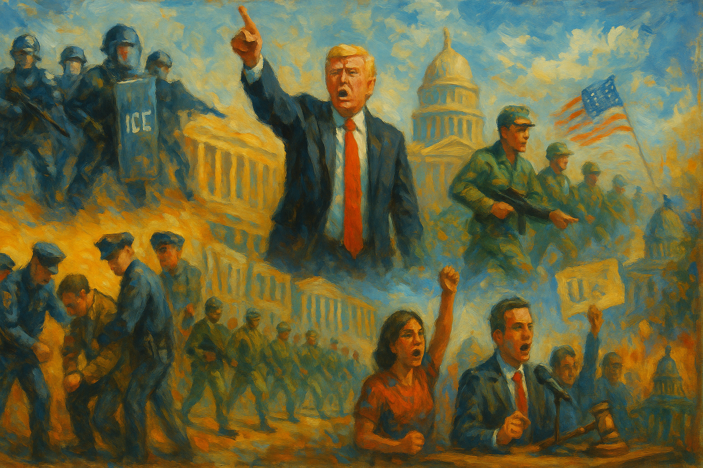

<!-- Generated by build_publish_week_v1 (appendix post) -->
<!-- Header image: image_wide_week39_appendix.png -->

# Week 39 Appendix: Shutdown as Weaponized Governance

*With Congress stalled, the White House turned budgets, law enforcement, and public memory into tools for punishing opponents and narrowing democratic space.*

This week shows a sharp consolidation of executive power and a coordinated assault on multiple democratic guardrails. The administration weaponized law and bureaucracy against opponents (Antifa “terrorist” designation, Soros RICO probe, Bolton and Comey/James indictments, IRS targeting plans) while simultaneously purging and constraining the civil service through mass layoffs, a sweeping federal hiring freeze, and loyalty-driven purges. Federal power and money were openly used as partisan weapons: shutdown-driven layoffs and selective funding freezes hit Democratic regions hardest, while crony bailouts and foreign-policy quid pro quos with Qatar, Saudi Arabia, and Argentina deepened emoluments-style corruption. Civil liberties came under pressure from militarized immigration raids, threats to invoke the Insurrection Act, domestic troop deployments, and a new NSPM redefining dissent as extremism. Press freedom and academic autonomy were attacked via Pentagon gag rules, defamation suits, campus compacts, and student-media censorship. At the same time, courts, states, universities, unions, and media mounted notable resistance—blocking Guard deployments, layoffs, ICE abuses, H‑1B fees, and Pentagon press rules—highlighting that while structural pressure toward competitive authoritarianism is intense, countervailing institutions are still active but under strain.

Power and Authority

1. President Trump signed a memo designating Antifa as a domestic terrorist organization (2025-10-11): The memo used terrorism framing against a loosely defined leftist movement, expanding executive power to surveil and disrupt political opponents without clear statutory authority.

2. President Trump announced plans to impose 100% tariffs on Chinese imports (2025-10-11): The unilateral tariff threat asserted presidential control over trade policy traditionally shared with Congress, risking economic disruption while testing limits on executive authority in economic governance.

3. President Trump exempted the AI sector and its supply chain from broad tariffs (2025-10-12): Shielding AI from tariffs highlighted selective use of trade tools to favor strategic industries, concentrating state support in sectors aligned with national power and influential firms.

4. Vice President JD Vance said the administration was considering invoking the Insurrection Act to deploy National Guard in Democratic-led cities (2025-10-12): Floating Insurrection Act deployment against unrest in opposition-run cities normalized extraordinary domestic military powers as a tool for managing protest and local governance.

5. President Trump issued an executive order guaranteeing Qatar’s security and naming it a steadfast ally (2025-10-14): Granting NATO-style security assurances to Qatar after major gifts and investments blurred lines between national security commitments and personal or financial ties.

6. President Trump ordered the firing of nearly all staff in the Office of Population Affairs (2025-10-14): Gutting the office overseeing family-planning programs concentrated policy control in political appointees and threatened continuity of reproductive health services nationwide.

7. President Trump proclaimed Columbus Day as a celebration of the “original American hero” (2025-10-13): The proclamation advanced a white Christian nationalist narrative of U.S. history, using presidential symbolism to marginalize critical accounts of conquest and Indigenous suffering.

8. President Trump promoted an ideological shift away from the Social Security model of government (2025-10-14): Framing social welfare as contrary to “rugged individualism” signaled an executive push to roll back the state’s protective role, weakening support for broad-based social rights.

9. President Trump issued an executive order tightly restricting federal civilian hiring (2025-10-15): The hiring order centralized staffing decisions in political hands and constrained agencies’ ability to fill positions, increasing executive leverage over the civil service.

10. President Trump issued an executive order declaring that any armed attack on Qatar threatens U.S. peace and security (2025-10-14): Extending a de facto security guarantee to Qatar without treaty ratification expanded presidential war-and-peace commitments outside normal congressional processes.

11. President Trump announced plans for a triumphal arch and privately funded White House ballroom in Washington (2025-10-16): Leader-centric monuments and lavish renovations funded by private donors entwined personal glorification with public space, raising concerns about influence and symbolic dominance.

12. President Trump claimed authority to pay furloughed troops using future-year Pentagon funds despite legal doubts (2025-10-16): By asserting power to repurpose appropriated defense funds without Congress, the president challenged statutory budget controls and expanded unilateral fiscal authority.

13. President Trump directed the Pentagon to reallocate research funds to cover military payroll during the shutdown (2025-10-14): Redirecting research money to pay troops during a funding lapse prioritized military pay over legal appropriations processes, deepening executive control over budget execution.

14. President Trump fired independent inspectors general and other watchdogs viewed as disloyal (2025-10-16): Removing internal watchdogs weakened institutional checks on executive misconduct and signaled that oversight roles depend on political loyalty.

15. President Trump pardoned January 6 rioters who assaulted police officers (2025-10-16): Pardoning violent participants in an attack on Congress undermined accountability for political violence and encouraged future lawless action by regime-aligned actors.

16. President Trump purged career officials deemed disloyal from federal agencies (2025-10-16): Targeted removals of nonpartisan staff further politicized the bureaucracy, eroding neutral expertise and entrenching loyalty-based governance.

17. President Trump announced a national strategy and NSPM redefining certain beliefs as indicators of violent extremism (2025-10-16): The memorandum broadened security definitions to include ideological positions, enabling expanded surveillance and disruption of peaceful political and religious dissent.

18. President Trump deployed federal troops to U.S. cities in response to unrest (2025-10-16): Domestic troop deployments blurred civil–military boundaries and risked intimidating protesters and local officials, weakening civilian control norms.

19. President Trump announced lethal strikes on boats off Venezuela’s coast in anti-drug operations (2025-10-15): Repeated lethal actions in international waters, justified with limited transparency, expanded executive war-making and raised questions about proportionality and oversight.

20. President Trump authorized covert CIA operations, including lethal force, to pressure Venezuela’s government (2025-10-15): Secret authorization of lethal covert operations for regime change in Venezuela deepened opaque uses of force with minimal public or congressional scrutiny.

21. President Trump announced a $20 billion bailout for Argentina later doubled to $40 billion (2025-10-15): The Argentina bailout, acknowledged as offering little U.S. benefit while aiding a hedge fund ally, illustrated executive use of public funds to favor connected investors.

22. President Trump agreed to a $142 billion arms sale to Saudi Arabia following major Saudi investments in Trump-linked entities (2025-10-14): The massive arms package intertwined U.S. security policy with private financial relationships, heightening concerns about emoluments and foreign influence.

23. President Trump accepted a $400 million luxury jet from Qatar for use as Air Force One (2025-10-14): Accepting an extravagant state gift tied to later policy shifts toward Qatar blurred personal enrichment and official decision-making in foreign relations.

24. President Trump oversaw a $2 billion pre-sale of a Trump-linked stablecoin to a UAE state fund (2025-10-14): The early stablecoin purchase by a foreign sovereign fund, followed by chip-export concessions, showed state policy intertwined with private digital-asset ventures tied to the president.

25. President Trump announced he had ordered destruction of a boat in the Caribbean, killing six people (2025-10-14): Publicly touting lethal maritime action as a presidential decision highlighted personalized control over use of force with limited legal explanation.

26. President Trump announced a meeting with Vladimir Putin in Budapest to discuss ending the war in Ukraine (2025-10-16): The planned summit signaled a personalized diplomatic approach to a major war, raising questions about alignment with broader democratic and alliance interests.

27. President Trump pressured Republican-led states to redraw congressional maps to eliminate Democratic districts (2025-10-17): Presidential pressure on states to gerrymander for partisan gain used informal power to tilt electoral structures in favor of the ruling party.

28. President Trump publicly attacked judges and called for impeachment of U.S. judges at the urging of El Salvador’s president (2025-10-12): Endorsing rhetoric to impeach judges over adverse rulings further eroded respect for judicial independence and encouraged politicized attacks on the courts.

29. President Trump used automated government email replies to blame Democrats for the shutdown (2025-10-11): Using official email systems for partisan blame messaging violated norms against politicizing government resources and blurred lines between state communication and campaign propaganda.

30. President Trump announced a national strategy to investigate liberal groups as potential domestic terror networks (2025-10-11): Targeting funding and investigations at ideologically defined “domestic terror networks” expanded executive tools to suppress dissenting civil society organizations.

31. President Trump directed the Justice Department to investigate George Soros’ Open Society Foundations under RICO (2025-10-11): Launching a RICO probe into a major philanthropic organization closely associated with opposition causes weaponized criminal law against a perceived political enemy.

32. President Trump announced a crackdown on legal immigration including a $100,000 H-1B fee, refugee cuts, and law-enforcement powers for USCIS (2025-10-11): Sweeping changes to legal immigration raised financial and enforcement barriers, stratifying access to residency and work by wealth and origin.

33. President Trump announced mass layoffs and threatened firing 4,200 federal employees during the shutdown (2025-10-11): Using large-scale layoffs as leverage in a budget standoff turned federal employment into a bargaining chip, pressuring workers and Congress alike.

34. President Trump announced selective cancellation and freezing of over $27 billion in federal funds, mostly in Democratic areas (2025-10-14): Targeted funding cuts during the shutdown used federal spending power to punish political opponents and reshape regional resource distribution.

35. President Trump canceled federal funding for the Gateway Tunnel project between New York and New Jersey (2025-10-15): Canceling a major, previously agreed infrastructure project undermined long-term planning and signaled that large public works can be reversed for short-term political reasons.

36. President Trump cut a $20 million flood-protection grant for the Alaska Native village of Kipnuk (2025-10-15): Eliminating disaster-protection funding for a vulnerable Indigenous community prioritized budget cuts over basic safety, exacerbating inequality in climate resilience.

37. President Trump announced plans to change IRS leadership and investigative practices to target left-leaning groups and donors (2025-10-15): Politicizing IRS criminal investigations threatened to turn tax enforcement into a tool against political opponents rather than a neutral application of law.

38. President Trump pressured universities to sign a federal higher-education compact tying funding to policy changes (2025-10-15): Offering preferential funding in exchange for curbs on DEI and international students sought to align academic governance with executive ideology.

39. President Trump restricted press freedom through attacks on judges, universities, and media outlets (2025-10-16): Broader efforts to delegitimize independent institutions and the press supported a climate where criticism of the executive is framed as disloyal or dangerous.

40. President Trump used shutdown chaos, raids, tariffs, and foreign strikes in overlapping fashion (2025-10-17): The convergence of multiple self-generated crises fragmented public attention and complicated oversight, making it harder to hold the executive accountable.

Institutions and Governance

1. U.S. Senate held repeated failed votes to end the government shutdown (2025-10-11): Nine and then ten failed cloture votes on funding bills left the government partially closed for weeks, undermining basic governance and public services.

2. House Speaker Mike Johnson canceled House sessions for weeks during the shutdown (2025-10-11): Keeping the House out of session during a major funding crisis stalled legislative problem-solving and limited oversight, contributing to institutional paralysis.

3. House Speaker Mike Johnson blocked the swearing-in of Representative-elect Adelita Grijalva by canceling sessions (2025-10-15): Delaying an elected member’s oath to prevent a discharge petition manipulated House procedure to weaken opposition representation and oversight.

4. House Speaker Mike Johnson admitted having no strategy to reopen the government during the shutdown (2025-10-14): Publicly lacking a plan to end the shutdown underscored legislative dysfunction and left millions exposed to service disruptions and higher health costs.

5. Senator Joni Ernst and the Trump administration advanced the sale of the Wilbur J. Cohen Federal Building (2025-10-14): Selling a landmark building tied to Social Security’s legacy symbolically and physically displaced a site commemorating social welfare, aligning with efforts to shrink the safety net.

6. North Carolina General Assembly enacted NC HB 307 and prompted organized political opposition (2025-10-12): Passage of the contested law spurred new candidacies and organizing, illustrating how state legislation can reshape political participation and representation.

7. California Governor Gavin Newsom vetoed bills on PFAS cookware and admissions preferences for descendants of enslaved people (2025-10-14): The vetoes slowed state efforts on environmental health and race-conscious admissions, reflecting cautious executive use of policy tools for reparative justice.

8. North Carolina Republican legislative leaders announced plans for mid-decade congressional redistricting to add a GOP seat (2025-10-14): The planned redraw aimed to entrench partisan advantage in a closely divided state, raising concerns about racial gerrymandering and fair representation.

9. Senator Elizabeth Warren and colleagues introduced legislation to block the Argentina bailout (2025-10-15): The bill challenged an executive bailout seen as benefiting a connected hedge fund, asserting congressional authority over large foreign financial commitments.

10. U.S. Supreme Court heard arguments in Louisiana v. Callais on Section 2 of the Voting Rights Act (2025-10-15): The case could narrow protections against racially discriminatory maps, reshaping how minority voters can challenge dilution of their electoral power.

11. U.S. Supreme Court rejected Alex Jones’s appeal of a $1.4 billion defamation judgment (2025-10-14): Letting the massive defamation award stand reinforced legal consequences for sustained harmful misinformation about public tragedies.

12. U.S. District Judge April Perry and the Seventh Circuit blocked deployment of federalized National Guard troops in Illinois while allowing them to remain under federal control (2025-10-11): The rulings limited active use of federalized Guard forces in Chicago, preserving state and local authority over domestic military deployments.

13. U.S. District Judge Karin Immergut extended restraining orders preventing federalization and deployment of National Guard troops to Portland (2025-10-15): Extending the block on Guard deployment maintained judicial checks on executive attempts to use military forces in domestic law enforcement.

14. U.S. District Judge Susan Illston and other federal judges temporarily blocked mass federal worker firings during the shutdown (2025-10-15): Injunctions against politically motivated layoffs protected civil servants and affirmed that shutdowns cannot be used to circumvent employment protections.

15. federal courts issued orders limiting ICE and DHS practices in Illinois and on FEMA grants (2025-10-12): Rulings blocking warrantless ICE arrests, coercive FEMA grant conditions, and abusive enforcement practices reinforced legal constraints on federal agencies.

16. federal courts ordered immigration officers in Chicago to wear body cameras during operations (2025-10-16): Mandating body cameras for federal immigration officers sought to increase transparency and accountability after reports of excessive force and prior violations.

17. federal courts blocked the Trump administration from revoking New York City anti-terrorism transit funds (2025-10-16): Calling the attempted revocation arbitrary and capricious preserved long-standing security funding and checked partisan use of grant allocations.

18. U.S. District Judge Sara Ellis issued temporary restraining orders protecting journalists and protesters from excessive force in Chicago (2025-10-11): The orders limited arrests and use of riot-control weapons against journalists and demonstrators, reinforcing constitutional protections during aggressive federal operations.

19. federal courts handled multiple indictments and proceedings against John Bolton for mishandling classified information (2025-10-15): The Bolton case highlighted tensions between enforcing classification laws and concerns that prosecutions may be used to punish prominent critics of the president.

20. President Trump and his legal team refiled and expanded a $15 billion defamation lawsuit against the New York Times and others (2025-10-16): Reviving a massive defamation suit after dismissal used civil courts to pressure a major news outlet, potentially chilling investigative reporting.

21. Arizona Attorney General Kris Mayes filed or threatened legal action to compel Speaker Johnson to swear in Representative-elect Grijalva (2025-10-16): The move sought judicial enforcement of constitutional representation rights against partisan obstruction in House leadership.

22. Citizens for Responsibility and Ethics in Washington sued DHS and the National Archives over failure to preserve text-message records (2025-10-15): The lawsuit challenged systemic gaps in digital record-keeping, aiming to enforce transparency laws and prevent erasure of official communications.

23. Steady State, a group of former U.S. intelligence officers released a report warning that the U.S. is drifting toward competitive authoritarianism (2025-10-17): The assessment by hundreds of former officials documented executive overreach and congressional failure, providing an expert alarm about systemic democratic erosion.

24. House Oversight Committee held testimony from Alexander Acosta on the Jeffrey Epstein plea deal (2025-10-17): Questioning Acosta’s past decisions revisited accountability for elite sexual abuse cases and the Justice Department’s handling of powerful defendants.

25. Representative Robert Garcia demanded that Florida Attorney General Pam Bondi comply with subpoenas for Epstein-related files (2025-10-17): The letter pressed a state official to stop obstructing congressional oversight into Epstein, highlighting conflicts between state resistance and federal transparency efforts.

26. Marjorie Taylor Greene and House Republicans pushed for release of Justice Department files on the Epstein case despite leadership resistance (2025-10-14): Internal GOP pressure for transparency on Epstein clashed with leadership’s reluctance, exposing fractures over how far to probe elite-linked scandals.

27. Texas legislature and University of Texas leadership disbanded faculty senates and centralized governance under administrators (2025-10-17): Eliminating elected faculty senates reduced shared governance and may make universities more vulnerable to political interference in academic decisions.

28. California voters and officials advanced a ballot measure (Proposition 50) focused on gerrymandering reform (2025-10-17): The measure aimed to curb partisan map-drawing, reflecting institutional efforts to protect fair representation through direct democracy.

29. Illinois Senators Dick Durbin and Tammy Duckworth were repeatedly denied access to the Broadview ICE facility (2025-10-11): Blocking senators from inspecting a detention center undermined congressional oversight of immigration enforcement and facility conditions.

30. federal courts and local governments oversaw large settlements for clergy and public-employee sexual abuse claims (2025-10-16): Major settlements in New Orleans and Los Angeles reflected belated institutional accountability for systemic abuse but also strained public budgets.

31. Mississippi residents and courts pursued litigation against Drax Biomass over pollution in a low-income community (2025-10-17): The environmental justice lawsuit challenged regulatory decisions that allowed increased emissions despite prior violations, testing protections for marginalized communities.

Economic Structure

1. Trump administration imposed a $100,000 fee on H-1B visa applications (2025-10-11): The steep fee threatened to limit access to skilled foreign labor to wealthier firms and applicants, reshaping labor markets and immigration by price.

2. Trump administration planned to cut annual refugee admissions from 125,000 to 7,500 with preferences for white South Africans (2025-10-11): Drastically reducing refugee slots and favoring a specific white group embedded racial and ideological criteria into humanitarian admissions.

3. Trump administration froze or canceled over $27 billion in federal funds, mostly in Democratic-led districts (2025-10-14): Partisan targeting of federal spending during a shutdown weaponized economic resources against disfavored regions and projects.

4. Trump administration canceled funding for the Gateway Tunnel infrastructure project (2025-10-15): Halting a critical transit tunnel jeopardized long-term economic growth and signaled that infrastructure commitments can be reversed for political leverage.

5. Trump administration cut a flood-protection grant for the Alaska Native village of Kipnuk before a devastating storm (2025-10-15): Defunding climate resilience in a poor Indigenous community shifted disaster risk onto vulnerable residents while preserving federal savings.

6. Treasury Secretary Scott Bessent and President Trump approved and then doubled a bailout for Argentina widely seen as aiding a hedge fund ally (2025-10-15): The bailout, acknowledged as offering little U.S. benefit, exemplified public risk-taking to protect private investors close to power.

7. U.S. Chamber of Commerce sued to block the new H-1B visa fee (2025-10-16): Business litigation against the fee highlighted economic concerns that restrictive immigration pricing could harm competitiveness and labor supply.

8. Trump administration cut National Weather Service funding, reducing critical weather data (2025-10-14): Budget cuts that impaired storm forecasting weakened public safety infrastructure, especially for remote communities facing extreme weather.

9. Drug Enforcement Administration temporarily placed seven benzimidazole-opioids into Schedule I (2025-10-15): Emergency scheduling of potent synthetic opioids aimed to curb abuse and overdose deaths, tightening regulatory control over emerging drugs.

10. Environmental Protection Agency canceled certain pesticide registrations for non-payment of maintenance fees (2025-10-15): The cancellations adjusted the pesticide market and could modestly reduce environmental and health risks from some products.

11. Food and Drug Administration issued guidance allowing dual labeling for certain New World screwworm animal drugs (2025-10-16): The guidance streamlined regulatory pathways for animal drugs addressing an emerging pest, supporting agricultural resilience and food security.

12. Trump administration planned IRS leadership changes to facilitate criminal inquiries into left-leaning groups (2025-10-15): Restructuring IRS enforcement to target ideological opponents risked turning tax powers into a partisan economic weapon.

13. DEA and Chicago public health authorities responded to nitazene threats through scheduling and local alerts (2025-10-17): Coordinated regulatory and public-health actions against synthetic opioids sought to mitigate overdose risks in local drug markets.

14. Nobel Prize Committee in Economic Sciences awarded the prize to economists studying innovation and growth (2025-10-14): Recognizing work on innovation and competition may influence policy debates on how to structure markets and support long-term growth.

15. Trump administration cut a flood-protection grant and later oversaw National Guard disaster response in Alaska (2025-10-15): The sequence of defunding protection then relying on emergency response illustrated a reactive approach that shifts climate risk costs onto affected communities.

16. National Nuclear Security Administration furloughed about 80% of its workforce due to the shutdown (2025-10-17): Mass furloughs at the nuclear security agency risked delays in critical safety and weapons work, showing how fiscal standoffs can endanger core public goods.

17. European Union required Chinese investors to transfer technology to European firms (2025-10-16): The policy mirrored China’s own practices, reshaping global investment rules and competition over strategic technologies.

18. Dutch government nationalized Chinese-owned semiconductor firm Nexperia (2025-10-16): Taking control of a Chinese-owned chipmaker under security law reflected growing state intervention to protect critical economic infrastructure.

Civil Rights and Dissent

1. Border Patrol and ICE agents conducted a military-style immigration raid in Chicago without visible warrants (2025-10-13): The aggressive raid in a residential building raised serious Fourth Amendment and due-process concerns for immigrants and bystanders.

2. ICE and DHS dramatically increased arrests, conducted warrantless detentions, and were implicated in a fatal shooting in Chicago (2025-10-14): Escalating enforcement and a deadly traffic-stop shooting highlighted patterns of excessive force and legal violations in immigration policing.

3. ICE and federal agents detained and allegedly abused queer and trans immigrants at a Louisiana facility (2025-10-16): Legal complaints describing sexual abuse, coerced labor, and medical neglect against LGBTQ+ detainees exposed severe rights violations in federal custody.

4. ICE detained exonerated longtime resident Subramanyam Vedam for deportation based on vacated convictions (2025-10-15): Targeting an exonerated man for removal underscored how rigid immigration rules can override justice-system corrections and long-term community ties.

5. ICE and local police in Arkansas detained Kapil Raghu after a wrongful drug arrest and revoked his visa (2025-10-16): A mistaken narcotics arrest that cascaded into immigration detention and visa loss showed how errors and profiling can derail immigrants’ lives.

6. ICE agents in Chicago fined a legal resident for not carrying registration documents under a rarely enforced law (2025-10-13): Reviving an obscure documentation requirement against a 60-year-old resident signaled a harsher, more punitive approach to lawful immigrants.

7. Trump administration granted USCIS agents law-enforcement powers including arrests and warrant execution (2025-10-11): Expanding enforcement authority to a benefits-focused agency blurred lines between service and policing, heightening risks for immigrants seeking legal status.

8. State Department revoked visas of foreigners who criticized Charlie Kirk after his killing (2025-10-14): Using visa revocations in response to political speech abroad weaponized immigration policy against dissenting views.

9. Trump administration issued executive orders restricting DEI language in anti-trafficking work, prompting a lawsuit (2025-10-16): Banning terms like gender and race in federally funded trafficking programs constrained advocates’ ability to address vulnerabilities of marginalized groups.

10. labor unions and civil-rights groups filed lawsuits challenging social media surveillance of visa holders and abusive ICE practices (2025-10-16): Litigation against surveillance and detention abuses sought to defend privacy and due-process rights for immigrants and workers.

11. Illinois state police detained at least 15 protesters outside the Broadview ICE facility (2025-10-17): Arrests of demonstrators in designated protest zones raised concerns about over-policing of immigration protests and limits on assembly.

12. U.S. veterans and federal prosecutors clashed over felony charges stemming from protests against ICE raids (2025-10-13): Charging veterans protesting immigration enforcement with serious offenses highlighted the criminalization of dissent around federal operations.

13. federal agents in Chicago used pepper balls and riot-control measures on faith leaders and protesters (2025-10-14): Reports of force against clergy and demonstrators during immigration protests underscored militarized responses to civil disobedience.

14. Trump administration and Republican leaders labeled upcoming “No Kings” pro-democracy rallies as hate-America or terrorist events (2025-10-14): Smearing peaceful protests as extremist or pro-terrorist sought to delegitimize mass dissent and justify heightened security responses.

15. White House Press Secretary Karoline Leavitt described Democrats’ base as “Hamas terrorists, illegal aliens, and violent criminals” (2025-10-17): Officially portraying the opposition’s supporters as enemies of public safety inflamed polarization and framed political disagreement as a security threat.

16. Department of Homeland Security claimed narcoterrorists and domestic extremists were coordinating attacks on immigration officers (2025-10-15): The narrative of coordinated violent plots by immigrants and activists bolstered justification for harsh enforcement and surveillance of dissent.

17. labor unions AFGE and AFSCME sought a temporary restraining order to stop federal worker layoffs during the shutdown (2025-10-11): Unions turned to the courts to protect workers from politically driven reductions in force, defending labor rights within the federal workforce.

18. Democratic governors formed a public health alliance to coordinate disease tracking and vaccine access (2025-10-15): The multistate alliance responded to federal funding cuts by building alternative structures to protect residents’ health and access to vaccines.

19. New York Republican Party leaders disbanded the state’s young Republican group after racist chats were exposed (2025-10-16): Shutting down the youth organization signaled some institutional response to overt racism within party-affiliated groups.

20. Illinois Governor JB Pritzker released detailed tax filings including gambling winnings (2025-10-16): Voluntary disclosure of personal finances by a governor modeled transparency that can bolster public trust in elected officials.

21. Nobel Committee awarded the Peace Prize to María Corina Machado for pro-democracy work in Venezuela (2025-10-11): Honoring a Venezuelan opposition leader highlighted international support for democratic movements challenging authoritarian regimes.

22. organizers of “No Kings” protests and allied groups planned nationwide rallies against perceived authoritarianism and gerrymandering (2025-10-17): The coordinated protests represented large-scale civil mobilization to defend democratic norms and fair representation.

23. Texas Governor Greg Abbott and California officials ordered evacuations and emergency responses to severe storms and wildfires (2025-10-14): Evacuation orders and emergency mobilization illustrated state responsibilities to protect residents from climate-intensified disasters.

24. South Carolina health authorities quarantined unvaccinated students amid disease concerns (2025-10-12): The quarantine underscored tensions between individual choice and collective health protections in managing vaccine-preventable outbreaks.

25. Texas resident Joshua Wayne Cole and federal prosecutors resolved a case in which Cole agreed to plead guilty to threatening an LGBTQ+ Pride event (2025-10-11): The prosecution of violent threats against an LGBTQ+ parade demonstrated enforcement against hate-motivated intimidation of marginalized communities.

26. Governor Phil Scott of Vermont publicly opposed federalized National Guard deployments to U.S. cities (2025-10-11): The Republican governor’s stance defended constitutional limits on using military forces against civilians absent insurrection.

27. federal courts lifted travel restrictions for Palestinian activist Mahmoud Khalil while he contests deportation (2025-10-17): Allowing domestic travel for advocacy recognized First Amendment interests even as removal proceedings continued.

28. Illinois village of Broadview and a federal judge secured an order to remove an illegal fence blocking access to an ICE facility (2025-10-11): Removing the barrier restored public access and visibility around a detention center, supporting community oversight and protest rights.

29. Alaska Health Department’s Project Hope and partners organized a naloxone kit build to address overdose deaths (2025-10-17): The community event expanded access to overdose-reversal drugs, strengthening grassroots capacity to respond to the opioid crisis.

Information, Memory and Manipulation

1. Pentagon under Defense Secretary Pete Hegseth imposed restrictive media rules requiring authorization for reporting and limiting access (2025-10-13): The new rules threatened expulsion for unapproved reporting, prompting major outlets to surrender badges and sharply reducing independent coverage of military affairs.

2. Indiana University administration ordered the student newspaper to cease print publication and fired its media adviser (2025-10-16): Shutting down print operations and removing an adviser who resisted raised fears of administrative retaliation and censorship of student journalism.

3. major media outlets refused to sign Pentagon coverage agreements they viewed as unconstitutional (2025-10-12): By rejecting restrictive rules, news organizations defended press freedom but lost embedded access, narrowing direct scrutiny of defense operations.

4. airports and transit authorities refused to air Kristi Noem’s partisan shutdown video and PSA blaming Democrats (2025-10-12): Declining to broadcast overtly partisan messages in public facilities upheld Hatch Act norms and limited use of state spaces for propaganda.

5. MAGA-aligned media outlets branded upcoming “No Kings” protests as pro-Antifa hate-America rallies (2025-10-14): Framing pro-democracy demonstrations as extremist delegitimized peaceful dissent and primed audiences to view protesters as enemies.

6. Meta and U.S. Justice Department removed a Facebook group accused of targeting ICE agents after a government request (2025-10-14): Platform compliance with a DOJ request to take down a group highlighted state influence over online speech under the banner of safety.

7. Department of Homeland Security alleged a coordinated campaign by narcoterrorists and domestic extremists against immigration officers (2025-10-15): The narrative of joint foreign and domestic plots supported a securitized framing that can justify expanded surveillance and crackdowns.

8. White House and Homeland Security Secretary Kristi Noem produced partisan videos blaming Democrats for the shutdown using government resources (2025-10-11): Using official communications channels for partisan blame blurred governance with campaigning and spread one-sided narratives about the crisis.

9. President Trump refiled a massive defamation lawsuit against the New York Times and attacked the paper publicly (2025-10-16): The renewed suit sought enormous damages from a leading newspaper, reinforcing a pattern of using litigation to intimidate critical media.

10. President Trump and allies pursued indictments of Letitia James and James Comey and investigations of Soros-linked groups (2025-10-16): Targeting prominent critics and funders through criminal processes blurred law enforcement with political retribution and chilled opposition.

11. Young Republican leaders and Vice President JD Vance were implicated in racist group chats that party leaders downplayed (2025-10-15): Leaked racist messages from politically connected youth leaders, and official minimization, exposed normalization of extremist rhetoric within parts of the political ecosystem.

12. Trump administration used Columbus Day proclamations and monuments to promote a heroic narrative of conquest (2025-10-13): State-backed glorification of Columbus and related monuments advanced a selective historical memory that sidelines Indigenous perspectives and past injustices.

13. Trump administration and Congress moved to sell the Wilbur J. Cohen building, displacing Social Security murals (2025-10-14): Selling the building that housed murals celebrating social protection physically removed a prominent reminder of government’s role in economic security.

14. Trump administration pressured universities with funding offers tied to ideological conditions on DEI and international students (2025-10-15): The proposed compact sought to reshape academic discourse and campus policies by leveraging federal money, threatening independent scholarship.

15. Citizens for Responsibility and Ethics in Washington challenged DHS and the National Archives over missing text-message records (2025-10-15): The suit highlighted risks that key decision-making communications are being lost or destroyed, undermining historical accountability.

16. Trump administration used shutdown-related messaging and partisan PSAs to blame Democrats for all disruptions (2025-10-11): Coordinated narratives across official and allied channels framed one party as solely responsible for the shutdown, shaping public perception of institutional failure.

17. National Security Council and President Trump issued NSPM-7 redefining certain beliefs as indicators of violence for federal monitoring (2025-10-16): By tying ideological positions to presumptive violence, the directive expanded justification for surveillance and disruption of lawful political and religious expression.

18. media outlets and Pentagon press corps staged a walkout from the Pentagon over new reporting rules (2025-10-16): Journalists’ collective exit protested constraints on coverage but also left the defense establishment with fewer independent observers inside.

19. Indiana University and student journalists clashed over the future of the Indiana Daily Student’s print edition and media independence (2025-10-16): The dispute raised broader questions about administrative control over campus media and the robustness of student press freedoms.

20. Alvin Bragg and Prosecutors Against Gun Violence used coordinated messaging to address gun violence nationally (2025-10-17): The appointment of a high-profile DA to co-chair a national prosecutors’ group signaled organized prosecutorial advocacy on firearm policy.

