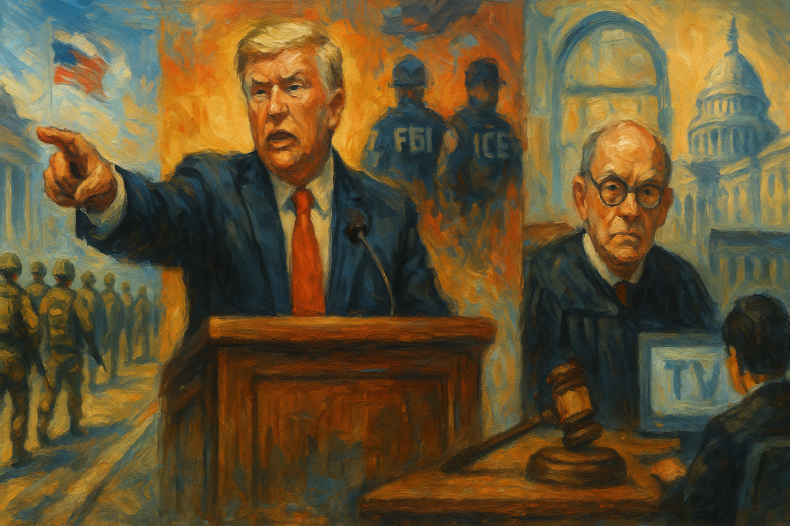

<!-- Generated by build_publish_week_v1 (appendix post) -->
<!-- Header image: image_wide_week39_appendix.png -->

# Week 39 Appendix: A Week of Standoff, Not Collapse

*Executive power pushed harder against courts, Congress, and the press this week, but nearly every push met resistance that mostly held.*

This week showed a marked acceleration in executive assertion of power under cover of a prolonged government shutdown, combined with an unusually explicit turn toward retaliatory law enforcement and press suppression. The administration used shutdown conditions to conduct mass layoffs of federal workers (including special education and public health staff), redirect appropriated funds without congressional authorization, and threaten Insurrection Act deployment despite repeated judicial rebukes on National Guard deployments to Chicago, Portland, and Los Angeles. Simultaneously, the Pentagon's press credentialing crackdown produced a near-total walkout of mainstream media, DOJ indictments targeted Trump critics (Bolton, implicitly Comey and James), and congressional Republicans amplified rhetoric branding Democrats and "No Kings" protesters as terrorists ahead of a mass nationwide demonstration. A rare public assessment by 340+ former intelligence officials explicitly warned the U.S. is on a trajectory toward "competitive authoritarianism," while courts continued to serve as the primary—if contested and partially overridden—check on executive overreach.

Power and Authority

1. Trump displayed and later formally announced plans for a large triumphal arch monument near the Potomac and Arlington Memorial Bridge (2025-10-11): The president promoted a personal monument project using public land and later solicited corporate funding for it, raising questions about symbolic self-glorification and use of public space.

2. Trump threatened to invoke the Insurrection Act to bypass court orders blocking National Guard deployments (2025-10-13): The president signaled willingness to use rarely invoked emergency military authority to override judicial restraints on domestic troop deployment, testing separation-of-powers limits.

3. Steve Bannon suggested plans exist for Trump to seek an unconstitutional third presidential term (2025-10-12): A former top strategist publicly floated circumventing the 22nd Amendment's term limit, raising alarm about long-term erosion of constitutional constraints on executive power.

4. Trump deployed National Guard troops to Chicago, Portland, Memphis, and Washington D.C. under Title 10/32 authority (2025-10-13): The president ordered military forces into multiple U.S. cities over local objections and despite disputed factual claims, raising federalism and civil-military relations concerns.

5. Trump launched investigations and rhetorical attacks against political opponents following Charlie Kirk's killing (2025-10-11): The president used a political tragedy to escalate investigations and hostile rhetoric against critics and civil society groups, undermining rule-of-law norms.

6. Trump publicly called for investigations and prosecutions of political opponents including Schiff, Comey, Wray, Bolton, Monaco, and Weissmann (2025-10-12) *[single source]*: The president repeatedly directed law enforcement attention toward critics and former officials, signaling use of prosecutorial power for political retaliation.

7. Trump made threatening remarks toward Illinois Governor Pritzker and demeaned his own press secretary (2025-10-14): The president's public threats against a state official reflect willingness to use rhetorical intimidation against political adversaries.

8. Trump announced plan to release a list of program cuts targeting programs he labeled Democratic or semi-communist (2025-10-14): The president announced intent to permanently defund programs based on partisan characterization, using budget authority as a political weapon.

9. Trump directed Republican senators to boycott shutdown negotiations with Democrats (2025-10-15): Direct presidential instruction blocking legislative negotiation undermined normal congressional process for resolving the government shutdown.

10. Trump administration withheld over $27 billion in appropriated funds from Democratic-led districts while cutting far less from Republican districts (2025-10-16): Selective withholding of congressionally appropriated funds based on partisan geography represents a serious violation of impoundment law and equal treatment principles.

11. Trump canceled congressionally approved Gateway Tunnel infrastructure funding shortly before the New Jersey gubernatorial election (2025-10-16) *[single source]*: Unilateral cancellation of legally binding infrastructure funding appears to punish a Democratic-led state and asserts executive control over appropriations.

12. Trump held $1 million-per-person Mar-a-Lago fundraiser and solicited corporate donations for a White House ballroom while federal workers went unpaid during the shutdown (2025-10-16) *[single source]*: Soliciting large donations from corporations with pending government business for personal presidential projects during a shutdown raises serious conflict-of-interest concerns.

13. Trump authorized covert CIA action, including lethal force, aimed at driving Venezuelan President Maduro from power (2025-10-15): Unilateral authorization of covert military-intelligence action to overthrow a foreign government bypassed congressional war powers and public accountability.

14. Trump questioned a dual-citizen donor's national loyalty and acknowledged large foreign investments in his crypto ventures (2025-10-14): The president's public remarks linking donor loyalty and foreign financial ties to his businesses highlight ongoing conflicts between personal enrichment and official conduct.

15. Trump expressed interest in a Russian-proposed Alaska-Russia tunnel project and reversed course on providing Tomahawk missiles to Ukraine after a call with Putin (2025-10-16) *[single source]*: The president's apparent deference to Russian preferences on military aid and openness to a Kremlin-pitched infrastructure project raised concerns about foreign influence on U.S. policy.

Institutions and Governance

1. Seventh Circuit Court of Appeals denied a stay on blocking National Guard deployment to Chicago while granting a partial stay on federalization (2025-10-11): An appellate court partially checked executive military deployment authority while leaving some restrictions in place, reflecting contested judicial oversight of presidential power.

2. Nayib Bukele called for Trump to impeach U.S. judges, echoing tactics used to purge his own judiciary (2025-10-12): A foreign authoritarian leader's public call to remove judges, amplified by MAGA figures, exemplifies coordinated pressure on judicial independence.

3. Stephen Miller led coordinated social media attacks by administration officials against a federal judge who blocked National Guard deployment (2025-10-12): Senior officials' sustained public attacks on judges amid a documented rise in threats against the judiciary threaten judicial independence and safety.

4. Federal court blocked ICE from conducting warrantless arrests in Illinois (2025-10-12): A court ruling imposed due-process limits on aggressive immigration enforcement, protecting individuals from arbitrary detention.

5. Tennessee Democratic lawmakers accused Governor Lee and Attorney General Skrmetti of violating the state constitution through National Guard deployment to Memphis (2025-10-13) *[single source]*: State legislators challenged the legal basis for deploying troops without required legislative or emergency declarations, testing state constitutional limits on executive action.

6. House Republicans publicly questioned Speaker Johnson's decision to keep the House out of session during the shutdown (2025-10-13): Internal GOP dissent over prolonged House recess during a shutdown signaled fracturing confidence in legislative leadership's handling of the crisis.

7. Representative Marge Greene publicly opposed vaccination requirements for school attendance (2025-10-13) *[single source]*: A member of Congress's opposition to vaccine mandates, amid a measles outbreak, contributes to erosion of evidence-based public health policy.

8. Mike Johnson acknowledged Republicans cannot fully repeal the Affordable Care Act despite years of promises (2025-10-13): The Speaker's admission signals a shift toward incremental defunding rather than legislative repeal, reflecting institutional limits on stated policy goals.

9. Mike Johnson convened the House for only 12 of the prior 80 days and delayed swearing in Representative-elect Adelita Grijalva (2025-10-13): Suspension of normal House operations and refusal to seat an elected representative obstructed legislative function and representation.

10. Mike Johnson warned the shutdown could become the longest in American history and refused to negotiate with Democrats (2025-10-13): The Speaker's refusal to compromise deepened legislative gridlock and prolonged disruption of government services and worker pay.

11. DOJ dismissed voting rights lawsuits in Georgia, Texas, and Arizona (2025-10-13) *[single source]*: Withdrawal of federal enforcement in voting rights cases removes protections against racial discrimination in elections in multiple states.

12. D.C. Attorney General Brian Schwalb sued to challenge Trump's deployment of D.C. National Guard troops as a violation of the Posse Comitatus Act (2025-10-13) *[single source]*: A legal challenge tested whether troops performing law-enforcement duties in the capital violated statutory limits on military policing of civilians.

13. Three-judge federal panel concluded a nine-day hearing on Texas's mid-decade congressional redistricting map (2025-10-13): A federal hearing examined whether Texas intentionally diluted minority voting strength, with a pending ruling affecting 2026 congressional representation.

14. Judge Breyer found Trump's use of military in Los Angeles violated the Posse Comitatus Act and enjoined further use in immigration raids (2025-10-13): A federal court found a clear constitutional violation in military involvement in domestic law enforcement, though the ruling was later appealed.

15. Ninth Circuit panel stayed Judge Breyer's Los Angeles deployment order and Judge Immergut's first Portland order (2025-10-13) *[single source]*: Appellate stays partially reversed lower court restrictions on military deployment, applying a deferential standard to presidential Guard activation decisions.

16. Texas state attorneys invoked legislative privilege to block testimony about the redistricting mapmaking process (2025-10-13): Blocking testimony about coordination with the White House and DOJ limited judicial ability to assess discriminatory intent in the redistricting map.

17. Trump administration appealed multiple district court injunctions on National Guard deployments to the Seventh and Ninth Circuits (2025-10-13): Continued appeals against judicial restraints on military deployment reflect an ongoing legal battle over the scope of presidential authority.

18. Judge April Perry issued a 14-day injunction blocking federalization and deployment of the National Guard within Illinois (2025-10-13): A district court found the administration's factual justification for deployment not credible, imposing a temporary restraint on military action in Illinois.

19. Judge Karin Immergut blocked Oregon National Guard deployment to Portland, finding Trump's factual claims untethered to reality (2025-10-13): A Trump-appointed judge ruled the administration lacked a factual basis for federalizing Guard troops, reinforcing judicial checks on deployment authority.

20. Judge Sara Ellis issued a temporary restraining order limiting federal agents' use of riot control weapons against journalists and protesters in Chicago (2025-10-13): A federal court constrained aggressive law enforcement tactics used against demonstrators and reporters, reasserting First Amendment protections.

21. Speaker Mike Johnson announced a campaign with Israel's Knesset Speaker to nominate Trump for the Nobel Peace Prize (2025-10-14) *[single source]*: A congressional leader's use of his office to organize a partisan international nomination effort blurred legislative and executive functions.

22. Lisa McClain publicly demanded Democrats sign the shutdown agreement during a chaotic press conference (2025-10-14): The outburst highlighted breakdown in constructive legislative negotiation during a prolonged government shutdown.

23. Mike Johnson admitted the GOP had no strategy to reopen the government or protect health coverage (2025-10-14): The Speaker's public admission of no governing plan during a harmful shutdown reflects abdication of legislative responsibility.

24. Governor Newsom vetoed a reparations bill allowing university admissions preference for slavery descendants and a PFAS cookware ban (2025-10-14) *[single source]*: Two gubernatorial vetoes narrowed policy remedies for historical injustice and consumer health protections despite legislative support.

25. SCOTUS rejected Alex Jones's appeal, upholding a $1.4 billion defamation judgment (2025-10-14): The Court's refusal to intervene preserved accountability for false, harmful speech that incited harassment of mass-shooting victims' families.

26. Governor Newsom reversed a parole board recommendation and denied parole for Manson follower Patricia Krenwinkel (2025-10-14) *[single source]*: Executive override of an independent parole board's professional judgment raises questions about politicization of criminal justice decisions.

27. Democracy Forward Foundation sued the Social Security Administration for failing to respond to FOIA requests on service disruptions (2025-10-14): Litigation over stalled records requests tests whether agencies comply with statutory transparency obligations amid administrative upheaval.

28. Federal judge ruled the Trump administration violated a court order barring immigration-related conditions on FEMA emergency preparedness grants (2025-10-14): A court found the administration attempted to coerce states into immigration cooperation by threatening disaster funding, in defiance of a prior injunction.

29. SCOTUS issued a series of routine certiorari denials, amicus and argument rulings across multiple unrelated cases (2025-10-14): Numerous procedural Court orders shaped access to review, including several capital cases and cases touching detention, election administration, and civil jury rights.

30. Judge Susan Illston granted a temporary restraining order blocking Trump's mass federal worker layoffs during the shutdown (2025-10-15): A court found the administration exploited the shutdown to conduct arbitrary personnel actions, providing a check against politicized mass firings.

31. US Senate failed for the ninth and tenth times to pass legislation ending the government shutdown (2025-10-15) *[single source]*: Repeated failed votes reflect continued legislative deadlock over healthcare subsidies, prolonging harm to federal workers and public services.

32. SCOTUS heard oral arguments in Louisiana v. Callais challenging Section 2 of the Voting Rights Act (2025-10-15): The Court's conservative majority appeared open to weakening the primary federal tool against racially discriminatory redistricting, with major implications for minority representation.

33. Various federal courts issued rulings on multiple pending cases involving education funding, immigration detention, disaster grants, and worker protections (2025-10-14): A series of docket updates across federal courts reflect ongoing litigation testing the legality of numerous administration actions.

34. North Carolina Republican legislative leaders announced plans to redraw congressional maps to gain an additional Republican seat (2025-10-15) *[single source]*: Mid-decade gerrymandering explicitly aimed at entrenching partisan advantage undermines fair representation ahead of the 2026 midterms.

35. Federal judge (San Francisco/N.D. Cal.) extended a block on Trump administration federal worker layoffs, finding them illegal (2025-10-16): A second court ruling reinforced judicial resistance to shutdown-driven mass firings of civil servants.

36. Judge Karin Immergut extended two temporary restraining orders blocking National Guard federalization and deployment to Portland (2025-10-16): Continued judicial restraint on military deployment to Portland preserved separation-of-powers limits pending further trial proceedings.

37. Federal grand jury (Maryland) indicted John Bolton on 18 counts related to alleged mishandling of classified information (2025-10-16): The indictment of a prominent Trump critic, after the case was previously dropped and later reopened, raised concerns about selective and retaliatory prosecution.

38. Federal judge blocked the Trump administration from clawing back $34 million in anti-terrorism funds for New York City's transit system (2025-10-16): The court found the administration's revocation of congressionally appropriated security funds arbitrary and unlawful, protecting a longstanding federal commitment.

39. Seventh Circuit denied the administration's request to stay a district court order blocking National Guard deployment to Chicago (2025-10-16): A unanimous appellate panel rejected claims of unreviewable presidential discretion, finding no factual basis for deployment under federal law.

40. Senator Ted Cruz introduced legislation to allow DOJ to use RICO statutes to prosecute funders of the No Kings protests (2025-10-16) *[single source]*: Proposing organized-crime prosecution tools against protest funding sources represents an attempt to criminalize political opposition organizing.

41. Gary Shapley (IRS) compiled a list of Democratic donors and left-leaning groups as targets for criminal investigation (2025-10-16) *[single source]*: Using tax enforcement to target political opponents based on ideology represents weaponization of the IRS for partisan purposes.

42. Trump fired the Export-Import Bank Inspector General without notifying Congress as required by law (2025-10-16): Removal of an independent watchdog without legally mandated congressional notice weakens oversight of a federal financial agency.

43. Michael Ellis appointed himself CIA general counsel while serving as deputy director (2025-10-16): Consolidating legal oversight authority within a single loyalist official reduces independent review of intelligence agency operations.

44. Arizona Attorney General Kris Mayes filed litigation to compel Speaker Johnson to swear in Representative-elect Adelita Grijalva (2025-10-17) *[single source]*: A state attorney general's lawsuit challenged the Speaker's refusal to seat an elected representative, framing it as taxation without representation for her district.

45. Representative Cory Mills faced multiple House Ethics Committee charges including foreign payments and a domestic violence restraining order (2025-10-17) *[single source]*: Serious pending ethics allegations against a sitting member raised questions about congressional accountability enforcement.

46. Rep. Robert Garcia accused Attorney General Bondi of obstructing a congressional subpoena for full Epstein files (2025-10-17) *[single source]*: Alleged refusal to comply with congressional oversight subpoenas undermines legislative accountability over the Justice Department.

47. Judge Sara Ellis ordered federal ICE agents in the Chicago area to wear body cameras after documented use of force in violation of prior orders (2025-10-17): A court enforcement action responded to apparent violations of an earlier restraining order on riot-control tactics against protesters and press.

48. Judge Michael Hammer lifted travel restrictions on Palestinian activist Mahmoud Khalil (2025-10-17): A federal ruling restored freedom of movement for an activist facing politically contested deportation proceedings, protecting First Amendment rights.

49. Freedom Network USA and coalition filed suit alleging Trump's anti-DEI executive orders violate the Trafficking Victims Protection Act (2025-10-17) *[single source]*: The lawsuit challenges whether executive orders restricting diversity language unlawfully undermine statutory anti-trafficking protections.

50. Trump filed an amended $15 billion defamation complaint against The New York Times (2025-10-17): Refiling a large defamation suit against a major news outlet after a prior dismissal continues a pattern of litigation aimed at pressuring critical press coverage.

51. Trump administration filed an emergency shadow-docket appeal to the Supreme Court seeking immediate authority to deploy National Guard troops in Chicago (2025-10-17): Seeking to bypass four prior adverse rulings via an expedited, unexplained Supreme Court process reflects continued pressure against judicial constraints on military deployment.

52. SCOTUS denied an emergency injunction application in a school district dispute (2025-10-17): A procedural denial left a lower court ruling in place, shaping the immediate legal landscape for the parties involved.

53. Steady State (network of former intelligence officials) released a report assessing the U.S. is on a trajectory toward competitive authoritarianism (2025-10-17) *[single source]*: More than 340 former national security officials formally warned that executive overreach, judicial pressure, and civil service politicization signal deliberate democratic backsliding.

54. Steve Witkoff advised a Russian official on how to manipulate an upcoming Trump-Zelenskyy call (2025-10-14): A presidential envoy's coordination with a foreign adversary to shape U.S. diplomatic engagement compromised the appearance of impartial negotiation with Ukraine.

55. Admiral Alvin Holsey resigned as head of U.S. Southern Command after raising concerns about the legality of Caribbean drug-boat strikes (2025-10-16) *[single source]*: An unprecedented early departure of a senior military commander amid disputes over the legality of lethal operations signals friction in civilian-military relations.

56. University of Texas at Austin administration established a committee to potentially restructure or eliminate liberal arts and ethnic studies departments (2025-10-17) *[single source]*: Administrative moves to review and possibly defund identity-focused academic programs, paired with a new state law curbing faculty governance, threaten academic freedom.

57. Brown University, University of Pennsylvania, University of Southern California rejected the Trump administration's proposed higher education funding compact (2025-10-16) *[single source]*: Multiple universities refused a federal offer conditioning preferential funding on policy changes, citing threats to academic freedom and institutional autonomy.

Economic Structure

1. Russell Vought announced federal worker reduction-in-force layoffs during the government shutdown (2025-10-11): Mass layoffs of federal workers using shutdown conditions as leverage raised legal questions about the misuse of fiscal crisis against the civil service.

2. Trump administration diverted approximately $8 billion in Pentagon research funds to cover military payroll during the shutdown (2025-10-12): Reallocating appropriated funds without congressional authorization tested constitutional limits on executive control over spending and created disparities among federal workers.

3. Cryptocurrency trader profited $160 million by shorting Bitcoin and Ethereum immediately before Trump's tariff announcement (2025-10-12) *[single source]*: Suspicious trading timed to a major policy announcement raised concerns about insider knowledge and market integrity around administration decisions.

4. Trump administration cut federal spending, depleting resources for food banks amid rising demand (2025-10-12) *[single source]*: Federal spending cuts combined with shutdown disruption left food assistance programs severely strained, worsening food insecurity for vulnerable populations.

5. Melania Trump began selling a $75 Christmas ornament (2025-10-12): Continued commercial merchandising by the First Lady exemplifies ongoing monetization of the presidency for personal financial gain.

6. Trump exempted the AI sector from broad tariffs while imposing them elsewhere (2025-10-12) *[single source]*: Selective tariff exemptions for AI investment mask underlying economic weakness in tariff-hit sectors, creating a structural vulnerability tied to continued AI growth.

7. EPA canceled $7.6 billion in clean energy projects, eliminated age as a disability-determination factor, ended SOAR homelessness support, rescinded the Endangerment Finding, cut SSI benefits, and rolled back power-plant pollution limits (2025-10-13): A cluster of deregulatory actions removed climate, disability, and health protections simultaneously, reducing federal capacity to protect vulnerable populations and the environment.

8. Labor market recorded the lowest hiring level since 2009, a 58% year-over-year collapse (2025-10-13) *[single source]*: A dramatic labor market contraction signals severe economic deterioration affecting employment and household financial security nationwide.

9. LIV Golf, Saudi Arabia, UAE, Qatar made large investments and business arrangements with Trump-linked entities preceding favorable U.S. policy decisions toward those countries (2025-10-14): A pattern of foreign investment in Trump-family businesses followed by favorable arms sales, chip exports, and diplomatic status changes suggests policy shaped by personal financial benefit.

10. Trump administration proceeded with the sale of the historic Wilbur J. Cohen Federal Building housing New Deal-era public art (2025-10-14) *[single source]*: Selling a federal building symbolizing government responsibility for citizen welfare reflects a shift in valuing the institutional legacy of the social safety net.

11. Trump administration announced additional reductions in force affecting at least 4,100 federal workers, citing the shutdown (2025-10-15) *[single source]*: Continued mass layoffs during the shutdown, without legal precedent from prior administrations, undermine civil service stability and institutional continuity.

12. Trump administration announced guidance urging employers to offer IVF coverage alongside a drug-cost deal with a fertility drug manufacturer (2025-10-17) *[single source]*: A nonbinding recommendation on fertility benefits, without subsidies or requirements, leaves unclear whether employers will expand reproductive healthcare access.

13. Mississippi Department of Environmental Quality granted a permit allowing Drax Biomass to become a major source of hazardous air pollution in a low-income Black community (2025-10-16) *[single source]*: Approval of increased industrial emissions in a vulnerable community despite documented health harms raises environmental justice and regulatory capture concerns.

14. Trump administration doubled a bailout commitment to Argentina to $40 billion amid domestic austerity and shutdown-driven cuts (2025-10-15): A senator characterized the large foreign bailout as cronyism prioritizing insider interests over ordinary Americans facing economic hardship.

15. DEA and EPA issued routine regulatory actions including drug scheduling, pesticide registration cancellations, and bulk manufacturer notices (2025-10-15): Standard regulatory actions expanded federal oversight of controlled substances and pesticide markets, affecting law enforcement scope and agricultural supply chains.

16. Netherlands government and European Union seized a Chinese-owned semiconductor company and imposed technology-transfer requirements on Chinese investors (2025-10-16): European assertions of economic sovereignty against Chinese investment reflect broader efforts to protect strategic industries, with implications for global trade competition.

17. U.S. Chamber of Commerce sued the Trump administration to block a new $100,000 H-1B visa fee (2025-10-16): The largest business lobby challenged a fee it says violates federal immigration law, highlighting economic costs of restrictive skilled-immigration policy.

18. Trump imposed 25% tariffs on medium- and heavy-duty vehicles and parts and 10% on buses under Section 232 national security authority (2025-10-17): New tariffs on a major industrial sector, justified by emergency national-security authority, affect manufacturing competitiveness and trade relationships.

Civil Rights and Dissent

1. Trump administration imposed a $100,000 fee on H-1B visa applications and moved to cut refugee admissions from 125,000 to 7,500 (2025-10-11) *[single source]*: New fees and drastic refugee cuts, reportedly favoring specific groups, restrict legal immigration pathways and narrow humanitarian protections.

2. US Border Patrol arrested a U.S. citizen journalist during an ICE raid, later releasing her without charges (2025-10-11) *[single source]*: Detention of a working journalist during a federal enforcement operation raises press freedom and due process concerns.

3. Trump administration granted USCIS special agents law enforcement arrest powers for the first time (2025-10-11) *[single source]*: Expanding arrest authority to an administrative immigration agency enables aggressive enforcement with reduced traditional oversight.

4. Trump administration pursued retroactive enforcement against legal residents for minor, previously non-deportable violations (2025-10-11) *[single source]*: Detaining longtime legal residents for minor decade-old infractions violates due process and changes deportability standards without legislative action.

5. Trump administration launched Operation Midway Blitz, an aggressive immigration enforcement campaign targeting Chicago (2025-10-12) *[single source]*: Escalated raids and detentions in immigrant communities created fear and disrupted civic participation among vulnerable residents.

6. Trump administration pursued the most aggressive mass deportation campaign in U.S. history, separating families and detaining children (2025-10-13) *[single source]*: Nearly 200,000 deportations in seven months, including family separations and enforcement at schools and hospitals, violated humanitarian norms and due process.

7. DOJ announced it will no longer enforce the FACE Act protecting abortion clinic access and threatened prosecution of election officials who assisted voters (2025-10-13): Ceasing enforcement of a clinic-access protection law and threatening officials who helped voters chills both reproductive healthcare access and election administration.

8. Trump administration ended federal protection for emergency abortion care, issued an executive order requiring proof of citizenship to vote, pardoned 23 anti-abortion violence offenders, reinstated the Global Gag Rule, and signed an order targeting transgender legal recognition (2025-10-13): A cluster of executive actions simultaneously restricted reproductive healthcare, voting access, and transgender rights, reflecting coordinated retrenchment of civil rights protections.

9. Trump administration conducted voter roll purges targeting communities of color (2025-10-13) *[single source]*: Racially targeted voter roll purges restrict electoral access and undermine equal protection in a foundational democratic right.

10. Mike Johnson characterized the planned No Kings protest as a hate-America rally filled with terrorists and Marxists (2025-10-13) *[single source]*: Congressional leadership used inflammatory rhetoric to delegitimize a planned peaceful protest, framing constitutional assembly rights as extremism.

11. ICE issued a fine to a legal resident for not carrying registration documents under a rarely enforced law (2025-10-13): Selective enforcement of a rarely-used immigration statute against a longtime legal resident signals a shift toward more punitive, discriminatory enforcement.

12. ICE shot and killed a 38-year-old father during a traffic stop in Chicago (2025-10-14): A fatal use-of-force incident during immigration enforcement, alongside judicial findings of systematic warrantless arrests, indicates breakdown in rule-of-law constraints on enforcement.

13. Federal agents deployed pepper balls against faith leaders and arrested journalists during Chicago enforcement operations (2025-10-14): Use of force against religious leaders and journalists covering federal operations raises concerns about suppression of press freedom and civil society.

14. Defense Department moved about 20 immigrants to the Guantánamo Bay naval base, bringing the total held there to 710 (2025-10-14) *[single source]*: Continued use of a military detention facility for immigration enforcement raises human rights and due process concerns.

15. House Republicans attacked planned No Kings protests as "Antifa," "paid protesters," and violent, calling participants terrorists (2025-10-13): Coordinated dismissal of a mass peaceful protest movement as violent or foreign-funded aimed to delegitimize and chill participation in dissent.

16. Speaker Johnson and House GOP leadership continued attacking the No Kings rallies as "Hate America" events, escalating rhetoric ahead of the demonstration (2025-10-14): Repeated official characterization of a mass protest as anti-American extremism intensified pressure to delegitimize peaceful dissent.

17. Pennsylvania man Subramanyam Vedam was detained by ICE shortly after exoneration in a wrongful conviction based on a vacated 1988 deportation order (2025-10-15): Detention of an exonerated wrongful-conviction victim on a vacated legal basis raises fundamental due process and finality-of-justice concerns.

18. Illinois state police detained at least 15 protesters outside the Broadview ICE facility, using force to disperse demonstrators (2025-10-17): Arrests and use of force against protesters exercising assembly rights near a federal detention facility raise concerns about suppression of dissent.

19. Queer and trans immigrants alleged forced labor, sexual assault, medical neglect, and retaliation at a Louisiana ICE detention facility (2025-10-16) *[single source]*: Detailed complaints of systemic abuse and retaliation against LGBTQ+ detainees expose institutional failure to protect vulnerable populations in federal custody.

20. Trump administration rolled back federal anti-human-trafficking initiatives across multiple agencies and closed DHS civil rights and detention ombudsman offices (2025-10-16) *[single source]*: Reductions in anti-trafficking capacity and elimination of oversight offices leave vulnerable populations, including immigrants and LGBTQ+ people, at heightened risk.

21. State Department revoked visas of at least six people for criticizing Charlie Kirk following his killing (2025-10-14) *[single source]*: Punishing speech through visa revocation represents weaponization of immigration authority to suppress criticism.

22. Republican leadership (Johnson, Scalise, Emmer, Duffy, Marshall) falsely characterized the No Kings protest as pro-Hamas, antifa, and paid by George Soros (2025-10-16) *[single source]*: Multiple senior officials spread unsupported claims to delegitimize a peaceful mass protest, chilling participation in constitutionally protected assembly.

Information, Memory and Manipulation

1. White House denounced the Nobel Peace Prize committee's decision to award the prize to María Corina Machado instead of Trump (2025-10-11): Public attacks on an independent international body for not honoring the president reflect pressure on institutions to validate a preferred narrative.

2. JD Vance made false claims about crime statistics and evaded questions about an alleged bribe to border czar Tom Homan (2025-10-12) *[single source]*: A sitting vice president's demonstrably false statements on national television undermined public trust in official information from the executive branch.

3. Kristi Noem released a partisan TSA video blaming Democrats for the government shutdown (2025-10-12): Use of federal airport infrastructure to broadcast a partisan political message blurred the line between government communication and campaign messaging.

4. Trump called his first impeachment a "far bigger Illegal Hoax than Watergate" and called for prosecution of Senator Adam Schiff (2025-10-12) *[single source]*: The president used his platform to delegitimize a constitutional impeachment process and call for retaliatory investigation of a political opponent.

5. JD Vance baselessly claimed Illinois Governor Pritzker had violated his oath of office and "seemed pretty criminal" (2025-10-12): Unsubstantiated criminal accusations against a political opponent by a senior official weaponized rhetoric to threaten the justice system.

6. Pete Hegseth issued a restrictive press credential policy requiring journalists to pledge not to seek unauthorized material (2025-10-13) *[single source]*: New Pentagon rules requiring pre-approval of reporting on military affairs prompted near-unanimous refusal by major news outlets, raising serious press freedom concerns.

7. Trump dismissed a Politico journalist as "fake news" and fabricated a false story about a diplomatic meeting with Egypt's president (2025-10-13) *[single source]*: Attacking and excluding critical journalists while fabricating diplomatic narratives undermines factual accuracy and press access to the president.

8. Trump suggested he would influence personnel decisions at CBS following a corporate merger (2025-10-13): Presidential comments implying control over media company staffing decisions based on personal loyalty threaten editorial independence.

9. EPA eliminated climate research programs and fired scientists as part of a deregulatory agenda (2025-10-13) *[single source]*: Removing climate scientific capacity undermines evidence-based policymaking and government transparency about environmental risk.

10. Trump and administration officials spread a debunked story blaming the Biden-era FBI for January 6 crowd placement and called for investigation of former Director Chris Wray (2025-10-12) *[single source]*: Promotion of a false narrative about a violent insurrection to justify retaliation exemplifies deliberate distortion of historical fact for political ends.

11. Attorney General Pam Bondi announced Meta removed a Facebook group accused of doxxing and targeting ICE agents at DOJ's request (2025-10-14) *[single source]*: Government pressure on a social media platform to remove content demonstrates state influence over online speech moderation.

12. Fox News broadcast propaganda characterizing the No Kings protests as pro-Antifa hate America rallies (2025-10-14) *[single source]*: State-aligned media's deliberate mischaracterization of a lawful protest movement delegitimizes dissent and distorts public understanding.

13. Karoline Leavitt characterized the Democratic Party's constituency as made up of Hamas terrorists, illegal aliens, and violent criminals (2025-10-16): Official White House rhetoric dehumanizing and delegitimizing an entire political party's voters represents extreme distortion of political discourse.

14. William Inboden published a manifesto criticizing identity-studies frameworks and characterizing humanities as pathological (2025-10-17) *[single source]*: A university provost's public ideological critique provides institutional justification for defunding ethnic studies and identity-focused disciplines.

15. Pentagon press corps mass walked out after refusing to sign new restrictive rules, leaving only fringe outlets credentialed (2025-10-16) *[single source]*: Nearly all mainstream press abandoned Pentagon coverage rather than accept censorship rules, dramatically narrowing independent oversight of military affairs.

16. Sean Parnell dismissed departing Pentagon press as "self-righteous" and announced a replacement press corps (2025-10-17): A Pentagon spokesman's dismissal of mainstream media departure and plan for a compliant replacement press corps signals intent to control military information flow.

17. The Australian withdrew its assent to Pentagon press rules after review, citing press freedom concerns (2025-10-17): A major international outlet's reversal after signing restrictive rules highlights the severity of new limits on independent military reporting.

18. Karoline Leavitt dismissively responded "Your mom did" to a legitimate press question about a Trump-Putin summit location (2025-10-17) *[single source]*: Unprofessional dismissal of press inquiries undermines accountability and normal government-press relations.

19. Speaker Johnson and House GOP leadership labeled the No Kings rallies "marxist, hate America" gatherings ahead of the nationwide demonstration (2025-10-15): Continued inflammatory characterization of peaceful protest as extremist represents an information campaign to delegitimize mass dissent before it occurs.

20. Politico published leaked messages showing Young Republican leaders exchanging racist jokes and expressing admiration for Hitler (2025-10-15) *[single source]*: Exposure of extremist rhetoric among party leadership, met with dismissal by the vice president, signals normalization of hate speech within political structures.

