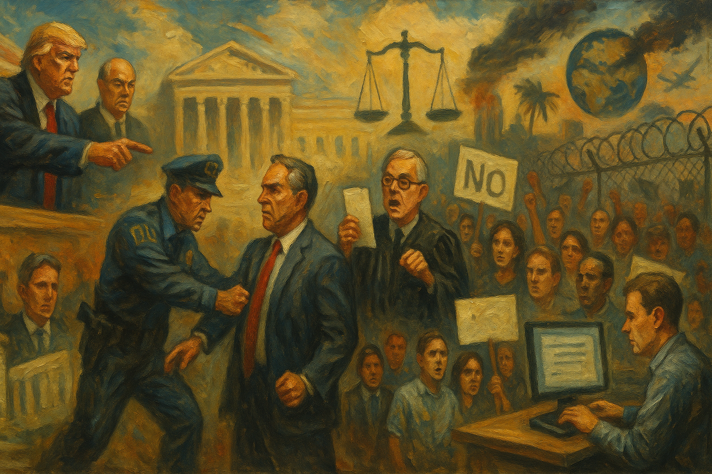

<!-- Generated by build_publish_week_v1 (appendix post) -->
<!-- Header image: image_wide_week4_appendix.png -->

# Week 4 Appendix: DOGE as Parallel Statecraft

*Trump and Musk quietly converted the federal bureaucracy into a pliable, privatized instrument, using money, law, and memory to tilt power inward and downward.*

This week shows an aggressive acceleration of authoritarian structural change, centered on executive aggrandizement, civil service purge, and information control, partially checked by unusually assertive courts and civil society. Trump and Musk’s DOGE apparatus moved from rhetoric to implementation: mass layoffs, buyout schemes, and a new hiring choke-point effectively politicize and shrink the federal workforce, while attempts to shutter or hollow out USAID, Education, CFPB, NIH, NSF, NOAA, NASA DEI, and Social Security operations rewire the administrative state toward loyalist and private interests. Simultaneously, the administration paused FCPA enforcement, meddled in DOJ corruption cases, and signaled possible debt repudiation, fusing crony capitalism with legal impunity. On the rights side, immigration crackdowns, anti-trans orders, DEI erasure, and militarized ICE practices deepen stratified citizenship. Information space is sharply contested: federal web purges, Pentagon school book removals, AP bans, and curated DOGE data sit alongside court orders restoring health pages and blocking NIH cuts. Internationally, Gaza annexation talk and resource-for-support demands on Ukraine reveal a transactional, destabilizing foreign policy. The judiciary, inspectors-general lawsuits, state suits, and mass public calling campaigns provide real but embattled counter-pressure.

Power and Authority

1. President Trump announced and executed a purge of Kennedy Center board leadership while declaring himself chair (2025-02-07): By unilaterally firing Kennedy Center trustees and claiming the chairmanship, Trump asserted direct personal control over a national cultural institution, signaling willingness to override established governance norms for symbolic and political power.

2. President Trump issued an executive order prioritizing asylum for Afrikaners from South Africa (2025-02-08): Prioritizing Afrikaner resettlement on disputed persecution grounds used asylum policy to favor a specific white ethnic group, reinforcing a hierarchy of belonging and politicizing humanitarian protection.

3. President Trump cut federal funding and ordered a stop-work for a Colorado immigrant legal services nonprofit (2025-01-20): Halting funds for a key immigrant legal aid provider weakened access to counsel for undocumented people in removal proceedings, using executive power to narrow due process protections for a disfavored group.

4. President Trump ordered a halt to production of new pennies (2025-02-09): Stopping penny production altered national currency policy by unilateral directive, illustrating the president’s willingness to reshape everyday economic instruments without legislative debate.

5. President Trump prepared an executive order to reverse limits on bank overdraft fees and allow medical debt to affect credit scores (2025-02-09): Reversing consumer protections on overdraft fees and medical debt would expand financial penalties on vulnerable borrowers, using executive authority to tilt market rules against low-income households.

6. President Trump signed an executive order pausing enforcement of the Foreign Corrupt Practices Act (2025-02-10): Suspending FCPA enforcement weakened a core anti-bribery safeguard, signaling tolerance for corporate corruption abroad and privileging business interests over legal constraints on U.S. firms.

7. President Trump signed executive orders directing health agencies to scrub diversity-related terms and content from websites and research (2025-01-20): Mandating removal of race, gender, disability and LGBTQ terms from health sites and proposals used executive power to constrain what public institutions can say about marginalized groups and health disparities.

8. President Trump issued an executive order directing review of all gun regulations to expand Second Amendment protections (2025-02-09): Ordering a sweeping review of gun rules to favor expansive gun rights positioned the presidency to reshape the balance between individual arms-bearing and collective public safety through unilateral action.

9. President Trump and Elon Musk repurposed the U.S. Digital Service into DOGE with authority to cancel payments, suspend programs, and target employees (2025-01-20): Transforming a technical service unit into DOGE with sweeping, opaque power over spending and personnel created a parallel executive apparatus with limited oversight over core state functions.

10. President Trump issued an executive order eliminating the Federal Executive Institute (2025-02-10): Closing the long-standing Federal Executive Institute removed a key training hub for senior civil servants, weakening professional development and signaling devaluation of a merit-based bureaucracy.

11. President Trump issued an executive order ending federal procurement and mandated use of paper straws (2025-02-10): Reversing federal moves away from single-use plastics via executive order shifted environmental procurement policy by fiat, privileging industry preferences over prior sustainability commitments.

12. President Trump directed DOGE to identify over $1 billion in federal spending cuts in his first weeks in office (2025-02-08): Using DOGE to rapidly cut more than $1 billion in spending concentrated budgetary discretion in a lightly accountable executive unit, bypassing normal deliberative processes over program priorities.

13. President Trump announced NIH funding cuts for cancer and other research programs through DOGE (2025-02-08): Targeting NIH research budgets via DOGE used centralized executive power to weaken scientific capacity and public health infrastructure without legislative debate.

14. President Trump quietly exempted low-value Chinese imports from his announced tariffs (2025-02-08): Exempting sub-$800 Chinese packages from tariffs undercut the stated rationale of a broad trade crackdown, illustrating discretionary, opaque use of tariff power with uneven economic effects.

15. President Trump and Budget Director Russ Vought moved to dismantle the Consumer Financial Protection Bureau by starving it of funds (2025-02-08): Using budgetary control to effectively eliminate the CFPB weakened a key consumer watchdog, shifting financial regulation toward industry interests and away from ordinary borrowers’ protections.

16. President Trump suggested the United States might not honor some Treasury debt obligations (2025-02-09): Publicly questioning whether to honor U.S. debt challenged constitutional commitments to public credit and injected executive uncertainty into global financial stability.

17. President Trump issued an executive order centralizing control over the diplomatic corps and Foreign Service under his direction (2025-02-12): Requiring all foreign policy implementation to align tightly with presidential directives and reshaping Foreign Service personnel rules concentrated diplomatic authority in the executive and reduced professional independence.

18. President Trump signed an executive order establishing the Department of Government Efficiency workforce optimization initiative (2025-02-13): Placing DOGE operatives over hiring and firing across agencies and imposing a one-for-four hiring cap centralized personnel power in a parallel structure, undermining traditional civil service protections.

19. President Trump froze large portions of federal science funding across agencies (2025-02-13): Freezing broad science funding disrupted research nationwide and showed willingness to use executive control over grants as a blunt instrument, regardless of statutory expectations or institutional planning.

20. President Trump halted FEMA grants for firefighting and port security projects (2025-02-13): Stopping FEMA grants for critical safety equipment leveraged executive control over emergency funds in ways that risked local preparedness and blurred lines between policy priorities and basic protection.

21. President Trump ordered the CIA to disclose a list of all hires from the previous two years (2025-02-13): Compelling disclosure of recent CIA hires exposed intelligence personnel to risk and demonstrated presidential willingness to override standard secrecy norms governing national security staff.

22. President Trump paused permitting for solar and other renewable energy projects, including on private land (2025-02-13): Halting renewable energy permits by executive directive disrupted local energy planning and signaled preference for centralized political control over long-term infrastructure investment decisions.

23. President Trump issued an executive order establishing the Make America Healthy Again Commission (2025-02-13): Creating a presidential health commission positioned the White House to steer national health priorities and research framing, potentially bypassing existing expert-driven public health institutions.

24. President Trump signed an executive order pausing disbursement of LIHEAP and home energy rebate funds, causing surcharges for low-income customers (2025-01-20): Freezing congressionally funded energy assistance shifted immediate costs onto low-income households and illustrated how executive impoundment can function as de facto policy reversal without legislation.

25. President Trump announced a plan to seize and hold Gaza and relocate Palestinians elsewhere (2025-02-10): Proposing U.S. seizure of Gaza and permanent removal of Palestinians framed foreign policy as territorial acquisition, disregarding self-determination norms and signaling openness to large-scale forced displacement.

26. President Trump announced 25% tariffs on steel and aluminum imports and ordered development of a broader reciprocal tariff plan (2025-02-11): Imposing and planning expansive tariffs by presidential directive reoriented trade policy around unilateral executive decisions with significant downstream effects on prices, jobs, and international relations.

27. President Trump announced a 25% tariff on all steel and aluminum imports in a separate statement (2025-02-11): A parallel announcement of 25% metal tariffs reinforced the administration’s readiness to use trade tools aggressively, despite warnings of higher consumer costs and intra-party criticism.

28. President Trump established the National Energy Dominance Council by executive order (2025-02-14): Creating a White House energy council to push domestic production and cut regulatory barriers centralized strategic energy decisions in a presidential advisory body with potential to favor extractive interests.

29. President Trump signed an executive order halting federal funding to schools and universities with COVID-19 vaccine mandates (2025-02-14): Conditioning education funding on dropping vaccine mandates used fiscal leverage to weaken public health measures and pressure institutions to align with executive preferences on medical policy.

30. President Trump established the National Energy Dominance Council to coordinate pro-production energy policy (2025-02-14): The new council embedded a pro-fossil-fuel agenda inside the Executive Office, enabling coordinated use of regulatory and fiscal tools to favor domestic extraction over environmental or climate concerns.

31. President Trump directed DOGE to meet with Pentagon officials to review defense spending (2025-02-14): Bringing DOGE into Pentagon budget reviews extended Musk-aligned oversight into defense planning, raising questions about private influence over military priorities and security staffing.

32. Louisiana Department of Health leadership ended promotion of mass vaccination campaigns while continuing to provide vaccines (2025-02-14): Ceasing proactive vaccination outreach reframed immunization as a purely individual choice, likely lowering uptake and weakening collective disease prevention without formal legislative debate.

33. National Park Service removed references to transgender people from the Stonewall National Monument website under a sex-definition order (2025-02-13): Erasing trans references from the Stonewall site implemented an executive sex-definition policy in public memory, narrowing official recognition of LGBTQ history and contributions.

Institutions and Governance

1. Senate Democrats announced plans to block all State Department nominees in response to Trump foreign aid cuts (2025-02-08): Threatening to block State Department confirmations used Senate advice-and-consent powers to resist executive moves seen as undermining diplomacy and development programs.

2. Senator Angus King criticized Russell Vought’s expansive view of presidential power and warned of constitutional erosion (2025-02-07): King’s public questioning of Vought’s near-unlimited presidency doctrine highlighted legislative concern over appointments that could normalize executive dominance over checks and balances.

3. House of Representatives recorded a rules violation by Rep. Byron Donalds for proxy voting via his card (2025-02-08): A member’s use of his voting card by another person, contrary to rules he supported, underscored vulnerabilities in internal accountability mechanisms for legislative procedure.

4. U.S. District Judge Carl Nichols blocked the Trump administration from placing thousands of USAID employees on leave and from shutting down the agency (2025-02-07): Nichols’s orders halted an attempted mass sidelining of USAID staff, reinforcing judicial checks on executive efforts to disable a major foreign aid agency without adequate justification.

5. U.S. District Court in New York issued emergency orders blocking DOGE’s access to Treasury systems and requiring destruction of downloaded data (2025-02-08): Emergency injunctions against DOGE’s Treasury access asserted judicial authority over executive data grabs, protecting financial records and signaling limits on Musk-aligned operatives.

6. Federal courts blocked the transfer of Venezuelan immigrants to Guantanamo Bay (2025-02-08): Granting a restraining order against sending immigrants to Guantanamo preserved access to normal legal processes and limited use of an offshore detention site for civil immigration enforcement.

7. Federal courts temporarily restored funding and operations for immigrant legal orientation and representation programs (2025-02-09): By lifting a stop-work order on immigrant legal services, courts intervened to maintain due process infrastructure for noncitizens facing removal.

8. Chief Judge John J. McConnell Jr. ordered the Trump administration to immediately restore billions in frozen federal funding (2025-02-10): McConnell’s rulings enforcing prior restraining orders on funding freezes reaffirmed judicial power to compel executive compliance with appropriations law.

9. Federal courts blocked the Trump administration’s attempt to cap NIH indirect research costs at 15% (2025-02-10): Injunctions against NIH overhead cuts protected statutory funding structures and limited executive attempts to reshape research financing unilaterally.

10. Federal courts blocked President Trump’s executive order ending birthright citizenship (2025-02-10): Striking down an order targeting birthright citizenship upheld Fourteenth Amendment guarantees and constrained executive reinterpretation of constitutional status.

11. Federal courts ordered reinstatement of Hampton Dellinger as head of the Office of Special Counsel after his firing (2025-02-10): Reinstating the whistleblower-protection chief pushed back against executive removal of an independent watchdog, reinforcing statutory protections for oversight roles.

12. Federal courts found the administration in violation of court orders on NIH funding freezes and compelled compliance (2025-02-11): Rulings that NIH and the administration defied injunctions on funding freezes underscored judicial willingness to confront contempt and defend legal limits on executive impoundment.

13. Federal courts ordered federal health agencies to restore deleted web pages and datasets on HIV testing and contraception (2025-02-10): Mandating restoration of removed health information reasserted transparency obligations and limited executive attempts to quietly erase sensitive public health guidance.

14. Federal courts maintained and later allowed aspects of the Trump administration’s federal worker buyout program to proceed (2025-02-11): Judicial handling of the “Fork in the Road” buyout plan—first blocking, then allowing it on standing grounds—shaped how far the executive can legally shrink the civil service via incentivized resignations.

15. Federal courts temporarily blocked Trump’s executive order restricting gender-affirming healthcare for transgender youth (2025-02-13): Blocking the anti-trans health order preserved access to care while litigation proceeds, illustrating courts’ role in checking discriminatory uses of federal funding leverage.

16. Federal courts ordered reinstatement of foreign aid funding and blocked impoundment of international assistance (2025-02-13): Requiring release of foreign aid funds reaffirmed congressional control over appropriations and limited executive attempts to unilaterally suspend international commitments.

17. National Treasury Employees Union sued OMB Director Russell Vought over directives to shut down the CFPB (2025-02-11): The union’s lawsuit argued that dismantling the CFPB by OMB fiat usurped Congress’s authority to create agencies, testing judicial willingness to police structural separation of powers.

18. Government Accountability Office reported large savings from its oversight work in FY 2023 (2025-02-10): GAO’s documentation of high returns on oversight investment underscored the institutional value of independent auditing in constraining waste and abuse.

19. Senate confirmed Russell Vought as director of the Office of Management and Budget despite opposition (2025-02-10): Confirming Vought, an architect of plans to demoralize and shrink the civil service, placed a committed executive-power maximalist in charge of budget execution and agency oversight.

20. DOGE leadership sought control over the Office of Personnel Management to reshape federal hiring (2025-02-10): Moves to capture OPM would let DOGE reengineer civil service hiring toward ideological loyalty, weakening merit-based protections across the bureaucracy.

21. President Trump fired the director of the Office of Government Ethics (2025-02-10): Removing the ethics office head reduced independent scrutiny of executive conduct, signaling intolerance for internal checks on conflicts of interest.

22. American Bar Association issued a statement condemning Trump administration actions as violating the rule of law (2025-02-11): The ABA’s institutional rebuke framed recent executive behavior as inconsistent with constitutional norms, adding professional-legal pressure for adherence to rule-of-law standards.

23. Five former Treasury secretaries warned in an op-ed that Trump’s fiscal maneuvers threaten constitutional spending rules (2025-02-10): Former Treasury leaders publicly argued that DOGE-driven impoundments and spending freezes undermine Congress’s exclusive power of the purse, highlighting systemic risks to fiscal governance.

24. City of Fremont, California passed an ordinance criminalizing camping on public property and aiding homeless encampments (2025-02-11): Fremont’s law used municipal authority to criminalize homelessness and assistance, raising concerns about local governance choices that penalize poverty rather than provide services.

25. North Carolina General Assembly Progressive Caucus introduced bills to limit immigration enforcement in sensitive locations (2025-02-12): Proposed state legislation to restrict immigration enforcement at farms, schools, hospitals, and places of worship sought to use lawmaking to shield vulnerable communities from federal raids.

26. Supreme Court Justice Clarence Thomas was reported to have shifted from supporting to questioning New York Times v. Sullivan press protections (2025-02-12): Thomas’s evolving skepticism toward Sullivan signaled potential judicial openness to weakening longstanding First Amendment safeguards for reporting on public officials.

27. Eight former inspectors general filed a lawsuit challenging their dismissals by the Trump administration (2025-02-12): The suit contested mass IG firings as unlawful, seeking to restore independent watchdogs and clarify legal limits on politically motivated removals.

28. U.S. Attorney’s Office leadership saw multiple prosecutors resign after DOJ ordered dismissal of corruption charges against NYC Mayor Eric Adams (2025-02-13): Resignations over politically directed dismissal of the Adams case exposed internal resistance to using prosecutorial discretion to serve executive immigration and political goals.

29. Pennsylvania Governor Josh Shapiro sued the Trump administration to compel release of over $3 billion in withheld federal funds (2025-02-13): The state lawsuit challenged executive withholding of appropriated funds as unconstitutional, using litigation to defend state budgets and congressional spending authority.

30. Trump administration purged top leadership at the National Archives and Records Administration (2025-02-14): Removing senior archives officials overseeing Trump records investigations threatened the independence of the nation’s records custodian and oversight of presidential document handling.

Economic Structure

1. Mexican environmental regulators ordered cleanup and shutdown of unauthorized equipment at a hazardous waste-processing plant near Monterrey (2025-02-08): Forcing a U.S.-linked waste processor to remediate toxic storage showed regulatory capacity to constrain cross-border industrial harms affecting community health and environmental justice.

2. National Institutes of Health leadership announced a new policy capping indirect costs on research grants at 15% (2025-02-07): Capping overhead on NIH grants reallocated billions away from institutional support, threatening the financial viability of research infrastructure that underpins scientific and medical innovation.

3. DOGE and Trump administration announced over $1 billion in early spending cuts across federal programs (2025-02-08): Rapidly cutting federal outlays through DOGE prioritized austerity and ideological targets over deliberative budgeting, with uncertain impacts on services and employment.

4. Trump administration moved to eliminate the Consumer Financial Protection Bureau’s funding and operations (2025-02-08): Defunding the CFPB shifted the financial regulatory landscape toward industry self-policing, weakening protections against predatory practices for consumers and small borrowers.

5. Republican state lawmakers and governors raised concerns about NIH funding cuts’ impact on state programs (2025-02-07): Republican officials’ pushback against NIH overhead cuts highlighted how federal research dollars underpin local economies and services, complicating partisan support for austerity.

6. Trump administration announced retaliatory and reciprocal tariff plans and imposed 25% tariffs on steel and aluminum (2025-02-11): The new tariff regime and reciprocal-tariff planning risked higher consumer prices and trade retaliation, using trade policy as a blunt economic tool with distributional consequences.

7. China imposed retaliatory tariffs on U.S. energy and equipment exports (2025-02-09): China’s counter-tariffs on U.S. LNG, coal, oil, and farm equipment escalated trade tensions, threatening export markets and jobs in affected sectors.

8. Trump administration halted federal investigations into Elon Musk’s companies, including Tesla and SpaceX (2025-02-10): Ending regulatory probes into Musk-linked firms signaled preferential treatment for politically connected corporations, weakening deterrence against safety or securities violations.

9. DOGE cut funding and staffing at the National Science Foundation (2025-02-10): Reducing NSF resources undermined basic research capacity and long-term innovation, shifting the balance toward private or foreign funding for foundational science.

10. DOGE ordered substantial budget cuts at the National Oceanic and Atmospheric Administration (2025-02-10): Planned NOAA cuts threatened weather forecasting and climate monitoring, weakening public goods that support disaster preparedness and economic planning.

11. DOGE targeted the Social Security Administration for review, risking payment disruptions (2025-02-10): Scrutinizing SSA with an eye to cuts or suspensions put core social insurance payments at risk, heightening insecurity for retirees and disabled beneficiaries.

12. Trump administration and DOGE terminated nearly $1 billion in contracts at the Department of Education’s Institute of Education Sciences (2025-02-11): Eliminating IES contracts gutted federal education research and data collection, impairing evidence-based policymaking and public understanding of school performance.

13. Trump administration froze foreign funding and USAID programs supporting democracy and human rights monitoring (2025-02-10): Halting USAID and related foreign funding weakened U.S. soft power and support for civil society abroad, with knock-on effects for global democratic resilience.

14. City of Altadena property market actors sold a burned lot in a historically Black neighborhood at a premium after a major wildfire (2025-02-12): The high-priced sale of fire-ravaged land in a Black community raised concerns that disaster recovery dynamics would accelerate gentrification and displacement.

15. Uline management allegedly underpaid Mexican workers in U.S. warehouses using improper visas (2025-02-12): Using tourist and B1 visas to import low-wage Mexican labor at a fraction of U.S. pay highlighted exploitation enabled by weak labor and immigration enforcement.

16. NYC Comptroller reported that federal authorities had seized local funds (2025-02-12): Federal seizure of New York City funds raised alarms about central government using financial tools to pressure or punish local jurisdictions.

17. Musk-aligned officials at OPM obtained broad access to federal HR databases containing sensitive employee data (2025-02-12): Granting private associates access to detailed personnel records blurred lines between regulatory oversight and corporate data mining, with implications for workplace power and privacy.

18. National Institutes of Health leadership acknowledged its funding freeze violated court orders and instructed staff to resume issuing grants (2025-02-12): NIH’s internal admission and reversal showed how legal pressure can restore lawful grant flows, but also revealed how easily executive directives can disrupt research financing.

19. DEA and multiple pharmaceutical and cannabis firms processed applications to manufacture or import controlled substances for research and production (2025-02-13): DEA’s handling of bulk manufacturing and import registrations for controlled substances shaped the balance between medical research, pharmaceutical supply, and diversion risks.

20. EPA received and fast-tracked an emergency exemption request to use potassium chloride against invasive mussels (2025-02-10): Waiving normal comment periods for an emergency pesticide exemption illustrated regulatory flexibility in environmental crises, while narrowing public input on ecological tradeoffs.

21. EPA revised air quality designations for California’s San Joaquin Valley to serious nonattainment (2025-02-14): Updating PM2.5 designations tightened regulatory obligations on a major agricultural region, affecting industrial compliance costs and public health protections.

22. OSHA extended OMB approvals for several workplace safety information collection standards (2025-02-14): Renewing data collection approvals for chemical and port safety rules maintained regulatory oversight mechanisms that protect workers while managing reporting burdens.

23. House Republicans proposed a budget resolution cutting $2 trillion from mandatory spending and food aid while expanding tax cuts (2025-02-10): The GOP budget blueprint would shrink Social Security, Medicare, and SNAP while delivering large tax cuts to the wealthy, structurally redistributing resources upward.

24. President Trump pressed the Federal Reserve to cut interest rates and proposed new tax cuts and tariffs (2025-02-14): Political pressure on the Fed and simultaneous tax-and-tariff proposals risked compromising monetary independence and amplifying inflationary or distributional shocks.

25. Trump administration implemented an executive order that caused $100 surcharges on Alabama low-income energy bills and halted home energy rebate programs (2025-02-13): Energy policy changes that raised bills and canceled rebates for low-income households shifted economic risk onto vulnerable residents while preserving fiscal flexibility for the center.

Civil Rights and Dissent

1. Colorado ICE and SWAT teams conducted heavily armed raids in Denver-area apartments targeting alleged gang members, arresting mostly non-gang immigrants (2025-02-09): Militarized raids that netted few confirmed gang members but many immigrants heightened fear in undocumented communities and blurred lines between targeted enforcement and broad intimidation.

2. Trump administration continued and publicized large-scale ICE arrests nationwide with limited transparency on who was detained (2025-01-31): Arresting over 8,200 people in late January and releasing sparse data framed mass deportations as success while obscuring impacts on families and due process.

3. Border Czar Tom Homan criticized deportation numbers and sanctuary cities while planning more aggressive raids including against non-criminal immigrants (2025-02-10): Calls for stepped-up enforcement against non-criminal undocumented residents and sanctuary jurisdictions signaled a punitive approach to immigration that treats presence itself as grounds for coercive action.

4. Federal courts blocked Trump’s executive order banning transgender people from military service and restricting youth gender-affirming care (2025-02-13): Judicial stays on anti-trans military and healthcare orders temporarily protected LGBTQ individuals from exclusionary policies that would have curtailed equal access to service and care.

5. Trump administration maintained and expanded mass deportation crackdowns that sparked protests in New York City (2025-02-13): Nationwide immigration sweeps and visible ICE presence provoked street protests, illustrating how aggressive enforcement strategies strain community trust and mobilize dissent.

6. New York City Mayor Eric Adams announced plans and then moved to reopen an ICE office at Rikers Island jail despite sanctuary laws (2025-02-13): Reestablishing ICE presence at Rikers rolled back local sanctuary protections, embedding federal immigration enforcement deeper into the criminal justice system.

7. Denver Public Schools filed a federal lawsuit challenging ICE access to schools under Trump policies (2025-02-13): The district argued that ICE presence on campuses chilled attendance and learning, using litigation to defend students’ rights and educational environments from immigration enforcement.

8. U.S. Department of Justice leadership ordered prosecutors to drop corruption charges against NYC Mayor Eric Adams citing immigration cooperation needs (2025-02-13): Linking dismissal of a corruption case to Adams’s role in deportation efforts politicized prosecution decisions and suggested law enforcement outcomes can be traded for policy alignment.

9. Sangamon County and U.S. Department of Justice settled with the family of Sonya Massey and agreed to policing reforms after her killing by a deputy (2025-02-12): The $10 million settlement and DOJ-backed training reforms acknowledged systemic policing failures, but also highlighted how accountability often comes only after lethal harm.

10. City of Fremont, California criminalized camping and aiding homeless encampments through a new ordinance (2025-02-11): Fremont’s law turned basic survival and mutual aid for unhoused people into jailable offenses, deepening the criminalization of poverty and those who assist the marginalized.

11. North Carolina activists and organizers planned a Disenfranchised Disco event to highlight 60,000 disenfranchised voters (2025-02-12): The event sought to draw attention to large-scale voter disenfranchisement in North Carolina, using civic mobilization to contest structural barriers to representation.

12. North Carolina advocates raised alarms about potential interference in the state Supreme Court election (2025-02-12): Concerns over partisan manipulation of a key judicial race underscored how electoral pressures on courts can shape future redistricting and voting rights decisions.

13. North Carolina Democratic Party organized a rally at the state legislature to oppose perceived anti-democratic bills (2025-02-19): The planned rally exemplified civil society’s use of public protest to influence legislative agendas and defend procedural norms.

14. Congresswoman Nancy Mace used a House floor speech to accuse several men, including her ex-fiancé, of rape and abuse and criticized state prosecutors’ inaction (2025-02-11): Mace’s speech highlighted perceived failures of state justice systems to address sexual violence, using legislative privilege to press for accountability in sensitive criminal matters.

15. Gaza solidarity protesters and local authorities saw most charges against Gaza protesters dismissed after earlier arrests (2025-02-11): The dismissal of charges suggested initial arrests may have overreached, illustrating how legal processes can both chill and later vindicate protest activity.

16. American Bar Association and former Treasury secretaries publicly warned that Trump’s actions threaten rule-of-law and fiscal norms (2025-02-10): Elite professional voices used public statements to defend constitutional spending rules and legal standards, modeling institutional dissent against executive overreach.

17. Federal employees and civil servants shared personal accounts of their work amid fears of a purge (2025-02-07): Public testimonies by federal workers sought to counter narratives of a hostile “deep state,” defending the legitimacy of professional public service under political attack.

18. Congressional constituents flooded congressional phone lines with tens of millions of calls opposing Trump and Musk’s dismantling of government structures (2025-02-07): The unprecedented call volume demonstrated mass civic engagement and pressure on legislators to resist perceived authoritarian restructuring of the federal state.

19. Over 300,000 protesters in Munich rallied against the far-right AfD party and its anti-immigrant agenda (2025-02-08): The large demonstration signaled robust public resistance to far-right, anti-immigrant politics in Germany, including those supported by prominent U.S. figures.

20. Kendrick Lamar halftime show performer and NFL security saw a performer detained and banned for life after waving a Sudan-Gaza flag but not charged (2025-02-10): The lifetime ban for an on-field political gesture highlighted how private security regimes can sanction expressive conduct even when criminal law does not.

21. Trump administration abolished the FBI’s Foreign Influence Task Force and a DOJ task force targeting Russian oligarchs (2025-02-13): Dismantling units focused on foreign interference and oligarch sanctions weakened institutional defenses against external meddling in U.S. democracy and elite impunity.

22. Trump administration directed mass firing of probationary federal employees across agencies (2025-02-13): Ordering near-total dismissal of probationary staff destabilized thousands of livelihoods and signaled that public employment is contingent on political winds, discouraging dissent within the bureaucracy.

23. Trump administration issued a memo on conditions for reinstating service members discharged over COVID vaccines (2025-02-12): The memo’s restrictive terms for reinstatement risked entrenching ideological tests around public health compliance within the military, affecting careers and morale.

24. U.S. Secretary of Defense Pete Hegseth announced a shift away from prioritizing European security toward the Indo-Pacific (2025-02-12): Reorienting U.S. defense focus away from Europe placed more responsibility on allies for Ukraine and NATO, altering the security environment that underpins democratic resilience in the region.

Information, Memory and Manipulation

1. Trump administration and federal agencies systematically removed DEI, LGBTQ health, and climate content from thousands of federal web pages (2025-02-10): Coordinated deletion and alteration of diversity and climate information narrowed the public record on contested topics, using administrative control to reshape what citizens can easily learn from government sources.

2. National Security Agency leadership implemented a “Big Delete” of internal and public content containing 27 banned DEI-related words (2025-02-10): Purging content with banned terms like “privilege” and “inclusion” to comply with executive orders embedded ideological filters into information systems, risking loss of mission-critical material.

3. Elon Musk reposted a tweet exposing personal information about a judge’s daughter involved in a DOGE-related case (2025-02-10): Amplifying doxxing of a judge’s family member weaponized social media reach to intimidate the judiciary, blurring lines between online harassment and pressure on legal decision-makers.

4. Federal Election Commission canceled its scheduled open meeting (2025-02-13): Calling off an open FEC meeting reduced opportunities for public observation of campaign finance oversight, contributing to opacity around electoral regulation.

5. Elon Musk’s DOGE website added data from the Competitive Enterprise Institute’s “unconstitutionality index” to its public materials (2025-02-12): Featuring a partisan think tank’s metric on a government site blurred distinctions between neutral transparency and ideological framing of regulation as illegitimate.

6. White House communications office barred AP reporters from certain press events and later banned AP journalists from the Oval Office and Air Force One over naming disputes (2025-02-12): Retaliatory access bans against AP for refusing to adopt “Gulf of America” terminology punished editorial independence and signaled that coverage choices could cost institutional access.

7. Elon Musk’s DOGE team published classified National Reconnaissance Office budget and personnel information on its website (2025-02-13): Posting classified NRO data online breached secrecy norms and raised questions about how a quasi-private entity handles sensitive intelligence information.

8. Popular Information and Musk Watch sources reported that Musk associates had unprecedented access to federal HR databases with sensitive employee data (2025-02-12): Revelations about broad access to personnel files highlighted how data systems can be repurposed for surveillance or political vetting of civil servants.

9. Trump administration and NIH maintained an NIH funding freeze despite court injunctions, then internally admitted its illegality (2025-02-11): Continuing an unlawful grant freeze and only later acknowledging it showed how executive actors can quietly defy judicial orders, obscuring the true state of public research funding.

10. ICE public affairs released daily arrest numbers without key details on locations or criminal histories (2025-02-12): Selective ICE data releases framed enforcement as targeting criminals while omitting context needed to assess proportionality and rights impacts, shaping public perception through incomplete statistics.

11. Trump administration and NASA leadership implemented executive orders that closed NASA diversity offices and scrubbed DEI language from public sites (2025-02-11): Removing DEI structures and language at NASA narrowed institutional commitment to inclusion and altered how the agency presents its workforce and mission to the public.

12. Department of Defense Education Activity suspended access to school library books for a compliance review targeting gender and equity topics (2025-02-13): Closing Pentagon school libraries to review books on gender and equity imposed a content-based filter on educational materials for military families’ children.

13. National Park Service removed transgender references from the Stonewall monument website under a binary sex-definition order (2025-02-14): Editing Stonewall’s official narrative to omit trans contributions rewrote a key civil rights story, aligning public memory with a restrictive legal definition of sex.

14. Trump administration purged leaders at the National Archives and Records Administration amid investigations into Trump’s records (2025-02-14): Leadership changes at the archives during active inquiries into presidential documents raised fears that archival integrity and access to historical records could be compromised.

15. Trump administration and DOGE used executive orders and internal directives to delete or alter health, DEI, and climate data across agencies (2025-02-10): Cross-agency data scrubbing turned information systems into tools for ideological curation, limiting the evidentiary base for public debate and policy evaluation.

16. Greg Palast and voting rights advocates documented ongoing voter suppression tactics in the report “Trump Lost. Voter Suppression Won.” (2025-02-09): The report argued that suppression strategies, not voter preferences alone, shaped electoral outcomes, informing public understanding of how procedural barriers distort representation.

17. Elon Musk and DOGE published classified NRO information and curated CEI metrics while federal investigations into Musk’s firms were halted (2025-02-13): The combination of leaked intelligence data, ideological metrics, and regulatory leniency illustrated how a powerful private actor could shape both information flows and enforcement outcomes from inside government.

18. Vice President JD Vance and European leaders traded accusations over democratic values and immigration at the Munich Security Conference (2025-02-13): Vance’s criticism of European democracies and defense of far-right allies contributed to a contested narrative about what counts as democratic governance in transatlantic discourse.

