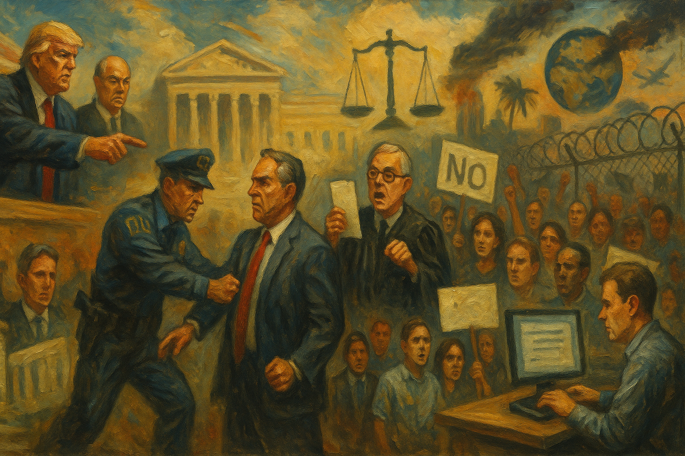

<!-- Generated by build_publish_week_v1 (appendix post) -->
<!-- Header image: image_wide_week4_appendix.png -->

# Week 4 Appendix: Seizure, Litigation, and Contempt for Courts

*An unelected team seized federal data systems as courts pushed back and senior officials attacked judges for resisting them.*

This week showed a systemic escalation from isolated executive actions to institutional entrenchment. The DOJ's dismissal of the Adams corruption case amid mass prosecutor resignations, combined with the pause on FCPA enforcement and the Weaponization Working Group, revealed a pattern of law being converted into a tool of political protection rather than a constraint on power. Simultaneously, DOGE's unchecked access to Treasury, CMS, and HR databases, paired with mass firings across USAID, EPA, Education, and the civil service, showed rapid hollowing of institutional capacity. Courts remained the most active check, issuing at least a dozen injunctions and TROs against the administration, but open defiance and delay (NIH funding freeze continuation, USAID walkthroughs during a TRO) signaled a growing willingness to test judicial authority. Attacks on journalists, judges, and inspectors general intensified, alongside symbolic assertions of personal power (Kennedy Center takeover, Gulf of America proclamation).

Power and Authority

1. Trump announced self-appointment as chair of the Kennedy Center and fired board members including chair David Rubenstein (2025-02-08): The president asserted personal control over a congressionally chartered cultural institution, raising concerns about politicization of the arts and disregard for institutional independence.

2. Trump issued an executive order prioritizing Afrikaner refugees for resettlement while planning to end legal status for over 530,000 immigrants from Cuba, Haiti, Nicaragua, and Venezuela (2025-02-08): The administration used immigration policy to favor one racial group while stripping legal status from hundreds of thousands of others, raising equal-protection concerns.

3. Elon Musk's DOGE team targeted NOAA for possible elimination and disrupted operations at 15 or more federal agencies while seeking access to sensitive data (2025-02-08): An unelected private individual's team gained sweeping access to federal agency data and operations, threatening scientific functions and data security without normal oversight.

4. Trump administration cut Department of Education staff and spending through DOGE representatives and threatened mass firings at the EPA affecting over 1,000 employees (2025-02-08): Executive action shrank federal agencies' capacity to enforce education and environmental protections, concentrating discretion in the executive branch.

5. EPA placed more than 160 environmental justice employees on paid administrative leave (2025-02-08) *[single source]*: The administration sidelined staff focused on environmental justice, reducing the agency's capacity to protect vulnerable communities.

6. Trump established a task force to eradicate anti-Christian bias in the federal government (2025-02-08): The order raised church-state separation concerns by creating a federal apparatus focused on a single religion's grievances.

7. Trump ordered a review of federal funding to all non-government organizations (2025-02-08): The directive threatened the financial independence of civil-society groups that may act as watchdogs or critics of government policy.

8. Trump administration placed thousands of global USAID employees on administrative leave with orders to return to the U.S. within 30 days (2025-02-08): The move disrupted a federal foreign-aid agency's staffing and operations ahead of any legislative review, concentrating control in the executive branch.

9. Trump sought $500 million in mineral and gas resources from Ukraine as part of a deal to end the war with Russia (2025-02-08): The demand for resource concessions from an ally under wartime pressure raised concerns about exploiting a vulnerable partner for personal or national gain.

10. Trump threatened new sanctions and tariffs on Russia unless Putin reached a ceasefire deal on Ukraine (2025-02-08): The threat used economic leverage in an active war negotiation, shaping foreign policy through unilateral presidential ultimatums.

11. Trump signed an executive order sanctioning the International Criminal Court over its investigations of Israel (2025-02-08): The order used state power to punish an international judicial body, undermining global accountability mechanisms for war crimes.

12. Trump stated the U.S. would take over Gaza and suggested relocating Palestinians living there (2025-02-08): The statement proposed a mass displacement widely characterized as ethnic cleansing, a stance with major implications for international law and human rights.

13. Trump signed an executive order withdrawing the United States from the UN Human Rights Council and suspending future funding to UNRWA (2025-02-08): The withdrawal reduced U.S. participation in international human rights oversight, diminishing global accountability structures the U.S. once supported.

14. Elon Musk unilaterally decreed the end of unspecified federal departments (2025-02-08) *[single source]*: A private individual asserted authority to dissolve government departments outside any legislative or constitutional process.

15. Trump signed a proclamation designating February 9 as Gulf of America Day, formalizing the renaming of the Gulf of Mexico (2025-02-09): The executive branch unilaterally altered established geographic nomenclature, using state power to reshape national symbols and historical narrative.

16. Trump signed an executive order directing Attorney General Bondi to review all gun regulations to ensure they do not infringe on Second Amendment rights (2025-02-09): The order directed unilateral executive review of firearms regulation, shifting policymaking authority away from Congress toward the executive.

17. Trump planned to sign an executive order reversing a ban on bank overdraft fees and shielding medical debt from credit reports (2025-02-09): The rollback removed consumer financial protections benefiting ordinary borrowers, favoring banking-industry interests.

18. Trump prioritized issuing an executive order directing federal agencies to cooperate with Elon Musk's Department of Government Efficiency (2025-02-11): The order handed a private individual formal authority over federal hiring and firing decisions, blurring lines between public accountability and private control.

19. Tom Homan publicly attacked Pope Francis and told him to leave border enforcement to the administration, one day after the pope criticized immigration policy (2025-02-11): A senior official's attack on a religious leader for criticizing enforcement policy attempted to delegitimize institutional moral opposition to the administration's agenda.

20. Trump suggested the U.S. might not honor all Treasury bond obligations, citing unverified claims of fraud found by DOGE (2025-02-11): The suggestion threatened the full faith and credit of U.S. debt, a constitutional obligation, based on unsubstantiated claims.

21. The White House issued an executive order asserting the president's exclusive constitutional authority over foreign policy and directing personnel discipline for Foreign Service members who deviate (2025-02-12): The order concentrated foreign-policy control in the presidency and threatened career diplomats with discipline for independent judgment, undermining institutional checks.

22. Trump disbanded the Kleptocapture task force responsible for seizing Russian assets (2025-02-12): Ending the sanctions-enforcement task force removed a key tool for economic pressure on Russia amid ongoing negotiations over Ukraine.

23. Trump and Vladimir Putin agreed to begin negotiations toward a Ukraine ceasefire, with Trump suggesting Ukraine may need to cede territory and forgo NATO membership (2025-02-12): Bilateral negotiations excluding Ukraine's president signaled a shift in U.S. commitment to an ally's sovereignty and territorial integrity.

24. Pete Hegseth announced at a Brussels summit that the U.S. would no longer prioritize European security and would shift focus to China (2025-02-12): The declared strategic pivot signaled reduced U.S. commitment to longstanding NATO alliance defense obligations.

25. Scott Bessent offered Ukraine's president a deal exchanging U.S. support for half of Ukraine's mineral resources, which was rejected (2025-02-12): The proposal to trade continued support for resource concessions raised concerns about leveraging an ally's wartime vulnerability for economic gain.

26. Trump called Putin and echoed Putin's justifications for invading Ukraine following talks (2025-02-12): The president's adoption of an aggressor's war narrative signaled alignment with an authoritarian state over a democratic ally under invasion.

27. Trump commented that Russia deserves to keep conquered Ukrainian territory (2025-02-12): Endorsing territorial gains from an invasion undermined international norms against acquiring territory by force.

28. The White House signed an executive order establishing the Make America Healthy Again Commission chaired by HHS Secretary Kennedy with broad authority over federal health research policy (2025-02-13): The order concentrated influence over federal health research and regulatory priorities in a commission led by a vaccine skeptic, raising scientific-integrity concerns.

29. Eric Adams announced plans to reestablish an ICE office at Rikers Island despite city sanctuary laws prohibiting such operations (2025-02-13): A mayor's plan to bypass local sanctuary protections for federal immigration enforcement raised local rule-of-law and civil-rights concerns.

30. The White House issued a release announcing enforcement actions against states, cities, and entities characterized as noncompliant, including lawsuits and investigations (2025-02-13): A coordinated multi-agency campaign against jurisdictions and institutions perceived as opposing administration policy raised federalism and due-process concerns.

31. J.D. Vance criticized European democratic values at the Munich Security Conference and met with the leader of Germany's far-right AfD party, breaking diplomatic protocol (2025-02-14): A senior U.S. official's public support for a far-right European party and criticism of allied democracies signaled a shift toward embracing illiberal movements abroad.

32. Marco Rubio held a call with Russian Foreign Minister Lavrov that suggested discussion of sanctions relief for Russia (2025-02-14) *[single source]*: The apparent openness to easing sanctions on Russia during an ongoing invasion of Ukraine signaled a reversal of coordinated allied pressure.

Institutions and Governance

1. Attorney General Pam Bondi ended federal funding to sanctuary jurisdictions and scaled back enforcement of foreign lobbying transparency laws (2025-02-08) *[single source]*: Reduced enforcement of transparency and sanctuary-funding rules weakened oversight of both local governments and foreign influence in U.S. politics.

2. CIA offered buyouts to its entire workforce as part of broader federal downsizing efforts (2025-02-08): Blanket buyout offers to an intelligence agency's entire staff risked degrading institutional expertise and national-security capacity.

3. Senator Angus King criticized Republican colleagues on the Senate floor for complacency toward what he called the administration's assault on the Constitution (2025-02-08) *[single source]*: A senator's floor speech highlighted internal congressional debate over checks on executive power during a confirmation vote.

4. Al Green announced plans to introduce articles of impeachment against Trump over comments about taking over Gaza (2025-02-08) *[single source]*: A congressional impeachment threat reflected legislative pushback against executive foreign-policy statements.

5. U.S. District Judge Carl J. Nichols blocked the Trump administration from placing over 2,000 USAID employees on paid leave (2025-02-08): A federal court intervened to stop an unsubstantiated executive action from disrupting a federal agency's staffing.

6. Judge Paul A. Engelmayer issued an emergency temporary restraining order prohibiting DOGE access to Treasury Department systems and requiring destruction of downloaded material (2025-02-08): A federal court moved to stop unauthorized access to sensitive taxpayer financial data by an unvetted external team.

7. ACLU sued over a Trump executive order that effectively suspended U.S. asylum law (2025-02-08): Civil-rights litigation challenged an executive action that curtailed statutory asylum protections.

8. Pam Bondi reinstated the federal death penalty, ending a Biden-era moratorium, and called for new state charges against individuals with commuted sentences (2025-02-08) *[single source]*: The reversal marked a significant shift in federal criminal-justice policy with implications for due process and clemency decisions.

9. Justice Department reversed a stop-work order for immigration court support programs after nonprofit groups sued (2025-02-08) *[single source]*: Litigation pressure forced restoration of funding supporting access to legal counsel in immigration proceedings.

10. DOJ sued Chicago and Illinois, alleging their sanctuary laws interfere with federal immigration enforcement (2025-02-08) *[single source]*: Federal litigation against local sanctuary policies escalated tension between federal enforcement priorities and local self-governance.

11. Elon Musk and Senator Tom Cotton attacked a federal judge who blocked DOGE from accessing Treasury records, calling him an outlaw and suggesting he be barred from future cases (2025-02-08) *[single source]*: Public attacks on a sitting judge by a billionaire adviser and a senator threatened judicial independence following an unfavorable ruling.

12. FBI employees filed a class-action lawsuit to block release of names of employees involved in Jan. 6 investigations (2025-02-08): Employees sought judicial protection against potential retaliation for participation in politically sensitive investigations.

13. Former NLRB member filed a federal lawsuit against Trump and the new NLRB chairman alleging an illegal firing (2025-02-08): The lawsuit tested the legality of removing independent labor-board officials outside statutory protections.

14. Federal judge temporarily blocked Trump's executive order ending birthright citizenship, citing irreparable harm (2025-02-08): A court halted an executive attempt to unilaterally reinterpret a constitutional citizenship guarantee.

15. Federal judge temporarily blocked the DOJ from releasing names of FBI employees involved in Jan. 6 and Trump-related investigations (2025-02-08): Judicial intervention protected law-enforcement personnel from potential exposure and retaliation.

16. Federal judge blocked a midnight deadline imposed by the Trump administration for federal workers to accept buyouts (2025-02-08): A court paused a coercive federal-workforce reduction tactic pending further review.

17. Federal judge temporarily blocked the administration from transferring trans women to men's prisons and ending gender-affirming care (2025-02-08) *[single source]*: The ruling preserved protections for a vulnerable incarcerated population pending litigation.

18. U.S. judge ordered a two-week extension of a pause on the administration's federal fund freeze (2025-02-08): The extension prevented the executive from unilaterally overriding congressionally appropriated funding decisions.

19. Federal judge granted an injunction in Seattle against Trump's executive order on birthright citizenship (2025-02-08): A second court blocked the administration's attempt to end birthright citizenship by executive fiat.

20. Steve Wynn petitioned the Supreme Court to overturn New York Times v. Sullivan, the precedent protecting press freedom in reporting on public officials (2025-02-08): The petition sought to weaken decades-old legal protection for journalism scrutinizing powerful figures.

21. Trump administration reversed its position in a Supreme Court case, arguing in favor of a Tennessee ban on gender-affirming care for trans youth (2025-02-08): The shift in the federal government's legal stance signaled a change in policy toward transgender healthcare rights before the Supreme Court.

22. Federal employee unions sued the Trump administration alleging privacy-law violations from granting DOGE access to sensitive payment systems (2025-02-08): The lawsuit challenged unauthorized access to government data systems containing personal employee information.

23. Labor unions sued the Trump administration to reverse cuts to USAID and the pause on foreign aid (2025-02-08) *[single source]*: Litigation sought to restore an agency's funding and operations after abrupt executive cuts.

24. Attorney General Pam Bondi launched a Weaponization Working Group to review prosecutions of Trump and investigate alleged prosecutorial abuse tied to Jan. 6 investigations (2025-02-08): The new DOJ unit signaled intent to challenge past accountability efforts, raising concerns about politicized law enforcement.

25. Interim U.S. Attorney Ed Martin offered legal protection to DOGE workers and threatened action against anyone impeding their work (2025-02-08) *[single source]*: A federal prosecutor's pledge to shield a controversial private-led initiative from accountability raised rule-of-law concerns.

26. FBI officials provided the DOJ with identifying details of over 5,000 employees involved in Jan. 6 investigations (2025-02-08): The disclosure of sensitive employee information raised concerns about potential retaliation against career law-enforcement staff.

27. Jake Struebing warned that his removal and other DOJ firings tied to Jan. 6 investigations constituted a threat to national security (2025-02-08) *[single source]*: A former prosecutor's public warning highlighted concerns about political interference undermining law-enforcement independence.

28. Brian Schatz placed a blanket hold on all Trump State Department nominees until USAID funding was restored (2025-02-09): A senator used procedural leverage to press the administration to reverse cuts to foreign-aid programs.

29. Hakeem Jeffries introduced legislation to shield taxpayers' personal data from DOGE access (2025-02-09): The proposed legislation sought to legally constrain unauthorized data access by an unaccountable outside entity.

30. Republican lawmakers from affected states expressed concern over NIH indirect-funding cuts that could harm state research programs (2025-02-09) *[single source]*: Cross-partisan pushback highlighted the wide-reaching impact of research funding cuts on constituents in both parties.

31. Court temporarily lifted a stop-work order that had halted legal-service programs for immigrants and asylum seekers (2025-02-09) *[single source]*: Judicial intervention restored access to legal representation for vulnerable immigrants facing deportation.

32. J.D. Vance tweeted that judges are not allowed to control the executive's legitimate power (2025-02-09): The vice president's statement articulated a position that the executive branch is not bound by judicial review, challenging separation of powers.

33. Judge McConnell ruled the Trump administration was violating his order lifting a federal funding freeze and ordered immediate release of funds (2025-02-09): A judge found the administration in noncompliance with a prior court order and threatened contempt proceedings.

34. Senator Tom Cotton and Senator Mike Lee publicly criticized a federal judge's ruling blocking Treasury access as outrageous and akin to a judicial coup (2025-02-10) *[single source]*: Senators' rhetoric characterizing an adverse judicial ruling as illegitimate risked eroding public trust in the judiciary.

35. Rep. Eli Crane announced he was drafting articles of impeachment against U.S. District Judge Paul Engelmayer for ruling against DOGE (2025-02-10): A member of Congress threatened impeachment of a sitting judge in direct response to an unfavorable ruling, testing judicial independence.

36. Federal judge George O'Toole maintained a temporary block on the Trump administration's mass federal-worker buyout plan (2025-02-10): A court paused an unprecedented buyout program affecting millions of federal employees pending review.

37. Judge John Bates ordered HHS, CDC, and FDA to restore webpages removed after an anti-DEI executive order (2025-02-10): The court ordered reinstatement of public health information erased due to a politically motivated directive.

38. Judge John J. McConnell Jr. ordered the Trump administration to immediately restore frozen federal funding, finding it had defied a prior order (2025-02-10) *[single source]*: A court reaffirmed judicial authority after finding the administration noncompliant with an earlier funding-release order.

39. DOGE faced numerous lawsuits alleging privacy and free-speech violations tied to its access and cuts across agencies (2025-02-10) *[single source]*: Legal experts and litigants challenged the legality of a private-led initiative's sweeping government access.

40. Federal judge temporarily blocked Musk and his team from accessing Treasury Department computer records (2025-02-10): Judicial action limited unauthorized access to Americans' financial records by an outside advisory team.

41. Judge Amy Berman Jackson issued an administrative stay on the termination of Special Counsel Hampton Dellinger through Feb. 13 (2025-02-10): A court temporarily preserved the tenure of an independent watchdog official facing removal.

42. Plaintiff in University of California Student Ass'n v. Carter moved for a TRO to stop DOGE from disclosing or retaining personal data obtained from federal systems (2025-02-10): Litigation sought to prevent misuse of federal data by an unaccountable outside entity.

43. Gwynne Wilcox moved for expedited summary judgment in her case challenging her removal from the NLRB (2025-02-10): The litigation tested legal protections for independent-agency board members against unilateral removal.

44. Judge McConnell granted plaintiffs' motion to enforce a temporary restraining order after finding the administration continued to improperly freeze funds (2025-02-10): A court found continued noncompliance with its order and mandated immediate restoration of appropriated funding.

45. Federal judge blocked DOGE from placing USAID workers on leave and from accessing Treasury payment systems (2025-02-10): Multiple judicial rulings restrained a private-led effort's actions against federal agencies and systems.

46. Danielle Sassoon and Hagan Scotten resigned as federal prosecutors after refusing DOJ leadership's demand to drop corruption charges against NYC Mayor Eric Adams (2025-02-12): Career prosecutors' resignations exposed political pressure to protect an ally from prosecution regardless of evidence.

47. Eight former inspectors general fired by Trump filed a lawsuit seeking reinstatement and challenging their dismissals as unlawful (2025-02-12): The lawsuit tested legal protections against politically motivated removal of independent government watchdogs.

48. Judge George O'Toole Jr. ruled that Trump's federal-worker buyout program could proceed, finding unions lacked standing to challenge it (2025-02-12): A court allowed a large-scale federal workforce reduction to move forward despite union objections.

49. Judge Brendan Hurson temporarily blocked Trump's executive order restricting gender-affirming healthcare for transgender individuals under 19 (2025-02-12): A court paused enforcement of a policy that would cut off federal funding to providers of gender-affirming care for minors.

50. Kash Patel was accused by Senator Dick Durbin of orchestrating a purge of FBI agents while a private citizen, potentially contradicting his confirmation testimony (2025-02-12) *[single source]*: The allegation raised concerns of unlawful influence over federal law enforcement and possible perjury by an FBI nominee.

51. Governor Josh Shapiro sued the Trump administration to compel release of over $3 billion in withheld federal funds appropriated to Pennsylvania (2025-02-14) *[single source]*: A state lawsuit sought to enforce constitutional appropriations authority against executive impoundment.

52. U.S. District Judge Amir Ali ordered the Trump administration to disburse impounded foreign aid, rejecting its justification for the suspension (2025-02-14): A court rejected the administration's rationale for withholding congressionally appropriated foreign aid.

53. Senate confirmed Russell Vought as director of the Office of Management and Budget over Democratic objections (2025-02-08) *[single source]*: The confirmation of a Project 2025 architect with expansive views of executive power raised concerns about budgetary and constitutional checks.

54. Elon Musk was granted a top-secret security clearance as a special government employee (2025-02-08) *[single source]*: Granting high-level security access to a private businessman with extensive government contracts raised conflict-of-interest concerns.

55. Trump removed Federal Election Commission chair Ellen Weintraub from her role (2025-02-08): The removal of an election oversight official raised concerns about the independence of federal election administration.

56. Trump nominated Neil Jacobs, previously cited for misconduct related to 'Sharpiegate,' to lead NOAA (2025-02-08) *[single source]*: The nomination of a controversial figure to lead a scientific agency raised concerns about the agency's independence and credibility.

57. Trump administration appointed Darren Beattie, previously fired for links to white nationalist events, as acting under-secretary of State for Public Diplomacy (2025-02-08): The appointment placed a figure with extremist ties in a senior diplomatic communications role.

58. Robert F Kennedy Jr was confirmed by the Senate as Secretary of Health and Human Services after a party-line vote (2025-02-13): Confirming a vaccine skeptic to lead national health agencies raised concerns about the integrity of public health policy and science.

59. Senate confirmed Tulsi Gabbard as director of national intelligence over Democratic objections and one Republican dissent (2025-02-13) *[single source]*: Concerns about the nominee's qualifications and foreign-policy statements accompanied her confirmation to lead the intelligence community.

60. Trump fired the director of the Office of Government Ethics (2025-02-10): Removing the head of the federal ethics oversight body weakened institutional checks on conflicts of interest.

61. Trump administration fired USAID's independent inspector general following a critical report on the agency's dismantling (2025-02-11): The retaliatory firing of an internal watchdog undermined accountability for the administration's own agency cuts.

62. National Treasury Employees Union sued OMB Director Russell Vought over his directive to cease CFPB operations, alleging it unlawfully undermines Congress's authority (2025-02-11): The lawsuit challenged executive attempts to unilaterally shut down an agency created by congressional statute.

63. Judge Angel Kelley blocked NIH from implementing a rate change affecting research funding after a lawsuit by 22 states (2025-02-11): The ruling paused a policy that would have significantly cut medical research funding pending litigation.

64. Federal judge in Massachusetts blocked the Trump administration from cutting NIH indirect research funding after 22 states and universities sued (2025-02-11): The ruling protected medical research funding from an abrupt policy change lacking proper process.

65. American Bar Association publicly condemned the Trump administration for actions its president said undermine the rule of law (2025-02-11): A major legal professional body's condemnation reflected concern among legal experts about erosion of legal norms.

66. Five former Treasury secretaries published an op-ed warning of constitutional risks from political interference in Treasury's data systems (2025-02-11): Former senior officials publicly warned about risks to national security and privacy from unvetted access to sensitive systems.

67. NIH leadership continued to prohibit grant funding in violation of two federal court injunctions, then reversed course after reporting exposed the noncompliance (2025-02-11) *[single source]*: An agency's defiance of federal court orders and subsequent reversal illustrated tension between executive compliance and judicial authority.

68. Denver public school system sued the Trump administration challenging a policy allowing ICE agents access to schools (2025-02-13): A school district's lawsuit sought to block immigration enforcement that it said diverted resources and suppressed attendance.

69. US Justice Department sued New York over its 'green light' law allowing driver's licenses without proof of legal residency (2025-02-13) *[single source]*: The federal lawsuit sought to strike down a state immigration-related law, testing state versus federal authority.

70. Prosecutors dismissed approximately 60% of charges filed against Gaza protesters across a dozen major U.S. cities (2025-02-11) *[single source]*: Widespread dismissal of protest-related charges suggested many arrests lacked legal grounds, raising concerns about mass arrest as a deterrent tactic.

71. Judge Jerri Zhang struck down a Missouri licensing requirement for abortion clinics as medically unnecessary and discriminatory (2025-02-14) *[single source]*: The ruling restored abortion access in a state where a 2024 ballot measure had enshrined reproductive rights.

72. Justice Department requested dismissal of corruption charges against NYC Mayor Eric Adams after seven prosecutors resigned in protest (2025-02-14): The dismissal, sought for reasons unrelated to the strength of evidence, raised concerns about political interference in prosecutorial decisions.

73. Steve Bannon pleaded guilty to a state fraud charge related to the 'We Build the Wall' fundraising scheme (2025-02-11): The plea deal avoided jail time for a political ally previously pardoned on related federal charges, raising accountability concerns.

74. Senate confirmed Russell Vought as OMB Director despite a Democratic boycott and criticism over a prior grant-funding freeze (2025-02-10): Continued controversy accompanied confirmation of an official with expansive views of unilateral executive budgetary power.

Economic Structure

1. Trump administration cut National Institutes of Health indirect medical research funding by an estimated $4 billion annually (2025-02-08): The funding cap threatened research infrastructure at universities and hospitals nationwide, jeopardizing scientific and public-health capacity.

2. Russ Vought announced elimination of funding for the Consumer Financial Protection Bureau, effectively halting its operations (2025-02-08): Defunding a consumer-protection watchdog reduced oversight of the financial industry, favoring institutional interests over consumer safeguards.

3. Trump imposed a 10% tariff on Chinese goods then exempted packages under $800, undercutting the tariff's economic impact (2025-02-08) *[single source]*: The inconsistent tariff policy raised questions about the administration's trade strategy and its effectiveness.

4. Trump administration left Head Start preschools locked out of federal funding despite a pause on the broader grant freeze (2025-02-08): Continued funding disruption threatened early-childhood education services for low-income families.

5. Trump administration instructed SEC lawyers to seek approval from politically appointed leadership before launching investigations (2025-02-08) *[single source]*: The directive risked politicizing financial regulatory enforcement and delaying independent oversight of markets.

6. Trump unilaterally announced tariffs on Canada, Mexico, and China, later delaying implementation for Canada and Mexico by 30 days (2025-02-08) *[single source]*: Sudden tariff announcements followed by delays created uncertainty in major U.S. trade relationships.

7. Trump announced 25% tariffs on all steel and aluminum imports, ending prior country exemptions (2025-02-09): Broad new metal tariffs affecting allies risked economic retaliation and higher domestic prices.

8. NIH announced a policy capping indirect medical research funding at 15%, down from roughly 26% (2025-02-09): The funding cap threatened the financial stability of research institutions reliant on federal grants for overhead costs.

9. China implemented retaliatory tariffs on U.S. exports including natural gas, coal, crude oil, and farm equipment (2025-02-09) *[single source]*: Escalating trade retaliation threatened to worsen tensions between the world's two largest economies.

10. Trump signed executive orders pausing enforcement of the Foreign Corrupt Practices Act for 180 days (2025-02-10): Suspending enforcement of an anti-bribery law weakened accountability for corporate corruption abroad, benefiting business interests over rule of law.

11. Trump signed executive order eliminating the Federal Executive Institute, a leadership-training program for federal employees (2025-02-10): Ending a decades-old training institution reduced investment in professional development of the federal workforce.

12. Trump signed executive order reversing a ban on federal procurement of single-use plastics, reinstating paper-to-plastic straw policy (2025-02-10): The reversal favored plastics-industry interests over environmental sustainability policy.

13. Airlines for America hired a lobbyist described as having the most influence over the Trump administration to represent industry interests (2025-02-10) *[single source]*: The hiring illustrated how proximity to executive power can be purchased to shape regulatory outcomes favoring industry.

14. Trump signed a presidential memorandum directing development of a reciprocal-tariff plan targeting trading partners deemed non-reciprocal (2025-02-13): The directive expanded unilateral executive authority over trade policy without congressional involvement.

15. Dept of Veterans Affairs fired 1,000 employees, citing projected annual savings of $98 million (2025-02-13): Cuts to veterans' services staffing raised concerns about the department's capacity to support veterans.

16. Uline allegedly underpaid Mexican workers brought in on improper tourist and B1 visas compared to U.S. counterparts (2025-02-12) *[single source]*: The alleged labor and immigration-law violations exploited foreign workers while undercutting U.S. wage standards.

17. State Department was reported likely to award Elon Musk's companies a $400 million contract for armored electric vehicles (2025-02-12): A large government contract to a company owned by a senior administration adviser raised conflict-of-interest concerns.

18. Trump threatened tariffs on countries with value-added tax systems, targeting the European Union (2025-02-12): The threat risked escalating trade tensions with a major U.S. trading partner and ally.

19. NIH acknowledged its funding freeze was illegal and resumed issuing grants following two federal court orders (2025-02-12) *[single source]*: The agency's admission confirmed prior noncompliance with judicial rulings requiring restoration of research funding.

20. Dept of Energy fired 300 employees of the National Nuclear Security Administration, which oversees nuclear weapons (2025-02-13): Reducing staff at a nuclear-security agency raised concerns about national-security and safety oversight.

21. Trump administration / DOGE terminated approximately 24,000 probationary federal workers across multiple agencies with minimal notice (2025-02-14): A mass firing of newly hired federal employees disrupted government operations and left workers in administrative limbo.

Civil Rights and Dissent

1. ICE arrested a Nicaraguan asylum seeker with legal work authorization at a routine check-in despite compliance with reporting requirements (2025-02-08) *[single source]*: The arrest of a compliant asylum seeker exemplified enforcement of a policy subjecting all undocumented immigrants to detention regardless of history, undermining due process.

2. Congress received tens of millions of constituent calls urging opposition to Trump and Musk's actions, overwhelming the phone system (2025-02-08): A massive surge in constituent contact demonstrated significant public mobilization against perceived threats to government functions.

3. J.B. Pritzker issued a satirical proclamation renaming Lake Michigan 'Lake Illinois' in response to Trump's Gulf of Mexico renaming (2025-02-08): A governor's public mockery of the administration's renaming policy illustrated political resistance through satire.

4. ICE conducted armed raids in Denver and Aurora, Colorado under Operation Aurora, resulting in 30 arrests but only one confirmed gang member (2025-02-09) *[single source]*: The disproportionate, heavily armed raids sparked protests and fear among the local immigrant community despite limited results.

5. Oklahoma board of education voted to require citizenship information from parents enrolling children in public schools (2025-02-10) *[single source]*: The policy challenged a constitutional right to public education regardless of immigration status and risked deterring enrollment out of fear.

6. Fremont city council passed an ordinance banning camping on public property and criminalizing aid to homeless encampments (2025-02-11): The ordinance criminalized homelessness and those assisting unhoused individuals, drawing significant civil-rights criticism.

7. New York state police charged five individuals with the murder of a transgender man after prolonged torture and abuse (2025-02-13): The prosecution addressed a violent hate crime against a transgender individual amid rising anti-LGBTQ+ violence concerns.

8. Trump issued an executive order banning transgender individuals from joining or serving openly in the military (2025-02-11): The order restricted military service based on gender identity, prompting legal challenges over discrimination.

9. ICE officials were reassigned for not meeting deportation and arrest quotas, prompting new pressure to increase enforcement numbers (2025-02-12) *[single source]*: Pressure to meet enforcement quotas risked incentivizing aggressive or indiscriminate immigration arrests.

10. Sangamon County settled with the family of Sonya Massey, a Black woman killed by a sheriff's deputy, for $10 million and agreed to policing reforms with DOJ (2025-02-12): The settlement and reform agreement addressed police violence and systemic racism following a high-profile killing.

11. ICE sent its first military flight transporting migrants to Guantanamo Bay (2025-02-08): Detaining migrants at a military facility historically used for terrorism suspects raised human-rights concerns about immigration enforcement.

12. ICE detained several unidentified workers from a Memphis taco truck, reportedly without uniforms or identification (2025-02-10) *[single source]*: The unmarked, unidentified nature of the raid raised due-process and accountability concerns about immigration enforcement tactics.

13. Rabbis and Jewish activists published a New York Times ad signed by over 350 signatories condemning Trump's Gaza takeover plan as ethnic cleansing (2025-02-13) *[single source]*: The public advocacy campaign represented civil-society opposition to a proposed mass displacement of Palestinians.

14. North Carolina Progressive Caucus introduced bills to limit immigration enforcement at farms, worksites, places of worship, hospitals, and schools (2025-02-12) *[single source]*: State-level legislation sought to restrict immigration enforcement in sensitive community locations.

15. North Carolina Democratic Party organized a rally at the state legislature to oppose proposed legislation and advocate for progressive policy (2025-02-12) *[single source]*: The planned rally reflected active civic mobilization against legislative proposals viewed as harmful to democratic norms.

16. Lisa Murkowski and Dan Sullivan introduced legislation to legally restore the name Denali for North America's tallest mountain, countering Trump's renaming order (2025-02-14): Senators sought to preserve Indigenous naming heritage against an executive order reverting the mountain's name.

17. Louisiana health department ceased promoting mass vaccinations through media campaigns and health fairs amid a measles outbreak in neighboring Texas (2025-02-14): The policy shift risked lowering vaccination rates and increasing disease outbreaks, undermining public health messaging.

Information, Memory and Manipulation

1. Elon Musk's DOGE team disrupted operations and sought sensitive data access across at least 15 federal agencies with limited transparency about its personnel (2025-02-08) *[single source]*: Opaque access to government data by an unaccountable team raised concerns about data security and the integrity of federal operations.

2. American Accountability Foundation published a 'DEI Watch List' doxxing federal health workers involved in diversity initiatives (2025-02-08): Publicly targeting federal employees for their diversity work endangered their safety and chilled participation in inclusion efforts.

3. DOGE representatives accessed payment and contracting systems at the Centers for Medicare and Medicaid Services without full vetting (2025-02-08): Unauthorized access to healthcare payment systems raised data-security and oversight concerns.

4. Energy Secretary Chris Wright granted a DOGE associate access to the Energy Department's IT system despite objections from the department's general counsel (2025-02-08): Overriding internal legal objections to grant sensitive system access raised concerns about circumvented safeguards.

5. White House canceled $8 million worth of federal Politico subscriptions after a conspiracy theory alleging USAID subsidized the outlet (2025-02-08): Punitive funding cuts targeting a news outlet based on unverified claims undermined press independence.

6. FCC launched an investigation into radio station KCBS over its reporting on immigration enforcement raids (2025-02-08): A federal agency's scrutiny of a broadcaster's coverage of enforcement actions raised press-freedom concerns.

7. Elon Musk called for the firing of a Wall Street Journal reporter after she reported on a DOGE employee's racist social media posts (2025-02-08): A senior adviser's public campaign against a journalist for critical reporting threatened press independence.

8. NCMEC removed publications mentioning queer and transgender children from its website (2025-02-08) *[single source]*: The removal reduced visibility and available information supporting LGBTQ+ youth safety resources.

9. Trump called for the firing of Washington Post columnist Eugene Robinson over critical commentary (2025-02-08) *[single source]*: A public call to remove a critical journalist from his position pressured media outlets to silence dissenting voices.

10. Trump administration took the USAID website and Twitter account offline following the placement of top security officials on leave (2025-02-08) *[single source]*: Removing an agency's public information channels restricted transparency about its operations and status.

11. Elon Musk added data from a controversial rightwing thinktank to the DOGE website's regulations page (2025-02-12): Incorporating partisan advocacy data into an official government transparency site raised concerns about politicized government information.

12. White House barred Associated Press journalists from the Oval Office and Air Force One over the outlet's refusal to adopt the 'Gulf of America' terminology (2025-02-11): Denying press access to a major wire service over an editorial disagreement represented direct retaliation against independent journalism.

13. State Department directed global outposts to cancel non-mission-critical media subscriptions (2025-02-11): Restricting diplomatic staff's access to news sources risked impairing their situational awareness and safety.

14. Congressman Nick Begich promoted a debunked claim that millions of people over 100 years old were receiving Social Security benefits (2025-02-11) *[single source]*: A sitting member of Congress spread misinformation about federal benefits without correction, undermining factual public discourse.

15. NSA began deleting websites and internal content containing 27 banned words including 'privilege,' 'bias,' and 'inclusion' (2025-02-10) *[single source]*: A blunt content purge risked removing operationally necessary information alongside targeted DEI-related material, disrupting agency functions.

16. White House characterized the Consumer Financial Protection Bureau as a 'weaponized' agency in a public fact sheet, signaling intent to curtail its authority (2025-02-10): Using inflammatory rhetoric to delegitimize an independent regulator laid groundwork for weakening its oversight function.

17. Trump administration signed executive orders directing removal of terms related to race, gender, sexual orientation, and disability from federal health agency websites (2025-02-10): Scrubbing diversity-related terminology from health information disrupted access to evidence-based medical guidance for providers and patients.

18. National Park Service removed all references to transgender people from the Stonewall national monument website (2025-02-13): Erasing transgender history from a landmark civil-rights site altered the federal government's curated historical record without public process.

19. Elon Musk shared a repost containing the name and employment details of a federal judge's daughter after the judge ruled against him (2025-02-10): Amplifying personal information about a judge's family member to a massive audience raised concerns of intimidation against the judiciary.

20. Elon Musk posted classified information about the size and staffing of the National Reconnaissance Office on the DOGE website (2025-02-13): Unauthorized disclosure of classified intelligence information posed a direct risk to national security operations.

21. White House published a promotional release cataloging the administration's claimed policy wins for the week, combining factual claims with curated endorsements (2025-02-14): The self-promotional release exemplified how official channels were used to shape public narrative around a week of controversial actions.

