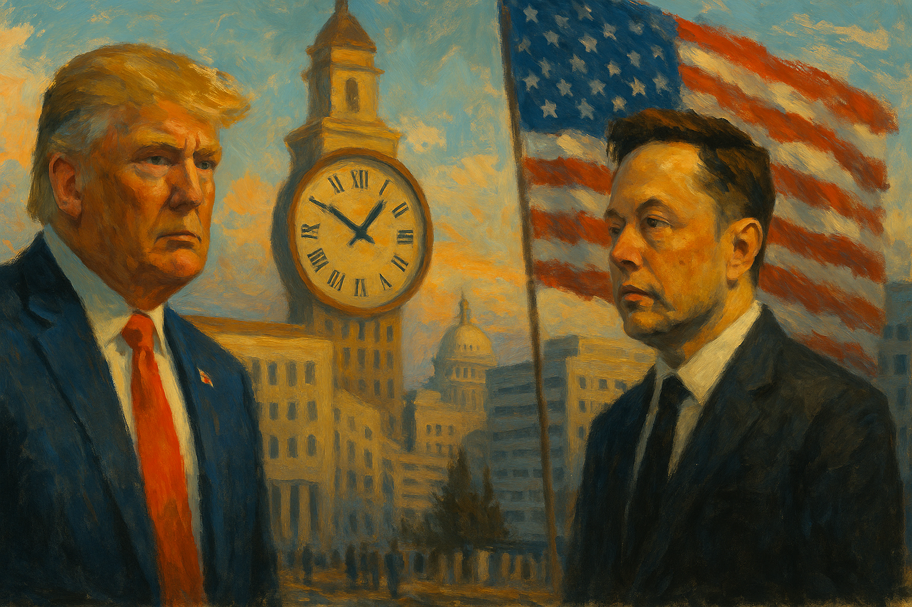

<!-- Generated by build_publish_week_v1 -->
<!-- Header image: image_wide_week4.png -->

# Week 4: Seizure, Litigation, and Contempt for Courts

*An unelected team seized federal data systems as courts pushed back and senior officials attacked judges for resisting them.*

> Power seizes first and litigates later, treating resistance as an obstacle rather than a constraint. — Anonymous legal observer
> A court that rules and is obeyed is different from a court that rules and is merely tolerated. — Anonymous jurist
> Institutions do not fall in a single week; they are tested, again and again, until something gives. — Anonymous historian

The week did not announce itself with a single rupture. It arrived instead as accumulation: an ordinary-seeming pile of actions that, taken together, reshaped how power moved through the federal government. Courts pushed back with real force. The administration pushed back on the courts in turn. Between these two pressures, the machinery of oversight bent, in places broke, and in a few places held. This is the fourth week of the term's second act. The pattern by now is familiar: expansion met by resistance, resistance met by contempt for the resisters.

At the close of last week the Democracy Clock stood at 7:32 p.m. It closed this week at the same public time. But the measure beneath it moved, from 452.1 to 452.4 minutes on the clock's internal scale, a shift of three-tenths of a minute. The public hand barely stirred. Yet the numbers beneath it recorded something real: a week of extraordinary density, executive reach expanding across more than a dozen traits at once, even as courts issued a wave of injunctions that offset some of that growth. The clock did not leap, because the week cut both ways. It held seizure and pushback together. The net result was a narrow, grinding advance rather than a lurch.

The week's central story was the growing reach of an unelected team into the machinery of government. Elon Musk's DOGE operation moved through Treasury payment systems, the Centers for Medicare and Medicaid Services, and the Department of Energy's networks, often brushing past internal legal objections to do it. A nineteen-year-old with no formal vetting reportedly had access to systems built to protect the financial data of millions of Americans. Judges moved fast. Judge Paul Engelmayer blocked DOGE's access to Treasury systems and ordered downloaded material destroyed. Judge Carl Nichols stopped USAID from being gutted before litigation could run its course. Federal employee unions sued. Five former Treasury secretaries published a joint warning. Democrats introduced legislation to wall off taxpayer data. None of this stopped the underlying project. It only slowed and contested it.

What made the episode significant was not the access alone, but what it revealed about accountability. A private citizen, backed by a small team without security clearances or statutory footing, moved through the guts of federal payment and data systems while the institutions built to prevent exactly this kind of intrusion tried to catch up. By week's end, DOGE material had surfaced containing classified detail about the National Reconnaissance Office's staffing, an intelligence disclosure without recent precedent. The pattern held steady: seize first, litigate later, treat court intervention as an obstacle rather than a constraint.

That treatment of the courts became its own story. When Judge Engelmayer ruled against DOGE, Musk and Senator Tom Cotton called him an "outlaw" and suggested he be barred from future cases. Vice President Vance went further, asserting on social media that judges cannot control the executive's "legitimate power." Representative Eli Crane announced he was drafting articles of impeachment against the same judge. This was not scattered grievance. It was a coordinated campaign, run through a vice president, a senator, a House member, and the president's most visible adviser, aimed at stripping judicial review of its legitimacy. Courts kept ruling anyway. Judge McConnell found the administration still noncompliant with an order to release frozen funds and demanded immediate correction. Judge Amir Ali later rejected the administration's justification for withholding foreign aid outright. The judiciary held its ground this week. Whether it can keep doing so, against senior officials openly questioning its legitimacy, is the open question the week leaves behind.

A third story, distinct from the first two, unfolded inside the Justice Department. DOJ leadership ordered the dismissal of corruption charges against New York City Mayor Eric Adams. Prosecutors Danielle Sassoon and Hagan Scotten refused, and resigned rather than comply; five more prosecutors resigned alongside them. What emerged was unusually blunt: the dismissal had nothing to do with the evidence or the law. By the department's own account, it was a decision made for reasons entirely apart from prosecutorial merit. Paired with a new "Weaponization Working Group" reviewing past investigations of the president, and a pause on enforcement of the Foreign Corrupt Practices Act, the week showed a Justice Department rebuilding itself around the protection of allies rather than the neutral application of law. Steve Bannon's guilty plea to fraud, resolved without jail time despite his own enrichment from a border-wall fundraising scheme, fit the same pattern from another angle. Consequences for the well-connected remain light, when they arrive at all.

Alongside these headline confrontations, the administration pressed forward with a mass reduction of the federal workforce and its watchdogs. The CIA offered buyouts to its entire staff. More than a thousand EPA employees were placed on leave. USAID's global workforce was ordered home within thirty days, its inspector general fired soon after issuing a critical report on the agency's dismantling. The director of the Office of Government Ethics was removed in the same stretch of days. Oversight capacity fell away just as conflicts of interest were multiplying, from DOGE's access to a possible $400 million Tesla contract with the State Department. Courts blocked some of this. A judge paused the administration's coercive buyout deadline; another maintained a hold on the broader plan. But by week's end, roughly 24,000 probationary workers had been terminated across agencies with little notice, a number too large for any single court order to absorb.

Economic policy moved in the same direction: away from oversight, toward the interests of capital and industry. NIH announced a cap on indirect research funding that would strip billions from universities and hospitals nationwide. Twenty-two states sued, and a federal judge blocked the cut. Reporting later showed NIH had kept withholding funds in defiance of that order, before reversing course under renewed pressure. The Consumer Financial Protection Bureau was effectively shut down by its new acting director within thirty-six hours of his arrival. The pause on anti-bribery enforcement under the Foreign Corrupt Practices Act removed, for a full six months, one of the government's central tools against corporate corruption abroad. Any one of these actions, alone, could be called a policy choice. Together, they described a steady redirection of risk, away from institutions and onto the public.

Immigration enforcement intensified in ways that tested both due process and federalism. In Denver and Aurora, an operation billed as targeting gang activity produced thirty arrests and only one confirmed gang member. A flight carried migrants to Guantanamo Bay, a facility built for terrorism suspects, raising immediate human-rights concern. In Memphis, ICE agents reportedly detained taco-truck workers without uniforms or identification. At the same time, Attorney General Bondi's Justice Department sued Chicago and Illinois over sanctuary policies and cut federal funding to noncompliant jurisdictions, while New York faced its own suit over a law permitting driver's licenses without proof of legal residency. Denver's public school system sued in the opposite direction, seeking to block ICE access to its buildings. Federal power pressed hard against local self-governance this week. Courts and cities stood as the only visible counterweight.

Citizenship itself was treated unevenly along explicit lines of origin. An executive order prioritized Afrikaner refugees for resettlement on the same day the administration moved to end legal status for more than 530,000 immigrants from Cuba, Haiti, Nicaragua, and Venezuela. A second federal court blocked the administration's attempt to end birthright citizenship by executive order, the second such injunction in as many weeks. That claim of unilateral authority has, for now, failed in court. The contrast between welcome and expulsion, drawn along racial and national lines, was not incidental. It was the week's clearest statement of who the administration considered worthy of protection.

Pressure on the press took several forms at once. The White House barred Associated Press journalists from the Oval Office and Air Force One after the wire service declined to adopt the administration's preferred name for the Gulf of Mexico. Musk called publicly for the firing of a Wall Street Journal reporter over an unflattering story about a DOGE staffer. Trump called for the firing of a Washington Post columnist. The FCC opened an investigation into a California radio station for its coverage of immigration raids. Separately, a Las Vegas casino magnate petitioned the Supreme Court to overturn New York Times v. Sullivan, the decades-old precedent shielding reporting on public figures from ruinous libel suits. No single action here would threaten press freedom on its own. Aimed at four different outlets by four different actors in the same seven days, they described a coordinated discomfort with scrutiny, not a series of coincidences.

Overseas, the administration's posture shifted in ways with lasting consequence. Trump held a call with Vladimir Putin and afterward echoed Russian justifications for the invasion of Ukraine, suggesting Ukraine might need to cede territory and abandon NATO membership. The Justice Department's Kleptocapture task force, built to seize sanctioned Russian assets, was disbanded. Treasury Secretary Bessent offered Kyiv a deal trading continued American support for half of Ukraine's mineral wealth; Ukraine's government rejected it. At the Munich Security Conference, Vice President Vance criticized European democratic values and met with the leader of Germany's far-right AfD party, breaking with decades of diplomatic protocol. Defense Secretary Hegseth told a Brussels summit the United States would no longer prioritize European security. No single move here altered the war in Ukraine. Together, they marked a visible pivot away from an invaded democratic ally and toward accommodation of the power that invaded it.

Not every current ran the same direction. Courts remained genuinely active this week, functioning as a real check rather than a formality: birthright citizenship blocked twice, Treasury access halted, NIH funding restored under judicial order, the Special Counsel's removal stayed pending review. Roughly sixty percent of charges against Gaza protesters nationwide were dismissed, suggesting many arrests had lacked legal grounding. These were not symbolic gestures. They were institutions doing, under real pressure, what they were built to do. The tension of the week sat right here: genuine resistance from the judiciary, met by genuine contempt for that resistance from senior officials.

Congress showed a fractured version of the same resistance. Senator Angus King rebuked Republican colleagues on the floor for what he called complacency toward constitutional erosion. Senator Brian Schatz placed a blanket hold on State Department nominees to press for restored USAID funding. Democrats introduced legislation shielding taxpayer data from DOGE's reach. None of it altered outcomes. The Senate confirmed Russell Vought to lead the Office of Management and Budget, Robert F. Kennedy Jr. to lead Health and Human Services, and Tulsi Gabbard as Director of National Intelligence, each on close to party-line votes. Holds and speeches registered dissent. They did not change confirmations.

By any single measure, this was a week of contest rather than conquest. Executive reach grew in more places than it retreated. Oversight bodies lost directors, funding, and staff. Whistleblower protections were tested directly by the firing of a Special Counsel under a standing court order to reinstate him. Journalists faced coordinated pressure from multiple directions at once. And yet courts, case after case, refused to yield ground, even as they were mocked and threatened for doing so. The week's arithmetic reflects that balance: broad expansion, substantially offset, but not fully checked.

What remains is a structure under sustained strain rather than a structure broken. The prosecutors who resigned rather than dismiss a case without cause, the judges who ruled again and again against noncompliance, the former Treasury secretaries who put their names to a public warning — all suggest that institutional memory has not yet been erased, only tested. The question this week leaves for the ones that follow is simple. Can that memory, and the will to act on it, hold at the same pace as the pressure now being brought against it?

<!-- Synopses for cross-posting -->
Long Synopsis: This week saw executive power expand across more than a dozen fronts even as courts pushed back with unusual force. Elon Musk's DOGE operation accessed Treasury, CMS, and Energy Department systems, prompting emergency injunctions from multiple judges. When courts ruled against the administration, Musk, Vice President Vance, and members of Congress attacked judges directly, with one representative drafting impeachment articles. The Justice Department ordered dismissal of corruption charges against NYC Mayor Eric Adams, triggering seven prosecutor resignations. Inspectors general were fired, ethics oversight was gutted, and roughly 24,000 probationary workers were terminated. Overseas, the administration pivoted toward accommodating Russia over Ukraine. Courts blocked funding freezes, birthright citizenship repeal, and NIH cuts, holding as a genuine check. The public clock held at 7:32 p.m., but the internal measure moved three-tenths of a minute, reflecting a week of dense, contested advance.
Short Synopsis: DOGE seized access to federal payment systems as courts issued injunctions and senior officials attacked the judges who ruled against them. The Justice Department dropped charges against an ally amid mass resignations. Courts held their ground; the clock barely moved.

