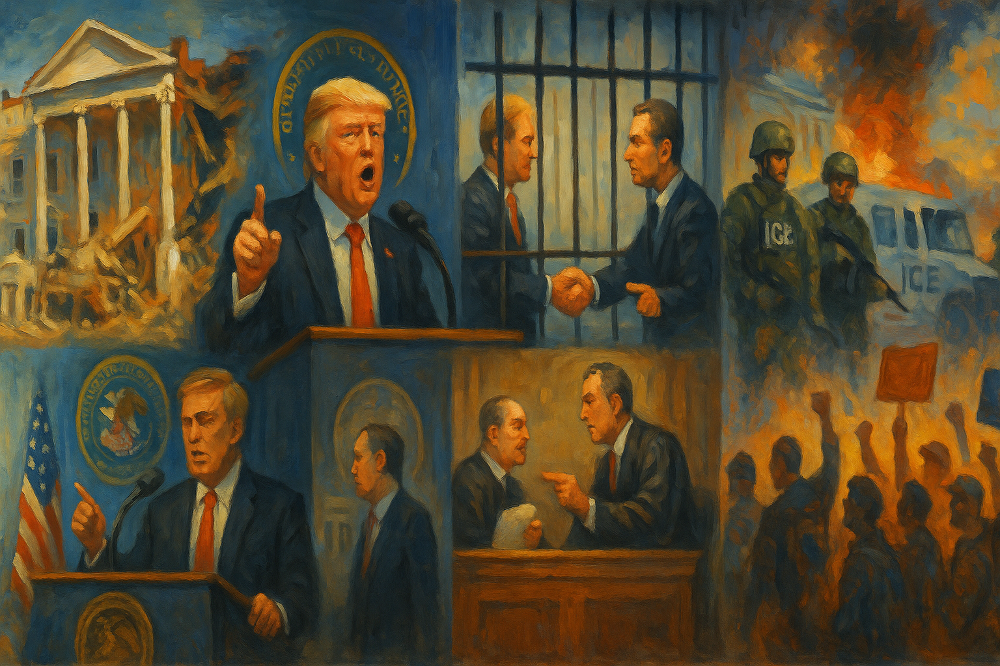

<!-- Generated by build_publish_week_v1 (appendix post) -->
<!-- Header image: image_wide_week40_appendix.png -->

# Week 40 Appendix: The Week Nothing Broke, and Nothing Held

*Mass protest, a demolished East Wing, and a president seeking personal payment from his own Justice Department mark a week of small but steady democratic erosion.*

This week combined the largest single-day mass mobilization of the Trump era—nearly 7 million people across all 50 states in the 'No Kings' protests—with an unusually concentrated cluster of executive overreach, retaliatory imagery, and institutional demolition, both literal and figurative. The administration responded to peaceful protest with mocking AI-generated propaganda depicting the president as a monarch defecating on demonstrators, while simultaneously demolishing the White House East Wing without required federal review, threatening Insurrection Act deployment against American cities, pardoning a politically-connected financial criminal, demanding DOJ pay him personally, and pursuing gerrymanders in Utah and North Carolina that override voter-approved reforms and court orders. Judicial pushback was significant but inconsistent, with mixed appellate rulings on National Guard deployments. Congress remained paralyzed by shutdown and Speaker Johnson's refusal to seat an elected representative. The week reveals accelerating executive personalization of power alongside robust, still-functioning civil society resistance and partial judicial and institutional friction.

Power and Authority

1. Trump commuted the prison sentence of former Rep. George Santos after less than three months served (2025-10-18): The president used clemency power to free a convicted fraudster and political ally after minimal punishment, raising questions about equal application of justice.

2. Trump administration sought Supreme Court permission to deploy National Guard troops to Illinois after lower courts blocked the move (2025-10-18): The executive branch pressed the judiciary to override lower-court findings against domestic military deployment, testing limits on presidential power over armed forces at home.

3. Trump threatened to invoke the Insurrection Act against American cities (2025-10-19): The president publicly floated using military force domestically against elected local governments, testing constitutional limits on federal power over civilian populations.

4. Trump administration began demolishing the White House East Wing without required federal approval to build a $250–300 million ballroom (2025-10-20): The administration destroyed a historic federal building funded by corporate donors without statutory oversight, blurring lines between public property and personal legacy projects.

5. White House posted an AI-generated video of Trump as a crowned king dumping excrement on protesters and cities (2025-10-18): Official government channels mocked mass peaceful dissent with authoritarian imagery, signaling contempt for democratic opposition from the highest level of the executive.

6. White House posted a video depicting Democratic leaders kneeling and bowing to a crowned Trump (2025-10-18) *[single source]*: Official imagery portrayed the political opposition as subservient rather than legitimate competitors, rejecting democratic equality between parties.

7. White House posted an AI-generated image depicting Democratic leaders in stereotypical Mexican attire beneath crowned Trump and Vance (2025-10-18) *[single source]*: Racist official imagery was used to delegitimize political opponents by portraying them as un-American, attacking norms of decency in political discourse.

8. Texas Governor Greg Abbott deployed the Texas National Guard ahead of peaceful No Kings protests, warning against violence (2025-10-18): Preemptive militarization of a peaceful protest environment reflects normalized use of armed force to intimidate lawful dissent before any unrest occurred.

9. Trump reversed tariff threats against China within days of imposing them, then reinstated tariffs (2025-10-18): Rapid reversal of major trade policy under economic pressure reveals the administration's vulnerability to market and geopolitical leverage in exercising presidential trade powers.

10. Trump praised OMB Director Russell Vought as "Darth Vader" for cutting funding and firing workers during the shutdown (2025-10-21): The president celebrated unilateral executive cuts to congressionally appropriated programs during a shutdown, exceeding legal executive authority over spending.

11. Trump hosted Republican senators for lunch during the shutdown while excluding Senator Rand Paul over his dissenting votes (2025-10-21) *[single source]*: Exclusion of a dissenting senator from presidential social access illustrates use of patronage to enforce party loyalty and punish independent votes.

12. Trump demanded the Department of Justice pay him approximately $230 million in compensation for investigations into his own conduct (2025-10-21): A sitting president sought taxpayer funds as personal compensation from the agency he controls, presenting an unprecedented self-dealing conflict of interest.

13. Trump threatened Harvard University with a $500 million fine and additional future penalties (2025-10-19): Use of federal regulatory threats to extract massive payments from an educational institution demonstrates weaponization of executive power against independent institutions.

14. Trump administration assembled an interagency task force across FCC, FBI, IRS and other agencies to purge career civil servants (2025-10-20): Coordinated removal of career officials across multiple federal agencies undermines civil service independence and consolidates political control over the bureaucracy.

15. Trump commuted the prison sentence of former Rep. George Santos citing partisan loyalty (2025-10-24) *[single source]*: Repeated public framing of clemency as reward for political loyalty erases restitution owed to victims and signals selective justice tied to allegiance.

16. Trump pardoned Binance founder Changpeng Zhao, convicted of anti-money-laundering violations tied to terrorist financing (2025-10-23): A pardon for a financial criminal with documented ties to terrorism and links to a Trump family crypto venture raises serious corruption and conflict-of-interest concerns.

17. House Democrats accused Trump of orchestrating a scheme to direct $230 million in Treasury funds to himself via a confidential DOJ process (2025-10-24): Legislators condemned the arrangement as an outrageous self-enrichment scheme that circumvents normal oversight and public disclosure of executive financial claims.

18. Karoline Leavitt asserted the president has unchecked authority to demolish any White House structure without oversight (2025-10-23): An official assertion of unlimited presidential control over federal property contradicts constitutional separation-of-powers principles governing appropriations and preservation.

19. Trump raised $350 million in corporate donations for the White House ballroom project (2025-10-23): Corporate funding of a presidential vanity project on federal property raises emoluments concerns and potential conflicts between donors and government decisions.

20. Trump stated intention to kill drug traffickers without seeking a congressional declaration of war (2025-10-24): A public declaration of intent to conduct lethal action against foreign nationals without constitutional authorization bypasses congressional war powers.

21. Trump dismissed the No Kings protests as unrepresentative and baselessly accused George Soros of funding them (2025-10-19): The president used unfounded conspiracy claims to delegitimize mass peaceful protest, undermining public trust in civic participation.

Institutions and Governance

1. House Speaker Mike Johnson refused to seat duly elected Rep.-elect Adelita Grijalva, delaying her swearing-in (2025-10-20) *[single source]*: Denying an elected representative her seat deprives her constituents of representation and appears designed to block a discharge petition on unrelated matters.

2. Arizona Attorney General Kris Mayes sued House Speaker Johnson to compel the swearing-in of Rep.-elect Grijalva (2025-10-21): A state government sought judicial intervention to enforce constitutional representation rights against congressional leadership obstruction.

3. Republican congressional leaders refused to negotiate with Democrats to reopen the government despite bipartisan public support for healthcare subsidies (2025-10-20): Refusal to engage in basic legislative negotiation prolonged a government shutdown, replacing compromise with attempted coercion of the minority party.

4. Mike Johnson kept the House adjourned for 77 of the prior 89 days, obstructing a vote to release Epstein files (2025-10-20): Extended obstruction of ordinary legislative function blocked transparency on a matter of significant public interest, weakening congressional accountability.

5. Mike Johnson held a press conference attacking the peaceful No Kings protests as un-American (2025-10-20) *[single source]*: Congressional leadership used official platforms to delegitimize large-scale peaceful protest, undermining the right to dissent.

6. Utah legislature passed SB 1011 replacing judicial review of redistricting with legislature-controlled bias tests (2025-10-18) *[single source]*: The law strips independent judicial oversight from redistricting, replacing it with tests designed by the party benefiting from partisan maps.

7. Utah legislature adopted a new congressional map preserving Republican dominance despite a court order to comply with anti-gerrymandering law (2025-10-18): The map defied a state supreme court order and voter-approved reform, entrenching partisan advantage over the will of voters.

8. Utah Republican Party filed a referendum petition to repeal both its own newly adopted map and the voter-approved Proposition 4 (2025-10-18): An attempt to overturn a voter-approved anti-gerrymandering measure seeks to consolidate partisan control over redistricting against voter will.

9. League of Women Voters of Utah amended lawsuit and filed constitutional challenge against SB 1011 and the legislature's map (2025-10-18) *[single source]*: Civic groups sought judicial review to enforce compliance with a court-ordered fair redistricting process against legislative circumvention.

10. North Carolina Senate passed a congressional redistricting map shifting the delegation from 10-4 to 11-3 Republican favor at presidential request (2025-10-20): A state legislature complied with a direct presidential demand to redraw districts, undermining fair representation and targeting a Black incumbent's seat.

11. North Carolina House of Representatives scheduled and held a final vote on the redistricting bill SB 249 (2025-10-22) *[single source]*: Final legislative approval of a contested redistricting measure proceeded despite public opposition and characterization as unconstitutional.

12. Marc Elias law firm sued North Carolina over its newly enacted congressional map targeting Black voters (2025-10-24) *[single source]*: Litigation challenges a redistricting map alleged to dilute Black voting power in violation of the Voting Rights Act.

13. Virginia House Speaker Don Scott convened a special legislative session to consider mid-cycle congressional redistricting favoring Democrats (2025-10-24): A second state initiated mid-cycle redistricting to counter Republican gerrymanders, extending partisan map manipulation nationwide.

14. Federal appeals court (Ninth Circuit panel) lifted an injunction blocking deployment of Oregon National Guard troops to Portland, 2-1 (2025-10-21): An appellate ruling granted the executive greater latitude to deploy state military forces domestically despite factual findings against the deployment's justification.

15. Ninth Circuit Court of Appeals requested and later granted a stay to consider en banc rehearing of the Portland troop deployment ruling (2025-10-21): The full appellate court sought to reconsider a panel decision permitting military deployment, temporarily preserving a lower court's block on National Guard use.

16. Judge Karin Immergut blocked Trump's deployment of federalized National Guard troops to Portland twice, including after an attempted workaround (2025-10-20) *[single source]*: A Trump-appointed judge found the administration's factual basis for military deployment 'untethered to the facts,' asserting judicial limits on executive emergency claims.

17. Judge Karin Immergut rejected the Trump administration's request to immediately lift her restraining order blocking National Guard deployment (2025-10-24): Continued judicial resistance to executive military deployment authority preserved a check on unilateral use of force in American cities.

18. Judge April Perry blocked National Guard deployment to Chicago, finding DHS's justification 'simply unreliable' (2025-10-21): A federal judge rejected the administration's factual predicate for domestic military deployment, reinforcing judicial skepticism of executive emergency claims.

19. Trump administration petitioned the Supreme Court to override Chicago and Illinois National Guard deployment rulings (2025-10-21): The executive sought Supreme Court intervention to bypass consistent lower and appellate court findings against domestic military deployment.

20. Stephen Miller denounced Judge Immergut's ruling as "legal insurrection" (2025-10-21): A senior official's inflammatory attack on a judicial ruling risks inciting hostility toward the judiciary and undermining judicial independence.

21. Trump publicly attacked Judge Immergut and misidentified her sex after her ruling (2025-10-21): Presidential attacks on a sitting federal judge for an adverse ruling threaten judicial independence and normalize hostility toward courts.

22. Court of Appeals for Veterans Claims unanimously rejected the VA's request to halt rulings on veterans' disability claims during the shutdown (2025-10-23): A federal court affirmed veterans' due process rights against an executive attempt to suspend judicial review during a fiscal standoff.

23. Federal district judge Sara Ellis ordered federal immigration officers to wear and activate body cameras during enforcement operations (2025-10-18): Judicial imposition of accountability measures on federal enforcement represents a check on executive practices amid escalating confrontations.

24. Judge Jia Cobb heard arguments on a request to remove 2,300 National Guard troops from Washington D.C. streets (2025-10-24) *[single source]*: A judicial hearing tested the legality of a sustained military presence in the capital based on a factually contested emergency declaration.

25. Judge William Young issued a 161-page ruling finding deportation of pro-Palestinian activists violated First Amendment rights (2025-10-21): A Reagan-appointed judge found administration deportation policy an unconstitutional assault on protected political speech and due process.

26. Senate failed an eleventh vote on a continuing resolution as the shutdown became the longest in history (2025-10-21) *[single source]*: Repeated failed votes reflect a breakdown of Congress's basic constitutional duty to fund government operations through ordinary process.

27. Senator Jeff Merkley held the Senate floor overnight to protest threats to democracy (2025-10-21) *[single source]*: A formal legislative protest drew procedural attention to concerns about constitutional governance amid administration overreach.

28. Comey filed a motion to dismiss criminal charges citing selective prosecution and unlawful appointment of the prosecutor (2025-10-21): A former FBI director challenged politically motivated prosecution, raising constitutional concerns about weaponization of the Justice Department.

29. Federal prosecutors accused Comey's lead defense attorney of leaking classified information to seek his disqualification (2025-10-19) *[single source]*: Prosecutors sought to remove defense counsel in a politically charged case, raising concerns about fairness and politicization of justice.

30. Trump administration fired two federal prosecutors who opposed bringing charges against Letitia James (2025-10-20): Removal of prosecutors who declined politically motivated charges demonstrates elimination of internal checks against prosecutorial abuse.

31. Trump administration officials criticized interim prosecutor Lindsey Halligan as unprepared for politically driven cases (2025-10-20): Internal doubts about a hand-picked prosecutor's competence reveal risks in politically motivated appointments to pursue the president's opponents.

32. Lindsey Halligan leaked details of grand jury testimony in the prosecution of Letitia James to a reporter (2025-10-20): A politically appointed prosecutor's disclosure of secret grand jury information raises serious prosecutorial ethics and rule-of-law concerns.

33. Lindsey Halligan used auto-delete Signal messages to communicate with a journalist about a political prosecution (2025-10-23) *[single source]*: Use of self-destructing messages by a federal prosecutor potentially violates federal records-retention laws and undermines accountability.

34. Letitia James pleaded not guilty to mortgage fraud charges brought by a Trump-appointed prosecutor (2025-10-24): Prosecution of a state attorney general after the president publicly called for it exemplifies weaponization of the justice system for political retribution.

35. House Republicans referred former CIA Director John Brennan to the Justice Department for criminal prosecution over 2016 testimony (2025-10-21) *[single source]*: Congressional referral of a former official for prosecution over past testimony reflects use of oversight authority for political retribution.

36. Senate confirmed industry lobbyist Douglas Troutman to lead the EPA's chemical safety office (2025-10-18) *[single source]*: Placing a former chemical industry lobbyist atop chemical safety regulation creates a direct conflict of interest undermining public health protection.

37. Trump nominated Paul Ingrassia, who admitted a "Nazi streak" and made racist statements, to lead the whistleblower protection office (2025-10-21): Nomination of a person with documented racist and Nazi-sympathizing statements to oversee whistleblower protections signals contempt for civil rights norms.

38. Senate Republicans blocked confirmation of Paul Ingrassia, forcing withdrawal of his nomination (2025-10-20) *[single source]*: Bipartisan resistance forced withdrawal of a nominee with racist statements, showing a functioning check even as such candidates continue to be advanced.

39. Trump fired the Eisenhower Library director for refusing to surrender a historical sword for use in propaganda video (2025-10-20) *[single source]*: Firing a museum director over a refusal to hand over a historical artifact for presidential use illustrates politicization of federal cultural institutions.

40. Trump appointee Will Scharf was installed to chair the National Capital Planning Commission overseeing the president's own construction project (2025-10-23) *[single source]*: Placing a presidential loyalist atop the agency meant to independently review the president's own building project eliminated institutional separation for oversight.

41. House Republicans publicly attacked and mischaracterized the No Kings protests as anti-American at a press conference during the shutdown (2025-10-20) *[single source]*: Congressional leaders used official platforms to spread false claims delegitimizing peaceful mass protest instead of engaging in legislative negotiation.

42. House Republicans failed to produce a promised healthcare plan despite public claims of readiness (2025-10-24): Public claims of a nonexistent legislative proposal represent a failure of transparency and accountability to constituents relying on healthcare subsidies.

43. Illinois Governor J.B. Pritzker established an Accountability Commission to document federal agent misconduct after federal watchdog removals (2025-10-23) *[single source]*: A state created a parallel documentation mechanism for federal law enforcement abuse after normal federal oversight channels were disabled by firings.

44. New York Attorney General Letitia James launched a public portal for residents to report federal ICE enforcement actions (2025-10-23): A state-level documentation mechanism was created to challenge federal enforcement overreach after a controversial mass raid detained citizens.

45. Illinois Secretary of State Alexi Giannoulias launched a hotline to report federal agents allegedly tampering with license plates during raids (2025-10-23) *[single source]*: State enforcement action against federal agents evading identification highlights tension between state law and unaccountable federal enforcement conduct.

46. Trump administration began redirecting Defense Department R&D funds to pay military personnel without congressional authorization (2025-10-23): Budget experts characterized the unauthorized reallocation of appropriated funds as likely illegal, raising separation-of-powers concerns about executive control of spending.

47. Senate rejected the "Shutdown Fairness Act" to guarantee pay for essential workers and troops during the shutdown (2025-10-24): Failure to pass emergency pay protections left federal workers and military personnel unpaid amid prolonged legislative gridlock.

Economic Structure

1. China imposed new export controls on rare earth metals and critical materials (2025-10-18): China's expanded export controls create strategic economic leverage over U.S. supply chains, escalating trade tensions with potential coercive effect on policy.

2. Trump administration froze or canceled more than $27 billion in federal funds for Democrat-led districts during the shutdown, versus under $750 million for Republican districts (2025-10-18): Selective withholding of congressionally appropriated funds based on partisan affiliation represents weaponization of federal spending against political opponents.

3. Trump implemented sweeping tariffs causing an estimated $1.2 trillion in additional 2025 business costs, largely passed to consumers (2025-10-19): Broad tariff policy directly reduced household purchasing power, contradicting administration promises to lower costs for millions of Americans.

4. National Nuclear Security Administration furloughed roughly 1,400 of its approximately 1,775 employees during the shutdown (2025-10-20): Mass furlough of nuclear weapons stockpile management personnel during a shutdown created security risks and demonstrated degradation of critical government functions.

5. Department of Homeland Security purchased two Gulfstream jets for $172 million during the government shutdown (2025-10-22): Luxury aircraft purchases at more than triple the initial request during a shutdown threatening food assistance raise questions about budgetary priorities.

6. Trump administration signed an economic stabilization agreement with Argentina committing to a $20 billion currency swap, expanding toward $40 billion with private lender guarantees (2025-10-21) *[single source]*: A massive financial commitment to a foreign ally's economy raises questions about prioritization of political allies over domestic economic concerns, including farmers.

7. Trump proposed importing Argentine beef to lower domestic prices despite opposition from U.S. cattle ranchers (2025-10-19): A policy favoring foreign imports over domestic agricultural interests drew bipartisan criticism as inconsistent with stated economic priorities.

8. Zeteo reporting documented Trump administration froze $27 billion for Democratic districts amid weather-service budget cuts contributing to a deadly Alaska storm forecast failure (2025-10-18): Budget cuts to critical public safety infrastructure were linked to loss of life, illustrating consequences of prioritizing ideology over public welfare.

9. Trump administration approved expanded oil and gas drilling across 1.56 million acres of Alaska's Arctic National Wildlife Refuge (2025-10-24) *[single source]*: Opening protected Arctic lands to extraction over Indigenous and environmental opposition prioritizes corporate resource extraction over ecological and cultural stewardship.

10. Trump imposed reciprocal tariffs of 10–40% on Southeast Asian exports (2025-10-24) *[single source]*: Unilateral tariff escalation against regional trading partners destabilizes multilateral commerce and strains alliances ahead of a diplomatic tour.

11. Trump proposed conditional tariff reductions on Chinese exports pending Beijing concessions (2025-10-24): Trade negotiations with China carry systemic risk to global supply chains and industries dependent on stable bilateral commerce.

12. Trump administration demanded the EU repeal climate and human rights rules to facilitate U.S. LNG exports, while approving a major new export terminal (2025-10-23) *[single source]*: Diplomatic pressure to weaken a sovereign ally's environmental protections for fossil fuel export benefit accelerates emissions and undermines climate cooperation.

13. Extremity Care secretly donated $2.5 million to the White House ballroom project after benefiting from a delayed Medicare reimbursement rule (2025-10-21) *[single source]*: A Medicare-benefiting company's anonymous donation tied to a delayed regulation suggests potential quid pro quo between political giving and regulatory favor.

14. Unusual Machines won a Pentagon drone contract despite Donald Trump Jr.'s $4 million financial stake in the company (2025-10-24) *[single source]*: A major defense contract to a company with a presidential family financial stake raises conflict-of-interest and crony capitalism concerns.

15. Trump terminated all trade negotiations with Canada over a Reagan tariff-critical advertisement (2025-10-24): Unilateral termination of trade negotiations via social media in response to political criticism destabilizes international economic relations with a major ally.

16. American Farm Bureau warned the White House that more than half of U.S. farms are losing money as bankruptcies rose 56 percent (2025-10-23): An escalating rural economic crisis, driven partly by tariff policy, threatens small towns and agricultural livelihoods despite administration warnings.

17. Nvidia and OpenAI engaged in circular multi-billion-dollar investment and purchasing deals across the AI supply chain with AMD, Oracle, and CoreWeave (2025-10-22) *[single source]*: Circular financial arrangements among AI companies obscure genuine demand signals and increase systemic interdependence with limited public transparency.

18. Trump administration exempted domestic copper smelters from Clean Air Act emissions standards for two years by proclamation (2025-10-24): Executive action suspended congressionally mandated environmental protections for industrial facilities under a national security rationale, prioritizing industry over air quality.

19. Trump announced $40 billion bailout of Argentina's Milei government while implementing tariffs harming U.S. farmers (2025-10-20): Directing massive public funds to a foreign ally's economy while domestic agricultural workers face tariff-driven harm demonstrates misaligned economic priorities.

Civil Rights and Dissent

1. 50501 Movement, SEIU, AFT and allied organizers organized the "No Kings" nationwide protests drawing nearly 7 million participants across all 50 states (2025-10-18): The largest single-day protest of the era demonstrated sustained mass civic mobilization against perceived authoritarianism, exercising core First Amendment rights.

2. Marc Benioff apologized for supporting deployment of National Guard troops to San Francisco after public backlash (2025-10-18): A prominent business leader's reversal reflects the political cost of endorsing domestic military deployment against a Democratic-led city.

3. Christopher Moynihan was arrested after threatening to kill House Minority Leader Hakeem Jeffries (2025-10-18) *[single source]*: A previously pardoned January 6 participant's subsequent violent threat against a congressional leader raises concerns about consequences of blanket clemency.

4. ICE increased weapons procurement spending by more than 600% compared to 2024 (2025-10-18) *[single source]*: A massive escalation in immigration enforcement weapons spending correlates with documented violent incidents against protesters, journalists, and civilians.

5. Immigration agents detained more than 170 U.S. citizens at raids and protests, with documented abuse including beatings and tasing (2025-10-18) *[single source]*: Detention and physical abuse of U.S. citizens by immigration enforcement represents serious violations of constitutional rights and due process.

6. ACLU filed a lawsuit against ICE alleging excessive force and constitutional violations against protesters (2025-10-20) *[single source]*: Formal litigation challenges the constitutionality of ICE's use of chemical and kinetic weapons against protected First Amendment activity.

7. ICE officers shot a pastor and a Marine veteran with pepper balls and physical force during protests (2025-10-20): Documented violent incidents against a pastor and a veteran engaged in protected protest activity raise constitutional concerns about excessive force.

8. ICE officer dropped a gun and pointed it at bystanders while making an arrest (2025-10-20) *[single source]*: A dangerous weapons-handling incident demonstrates inadequate training and safety protocols posing direct physical danger to uninvolved civilians.

9. ICE conducted an aggressive raid on a California cannabis farm resulting in a worker's death (2025-10-20) *[single source]*: A civilian death during an aggressive enforcement operation raises accountability questions about proportionality of ICE tactics.

10. Young Republicans members had leaked group chat messages revealing racist and violent rhetoric, prompting chapter shutdowns and a resignation (2025-10-20) *[single source]*: Exposure of extremist rhetoric within a major party youth organization prompted limited disciplinary consequences but revealed radicalization within political ranks.

11. ICE and federal partner agencies raided Manhattan's Chinatown, arresting vendors and detaining protesters, sparking public demonstrations (2025-10-21) *[single source]*: A large-scale militarized raid targeting street vendors, followed by arrests of demonstrators, drew condemnation for disproportionate force in an immigrant community.

12. ICE conducted a second Chinatown raid detaining four U.S. citizens for nearly 24 hours without charges (2025-10-22) *[single source]*: Detention of U.S. citizens without charges during an immigration raid violates agency policy and constitutional protections against unlawful detention.

13. ICE shot a TikTok livestreamer and a deputy U.S. marshal during a Los Angeles enforcement operation (2025-10-22): Use of force during an enforcement encounter, including injury to a citizen journalist and a federal officer, raises questions about ICE tactics and safety protocols.

14. Civil rights organizations documented medical neglect of pregnant women in ICE detention, including miscarriages and shackling (2025-10-23) *[single source]*: Systematic medical neglect of pregnant detainees reveals endangerment of vulnerable populations in federal custody, violating due process and human dignity protections.

15. Trump administration deported Venezuelans and moved to revoke legal status of 600,000 Venezuelan immigrants based on unsubstantiated gang threat claims (2025-10-23) *[single source]*: Mass deportation and status revocation predicated on false threat narratives deprived hundreds of thousands of due process protections.

16. Trump administration deployed more than 100 federal agents to the San Francisco Bay Area for a major immigration enforcement operation (2025-10-23): Large-scale federal deployment to a Democratic-run city without clear legal justification raised constitutional concerns over separation of powers and local sovereignty.

17. José Castro Rivera died while fleeing an ICE enforcement operation in Virginia after being struck by a vehicle (2025-10-24): A death resulting from flight from an ICE operation marks the third such fatality, reflecting the human cost of aggressive enforcement tactics.

18. ICE detained approximately 300 South Korean workers in a raid at a Georgia battery plant, straining diplomatic relations (2025-10-24) *[single source]*: Mass detention of foreign nationals at a strategic allied investment project damaged diplomacy and highlighted enforcement scope expanding to workplaces of allies.

19. Joshua Jahn opened fire on an ICE detention facility in Dallas, killing two detainees (2025-10-24): A politically motivated shooting at an ICE facility raised concerns about whether anti-immigrant political rhetoric contributed to violence against detainees.

20. ICE admitted more than 200 unqualified recruits with disqualifying backgrounds while rushing to fill 10,000 new deportation officer positions (2025-10-24): Lowering vetting and training standards for expanded immigration enforcement personnel undermines accountability and increases risks to civil rights.

21. Sam O'Hara was arrested for playing music to protest a National Guard patrol and subsequently sued over the detention (2025-10-23): Arrest of a peaceful protester exercising expressive rights raises fundamental First and Fourth Amendment concerns about suppression of dissent.

22. Trump administration considered a radical overhaul of the refugee system limiting admissions largely to white South Africans and English speakers (2025-10-18) *[single source]*: A proposed discriminatory refugee policy based on race and language violates equal protection and humanitarian obligations.

23. Trump administration planned to limit refugee resettlement to 7,500 people with explicit racial and ideological admission criteria (2025-10-21) *[single source]*: A formalized refugee policy prioritizing race and ideology over need represents a fundamental departure from humanitarian admission standards.

24. Trump administration threatened prosecution of Democratic officials who said they would arrest ICE agents using excessive force (2025-10-24): Federal threats against state officials asserting authority over abusive enforcement conduct represent an attack on federalism and local accountability mechanisms.

25. ICE maintained detention facility lighting conditions causing documented circadian and health harm to detainees (2025-10-20) *[single source]*: Systemic deprivation of healthy light-dark cycles in detention constitutes ongoing harm to detained persons' health under executive-controlled conditions.

26. 50501 Movement and civil society coalition held follow-up mass organizing calls to sustain protest momentum after No Kings Day (2025-10-21): Sustained organizing infrastructure following mass protest reflects continued civic mobilization and institutional pressure on the administration.

27. Students for a Democratic Society protested a proposed campus memorial for Charlie Kirk citing his divisive rhetoric (2025-10-21) *[single source]*: Student-led protest against institutional memorialization reflects grassroots contestation over campus values following political violence.

28. State officials (Pennsylvania, Texas, California, and others) warned that SNAP benefits for millions would end after October 27 without shutdown resolution (2025-10-21): Impending termination of food assistance for tens of millions of Americans demonstrates how the federal shutdown directly threatens vulnerable populations.

29. California Governor Gavin Newsom deployed the National Guard for humanitarian food distribution amid shutdown-driven benefit disruptions (2025-10-22): State-level intervention to address federal shutdown-driven hunger crisis demonstrates state capacity to mitigate federal policy failures affecting vulnerable residents.

30. Oregon legislature cut $100 million in eviction-protection funding amid a housing affordability crisis (2025-10-19): Elimination of eviction prevention funding during a housing crisis directly increases housing instability for vulnerable populations.

Information, Memory and Manipulation

1. Pentagon replaced its traditional press corps with 60 predominantly far-right and state-aligned outlets after journalists refused censorship terms (2025-10-22): Replacing an independent military press pool with ideologically aligned outlets undermines press freedom and public access to unfiltered defense information.

2. Trump sued the Wall Street Journal for $10 billion in defamation over its Epstein-related reporting (2025-10-20) *[single source]*: A massive defamation lawsuit against a major news organization functions as legal intimidation designed to suppress critical journalism about the president.

3. Karoline Leavitt publicly attacked a HuffPost reporter with a crude personal insult and accused him of not being a real journalist (2025-10-20) *[single source]*: Official attacks on journalists normalize contempt for the press and undermine the adversarial relationship necessary for government accountability.

4. Trump administration removed FTC blog posts warning of AI-related consumer harms published under the prior chair (2025-10-20): Removing government warnings about technological harms from public access suppresses information needed for informed consumer decisions.

5. Treasury Department instructed employees not to share photos of White House ballroom demolition (2025-10-21): Restricting employee documentation of a major government construction project limits public visibility of executive branch activities.

6. Ted Cruz posted and later deleted a false claim that a recent No Kings protest video was actually from 2017 (2025-10-21) *[single source]*: A sitting senator deliberately spread disinformation online, only correcting it after repeated public fact-checking.

7. European Broadcasting Union and BBC released research finding AI chatbots provide inaccurate news information roughly 45% of the time (2025-10-23): Systematic inaccuracy in AI tools used as news sources by hundreds of millions of people undermines the public information environment.

8. OpenAI released a browser routing all user information queries through its chatbot rather than direct navigation (2025-10-23): Architectural design concentrating information discovery in a single corporate AI system with documented accuracy problems raises information-gatekeeping concerns.

9. Melania Trump threatened a $1 billion defamation suit against journalist Michael Wolff over Epstein-related reporting (2025-10-23) *[single source]*: A threatened billion-dollar lawsuit against a critic functions as a strategic tool to silence speech about the executive family's associations.

10. FBI internally acknowledged that a widely circulated Tren de Aragua threat claim was inaccurate without public retraction (2025-10-23) *[single source]*: An unretracted internal correction of a false threat narrative allowed the original claim to continue influencing enforcement policy and public perception.

11. Texas Governor Greg Abbott issued a proclamation declaring Tren de Aragua a terrorist organization based on later-discredited intelligence (2025-10-23) *[single source]*: A state executive lent governmental authority to an unverified threat claim later found inaccurate, amplifying false narratives with policy consequences.

12. Karine Jean-Pierre published a memoir announcing her departure from the Democratic Party, criticizing party leadership's response to authoritarianism (2025-10-21) *[single source]*: A former White House press secretary's public break with her party signals institutional fracture and doubts about the opposition's capacity to counter executive overreach.

13. Trump falsely claimed presidents have invoked the Insurrection Act 28 times, versus the actual 30 times in 230 years (2025-10-19) *[single source]*: Misrepresentation of constitutional precedent to justify military deployment threats spreads disinformation about the scope of presidential authority.

