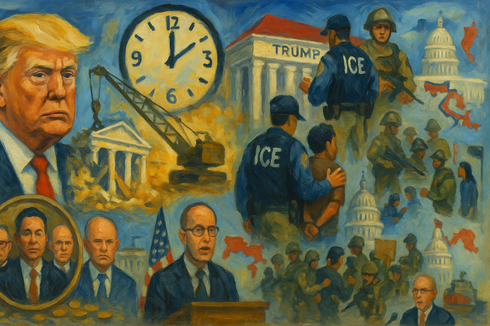

<!-- Generated by build_publish_week_v1 -->
<!-- Header image: image_wide_week40.png -->

# Week 40: Ballroom as Blueprint

*A demolished East Wing, weaponized clemency, and engineered representation show how personal rule advances without a single formal break in the system.*

> Autocracy rarely arrives as a single event. It seeps into the spaces where we stop insisting on the difference between mine and ours. — Anonymous civic observer
> The surest test of a regime is how it treats those who cannot repay its favors and those who refuse to bend to its will. — Adapted from a 20th-century jurist
> When law becomes a gift for friends and a weapon for enemies, the constitution survives in print but not in practice. — Contemporary legal scholar
> Every democracy must decide whether its public buildings are stages for one person’s glory or shelters for the people’s memory. — Historian of democratic institutions

The fortieth week of Trump’s second term unfolded as a lesson in how a democracy can be bent without a single formal rupture. Power moved through buildings, budgets, courtrooms, and screens. The presidency treated public space as private canvas, law as a flexible instrument, and crisis as a chance to reward friends. At the same time, streets filled with people insisting that the country was not meant for kings. The clash between those two visions—personal rule and shared rule—ran through every major development of the week. It ran without pause.

At the close of the prior period, the Democracy Clock stood at 8:08 p.m. By the end of Week 40, it read 8:11 p.m., a net shift of two and a half minutes. The movement did not come from a coup or a single shocking decree. It came from the demolition of a historic wing of the White House, from pardons and payouts that turned justice into patronage, from maps and procedures that blunted elections, and from open talk of a third term. Each action altered what institutions could be relied on to do, and for whom. Together they deepened a pattern in which the presidency treated constraint as suggestion and public trust as expendable.

The most visible act of the week was also the most literal: the president ordered the White House East Wing torn down. Crews moved in to demolish a central part of the building to make way for a privately funded ballroom bearing his name. The project went forward without the full planning review and preservation process that would normally govern changes to a national landmark. It was not a renovation to improve function. It was a redesign of the people’s house to suit one man’s taste and political theater, undertaken as if the building were his personal property. The symbolism was hard to miss.

Around the demolition, the administration built a cordon of secrecy. The Treasury Department instructed employees not to share photos of the East Wing being reduced to rubble. Staff were told to keep their phones away, to let no informal images leak into public view. A change that would once have been announced, debated, and documented was instead treated as a private construction project. The order did not just hide dust and debris. It signaled that the public’s right to see what was being done with its own symbols now depended on the president’s comfort.

The same impulse appeared in the digital record. The administration removed Federal Trade Commission blog posts that had warned about the harms and risks of artificial intelligence. These were not partisan essays. They were expert analyses meant to guide the public and industry on a fast-moving technology. Taking them down narrowed the official memory of what regulators had once said. It made it harder for citizens, journalists, and courts to trace how policy had shifted, and why. What remained on the site reflected the current line; what conflicted with it was quietly erased.

Even as the White House was being remade and records were thinned, senior officials secured new comforts. During the ongoing government shutdown, when many federal workers went unpaid and core services were strained, the Department of Homeland Security purchased two Gulfstream private jets for top officials. The timing was stark. While agencies furloughed staff and veterans worried about delayed benefits, luxury aircraft were added to the fleet. The purchase underscored a hierarchy of concern: austerity for the rank and file, indulgence for those closest to power.

If the East Wing demolition showed how physical space could be repurposed for personal glory, the week’s clemency and legal maneuvers showed how law itself could be bent to serve insiders. The president commuted former congressman George Santos’s sentence after less than three months in prison for serious financial fraud. Santos had lied to voters and donors, then faced federal conviction. By sharply reducing his punishment, the president signaled that political allies could expect mercy even when they had abused public trust. The pattern was plain.

Soon after, he pardoned Changpeng Zhao, the billionaire founder of Binance, following a money-laundering conviction. Zhao’s firm had faced major sanctions violations. His wealth and connections, including ties to Trump-linked ventures, now coincided with a full erasure of legal consequences. In both cases, clemency did not appear as an act of mercy toward the powerless. It read as a reward for proximity and usefulness. The message to the broader elite was clear. With the right relationships, even grave financial crimes could be washed away.

The president also moved to turn the Justice Department into a source of personal cash. He demanded roughly $230 million in compensation from DOJ for past investigations into him, framing lawful inquiries as wrongful persecution. The claim was to be evaluated and paid out by officials he had appointed. Reports later indicated that DOJ funds were in fact used to satisfy his demand. If so, prosecutorial resources—meant to enforce law on behalf of the public—were converted into a private settlement for the president himself. The line between the state’s coffers and his own grievances blurred almost to invisibility.

At the same time, federal prosecutors pursued cases that targeted prominent critics. New York Attorney General Letitia James, who had led aggressive civil actions against Trump, faced a federal mortgage fraud indictment that career prosecutors reportedly opposed. Former FBI Director James Comey, long a presidential antagonist, was entangled in a criminal case marked by disputes over leaks and claims of selective prosecution. House Republicans referred former CIA Director John Brennan to DOJ for alleged false testimony. Each case had its own legal particulars, but together they suggested that prosecutorial energy flowed more readily toward perceived enemies than toward well-connected allies.

Even court orders themselves met resistance. A whistleblower inside the Justice Department revealed that deportation flights had continued despite a federal injunction. Venezuelan migrants were being sent to El Salvador’s mega-prison in defiance of a judge’s command. When the facts reached the bench, US District Judge James Boasberg ordered the flights halted. The episode showed both sides of the justice system in this period: an executive branch willing to ignore legal limits, and a judiciary still capable, in places, of insisting that its rulings be obeyed. The tension was constant.

While law and clemency were being repurposed, the machinery of government itself was being restructured. The Senate advanced the confirmation of Douglas Troutman, a longtime chemical industry lobbyist, to lead the Environmental Protection Agency’s toxics office. The very person who had been paid to weaken chemical safety rules was poised to oversee them. Regulatory capture, long a concern in Washington, moved from risk to reality at one of the most sensitive public health posts. Industry and oversight were folded together.

Inside the executive branch, the president created an interagency task force to purge perceived “Deep State” opponents from the federal workforce. The aim was not subtle. Neutral civil servants were to be identified and removed, replaced with loyalists. At the same time, the Supreme Court overruled injunctions that had paused large-scale federal layoffs. Lower courts had tried to slow mass firings tied to the shutdown. The high court’s decision cleared the way for rapid reshaping of the bureaucracy, weakening job protections that undergird a nonpartisan civil service.

Shutdown tactics became a lever in this restructuring. The administration issued furlough notices to most civilian staff at the National Nuclear Security Administration, even as budget fights dragged on. Essential national security functions were treated as bargaining chips in a partisan standoff. Elsewhere, the EPA canceled a $20 million climate resilience grant for the Alaska village of Kipnuk, a largely Indigenous community facing severe erosion. The decision shifted the costs of climate change onto a small, vulnerable population, while freeing funds for other priorities.

The Education Department’s future also hung in the balance. The president considered moving a $15 billion disability education program out of the agency as part of a broader plan to dismantle it. Such a move would not only disrupt services for students with disabilities. It would also weaken a cabinet department charged with enforcing education rights nationwide. Unions responded to these trends by suing over executive orders that stripped collective bargaining rights from federal workers. Their lawsuits were a reminder that not all institutional actors accepted the new order, even as the balance of power tilted against them.

Representation, the core promise that votes translate into voice, came under pressure from several directions. In North Carolina, the Republican legislature passed a congressional map designed to convert a 10–4 into an 11–3 GOP delegation, despite a closely divided electorate. Senate Bill 249 limited the governor’s ability to check the map. The redistricting diluted Black and opposition representation and locked in partisan advantage for years to come. It was a textbook example of how lines on a map can do what no speech or slogan can: predetermine outcomes.

In Washington, House Speaker Mike Johnson used procedural control to similar effect. He refused to seat Adelita Grijalva, a duly elected representative from Arizona, during the shutdown. Without being sworn in, she could not sign a discharge petition that might have forced a vote on reopening the government or releasing sensitive files. Her constituents were left without representation in a moment of crisis. The House itself remained adjourned for much of the summer, a schedule that conveniently delayed action on releasing the Epstein files. Time, in this context, became a tool of power.

Arizona’s attorney general, Kris Mayes, and Grijalva herself sued the House and the Speaker to compel her swearing-in. Their case asked the courts to enforce basic constitutional guarantees of representation against the internal practices of another branch. Meanwhile, the Senate failed to pass the Shutdown Fairness Act, which would have guaranteed pay for essential federal workers and troops during the impasse. In North Carolina, the General Assembly failed to pass a state budget even as federal Medicaid and SNAP cuts loomed. Across levels of government, legislative bodies functioned less as forums for deliberation and more as instruments for stalling, shielding, or entrenching power.

Security forces and emergency tools were drawn deeper into domestic politics. The president publicly mused about invoking the Insurrection Act and deploying National Guard troops to Democratic-led cities, including San Francisco. He spoke of using military force not in response to an actual uprising, but as a way to manage protests and urban policy. In Texas, Governor Greg Abbott preemptively deployed the National Guard ahead of the nationwide “No Kings” demonstrations, warning against unrest that had not yet occurred. The sight of soldiers positioned in anticipation of peaceful assembly sent a clear signal about how dissent would be met.

Immigration enforcement grew more militarized. Immigration and Customs Enforcement increased its weapons spending by more than 600 percent compared with the prior year. The agency conducted aggressive raids that led to arrests and injuries of US military veterans protesting deportations. In one case, a student was handcuffed after being misidentified by an algorithm. Venezuelan migrants were deported to El Salvador’s mega-prison, a facility designed for mass incarceration and control. US citizens were swept up in immigration sweeps. These actions suggested that security forces were aligning less with public safety and more with the regime’s narratives about threats.

Courts again provided partial counterweights. Federal judges issued rulings that limited or scrutinized Guard deployments and immigration tactics. One appellate court ordered body cameras for ICE officers in certain operations. The Court of Appeals for Veterans Claims rejected the VA secretary’s request to pause nearly all veterans’ disability cases during the shutdown, protecting timely access to benefits. Yet other decisions, such as a Texas judge’s order blocking the Keeping Families Together policy, cut in the opposite direction, abruptly stripping protections from mixed-status families. The legal landscape was uneven, with rights defended in some venues and curtailed in others.

Information itself became a contested field. The president posted AI-generated videos depicting himself as a crowned fighter pilot dropping waste on protesters and named opponents. The imagery was cartoonish and cruel. It cast dissenters as targets to be humiliated from on high. The use of AI blurred the line between satire and deepfake, between political messaging and digital spectacle. Musician Kenny Loggins demanded that his song be removed from the video, objecting to its unauthorized and politicized use. His protest underscored how cultural works could be conscripted into propaganda without consent.

At the Pentagon, Defense Secretary Pete Hegseth oversaw the replacement of the traditional press pool with a new media corps dominated by far-right outlets operating under restrictive rules. Mainstream reporters walked out rather than accept censorship and limited access. The Defense Department, one of the most powerful institutions in the country, now funneled information through ideologically aligned channels. At the White House, press secretary Karoline Leavitt attacked a reporter on social media as a partisan hack after critical questioning. The combined effect was to delegitimize independent media while elevating friendly voices.

Inside the justice system, information was both leaked and erased. Lindsey Halligan, the interim US attorney for the Eastern District of Virginia, used auto-deleting encrypted messages to share grand jury details with a reporter. Public watchdog groups warned that such practices might violate federal records laws. Auto-delete features meant that key prosecutorial communications could vanish without trace, undermining transparency and accountability. At the same time, the FBI and Department of Homeland Security allowed an unsubstantiated rumor about Venezuelan gang threats to spread widely before quietly correcting it internally. No public correction followed. The rumor helped justify harsh policies against immigrant communities, even after officials knew it was mistaken.

Outside government, the information environment was further muddied. Popular podcasts, including those hosted by Joe Rogan, spread false claims about antidepressants, vaccines, soy, immigration, and conspiracy theories like Pizzagate. Research by journalists and European broadcasters documented high error rates and sourcing problems in AI chatbots’ news answers. These tools, already used by millions, frequently hallucinated facts or misattributed sources. The risk was clear. As citizens turned to automated systems and high-audience shows for news, they entered an environment where truth and falsehood were hard to distinguish.

Some state leaders tried to build counterweights. Illinois Governor J.B. Pritzker created the Illinois Accountability Commission to document abuses by federal agents operating in his state. The commission’s mandate was simple: gather evidence where federal transparency had failed. Its existence acknowledged that traditional oversight channels were faltering. If the federal government would not reliably record and disclose its own actions, states would try to do so themselves.

Economic policy over the week revealed how closely governance had become entwined with family and donor interests. The administration announced and maintained sweeping tariffs, including threats of 100 percent duties on Chinese goods and new reciprocal tariffs of 10–40 percent on Southeast Asian countries. These moves strained supply chains and raised consumer prices. A coalition of businesses petitioned the Supreme Court to strike down the global tariffs as an illegal multitrillion-dollar tax, arguing that the president had usurped Congress’s power over trade. The case asked the Court to decide whether economic shock could be imposed unilaterally from the Oval Office.

Abroad, the president and Treasury Secretary Scott Bessent structured a $20–40 billion bailout and swap lines to stabilize Argentina’s peso. Reports indicated that the arrangements were advantageous to a hedge fund linked to Trump. At the same time, the administration pushed for increased beef imports from Argentina despite domestic rancher opposition. Trade policy thus served two functions: it opened markets that benefited foreign partners and connected investors, and it undercut US producers who lacked similar access. Risk was shifted to taxpayers and workers; gains clustered near the president’s circle.

Defense spending followed a similar pattern. The Army awarded a major drone components contract to Unusual Machines, a company in which Donald Trump Jr. held a significant stake. The deal blurred the line between procurement and family enrichment. It suggested that military hardware decisions could double as investment opportunities for the president’s relatives. In Nevada, the administration canceled approval for a large clean energy project, while elsewhere it approved a massive liquefied natural gas export hub. Fossil fuel interests and connected firms gained; long-term climate and infrastructure goals receded.

In the private sector, leading AI firms—including Nvidia, OpenAI, CoreWeave, AMD, Oracle, and xAI—entered into large, circular investment and purchasing agreements for chips and cloud services. The deals concentrated financial power and technical capacity in a tight corporate network. While not a direct act of government, this consolidation intersected with public policy. The same companies that shaped digital infrastructure now stood to benefit from regulatory choices and procurement decisions made by an administration already inclined to favor large, aligned actors.

Against this backdrop, civic resistance did not disappear. On October 18, the 50501 Movement and allied groups organized “No Kings” protests across all 50 states and abroad. Demonstrators gathered under a simple banner: the presidency was not a throne. The protests were largely peaceful. They showed that assembly and speech rights, though under pressure, were still being exercised at scale. Days later, the movement held a national organizing call to convert protest energy into sustained campaigns, including mutual aid, boycotts, and a planned “Remove the Regime” convergence.

Inside the Senate, Jeff Merkley used floor time to warn that Trump’s actions threatened democracy. His speech placed the week’s events in constitutional context, arguing that the accumulation of small abuses could amount to a larger break. Public opinion data pointed in the same direction. A survey by the Public Religion Research Institute reported that a majority of Americans viewed Trump as a dangerous dictator whose power should be limited. The language was stark. It suggested that concern about authoritarian drift had moved from activist circles into the mainstream.

Yet even as alarm grew, the president’s allies spoke openly about extending his rule. Steve Bannon claimed that Trump would run for an unconstitutional third term and hinted at a plan to bypass the Twenty-Second Amendment. The statement did not come from a fringe figure. It came from a close confidant with a large audience. His words marked a shift from vague talk of “staying in power” to explicit contemplation of term-limit evasion. In the same week that protesters marched under “No Kings,” a leading ally floated the idea of a president for life in all but name.

Some state leaders tried to mitigate federal harms while this struggle played out. California Governor Gavin Newsom deployed the National Guard and volunteers not to police protests, but to support food banks during the shutdown. His move highlighted a different use of state power: cushioning residents from federal dysfunction. Pritzker’s accountability commission served a similar purpose on the information front. These actions did not reverse the week’s trends. They did show that federalism still offered pockets of resilience.

The week closed without a single decisive confrontation. Instead, it left a layered record: a wing of the White House gone, a ballroom rising in its place; pardons and payouts that told elites the law could be bent; maps and procedures that dulled the force of elections; soldiers and agents positioned against protesters and migrants; AI videos and a curated press corps shaping what the public saw; tariffs and bailouts that enriched those closest to power; and crowds in the streets insisting that the country was not meant to be ruled this way. The movement of the Democracy Clock captured that accumulation. It marked a deepening erosion, not yet a collapse, in which the habits of personal rule grew more confident and the work of resistance grew more urgent and more costly.

<!-- Synopses for cross-posting -->
Long Synopsis: Week 40 of Trump’s second term traced how personal rule can harden without a coup. The Democracy Clock inched from 8:08 to 8:11 p.m., reflecting cumulative erosion rather than a single shock. The president ordered the White House East Wing demolished for a donor-funded ballroom bearing his name, shrouding the work in secrecy while regulators quietly erased prior warnings about AI harms. Clemency and cash flowed to insiders: George Santos’s sentence was commuted, Binance founder Changpeng Zhao was pardoned, and Justice Department funds reportedly paid Trump hundreds of millions over past investigations, even as prosecutors pursued cases against Letitia James, James Comey, and John Brennan. North Carolina’s gerrymander and Speaker Mike Johnson’s refusal to seat Adelita Grijalva blunted representation during a grinding shutdown. Militarized immigration raids, Guard deployments, and talk of invoking the Insurrection Act turned security inward against protesters and migrants. AI propaganda, a curated Pentagon press corps, and cronyist tariffs and bailouts rounded out a week in which resistance grew but constraints on presidential power visibly thinned.
Short Synopsis: A donor-branded White House wing, insider pardons, engineered maps, and militarized enforcement advanced personal rule, while mass “No Kings” protests and scattered court rulings struggled to keep democratic limits intact.

