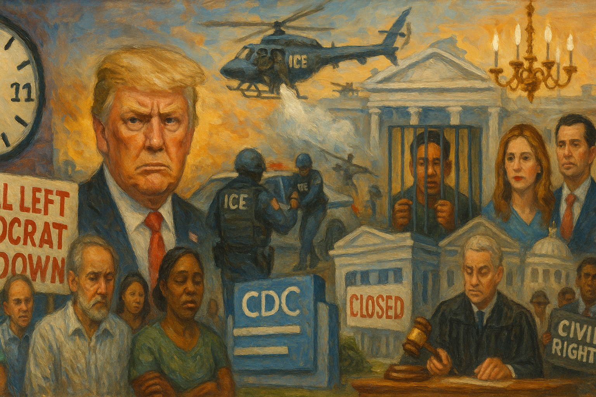

<!-- Generated by build_publish_week_v1 -->
<!-- Header image: image_wide_week41.png -->

# Week 41: The Week the Clock Held Still

*Executive power widened across war, clemency, and prosecution while courts and a fraction of the Senate pushed back, arriving just after the harm.*

Week 41 opens with a paradox the record insists we sit with. Presidential rhetoric grew louder. Claims of unchecked power grew more explicit. The machinery of retaliation grew more visible than in weeks prior. Yet the clock barely moved, falling by one-tenth of a minute, the smallest measurable shift in months. This is not a story about stability. It is a story about a system straining against itself, where real damage and real resistance arrived in almost exact counterweight.

At the close of the previous week, the Democracy Clock read 7:42 p.m. By the end of this week, it stood at 7:41 p.m. That number understates what happened. Beneath a nearly flat surface, courts fought the administration to a standstill on food aid and mass firings. The Senate broke with the president three times on tariffs. An appellate panel reopened the question of military deployment at home. But none of that resistance came before the harm. Tear gas fell on children first. Benefits lapsed first. The correction came after, as it increasingly does.

The week's clearest thread was the government shutdown, and what the administration chose to do with it. Rather than negotiate, USDA left a nearly six-billion-dollar contingency reserve untouched, refusing to release it for SNAP benefits that 42 million Americans depend on. Then, as pressure grew, USDA quietly deleted its own prior legal guidance from its website, guidance that had once affirmed its authority to use those funds. It replaced fact with blame, posting partisan messages on government servers that pinned the shutdown on Democrats. Speaker Johnson kept the House out of session through most of a seventeen-week stretch and dismissed standalone bills to fund SNAP and pay federal workers as a waste of time.

Courts eventually stepped in. Federal judges in Rhode Island and Massachusetts ordered USDA to use its contingency funds, finding the suspension likely unlawful. It was a real check, and it arrived through the correct channel. But by the time the order landed, benefits had already lapsed, and they remained unpaid as October closed, despite the ruling. The sequence reveals something durable about this period: harm moves fast, relief moves slow, and the gap between them is where families actually live.

A second development unfolded in the streets, timed cruelly to a children's holiday. Border Patrol agents used tear gas and pepper spray against residents at a Halloween parade in Chicago, tackling and arresting people, some of them citizens, in front of costumed children. Similar enforcement swept through Evanston, Los Angeles, and Washington, DC, on Halloween itself, continuing despite at least one governor's direct request to pause. A separate incident saw a man detained in Washington for playing the Imperial March near a National Guard patrol, a small moment that showed how thin dissent's protection had become.

Judge Sara Ellis, alarmed by mounting evidence, ordered CBP official Gregory Bovino to appear in court daily and wear a body camera. It was a direct judicial response to violations of a standing restraining order, and a meaningful assertion of oversight. Within two days, the Seventh Circuit blocked it, citing separation-of-powers concerns. A check was built, tested, and narrowed almost in the same breath. That pattern recurred all week: institutions found their footing, then found the ground shift beneath them before they could stand.

The Justice Department, meanwhile, turned prosecutorial power outward, against people who had scrutinized the president rather than against crime itself. It charged former FBI Director James Comey with lying to Congress. It indicted New York Attorney General Letitia James on mortgage fraud allegations. It brought an assault charge against sitting Representative LaMonica McIver over an incident at a detention facility, and it indicted congressional candidate Kat Abughazaleh for protest activity outside an ICE site. Investigations opened into Senator Adam Schiff and into ActBlue, the Democratic fundraising platform. Four separate targets, each tied to oversight or opposition, in a single week.

More than one hundred former Justice Department officials filed an amicus brief calling the Comey prosecution retaliatory rather than impartial. It was a notable act of institutional self-defense: professionals without formal power chose to speak anyway. It did not stop the case, but it registered, on the record, that people who once ran the department saw what was happening and said so plainly.

Military and emergency power expanded on several fronts at once. Trump claimed he could deploy the Army, Navy, Air Force, and Marines into American cities without court involvement. The Pentagon, almost simultaneously, ordered every state to stand up permanent "quick reaction" National Guard units by January, meant to answer civil unrest as routine readiness rather than emergency exception. Trump ordered the resumption of nuclear weapons testing after more than three decades, a unilateral move announced without consultation. Lethal strikes on boats in the Eastern Pacific continued, killing eighteen people across the week, and the administration prepared strikes inside Venezuela without seeking congressional authorization. Each action alone might be explained away. Together, they describe a widening claim that military force belongs to the president alone, at home or abroad, on his own timetable.

Term limits, too, came up for public discussion in a way that would once have been startling and now barely registered as news. Trump mused openly about a third term, including a workaround involving a placeholder running mate. Senator Tommy Tuberville suggested Trump might have grounds to simply go around the Constitution. Speaker Johnson, for his part, quietly acknowledged there was no legal path to a third term, a small but real reassertion of constitutional limits from within the president's own party. It was not much. It was also not nothing.

Congress, broadly, chose passivity over resistance in most of these fights, but not all of them. The Senate passed three separate bipartisan resolutions this week rejecting the president's tariffs, on Brazil, on Canada, and on the broader global regime affecting more than a hundred countries. None had a path through the House. But the repetition, three votes in one week, several with Republican support, marked one of the only sustained cross-party pushes against unilateral executive authority all year.

Self-enrichment ran through the week as its own steady current. The administration demolished the White House East Wing without required federal planning approval, clearing space for a $300 million ballroom funded by corporate donors offered tax write-offs and wall plaques for their contributions. To remove the obstacle, Trump fired every member of the National Capital Planning Commission and the Commission of Fine Arts, the two bodies positioned to review exactly this kind of project. Days earlier, he had pardoned Binance founder Changpeng Zhao, convicted of money-laundering violations. Within days of the pardon, Binance invested two billion dollars in Trump-linked cryptocurrency ventures. The Trump family's income from crypto sales, much of it to foreign buyers, reportedly reached $864 million in the year's first half. The sequence, clemency followed swiftly by enrichment, was not subtle, and reporting treated it as exactly what it appeared to be.

Press independence came under quieter but still substantial pressure. A 60 Minutes producer resigned over Paramount's suppression of Gaza and Trump coverage, tied to a pending merger requiring administration approval. CNN's own leadership reportedly told staff to soften coverage of the East Wing demolition after a White House visit. The administration moved toward asserting control over the White House Correspondents' Association, the body that manages press pool access. None of these were dramatic seizures; they worked through incentive and access rather than open command, and the effect on coverage showed within days.

Immigration enforcement, meanwhile, was reorganized around ideology as much as law. The State Department revoked thousands of visas, imposed bans from nineteen countries, and capped refugee admissions at 7,500 while prioritizing white South African applicants. A senior official solicited public denunciations to identify visa-revocation targets. Career leadership at ICE was purged and replaced with more aggressive enforcers, with field office directors swapped out in at least a dozen cities. British journalist Sami Hamdi was detained for days over pro-Palestinian speech, without formal charges, before his eventual release. The throughline was consistent: enforcement power turned toward speech and identity, not merely toward unlawful presence.

Disinformation moved through the week like ambient weather rather than isolated event. Trump repeated debunked 2020 election-fraud claims while pushing new voting restrictions. He and administration officials promoted non-standard medical guidance on Tylenol and vaccines that broke from established science. Vice President Vance revived a discredited and racist claim about Haitian immigrants. Tucker Carlson hosted a two-hour interview with a white nationalist without meaningful challenge, and the Heritage Foundation's president publicly defended the platforming rather than distancing the institution from it. None of this required new law. It simply lowered, again, the cost of saying false things loudly.

Two federal prosecutors were placed on leave for describing the January 6 attack as a "mob of rioters" in an official filing, a factually accurate characterization punished because it did not match a preferred narrative. Tennessee ordered 181 public libraries to remove LGBTQ-themed children's books, citing a federal executive order on gender ideology. Both actions shared something worth naming plainly: the punishment of accuracy, and the erasure of material simply because it could not be made to say something else.

Congress found itself denied even routine oversight. Lawmakers were blocked from congressionally mandated inspection visits to ICE facilities, with the administration arguing the shutdown eliminated that obligation entirely. Speaker Johnson delayed swearing in Representative-elect Adelita Grijalva, whose vote would have completed a discharge petition to release the Epstein files. Both moves used procedure, not open refusal, to prevent an outcome normal process would otherwise have delivered.

What ties the week together is not any single act but the shape of the whole. Executive power widened in claim and in practice, across war-making, domestic deployment, clemency, and personnel control. Courts and a fraction of the Senate pushed back with real, documented effect, but that effect arrived downstream of harm rather than ahead of it. The clock's near-stillness this week was not calm. It was tension held in balance, an accounting in which each act of overreach found a countervailing act of resistance close enough in weight to cancel it, at least for these seven days.

The deeper arc of the term does not turn on any single week's number. It turns on whether the pattern seen here, harm first, correction second, holds or breaks. This week, the correction still came. Judges still ruled. Senators still crossed party lines. Former officials still spoke. Whether that capacity persists, or thins with repetition, is the question this record leaves open for whoever reads it next.

<!-- Synopses for cross-posting -->
Long Synopsis: Week 41 saw the Democracy Clock barely move, slipping one-tenth of a minute, even as pressure on democratic norms intensified on nearly every front. The administration withheld SNAP funds from 42 million Americans during the shutdown, deleted its own legal guidance, and posted partisan blame on government servers. Courts eventually forced compliance, but benefits remained unpaid. Border Patrol tear-gassed families at a Halloween parade. DOJ indicted a former FBI director, a state attorney general, a sitting representative, and a congressional candidate. Trump claimed authority to deploy the military domestically, ordered nuclear testing resumed, and mused about a third term. A pardon for Binance's founder preceded a two-billion-dollar investment in Trump-linked crypto. Courts, a bipartisan Senate faction, and former officials pushed back, but consistently after harm had already landed.
Short Synopsis: Executive overreach intensified across military power, prosecution of critics, and self-enrichment, while courts and a bipartisan Senate faction supplied real but reactive resistance. The clock barely moved because harm and correction arrived in near-exact, unstable balance.

