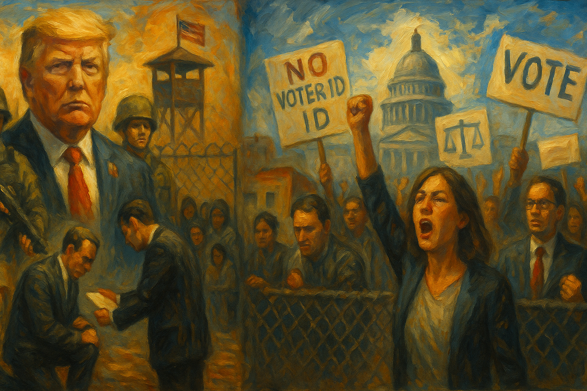

<!-- Generated by build_publish_week_v1 (appendix post) -->
<!-- Header image: image_wide_week42_appendix.png -->

# Week 42 Appendix: A Week of Governance by Hostage-Taking

*Food aid, war powers, and prosecutions were all used as leverage this week, while courts, voters, and a resigning judge pushed back hard.*

This was an extraordinarily dense week combining a record-length government shutdown, a landmark off-year election, and an unusually direct set of confrontations between the executive branch and the judiciary. Trump weaponized SNAP benefits as leverage against Congress, defied a federal court order to fund food assistance, and demanded elimination of the Senate filibuster while threatening Republican senators with retaliation. Simultaneously, Democrats swept major elections in Virginia, New Jersey, and New York City with record turnout, and California voters approved a redistricting measure directly responding to Trump-driven gerrymanders in Texas and elsewhere—triggering immediate litigation. The DOJ's continued prosecution of Comey, James, and investigation of Schiff, alongside a federal judge's resignation citing weaponization of law, capture a widening rift between the executive and legal accountability structures. Courts repeatedly blocked administration actions (National Guard deployments, transportation funding conditions, SNAP withholding), while the Supreme Court intervened to stay a lower court's SNAP order and reinstated a passport policy restricting transgender rights.

Power and Authority

1. Trump refused to meet with Democrats unless they "open up the country" (2025-11-01): The president conditioned negotiation with the opposition party on capitulation, obstructing normal legislative bargaining during a government shutdown.

2. Trump administration ignored the 60-day War Powers Resolution deadline for Caribbean boat strikes without seeking congressional approval (2025-11-01): The executive branch continued lethal military strikes past a statutory deadline without congressional authorization, bypassing a constitutional check on war-making power.

3. Trump pressured Republican lawmakers to eliminate the Senate filibuster to end the shutdown and pass his agenda (2025-11-01): The president repeatedly demanded removal of a core supermajority safeguard, seeking to bypass negotiated consensus and concentrate legislative power.

4. Trump directed a military strike on a boat in the Caribbean, killing three people (2025-11-01): The president ordered lethal force in international waters without disclosed legal justification, raising questions about unchecked executive war powers.

5. Trump directed the Defense Department to prepare for possible military action against Nigeria and threatened to cut aid (2025-11-01): The president threatened unilateral military intervention in a sovereign nation based on unverified claims, bypassing congressional war-declaration authority.

6. Kash Patel used an FBI jet for personal travel and forced the resignation of a career official amid negative coverage (2025-11-02): A federal law-enforcement leader used government resources for personal purposes and then removed a career official in apparent retaliation for scrutiny, weakening institutional independence.

7. Pete Hegseth restricted Pentagon officials' communications with Congress by requiring central legislative-affairs approval (2025-11-02): The defense secretary centralized control over military-congressional contact, weakening Congress's ability to conduct independent oversight of the Pentagon.

8. Trump pardoned crypto executive Changpeng Zhao while stating he did not know who Zhao was (2025-11-02): The president granted clemency to a businessman whose exchange facilitated a large purchase tied to Trump's own crypto venture, raising questions about the basis for and propriety of the pardon.

9. Trump threatened to withhold federal funds from New York City if Zohran Mamdani won the mayoral election (2025-11-03): The president threatened to weaponize federal spending power to punish a city's electoral choice, testing coercive use of federal funds against political opponents.

10. Trump publicly demanded on Truth Social that the Attorney General prosecute Comey, Schiff, and James (2025-11-04): The president openly directed federal prosecutors to pursue named political rivals, a direct breach of separation between the White House and law-enforcement decisions.

11. Trump threatened Senate Republicans with personal retaliation if they did not eliminate the filibuster (2025-11-04): The president threatened members of his own party with harassment to force elimination of a legislative safeguard, coercing Congress into abandoning institutional checks.

12. Trump announced refusal to fully fund SNAP benefits despite a federal court order, using the program as leverage in the shutdown standoff (2025-11-04): The president publicly declared he would defy a court order and withhold food assistance from millions of people to force political concessions from Congress.

13. Trump directed the DOJ to investigate California's Proposition 50 vote based on unsubstantiated fraud claims (2025-11-04): The president ordered federal law enforcement to probe a state election he lost politically, based on baseless allegations, raising concerns about weaponized investigation of election outcomes.

14. Trump ordered demolition of the White House East Wing to build a $300 million ballroom (2025-11-03): The president eliminated longstanding institutional office space tied to the first lady's role to fund a personal legacy project, reducing formal support for that position.

15. Trump refused to comply with court order to fund SNAP and sought Supreme Court intervention to block it (2025-11-07): The executive branch escalated resistance to judicial enforcement of a statutory food-assistance obligation by seeking emergency relief from the Supreme Court to avoid compliance.

16. JD Vance publicly rejected a federal judge's authority to order SNAP compliance, calling the ruling absurd (2025-11-07): A sitting vice president asserted that the executive would decide unilaterally what legal compliance means, directly challenging judicial authority over the executive branch.

17. Trump signed pardons for 77 people connected to efforts to overturn the 2020 election (2025-11-07): The president granted broad clemency to conspirators in a scheme to overturn a legitimate election, eliminating federal accountability for future attempts at election subversion.

18. Trump demanded Senate Republicans end the filibuster and pass voter ID and mail-in voting restrictions (2025-11-06): The president sought to combine elimination of a legislative safeguard with permanent voting restrictions designed to entrench his party's electoral advantage.

19. Trump administration began planning military operations, including ground troop deployment, inside Mexico to target drug cartels (2025-11-03): The administration initiated planning for unilateral cross-border military action without disclosed Mexican authorization or congressional approval.

20. Trump claimed authority to invoke the Insurrection Act without judicial review (2025-11-02): The president asserted he could deploy the military domestically and that no court could challenge the decision, contradicting established legal limits on that authority.

Institutions and Governance

1. Federal courts blocked or ruled against Trump's National Guard deployments in Washington D.C., Portland, Los Angeles, Chicago, and Memphis (2025-11-01): Multiple courts across five cities found the deployments unlawful, reasserting judicial checks on domestic use of military forces against protest activity.

2. Andrew Hanen prepared to rule on a Trump administration proposal to eliminate DACA work permits in Texas (2025-11-01): A pending federal ruling could strip work authorization from roughly 86,000 Texas immigrants, testing judicial limits on executive immigration policy changes.

3. Judge John McConnell ordered the administration to fund SNAP benefits using emergency reserves, then found the administration in violation of that order (2025-11-01): A federal judge enforced statutory food-assistance obligations against executive withholding, then repeatedly found the administration noncompliant with judicial orders.

4. Jeanne Pirro dismissed and removed a large share of career prosecutors from the DC US Attorney's Office (2025-11-02) *[single source]*: Mass removal of experienced federal prosecutors, particularly from the fraud and corruption unit, weakened institutional capacity to pursue major white-collar cases.

5. US Supreme Court heard oral arguments on whether Trump's tariffs are lawful under emergency economic powers (2025-11-02): The Court examined whether the president may unilaterally impose sweeping tariffs without congressional authorization, testing constitutional limits on executive economic power.

6. Federal judge extended an order blocking National Guard deployment to Portland, finding no credible evidence of out-of-control protests (2025-11-02): A court rejected the administration's factual basis for federalizing troops, reinforcing local control over state military resources.

7. Trump administration withheld information about military strikes in Venezuela from Congress and claimed exemption from the War Powers Act (2025-11-02): The administration limited congressional briefings on lethal military operations and asserted legal authority to bypass statutory reporting and approval requirements.

8. Congress planned legislation to block the Pentagon's troop withdrawal from Romania (2025-11-02) *[single source]*: Bipartisan lawmakers moved to override a Pentagon decision seen as undermining NATO deterrence, asserting legislative authority over military deployment choices.

9. White House withdrew the nomination of Paul Ingrassia to head the Office of Special Counsel after disclosure of statements expressing Nazi sympathies (2025-11-03) *[single source]*: Senate Republicans refused to confirm a nominee to a federal watchdog role over documented extremist statements, showing a limit on tolerance for open Nazi rhetoric within the party.

10. Plaintiffs filed lawsuits challenging a new Education Department rule restricting Public Service Loan Forgiveness eligibility (2025-11-03): Legal challenges argue the rule targets organizations aligned with immigrants, transgender youth, and Trump's political opponents, raising viewpoint-discrimination concerns.

11. DOJ indicted James Comey on charges of lying to Congress and obstruction (2025-11-04): Federal prosecutors charged a former FBI director based on evidence widely criticized by ex-DOJ officials as thin, following the president's public demand for prosecution.

12. DOJ charged John Bolton with mishandling classified information (2025-11-04) *[single source]*: A prominent Trump critic and former national security adviser was charged, raising questions about the timing and political context of the prosecution.

13. DOJ indicted Letitia James on bank fraud and false-statement charges (2025-11-04): Federal prosecutors charged a state attorney general who had won a civil judgment against Trump, in a case widely characterized as retaliatory and weakly evidenced.

14. Senate Republicans blocked a Democratic resolution to fully fund SNAP benefits during the shutdown (2025-11-04): Republican senators obstructed a proposal to restore full food assistance, leaving 42 million recipients with only partial benefits during the shutdown.

15. US Senate rejected a government funding package for the 14th time as the shutdown reached a record 35th day (2025-11-04): Repeated legislative failure to fund the government reflected a breakdown in Congress's core constitutional duty and deepened harm to federal workers and services.

16. Judge Cameron Currie ordered DOJ to submit complete grand jury transcripts in the Comey prosecution (2025-11-04): A federal judge demanded full disclosure of grand jury proceedings, signaling judicial concern about irregularities in a politically sensitive indictment.

17. Federal judge blocked withholding of transportation funding from states that refuse to cooperate with immigration enforcement (2025-11-04): A court found the administration exceeded its statutory authority in conditioning federal funds on immigration cooperation, protecting federalism against coercive funding tactics.

18. Federal judge ordered restoration of American Sign Language interpretation at White House press briefings (2025-11-04): A court ruled that eliminating accessibility accommodations unlawfully excluded deaf Americans from government information, restoring a disability-rights protection.

19. Pennsylvania voters retained three Democratic-aligned state supreme court justices, preserving the court's majority (2025-11-04): Voters preserved judicial independence on a court that has struck down gerrymandered maps and protected voting access, ensuring continuity ahead of upcoming election disputes.

20. Kash Patel fired and rehired FBI agents in apparent retaliation, drawing condemnation from the FBI Agents Association (2025-11-04): Erratic dismissal of agents who had investigated Trump raised concerns about politicized retaliation within federal law enforcement, undermining due process norms.

21. Republicans in California filed a federal lawsuit challenging the newly approved Proposition 50 redistricting maps (2025-11-05): Opponents sought judicial intervention to overturn a voter-approved redistricting measure, testing the durability of ballot-initiative outcomes against litigation.

22. Magistrate Judge Fitzpatrick ordered prosecutors to turn over grand jury materials in the Comey case, criticizing the DOJ for indicting before investigating (2025-11-05): A federal magistrate publicly rebuked prosecutorial conduct in a high-profile case, reinforcing judicial scrutiny of politicized prosecutions.

23. Federal judge ordered improved conditions at a Chicago-area ICE detention facility (2025-11-05): A court mandated minimum standards of care for detainees, addressing documented deficiencies in hygiene, food, and access to communication.

24. Steve Bannon encouraged federal agencies to investigate Mamdani's citizenship and urged the DOJ to delay California's redistricting measure (2025-11-05) *[single source]*: A Trump ally publicly called for federal agencies to weaponize investigative and legal tools against an elected official and a voter-approved measure.

25. DHS revoked temporary protected status for thousands of South Sudanese immigrants (2025-11-05): The administration ended long-standing protections for a vulnerable immigrant population, forcing many toward deportation to an unstable home country.

26. House Speaker Johnson kept the House out of session for an eighth consecutive week during the shutdown (2025-11-07) *[single source]*: Extended legislative recess during a record shutdown reflected abdication of Congress's oversight and lawmaking responsibilities.

27. Chuck Schumer and Hakeem Jeffries demanded a bipartisan meeting with Trump to end the government shutdown and proposed a compromise on healthcare subsidies (2025-11-06) *[single source]*: Democratic leaders sought to restore normal negotiation processes to resolve the record-length shutdown, offering a substantive compromise on expiring health subsidies.

28. Thune rejected the Democratic shutdown compromise as a "nonstarter" (2025-11-07): Senate Republican leadership refused a bipartisan proposal supported by a large majority of the public, prolonging the shutdown's harm to citizens and workers.

29. Federal judge Karin Immergut issued a final order permanently barring National Guard deployment to Portland (2025-11-07): A court permanently blocked federal deployment of troops after finding no credible evidence justifying intervention, reinforcing judicial limits on domestic use of military force.

30. Federal Judge Sara Ellis found that Border Patrol Chief Bovino lied under oath about being struck by a rock before using tear gas on protesters (2025-11-07): A judge determined a senior federal law-enforcement official misrepresented facts in court, undermining the integrity of testimony used to justify force against demonstrators.

31. US Senate blocked a Democratic war powers resolution requiring Trump to seek approval before further strikes in Venezuela (2025-11-07): The Senate declined to impose congressional checks on expanding military action, leaving the executive branch's war-making authority largely unconstrained.

32. SCOTUS held a conference to consider taking up a case seeking to overturn the constitutional right to same-sex marriage (2025-11-07): The Court weighed whether to review a case explicitly asking it to overturn Obergefell v. Hodges, threatening the legal status of hundreds of thousands of existing marriages.

33. SCOTUS reinstated the Trump administration's passport policy restricting sex-marker choices for transgender and non-binary applicants (2025-11-06): The Court's conservative majority allowed enforcement of a policy limiting identity documentation, overturning a lower court's block on the restriction.

34. Mark L. Wolf resigned from the federal bench, citing the administration's weaponization of law against political opponents (2025-11-07): A Reagan-appointed federal judge resigned to publicly oppose politicized prosecutions and threats to judicial independence, an unusual institutional protest.

35. Justice Ketanji Brown Jackson issued an administrative stay blocking distribution of full SNAP benefits ordered by a lower court (2025-11-07): A Supreme Court justice paused judicial enforcement of a food-assistance order pending appellate review, delaying relief for millions of recipients.

36. Trump administration appealed the SNAP funding order to the First Circuit and Supreme Court seeking to block distribution of benefits (2025-11-06) *[single source]*: The executive branch escalated legal efforts to avoid complying with a court order requiring food assistance to be distributed to 42 million Americans.

37. Federal courts (multiple case dockets) recorded numerous ongoing litigation developments across cases involving immigration, agency authority, and civil rights (2025-11-01): A large number of active federal lawsuits progressed this week, reflecting continuous litigation testing the legality of executive actions across many policy areas.

38. Elise Stefanik announced her campaign for New York governor (2025-11-07): A sitting U.S. representative and Trump loyalist launched a gubernatorial campaign, signaling continued alignment of state races with national partisan dynamics.

Economic Structure

1. Trump administration allowed SNAP benefits to lapse for the first time in the program's 61-year history, affecting 42 million Americans (2025-11-01): A core federal nutrition program ran out of funding during the shutdown, creating conditions for mass food insecurity affecting one in eight U.S. residents.

2. Arizona, Illinois, and New York state governments allocated emergency food bank funding in response to the SNAP shutdown (2025-11-03): States deployed emergency funds to partially offset lost federal food assistance, though officials acknowledged the aid could not replace federal support at scale.

3. Trump traveled to Mar-a-Lago for his 76th golf outing, bringing taxpayer costs to $60.7 million (2025-11-01): Continued personal use of public funds for leisure travel during a shutdown highlighted the gap between executive spending priorities and hardship facing federal workers.

4. Trump administration imposed tariffs on African nations, reversing prior market-opening trade policy toward developing countries (2025-11-01) *[single source]*: New tariffs on some of the world's poorest nations threaten export-driven growth and could increase long-term emigration pressure, contradicting established development policy.

5. Trump Organization earned approximately $800 million from crypto ventures in the first half of 2025 (2025-11-01) *[single source]*: Substantial crypto earnings by the president's family business while he holds office raise significant conflict-of-interest and emoluments concerns.

6. Trump administration imposed tariffs and eliminated clean-vehicle tax credits, causing manufacturers to pause investment in Republican-leaning rural areas (2025-11-02): Trade and tax policy changes are undermining manufacturing investment and jobs in communities that supported the administration, showing economic self-harm from tariff strategy.

7. Scott Bessent dismissed recession concerns while acknowledging some economic sectors are in recession (2025-11-02) *[single source]*: The Treasury Secretary downplayed economic warning signs and deflected criticism of federal spending priorities during a period of widespread hardship.

8. Trump imposed tariffs estimated to cost consumers $28.6 billion during the holiday season (2025-11-02) *[single source]*: Independent analysis projects significant added costs to consumers from unilateral tariff policy, disproportionately burdening households during a period of economic strain.

9. Oxfam America published a report showing the top 10 US billionaires gained $698 billion in wealth over the past year (2025-11-03) *[single source]*: The report highlights accelerating wealth concentration linked to recent tax policy, raising concerns about growing economic inequality and its effect on democratic equality.

10. Trump administration froze $100 million in federal funding for tribal climate relocation efforts, affecting an Alaskan village facing permafrost collapse (2025-11-03) *[single source]*: Withholding of climate adaptation funds abandons a vulnerable Indigenous community facing imminent displacement, raising environmental justice concerns.

11. Commerce Department approved export licenses allowing Microsoft to ship advanced chips to the UAE (2025-11-03) *[single source]*: The approval followed events tied to Trump's pardon of a crypto executive with UAE financial connections, raising questions about links between trade decisions and personal financial benefit.

12. Beam sponsored Tucker Carlson's podcast days after his interview with a white supremacist figure (2025-11-03): A company promoting diversity values financially backed a media platform actively mainstreaming extremist rhetoric, raising corporate accountability questions.

13. Rocket Money sponsored Tucker Carlson's podcast days after his interview with a white supremacist figure (2025-11-03) *[single source]*: A major financial services company continued advertising on a platform mainstreaming extremist views, testing the alignment of stated corporate ethics with business practice.

14. Public Citizen reported that corporate donors to Trump's ballroom project received $279 billion in federal contracts over five years (2025-11-03): The report documents a pattern of government contracts flowing to donors backing the president's personal projects, with several facing suspended enforcement actions.

15. Trump administration increased partial SNAP benefit payments from 50 percent to 65 percent of monthly amounts (2025-11-05) *[single source]*: Even after the increase, millions of low-income Americans continued to receive only partial food assistance during the record-length shutdown.

16. Trump administration imposed tariffs and defended them before the Supreme Court as regulatory rather than revenue-raising taxes (2025-11-06): The administration's legal argument sought to justify sweeping tariffs as outside Congress's exclusive taxation authority, drawing skepticism from justices across the ideological spectrum.

17. Challenger, Gray & Christmas reported the highest monthly layoff announcements in over 20 years for October 2025 (2025-11-06): A surge in layoffs rivaling the Great Recession signals deteriorating labor market conditions despite administration claims of economic strength.

18. Trump reduced tariffs on Chinese synthetic opioid precursor imports and suspended reciprocal tariffs under a new trade arrangement (2025-11-04): The executive branch modified major tariff policy through unilateral orders tied to a bilateral trade deal, illustrating continued use of emergency powers to set trade policy.

19. Federal Reserve injected $125 billion into the banking system over five days, the largest liquidity move since 2020 (2025-11-06): A major emergency liquidity operation suggests underlying stress in the financial system requiring central bank intervention.

20. Wendy's announced plans to close 200 to 350 U.S. locations amid declining sales (2025-11-07): Large-scale restaurant closures point to consumer spending weakness affecting workers and local economies.

21. Trump granted Switzerland a favorable tariff reduction after Swiss billionaires presented him with gold gifts at the White House (2025-11-07): A major trade concession followed the receipt of valuable personal gifts from foreign business leaders, raising serious concerns about corruption and use of presidential power for personal benefit.

22. EPA finalized new use rules for 35 chemical substances and established pesticide tolerances for several commodities (2025-11-04): Routine regulatory actions established new pre-market notification and residue standards affecting industrial chemical and agricultural production.

23. EPA delegated landfill regulatory authority to North Carolina and Forsyth County (2025-11-06): A shift of federal environmental enforcement authority to state and local government changes how landfill emissions are regulated in the affected area.

24. EPA decided 16 small refinery exemption petitions under the Renewable Fuel Standard program (2025-11-07): Exemptions from renewable fuel blending requirements affect energy market competition and the effectiveness of federal climate policy.

25. Colorado voters approved a tax increase on high-income households to fund free school meals (2025-11-04): Voters approved progressive taxation to expand nutrition assistance for students, reflecting public support for redistributive public investment.

26. Trump administration failed to fund the Low-Income Home Energy Assistance Program during the shutdown, threatening winter heating aid for millions (2025-11-04): Lapsed heating assistance funding leaves vulnerable households without support as cold weather approaches, reflecting a broader failure to maintain basic welfare programs.

27. financial markets declined roughly 3 percent amid shutdown-related economic uncertainty (2025-11-07) *[single source]*: Market losses of roughly $1.7 trillion in value coincided with a sharp rise in federal debt, reflecting financial stress tied to the prolonged shutdown.

Civil Rights and Dissent

1. ICE detained and later released on bond the mother of the White House press secretary's nephew (2025-11-01): The detention of a family member connected to a senior official raises questions about selective immigration enforcement and its political dimensions.

2. Immigration Judge issued a stay halting deportation of a legal resident wrongfully imprisoned for over 40 years (2025-11-01) *[single source]*: Courts intervened to pause deportation proceedings against a man whose murder conviction was overturned, highlighting due-process tensions in immigration enforcement.

3. ICE considered hiring private bounty hunters with financial incentives to locate immigrants (2025-11-02) *[single source]*: A proposed program to outsource immigration enforcement to profit-driven contractors raises due-process concerns and risks incentivizing wrongful apprehensions.

4. Kash Patel announced a prevented Halloween terror plot amid disputed details from defense counsel (2025-11-02) *[single source]*: A senior law enforcement official's security claim was contradicted by defense counsel, raising questions about the accuracy of publicized threat assessments.

5. Trump stated that ICE raids have not gone far enough despite documented instances of excessive force (2025-11-02): The president endorsed escalation of aggressive immigration enforcement tactics that have involved violence, signaling approval for further intensification.

6. Trump administration deployed federal election monitors to California and New Jersey during Election Day voting (2025-11-03): Federal monitoring of state elections raised concerns about potential voter intimidation and federal interference in state-run democratic processes.

7. Trump administration instructed grocery stores that they could not offer discounts to customers affected by the SNAP lapse (2025-11-03): A directive blocking private mitigation of federal benefit lapses intensified hardship on low-income households already facing food insecurity.

8. House Republicans explored using the 14th Amendment insurrection clause to prevent Zohran Mamdani from being sworn in as mayor (2025-11-03) *[single source]*: An effort to bar a popularly elected official from office based on political speech represents an attempt to override election results through constitutional misuse.

9. Immigration Judge denied bond for a detained photojournalist based on his religious and political social media posts (2025-11-03): A ruling treating religious expression and commentary on due-process concerns as terrorism-related conduct raises First Amendment and fair-application concerns.

10. unknown perpetrators made bomb threats that evacuated polling places in New Jersey and Virginia on Election Day (2025-11-04): Coordinated bomb threats disrupted voting infrastructure and tested the resilience of election administration against intimidation.

11. unknown election official removed some voters from registration lists shortly before Election Day (2025-11-04) *[single source]*: Reports of voters mysteriously purged from rolls raise concerns about administrative interference with the right to vote.

12. New Jersey judge ordered extended voting hours after bomb threats disrupted polling sites (2025-11-04): Judicial intervention protected voter access by extending polling hours in response to security threats, ensuring displaced voters could still cast ballots.

13. US Border Patrol arrested a US citizen father and drove off with his one-year-old US citizen daughter in the car (2025-11-05) *[single source]*: An aggressive immigration enforcement operation resulted in a young child being separated from her father for hours, raising serious child-welfare and due-process concerns.

14. DHS accused a detained journalist of supporting terrorism without evidence after his wife published an op-ed (2025-11-05): A federal agency publicly labeled a detained journalist a terrorism supporter in apparent retaliation for public criticism, raising press-freedom and due-process concerns.

15. ICE arrested a daycare worker in Chicago using alleged excessive force in front of children (2025-11-06): Video evidence of forceful detention at a childcare facility raises serious concerns about proportionality and the treatment of civilians during immigration operations.

16. ICE deployed excessive force against protesters and members of the press during Chicago immigration raids (2025-11-06): Court testimony described a pattern of extreme force against civilians and journalists documenting raids, raising First Amendment and use-of-force concerns.

17. ICE announced plans for a call center using data-enabled technology to track unaccompanied migrant children (2025-11-06) *[single source]*: A new tracking infrastructure targeting vulnerable migrant minors raises privacy and due-process concerns about escalating surveillance of children.

18. Trump administration threatened to withhold back pay from furloughed federal workers during the shutdown (2025-11-06): Threatening to deny legally guaranteed wages to federal employees represents coercive pressure on workers during a politically driven shutdown.

19. Students Rise Up (network) organized coordinated protests at over 100 US universities against Trump administration higher-education policies (2025-11-07) *[single source]*: A large, coordinated day of protest opposed federal pressure on universities to align with administration ideology as a condition of funding, defending academic freedom.

20. ICE conducted an arrest in Massachusetts involving an unconscious man clutching a child (2025-11-07): Disputed video evidence of an aggressive arrest involving a child raises concerns about excessive force and the treatment of families during immigration enforcement.

21. DOJ opposed restoration of a Turkish student's visa status after her arrest over an op-ed on university investments (2025-11-04) *[single source]*: Continued legal opposition to restoring a student's status after detention tied to political speech shows use of immigration enforcement to suppress dissent.

22. unknown opened a suspicious package containing white powder at Joint Base Andrews, briefly hospitalizing seven people (2025-11-07) *[single source]*: A security incident at a facility housing Air Force One prompted evacuation and investigation, though no hazardous threat was ultimately confirmed.

Information, Memory and Manipulation

1. Trump posted photographs of a renovated Kennedy Center and White House bathroom during the government shutdown (2025-11-01): The president publicized personal renovation projects while federal workers went unpaid, using official platforms to promote self-focused priorities during hardship.

2. Trump demanded criminalization of comedian Seth Meyers' criticism of his remarks (2025-11-02): The president called for satire and criticism of him to be treated as illegal, directly attacking press freedom and First Amendment protections for political commentary.

3. CBS settled a lawsuit with Trump and aired a heavily edited version of his 60 Minutes interview (2025-11-02): A media settlement tied to merger approval and selective editing of a presidential interview raise concerns about editorial independence and government leverage over broadcasters.

4. Steve Cheung announced new restrictions on reporters' White House access, citing disputed security claims (2025-11-02): Restricting press access based on unsubstantiated security allegations undermines transparency and the public's ability to receive information about government conduct.

5. Andrew Kolvet doxxed teachers with a false claim they mocked Charlie Kirk's death, generating thousands of death threats (2025-11-02) *[single source]*: A deliberately false viral claim endangered private citizens and demonstrates how coordinated misinformation can incite harassment and threats against ordinary people.

6. Brooke Rollins falsely claimed Democrats support SNAP because they want to give benefits to undocumented immigrants (2025-11-03): A cabinet official spread a false justification for withholding food assistance funding, using disinformation to shift blame during the shutdown.

7. J.D. Vance dismissed racist and violent messages by Young Republican leaders as jokes (2025-11-03) *[single source]*: A senior administration official's dismissal of documented extremist rhetoric from government employees and officials normalizes hate speech and obstructs accountability.

8. Defense Department credentialed a conspiracy theorist as press under a new restrictive access policy (2025-11-03) *[single source]*: Granting official press credentials to a known conspiracy theorist while restricting independent outlets signals a shift toward state-favored media access.

9. Andy Ogles posted racist disinformation falsely depicting Mamdani's origins and calling for his deportation (2025-11-04): A sitting congressman spread false and inflammatory content targeting a newly elected official's ethnicity, contributing to hostile political discourse.

10. Trump made an antisemitic attack on Jewish voters supporting Mamdani (2025-11-04) *[single source]*: The president publicly disparaged voters based on religious identity for their electoral choice, using inflammatory rhetoric that undermines civic discourse.

11. Karoline Leavitt made unsubstantiated claims of election fraud in California from the White House podium (2025-11-04) *[single source]*: A White House spokesperson amplified baseless fraud allegations about a state election, undermining public confidence in electoral processes without evidence.

12. Trump administration deployed federal election monitors and made unsubstantiated fraud allegations about California's vote (2025-11-04): Combining monitoring with baseless fraud claims and a threatened executive order against mail-in voting undermines confidence in state election administration.

13. Washington Post published an investigative series alleging rampant fraud in VA disability benefits contested by veterans groups (2025-11-04): A widely disputed investigative series risks becoming a pretext for reducing veterans' earned benefits, drawing criticism from advocates and lawmakers over accuracy.

14. Soumaya Hamdi published an op-ed describing her husband's ICE detention as suppression of political dissent (2025-11-04): A journalist's spouse publicly described his detention without charges as retaliation for his reporting, raising press-freedom concerns about immigration enforcement.

15. New York Post published an inflammatory front page depicting Mamdani with Soviet imagery after his election victory (2025-11-05): A widely circulated tabloid cover used politically charged imagery to delegitimize an elected official, illustrating partisan media's role in shaping post-election discourse.

16. Trump made inflammatory comparisons of Democrats to kamikaze pilots and praised authoritarian fear-based obedience in Xi's cabinet (2025-11-05) *[single source]*: Rhetoric expressing admiration for authoritarian governance and dehumanizing political opponents degrades democratic discourse and normalizes authoritarian values.

17. Trump made a false claim that Americans must show identification to buy groceries and gasoline (2025-11-05): A false public claim about basic consumer transactions undermines the factual record and demonstrates detachment from ordinary civic life.

18. Trump posted fabricated Treasury Department "victory certificates" bearing his own face after election losses (2025-11-05) *[single source]*: Fabricating official-looking government documents to claim a false election victory undermines the integrity of the factual record and public trust in official communications.

19. Trump installed a gold-script Oval Office sign amid renovations during the shutdown (2025-11-06): Symbolic self-aggrandizing renovations during a crisis affecting millions of Americans' food and healthcare access drew criticism over misplaced executive priorities.

20. Trump disputed a fact-check on misleading Thanksgiving meal price comparisons and called the reporter "fake news" (2025-11-07): The president dismissed factual scrutiny of a misleading economic claim and used press access to punish a questioning journalist, undermining accountability journalism.

21. Trump posted an unsubstantiated allegation of criminal conspiracy in beef pricing and threatened prosecution (2025-11-07) *[single source]*: An unsupported public accusation of criminal conduct against private industry, paired with a prosecution threat, uses executive power to pressure private actors without evidence.

22. Elon Musk banned journalists from his platform after they criticized him (2025-11-07): Arbitrary censorship of journalists by a major platform owner directly threatens press freedom and independent reporting on matters of public concern.

23. unknown disinformation actor distributed fake "No Kings" campaign signs in Pennsylvania to confuse voters on a judicial retention question (2025-11-04): A coordinated disinformation campaign attempted to trick voters into opposing state supreme court retention through deceptive signage.

24. Trump falsely claimed elections across the country were "rigged" while voting was still underway (2025-11-04) *[single source]*: The president spread unfounded claims of electoral fraud during active voting, echoing prior disinformation and undermining trust in democratic outcomes.

25. Chris Buskirk was profiled leading a secretive elite network aiming to institutionalize MAGA governance beyond Trump's presidency (2025-11-04): A media profile documented an elite-funded ideological network explicitly envisioning concentrated "aristocratic" governance, raising concerns about long-term institutional capture.

26. Ted Cruz characterized the Democratic Party as "communist and jihadist and extremist" (2025-11-06): Inflammatory rhetoric delegitimizing the opposition party as an existential threat contributes to polarization and the framing of political rivals as illegitimate.

27. Trump issued a proclamation declaring Anti-Communism Week that equated progressive movements with foreign communist ideology (2025-11-07): A formal presidential proclamation conflated domestic political movements with historic totalitarian regimes, framing political opposition as an ideological threat.

28. Trump administration replaced pardon documents bearing identical signatures with variable versions after public scrutiny (2025-11-07): Questions about the authenticity of presidential clemency documents raise concerns about the integrity and proper procedure of the pardon process.

29. Noah Smith published an essay on the decline of post-World War II institutional order and moral clarity (2025-11-03): A widely read commentary argued that the international order's institutional effectiveness and moral clarity have deteriorated, framing contemporary governance as diminished.

