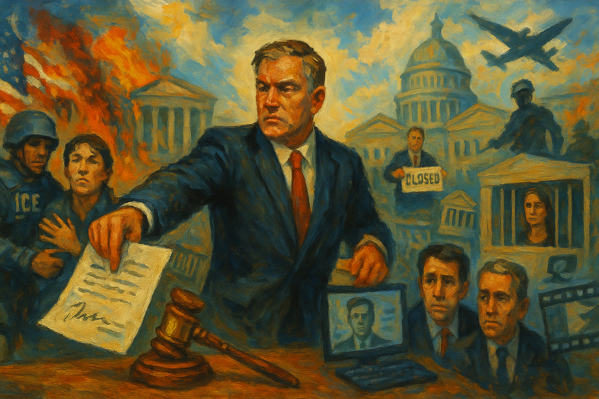

<!-- Generated by build_publish_week_v1 (appendix post) -->
<!-- Header image: image_wide_week43_appendix.png -->

# Week 43 Appendix: Memory and Law as Weapons

*A settled pattern emerges as the executive bends welfare, enforcement, and even museums to its will while courts and Congress mount scattered, fragile checks.*

This week shows an executive increasingly unconstrained by law, using clemency, security forces, and administrative power to protect allies and punish enemies while hollowing out oversight. The most intense pressure falls on rule-of-law traits: mass pardons for 2020 election conspirators and white-collar offenders, preferential treatment for Ghislaine Maxwell, politicized prosecutions of Trump critics, and efforts to dismantle the CFPB and SNAP safety net all signal that law is a weapon, not a limit. Simultaneously, immigration crackdowns (Operation Midway Blitz, CBP One termination, deportations to El Salvador) and ICE abuses illustrate security forces aligned with regime priorities over rights, even as courts in Chicago, Portland, and Illinois push back. Information and memory are contested: AI-generated campaign videos, Smithsonian content control, and museum defunding contrast with bipartisan moves to force release of Epstein files and related emails. Congress ends the record shutdown on terms favorable to the executive, underscoring legislative weakness, yet the discharge petition on Epstein demonstrates residual capacity for cross-party transparency. Internationally, tariff politics, reduced Ukraine aid, and UK intelligence friction deepen concerns about cronyism and erosion of democratic alliances.

Power and Authority

1. President Donald Trump pardoned Binance founder Changpeng Zhao after a major stablecoin deal (2025-11-08): Trump’s pardon of Binance founder CZ, following a large stablecoin arrangement with a Trump-linked firm, used clemency to benefit a powerful financial ally, weakening equal accountability for corporate crime.

2. President Donald Trump proposed abolishing private health insurance in favor of small direct payouts (2025-11-08): Trump’s proposal to replace health insurance with limited government payouts would centralize life-and-death healthcare decisions in the executive while exposing sick and poor Americans to catastrophic costs.

3. President Donald Trump urged Senate Republicans to abolish the filibuster during the shutdown (2025-11-08): Trump’s call to end the Senate filibuster during a shutdown sought to strip minority-party leverage over legislation, concentrating lawmaking power in a narrow partisan majority aligned with the executive.

4. President Donald Trump and allies rejected a one-year extension of Affordable Care Act subsidies (2025-11-09): The administration’s rejection of a temporary ACA subsidy extension during a shutdown used executive influence to block a popular lifeline for healthcare access, heightening executive leverage over social rights.

5. President Donald Trump issued mass pardons to 2020 election subversion figures (2025-11-10): Trump’s sweeping pardons for dozens involved in efforts to overturn the 2020 election signaled that attempts to subvert electoral outcomes can be shielded by presidential clemency, undermining deterrence and rule of law.

6. President Donald Trump pardoned Troy Lake for disabling diesel emissions controls (2025-11-09): By pardoning a diesel emissions violator, Trump used clemency to relieve an environmental offender of consequences, weakening regulatory enforcement and signaling tolerance for harmful corporate misconduct.

7. President Donald Trump pardoned Michael McMahon and commuted Jonathan Braun’s sentence (2025-11-10): Trump’s clemency for a convicted foreign agent and a Kushner-linked fraudster rewarded personal and political connections, eroding the expectation that serious crimes face impartial punishment.

8. President Donald Trump pardoned Robert Harshbarger Jr., husband of a sitting member of Congress (2025-11-10): Trump’s quiet pardon of a lawmaker’s spouse convicted of healthcare fraud used presidential power to favor a political insider, weakening deterrence for white-collar crime tied to public programs.

9. President Donald Trump issued a series of pardons and commutations for political and business allies (2025-11-11): A broader wave of pardons and commutations for January 6 participants and financially connected allies showed clemency being used as a loyalty and patronage tool rather than a neutral justice mechanism.

10. President Donald Trump announced plans to pull federal funding from New York City (2025-11-10): Trump’s plan to strip federal funds from New York City to sabotage a newly elected progressive mayor weaponized central fiscal power against a disfavored local government and its voters.

11. President Donald Trump directed the Justice Department to investigate Democrats’ ties to Jeffrey Epstein (2025-11-13): Trump’s public order to DOJ to probe political opponents over Epstein ties exemplified using prosecutorial power as a partisan weapon rather than an impartial tool of justice.

12. President Donald Trump claimed a false agreement with China on rare earth export controls (2025-11-11): Trump’s inaccurate claim of a rare earths deal with China misled the public about a key strategic supply issue, obscuring real policy risks in a domain central to national security.

13. President Donald Trump granted a tariff break to Switzerland after receiving valuable gifts (2025-11-13): Granting Switzerland favorable tariffs soon after Trump received gold gifts from Swiss industry blurred the line between national trade policy and personal enrichment, undermining trust in impartial economic governance.

14. President Donald Trump scaled back U.S. aid to Ukraine and other European allies (2025-11-13): Trump’s reduction of aid to Ukraine and European allies weakened support for states resisting Russian aggression, signaling a retreat from defending democratic partners abroad.

15. President Donald Trump signed an executive order restructuring tariffs on certain agricultural imports (2025-11-14): Trump’s order modifying reciprocal agricultural tariffs adjusted trade barriers by decree, illustrating how executive trade powers can quickly reshape economic conditions for domestic producers and foreign partners.

16. President Donald Trump signed a spending package ending the 43-day federal government shutdown (2025-11-13): By signing the shutdown-ending funding bill after prolonged brinkmanship, Trump restored federal operations while having leveraged service disruptions to extract concessions on his policy priorities.

17. President Donald Trump issued an executive order on foster care data and services (2025-11-13): Trump’s foster care executive order directed federal agencies to modernize child welfare systems and partner with faith-based groups, expanding executive influence over how vulnerable children receive state support.

18. President Donald Trump pardoned British billionaire Joe Lewis for insider trading (2025-11-13): Trump’s pardon of billionaire Joe Lewis, convicted of insider trading, reinforced a pattern in which wealthy offenders can secure relief from punishment through presidential favor.

19. President Donald Trump kept national parks open during the shutdown despite mass furloughs (2025-11-14): Keeping parks open without adequate staff during the shutdown prioritized optics over safety and stewardship, using executive discretion in ways that risked public resources and visitor welfare.

20. President Donald Trump publicly threatened a $1bn lawsuit against the BBC over a documentary edit (2025-11-11): Trump’s threat of a massive defamation suit against the BBC over a misleading edit signaled willingness to use personal legal threats to chill critical media coverage.

21. President Donald Trump announced a plan to issue $2,000 tariff-funded dividend checks (2025-11-09): Trump’s promise of $2,000 tariff “dividends” framed trade policy as a personal cash giveaway, using executive rhetoric to sell a questionable economic scheme that depends on congressional approval.

22. President Donald Trump proposed 50-year federally backed mortgages as housing policy (2025-11-08): Trump’s push for 50-year FHA-style mortgages would lock households into longer debt to address housing costs, expanding executive influence over credit structures with long-term distributional effects.

23. President Donald Trump publicly promised $2,000 checks as an alternative to ACA subsidies (2025-11-09): Trump’s offer of one-time $2,000 checks instead of sustained ACA subsidies used headline cash promises to deflect from weakening ongoing healthcare support, shifting risk back onto individuals.

24. President Donald Trump used Truth Social to frame Epstein investigations as a partisan hoax (2025-11-13): By branding scrutiny of his Epstein ties as a hoax while ordering probes of Democrats, Trump framed accountability efforts as partisan attacks, reinforcing a narrative that delegitimizes independent oversight.

25. President Donald Trump kept SNAP funding frozen during litigation over emergency benefits (2025-11-08): Trump’s decision to seek a Supreme Court stay on court-ordered SNAP payments used executive litigation strategy to maintain a freeze on food aid for tens of millions during a shutdown.

Institutions and Governance

1. Bipartisan members of Congress defeated a proposal to roll back state food safety laws (2025-11-08): Lawmakers from both parties blocked an industry-backed effort to weaken state food safety standards, preserving subnational regulatory authority that protects public health from centralized deregulatory pressure.

2. Senate Republicans proposed replacing Obamacare with health savings accounts (2025-11-08): Senate Republicans’ plan to swap ACA coverage for health savings accounts would shift healthcare risk onto individuals, using legislative power to narrow collective guarantees of medical security.

3. Senate Democratic leadership offered a shutdown-ending compromise tied to ACA premium tax credits (2025-11-08): Senate Democrats’ offer to trade a continuing resolution for a one-year ACA tax credit extension sought to link reopening government to preserving healthcare subsidies, but its rejection exposed partisan deadlock over social policy.

4. Senate Democrats advanced a package of spending bills and a short-term funding measure (2025-11-08): Senate Democrats moved a funding package that would end the shutdown, reverse mass federal firings, and secure back pay, using appropriations power to stabilize the civil service and social programs like SNAP.

5. U.S. Senate advanced and passed a stopgap funding bill to end the shutdown (2025-11-09): The Senate’s narrow votes to advance and approve a continuing resolution ended the record shutdown while omitting ACA subsidy extensions, highlighting both institutional capacity to reopen government and limits on securing social protections.

6. Eight Senate Democrats joined Republicans to reopen government without securing health or SNAP protections (2025-11-10): By siding with Republicans to reopen government without firm guarantees on healthcare or food aid, several Democrats prioritized ending the shutdown over leveraging it for expanded social rights.

7. U.S. House of Representatives returned from a 50-day absence to vote on a shutdown-ending bill (2025-11-12): After weeks of inaction, the House reconvened to consider a Senate-driven funding bill, underscoring how leadership’s control of the calendar can delay resolution of crises affecting federal services.

8. House Budget Committee Chair Jodey Arrington announced he would not seek reelection in 2026 (2025-11-10): Arrington’s planned departure as House Budget chair added to a wave of Republican retirements, foreshadowing shifts in fiscal leadership that could alter future budget priorities and oversight.

9. Utah State Representative Matt MacPherson moved to impeach a judge over a redistricting ruling (2025-11-10): A Utah legislator’s bid to impeach Judge Dianna Gibson for rejecting a GOP-drawn map threatened judicial independence by punishing a court for enforcing fair representation standards.

10. U.S. Supreme Court agreed to hear a challenge to Mississippi’s late-arriving mail ballot rule (2025-11-10): The Court’s decision to review Mississippi’s five-day mail ballot grace period could reshape how many states count timely mailed votes, with major implications for ballot access and election administration.

11. Utah District Judge Dianna Gibson approved a new congressional map creating a Democratic-leaning seat (2025-11-11): Judge Gibson’s adoption of a citizen-proposed map that consolidated Salt Lake County into one district curbed partisan gerrymandering and improved prospects for competitive representation in Utah.

12. Oklahoma Governor Kevin Stitt granted clemency to death row inmate Tremane Wood (2025-11-12): Governor Stitt’s commutation of Tremane Wood’s death sentence to life without parole, following concerns about fairness and racial bias, showed a state executive using clemency to correct potential miscarriages of justice.

13. U.S. Supreme Court extended a stay allowing SNAP funding to remain frozen (2025-11-12): By extending an administrative stay on a lower court order to release $4bn in SNAP benefits, the Supreme Court kept food aid on hold for 42 million people while legal arguments continued.

14. U.S. Department of Justice joined a lawsuit challenging California’s new congressional map (2025-11-14): DOJ’s decision to side with California Republicans against a Newsom-backed map aligned federal legal power with partisan redistricting claims, raising questions about neutral enforcement of voting rights.

15. U.S. Justice Department filed a court claim attacking the CFPB’s funding mechanism (2025-11-11): DOJ’s argument that the CFPB cannot lawfully draw funds from the Federal Reserve advanced a legal strategy that could cripple the consumer watchdog’s operations without direct congressional repeal.

16. Justice Department Office of Legal Counsel issued an opinion restricting CFPB access to Federal Reserve funds (2025-11-11): OLC’s opinion that the CFPB cannot draw money while Fed earnings are negative provided legal cover for starving the agency of resources, weakening independent consumer financial oversight.

17. White House budget director Russell Vought announced plans to shut down the CFPB within three months (2025-11-11): Vought’s plan to close the CFPB signaled an aggressive executive push to dismantle a key post-crisis consumer regulator, shifting financial power away from public oversight.

18. U.S. Senate and House leadership included and then moved to repeal a DOJ-surveillance damages provision for senators (2025-11-12): A little-noticed rider letting senators sue DOJ for surveillance damages, and Speaker Johnson’s quick move to repeal it, highlighted how self-dealing provisions can slip into must-pass bills and then be politically corrected.

19. Representative Sean Casten publicly criticized the DOJ-surveillance damages provision for senators (2025-11-12): Casten’s criticism of a clause allowing senators to profit from surveillance lawsuits spotlighted ethical concerns about lawmakers writing personal financial benefits into federal law.

20. House Speaker Mike Johnson scheduled an early House vote on releasing Epstein-related DOJ files (2025-11-13): Johnson’s decision to hold a vote on the Epstein files bill earlier than required acknowledged a successful discharge petition and showed leadership responding to bipartisan transparency pressure despite personal opposition.

21. Representative Adelita Grijalva was sworn in and became the 218th signer on an Epstein discharge petition (2025-11-12): Grijalva’s swearing-in and signature gave a discharge petition the 218 votes needed to force a House vote on releasing Epstein files, demonstrating how rank-and-file members can bypass leadership to advance transparency.

22. House of Representatives saw a discharge petition reach 218 signatures to compel an Epstein files vote (2025-11-13): A bipartisan discharge petition reaching 218 signatures forced a House vote on releasing Epstein-related DOJ files, using procedural tools to overcome leadership resistance to disclosure.

23. House Democrats blocked unanimous consent on the Epstein Files Transparency Act (2025-11-13): By objecting to unanimous consent on the Epstein transparency bill, House Democrats ensured a recorded vote, preventing members from avoiding public accountability on a high-profile disclosure question.

24. Representatives Marjorie Taylor Greene, Nancy Mace, Thomas Massie, and Tim Burchett took divergent public positions on the Epstein files petition and vote (2025-11-12): Republican members split over the Epstein petition—some championing transparency, others resisting—illustrating intra-party tensions over exposing potential elite misconduct.

25. Former President Donald Trump and senior law enforcement officials attempted to pressure House members to withdraw support from the Epstein discharge petition (2025-11-13): Trump’s outreach to lawmakers, including a Situation Room meeting with Boebert, to dissuade support for the Epstein petition showed executive-aligned actors trying to shape congressional oversight agendas behind closed doors.

26. House Oversight Committee Democrats released subpoenaed Epstein estate emails into the congressional record (2025-11-12): Oversight Democrats’ publication of thousands of Epstein-related emails, including references to Trump, used committee powers to expand the public record on elite abuse and potential political leverage.

27. House Oversight Committee Republicans released 20,000 pages of Epstein documents on reputation management efforts (2025-11-14): Republican Oversight members’ release of extensive Epstein PR and media-manipulation records broadened public understanding of how a wealthy predator tried to shape information flows after conviction.

28. Georgia Prosecuting Attorneys’ Council Director Pete Skandalakis appointed himself to continue the Georgia Trump election interference case (2025-11-14): Skandalakis’s move to take over the stalled Georgia election interference prosecution kept alive a key state-level case against Trump, preserving a remaining avenue for accountability outside federal control.

29. U.S. Bankruptcy Court moved toward approving a $7bn settlement with Purdue Pharma (2025-11-14): A federal judge’s plan to approve a multibillion-dollar Purdue Pharma settlement, converting the company into a nonprofit, represented a major institutional response to corporate responsibility in the opioid crisis.

30. Georgia State Election Board settled a lawsuit over use of private emails for official business (2025-11-12): Georgia’s election board agreed to stop using private and ephemeral messaging for official work, strengthening transparency and record-keeping in an office central to election administration.

31. University of Texas at Dallas professors Ben Wright and Rosemary Admiral sued the university and state officials over alleged retaliation for protest arrests (2025-11-14): Two professors’ lawsuit claiming retaliatory restrictions after peaceful protest arrests used the courts to challenge campus and state actions that may chill academic and political expression.

32. U.S. District Judge Karin Immergut issued a final order blocking National Guard deployment to Portland (2025-11-08): Judge Immergut’s permanent injunction against deploying National Guard troops to Portland without credible evidence of widespread violence reinforced judicial checks on militarized responses to protest.

33. Multiple federal judges in Illinois blocked Trump administration attempts to deploy National Guard troops for immigration enforcement (2025-11-11): Court rulings preventing National Guard deployments to Illinois for immigration operations upheld legal limits on using military forces in domestic law enforcement.

34. U.S. District Judge Sara Ellis issued a restraining order limiting ICE agents’ use of force in Chicago (2025-11-11): Judge Ellis’s order restricting ICE force in Chicago imposed judicial oversight on aggressive immigration tactics, aiming to protect residents’ rights during federal operations.

35. U.S. District Judge Jeffrey Cummings ordered release on bond of hundreds detained in Chicago immigration raids (2025-11-12): Judge Cummings’s order to release many Operation Midway Blitz detainees on bond and bar coercive “voluntary” deportations enforced due process protections against warrantless mass arrests.

36. Federal judge in Indiana ruled an ICE arrest of a Chicago daycare worker unlawful and ordered a bond hearing (2025-11-13): A judge’s finding that ICE unlawfully detained daycare worker Diana Santillana Galeano, and order for a prompt bond hearing, reinforced judicial oversight of immigration detention practices.

37. Former FBI Director James Comey and New York Attorney General Letitia James challenged the legality of a Trump-era U.S. attorney appointment used to indict them (2025-11-13): Comey and James’s motion to dismiss charges based on an allegedly unlawful U.S. attorney appointment tested whether the executive can bypass Senate confirmation to target political adversaries.

38. U.S. District Judge Mark Wolf resigned in protest over perceived partisan misuse of law by the Trump administration (2025-11-08): Judge Wolf’s resignation, citing misuse of law for partisan ends, was an extraordinary signal from the judiciary about erosion of legal norms under executive pressure.

Economic Structure

1. U.S. Department of Agriculture ordered states to undo full November SNAP benefit payments and claw back funds (2025-11-09): USDA’s directive to reverse and recoup SNAP benefits during a shutdown used administrative power to retract basic food support, deepening economic insecurity for low-income households.

2. U.S. Environmental Protection Agency proposed weakening PFAS chemical reporting requirements (2025-11-10): EPA’s proposal to exempt many low-percentage or byproduct PFAS uses from reporting reduced transparency about toxic chemicals, favoring industry convenience over environmental and public health protections.

3. U.S. Environmental Protection Agency approved Utah’s interstate ozone transport plan under the Clean Air Act (2025-11-10): EPA’s approval of Utah’s ozone transport plan affirmed a state’s compliance with national air standards, showing routine regulatory oversight functioning amid broader politicization.

4. U.S. Environmental Protection Agency extended the comment period and postponed a scientific meeting on D4 chemical risks (2025-11-13): EPA’s extension of the D4 risk evaluation comment period and postponement of a science advisory meeting maintained public input opportunities despite shutdown disruptions, supporting more informed chemical regulation.

5. U.S. Environmental Protection Agency extended compliance deadlines for methylene chloride workplace protections (2025-11-13): EPA’s extension of compliance dates for non-federal labs on methylene chloride rules balanced safety requirements with operational capacity, affecting how quickly workplaces must adopt stronger protections.

6. U.S. Environmental Protection Agency extended postponement of certain trichloroethylene regulation provisions amid litigation (2025-11-14): By delaying parts of its TCE rule while court challenges proceed, EPA kept contested restrictions on hold, illustrating how litigation can slow implementation of health-protective regulations.

7. U.S. Environmental Protection Agency announced availability of environmental impact statements for public review (2025-11-14): EPA’s notice of new environmental impact statements, including for a Texas ship channel project, supported public scrutiny of major infrastructure decisions that shape local economies and ecosystems.

8. U.S. Environmental Protection Agency granted Texas primacy over Class VI carbon sequestration wells (2025-11-14): EPA’s approval of Texas’s primacy for Class VI injection wells shifted key carbon sequestration permitting authority to a state regulator, affecting oversight of a growing climate-related industry.

9. Fannie Mae and Federal Housing Finance Agency leadership removed watchdogs and ethics officials amid probes into political data misuse (2025-11-10): The firing of Fannie Mae watchdogs and FHFA ethics staff during investigations into alleged political targeting and data misuse weakened internal checks at a major housing finance institution.

10. FHFA Director Bill Pulte politicized the housing regulator and attacked perceived opponents (2025-11-11): Pulte’s public accusations against officials like Adam Schiff and Letitia James, and pressure on Fed leadership, blurred the line between neutral housing regulation and partisan combat.

11. Fannie Mae leadership experienced a leak of confidential mortgage pricing data to a competitor (2025-11-13): A leak of Fannie Mae’s confidential pricing data to a rival raised concerns about collusion and market manipulation in a core public-private mortgage institution.

12. South Dakota Governor Kristi Noem’s administration bypassed competitive bidding for a $200m anti-immigration ad campaign (2025-11-13): Awarding a massive DHS-style ad contract to a politically connected firm without open bidding used public funds for ideological messaging while undermining procurement fairness.

13. Trump Organization and Coast Guard-run exchanges began selling Trump-branded wine and cider in military stores (2025-11-08): Allowing Trump-branded products into tax-advantaged military exchanges monetized public facilities for the president’s private business, blurring lines between service to troops and self-enrichment.

14. Trump administration economic team admitted hollowing out the Bureau of Labor Statistics and manipulating data (2025-11-13): A top adviser’s admission that the administration was “concocting” inflation and employment numbers signaled systemic politicization of core economic statistics vital for democratic accountability.

15. Trump administration and USDA withheld and reversed SNAP benefits during the shutdown (2025-11-11): The administration’s sustained withholding and clawback of SNAP funds during a shutdown used food assistance as a fiscal and political lever, intensifying hardship for poor families.

16. American Alliance of Museums and federal grant-making agencies reported widespread loss of government funding for museums under Trump (2025-11-11): A survey showing one-third of U.S. museums losing federal grants highlighted how funding cuts to cultural institutions reduce access to public goods like education and shared history.

17. Beam, Eight Sleep, and Rocket Money sponsored Tucker Carlson’s podcast despite extremist content (2025-11-10): Corporate sponsorships of Carlson’s show after a friendly interview with white supremacist Nick Fuentes funneled advertising money to a platform amplifying extremist rhetoric, intertwining commerce and harmful political speech.

18. Rocket Money ended its sponsorship of Tucker Carlson’s podcast after public scrutiny (2025-11-12): Rocket Money’s withdrawal from Carlson’s show under pressure showed how consumer and media accountability can push firms to reconsider funding for extremist-aligned outlets.

19. European Commission worked on new rules to speed energy project permitting and grid connections (2025-11-13): The Commission’s effort to streamline energy permitting aimed to strengthen Europe’s energy infrastructure and economic resilience, which underpin democratic stability.

20. German government maintained a ban on nuclear energy despite high industrial power costs (2025-11-13): Germany’s continued nuclear ban contributed to higher industrial electricity prices, illustrating how energy policy choices can strain economic competitiveness and fiscal capacity.

21. United Kingdom government scrapped new offshore oil and gas exploration projects (2025-11-13): The UK’s halt to new offshore oil and gas exploration advanced climate goals but raised concerns about energy security and costs, affecting economic conditions that shape political stability.

22. Trump administration imposed tariffs on European goods, escalating trade tensions (2025-11-13): New U.S. tariffs on European imports strained transatlantic trade, risking retaliatory measures and economic disruption that can weaken democratic alliances.

23. Trump administration and FHFA Director Bill Pulte advanced a 50-year mortgage proposal through federal housing channels (2025-11-11): The 50-year mortgage plan, championed by Pulte, would reshape mortgage markets in ways critics say favor lenders and politically connected actors over long-term homeowner equity.

Civil Rights and Dissent

1. U.S. Immigration and Customs Enforcement agents conducted an arrest in Massachusetts where a man collapsed while holding a child (2025-11-08): A controversial ICE arrest in Fitchburg, where a man fell unconscious while clutching a child, highlighted the human costs and public backlash surrounding aggressive immigration enforcement tactics.

2. U.S. Immigration and Customs Enforcement and CBP conducted Operation Midway Blitz raids across Chicago (2025-11-13): Operation Midway Blitz’s mass raids and alleged warrantless detentions in Chicago turned immigrant neighborhoods into “ghost towns,” illustrating how large-scale enforcement can chill community life and rights.

3. U.S. Immigration and Customs Enforcement pepper-sprayed an Illinois family including a one-year-old, according to allegations (2025-11-11): Reports that ICE agents pepper-sprayed a couple, their baby, and a relative in Cicero underscored concerns about excessive force and trauma inflicted on immigrant families during enforcement.

4. U.S. Immigration and Customs Enforcement terminated the CBP One app used for legal asylum appointments (2025-11-12): Ending the CBP One app sharply reduced legal pathways for asylum seekers at the southern border, pushing more people into irregular crossings and weakening procedural protections.

5. Trump administration sent 252 Venezuelan men to a notorious El Salvador prison as “irregular warfare” (2025-11-08): Transferring hundreds of Venezuelan men to a harsh Salvadoran prison with limited due process framed migration as warfare and outsourced detention to a foreign facility with reported abuses.

6. Trump administration intensified deportation operations nationwide, including in Eagle Pass, Texas (2025-11-12): Escalated deportation raids that swept up parents, appeared at schools, and mistakenly detained citizens in places like Eagle Pass deepened fear and legal uncertainty for immigrant communities.

7. Trump administration imposed new biometric tracking and registration rules on Canadian visitors (2025-11-09): New requirements for photographing all non-U.S. visitors on entry and exit, and for Canadians staying over 30 days to register whereabouts, expanded surveillance of ordinary travelers.

8. U.S. Immigration and Customs Enforcement and DHS detained British commentator Sami Hamdi and labeled him a terrorist sympathizer (2025-11-12): ICE’s detention and forced departure of Sami Hamdi, apparently tied to his political speech on Israel, showed how immigration powers can be used to sideline foreign critics without formal charges.

9. Local police in Sampson County, North Carolina cooperated with ICE to entrap undocumented workers (2025-11-11): Sampson County police collaboration with ICE to ensnare undocumented workers blurred local policing with federal immigration enforcement, heightening vulnerability for immigrant laborers.

10. Fullerton Police Department and an ICE agent were involved in an incident where an ICE agent pointed a gun at a woman filming him (2025-11-11): A California officer’s intervention when an ICE agent pointed a gun at a woman recording him highlighted tensions between local non-cooperation policies and federal agents’ confrontational tactics.

11. Texas Governor Greg Abbott expanded Operation Lone Star with dangerous river buoys in the Rio Grande (2025-11-12): Abbott’s deployment of saw-bladed buoys in the Rio Grande under Operation Lone Star militarized the border in ways that threatened migrants’ safety and the river environment.

12. Trump administration and U.S. Southern Command deployed the USS Gerald R Ford to Latin American waters in an anti-drug campaign (2025-11-11): Sending the world’s largest aircraft carrier to Latin America as part of a “war on drugs” escalated military presence near Venezuela, raising risks of conflict under a law-enforcement pretext.

13. Trump administration kept national parks open during the shutdown without adequate staffing (2025-11-14): Leaving parks open while most rangers were furloughed created safety hazards and resource damage, showing how shutdown tactics can compromise public access and environmental stewardship.

14. Trump administration withheld SNAP benefits, prompting local food aid mobilization (2025-11-11): Federal withholding of SNAP benefits forced local groups in North Carolina to fill gaps, shifting responsibility for basic subsistence from national safety nets to ad hoc community efforts.

15. Trump administration supported Israeli actions in Gaza and the West Bank described as genocidal by critics (2025-11-11): Continued U.S. backing for destructive operations in Gaza and the West Bank drew accusations of complicity in grave human rights abuses, affecting America’s global democratic credibility.

16. Trump administration sent Venezuelan detainees to a harsh foreign prison and used private detention centers with alleged abuses (2025-11-13): Use of a notorious Salvadoran prison and a CoreCivic-run ICE facility with alleged inhumane conditions showed coercive detention outsourced to less accountable environments.

17. Trump administration deployed aggressive ICE operations in Chicago despite court limits (2025-11-13): Continuing aggressive ICE raids in Chicago under Operation Midway Blitz, even as courts imposed restraints, underscored tensions between federal enforcement priorities and judicially protected rights.

18. Trump administration threatened air traffic controllers who refused to work unpaid during the shutdown (2025-11-10): Trump’s threats of “negative marks” and loss of severance for controllers who would not work without pay, paired with bonuses for loyalists, used economic coercion to suppress labor resistance.

19. Delta Air Lines settled a lawsuit alleging sexual harassment and retaliation for union support (2025-11-11): Delta’s settlement with a former flight attendant who alleged harassment and retaliation for pro-union speech highlighted ongoing vulnerabilities for workers challenging corporate power.

20. Starkville Police Department arrested a student for antisemitic harassment of Dave Portnoy (2025-11-11): Police arrest of a student who shouted antisemitic slurs and threw coins at a public figure showed law enforcement responding to hate incidents while raising questions about speech and public order boundaries.

21. University of Kentucky banned a tenured professor from teaching after his comments on Israel (2025-11-13): The university’s ban on Professor Ramsi Woodcock from the law school over his Israel-related remarks prompted a First Amendment lawsuit, testing academic freedom and the use of antisemitism definitions in campus discipline.

22. University of Texas at Dallas and state officials restricted campus access for professors after protest arrests, prompting litigation (2025-11-14): UT Dallas’s restrictions on two professors following peaceful protest arrests, now challenged in court, raised concerns about universities retaliating against faculty activism.

23. Ready the Ground Training Team and Durham civic groups organized a large workshop on responding to ICE operations (2025-11-11): A Durham workshop training hundreds on how to respond to ICE actions built community capacity to assert rights and support vulnerable neighbors under aggressive immigration enforcement.

24. Local Democratic groups in Alamance County, North Carolina held a town hall on the state budget and Medicaid funding amid federal cuts (2025-11-11): A town hall on budget and Medicaid issues fostered public engagement with fiscal decisions that shape access to healthcare and social services at the state level.

25. Anti-Defamation League launched an initiative to monitor New York City’s mayor-elect for antisemitism (2025-11-14): The ADL’s plan to track Mayor-elect Zohran Mamdani’s statements for antisemitism reflected growing use of organized monitoring in polarized debates over speech, identity, and governance.

26. Survivors of Jeffrey Epstein and Ghislaine Maxwell delivered a letter urging Congress to vote on the Epstein Files Transparency Act (2025-11-13): Two dozen survivors’ appeal to Congress for a vote on releasing Epstein files centered victims’ voices in a push for transparency and accountability for elite sexual abuse networks.

27. Trump administration and U.S. Navy used military deployments and airstrikes in a Caribbean “war on drugs” (2025-11-11): Airstrikes on suspected drug boats and carrier deployments in the Caribbean, which led the UK to halt intelligence sharing, showed how militarized drug policy can strain alliances and risk civilian harm.

28. Trump administration supported aggressive Israeli military actions criticized as genocidal (2025-11-11): U.S. backing for destructive operations in Gaza and the West Bank, described by critics as genocidal, raised questions about America’s commitment to human rights and self-determination abroad.

Information, Memory and Manipulation

1. Right-wing outlet The Blaze and allied influencers published and amplified an unverified story naming a former Capitol Police officer as the January 6 pipe bomber (2025-11-08): The Blaze’s speculative identification of a supposed J6 pipe bomber, widely echoed without solid evidence, exemplified disinformation that can endanger individuals and erode trust in investigations.

2. Trump administration and Smithsonian Institution initiated a review of museum exhibits deemed overly negative about U.S. history (2025-11-11): A White House-driven review of Smithsonian content for being “overly negative” about U.S. history pressured museums to soften critical narratives about race and injustice.

3. President Donald Trump signed an executive order directing the Smithsonian to remove “improper, divisive, or anti-American” content (2025-11-11): Trump’s order targeting Smithsonian exhibits, especially on African American history, used executive power to steer public memory toward sanitized, nationalist narratives.

4. Trump administration cut federal grants and contracts to museums nationwide (2025-11-11): Significant funding losses for museums under Trump constrained cultural institutions’ ability to provide inclusive programming, indirectly shaping which histories and communities receive public attention.

5. House Oversight Committee released emails showing Epstein’s efforts to manage media and online search results (2025-11-14): Newly released Epstein documents detailed sophisticated campaigns to bury negative coverage and manipulate search results, revealing how wealth can shape public narratives about criminal conduct.

6. House Oversight Committee and allied media released emails contradicting Trump’s claims of ignorance about Epstein’s crimes (2025-11-12): Emails stating that Trump “knew about the girls” and spent hours at Epstein’s house with a victim undermined his public denials, reshaping the factual record on his relationship with Epstein.

7. Popular Information and House Oversight Committee publicized whistleblower claims of preferential treatment for Ghislaine Maxwell in prison (2025-11-13): Reports that Maxwell enjoyed special meals, unmonitored visits, and even a puppy in custody highlighted how elite inmates can receive gentler treatment, challenging narratives of equal justice.

8. Prison employees and Representative Jamie Raskin were involved in leaks of Ghislaine Maxwell’s attorney-client emails to Congress (2025-11-13): Staff leaking Maxwell’s privileged emails to Raskin, and subsequent firings, raised complex questions about whistleblowing, privacy, and how information about high-profile inmates reaches lawmakers.

9. Trump administration and USDA issued conflicting directives and legal maneuvers over SNAP emergency payments (2025-11-08): Rapid shifts between court orders, Supreme Court stays, and USDA memos on SNAP created confusion for states and beneficiaries, making it harder for the public to track who was responsible for lost aid.

10. Trump administration suspended the CDC’s national flu vaccine campaign after taking office (2025-11-11): Halting the CDC’s “wild to mild” flu campaign during a severe season reduced authoritative public health messaging, leaving pediatricians to fill an information gap on vaccination.

11. Trump administration economic team acknowledged replacing empirical economic data with politically driven figures (2025-11-13): An adviser’s statement that the administration was “concocting” inflation and jobs numbers signaled deliberate manipulation of official statistics that citizens and markets rely on.

12. Trump administration and Justice Department allegedly investigated debunked 2020 Georgia election fraud claims (2025-11-14): Reports that DOJ was pursuing long-discredited Georgia fraud narratives suggested federal law enforcement resources being used to validate election denial rather than protect voting rights.

13. Andrew Cuomo’s mayoral campaign shared AI-generated videos depicting his opponent in racially charged ways (2025-11-13): Cuomo’s use of AI videos portraying Zohran Mamdani in stereotyped scenes showed how synthetic media can inject racism and Islamophobia into local elections while obscuring authorship.

14. Eric Adams’s campaign used AI-generated robocalls and dystopian videos in the NYC mayoral race (2025-11-13): Adams’s deployment of AI robocalls and imagery to attack Mamdani highlighted how campaigns can scale persuasive messaging across languages with minimal transparency about manipulation.

15. President Donald Trump shared an AI-generated video of himself attacking protesters during No Kings demonstrations (2025-11-13): Trump’s promotion of an AI video showing him bombing Americans normalized fantastical, violent imagery in political communication, further blurring lines between reality and spectacle.

16. President Donald Trump and legal team threatened a $1bn defamation suit against the BBC over a January 6 documentary edit (2025-11-11): Trump’s legal threat against the BBC over a misleading edit, despite the network’s acknowledgment, signaled a readiness to use massive lawsuits to intimidate investigative media.

17. Marion County, Kansas agreed to pay over $3m and apologize for a police raid on a local newspaper (2025-11-11): The county’s settlement and apology for an unjustified raid on the Marion County Record acknowledged a serious violation of press freedom and may deter similar abuses.

18. Trump administration and FHFA Director Bill Pulte were implicated in efforts to access and potentially misuse mortgage records of political opponents (2025-11-12): Investigations into whether a Trump ally accessed mortgage files of officials like Letitia James and Adam Schiff raised fears of financial data being weaponized against critics.

19. Trump administration and Justice Department provided outdated Epstein materials to Congress while estate documents showed more damning details (2025-11-13): The contrast between DOJ’s stale Epstein files and the estate’s revealing emails suggested an attempt by the executive branch to sanitize the historical record of elite misconduct.

20. Trump administration and DHS labeled Sami Hamdi a terrorist sympathizer based on a politicized video (2025-11-14): Branding Hamdi a terrorist sympathizer on the basis of a contested clip, without charges, showed how security labels can be used to delegitimize dissenting foreign voices.

21. Trump administration and USDA issued confusing SNAP guidance that forced states to reverse payments under threat (2025-11-09): USDA’s warnings that states could lose administrative funding or face liability for SNAP overpayments pressured them to claw back aid, using bureaucratic complexity to enforce austerity.

22. Trump administration and Justice Department aligned with election denial activists in Georgia, according to reports (2025-11-14): Claims that DOJ was working with Georgia election deniers to revisit debunked fraud allegations suggested institutional validation of narratives that undermine confidence in legitimate elections.

23. Trump administration cut funding to museums and targeted Smithsonian content while resisting full Epstein file disclosure (2025-11-14): Combined moves to defund museums, police Smithsonian narratives, and limit damaging Epstein disclosures showed a broader strategy of curating public memory to favor the regime.

24. Trump administration and economic advisers used chaotic overlapping crises and shifting narratives to fragment public focus (2025-11-14): Simultaneous shutdown brinkmanship, SNAP reversals, mass pardons, aggressive raids, and conflicting international claims contributed to an environment where citizens struggle to track responsibility.

