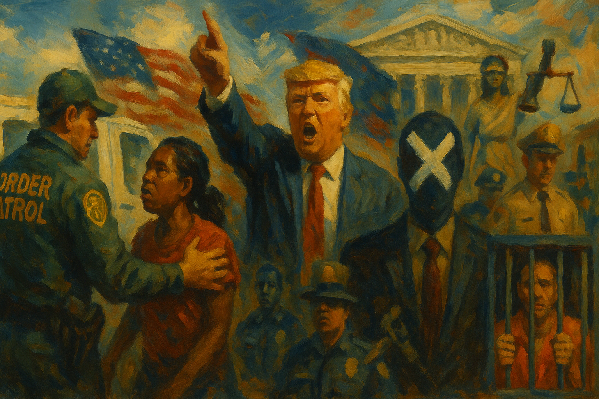

<!-- Generated by build_publish_week_v1 (appendix post) -->
<!-- Header image: image_wide_week44_appendix.png -->

# Week 44 Appendix: Belonging Redrawn by Force

*Immigration raids, anti-trans decrees, and secrecy fights hardened stratified citizenship while Congress and courts mounted partial, fragile checks on executive power.*

This week shows an aggressive consolidation of executive power, with immigration crackdowns, anti-trans executive orders, and politicized law enforcement all pointing toward a governing model that treats law as a weapon rather than a limit. Operation Charlotte’s Web and related ICE/Border Patrol deployments exemplify federal power used to intimidate disfavored communities and defy local authorities, directly eroding civil liberties and federalism. Simultaneously, a sweeping suite of anti-trans policies—banning military service, stripping data and documentation, constraining healthcare, housing, prisons, and education—formalizes a stratified citizenship regime. The justice system is bent toward retaliation and impunity: politicized prosecutions (Comey), indulgent settlements and pardons (Flynn, January 6 rioter, Charles Scott), and security-state favoritism inside the FBI. Yet Congress briefly asserts itself through near-unanimous passage of the Epstein Files Transparency Act and a bipartisan move to restore federal union rights, even as Trump and DOJ maneuver to nullify that transparency. Foreign and economic policy are tightly interwoven with crony capitalism and Saudi-linked self-dealing, while Trump escalates rhetoric to calling for execution of lawmakers, normalizing eliminationist language against political opponents.

Power and Authority

1. Department of Homeland Security launched Operation Charlotte's Web in Charlotte after local non-cooperation (2025-11-15): DHS initiated a large immigration sweep in Charlotte in response to local limits on detainer cooperation, testing federal leverage over sanctuary-style policies and raising concerns about unchecked executive enforcement power.

2. President Donald Trump directed Attorney General Pam Bondi to investigate named political opponents using Epstein materials (2025-11-15): Trump’s order to investigate specific Democratic figures over Epstein links used prosecutorial machinery against rivals, blurring the line between neutral law enforcement and personalized executive retribution.

3. President Donald Trump signed an executive order ending certain commodity tariffs to address prices (2025-11-15): Trump’s tariff rollback on key imports highlighted how unilateral trade powers can rapidly reshape economic conditions, underscoring the executive’s central role in setting de facto tax and price policy.

4. President Donald Trump ordered a new investigation into the Jeffrey Epstein case (2025-11-15): By reopening the Epstein probe while transparency votes loomed, Trump created an investigative pretext that could justify withholding records, using executive authority to shape what the public may learn about elite misconduct.

5. President Donald Trump pardoned white-collar offender Charles Scott after minimal jail time (2025-11-16): The rapid pardon of a convicted fraudster raised concerns that clemency was being used to favor connected offenders, weakening deterrence and equal application of financial crime laws.

6. President Donald Trump publicly withdrew support from Marjorie Taylor Greene and criticized Thomas Massie over Epstein file votes (2025-11-15): Trump’s withdrawal of backing from GOP lawmakers who supported Epstein file disclosure signaled that party loyalty to his preferences could outweigh transparency and independent legislative judgment.

7. Texas Governor Greg Abbott designated CAIR and the Muslim Brotherhood as terrorist organizations under state law (2025-11-18): Abbott’s unilateral terror designations of a Muslim civil rights group and a foreign movement challenged federal primacy over terrorism lists and risked stigmatizing advocacy as security threats.

8. President Donald Trump confirmed intention to sell F-35 jets to Saudi Arabia despite security objections (2025-11-18): Trump’s commitment to advanced jet sales to Saudi Arabia over intelligence and ally concerns showed executive discretion in arms transfers overriding traditional security caution and alliance management.

9. President Donald Trump designated Saudi Arabia a major non-NATO ally and announced large bilateral deals (2025-11-18): Granting Saudi Arabia major non-NATO ally status alongside vast investment and arms deals deepened a strategic partnership where personal and national interests risked becoming intertwined.

10. President Donald Trump dismissed intelligence findings on Jamal Khashoggi’s murder while praising Mohammed bin Salman (2025-11-18): Trump’s public rejection of U.S. intelligence on Khashoggi’s killing in favor of Saudi narratives signaled willingness to sideline professional assessments for diplomatic and economic alignment with an authoritarian partner.

11. President Donald Trump met with Saudi Crown Prince Mohammed bin Salman while his family pursued Saudi business deals (2025-11-18): Trump’s Oval Office meeting with MBS amid ongoing Trump Organization projects in Saudi Arabia highlighted blurred lines between U.S. foreign policy and the president’s private financial interests.

12. President Donald Trump announced partial rollback of tariffs on Chinese imports through exemptions and deferrals (2025-11-20): The administration’s partial easing of China tariffs via complex exemptions showed how executive trade tools can be adjusted to manage political fallout while leaving disruptive policies largely intact.

13. President Donald Trump called for execution of Democratic lawmakers who urged troops to refuse unlawful orders (2025-11-19): Trump’s demand for executing opposition lawmakers for reminding troops of constitutional duties normalized eliminationist rhetoric against elected critics and threatened peaceful political competition.

14. President Donald Trump publicly threatened Democratic lawmakers with execution in response to their video on unlawful orders (2025-11-20): Trump’s repeated threats of execution against Democratic senators and representatives for constitutional messaging to the military further eroded norms protecting opposition figures from state-linked intimidation.

15. President Donald Trump implemented Liberation Day tariffs that raised costs on intermediate goods (2025-11-20): The Liberation Day tariff package imposed broad levies on intermediate goods, disrupting production and jobs while illustrating how concentrated executive trade power can reshape economic structure without legislative debate.

16. President Donald Trump ignored economic advice warning against tariffs on intermediate goods (2025-11-20): By disregarding expert warnings about taxing inputs, the administration highlighted how executive economic decisions can sideline technocratic guidance, with downstream effects on growth and public welfare.

17. President Donald Trump oversaw tariff-driven conditions that pushed U.S. manufacturing toward recession-like levels (2025-11-20): Tariff policies that contributed to prolonged weakness in manufacturing underscored how unilateral trade actions can function as structural economic governance tools with limited direct accountability.

Institutions and Governance

1. House Oversight Committee received and reviewed Epstein estate documents showing texts with a member of Congress (2025-11-15): Newly released Epstein estate records indicating real-time texting with a lawmaker during a 2019 hearing raised concerns about outside influence on congressional questioning and oversight integrity.

2. Salt Lake County District Attorney declined to charge Tim Ballard with sexual assault citing insufficient admissible evidence (2025-11-15): The decision not to prosecute a prominent anti-trafficking figure despite multiple allegations highlighted tensions between evidentiary standards and public expectations of accountability for influential actors.

3. Department of Justice entered settlement talks over Michael Flynn’s $50 million claim after his suit was dismissed (2025-11-15): DOJ’s willingness to negotiate a large payout to Michael Flynn after failed litigation suggested that politically connected figures may secure favorable redress from the state unavailable to ordinary defendants.

4. House Ethics Committee reported that former Representative Matt Gaetz likely paid a minor for sex (2025-11-17): The Ethics Committee’s finding that a former member likely exploited a vulnerable teenager underscored both the capacity and limits of internal congressional mechanisms to address serious misconduct absent criminal charges.

5. Magistrate Judge William Fitzpatrick found government misconduct and ordered grand jury materials released in the Comey case (2025-11-17): A federal judge’s finding of serious prosecutorial missteps in the Comey indictment, including false legal instructions, highlighted judicial oversight as a check on politicized prosecutions.

6. Federal judiciary reprimanded Border Patrol official Gregory Bovino over attacks on peaceful protesters (2025-11-16): A Chicago judge’s rebuke of Border Patrol actions against protesters underscored courts’ role in constraining federal enforcement when it infringes on civil rights.

7. House of Representatives voted overwhelmingly to pass the Epstein Files Transparency Act mandating DOJ disclosure (2025-11-18): The House’s 427–1 vote to compel release of Epstein-related DOJ records marked a rare bipartisan assertion of transparency demands in a case involving powerful figures.

8. Representative Jared Golden and bipartisan co-sponsors secured enough signatures to force House action on restoring federal workers’ union rights (2025-11-18): A bipartisan discharge petition to repeal Trump-era limits on federal worker unions showed legislators using procedural tools to counter executive curbs on collective bargaining.

9. Indiana Senate leadership canceled a December redistricting meeting despite pressure from Trump and Governor Braun (2025-11-18): Indiana Senate leaders’ refusal to convene a redistricting session signaled intra-party resistance to externally driven gerrymandering plans, modestly reinforcing legislative autonomy.

10. President Donald Trump reversed position and urged House Republicans to support releasing Epstein FBI files (2025-11-18): Trump’s late endorsement of Epstein file disclosure, after earlier resistance, illustrated how executive messaging can shift under intra-party and public pressure on transparency issues.

11. United States Senate approved the Epstein files release bill by unanimous consent (2025-11-18): The Senate’s unanimous consent to the Epstein transparency bill reinforced cross-party agreement that public access to these records is necessary for accountability.

12. President Donald Trump signed legislation compelling DOJ to release Epstein investigation files within 30 days (2025-11-19): By signing the Epstein files law, Trump formally bound DOJ to disclose sensitive records despite his own political exposure, strengthening statutory transparency requirements.

13. House of Representatives transmitted the Epstein files resolution to the Senate and then the president (2025-11-19): Formal transmission of the Epstein disclosure measure advanced a rare, coordinated legislative push to pierce secrecy around elite-linked crimes.

14. House of Representatives voted unanimously to repeal a Senate provision granting senators taxpayer-funded damages (2025-11-19): The House’s unanimous repeal of a self-serving Senate damages clause signaled institutional self-correction against perceived misuse of public funds for lawmakers’ benefit.

15. Congress considered a 2026 military budget approaching $1.045 trillion (2025-11-19): Deliberations over a near–$1 trillion defense budget highlighted how legislative choices can entrench a war-focused fiscal structure and channel vast resources to military contractors.

16. House Republicans failed in an attempt to censure Delegate Stacey Plaskett over Epstein-related texts (2025-11-19): The defeat of a censure resolution targeting Stacey Plaskett, followed by withdrawal of a reciprocal censure, underscored how ethics tools can be wielded and bargained as partisan weapons rather than neutral accountability mechanisms.

17. San Diego City Council advanced an ordinance requiring warrants for federal access to non-public city facilities (2025-11-19): San Diego’s move to require warrants for federal agents entering non-public city spaces asserted local control and due process safeguards against unreviewed federal enforcement activity.

18. Federal prosecutors in the Comey case admitted omissions and irregularities in presenting a revised indictment to the grand jury (2025-11-19): Prosecutors’ acknowledgment that a revised Comey indictment was not properly presented to the full grand jury exposed procedural violations that undermined confidence in high-profile prosecutions.

19. Lindsey Halligan as interim U.S. Attorney submitted a grand jury indictment against James Comey that the full grand jury had not voted on (2025-11-20): Halligan’s filing of an indictment lacking proper grand jury approval represented a rare breach of constitutional charging procedures, raising alarms about politicized shortcuts in federal prosecutions.

20. House Oversight Ranking Member Robert Garcia warned DOJ against destroying or withholding Epstein-related records (2025-11-19): Garcia’s warning to DOJ underscored congressional concern that the executive might evade a new transparency law by destroying or concealing sensitive Epstein documents.

21. President Donald Trump and Attorney General Pam Bondi sought to withhold Epstein files despite a disclosure law by invoking national security and ongoing investigations (2025-11-20): Efforts to delay or narrow Epstein file releases using broad exemptions challenged the force of a bipartisan transparency statute and suggested continued shielding of elite networks.

22. Federal Emergency Management Agency leadership saw acting administrator David Richardson resign amid plans to shrink FEMA (2025-11-17): The resignation of FEMA’s acting head during a push to downsize the agency after deadly flooding raised concerns about political willingness to weaken core disaster-response capacity.

23. Zohran Mamdani, mayor-elect of New York City appointed Lina Khan to his transition team to scrutinize private equity practices (2025-11-15): Bringing a former antitrust chair onto New York’s transition team signaled an intent to use municipal governance to check concentrated financial power in key local sectors.

24. Zohran Mamdani, mayor-elect of New York City announced Jessica Tisch would remain as NYPD commissioner (2025-11-19): Mamdani’s decision to retain the existing police commissioner balanced continuity in crime reduction with his reform agenda, shaping how New York’s largest law enforcement institution will be overseen.

25. Federal Communications Commission scheduled an open commission meeting to address spectrum, relay services, and cybersecurity (2025-11-19): The FCC’s public meeting on spectrum reconfiguration and cybersecurity reflected ongoing rulemaking that shapes the infrastructure of communications and access to digital services.

26. Federal Communications Commission sought comment on confidential information collection procedures under delegated authority (2025-11-17): An FCC notice on handling confidential information under the Paperwork Reduction Act affected how regulated entities report sensitive data, balancing transparency with privacy and administrative burden.

27. Federal Communications Commission requested comment on information collection for incarcerated people’s communications services (2025-11-17): The FCC’s review of data needs for regulating prison phone services influenced oversight of pricing and access for incarcerated people’s communications with the outside world.

28. Environmental Protection Agency issued multiple air quality and hazardous waste State Implementation Plan approvals and redesignations (2025-11-18): EPA approvals for various state air and waste programs in states like Arizona, Kansas, Montana, New Jersey, Pennsylvania, Vermont, Arkansas, Alaska, Utah, and others adjusted the balance of federal and state responsibility for environmental enforcement.

29. Environmental Protection Agency announced or renewed multiple information collection requests for environmental and worker protection programs (2025-11-18): EPA’s suite of ICR renewals for oil spill planning, agricultural worker protection, pesticide applicator certification, hazardous releases, and industrial standards maintained data flows that underpin regulatory enforcement.

30. Food and Drug Administration issued multiple guidance documents on medical products, devices, and drug access (2025-11-17): FDA guidance on menstrual products, device quality systems, pH adjuster waivers, investigational drug access, and patient-focused outcome assessments refined regulatory expectations that shape safety, innovation, and patient rights.

31. Occupational Safety and Health Administration proposed expanding recognition of a Nationally Recognized Testing Laboratory (2025-11-18): OSHA’s preliminary approval to expand a testing lab’s recognition affected how product safety is certified, influencing workplace and consumer protections.

32. Environmental Protection Agency issued multiple pesticide tolerance and registration decisions (2025-11-17): EPA’s actions on pesticide tolerances, exemptions, and new uses for substances like fluazinam, chlorantraniliprole, castor oil polymers, oxirane polymers, fragrance components, sedaxane, and fluopyram shaped agricultural practices and food safety standards.

33. Environmental Protection Agency submitted several industrial air pollution information collection renewals to OMB (2025-11-18): EPA’s renewal submissions for NSPS and NESHAP reporting in sectors like metal fabrication, ammonium sulfate, steel pickling, and oil and gas ensured continued monitoring of industrial emissions.

34. Abraham Lincoln delivered the Gettysburg Address emphasizing democratic governance (1863-11-19): Lincoln’s Gettysburg Address, recalled this week, articulated a vision of government rooted in popular sovereignty and equality that continues to serve as a benchmark for evaluating U.S. democratic practice.

Economic Structure

1. City of Chicago settled a lawsuit with DoorDash for $18 million over pandemic-era practices (2025-11-15): Chicago’s settlement with DoorDash for listing restaurants without consent and inflating prices demonstrated local governments’ role in checking exploitative platform behavior affecting small businesses and consumers.

2. Government of China launched an anti-involution campaign to curb excessive corporate competition (2025-11-15): China’s campaign to restrain cutthroat competition and stabilize prices showed a highly interventionist state reshaping market dynamics, with implications for employment and private enterprise autonomy.

3. Government of China experienced a decline in fixed-asset investment amid broader economic slowdown (2025-11-15): Falling fixed-asset investment in China signaled structural economic stress that could affect social stability and the state’s capacity to deliver growth-based legitimacy.

4. Local governments in China provided financial support to struggling electric vehicle companies (2025-11-15): Local bailouts of distressed EV firms illustrated how public funds are used to sustain strategic industries and jobs, potentially entrenching state-dependent corporate structures.

5. Government of China continued efforts to stabilize a declining real estate market (2025-11-15): Persistent declines in Chinese home prices despite state interventions underscored systemic risks in a sector central to household wealth and local government finance.

6. Trump Organization and Dar Global announced plans for a tokenized luxury resort in the Maldives (2025-11-16): The planned tokenized resort project showcased how emerging financial technologies can be used in high-end real estate, raising questions about regulatory oversight and access.

7. U.S. Department of Agriculture leadership blamed former President Biden for potential beef price spikes despite contrary evidence (2025-11-17): Agriculture officials’ efforts to pin beef price issues on a prior administration, contrary to industry data, reflected politicized narratives around economic performance.

8. Trump administration economic advisers promoted a narrative of a strong job market despite indicators of strain (2025-11-17): Officials’ rosy portrayal of a “Golden Age” economy amid inflation and tariff-driven costs illustrated how economic messaging can diverge from underlying data, shaping public perceptions.

9. Senator Ron Wyden and Senate Finance Committee staff called for investigation into JPMorgan Chase over Epstein-related suspicious transactions (2025-11-19): A Senate report urging scrutiny of JPMorgan’s handling of over $1 billion in suspicious Epstein-linked transfers highlighted concerns about big banks’ compliance with anti–money laundering duties.

10. Major U.S. arms contractors positioned to receive over a quarter of Pentagon contract dollars in 2026 (2025-11-19): Projected concentration of defense contracts among a few firms, alongside large shareholder payouts, underscored how public military spending can reinforce corporate power and investor gains.

11. Popular Info analysis of Pentagon contracting highlighted how defense contractors used public funds for stock buybacks and dividends (2025-11-19): Findings that major arms firms financed extensive shareholder returns from government revenue illustrated how war-related spending can be monetized by corporate insiders.

12. Economic analysts argued government could ease housing burdens on young people through zoning reform (2025-11-18): Commentary that restrictive zoning and building rules favor older property owners over younger renters framed housing policy as a key lever for intergenerational economic fairness.

13. Economic commentators criticized the Trump administration for ignoring consensus advice against intermediate-good tariffs (2025-11-20): Analysts’ critiques that the administration disregarded well-known harms of taxing inputs highlighted how policy can be driven by political calculus over economic expertise.

14. Economic data agencies reported rising unemployment and inflation under current trade policies (2025-11-20): New figures showing higher unemployment and inflation, especially in goods-producing sectors, underscored the real-world costs of tariff-heavy strategies on workers and households.

15. Defense and industrial policy analysts urged the U.S. to improve industrial policy for drone production (2025-11-20): Calls for better industrial policy and tariff relief for allies to scale drone manufacturing framed economic coordination as central to future military competitiveness.

Civil Rights and Dissent

1. U.S. Customs and Border Protection and Border Patrol agents conducted large-scale immigration raids in Charlotte under Operation Charlotte's Web (2025-11-16): Aggressive raids that detained scores of people, including citizens, near homes, churches, and businesses deepened fears of racial profiling and due process violations in immigrant communities.

2. Local residents and activists in Charlotte organized protests against federal immigration operations (2025-11-16): Hundreds of Charlotte residents protesting Border Patrol tactics demonstrated community pushback against perceived abusive enforcement and the exercise of assembly rights under federal pressure.

3. Department of Homeland Security officers in Charlotte arrested protesters outside a DHS office during demonstrations (2025-11-16): The arrest of two protesters outside a DHS facility highlighted how immigration crackdowns can spill over into constraints on peaceful dissent and public criticism.

4. U.S. Immigration and Customs Enforcement and Border Patrol deployed agents to the Raleigh–Durham area, prompting community defense efforts (2025-11-17): Expanded ICE and Border Patrol presence in North Carolina suburbs spurred local groups to organize witness teams and hotlines, reflecting grassroots responses to perceived intimidation of immigrant families.

5. Federal immigration officials wrongfully deported transgender woman Britania Uriostegui Rios to Mexico despite a court order (2025-11-18): The deportation of a trans woman to a country where she faced torture, in defiance of a judicial order, exposed grave risks to bodily security and rule-of-law protections for vulnerable migrants.

6. Transgender U.S. Air Force members filed a lawsuit challenging denial of early retirement pensions and benefits (2025-11-16): Seventeen transgender airmen sued over revoked retirement benefits, arguing unlawful discrimination that jeopardized their families’ economic security and equal treatment in military service.

7. Workers at Rubicon landscape company sued former Utah Attorney General Sean Reyes over a televised human-trafficking raid (2025-11-18): Rubicon employees’ lawsuit alleging a politically motivated, factually baseless raid highlighted how law enforcement theatrics can devastate livelihoods and chill worker rights.

8. ICE detainees in California filed a class action lawsuit over denial of necessary medical care after VA contract termination (2025-11-18): Detainees’ class action describing loss of critical treatments like insulin and chemotherapy underscored how administrative decisions can endanger the health and basic rights of people in custody.

9. Department of Veterans Affairs abruptly terminated its agreement to provide medical care for ICE detainees (2025-11-18): VA’s sudden withdrawal from detainee medical care, leaving ICE scrambling for no-bid replacements, created a health crisis that disproportionately harmed noncitizens with little political voice.

10. Center to Advance Security in America sued the VA for failing to respond to a FOIA request on detainee medical claims processing (2025-11-18): CASA’s FOIA lawsuit over VA’s opaque role in detainee healthcare highlighted transparency gaps around policies affecting the rights and welfare of detained migrants.

11. Indiana State Senator Greg Goode was targeted in a swatting attack after opposing gerrymandering efforts (2025-11-17): A swatting incident against a state senator following Trump’s criticism illustrated how political rhetoric can be followed by dangerous harassment of officials who resist partisan redistricting.

12. Epstein survivors and supportive lawmakers held a press conference demanding release of Epstein files and criticizing politicization (2025-11-18): Survivors’ public advocacy for full Epstein disclosure emphasized civil society’s role in pressing institutions to confront elite abuse and resist partisan manipulation of justice.

13. The Removal Coalition and allied activists organized a large-scale mobilization in Washington, D.C. calling for accountability (2025-11-20): Plans for a multi-day protest in the capital signaled ongoing grassroots efforts to use mass assembly to demand transparency and democratic accountability from national leaders.

14. Federal and state authorities deployed National Guard troops in U.S. cities without local consent (2025-11-17): National Guard deployments to cities like Portland and Chicago over local objections blurred lines between military and civilian policing, raising fears of politicized domestic force.

15. Trump administration and Defense Secretary Pete Hegseth fired several senior military officers including the chair of the Joint Chiefs (2025-11-17): The removal of top military leaders as part of a broader downsizing effort raised concerns that high command positions were being reshaped for political alignment rather than professional criteria.

16. Six former service secretaries and retired four-star officers issued a report warning against politicization of the U.S. military (2025-11-17): A report by former senior defense officials urged Congress to scrutinize domestic deployments and senior firings, emphasizing the need to preserve the military’s apolitical character.

17. FBI Director Kash Patel waived polygraph exams for senior staff and assigned a security detail to his girlfriend (2025-11-15): By relaxing vetting for top aides and diverting tactical resources to protect a personal partner, FBI leadership appeared to prioritize loyalty and private interests over neutral security protocols.

18. Federal grand jury in Maryland investigated whether FHFA Director Bill Pulte and a DOJ prosecutor misused mortgage fraud probes against Trump critics (2025-11-19): A grand jury inquiry into alleged targeting of political opponents through mortgage investigations highlighted risks of law enforcement tools being turned against dissenting officials.

19. FBI employee David Maltinsky filed a wrongful termination lawsuit over being fired for displaying a Pride flag (2025-11-19): Maltinsky’s suit alleging unconstitutional retaliation for a Pride flag display raised questions about viewpoint discrimination and LGBTQ+ expression inside a key federal law enforcement agency.

20. January 6 participant Andrew Paul Johnson was arrested on child sexual abuse charges after receiving a Trump pardon (2025-11-19): The arrest of a pardoned January 6 rioter on serious new charges reignited debate over the judgment and accountability implications of clemency for politically aligned offenders.

21. Tom Steyer announced his candidacy for governor of California with reform-oriented proposals (2025-11-19): Steyer’s entry into the California governor’s race, emphasizing affordability and campaign finance limits, added a high-profile voice to debates over economic and democratic reforms in a major state.

22. Marist pollsters reported Democrats leading Republicans by 14 points on the 2026 generic ballot (2025-11-19): Polling showing a sizable Democratic advantage suggested public discontent with current governance, potentially reshaping incentives for parties’ approaches to rights and institutions.

23. State legislatures across more than twenty-five states enacted bans on youth gender-affirming care following a Supreme Court ruling (2025-11-20): A wave of state laws restricting gender-affirming care for minors, encouraged by federal signals, entrenched a patchwork of rights that sharply curtailed medical autonomy for transgender youth.

24. President Donald Trump and Attorney General Pam Bondi used an investigation into Democrats’ Epstein links to justify limiting file releases (2025-11-18): Launching a targeted Epstein investigation into named Democrats created a basis to claim “ongoing case” exemptions, intertwining partisan aims with constraints on public access to information.

Information, Memory and Manipulation

1. Donald Trump announced plans to sue the BBC for up to $5 billion over a past edit (2025-11-15): Trump’s threat of a multibillion-dollar lawsuit against the BBC, despite its apology, signaled the use of legal intimidation against media outlets that produced critical coverage.

2. Donald Trump and FCC Commissioner Brendan Carr attacked NBC host Seth Meyers and amplified calls for his firing (2025-11-15): Trump’s denunciation of a late-night host, echoed by an FCC commissioner, raised concerns that regulatory figures might be used to pressure or punish disfavored media voices.

3. Government of China cracked down on social media content deemed excessively pessimistic (2025-11-15): China’s suppression of “pessimistic” posts illustrated state efforts to manage public mood and narrative online, limiting space for criticism and independent information.

4. Department of Homeland Security under Secretary Kristi Noem ran a $220 million anti-immigration ad campaign with a large no-bid contract to a politically linked firm (2025-11-15): A massive DHS ad buy routed largely to a Delaware company tied to GOP operatives blurred lines between public information campaigns and partisan messaging funded by taxpayers.

5. House Oversight Committee released over 20,000 documents from Jeffrey Epstein’s estate (2025-11-16): The committee’s publication of extensive Epstein records shed light on elite networks that sought his access, expanding the documentary record available for public scrutiny.

6. State Department moved to suspend 38 universities from the Diplomacy Lab program over DEI hiring (2025-11-19): Threatening to cut universities from a research partnership for using DEI criteria pressured academic institutions to align hiring practices with federal ideological preferences.

7. President Donald Trump criticized female reporters and suggested ABC News should lose its license (2025-11-18): Trump’s attack on specific reporters and hints at license revocation for ABC signaled a willingness to threaten regulatory consequences for aggressive journalism about his foreign and business ties.

8. Chinese government and military planners leveraged social media technologies for warfighting and internal cohesion (2025-11-20): China’s integration of social media control into war planning highlighted how information systems can be weaponized to maintain domestic unity and shape conflict narratives.

9. Economic advisers Kevin Hassett and others promoted misleading claims about a strong economy despite contrary indicators (2025-11-17): Administration figures’ upbeat economic messaging, at odds with inflation and job losses, contributed to an information environment where voters may misjudge policy performance.

10. Agriculture Secretary Brooke Rollins falsely blamed former President Biden for beef price spikes (2025-11-17): Rollins’ attempt to shift responsibility for beef prices onto a prior administration, despite industry disagreement, exemplified partisan economic disinformation.

11. President Donald Trump and Attorney General Pam Bondi cited national security and an active investigation to delay Epstein file releases (2025-11-20): Invoking broad secrecy claims to slow-walk a mandated document release risked turning security rationales into tools for shielding politically sensitive information from the public record.

12. Executive branch under President Donald Trump implemented Executive Order 14168 rolling back federal recognition and data protections for transgender people (2025-01-20): EO 14168’s removal of X gender markers, denial of updates, and passport revocations redefined official identity categories, narrowing recognition and privacy for transgender individuals.

13. Executive branch agencies implementing EO 14168 deleted LGBTQ health pages, suicide-risk data, and trans-related terminology from federal records (2025-11-20): The erasure of LGBTQ-related health content and terminology from federal sites and surveys undermined evidence-based policymaking and obscured the needs of a targeted population.

14. Trump administration education and defense officials ordered removal of LGBTQ- and race-related books from federal military-base schools (2025-11-20): Directives stripping inclusive materials from base schools and discouraging accurate names and pronouns narrowed the range of perspectives available in official educational settings.

15. Trump administration health officials ended the dedicated 988 crisis line option for LGBTQ youth (2025-11-20): Cutting the specialized “Press 3” lifeline for LGBTQ youth removed a tailored support channel amid high suicide risk, weakening targeted public health communication.

16. Trump administration communications and surrogates used optimistic rhetoric to downplay tariff-driven economic harms (2025-11-20): Continued promotion of a strong-economy narrative despite tariff-linked job losses and inflation contributed to a dissonant information environment around economic policy.

17. Chinese state and industrial planners built dominance across the drone manufacturing supply chain (2025-11-20): China’s comprehensive control of drone production capacity underscored how industrial policy and manufacturing data can be leveraged for strategic advantage in future conflicts.

18. House of Representatives and Senate passed and sent to the president a law mandating release of Epstein files with limited redactions (2025-11-19): Congress’s requirement that DOJ release Epstein records, barring redactions for embarrassment, aimed to prevent political sanitization of the historical record on elite abuse.

19. House Oversight Democrats and allied commentators warned that simultaneous crises and threats were fragmenting public focus (2025-11-20): Observers noted that overlapping tariff shocks, anti-trans orders, and incendiary rhetoric around Epstein files risked overwhelming public attention, complicating sustained accountability.

