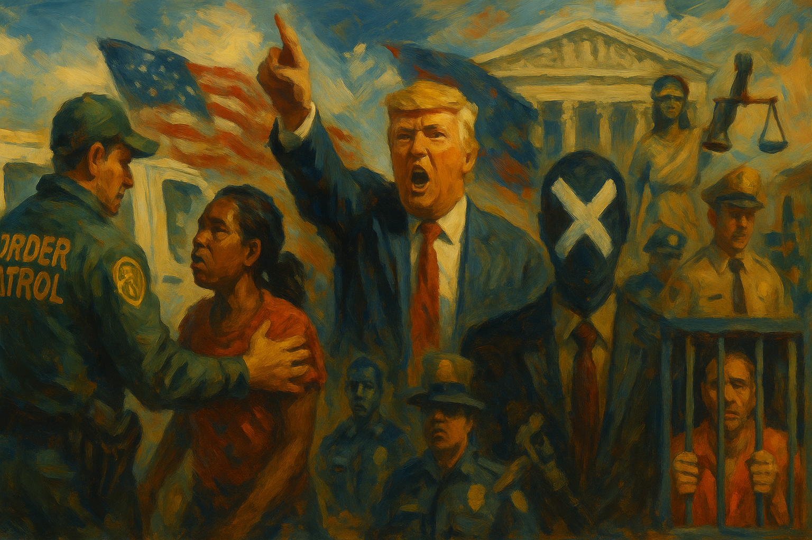

<!-- Generated by build_publish_week_v1 (appendix post) -->
<!-- Header image: image_wide_week44_appendix.png -->

# Week 44 Appendix: Sedition Charge, Files Forced Open

*A presidential call for execution of dissenting lawmakers and a veto-proof transparency law collided this week, leaving the clock nearly frozen.*

This week was defined by an extraordinary convergence of mass immigration enforcement, presidential threats of political violence, and a rare bipartisan transparency victory undercut by executive maneuvering to blunt it. Operation Charlotte's Web produced over 200 arrests including documented detentions of U.S. citizens, closed schools and businesses, and triggered rapid community mobilization. Simultaneously, Trump's forced signature on the Epstein Files Transparency Act was immediately followed by DOJ investigations of political opponents designed to invoke exemptions blocking disclosure. Most alarming was Trump's public call for the arrest and execution of six Democratic lawmakers who reminded troops of their duty to refuse illegal orders—an unprecedented presidential threat against sitting members of Congress. Courts pushed back repeatedly (Texas gerrymander, Comey prosecutorial misconduct, National Guard deployments), while the administration deepened emoluments concerns via Saudi business deals coinciding with arms sales and a presidential dismissal of the Khashoggi murder.

Power and Authority

1. DHS / Border Patrol launched Operation Charlotte's Web, an immigration enforcement surge in Charlotte, North Carolina (2025-11-15): Federal agents conducted a coordinated multi-day enforcement operation in a Democratic-led city despite local objections, raising questions about federal power directed at disfavored jurisdictions.

2. Trump administration reviewed federal funds for New York City for possible cancellation after Mamdani's mayoral win (2025-11-15) *[single source]*: Consideration of withdrawing federal funding based on a city's electoral outcome represents potential retaliatory use of federal power against a disfavored jurisdiction.

3. Trump administration pursued a $2 billion Defense Department renaming to Department of War (2025-11-15): A costly symbolic rebranding of a major federal department diverts resources and signals militarized rhetoric without legislative debate over the expenditure.

4. Trump was encouraged to intervene in a state election-fraud conviction of Tina Peters (2025-11-15): Pressure on the president to aid an ally convicted of election-related misconduct raises concerns about executive interference in state accountability for election interference.

5. Trump threatened to sue the BBC for $1 to $5 billion despite the network's apology (2025-11-15): A sitting president's threat of a massive lawsuit against a foreign broadcaster raises concerns about executive intimidation of the press through litigation.

6. Trump called for Indiana state senators to be primaried over redistricting refusal (2025-11-16): Presidential threats to remove state legislators through primary challenges for resisting a redistricting scheme demonstrate use of electoral coercion to override state legislative independence.

7. Trump personally attacked Reps. Massie and Paul over marriage and personal matters (2025-11-16): Public presidential ridicule of members of Congress, including invoking a deceased spouse, represents use of executive platform to punish political dissent within his own party.

8. Trump withdrew endorsement of Rep. Marjorie Taylor Greene and backed a primary challenger (2025-11-16): Withdrawal of support for a loyal ally over policy disagreement, paired with threats to fund her replacement, shows use of executive influence to reshape party representation.

9. Trump reversed opposition and called for release of Epstein files (2025-11-16): The president's shift from resisting to endorsing a transparency measure, following mounting bipartisan pressure, tested the balance between executive control and legislative accountability.

10. Trump directed DOJ investigation into Epstein-linked figures including Bill Clinton and Larry Summers (2025-11-15): Directing prosecutors to investigate political rivals connected to a scandal creates a mechanism to withhold documents under investigation exemptions, weaponizing law enforcement.

11. New Orleans / Border Patrol identified as next target for federal immigration enforcement (2025-11-17): Federal planning to extend mass enforcement operations to another Democratic-led city signals a coordinated pattern of targeting disfavored jurisdictions.

12. Trump issued National Adoption Month proclamation (2025-11-17): A routine ceremonial proclamation establishing a national observance carries limited direct democratic impact but signals administration family-policy priorities.

13. State Department proposed suspending 38 universities from a federal research partnership over DEI hiring practices (2025-11-17) *[single source]*: Using access to a federal program as leverage to force universities to abandon diversity policies represents government pressure to reshape academic institutions along ideological lines.

14. Trump signaled willingness to meet with NYC Mayor-elect Mamdani (2025-11-17) *[single source]*: A potential meeting between a president who threatened to strip a rival's citizenship and that newly elected official tests engagement across sharp ideological lines after an election.

15. Trump pardoned Binance founder Changpeng Zhao after Binance's business deal with Trump-linked crypto firm (2025-11-17): A pardon for a money-laundering conviction following a lucrative business arrangement with the president's crypto venture raises serious conflict-of-interest and corruption concerns.

16. Trump pardoned white-collar fraud offender Charles Scott (2025-11-17) *[single source]*: A pardon for a convicted stock-manipulation fraudster after minimal time served signals that political connections can override standard criminal accountability.

17. Bill Pulte fired Federal Housing Finance Agency officials investigating him (2025-11-15): An agency head removed staff who were examining his own alleged misuse of mortgage records, undermining internal accountability mechanisms.

18. Trump quietly pardoned Rep. Diana Harshbarger's husband (2025-11-15): An unannounced pardon benefiting a sitting congresswoman's family member illustrates use of clemency power for personal or political favor rather than transparent justice.

19. Trump administration conducted military occupations of US cities costing nearly half a billion dollars (2025-11-15) *[single source]*: Large-scale, costly deployment of military-linked forces to domestic cities raises constitutional concerns about militarization of civilian space and executive overreach.

20. Trump signed the Epstein Files Transparency Act into law (2025-11-20): The president's signature on a bipartisan transparency mandate followed sustained congressional pressure, though the law includes exemptions that could limit full disclosure.

21. Texas Governor Greg Abbott designated CAIR and Muslim Brotherhood as terrorist organizations without federal authority (2025-11-18): A state official's unilateral terrorist designation, a power reserved to the federal government, targets a religious minority group and exceeds constitutional limits on state authority.

22. President Trump designated Commerce officials to exercise government equity control over U.S. Steel (2025-11-20): Direct presidential appointment of officials to control a private corporation through a government-held equity stake raises conflict-of-interest and separation-of-powers questions.

23. Trump administration announced expanded offshore oil and gas drilling off California and Florida (2025-11-20) *[single source]*: A major rollback of environmental leasing limits, opposed by state officials from both parties, prioritizes fossil-fuel expansion over local and bipartisan environmental objections.

24. Trump administration proposed rollback of Endangered Species Act protections (2025-11-20): Weakening a foundational environmental law to favor economic and energy interests over species protection reduces regulatory safeguards despite strong public support for the law.

25. Trump called for arrest and execution of six Democratic lawmakers over military-oath video (2025-11-20): A sitting president publicly demanded the arrest and execution of elected members of Congress for protected speech, an unprecedented threat against legislative dissent.

26. White House officials (Miller, Leavitt) mischaracterized lawmakers' statements as calls for insurrection (2025-11-20): Senior officials falsely portrayed lawmakers' reminder to refuse illegal orders as incitement to defy lawful command, providing cover for presidential threats against Congress.

27. Trump threatened legal consequences against Democratic lawmakers over military oath video (2025-11-21): Continued presidential threats of prosecution against elected officials for warning troops about illegal orders raise serious separation-of-powers and free-speech concerns.

28. Trump met with NYC Mayor-elect Mamdani at the White House (2025-11-21): A cooperative meeting between the president and a mayor-elect he previously vilified signals unpredictable executive engagement across ideological lines on shared economic concerns.

29. Trump designated Saudi Arabia a major non-NATO ally and approved F-35 sales despite intelligence and Pentagon objections (2025-11-19): Elevating a foreign partner's military status and approving advanced arms sales over expert objections, amid concurrent personal business deals, raises conflict-of-interest concerns.

30. Trump dismissed the Khashoggi murder while hosting Saudi Crown Prince at the White House (2025-11-18): The president publicly rejected US intelligence findings implicating a foreign leader in a journalist's murder while announcing major investment and defense deals with that leader.

31. Trump announced cryptocurrency business and ended regulatory clampdown on the industry (2025-11-17): The president's personal entry into the crypto business while simultaneously reducing regulatory oversight of that industry constitutes a direct conflict of interest.

32. Trump Organization negotiated real estate deals in Saudi Arabia and the Maldives with foreign-government-linked developers (2025-11-16): Concurrent presidential-family business deals with foreign governments during official diplomatic and security negotiations raise emoluments and conflict-of-interest concerns.

33. Trump set one-week deadline for Venezuela's Maduro to leave the country (2025-11-21): A unilateral presidential ultimatum to a foreign head of state to relinquish power, without international coordination, raises questions about executive overreach in foreign affairs.

Institutions and Governance

1. Charlotte-Mecklenburg Police Department declined to participate in federal immigration enforcement operation (2025-11-15): A local police department's refusal to assist a federal enforcement operation illustrates a jurisdictional check on federal authority within local law enforcement practice.

2. House Democrats obtained the 218th signature to force a vote on Epstein files release (2025-11-16): Reaching the threshold needed to bypass leadership obstruction demonstrates legislative capacity to compel a floor vote against institutional resistance.

3. Sen. Tom Barrasso signaled the Senate may not vote on the Epstein files measure (2025-11-16) *[single source]*: A senior senator's suggestion that the Senate could ignore a House-passed transparency measure represents a potential obstruction of legislative accountability.

4. House of Representatives passed the Epstein Files Transparency Act 427-1 (2025-11-18): Near-unanimous passage of a bill compelling disclosure of federal investigative records demonstrates rare bipartisan legislative assertion of transparency and oversight authority.

5. Senate passed the Epstein Files Transparency Act by unanimous consent (2025-11-19): Rapid, unopposed Senate passage of a House-passed transparency bill, without amendment, sent a disclosure mandate to the president's desk despite administration resistance.

6. Jack Reed called for legislation restricting domestic military deployments (2025-11-17) *[single source]*: A senator's push for legislation requiring local consent and congressional approval before domestic National Guard deployments represents a check on executive military authority.

7. Golden and Fitzpatrick reached discharge petition threshold on federal worker union rights bill (2025-11-17): A bipartisan discharge petition to reverse an executive order stripping federal union protections reached the votes needed to force a floor vote over Speaker resistance.

8. Federal magistrate judge (William Fitzpatrick) found government misconduct in the DOJ prosecution of James Comey (2025-11-17): A judge's finding of systemic prosecutorial missteps in a politically charged case against a former FBI director undermines public confidence in impartial law enforcement.

9. Transgender Air Force members sued the Trump administration over revoked early retirement benefits (2025-11-17): A lawsuit challenging the retroactive stripping of retirement benefits from transgender service members tests equal-protection limits on executive personnel authority.

10. Various federal courts issued rulings and procedural orders in ongoing litigation against Trump administration actions (2025-11-17): A wide docket of court rulings, stays, and procedural orders shows continuous judicial engagement with challenges to executive branch immigration, funding, and civil-liberties policies.

11. Federal magistrate judge (Virginia) found prosecutor Lindsey Halligan provided false statements to grand jury in Comey case (2025-11-17): A judicial finding that a Trump-appointed prosecutor misrepresented the law to a grand jury raises serious questions about the integrity of a politically sensitive prosecution.

12. Federal judge dismissed Trump administration lawsuit challenging New York courthouse arrest policies (2025-11-17): A court's rejection of a federal attempt to force state cooperation with immigration enforcement affirms limits on federal power over state sanctuary policies.

13. Federal judge ordered disclosure of grand jury materials in Comey case (2025-11-17): A court order compelling release of grand jury records exposes deep concerns about prosecutorial integrity in the politically charged case against a former FBI director.

14. House Democrats withdrew censure resolution against Republican Cory Mills (2025-11-18): The withdrawal of a censure motion immediately after a parallel measure against a Democrat failed suggests possible cross-party coordination to shield members from accountability.

15. House Republicans brought and lost a censure vote against Rep. Stacey Plaskett over Epstein-related texts (2025-11-18): A failed party-line censure attempt, followed by a reciprocal withdrawal of charges against a Republican, raises concerns about selective and inconsistent institutional accountability.

16. House Oversight Committee (Democratic members) requested deposition from Prince Andrew in Epstein investigation (2025-11-18) *[single source]*: A congressional request for testimony from a foreign royal in a major criminal-justice inquiry tests the reach and limits of legislative oversight power.

17. Meeks, Smith, Himes, Thompson, Crow, Omar introduced a War Powers Resolution to block Caribbean strikes (2025-11-18) *[single source]*: Democratic lawmakers invoked the War Powers Act to challenge continued military strikes conducted without congressional authorization beyond the statutory deadline.

18. Federal three-judge panel (Texas) blocked Texas's 2025 congressional redistricting map as racially gerrymandered (2025-11-18): A federal court ruling striking down a mid-decade partisan and racial gerrymander affirms judicial checks on manipulation of electoral maps ahead of the midterms.

19. Judge Jerry Smith issued an extraordinary dissent attacking a colleague and invoking George Soros in the Texas redistricting case (2025-11-19) *[single source]*: A federal judge's unusually personal dissent, introducing unsubstantiated claims of outside influence, raises concerns about judicial decorum and politicization of the bench.

20. Judge Michael Nachmanoff held hearing exposing further prosecutorial misconduct in the Comey case (2025-11-19): Judicial questioning revealed that a grand jury never reviewed the final indictment against a former FBI director, deepening concerns about a politically motivated prosecution.

21. Federal judge blocked termination of Syrian Temporary Protected Status (2025-11-19): A court order halting the administration's attempt to end protected status for Syrian nationals affirms judicial review of executive immigration policy.

22. Judge James Boasberg advanced proceedings on whether administration officials violated deportation-flight order (2025-11-19) *[single source]*: Continued judicial inquiry into potential violation of a prior court order on Venezuelan deportation flights represents ongoing accountability pressure on the executive branch.

23. Federal judge ordered resumption of deferred-action program for abused immigrant youth (2025-11-19) *[single source]*: A court order restoring protections for abused undocumented youth demonstrates judicial willingness to check executive rollback of humanitarian programs.

24. Federal appeals court declined to revive Trump's defamation lawsuit against CNN (2025-11-18): A court's rejection of a meritless defamation suit against a news network affirms First Amendment protection for critical political commentary.

25. Sheldon Whitehouse launched investigation into alleged self-dealing at the Kennedy Center (2025-11-21) *[single source]*: A senator's formal investigation into alleged misuse of a federal cultural institution for political patronage exercises congressional oversight of executive conduct.

26. Sen. Lindsey Graham objected to unanimous consent repealing a taxpayer damages provision benefiting senators (2025-11-20): A senator's objection to unanimously repealing a self-enriching provision, followed by his announced lawsuit against the government, highlights conflict-of-interest concerns in Congress.

27. Ghislaine Maxwell refused to cooperate with House Oversight Committee investigation (2025-11-21): A key witness's refusal to answer questions in a congressional inquiry limits legislative ability to investigate executive handling of a major criminal case.

28. Marjorie Taylor Greene announced resignation from Congress following presidential retaliation (2025-11-21): A sitting representative's forced departure after presidential threats and endorsement withdrawal illustrates erosion of independent legislative representation.

29. Federal court ruled National Guard deployment in Washington D.C. was illegal but stayed the order pending appeal (2025-11-20): A court found unlawful domestic use of National Guard troops for policing but delayed enforcement, leaving the deployment temporarily in place during appeal.

Economic Structure

1. Ultrarich households concentrated wealth into insulated private systems (2025-11-15): Reporting on extreme wealth concentration and private parallel institutions illustrates how economic inequality allows the wealthiest to bypass ordinary civic and legal constraints.

2. Chinese government launched anti-involution campaign to curb corporate competition (2025-11-15) *[single source]*: State coordination of pricing among competing firms in a foreign economy illustrates centralized economic control that may raise consumer costs and limit market choice.

3. Arbor Data Science reported record-high grocery prices for U.S. families (2025-11-16) *[single source]*: New data showing record grocery costs undercuts administration claims of economic improvement and highlights rising cost-of-living pressure on ordinary households.

4. Dr. Oz declined to commit to protecting expiring ACA subsidies (2025-11-16): A senior health official's refusal to guarantee continued insurance affordability signals potential loss of coverage for millions as subsidies expire without a replacement plan.

5. Kevin Hassett blamed prior administration for current cost-of-living conditions (2025-11-16) *[single source]*: A senior economic adviser's deflection of responsibility using disputed cost claims exemplifies a pattern of avoiding accountability for present economic performance.

6. EPA issued a wide range of routine regulatory actions on pesticide tolerances, air-quality plans, and information collections (2025-11-17): A large volume of ordinary administrative rulemaking illustrates the continuing operation of federal regulatory machinery affecting agriculture, industry, and environmental compliance.

7. FDA issued multiple draft and final guidance documents on drug and device regulation (2025-11-17): Routine FDA rulemaking establishing scientific and regulatory standards affects drug approval pathways, market competition, and consumer product safety oversight.

8. FCC revised broadcast filing schedules and issued information collection notices (2025-11-17): Routine regulatory adjustments to broadcast licensing and reporting requirements reflect ordinary administrative operation of federal communications oversight.

9. Trump announced cryptocurrency business venture and pursued crypto-capital initiative (2025-11-17) *[single source]*: A president launching his own crypto business while advancing deregulatory crypto policy underscores direct financial conflicts between personal profit and public regulation.

10. Trump administration requested emergency malicious-prosecution settlement discussions with Michael Flynn's attorneys (2025-11-17): Repeated government delays in a legally weak lawsuit filed by a Trump ally suggest a taxpayer-funded settlement is being prepared as a political reward.

11. Trump claimed unilateral authority to decide his own $230 million settlement payout (2025-11-17) *[single source]*: The president's assertion of personal control over hundreds of millions in taxpayer funds paid to himself bypasses normal legal review and raises severe conflict-of-interest concerns.

12. Trump administration proposed restricting immigrant access to public benefits tied to green-card eligibility (2025-11-17) *[single source]*: A rule conditioning legal status on avoiding public benefits creates a two-tiered system disproportionately burdening low-income immigrants seeking permanent residency.

13. Beyond the Bars published research exposing exploitation of formerly incarcerated workers by Florida temp agencies (2025-11-18) *[single source]*: A report documenting systemic wage suppression for people with criminal records highlights structural barriers to economic opportunity for a vulnerable population.

14. Trump administration criticized for proposing 50-year mortgages that favor banks over homebuyers (2025-11-18): A housing-affordability proposal extending mortgage terms to fifty years drew criticism for benefiting lenders while doubling homeowners' debt timelines.

15. Congress deliberated a roughly $1 trillion 2026 military budget with heavy contractor subsidization (2025-11-19) *[single source]*: Analysis showing over half of Pentagon spending flows to private contractors, with billions funding shareholder buybacks, illustrates redistribution of public funds toward corporate profit.

16. Fox News poll / Labor Department reported nearly half of Americans harmed by economic policy and rising unemployment (2025-11-20): New polling and unemployment data showing widespread economic hardship, including the highest jobless rate since 2021, contradict official claims of economic success.

17. Nasdaq notified Alt5 Sigma, a company with Trump family financial ties, of listing non-compliance (2025-11-19) *[single source]*: Regulatory non-compliance at a company where the Trump family holds equity raises governance questions about oversight of ventures tied to presidential relatives.

18. White House officials discussed CNN programming and host removals with a Paramount bidder (2025-11-20): Executive branch coordination with a private media acquirer over removing specific news hosts raises concerns about government pressure on independent journalism.

19. Kennedy Center granted discounted and free venue rentals to Trump-aligned groups and FIFA (2025-11-21): Allegations that a federally funded cultural institution provided major financial benefits to politically connected organizations raise concerns about misuse of public resources.

20. Trump issued executive order modifying tariff scope on Brazilian agricultural imports (2025-11-20): Unilateral modification of emergency tariffs on a trading partner demonstrates continued reliance on executive economic emergency powers to reshape trade policy.

21. Trump issued proclamation exempting coke-oven facilities from EPA emissions standards for two years (2025-11-21): A presidential exemption suspending pollution-control requirements for an industrial sector raises questions about the scope of authority to override federal environmental regulation.

22. Noah Smith / economic commentary reported sharp decline in consumer sentiment and manufacturing employment tied to tariffs (2025-11-21) *[single source]*: Analysis linking falling consumer confidence and manufacturing job losses to tariff policy and the government shutdown highlights growing public dissatisfaction with economic management.

Civil Rights and Dissent

1. Border Patrol detained U.S. citizen Willy Aceituno despite presenting citizenship documents (2025-11-15) *[single source]*: The unlawful detention of a naturalized citizen during an enforcement sweep raises serious constitutional concerns about profiling and denial of due process rights.

2. Charlotte residents / protesters organized public protest against immigration enforcement operation (2025-11-15): Hundreds of residents publicly protested and documented federal enforcement activity, exercising First Amendment rights to assembly and dissent in response to mass raids.

3. Law enforcement / DHS arrested two protesters outside a DHS office (2025-11-16) *[single source]*: Arrests of demonstrators outside a federal enforcement office raise questions about the permissible scope of protest during a controversial immigration operation.

4. Charlotte community organized rapid-response legal and protective networks after ICE raids (2025-11-16) *[single source]*: Rapid civil-society mobilization to provide legal aid and community defense demonstrates grassroots capacity to respond to sudden federal enforcement actions.

5. Trump attacked Rep. Marjorie Taylor Greene with inflammatory rhetoric, prompting threats against her (2025-11-16): Presidential attacks on a sitting representative, which she said endangered her safety, illustrate the risks of executive rhetoric inciting threats against elected officials.

6. Trump supporters publicly burned MAGA merchandise in protest of Trump's attacks on allies (2025-11-16): Visible acts of political dissent among the president's own supporters signal a notable fracture within his base coalition over intra-party attacks.

7. DOJ filed lawsuit demanding Michigan's unredacted voter rolls (2025-11-17) *[single source]*: A federal demand for sensitive, unredacted voter data raises concerns about privacy, potential voter intimidation, and federal overreach into state election administration.

8. Aric Nesbitt requested federal election monitors in Michigan (2025-11-17) *[single source]*: A state Republican leader's request for federal election monitors ahead of a competitive election raises concerns about federalizing control over state election administration.

9. Border Patrol / DHS conducted 250+ arrests across North Carolina including citizen detentions and school/church raids (2025-11-19): Expanded enforcement surge produced mass school absences, business closures, and detentions of U.S. citizens, chilling civic life and access to education for immigrant communities.

10. CBP agents raided an after-school program serving immigrant children (2025-11-18) *[single source]*: Enforcement action targeting a children's after-school program instilled fear in a vulnerable community and disrupted access to educational services for children.

11. Jake Lang led anti-Muslim rally with Qur'an desecration and racial slurs in Dearborn, Michigan (2025-11-18) *[single source]*: A Trump-pardoned figure's organized rally targeting a Muslim-majority city with religious desecration and xenophobic slurs represents incitement against a religious and ethnic minority.

12. Six Democratic lawmakers released video instructing troops they must refuse illegal orders (2025-11-18): Sitting members of Congress publicly reminded service members of their legal duty to refuse unlawful orders, prompting a severe presidential backlash against their speech.

13. 1,000+ state anti-LGBTQ bills introduced across state legislatures in 2025 (2025-11-20) *[single source]*: An unprecedented volume of restrictive legislation targeting transgender rights across the states marks a historic escalation in legal exclusion of a vulnerable minority.

14. 50501 Movement / trans community commemorated Transgender Day of Remembrance amid documented violence and policy erasure (2025-11-20): Public commemoration of 58 transgender deaths in 2025 highlighted the human cost of policy rollback and rising violence against a targeted community.

15. Jury (Washington DC) / DOJ acquitted veteran protester and dismissed charges against another for anti-ICE demonstrations (2025-11-21) *[single source]*: Jury acquittal and dismissal of protest-related charges against two military veterans affirmed First Amendment protections against overreaching prosecution of dissent.

16. ICE detained a U.S. citizen teenager during school lunch break in Oregon (2025-11-21) *[single source]*: The detention of an American teenager despite asserting citizenship, followed by attempted obstruction charges, raises serious due-process and civil-rights concerns.

17. ICE detained double amputee Rodney Taylor without bond for nearly a year despite deteriorating health (2025-11-21): Prolonged detention without bond of a medically vulnerable immigrant, despite a pending habeas petition, raises serious due-process and humanitarian concerns.

18. Trump administration dismantled independent immigration detention oversight offices (2025-11-21): Elimination of federal offices monitoring detention conditions removes independent accountability mechanisms for the treatment of detained immigrants.

19. ICE deported a college student to Honduras within 48 hours despite an emergency court order (2025-11-20) *[single source]*: Rapid removal of a longtime U.S. resident in apparent defiance of a court-ordered delay undermines judicial authority over immigration enforcement and due process.

20. DOJ sued California over in-state tuition for undocumented students (2025-11-20) *[single source]*: A federal lawsuit challenging state educational access policy for undocumented students narrows educational opportunity for a vulnerable population based on immigration status.

21. Mahmoud Khalil filed lawsuit demanding release of government communications with anti-Palestinian groups (2025-11-21) *[single source]*: A detained activist's lawsuit alleging coordination between federal agencies and private groups to target pro-Palestinian speech raises concerns about suppression of political dissent.

22. Jeana Gamble / Fairhope Police arrested a peaceful protester wearing a costume during an ICE demonstration (2025-11-21) *[single source]*: The forceful arrest of a peaceful protester expressing political speech through costume raises concerns about proportional use of force against demonstrators.

23. Daryn Herzberg (veteran) / federal agent was allegedly assaulted by a federal agent during an ICE facility protest (2025-11-21) *[single source]*: Video evidence of an alleged assault on an unarmed veteran protester by federal agents raises accountability concerns about use of force against demonstrators.

Information, Memory and Manipulation

1. Chinese government censored social media content deemed excessively pessimistic (2025-11-15) *[single source]*: State suppression of online expression about economic hardship in a foreign country narrows public discourse and limits citizens' ability to voice legitimate grievances.

2. Trump called a Bloomberg reporter "piggy" on Air Force One (2025-11-15): A president's public denigration of a female journalist asking about a scandal reflects a pattern of gendered hostility toward the press that undermines press freedom.

3. Trump demanded NBC fire Seth Meyers over critical commentary (2025-11-15): Presidential pressure on a network to remove a specific critic from the air illustrates continued attempts to intimidate media outlets over unfavorable coverage.

4. Gregory Bovino / Border Patrol publicized arrest numbers from Charlotte enforcement operation on social media (2025-11-16): A federal commander's public social media posts about enforcement arrest statistics shaped narrative framing of the operation's scope and success.

5. House Oversight Committee released more than 20,000 Epstein estate documents (2025-11-16): Release of a large trove of documents exposing networks of powerful figures connected to a convicted sex offender advances public accountability and historical record.

6. Community Note fact-checked a congressman's claims about the Epstein files as a hoax (2025-11-16): A crowd-sourced fact-check exposing a lawmaker's prior record undermines his credibility on opposing document release and supports public information accuracy.

7. Sen. Chris Murphy characterized the Epstein situation as a major corruption scandal (2025-11-16) *[single source]*: A senator's public assessment linking file-suppression efforts to serious implication in wrongdoing keeps public attention on transparency and accountability.

8. Sec. Rubio designated a non-existent Venezuela cartel as a foreign terrorist organization (2025-11-16): Designating a metaphorical term as an official terrorist entity undermines the credibility of counterterrorism designations and may serve as pretext for military escalation.

9. Trump posted memes instructing the Attorney General to arrest political opponents (2025-11-17): Public social media posts appearing to direct prosecution of political enemies undermine the independence of law enforcement from partisan control.

10. Trump administration (Kevin Hassett) claimed a "Golden Age" economy despite weakening data (2025-11-17): Public claims of economic success contradicted by contemporaneous data misrepresent economic conditions and undermine informed public understanding of the country's finances.

11. Brooke Rollins made a false claim about causes of beef price increases (2025-11-17) *[single source]*: A cabinet secretary's factually contradicted claim about the cause of price increases exemplifies inaccurate economic messaging from the administration.

12. Corporation for Public Broadcasting restored NPR funding through court settlement (2025-11-17) *[single source]*: Court-ordered restoration of public media funding cut under White House pressure demonstrates judicial protection of independent journalism against executive intimidation.

13. Trump ordered DOJ investigation of Democrats to justify withholding Epstein documents (2025-11-17): Using a self-created investigation as a pretext to withhold congressionally mandated records represents a strategy to obstruct transparency while appearing compliant.

14. Trump attacked Marjorie Taylor Greene with inflammatory rhetoric that led to threats (2025-11-16): Reported hoax deliveries and threats following presidential attacks on a representative demonstrate real-world consequences of inflammatory executive rhetoric.

15. Trump threatened to revoke ABC's broadcast license over Khashoggi question (2025-11-18): A presidential threat to strip a network's license in retaliation for a critical question represents direct executive intimidation of the press through regulatory power.

16. Trump attacked female reporters Bruce and Lucey during press conference (2025-11-18): Presidential verbal attacks on two female journalists for asking substantive questions undermine press freedom and normalize gendered hostility toward reporters.

17. Fox News did not cover Epstein survivors' press conference (2025-11-18): Selective editorial omission of survivor testimony on a major transparency issue by a major outlet affects public awareness of institutional accountability.

18. Trump defended platforming of white nationalist Nick Fuentes (2025-11-18): Presidential defense of a commentator who interviewed a white nationalist figure signals normalization of extremist rhetoric within conservative media circles.

19. Trump posted claims that his felony convictions and Russia investigation were illegitimate (2025-11-18): Public denial of the legitimacy of judicial convictions and federal investigations undermines acceptance of judicial outcomes and rule-of-law accountability.

20. HHS Secretary Kennedy ordered CDC to alter vaccine-autism guidance against scientific consensus (2025-11-19): Politically directed changes to public health guidance undermine scientific credibility and risk spreading misinformation that could harm public health outcomes.

21. Trump spread false claims that the 2020 election was rigged (2025-11-19) *[single source]*: Continued public promotion of debunked election-fraud claims undermines confidence in electoral integrity and normalizes denial of legitimate election outcomes.

22. DOJ investigated a judicially discredited conspiracy theory about Venezuela and the 2020 election (2025-11-21): Federal investigative resources directed toward a defamation-settled conspiracy theory instrumentalize law enforcement to potentially rewrite electoral history.

23. Karoline Leavitt defended Trump's "piggy" insult toward a reporter (2025-11-21): White House defense of a demeaning remark toward a female journalist signals institutional tolerance for intimidation and hostility toward the press.

24. JD Vance recommended a far-right conspiracy figure to lead Washington Post political coverage (2025-11-21): The vice president's public recommendation of an extremist figure for a senior editorial post signals executive-branch interest in reshaping mainstream media leadership.

25. Sen. Markwayne Mullin repeated Russian government talking points about Crimea on Fox News (2025-11-21): A U.S. senator's public repetition of foreign propaganda narratives about disputed territory undermines factual discourse on international sovereignty.

26. Trump demanded Jimmy Kimmel be fired via late-night social media post (2025-11-21): Repeated presidential demands for the removal of a late-night host over critical commentary exemplify continued pressure on media organizations to silence critics.

27. Labor Department cancelled October CPI inflation report and delayed November data release (2025-11-21): Postponement of key inflation data during a critical policy period raises questions about transparency and independence of official economic reporting.

28. Trump co-authored Ukraine peace plan containing Russian-language phrasing with Putin's envoy (2025-11-21): Evidence that a U.S. peace proposal was jointly drafted with a Russian envoy raises questions about the independence of American foreign policy formulation.

29. State Department official announced U.S. will not fund HIV prevention drug for South Africa (2025-11-17) *[single source]*: Withdrawal of support for HIV prevention in the country with the world's largest HIV-positive population reverses decades of U.S. global health leadership.

30. Gerald Ford (historical documents) White House blocked publication of Church Committee report on CIA assassination plots (2025-11-20) *[single source]*: Newly released historical documents show a past administration's active efforts to suppress a landmark congressional report exposing illegal covert operations.

